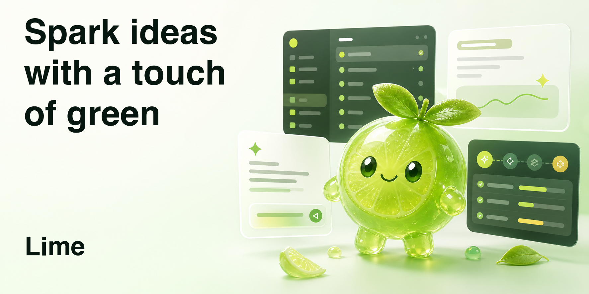
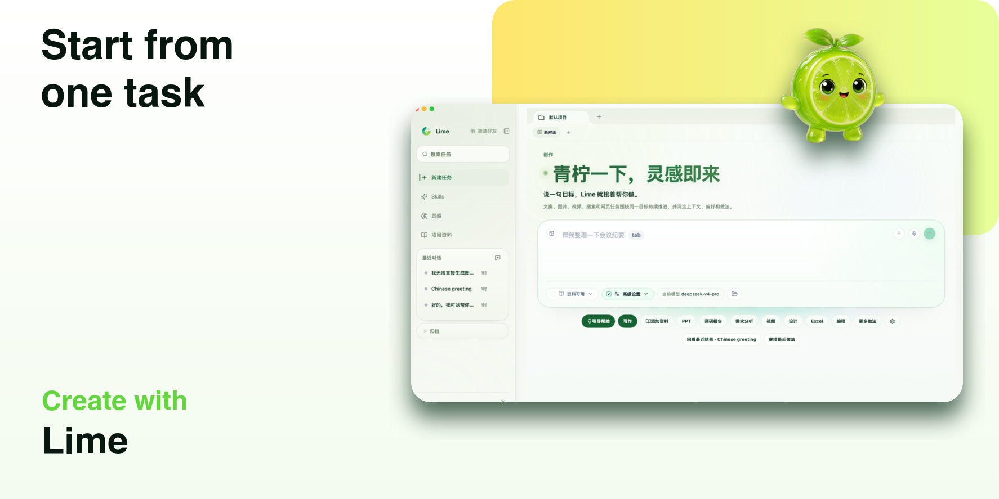
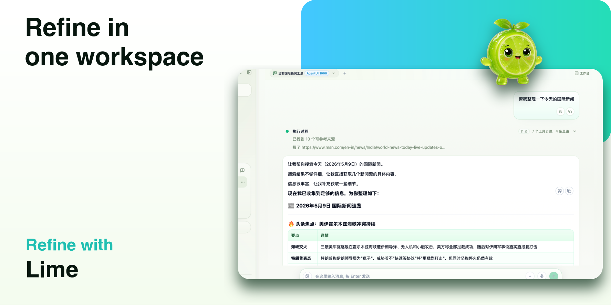
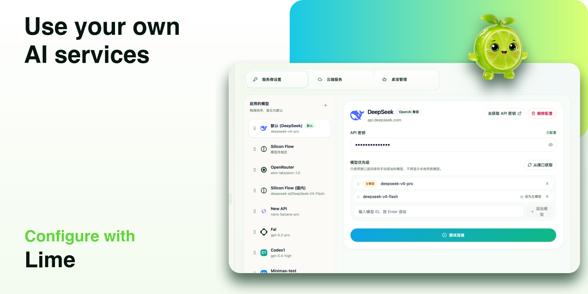

<div align="center"><a name="readme-top"></a>



# Lime

### Spark ideas with a touch of green

**Open-source AI content workspace for Chinese creators**

Desktop writing, research, prompt management, knowledge base, and multi-model workflows for long-form content work.

[简体中文](./README.md) · **English** · [Docs](./docs/README.md) · [Release Notes](./RELEASE_NOTES.en.md) · [Issues](https://github.com/limecloud/lime/issues)

<p>
  <a href="https://github.com/limecloud/lime/releases"></a>
  
  
  
</p>

Lime keeps references, ideas, generation, revision, and review in one place, so content creation becomes a workflow you can continue instead of a one-off chat.

<sub>The Simplified Chinese README is the primary version. This English page is a companion for international readers.</sub>

</div>

---

<details>
<summary><kbd>Table of Contents</kbd></summary>

- [What is Lime?](#what-is-lime)
- [What you can do with Lime](#what-you-can-do-with-lime)
- [Real creator workflows](#real-creator-workflows)
- [A simple workflow](#a-simple-workflow)
- [Core Workflow](#core-workflow)
- [Who Lime is for](#who-lime-is-for)
- [If you are searching for these tools](#if-you-are-searching-for-these-tools)
- [Who Lime is not for](#who-lime-is-not-for)
- [Quick Start](#quick-start)
- [Tech Stack and Platforms](#tech-stack-and-platforms)
- [FAQ](#faq)
- [License](#license)
- [Disclaimer](#disclaimer)

</details>

---

## What is Lime?

Lime is an open-source Tauri desktop AI workspace for Chinese creators, brand operators, research writers, and small teams. It brings AI writing, topic research, reference management, prompt reuse, knowledge organization, and multi-model workflows into one local desktop product.

Think of Lime as an AI workspace for long-running content projects:

- Not just one prompt and one answer, but a project that can keep moving forward.
- Not repeatedly collecting references and rewriting prompts, but saving context, style, and repeatable methods.
- Not leaving generated results scattered across chat history, but keeping useful outputs available for the next round.
- Not locking you into one AI service, but letting you use the providers and models you already configure.

If you often switch between bookmarks, documents, chat tools, image tools, and model dashboards, Lime is designed to bring those steps back into one creation space.

---

## What you can do with Lime

- **AI writing and content creation**: write WeChat articles, Xiaohongshu notes, video scripts, podcast outlines, and live-stream talking points.
- **Research and knowledge organization**: collect web pages, notes, screenshots, interviews, and historical materials, then turn them into reports or briefs.
- **Topic analysis and content review**: analyze viral posts, competitors, publishing rhythm, and expression style.
- **Prompt management and style reuse**: save writing patterns, brand tone, topic methods, and team templates.
- **Multimodal preparation**: draft image prompts, cover directions, slide outlines, or web page drafts.
- **Multi-model workflows**: use your own AI providers and models in the same task to revise, expand, compress, or adapt content for another platform.

---

## Real creator workflows

### 1. WeChat writer: too many references, no clear draft

You want to write a timely opinion article. The browser has a dozen links open, WeChat favorites hold a few ideas, and you already have a position, but the draft still feels scattered.

With Lime, you can put references and rough notes into the same task, ask AI to organize angles and argument order, then continue asking: which part is not sharp enough? Which paragraph sounds generic? Can the title be more clickable without becoming clickbait?

What remains is not just one answer. It is a traceable path from research to first draft, then from first draft to final version.

### 2. Xiaohongshu creator: one topic, many expressions

You may have a strong topic, but it needs to become a practical guide, a story, a product recommendation, and an interactive comment prompt. Rewriting each version is tiring, and your own style is easy to lose.

In Lime, you can save your usual tone, successful past notes, and title preferences. The next generation is not just "write one post for me"; it tries to continue in your own expression pattern.

### 3. Brand operator: today's delivery is more than one piece of copy

A product launch needs key visual copy, social posts, community warm-up messages, FAQs, short-video scripts, and an explanation that leadership can read. Source material comes from product docs, user feedback, competitor pages, and meeting notes.

Lime fits this kind of continuous task: organize selling points first, generate multiple expressions, then split results across channels. After one revision round, you can review which wording is clearer and reuse it in the next round.

### 4. Research writer: more sources need a better thinking space

You may be preparing an industry observation, course material, topic study, or in-depth report. The challenge is not a lack of information. It is turning too much material into your own structure.

With Lime, you can add materials gradually, let AI classify them, then keep asking about contradictions, gaps, key judgments, and possible content angles. It behaves more like a workspace that helps you repeatedly inspect sources and structure ideas.

### 5. Small team: not everyone should start from a blank prompt

One teammate may be good at titles, another at topic selection, another at reviewing data. These skills often stay in individual heads and are hard to reuse.

Lime can turn stable methods into reusable task entries. The next time a new teammate writes a weekly report, reviews a campaign, analyzes competitors, or prepares a launch draft, they do not need to start from a blank input box.

---

## A simple workflow

1. Create a task, such as "write a WeChat article about choosing AI tools".
2. Add references, ideas, past articles, or project background.
3. Choose your AI provider and model.
4. Let Lime organize direction, outline, or source structure first.
5. Continue generating, revising, compressing, expanding, or adapting the content in the same task.
6. Save useful results as references for the next creation round.

In short: bring the material in, let AI help move it forward, and keep the useful results.

---

## Core Workflow

### Start from one task



Start with one goal and keep references, models, reusable methods, and recent outputs in one place, without first facing a complex tool menu.

### Keep revising in the same workspace



Generation, follow-up questions, revisions, research, and result organization all stay around the current task. This fits articles, reports, scripts, and plans that need multiple rounds of work.

### Use your own AI services



Lime does not provide AI model services. You configure your own providers, provider keys, and preferred models, then use different capabilities for different content tasks.

---

## Who Lime is for

- Content creators, independent media writers, video creators, and Xiaohongshu creators.
- Brand, operations, growth, private-domain, and founder-led marketing teams.
- People who often organize materials, write reports, conduct research, and publish opinions.
- People who want to keep personal writing methods, team templates, and reference materials.
- People already using AI models who want a more stable desktop creation workspace.

---

## If you are searching for these tools

Lime may fit searches such as AI content workspace, desktop AI app, AI writing tool, prompt management, knowledge base, research workflow, multi-model workflow, Chinese creators, 内容创作工作台, 桌面端 AI 应用, 公众号写作, 小红书创作, 选题研究, 素材管理, 提示词管理, 知识库, and 多模型创作流程.

---

## Who Lime is not for

- People who only want to open a web page and ask one casual question.
- People who do not want to configure any AI provider or API key.
- People who expect a tool to automatically judge, publish, and take responsibility for the final result.

Lime is for creators who treat AI as a creation partner: you provide judgment, references, and direction; it helps organize, generate, revise, and review.

---

## Quick Start

### Download and install

Download the installer for your platform from [Releases](https://github.com/limecloud/lime/releases).

- macOS users can download the `.dmg` package or install with Homebrew.
- Windows users can download `Lime_*_x64-setup.exe`.
- Lime currently publishes macOS and Windows builds only. Linux desktop builds are paused.
- If Windows SmartScreen appears, it usually means the installer is unsigned or has not built enough signing reputation. It does not necessarily mean the installer is broken.

macOS users who use Homebrew can run:

```bash
brew tap aiclientproxy/tap
brew install --cask lime
```

### First run

1. Open Lime.
2. Go to the AI provider configuration page.
3. Enter your own provider key and test the connection.
4. Return to the home page and create a content task.
5. Add references or write a goal directly, then start generating.

---

## Tech Stack and Platforms

- Desktop framework: Tauri 2, Rust
- Frontend: React, TypeScript, Vite
- Supported platforms: macOS, Windows
- License: GPLv3

---

## FAQ

### Does Lime provide AI models?

No. Lime is a creation workspace and does not directly provide model services. You need to configure your own available AI provider and provider key. If you are unfamiliar with provider keys, think of them as credentials issued by an AI service provider.

### Will all my materials be uploaded?

Lime prioritizes storing project materials, conversation history, and configuration locally. When you call AI generation, however, relevant input is sent to the AI provider you configured. Please decide whether to use sensitive material according to that provider's policy.

### How is Lime different from a normal chat tool?

A normal chat tool is closer to one question and one answer. Lime emphasizes long-running creation: references can be saved, results can be retained, tasks can continue, and reusable methods can become part of your workflow.

### Can I use it without knowing how to write prompts?

Yes. One goal of Lime is to reduce the cost of starting from a blank prompt every time. You can begin with reusable tasks, existing materials, and historical results, then let AI help you move forward step by step.

---

## License

[GNU General Public License v3 (GPLv3)](https://www.gnu.org/licenses/gpl-3.0)

## Disclaimer

This project is provided for learning and research purposes only. Users are responsible for their own use and risk.

Lime does not directly provide AI model services. Model capabilities are provided by third-party AI service providers configured by the user.

---

<div align="center">

### WeChat Community


Scan the QR code and mention `Lime` to join the discussion group.

</div>
