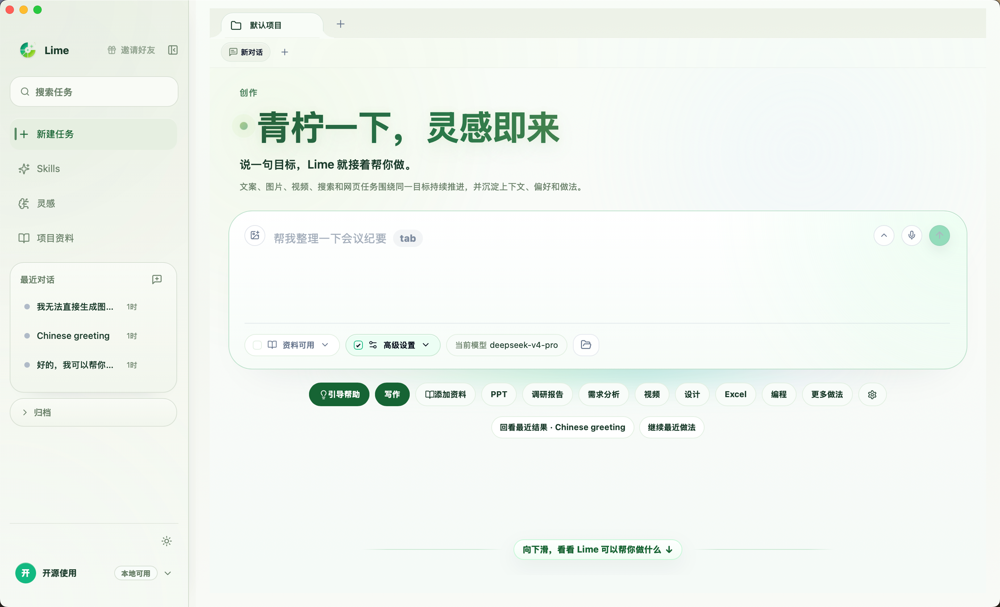
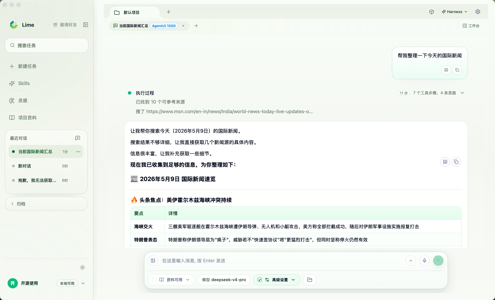
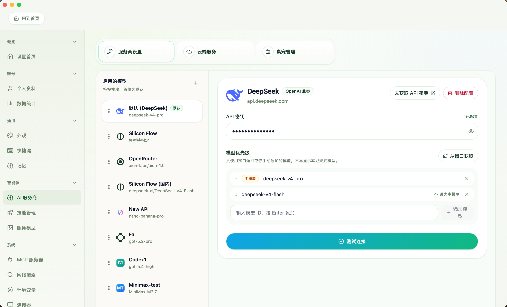

<div align="center">


# Lime

### 青柠一下，灵感即来

**给中文创作者用的开源 AI 内容工作台**

AI content workspace for Chinese creators: desktop writing, research, prompt management, knowledge base, and multi-model workflows.

<p>
  <a href="https://github.com/limecloud/lime/releases"></a>
  
  
  
</p>

把资料、灵感、生成、修改和复盘放在一个地方，让一次创作不是一次性聊天，而是一条能继续推进的工作流。

</div>

---

## Lime 是什么

Lime 是一个开源的 Tauri 桌面端 AI 内容工作台，面向中文创作者、品牌运营、研究型写作者和小团队，覆盖 AI 写作、选题研究、素材管理、提示词沉淀、知识库和多模型创作流程。

English summary: Lime is an open-source desktop AI workspace for Chinese creators to write, research, manage prompts, organize knowledge, and reuse multi-model workflows.

你可以把它理解成一个更适合长期创作的 AI 工作台：

- 不是只问一句、答一句，而是围绕一个项目持续推进
- 不是每次都重新找资料、重新写提示词，而是把参考、风格和做法沉淀下来
- 不是生成完就散落在聊天记录里，而是把结果保存起来，下一次还能继续用
- 不是绑定某一家 AI 服务，而是让你使用自己已经配置好的模型能力

如果你经常在收藏夹、文档、聊天工具、图片工具和模型后台之间来回切换，Lime 想帮你把这些动作收回到同一个创作空间里。

---

## 你可以用 Lime 做什么

- **AI 写作与内容创作**：写公众号文章、小红书笔记、视频脚本、播客提纲和直播话术
- **资料研究与知识整理**：整理网页、笔记、截图、访谈和历史材料，生成报告或简报
- **选题分析与内容复盘**：拆解爆款案例、竞品内容、发布节奏和表达风格
- **提示词管理与风格复用**：保存常用写法、品牌语气、选题方法和团队模板
- **多模态创作准备**：生成图片提示词、封面方向、演示稿结构或网页草稿
- **多模型工作流**：使用自己配置的 AI 服务商和模型，在同一个任务里持续修改、扩写、压缩或换平台发布

---

## 几个创作者会遇到的真实时刻

### 1. 公众号作者：收藏夹很多，但迟迟写不出来

你想写一篇热点观点文。浏览器里开着十几个参考链接，微信收藏里还有几段灵感，脑子里有判断，但一落笔就散。

用 Lime 时，你可以先把参考和零散想法放进同一个任务里，让 AI 帮你整理角度、拆出论证顺序，再继续追问：哪里不够锋利？哪一段像套话？标题能不能更有点击欲但不标题党？

最后留下的不只是一次回答，而是一条从资料到初稿、从初稿到定稿的创作记录。

### 2. 小红书创作者：同一个选题要改成很多种表达

你有一个好选题，但要分别写成干货版、故事版、种草版和评论区互动版。每次重写都很累，而且容易丢掉自己的风格。

在 Lime 里，你可以把自己的常用语气、过去效果好的笔记、标题偏好保存下来。下一次生成时，它不只是“帮你写一篇”，而是尽量沿着你的表达习惯继续写。

### 3. 品牌运营：今天要交的不只是一篇文案

新品要上线，你需要主视觉文案、朋友圈文案、社群预热、FAQ、短视频脚本和一版老板能看的说明。资料来自产品文档、用户反馈、竞品页面和几次会议纪要。

Lime 更适合这种连续任务：先整理卖点，再生成多种表达，再把结果拆到不同渠道。改完一轮后，还能复盘哪些话术更清楚，下一轮继续沿用。

### 4. 研究型创作者：资料越多，越需要一个能继续追问的空间

你可能在做一个行业观察、课程资料、选题研究或深度报告。问题不是没有资料，而是资料太多，读完以后很难变成自己的结构。

用 Lime 时，你可以把资料逐步放进项目里，先让它帮你归类，再追问矛盾点、缺口、关键判断和可写成内容的角度。它更像一个可以反复翻资料、一起整理思路的工作台。

### 5. 小团队：不是每个人都要从零摸索提示词

团队里有人擅长写标题，有人擅长做选题，有人擅长复盘数据。问题是这些经验常常只在个人脑子里，很难复用。

Lime 可以把稳定有效的做法沉淀成常用任务入口：下次新人写周报、做活动复盘、拆竞品或准备发布稿时，不需要从空白输入框开始。

---

## 一次创作可以这样开始

1. 新建一个任务，比如“写一篇关于 AI 工具选型的公众号文章”
2. 放入参考资料、灵感片段、历史文章或项目背景
3. 选择你想用的 AI 服务商和模型
4. 让 Lime 先整理方向、提纲或素材结构
5. 在同一个任务里继续生成、修改、压缩、扩写或换平台版本
6. 把满意的结果保存下来，作为下一次创作的参考

简单说：先把东西放进来，再让 AI 帮你推进，最后把有用的结果留下来。

---

## 界面预览

### 从一个任务开始



你可以从一句目标开始，把资料、模型、常用做法和最近结果放在同一个地方，不用先面对一整面复杂工具菜单。

### 在同一个创作空间里持续修改



生成、追问、修改、查找资料和整理结果都围绕当前任务展开。适合需要多轮打磨的文章、报告、脚本和方案。

### 使用自己的 AI 服务



Lime 本身不提供 AI 模型服务。你可以配置自己的 AI 服务商、服务商密钥和常用模型，让不同内容任务使用不同能力。

---

## 适合谁

- 内容创作者、自媒体作者、视频号和小红书创作者
- 品牌、运营、增长、私域和创始人营销团队
- 经常整理资料、写报告、做研究和输出观点的人
- 想把个人写作方法、团队模板和参考素材保存下来的人
- 已经在使用 AI 模型，希望有一个更稳定创作工作台的人

---

## 如果你在找这些工具

Lime 可能适合这些搜索场景：AI content workspace、desktop AI app、AI writing tool、prompt management、knowledge base、research workflow、multi-model workflow、Chinese creators、内容创作工作台、桌面端 AI 应用、公众号写作、小红书创作、选题研究、素材管理、提示词管理、知识库和多模型创作流程。

---

## 不太适合谁

- 只想打开网页随便问一句，不想管理项目和资料的人
- 完全不想配置任何 AI 服务商或服务商密钥的人
- 期待一个自动代替你判断、发布和负责结果的工具的人

Lime 更适合把 AI 当成创作伙伴的人：你提供判断、资料和方向，它帮你整理、生成、修改和复盘。

---

## 快速开始

### 下载安装

从 [Releases](https://github.com/limecloud/lime/releases) 下载对应平台安装包。

- macOS 用户下载 `.dmg` 或使用 Homebrew 安装
- Windows 用户下载 `Lime_*_x64-setup.exe`
- 当前仅提供 macOS 与 Windows 发布包，Linux 桌面端已暂停支持
- 如果 Windows 出现 SmartScreen 提示，通常是未签名或签名信誉不足导致，不代表安装包一定损坏

会使用 Homebrew 的 macOS 用户也可以运行：

```bash
brew tap aiclientproxy/tap
brew install --cask lime
```

### 第一次使用

1. 打开 Lime
2. 进入 AI 服务商配置页
3. 填入你自己的服务商密钥，并测试连接
4. 回到首页，新建一个创作任务
5. 放入资料或直接写下目标，开始生成

---

## 技术栈与平台

- 桌面框架：Tauri 2、Rust
- 前端技术：React、TypeScript、Vite
- 支持平台：macOS、Windows
- 开源协议：GPLv3

---

## 常见问题

### Lime 会提供 AI 模型吗？

不会。Lime 是创作工作台，不直接提供模型服务。你需要配置自己可用的 AI 服务商和服务商密钥。如果你不知道服务商密钥是什么，可以先把它理解成 AI 服务商给你的使用凭证。

### 我的资料会全部上传吗？

Lime 优先把项目资料、历史会话和配置保存在本机。但当你调用 AI 生成内容时，相关输入会发送给你配置的 AI 服务商。敏感资料请根据服务商政策自行判断是否使用。

### 它和普通聊天工具有什么不同？

普通聊天工具更像一次问答。Lime 更强调长期创作：资料可以保存，结果可以沉淀，任务可以继续推进，常用做法可以复用。

### 我不会写提示词也能用吗？

可以。Lime 的目标之一就是减少每次从空白提示词开始的成本。你可以从常用任务、已有资料和历史结果开始，让 AI 一步步帮你推进。

---

## 开源协议

[GNU General Public License v3 (GPLv3)](https://www.gnu.org/licenses/gpl-3.0)

## 免责声明

本项目仅供学习研究使用，用户需自行承担使用风险。
本项目不直接提供 AI 模型服务，模型能力由第三方服务商提供。

---

<div align="center">

### 微信交流


扫码加微信，备注 `Lime`，拉你进群讨论。

</div>
