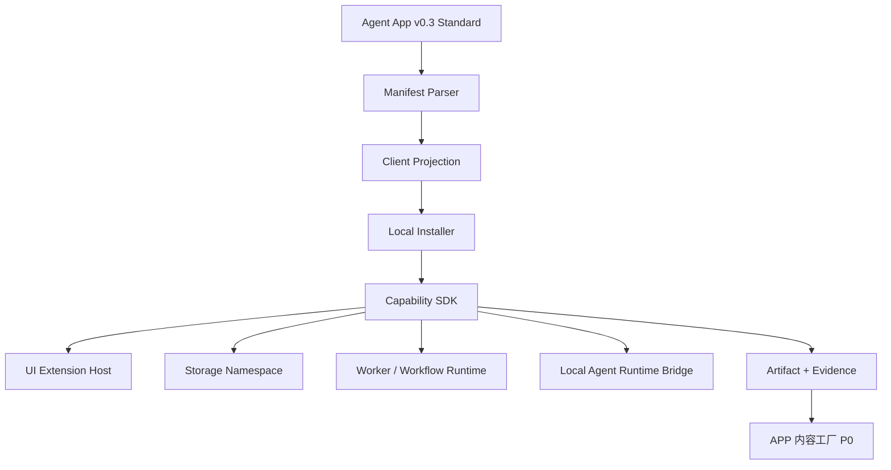

# Agent App 客户端路线图

更新时间：2026-05-15

## 定位

本目录只承载 Lime Desktop / Lime 客户端侧的 Agent App 路线图。

客户端职责是把 Agent App 真正安装并跑起来：本地 package cache、manifest projection、readiness、Capability SDK、UI extension host、storage namespace、worker / workflow runtime、Agent Runtime bridge、Artifact / Evidence、权限和本地数据边界。

服务端 / Cloud / LimeCore 的职责不写在本目录；对应文档在 `/Users/coso/Documents/dev/ai/limecloud/limecore/docs/roadmap/agentapp`。

```text
Lime Cloud / LimeCore
  Catalog / Release / License / Tenant Enablement / Gateway / ToolHub
    ↓
Lime Desktop Client
  Install / Projection / Capability SDK / UI Host / Storage / Runtime / Evidence
    ↓
Agent App Runtime Package
  App UI / Worker / Workflow / Storage Schema / Business Code
```

## 当前事实源

| 分类 | 对象 | 说明 |
|---|---|---|
| current | `/Users/coso/Documents/dev/ai/limecloud/agentapp` | Agent App v0.3 标准、runtime package、schema、参考 CLI 与示例包。 |
| current | `docs/roadmap/agentapp/capability-sdk.md` | Lime Desktop 侧 Capability SDK 与 Host Bridge 方案。 |
| current | `docs/roadmap/agentapp/implementation-plan.md` | 客户端落地实施方案，覆盖 P0-P4。 |
| current | `docs/roadmap/agentapp/p0-technical-design.md` | P0 只读 App Host 技术设计，覆盖 manifest、projection、readiness、cleanup dry-run。 |
| current | `docs/roadmap/agentapp/p1-mock-capability-host.md` | P1 Mock Capability Host 技术设计，覆盖 SDK facade、mock artifact/evidence、uninstall delete-data。 |
| current | `docs/roadmap/agentapp/p2-adapter-capability-host.md` | P2 Adapter Capability Host 技术设计，覆盖本地 adapter store、knowledge / agent adapter、provenance 查询、delete-data 清理。 |
| current | `docs/roadmap/agentapp/p3-ui-extension-host.md` | P3 UI Extension Host 技术设计，覆盖受控 UI Host、sandbox、injected SDK bridge、Lab 预览。 |
| current | `docs/roadmap/agentapp/p4-content-factory-demo.md` | P4 APP 内容工厂最小闭环，覆盖项目、知识、内容场景、内容资产、Artifact、Evidence、cleanup。 |
| current | `docs/roadmap/agentapp/p4-workflow-runtime.md` | P4.2 受控 Workflow Runtime，覆盖白名单 DSL、runtime policy、trace、cancel 和内容工厂 demo 迁移。 |
| current | `docs/roadmap/agentapp/content-factory-app.md` | APP 内容工厂作为客户端标杆案例的 UI / storage / workflow / artifact 方案。 |
| reference | `/Users/coso/Documents/dev/ai/limecloud/limecore/docs/roadmap/agentapp` | 服务端 catalog、release、tenant enablement、gateway、ToolHub 路线图。 |

## 文档索引

| 文档 | 说明 |
|---|---|
| [capability-sdk.md](./capability-sdk.md) | 客户端 Capability SDK、runtime bridge、能力注入、权限拦截和 mock host。 |
| [implementation-plan.md](./implementation-plan.md) | 客户端 App Host 落地实施方案：manifest parser、projection、installer、storage、UI host、worker runtime。 |
| [p0-technical-design.md](./p0-technical-design.md) | P0 技术设计：只读 package、manifest normalize、projection、readiness、cleanup dry-run、Lab 展示。 |
| [p1-mock-capability-host.md](./p1-mock-capability-host.md) | P1 技术设计：SDK facade、MockCapabilityHost、mock artifact/evidence、uninstall delete-data。 |
| [p2-adapter-capability-host.md](./p2-adapter-capability-host.md) | P2 技术设计：AdapterCapabilityHost、本地 adapter store、knowledge / agent adapter、provenance 查询、delete-data 清理。 |
| [p3-ui-extension-host.md](./p3-ui-extension-host.md) | P3 技术设计：受控 UI Host、sandbox policy、injected SDK bridge、Lab 预览。 |
| [p4-content-factory-demo.md](./p4-content-factory-demo.md) | P4 技术设计：内容工厂最小闭环、content table Artifact、Evidence、delete-data 清理。 |
| [p4-workflow-runtime.md](./p4-workflow-runtime.md) | P4.2 技术设计：受控 workflow runtime、白名单 DSL、trace、cancel、policy guard。 |
| [content-factory-app.md](./content-factory-app.md) | APP 内容工厂 Product-level Agent App 的客户端产品与实现方案。 |

## 客户端边界

1. 客户端负责运行 Agent App；服务端不默认运行 Agent。
2. App 不能 import Lime 内部模块，只能通过 Capability SDK 使用 `lime.*` 能力。
3. UI、worker、workflow、storage migration 都在客户端受控 runtime 中执行。
4. App storage namespace、artifact namespace、event namespace 必须隔离。
5. 客户数据、workspace data、secrets 和 overlay 不进入官方 App package。
6. Expert 只是 `expert-chat` entry；客户端必须支持非聊天页面和业务 workflow。
7. Cloud 下发 release / tenant enablement，客户端做本地 readiness 和能力注入。

## 主路线



## 当前执行顺序

当前已推进到 P4.1 内容工厂最小闭环：

```text
P0 manifest / projection / readiness / cleanup dry-run
→ P1 Mock Capability Host
→ P2 Adapter Capability Host
→ P3.1 UI Extension Host mount contract
→ P4.1 APP 内容工厂业务闭环
→ P4.2 受控 Workflow Runtime
→ P5 Cloud Bootstrap
```

不要先做市场页、Cloud、完整行业内容系统，也不要先把 entry 接入正式主路径；P5 前仍保持 Lab 实验岛。
