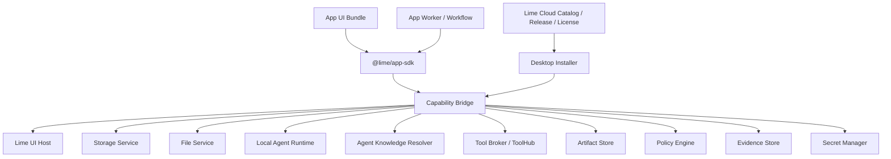
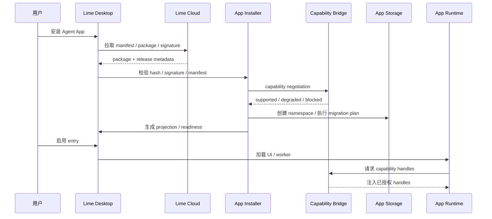

# Agent App 客户端 Capability SDK 方案

更新时间：2026-05-16

## 一句话目标

在 Lime Desktop 客户端侧提供稳定、版本化、可授权、可 mock 的 Capability SDK；Agent App 通过 SDK 调用本地平台能力，自己实现 UI、业务流程、数据模型和交付物，而不重复造 Lime 客户端底座、不依赖内部实现。

更严格地说：业务用户应留在 App 的业务工作台里完成任务；Lime Agent 通过 `lime.agent` / `lime.workflow` 作为 App 可编排的任务运行时被调用。SDK 不是把用户送回通用 Chat 的跳板，也不是允许 App 绕过 Lime 自建模型、工具、凭证和证据系统的逃逸口。

## 边界

本文只讨论 Lime Desktop / Lime 客户端侧能力：App Host、Capability Bridge、UI Host、Storage Namespace、Worker / Workflow Runtime、本地 Agent Runtime Bridge。Cloud / LimeCore 的 catalog、release、tenant enablement、gateway、ToolHub 只作为上游输入，不在本文设计。

## 背景

真实 Agent App 和底层系统高度耦合。一个 App 可能同时需要：文件、知识库、模型任务、工具调用、Artifact、UI、storage、background task、权限、凭证、Evidence、升级和 tenant overlay。

如果没有 SDK，每个 App 都会重复实现这些底座；Lime 底层升级后，所有 App 都要大改。Agent App 平台能成立的前提，是把 Lime 能力封装成稳定 capability facade。

## 非目标

- P0 不做公开 marketplace、支付分账、审核流。
- P0 不允许 App 直接运行任意无沙箱代码访问系统资源。
- P0 不把 Cloud 变成默认 Agent Runtime。
- P0 不把某个垂直业务写进 Lime Core。
- P0 不要求一次性支持所有 UI 插件形态；先支持可控 extension slot。

## 核心原则

1. **SDK 暴露能力，不暴露实现**：App 不能 import Lime internal path。
2. **声明先于调用**：manifest 先声明 capability、permission、storage、secret、network、tool。
3. **Host 注入能力**：运行时由 Desktop 注入 capability handles。
4. **权限双层拦截**：UI 提示只是体验，runtime bridge 必须强制拦截。
5. **App 数据命名空间化**：每个 App 有独立 storage namespace、artifact namespace、event namespace。
6. **Cloud 不跑默认 Agent**：Cloud 做 catalog、release、license、tenant enablement、gateway。
7. **可 mock 和 contract test**：每个 capability 都要有 mock host 和契约测试。
8. **升级不覆盖用户资产**：官方包、tenant overlay、workspace data、secrets 分离。
9. **业务不出 App**：Agent 任务进度、引用、错误、人工确认和结构化结果都应回到 App UI / workflow 内呈现。
10. **Agent 不出 Lime 治理**：模型、工具、知识、文件、凭证、Artifact、Evidence、成本和权限都必须通过 `lime.*` capability。
11. **完整 Agent 能力不等于模型 API**：`LIME_GATEWAY_*` / `OPENAI_BASE_URL` 只能是低阶模型 executor 或 degraded fallback；`lime.agent` / `lime.workflow` 的生产事实源必须回到 `docs/roadmap/agentruntime/app-surface-runtime.md` 定义的 AgentRuntime Surface。

## 能力地图

| Capability | P0 范围 | 典型 API |
|---|---|---|
| `lime.ui` | 注册 page、panel、command、settings、artifact viewer。 | `registerRoute`、`openPanel`、`openArtifact` |
| `lime.storage` | App namespace、CRUD、schema、migration。 | `namespace`、`table`、`migrate` |
| `lime.files` | 用户选中文件、读取 file ref、基础解析。 | `pick`、`read`、`parse` |
| `lime.agent` | 本地 Agent task、stream、cancel、retry、trace。 | `startTask`、`streamTask`、`cancelTask` |
| `lime.knowledge` | Knowledge binding、search、export、version。 | `bind`、`search`、`export` |
| `lime.tools` | Tool Broker 调用、权限、长任务状态。 | `invoke`、`getProgress` |
| `lime.artifacts` | 创建、读取、打开、导出 Artifact。 | `create`、`open`、`export` |
| `lime.workflow` | workflow state、human review、background task。 | `start`、`checkpoint`、`awaitHuman` |
| `lime.policy` | 权限、风险、成本、企业策略。 | `requestPermission`、`check` |
| `lime.evidence` | provenance、tool call、knowledge citation、eval。 | `record`、`linkArtifact` |
| `lime.secrets` | OAuth、API key、外部凭证槽位。 | `requestSecret`、`getHandle` |
| `lime.events` | App 内外事件，UI/worker 解耦。 | `emit`、`subscribe` |

## 架构图



## 与 AgentRuntime Surface 的关系

Capability SDK 是 App 调用 Lime 能力的 facade，不是新的 Agent Runtime。Agent App、Claw Chat、Automation 共享的执行事实源是 AgentRuntime：

```text
Agent App
  -> @lime/app-sdk
  -> Host Bridge / Capability Bridge
  -> Agent App Runtime Surface
  -> AgentRuntime control plane
  -> Aster / lime_agent / Claw capability / Skills / Tools / Evidence
```

边界固定如下：

| 层 | 做什么 | 不做什么 |
|---|---|---|
| `@lime/app-sdk` | 暴露 `lime.storage`、`lime.agent`、`lime.workflow` 等稳定 facade。 | 不暴露 Lime internal path，不执行模型和工具。 |
| Host Bridge | 安全传输、主题、语言、capability invoke、Host action。 | 不保存执行事实，不判断任务完成。 |
| Agent App Runtime Surface | 把 App task / workflow 映射成 AgentRuntime request，并附加 app provenance。 | 不复制 Claw skill launch，不新建第二套 runtime。 |
| AgentRuntime | 维护 session/thread/turn/task/event/read model/evidence。 | 不决定垂直 App UI 形态。 |
| Claw Capability Catalog | 把现有 `@配图`、`@搜索`、`@研报` 等能力注册为可复用 capability。 | 不再让能力只绑定 Chat/Inputbar。 |

生产期 `lime.agent.startTask` / `lime.workflow.start` 必须通过后端 AgentRuntime Surface；前端 `CapabilityHost` / `WorkflowRuntimeHost` 只能作为 adapter、mock 或本地预览，不得成为生产执行事实源。详细设计见：

- `docs/roadmap/agentruntime/app-surface-runtime.md`
- `docs/roadmap/agentruntime/backend-surface-facade-plan.md`
- `docs/roadmap/agentruntime/claw-capability-sharing.md`

## Host Bridge v1

正式 App UI 运行在 iframe / sandbox 中时，Capability SDK 不能依赖 React context、全局 store 或直接 import Lime 模块。UI 侧 SDK 请求必须通过标准 Host Bridge 传输：

```text
App UI
  -> @lime/app-sdk facade
  -> lime.agentApp.bridge message
  -> AgentAppHostBridge
  -> P14 guard / readiness / policy
  -> Lime capability implementation
```

标准信封：

```ts
interface LimeAgentAppBridgeMessage {
  protocol: "lime.agentApp.bridge";
  version: 1;
  type: string;
  requestId?: string;
  appId: string;
  entryKey?: string;
  payload?: unknown;
}
```

首版 Host Bridge 覆盖：

| 方向 | 事件 | 说明 |
|---|---|---|
| Host -> App | `host:snapshot` / `theme:update` | 同步主题、语言、入口上下文、capability 摘要。 |
| Host -> App | `host:response` / `host:error` | 按 `requestId` 返回 SDK / Host action 结果。 |
| Host -> App | `host:visibility` | 页面可见性变化，供 App 暂停或恢复轻量同步。 |
| App -> Host | `app:ready` / `host:getSnapshot` | App 初始化和快照补偿。 |
| App -> Host | `host:toast` / `host:navigate` | 非技术提示和受控导航。 |
| App -> Host | `host:openExternal` / `host:download` | 受控外链和同源产物下载。 |
| App -> Host | `capability:invoke` | SDK capability 调用统一入口。 |

安全规则：

1. Host 必须校验 `event.source`、`event.origin`、`protocol`、`version`、`appId`、`entryKey`。
2. `capability:invoke` 仍必须经过 manifest 声明、entry readiness、permission、policy 和 provenance。
3. 未开放能力返回 blocked error，不返回 mock 成功、不写假数据。
4. 主题同步只传当前已生效 token；App 只应用到自己的 DOM，不读取外层 DOM。

## App 内 Agent Task API

`lime.agent` 是 App 调用 Lime Agent 的主能力，不是跳转通用 Chat 的快捷方式。App 决定业务任务何时启动、需要什么上下文、结果写回哪个业务对象；Host 决定 Agent task 如何运行、可用哪些工具 / 知识 / secret、如何记录 trace / artifact / evidence。

最小请求语义：

```ts
interface LimeAgentTaskRequest {
  appId: string;
  entryKey: string;
  taskKind: string;
  idempotencyKey: string;
  input: unknown;
  expectedOutput?: unknown;
  knowledge?: Array<{ key: string; mode: "retrieval" | "data" }>;
  tools?: string[];
  humanReview?: boolean;
}
```

最小运行语义：

| 阶段 | App 责任 | Lime Host / Agent 责任 |
|---|---|---|
| Start | 从当前页面 / workflow 组装业务输入、期望结构和幂等键。 | 校验 manifest、entry readiness、permission、policy、cost。 |
| Stream | 在 App 内显示进度、引用、工具调用、错误和可取消状态。 | 发送 `taskId`、`traceId`、status、tool call、citation、partial artifact、blocked error。 |
| Review | 让用户编辑、确认、拒绝或重试结果。 | 保留 trace，确保重试和取消可审计。 |
| Write-back | 通过 `lime.storage` 写业务对象，通过 `lime.artifacts` / `lime.evidence` 写交付物和依据。 | 自动附加 appId、entryKey、package provenance、workspace / tenant 上下文。 |

验收口径：内容工厂的资料整理、场景生成、批量文案、交付和复盘都应在 App 页面内启动、观察、确认和写回；Expert Chat 只能作为嵌入式协作者读取同一上下文，不允许成为手工复制结果的旁路。

后端验收口径：App task 启动后必须能关联 `sessionId / threadId / turnId / taskId / traceId`，并可由 AgentRuntime read model / Evidence Pack 追溯；不能只返回模型文本或前端 mock task。

## 安装时序



## Runtime Package 契约

```text
app-package/
├── APP.md
├── dist/ui
├── dist/worker
├── storage/schema.json
├── storage/migrations
├── workflows
├── agents
├── artifacts
├── policies
└── examples
```

安装器必须做到：

- 只信任 package 内声明过的入口。
- UI、worker、workflow、migration 都有 package provenance。
- storage migration 先 dry-run / plan，再执行。
- user data、workspace data、tenant overlay 不进入 package hash。

## App Manifest 核心字段

```yaml
requires:
  lime:
    appRuntime: ">=0.3.0 <1.0.0"
  capabilities:
    lime.ui: "^0.3.0"
    lime.storage: "^0.3.0"
    lime.agent: "^0.3.0"
runtimePackage:
  ui:
    path: ./dist/ui
  worker:
    path: ./dist/worker
storage:
  namespace: app-id
  schema: ./storage/schema.json
  migrations: ./storage/migrations
entries:
  - key: dashboard
    kind: page
  - key: advisor
    kind: expert-chat
  - key: nightly_review
    kind: background-task
```

## P0 交付物

| 交付物 | 说明 | 验收 |
|---|---|---|
| App manifest v0.3 parser | 支持 `requires`、`runtimePackage`、`storage`、`entries`。 | 示例 App 可 validate / project。 |
| Capability SDK 类型草案 | TypeScript types + mock host。 | App 示例可以用 mock 运行单测。 |
| Desktop Installer 方案 | 安装、hash、projection、readiness、权限。 | 能生成 projection，不运行代码。 |
| Storage namespace 方案 | schema、migration、保留/删除策略。 | 卸载时可选择保留数据。 |
| UI extension slot 方案 | page / panel / settings / artifact viewer。 | App 页面不需要写进 Core。 |
| Worker runtime 方案 | long task、cancel、trace、policy。 | 能执行受控后台任务。 |
| Evidence 串联 | task/tool/knowledge/artifact/eval provenance。 | 产物能追溯 App 和知识版本。 |

## 分期计划

### P0：单机 App Host 骨架

- 完成 Agent App v0.3 标准对齐。
- 设计 `@lime/app-sdk` 最小 API surface 和 mock host。
- Desktop 支持安装本地 package、projection、readiness。
- 支持 page / expert-chat / workflow 三类 entry。
- 支持 storage namespace + basic migration。
- 支持 Artifact create + Evidence provenance。

### P1：真实垂直 App 验证

- 用 内容工厂验证 UI、storage、workflow、worker、Agent task、Artifact。
- 支持文件选择、文档解析、Knowledge binding、批量生成和去 AI 味 eval。
- App 所有业务 UI 不进 Lime Core。

### P2：Cloud Catalog / Tenant Enablement

- Cloud 下发 app release、package hash、tenant enablement、license。
- Desktop 只执行已启用 App。
- 支持 tenant overlay 覆盖默认知识、工具、模型、eval 阈值。

### P3：安全、升级和生态

- App signature、sandbox、permission review、compat matrix。
- SDK capability deprecation 策略和 contract tests。
- App-to-App capability sharing 规则。
- Marketplace / 私有分发 / 企业策略。

## 风险与应对

| 风险 | 影响 | 应对 |
|---|---|---|
| SDK 过厚 | 变成第二套 Lime 内部 API。 | 只暴露 capability facade，不暴露 store/internal path。 |
| SDK 过薄 | App 重复造轮子。 | P0 优先封装高频底座：storage、files、agent、artifact、knowledge、tools。 |
| UI 安全 | App UI 诱导授权或越权访问。 | Host 控制容器 + runtime permission bridge 双拦截。 |
| Migration 破坏数据 | App 升级损坏用户数据。 | migration plan、dry-run、backup、保留数据策略。 |
| Cloud 变 Runtime | 破坏 Lime 本地运行定位。 | server-assisted 必须显式声明并受 policy 控制。 |
| Agent 能力退化为 API | App 绕过 Claw / Aster / Evidence 主链。 | `lime.agent` / `lime.workflow` 必须进入 AgentRuntime Surface，模型 token 仅作 executor / fallback。 |
