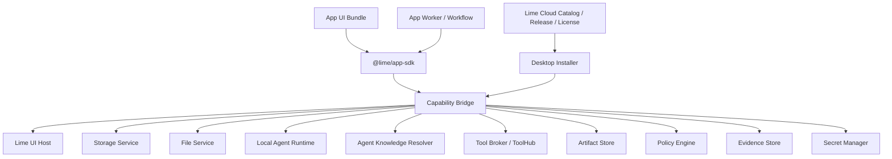
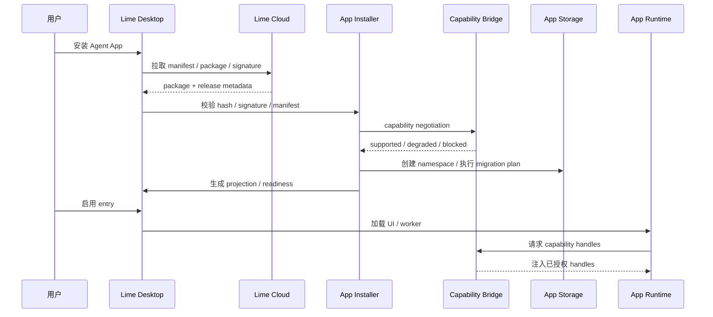

# Agent App 客户端 Capability SDK 方案

更新时间：2026-05-15

## 一句话目标

在 Lime Desktop 客户端侧提供稳定、版本化、可授权、可 mock 的 Capability SDK；Agent App 通过 SDK 调用本地平台能力，自己实现 UI、业务流程、数据模型和交付物，而不重复造 Lime 客户端底座、不依赖内部实现。

## 边界

本文只讨论 Lime Desktop / Lime 客户端侧能力：App Host、Capability Bridge、UI Host、Storage Namespace、Worker / Workflow Runtime、本地 Agent Runtime Bridge。Cloud / LimeCore 的 catalog、release、tenant enablement、gateway、ToolHub 只作为上游输入，不在本文设计。

## 背景

真实 Agent App 和底层系统高度耦合。一个 App 可能同时需要：文件、知识库、模型任务、工具调用、Artifact、UI、storage、background task、权限、凭证、Evidence、升级和 tenant overlay。

如果没有 SDK，每个 App 都会重复实现这些底座；Lime 底层升级后，所有 App 都要大改。Agent App 平台能成立的前提，是把 Lime 能力封装成稳定 capability facade。

## 非目标

- P0 不做公开 marketplace、支付分账、审核流。
- P0 不允许 App 直接运行任意无沙箱代码访问系统资源。
- P0 不把 Cloud 变成默认 Agent Runtime。
- P0 不把某个垂直业务写进 Lime Core。
- P0 不要求一次性支持所有 UI 插件形态；先支持可控 extension slot。

## 核心原则

1. **SDK 暴露能力，不暴露实现**：App 不能 import Lime internal path。
2. **声明先于调用**：manifest 先声明 capability、permission、storage、secret、network、tool。
3. **Host 注入能力**：运行时由 Desktop 注入 capability handles。
4. **权限双层拦截**：UI 提示只是体验，runtime bridge 必须强制拦截。
5. **App 数据命名空间化**：每个 App 有独立 storage namespace、artifact namespace、event namespace。
6. **Cloud 不跑默认 Agent**：Cloud 做 catalog、release、license、tenant enablement、gateway。
7. **可 mock 和 contract test**：每个 capability 都要有 mock host 和契约测试。
8. **升级不覆盖用户资产**：官方包、tenant overlay、workspace data、secrets 分离。

## 能力地图

| Capability | P0 范围 | 典型 API |
|---|---|---|
| `lime.ui` | 注册 page、panel、command、settings、artifact viewer。 | `registerRoute`、`openPanel`、`openArtifact` |
| `lime.storage` | App namespace、CRUD、schema、migration。 | `namespace`、`table`、`migrate` |
| `lime.files` | 用户选中文件、读取 file ref、基础解析。 | `pick`、`read`、`parse` |
| `lime.agent` | 本地 Agent task、stream、cancel、retry、trace。 | `startTask`、`streamTask`、`cancelTask` |
| `lime.knowledge` | Knowledge binding、search、export、version。 | `bind`、`search`、`export` |
| `lime.tools` | Tool Broker 调用、权限、长任务状态。 | `invoke`、`getProgress` |
| `lime.artifacts` | 创建、读取、打开、导出 Artifact。 | `create`、`open`、`export` |
| `lime.workflow` | workflow state、human review、background task。 | `start`、`checkpoint`、`awaitHuman` |
| `lime.policy` | 权限、风险、成本、企业策略。 | `requestPermission`、`check` |
| `lime.evidence` | provenance、tool call、knowledge citation、eval。 | `record`、`linkArtifact` |
| `lime.secrets` | OAuth、API key、外部凭证槽位。 | `requestSecret`、`getHandle` |
| `lime.events` | App 内外事件，UI/worker 解耦。 | `emit`、`subscribe` |

## 架构图



## 安装时序



## Runtime Package 契约

```text
app-package/
├── APP.md
├── dist/ui
├── dist/worker
├── storage/schema.json
├── storage/migrations
├── workflows
├── agents
├── artifacts
├── policies
└── examples
```

安装器必须做到：

- 只信任 package 内声明过的入口。
- UI、worker、workflow、migration 都有 package provenance。
- storage migration 先 dry-run / plan，再执行。
- user data、workspace data、tenant overlay 不进入 package hash。

## App Manifest 核心字段

```yaml
requires:
  lime:
    appRuntime: ">=0.3.0 <1.0.0"
  capabilities:
    lime.ui: "^0.3.0"
    lime.storage: "^0.3.0"
    lime.agent: "^0.3.0"
runtimePackage:
  ui:
    path: ./dist/ui
  worker:
    path: ./dist/worker
storage:
  namespace: app-id
  schema: ./storage/schema.json
  migrations: ./storage/migrations
entries:
  - key: dashboard
    kind: page
  - key: advisor
    kind: expert-chat
  - key: nightly_review
    kind: background-task
```

## P0 交付物

| 交付物 | 说明 | 验收 |
|---|---|---|
| App manifest v0.3 parser | 支持 `requires`、`runtimePackage`、`storage`、`entries`。 | 示例 App 可 validate / project。 |
| Capability SDK 类型草案 | TypeScript types + mock host。 | App 示例可以用 mock 运行单测。 |
| Desktop Installer 方案 | 安装、hash、projection、readiness、权限。 | 能生成 projection，不运行代码。 |
| Storage namespace 方案 | schema、migration、保留/删除策略。 | 卸载时可选择保留数据。 |
| UI extension slot 方案 | page / panel / settings / artifact viewer。 | App 页面不需要写进 Core。 |
| Worker runtime 方案 | long task、cancel、trace、policy。 | 能执行受控后台任务。 |
| Evidence 串联 | task/tool/knowledge/artifact/eval provenance。 | 产物能追溯 App 和知识版本。 |

## 分期计划

### P0：单机 App Host 骨架

- 完成 Agent App v0.3 标准对齐。
- 设计 `@lime/app-sdk` 最小 API surface 和 mock host。
- Desktop 支持安装本地 package、projection、readiness。
- 支持 page / expert-chat / workflow 三类 entry。
- 支持 storage namespace + basic migration。
- 支持 Artifact create + Evidence provenance。

### P1：真实垂直 App 验证

- 用 APP 内容工厂验证 UI、storage、workflow、worker、Agent task、Artifact。
- 支持文件选择、文档解析、Knowledge binding、批量生成和去 AI 味 eval。
- App 所有业务 UI 不进 Lime Core。

### P2：Cloud Catalog / Tenant Enablement

- Cloud 下发 app release、package hash、tenant enablement、license。
- Desktop 只执行已启用 App。
- 支持 tenant overlay 覆盖默认知识、工具、模型、eval 阈值。

### P3：安全、升级和生态

- App signature、sandbox、permission review、compat matrix。
- SDK capability deprecation 策略和 contract tests。
- App-to-App capability sharing 规则。
- Marketplace / 私有分发 / 企业策略。

## 风险与应对

| 风险 | 影响 | 应对 |
|---|---|---|
| SDK 过厚 | 变成第二套 Lime 内部 API。 | 只暴露 capability facade，不暴露 store/internal path。 |
| SDK 过薄 | App 重复造轮子。 | P0 优先封装高频底座：storage、files、agent、artifact、knowledge、tools。 |
| UI 安全 | App UI 诱导授权或越权访问。 | Host 控制容器 + runtime permission bridge 双拦截。 |
| Migration 破坏数据 | App 升级损坏用户数据。 | migration plan、dry-run、backup、保留数据策略。 |
| Cloud 变 Runtime | 破坏 Lime 本地运行定位。 | server-assisted 必须显式声明并受 policy 控制。 |
