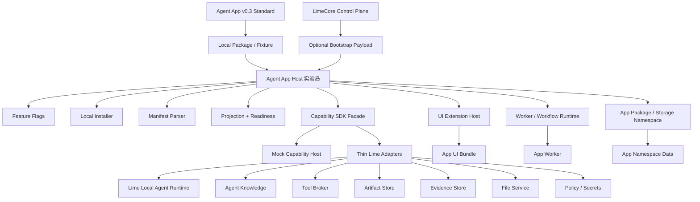
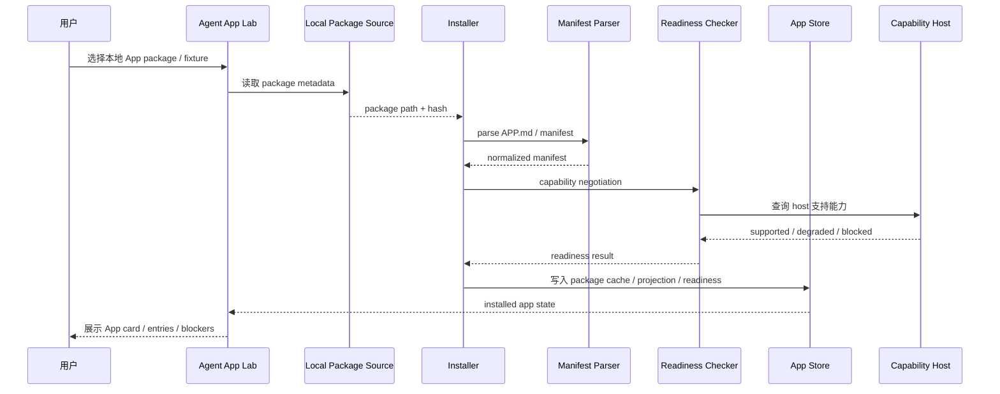
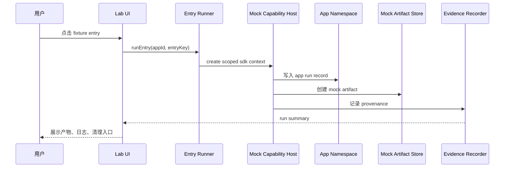
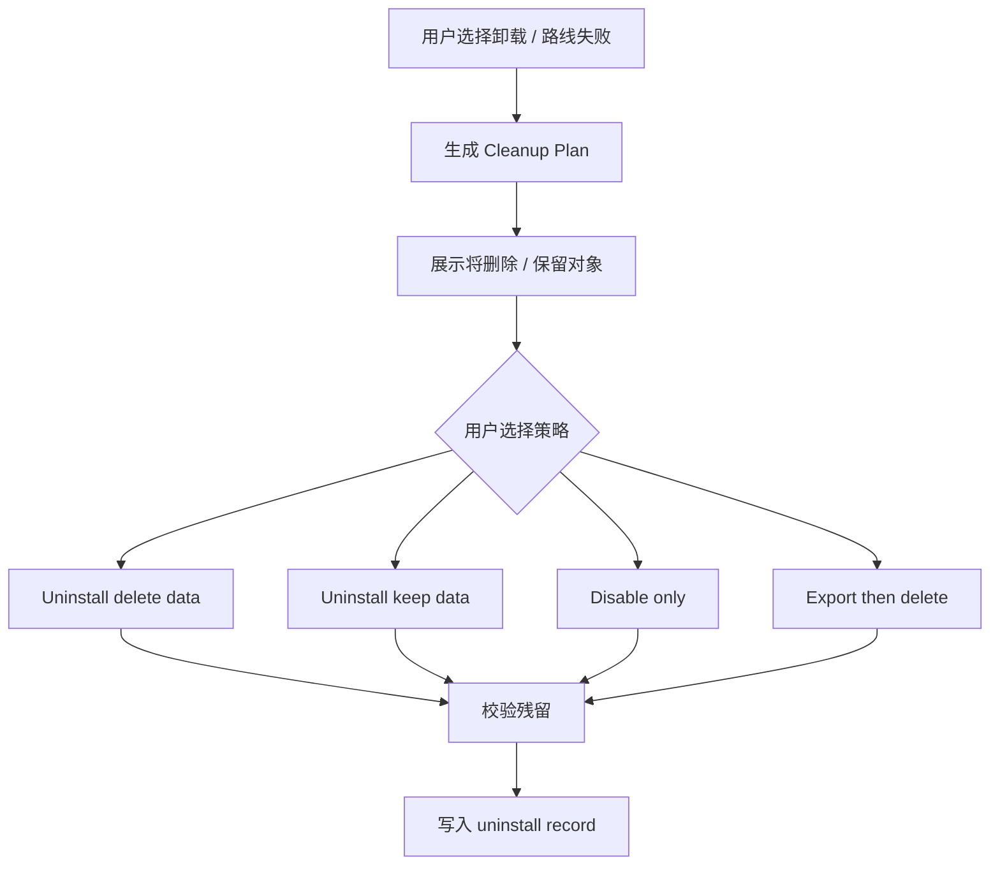

# Agent App 客户端实施方案计划

更新时间：2026-05-15

## 一句话结论

Agent App 在 Lime Desktop 里必须先做成一个可关闭、可卸载、可删除数据、可移除代码的“实验岛”，而不是一开始改造 Chat、Skill、Workspace、Artifact 主路径。

第一阶段目标不是做一个完整生态，也不是复刻行业内容系统，而是证明：一个真实 App package 可以在本地被安装、解析、投影、检查 readiness、调用 Capability SDK、生成可追溯产物，并且在方向失败时能干净清理。

```text
Agent App Standard v0.3
  ↓
Local Package / Fixture
  ↓
Lime Desktop Agent App Host（实验岛）
  ↓
Capability SDK Facade + Mock Host
  ↓
少量可删除 Adapter
  ↓
现有 Lime 本地能力：Agent / Knowledge / Tools / Artifact / Evidence / Files
```

## 背景

Agent App 不是专家卡片、不是 Prompt 包、不是 Markdown 目录，也不是把某个垂直业务写进 Lime Core。它是安装在 Lime Desktop 中运行的完整应用包：有自己的 UI、业务流程、数据模型、worker、workflow、artifact、权限和升级策略。

这件事最大的风险不在 Cloud，而在客户端运行时：

1. App 需要调用 Lime 底层能力，天然和 Agent Runtime、Knowledge、Tool、Artifact、Evidence、Files、Policy 绑定。
2. App 又不能直接依赖 Lime 内部实现，否则 Lime 一升级，所有 App 都要跟着大改。
3. 如果一开始把 App entry 接进主导航、命令面板、Chat、Skill Catalog、Artifact schema，会快速污染主路径。
4. 如果路线判断失败，必须能关掉开关、删掉实验目录、清掉 App 数据，而不是留下半套平台代码。

所以客户端实施必须采用“实验岛 + Capability SDK + 可删除 Adapter”的路线。

## 目标

| 目标 | 说明 |
|---|---|
| 验证 App package | 本地读取 Agent App v0.3 package / fixture，生成 manifest、projection、readiness。 |
| 验证 SDK 边界 | App 只能通过 `@lime/app-sdk` capability facade 调 Lime 能力，不能 import Lime internal modules。 |
| 验证真实业务切片 | 用 APP 内容工厂跑通一个最小业务闭环，而不是停留在专家聊天。 |
| 验证本地数据隔离 | App storage、artifact、evidence、log、package cache 独立命名空间，可按 app 清理。 |
| 验证失败退出 | P0 就实现 cleanup plan / uninstall plan，保证失败后能删干净。 |
| 验证未来 Cloud 对接 | 客户端先用 local JSON / fixture，Cloud 只在 P5 作为 catalog / release / tenant enablement 输入。 |

## 非目标

1. P0 不做公开市场、审核流、支付分账、企业分发控制台。
2. P0 不执行任意 App 代码，不支持任意 npm install、native binary、任意文件系统访问。
3. P0 不把 APP 内容工厂写进 Lime Core。
4. P0 不改造 AgentChat、Skill Catalog、Artifact 主 schema。
5. P0 不要求 Cloud 先完成；Cloud 不运行默认 Agent Runtime。
6. P0 不承诺兼容历史实验数据；实验数据必须可删除。
7. P0 不把 App projection 写入全局 registry。

## 总体原则

| 原则 | 落地方式 |
|---|---|
| 实验岛优先 | 代码集中在 `src/features/agent-app/`，主系统只保留 feature flag 入口。 |
| 先静态后运行 | 先做 manifest / projection / readiness，不执行 UI bundle 或 worker。 |
| 先 mock 后 adapter | SDK 先接 mock host，确认接口稳定后再接少量真实能力。 |
| 先本地后 Cloud | P0-P4 使用本地 fixture，P5 才消费 LimeCore bootstrap payload。 |
| 先可删除后扩展 | 安装、运行、产物、日志都必须有 cleanup plan。 |
| SDK 暴露能力 | App 只调用 capability，不知道 Lime 内部 store、command、runtime 路径。 |
| 产物必须可追溯 | Artifact / Evidence / Task / Log 都带 `sourceKind: agent_app` provenance。 |

## 仓库边界

本文只描述 Lime Desktop 客户端：

```text
/Users/coso/Documents/dev/ai/aiclientproxy/lime/docs/roadmap/agentapp
```

服务端 / Cloud / LimeCore 控制面文档在：

```text
/Users/coso/Documents/dev/ai/limecloud/limecore/docs/roadmap/agentapp
```

标准仓库事实源在：

```text
/Users/coso/Documents/dev/ai/limecloud/agentapp
```

三者分工：

| 仓库 | 责任 | 不做什么 |
|---|---|---|
| `agentapp` | 标准、schema、示例包、reference CLI。 | 不实现 Lime Desktop 内部能力。 |
| `lime` | 客户端安装、运行、SDK host、UI host、storage、runtime bridge。 | 不实现 Cloud catalog / tenant 管理。 |
| `limecore` | Catalog、release、hash、license、tenant enablement、gateway、audit metadata。 | 不运行默认 Agent、不渲染 App UI、不管理本地 App storage。 |

## 架构图



关键点：

- `Host` 是实验岛，不是主路径。
- `SDK` 是稳定 facade，不是内部 API 透传。
- `Adapter` 必须薄，且可以按目录删除。
- `Cloud` 只提供元数据，不成为默认 runtime。

## 模块设计

客户端代码集中放在一个独立功能目录：

```text
src/features/agent-app/
├── README.md
├── featureFlag.ts
├── types.ts
├── manifest/
│   ├── parseManifest.ts
│   ├── normalizeManifest.ts
│   └── parseManifest.test.ts
├── projection/
│   ├── projectApp.ts
│   ├── projectionGuards.ts
│   └── projectApp.test.ts
├── readiness/
│   ├── checkReadiness.ts
│   ├── capabilityNegotiation.ts
│   └── checkReadiness.test.ts
├── install/
│   ├── packageSource.ts
│   ├── packageVerifier.ts
│   ├── localPackageStore.ts
│   ├── installedAppState.ts
│   ├── cleanupPlan.ts
│   ├── uninstallApp.ts
│   └── installFlow.test.ts
├── sdk/
│   ├── LimeAppSdk.ts
│   ├── CapabilityHost.ts
│   ├── MockCapabilityHost.ts
│   ├── capabilityErrors.ts
│   ├── provenance.ts
│   └── contract.test.ts
├── adapters/
│   ├── artifactAdapter.ts
│   ├── evidenceAdapter.ts
│   ├── knowledgeAdapter.ts
│   ├── agentRuntimeAdapter.ts
│   └── adapterGuards.ts
├── runtime/
│   ├── uiExtensionHost.ts
│   ├── workerRuntimeHost.ts
│   ├── runtimePolicy.ts
│   └── runtimeSandbox.test.ts
├── ui/
│   ├── AgentAppLabPage.tsx
│   ├── AgentAppCard.tsx
│   ├── AgentAppEntriesPanel.tsx
│   ├── AgentAppReadinessPanel.tsx
│   ├── AgentAppRunPanel.tsx
│   └── AgentAppCleanupPanel.tsx
└── fixtures/
    ├── content-factory-app.json
    └── content-factory-run.fixture.json
```

主系统只允许极薄入口：

```ts
if (featureFlags.agentAppHost.labEnabled) {
  registerAgentAppLabEntry()
}
```

禁止在 P0-P2 出现：

```text
agent-app 逻辑散落到 Chat 主流程
agent-app 逻辑散落到 Skill Catalog 主数据结构
agent-app 逻辑散落到 Artifact 主 schema
agent-app entry 直接进入正式命令面板
App package 直接 import src/ 内部模块
```

### Tauri / Rust 边界

如果 P0 必须增加 Rust 能力，也必须独立目录，且只服务实验岛：

```text
src-tauri/src/agent_app/
├── manifest.rs
├── installer.rs
├── projection.rs
├── readiness.rs
├── storage.rs
├── cleanup.rs
└── commands.rs
```

原则：

1. 能先用 TypeScript + local fixture 验证的，不先加 Rust 命令。
2. 必须加命令时，遵守 Lime command boundary，同步前端 gateway、Rust registration、catalog、mock。
3. Rust 只暴露安装、读取、清理等本地能力，不承载 App 业务逻辑。

## Feature Flag 策略

所有能力默认关闭，按层启用：

```ts
agentAppHost: {
  labEnabled: false,
  localPackageEnabled: false,
  projectionEnabled: false,
  readinessEnabled: false,
  mockSdkEnabled: false,
  localStorageEnabled: false,
  realAdapterEnabled: false,
  uiRuntimeEnabled: false,
  workerRuntimeEnabled: false,
  cloudBootstrapEnabled: false
}
```

| 开关 | 启用内容 | 默认 | 失败止血 |
|---|---|---|---|
| `labEnabled` | 显示 Agent App Lab 页面。 | off | UI 入口消失。 |
| `localPackageEnabled` | 读取本地 package / fixture。 | off | 不扫描本地 App。 |
| `projectionEnabled` | 生成 projection。 | off | 不产生派生对象。 |
| `readinessEnabled` | 检查 capability / permission / runtime。 | off | 不做启用判断。 |
| `mockSdkEnabled` | 使用 mock capability host。 | off | 不运行 mock action。 |
| `localStorageEnabled` | 创建 App namespace。 | off | 不写本地实验数据。 |
| `realAdapterEnabled` | 接入少量真实 Lime adapter。 | off | 回退 mock。 |
| `uiRuntimeEnabled` | 加载受控 UI bundle。 | off | 回退只读 projection。 |
| `workerRuntimeEnabled` | 执行受控 workflow DSL，仍不执行 raw worker bundle。 | off | 不跑后台任务。 |
| `cloudBootstrapEnabled` | 消费 LimeCore bootstrap。 | off | 只用本地 fixture。 |

## 数据边界

P0 使用独立物理目录，不混入现有主业务表：

```text
<LimeAppData>/agent-apps/
├── installed-apps.json
├── packages/
│   └── sha256-<package-hash>/
├── projections/
│   └── <app-id>.json
├── readiness/
│   └── <app-id>.json
├── storage/
│   └── <app-id>/
│       └── app.sqlite 或 data.json
├── artifacts/
│   └── <app-id>/
├── evidence/
│   └── <app-id>/
├── logs/
│   └── <app-id>/
└── exports/
    └── <app-id>/
```

如果进入现有 Artifact / Evidence 系统，必须附带统一 provenance：

```ts
type AgentAppProvenance = {
  sourceKind: 'agent_app'
  appId: string
  appVersion: string
  packageHash: string
  manifestHash: string
  entryKey?: string
  workflowRunId?: string
  workspaceId?: string
  taskId?: string
}
```

禁止：

```text
App storage 直接写主业务表
App 产物没有 sourceKind
App package hash 包含用户数据
App 升级覆盖用户 storage
App 卸载默认删除用户数据
```

## 安装流程



安装器 P0 验收：

- hash / manifest hash 可计算。
- projection 是只读派生对象。
- readiness 可解释缺失能力。
- 失败不会写入半安装状态。
- 重复安装同 hash 可幂等。

## 运行流程

P0-P1 不执行 App 自带代码，只运行内置 mock action：



P2 之后才允许把部分 SDK capability 接到真实 adapter：

```text
MockCapabilityHost
  ↓ contract tests 通过
Thin Lime Adapter
  ↓ feature flag 启用
真实本地能力
```

## Projection 边界

Projection 是安装时生成的只读派生对象，不是全局注册：

```ts
type AgentAppProjection = {
  app: AppSummary
  package: PackageIdentity
  entries: ProjectedEntry[]
  requiredCapabilities: CapabilityRequirement[]
  storage?: StorageProjection
  artifacts?: ArtifactProjection[]
  policies: PolicyProjection[]
  readinessHints: ReadinessHint[]
  provenance: AgentAppProvenance
}
```

允许：

```text
在 Lab UI 渲染 projection
用 projection 做 readiness 检查
用 projection 创建 scoped SDK context
按 projection 生成 cleanup plan
```

禁止：

```text
写入 command registry
写入 skill catalog
写入 artifact catalog
写入 workspace routes
自动注册快捷键
自动注册全局搜索结果
```

## Capability SDK 实施策略

P0 SDK 先做 facade、错误码、mock host 和 provenance，不绑定内部实现。

```ts
interface LimeAppSdk {
  storage: LimeStorageCapability
  files: LimeFilesCapability
  agent: LimeAgentCapability
  knowledge: LimeKnowledgeCapability
  tools: LimeToolsCapability
  artifacts: LimeArtifactsCapability
  workflow: LimeWorkflowCapability
  evidence: LimeEvidenceCapability
  policy: LimePolicyCapability
  secrets: LimeSecretsCapability
  events: LimeEventsCapability
}
```

所有 capability 必须满足：

1. 不暴露 Lime internal path。
2. 所有调用都接收 scoped app context。
3. 所有错误都走稳定错误码。
4. 同一接口有 mock host 和真实 adapter 两种实现。
5. host 自动附加 provenance。
6. permission、readiness、feature flag 在 bridge 层强制拦截。
7. contract test 固定接口行为。

稳定错误码：

```text
CAPABILITY_MISSING
VERSION_UNSUPPORTED
PERMISSION_DENIED
READINESS_BLOCKED
HOST_UNAVAILABLE
APP_DISABLED
APP_STORAGE_UNAVAILABLE
APP_RUNTIME_UNSUPPORTED
APP_PACKAGE_INVALID
APP_PACKAGE_HASH_MISMATCH
APP_CLEANUP_FAILED
```

## UI Runtime 策略

P0-P2 不加载 App UI bundle，只用 Lab projection 展示。

P3 才做受控 UI Extension Host：

| 能力 | P3 范围 | 禁止 |
|---|---|---|
| `page` entry | 在受控容器中展示 App 页面。 | 直接注册主路由。 |
| `panel` entry | 在 Lab 中打开侧栏 / 面板。 | 直接改 Workspace layout。 |
| `settings` entry | 展示 App 自己的设置页。 | 修改全局设置结构。 |
| SDK 注入 | Host 注入 scoped handles。 | App import 内部模块。 |
| 权限提示 | UI 解释权限用途。 | 只靠 UI 提示，不做 runtime 拦截。 |

UI Host 最小要求：

- App UI 无法访问 Node / Tauri raw API。
- App UI 无法直接读写文件、secret、网络。
- App UI 只能通过 injected SDK bridge 访问能力。
- 关闭 `uiRuntimeEnabled` 后，所有 App 页面回退到只读 Lab 展示。

## Worker / Workflow Runtime 策略

Worker 是最高风险项，必须晚于 UI Host：

| 阶段 | Runtime 能力 | 是否执行 App 代码 |
|---|---|---|
| P0 | manifest / projection / readiness | 否 |
| P1 | mock entry action | 否，只跑内置 mock handler |
| P2 | thin adapter action | 否，仍由 Lime 内置 runner 调 adapter |
| P3 | 受控 UI bundle | 是，仅 UI 容器 |
| P4.1 | 内容工厂内置 runner | 否，仍由 Lime 内置 demo 编排 |
| P4.2 | 受控 workflow DSL | 否，只执行白名单 SDK step，不执行 raw worker bundle |
| P4.x | 真实 worker sandbox | 是，必须有 policy、cancel、trace、resource limit |

Worker 禁止项：

```text
任意 JS worker
任意 npm dependency install
native binary
未声明网络访问
未声明文件系统访问
App 自带模型网关
明文 secret
不可取消长任务
无 trace 的工具调用
```

## APP 内容工厂验证切片

APP 内容工厂只作为平台验证样板，不进入 Lime Core。

P4 最小闭环：

```text
创建项目
→ 保存到 app namespace
→ 选择本地 fixture 知识
→ 生成内容场景表 mock / local agent result
→ 生成内容资产
→ 创建内容表 Artifact
→ 记录 Evidence provenance
→ 展示 cleanup plan
→ uninstall delete data 清理
```

最小业务对象：

| 对象 | 存储位置 | 产物 |
|---|---|---|
| project | App storage namespace | 项目配置。 |
| knowledge binding | App storage + lime.knowledge ref | 三层知识库引用。 |
| content_scenarios | App storage | 内容场景规划表。 |
| content assets | App storage | 文案 / 脚本 / 图片提示词。 |
| content table | Artifact store 或实验 artifact dir | 可导出内容表。 |
| evidence | Evidence store 或实验 evidence dir | 来源、模型、知识版本、App provenance。 |

停止条件：

- 为了跑通 P4，需要修改超过 3 个 Lime 核心主路径模块。
- App 需要绕过 SDK 直接调用 internal store。
- App 数据无法按 namespace 清理。
- 产物无法区分 `sourceKind: agent_app`。

触发停止条件时，不继续堆业务功能，回到 SDK / Host 边界设计。

## 清理与卸载

P0 必须同步实现 cleanup plan，不允许“先装上再说”。

```ts
type AppCleanupPlan = {
  appId: string
  packageHash: string
  packageCachePaths: string[]
  projectionPaths: string[]
  readinessPaths: string[]
  storageNamespaces: string[]
  artifactRefs: string[]
  evidenceRefs: string[]
  taskRefs: string[]
  secretRefs: string[]
  logPaths: string[]
  exportPaths: string[]
}
```

卸载策略：

| 策略 | 行为 | 用途 |
|---|---|---|
| Disable only | 禁用 App，保留 package 和数据。 | 临时止血。 |
| Uninstall keep data | 删除 package / projection / readiness，保留 storage / artifacts。 | 升级失败或重装。 |
| Uninstall delete data | 删除 package、projection、storage、artifacts、evidence、logs。 | 实验失败或用户明确清理。 |
| Export then delete | 先导出 storage / artifacts，再删除本地数据。 | 数据迁移。 |

清理流程：



失败清理验收：

```text
rg "agent-app|AgentApp|agent_app" src src-tauri docs/roadmap/agentapp
```

路线失败时允许保留历史文档，但运行时代码、feature flag、数据目录、mock fixture 必须能被完整删除。

## 分期实施

### P0：只读 App Host 骨架

目标：证明客户端能读取 Agent App v0.3 package，并生成稳定 projection / readiness。

交付：

- `AppManifest` / `NormalizedAppManifest` 类型。
- `parseManifest` / `normalizeManifest`。
- `projectApp`。
- `checkReadiness`。
- `InstalledAppState`。
- `AgentAppProjection`。
- `AgentAppLabPage` 只读展示。
- 本地 fixture：`content-factory-app`。
- `cleanupPlan` 类型和 dry-run。

验收：

- Lab 页面展示 App 卡片、entries、capability requirements、readiness blockers。
- 不执行 App UI / worker。
- 不写全局 registry。
- 关闭 `labEnabled` 后 UI 完全消失。
- dry-run cleanup 能列出 package / projection / readiness / storage 路径。

### P1：Mock Capability Host 与实验产物

目标：证明 App entry 可以通过 mock capability host 运行最小动作，并生成可追溯实验产物。

交付：

- `LimeAppSdk` 类型。
- `CapabilityHost` 接口。
- `MockCapabilityHost`。
- `lime.storage` mock namespace。
- `lime.artifacts.create` mock。
- `lime.evidence.record` mock。
- `uninstallApp`。
- SDK contract tests。

验收：

- 点击 fixture entry 生成 mock Artifact。
- Artifact / Evidence 带 `sourceKind: agent_app` provenance。
- uninstall delete data 删除 package / projection / readiness / storage / artifact / evidence。
- mock SDK 不依赖真实 Lime internal store。

当前客户端 P1 最小落地：

- `sdk/CapabilityHost.ts` 定义 `LimeAppSdk` facade 与 storage / artifacts / evidence capability。
- `sdk/MockCapabilityHost.ts` 以内存态运行 fixture entry，生成 mock Artifact、Evidence 和 run record。
- `sdk/mockCapabilityProfile.ts` 在 `mockSdkEnabled` 开启时提供 mock capability readiness profile，但仍不启用 UI / worker runtime。
- `install/uninstallApp.ts` 通过 host 执行 delete-data / keep-data 卸载语义。
- `AgentAppLabPage` 仅在 `mockSdkEnabled` 开启后显示 run entry 按钮，默认 P0 只读行为不变。

### P2：少量真实 Adapter

目标：用最小真实能力验证 SDK facade 是否能隔离内部实现。

允许接入：

| Capability | Adapter | 原则 |
|---|---|---|
| `lime.artifacts.create` | Artifact 创建 adapter。 | 自动附加 provenance。 |
| `lime.evidence.record` | Evidence 记录 adapter。 | 可按 appId 查询。 |
| `lime.knowledge.search` | Knowledge resolver adapter。 | 只读检索。 |
| `lime.agent.startTask` | 本地 Agent Runtime adapter。 | 可 cancel / trace。 |

禁止：

- 修改 AgentChat 主流程。
- 修改 Skill Catalog 主结构。
- 修改 Artifact 主 schema。
- 把 App entry 放进正式命令面板。

验收：

- 所有 adapter 由 `realAdapterEnabled` 控制。
- 关闭真实 adapter 后可回退 mock。
- Adapter 删除后主路径仍可编译。
- Agent App 产物可按 provenance 查询和清理。

当前客户端 P2 最小落地：

- `adapters/AdapterCapabilityHost.ts` 复用 `CapabilityHost` 接口，通过 `realAdapterEnabled` 控制运行。
- `adapters/InMemoryAgentAppCapabilityStore.ts` 提供本地 adapter store，支持按 appId / entryKey / workflowRunId 查询 storage、Artifact、Evidence、Task。
- `adapters/adapterCapabilityProfile.ts` 将 `lime.storage`、`lime.artifacts`、`lime.evidence`、`lime.knowledge`、`lime.agent` 标记为 `adapter`，其余 fixture 所需能力保留 mock readiness，不启用 UI / worker runtime。
- `AdapterCapabilityHost.runEntry("content_scenario_planning")` 会通过 `lime.knowledge.search` 解析 fixture knowledge binding，并通过 `lime.agent.startTask` 生成本地 task trace。
- `AgentAppLabPage` 在 `realAdapterEnabled` 开启时优先使用 adapter host，默认路径仍保持 P0/P1 关闭态。
- P2 仍不接正式 Artifact 主 schema、不新增 Tauri command、不写主产品 registry。

### P3：受控 UI Extension Host

目标：验证 App 可以拥有自己的 UI 表现形式，而不是只能作为专家对话框。

交付：

- `uiExtensionHost`。
- `page` entry 受控容器。
- SDK bridge 注入。
- UI permission guard。
- runtime sandbox smoke test。

验收：

- App UI 无法 import Lime internal module。
- App UI 无法直接访问 Tauri raw API、文件、secret、网络。
- 权限在 bridge 层强制拦截。
- 关闭 `uiRuntimeEnabled` 后回退 Lab projection 展示。

当前客户端 P3.1 最小落地：

- `runtime/uiExtensionHost.ts` 提供 `UiExtensionHost.mountEntry()`，只允许 `page / panel / settings` entry。
- `runtime/uiRuntimeCapabilityProfile.ts` 在 `uiRuntimeEnabled` 开启时将 `lime.ui` 标记为 `native`，可叠加 P1 mock 或 P2 adapter capability。
- `AgentAppLabPage` 在 UI runtime 开启后显示 Open UI Host 操作，并展示 bundle、route、sandbox policy、injected SDK bridge。
- `UiExtensionHost` 明确阻断 raw Tauri API、Node API、未声明网络、下载和弹窗；worker runtime 仍保持关闭。
- P3 仍不新增 Tauri command、不注册正式主路由、不执行 App worker。

### P4：APP 内容工厂最小业务闭环

目标：验证 Product-level App 是否值得继续投入。

交付：

- APP 内容工厂 fixture / demo package。
- 项目创建 UI。
- App namespace storage。
- 知识 fixture binding。
- 内容场景规划 mock / local agent result。
- 内容资产表。
- Artifact + Evidence。
- cleanup / uninstall UI。

验收：

- 业务 UI 来自 Agent App 实验岛，不写进 Lime Core。
- 数据在 app namespace 下。
- Artifact 和 Evidence 可追溯、可清理。
- 完成一次从项目创建到内容表生成再到卸载清理的闭环。

当前客户端 P4.1 最小落地：

- `runtime/contentFactoryDemo.ts` 只通过 `CapabilityHost` / `LimeAppSdk` 编排业务闭环，不 import Lime internal store。
- demo 先运行 `content_scenario_planning` adapter entry，再用同一 `workflowRunId` 写入 `projects/*`、`knowledge-bindings/*`、`content_scenarios/*`、`content-assets/*`。
- demo 生成 `content_table` Artifact，并记录 `content_factory_demo` Evidence，refs 串联内容表、P2 adapter artifact、P2 evidence 和 agent task。
- `AgentAppLabPage` 在 real adapter 模式下展示 P4 demo 入口和结果统计。
- delete-data 卸载测试覆盖 P4 demo 的 storage、artifact、evidence、task 清理。
- P4.1 仍不新增 Tauri command、不修改 AgentChat / Skill Catalog / Artifact 主 schema、不进入正式主导航。

当前客户端 P4.2 最小落地：

- `runtime/runtimePolicy.ts` 定义 workflow runtime policy：只允许 `storage.set`、`knowledge.search`、`agent.startTask`、`artifacts.create`、`evidence.record` 五类 DSL step。
- `runtime/workflowRuntimeHost.ts` 提供 `WorkflowRuntimeHost.runWorkflow()`，通过 `workerRuntimeEnabled` 受控开启，支持 trace、step 间 cancel、policy violation 和 disabled error。
- `runtime/workflowRuntimeCapabilityProfile.ts` 在 P4.2 profile 中把 `lime.workflow` 标记为 `native`，但仍不执行 raw worker bundle。
- `runContentFactoryDemo()` 可在传入 `workflowRuntime` 时把内容工厂闭环迁移到 `content_factory_demo` workflow definition。
- `AgentAppLabPage` 在 real adapter + worker runtime 模式下展示 P4.2 policy hint、trace count、关键 step 和 raw worker / network block 状态。
- P4.2 仍不新增 Tauri command、不执行 App package JS、不注册正式 workflow 入口、不修改 AgentChat / Skill Catalog / Artifact 主 schema。

### P5：Cloud Bootstrap 接入

目标：客户端 P0-P4 成立后，再消费 LimeCore 控制面。

范围：

- Cloud 下发 catalog、release metadata、package hash、tenant enablement、license、policy defaults。
- Desktop 仍负责本地 install、projection、readiness、runtime。
- 本地 JSON source 和 Cloud payload 使用同一 adapter。

验收：

- 断网时已安装 App 仍可用。
- Cloud disable 后客户端禁用 App，但不删除用户数据。
- package hash / manifest hash 校验失败时拒绝启用。
- tenant enablement 不绕过本地 readiness / permission guard。

## 任务拆分

| 阶段 | 任务 | 主要文件 | 验证 |
|---|---|---|---|
| P0.1 | 建立类型和 feature flag。 | `types.ts`、`featureFlag.ts` | typecheck。 |
| P0.2 | manifest parser / normalizer。 | `manifest/*` | parser unit tests。 |
| P0.3 | projection / readiness。 | `projection/*`、`readiness/*` | projection tests。 |
| P0.4 | Lab 只读 UI。 | `ui/*` | UI test / GUI smoke。 |
| P0.5 | cleanup dry-run。 | `install/cleanupPlan.ts` | cleanup tests。 |
| P1.1 | SDK facade。 | `sdk/LimeAppSdk.ts` | type contract。 |
| P1.2 | Mock host。 | `sdk/MockCapabilityHost.ts` | contract tests。 |
| P1.3 | mock artifact / evidence。 | `sdk/*`、`install/*` | run entry test。 |
| P2.1 | storage / artifact / evidence adapter。 | `adapters/*` | adapter tests。 |
| P2.2 | knowledge / agent adapter。 | `adapters/*` | adapter tests。 |
| P3.1 | UI host。 | `runtime/uiExtensionHost.ts` | sandbox smoke。 |
| P4.1 | 内容工厂切片。 | `fixtures/*`、`ui/*` | end-to-end demo。 |
| P4.2 | 受控 workflow runtime。 | `runtime/workflowRuntimeHost.ts`、`runtime/runtimePolicy.ts` | workflow runtime tests / UI test。 |

## 验证策略

最低验证层级：

| 改动 | 必跑 |
|---|---|
| 类型 / parser / projection | 定向单测 + `npm run typecheck` 或项目等价命令。 |
| Capability SDK | contract tests。 |
| Tauri command | `npm run test:contracts`。 |
| 用户可见 UI | 相关 `*.test.tsx` + GUI smoke。 |
| 主路径接入 | `npm run verify:local` + `npm run verify:gui-smoke`。 |

进入正式主路径前必须满足：

1. `npm run verify:local` 通过。
2. `npm run verify:gui-smoke` 覆盖 Lab 入口和关闭 flag 场景。
3. SDK contract tests 覆盖 P0 capabilities。
4. cleanup / uninstall tests 覆盖 keep data、delete data、export then delete。
5. Artifact / Evidence provenance 查询和删除通过。

## 主路径接入门槛

只有满足以下条件，Agent App 才能从 Lab 进入正式产品入口：

1. 至少一个 Product-level App 完成 P4 闭环。
2. cleanup plan 经验证能删除所有实验产物。
3. Capability SDK contract tests 覆盖核心 capability。
4. 所有 App 产物都有 provenance。
5. 不需要修改 AgentChat、Skill Catalog、Artifact 主 schema。
6. UI / worker runtime 安全评审通过。
7. 用户数据保留、导出和删除策略明确。
8. Cloud bootstrap 失败不影响本地已安装 App。

不满足时，保持 Lab 实验，不进入正式入口。

## 失败退出方案

如果 Agent App 路线停止，按以下顺序清理：

```text
1. 关闭 agentAppHost.* feature flags
2. 删除主系统极薄入口 registerAgentAppLabEntry
3. 删除 src/features/agent-app/
4. 删除 src-tauri/src/agent_app/ 如果存在
5. 删除 <LimeAppData>/agent-apps/
6. 删除 docs/roadmap/agentapp/ 或保留为 archived roadmap
7. 删除 .gitignore 中 docs/roadmap/agentapp 例外
8. 清理 sourceKind = agent_app 的 Artifact / Evidence / Task / Log
9. 删除 mock fixture 和 test harness
10. 运行验证，确认 Chat / Skill / Artifact / Workspace 主流程无行为变化
```

失败退出成功标准：

- 普通 Chat、Skill、Artifact、Workspace 流程无行为变化。
- 非 Agent App 用户数据未被删除。
- 运行时代码中不再有 Agent App 入口。
- 只剩历史文档或 archived roadmap。

## 决策点

| 决策点 | 时间 | 判断问题 | Go 条件 | No-Go 动作 |
|---|---|---|---|---|
| D0 | P0 结束 | Manifest / projection 是否稳定？ | fixture 可稳定 project。 | 停止 runtime 设计，收缩标准。 |
| D1 | P1 结束 | SDK facade 是否足够表达业务？ | mock entry 生成可追溯产物。 | 重写 SDK，不接真实 adapter。 |
| D2 | P2 结束 | Adapter 是否足够薄？ | 删除 adapter 不影响主路径。 | 回退 mock，重画边界。 |
| D3 | P3 结束 | UI Host 是否安全可控？ | App UI 不能越权访问资源。 | 暂停 UI bundle，保留 projection UI。 |
| D4 | P4 结束 | Product-level App 是否有平台价值？ | 内容工厂闭环跑通。 | 清理实验岛，不进入正式入口。 |
| D5 | P5 结束 | Cloud bootstrap 是否只是控制面？ | 断网已安装 App 可用。 | Cloud 回退为 catalog-only。 |

## 下一刀

P0-P4.2 已证明 Agent App 可以在客户端实验岛内完成 package 解析、projection、readiness、cleanup dry-run、SDK facade、mock / adapter capability、受控 UI Host、内容工厂最小业务闭环和受控 workflow runtime。下一刀进入真实 worker sandbox 前置清障与 P5 Cloud bootstrap，但仍不做市场页、不进正式主路径：

```text
真实 worker sandbox policy 草案
→ package hash / manifest hash 校验
→ Cloud bootstrap payload 本地适配器
→ 断网已安装 App 可用性验证
```

后续退出条件仍是：如果需要修改超过 3 个 Lime 核心主路径模块、App 需要绕过 SDK 直接调 internal store、或数据无法按 namespace 清理，就停止堆业务功能，回到 SDK / Host 边界。
