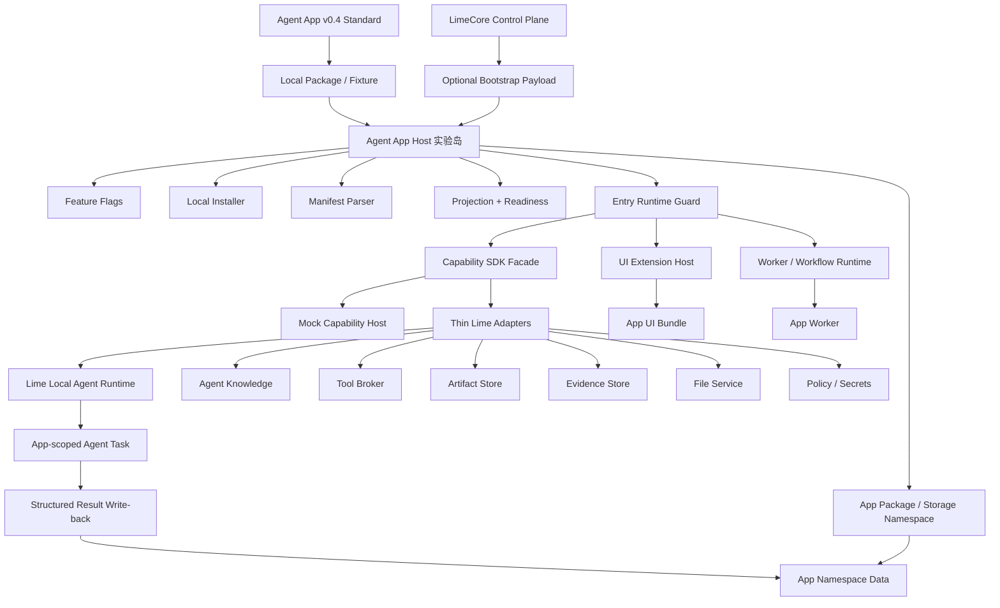
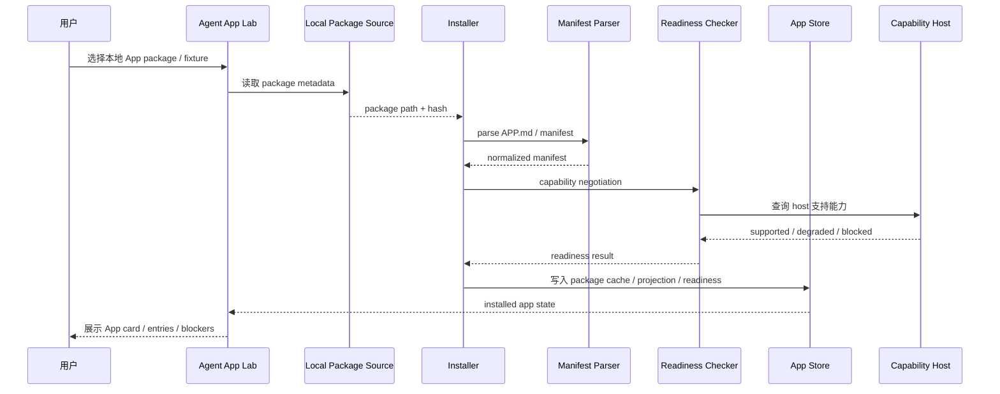
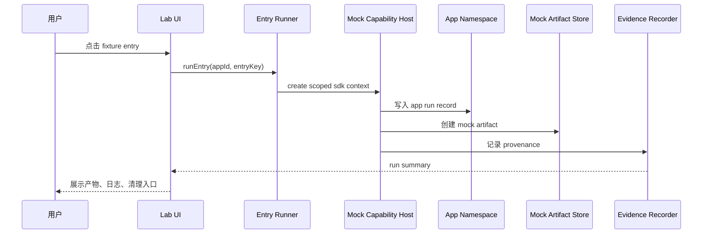
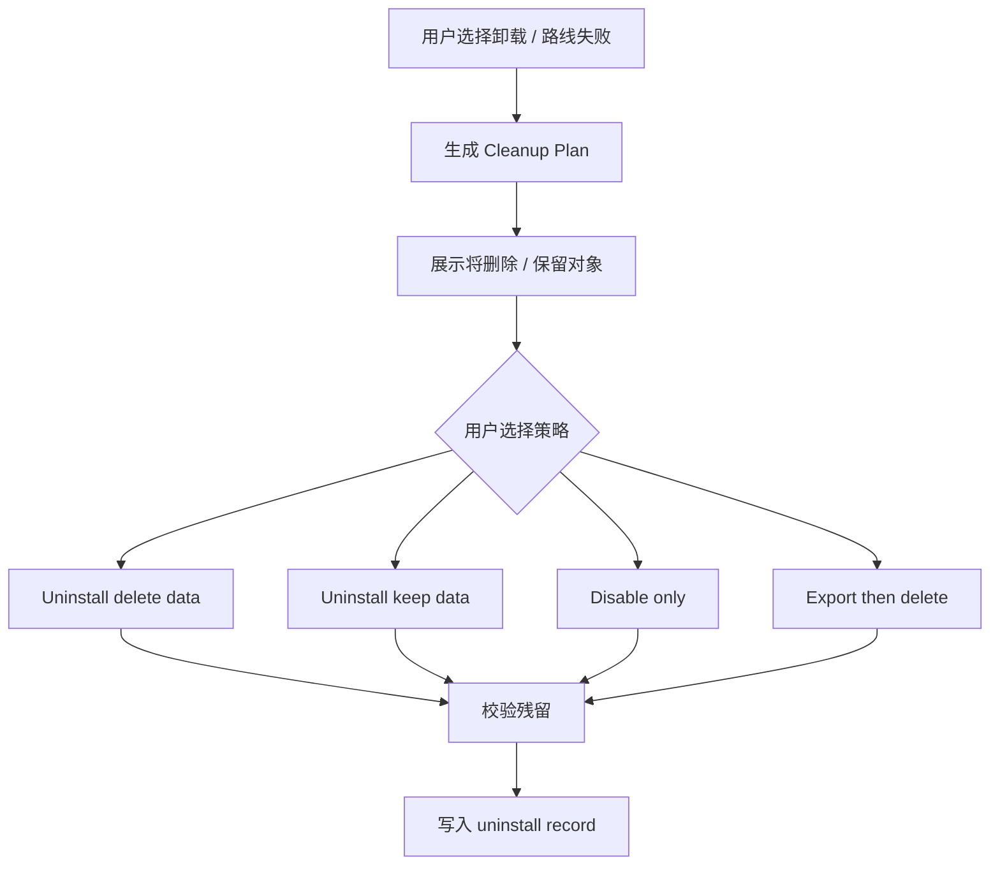

# Agent App 客户端实施方案计划

更新时间：2026-05-16

## 一句话结论

Agent App 在 Lime Desktop 里必须先做成一个可关闭、可卸载、可删除数据、可移除代码的“实验岛”，而不是一开始改造 Chat、Skill、Workspace、Artifact 主路径。

第一阶段目标不是做一个完整生态，也不是复刻行业内容系统，而是证明：一个真实 App package 可以在本地被安装、解析、投影、检查 readiness、调用 Capability SDK、生成可追溯产物，并且在方向失败时能干净清理。进入正式入口后，目标进一步收敛为：业务用户留在 App 自己的业务 UI 内完成流程，Lime Agent 作为受治理的 task runtime 被 App 调用，而不是把用户回跳到通用 Chat。

```text
Agent App Standard v0.4
  ↓
Local Package / Fixture
  ↓
Lime Desktop Agent App Host（实验岛）
  ↓
Capability SDK Facade + Mock Host
  ↓
少量可删除 Adapter
  ↓
现有 Lime 本地能力：Agent / Knowledge / Tools / Artifact / Evidence / Files
```

## 背景

Agent App 不是专家卡片、不是 Prompt 包、不是 Markdown 目录，也不是把某个垂直业务写进 Lime Core。它是安装在 Lime Desktop 中运行的完整应用包：有自己的 UI、业务流程、数据模型、worker、workflow、artifact、权限和升级策略。

新的产品判断是：Agent App 不是独立 Web / SaaS 的包装，也不是 Chat UI 的装饰壳。App 负责业务形态、业务状态和结构化写回；Lime 负责 Agent task、模型 / 工具 / 知识 / 文件 / secret / Artifact / Evidence / policy 等能力。业务不出 App 上下文，Agent 不出 Lime 能力治理边界。

这件事最大的风险不在 Cloud，而在客户端运行时：

1. App 需要调用 Lime 底层能力，天然和 Agent Runtime、Knowledge、Tool、Artifact、Evidence、Files、Policy 绑定。
2. App 又不能直接依赖 Lime 内部实现，否则 Lime 一升级，所有 App 都要跟着大改。
3. 如果一开始把 App entry 接进主导航、命令面板、Chat、Skill Catalog、Artifact schema，会快速污染主路径。
4. 如果路线判断失败，必须能关掉开关、删掉实验目录、清掉 App 数据，而不是留下半套平台代码。

所以客户端实施必须采用“实验岛 + Capability SDK + 可删除 Adapter”的路线。

## 目标

| 目标 | 说明 |
|---|---|
| 验证 App package | 本地读取 Agent App v0.3+ package / fixture，生成 manifest、projection、readiness。 |
| 验证 SDK 边界 | App 只能通过 `@lime/app-sdk` capability facade 调 Lime 能力，不能 import Lime internal modules。 |
| 验证真实业务切片 | 用 内容工厂跑通一个最小业务闭环，而不是停留在专家聊天。 |
| 验证 App 内 Agent 任务 | 在 App 页面 / workflow 内启动、观察、取消、重试、确认 Agent task，并把结构化结果写回业务对象。 |
| 验证本地数据隔离 | App storage、artifact、evidence、log、package cache 独立命名空间，可按 app 清理。 |
| 验证失败退出 | P0 就实现 cleanup plan / uninstall plan，保证失败后能删干净。 |
| 验证未来 Cloud 对接 | 客户端先用 local JSON / fixture，Cloud 只在 P5 作为 catalog / release / tenant enablement 输入。 |

## 非目标

1. P0 不做公开市场、审核流、支付分账、企业分发控制台。
2. P0 不执行任意 App 代码，不支持任意 npm install、native binary、任意文件系统访问。
3. P0 不把 内容工厂写进 Lime Core。
4. P0 不改造 AgentChat、Skill Catalog、Artifact 主 schema。
5. P0 不要求 Cloud 先完成；Cloud 不运行默认 Agent Runtime。
6. P0 不承诺兼容历史实验数据；实验数据必须可删除。
7. P0 不把 App projection 写入全局 registry。
8. P17+ 不把通用 Chat 当作 Agent App 业务流程的强制容器；Expert Chat 只能作为 entry / 嵌入式协作者。
9. P17+ 不允许 App 为了“留在 App 内”而自建模型网关、凭证系统、权限系统、证据系统或工具调度器。

## 总体原则

| 原则 | 落地方式 |
|---|---|
| 实验岛优先 | 代码集中在 `src/features/agent-app/`，主系统只保留 feature flag 入口。 |
| 先静态后运行 | 先做 manifest / projection / readiness，不执行 UI bundle 或 worker。 |
| 先 mock 后 adapter | SDK 先接 mock host，确认接口稳定后再接少量真实能力。 |
| 先本地后 Cloud | P0-P4 使用本地 fixture，P5 才消费 LimeCore bootstrap payload。 |
| 先可删除后扩展 | 安装、运行、产物、日志都必须有 cleanup plan。 |
| SDK 暴露能力 | App 只调用 capability，不知道 Lime 内部 store、command、runtime 路径。 |
| 产物必须可追溯 | Artifact / Evidence / Task / Log 都带 `sourceKind: agent_app` provenance。 |
| 业务不出 App | App 页面内承载任务进度、引用、工具调用、失败、人工确认和结构化写回。 |
| Agent 不出治理 | `lime.agent`、`lime.workflow`、`lime.tools`、`lime.knowledge` 等能力统一走 Host Bridge / Capability SDK / policy。 |

## 仓库边界

本文只描述 Lime Desktop 客户端：

```text
/Users/coso/Documents/dev/ai/aiclientproxy/lime/docs/roadmap/agentapp
```

服务端 / Cloud / LimeCore 控制面文档在：

```text
/Users/coso/Documents/dev/ai/limecloud/limecore/docs/roadmap/agentapp
```

标准仓库事实源在：

```text
/Users/coso/Documents/dev/ai/limecloud/agentapp
```

三者分工：

| 仓库 | 责任 | 不做什么 |
|---|---|---|
| `agentapp` | 标准、schema、示例包、reference CLI。 | 不实现 Lime Desktop 内部能力。 |
| `lime` | 客户端安装、运行、SDK host、UI host、storage、runtime bridge。 | 不实现 Cloud catalog / tenant 管理。 |
| `limecore` | Catalog、release、hash、license、tenant enablement、gateway、audit metadata。 | 不运行默认 Agent、不渲染 App UI、不管理本地 App storage。 |

## 架构图



关键点：

- `Host` 是实验岛，不是主路径。
- `Guard` 是所有 entry 运行前的授权 gate，不是 UI 提示替代品。
- `SDK` 是稳定 facade，不是内部 API 透传。
- `Adapter` 必须薄，且可以按目录删除。
- `Cloud` 只提供元数据，不成为默认 runtime。
- `Agent` 是 App 作用域任务运行时，不是通用 Chat 回跳点；结果必须回到 App storage / Artifact / Evidence。


## v0.3 升级后的计划调整

路线图已从早期 `AI 内容工程化` 样板升级为 Agent App v0.3 / `内容工厂`。因此当前计划新增一个 P4-R rebaseline 阶段，作为 P5 Cloud Bootstrap 的前置 gate。

P4-R 的目标不是新增业务范围，而是让代码事实源与升级后的文档事实源重新一致：

| 调整项 | 旧实现 | v0.3 current |
|---|---|---|
| 标准版本 | `manifestVersion: 0.2.x` | `manifestVersion: 0.3.0` |
| Fixture | `content-engineering-app.json` | `content-factory-app.json` |
| App ID | `shenlan-content-engineering` | `content-factory-app` |
| Workflow entry | `scene_exhaustion` | `content_scenario_planning` |
| Demo API | `runContentEngineeringDemo()` | `runContentFactoryDemo()` |
| Storage | `scenes/*` | `content_scenarios/*` |
| Artifact kind | `content_engineering_table` | `content_table` |
| Evidence kind | `content_engineering_demo` | `content_factory_demo` |

新的执行顺序：

```text
P4-R0 计划与事实源收口
→ P4-R1 v0.3 manifest / fixture / readiness rebaseline
→ P4-R2 内容工厂 demo rename + 数据对象 rebaseline
→ P4-R3 WorkflowRuntimeHost rebaseline 到 content_factory_demo
→ P4-R4 Lab UI / i18n / tests rebaseline
→ P4-R5 verify:local 恢复全绿并确认不复活旧 SceneApp
→ P5 Cloud Bootstrap payload 本地适配器
```

截至 2026-05-16，P4-R、P5、P6、P7、P8、P9、P10、P11、P12、P13 均已通过对应定向验证；P14 Entry Runtime Guard / Permission Prompt、P15 Lab Install / Launch Flow、P15-H GUI smoke / cleanup rehearsal、P16 Agent App Manager、P16-H multi-app lifecycle hardening、P17 Gate 审计、P17.0、P17.1、P17.2.1-P17.2.5、P17.3 lifecycle / cleanup contract、P17.4.1-P17.4.5、P17.5 formal entry GUI smoke、P18.1 SDK facade / stable error / mock host、P18.2 Host Bridge typed router / stable error response、P18.3 Core capability adapters、P18.4 App-scoped Agent task SDK facade、P18.4-H AgentRuntime handoff gate、P18.5.1 Lime-side 内容工厂 SDK regression、P18.5.2 package-side read-only tests、P18.5-S Host Bridge SDK client、P18.5.3 package-side SDK facade / verify / dist 同步与 P18.6 Raw Worker 前 Gate 已完成当前实现 / 专用验证 / 计划收口；完整 `verify:local` 已于 2026-05-16 07:33 端到端通过，2026-05-16 10:53 SDK seam / handoff core 定向测试 5 files / 17 tests passed，`typecheck`、`test:contracts` 与 `lint` 当前会话复核通过。当前下一刀不再扩 P18 功能面，只做 owner handoff / 提交边界收口。阶段记录详见 [v0.3-rebaseline-plan.md](./v0.3-rebaseline-plan.md)、[p15-lab-install-launch-flow.md](./p15-lab-install-launch-flow.md)、[p15-h-gui-smoke-cleanup-rehearsal.md](./p15-h-gui-smoke-cleanup-rehearsal.md)、[p16-agent-app-manager-product-entry-gate.md](./p16-agent-app-manager-product-entry-gate.md)、[p16-h-multi-app-repository-lifecycle-hardening.md](./p16-h-multi-app-repository-lifecycle-hardening.md)、[p17-formal-entry-gate-audit.md](./p17-formal-entry-gate-audit.md)、[p17-formal-entry-contract.md](./p17-formal-entry-contract.md)、[p17-source-install-contract-hardening.md](./p17-source-install-contract-hardening.md)、[p17-lifecycle-cleanup-contract-hardening.md](./p17-lifecycle-cleanup-contract-hardening.md)、[p17-4-host-bridge-runtime.md](./p17-4-host-bridge-runtime.md)、[p17-5-formal-entry-gui-smoke.md](./p17-5-formal-entry-gui-smoke.md)、[p18-typed-capability-sdk-gate.md](./p18-typed-capability-sdk-gate.md)、[p18-4-h-agentruntime-handoff-gate.md](./p18-4-h-agentruntime-handoff-gate.md)、[p18-5-content-factory-sdk-regression.md](./p18-5-content-factory-sdk-regression.md)、[p18-5-3-package-sdk-migration-plan.md](./p18-5-3-package-sdk-migration-plan.md)、[p18-5-3-owner-handoff.md](./p18-5-3-owner-handoff.md)、[p18-6-raw-worker-pre-gate.md](./p18-6-raw-worker-pre-gate.md) 与 [p18-completion-audit.md](./p18-completion-audit.md)。

上游 `agentapp` 标准随后补齐了宿主实现视角的 v0.3 细则：manifest / projection / readiness JSON schema、release metadata、overlay resolver、lifecycle、typed SDK expectations、reference CLI cross-check。P5 因此不能只做一个 Cloud payload DTO，而要先把这些标准差距变成客户端可执行计划；详见 [p5-cloud-bootstrap.md](./p5-cloud-bootstrap.md)。

### 计划更新规则

1. `/Users/coso/Documents/dev/ai/limecloud/agentapp` 是 Agent App v0.4 标准事实源，用来约束 manifest schema、entry kind、capability 版本、runtime package、overlay、readiness、provenance 和 Host Bridge v1。
2. 本目录是 Lime Desktop 客户端实施事实源，用来决定客户端当前要落哪一刀、哪些文件要改、哪些测试要过。
3. P4 demo 的 current 对象以 `content-factory-app / content_scenario_planning / content_factory_demo / content_table / content_scenarios` 为准；如果标准示例包出现不同业务 key，先记录差异，不在客户端实现里混用两套命名。
4. P5 只消费 Cloud bootstrap payload；Cloud / LimeCore 不运行默认 Agent Runtime，也不渲染 App UI。
5. 所有 App 能力调用必须穿过 Capability SDK，不能为了跑通内容工厂而 import Lime internal store 或恢复旧 SceneApp 主路径。

### 2026-05-15 标准升级二次校准

上游 `/Users/coso/Documents/dev/ai/limecloud/agentapp` 已从“概念标准 + 示例包”升级为带宿主实现指南的 v0.3 标准：新增 discovery / installation、release distribution、runtime model、security model、overlay resolver、readiness runner、typed Capability SDK、public JSON Schema 和 reference CLI。LimeCore 服务端路线图也已明确 control-plane-only 边界：服务端只保存 catalog、release、tenant enablement、policy、ToolHub / Gateway metadata；未激活注册码时不下发 `packageUrl / packageHash / manifestHash`，真实 release 必须是 `https` package URL 和完整 `sha256:<64 hex>` hash。客户端计划不需要推翻 P0-P17 主线，但必须把 P17.2 拆得更细，避免把 Cloud metadata、seeded catalog 或开发态源码目录误当成正式安装。

| 上游新增约束 | 客户端计划调整 | 阶段归属 |
|---|---|---|
| Release 必须 pin 到具体 `packageUrl / packageHash / manifestHash / compatibility / signatureRef?`。 | Cloud release 先归一化为 `AgentAppReleaseDescriptor`，再进入 P12 cache / verify；缺 hash、hash mismatch、manifest mismatch 均阻断。 | P17.2.4 |
| 安装审查基于 projection，不执行 App code。 | `installReview` 只能消费 verified package projection、readiness summary、permission / storage / cleanup 摘要；Cloud card 和 Lab fixture 不能直接生成 production review。 | P17.2.4 |
| Cached fallback 只保证已安装版本可用。 | offline / cached 状态只能启动已安装同 hash package；不能在离线时把 Cloud metadata 伪装成新安装。 | P17.2.4 |
| LimeCore 未激活注册码时不下发 package metadata。 | `registration-required / expired / revoked` 必须停在 source state；客户端不能用 seeded fixture、本地开发目录或历史 cache 创建新安装 review。 | P17.2.4b |
| `content-factory-app` seeded catalog 不能带假 release。 | seeded 只允许演示 registration-required；正式 review 必须来自已验证 package source。 | P17.2.4b |
| Public schema 与 reference CLI 成为机械契约。 | 用上游 `docs/public/schemas/*`、`agentapp-ref` 和 `docs/examples/content-factory-app` 做 projection / readiness cross-check，防止客户端字段漂移。 | P17.2.5 |
| Overlay 是 package hash 外的配置。 | P17.3 后 lifecycle / cleanup 必须把 overlay、secret binding、setup state 与 package code 分离；upgrade 不覆盖 overlay。 | P17.3 |
| Runtime surface 必须运行 App 自己的 UI / workflow，并通过 injected SDK。 | 已完成的正式 runtime surface 补丁只能算 P17.4 预铺；P17.4 仍要确认生产路径只加载 verified runtime package，不依赖 dev resolver，并把 SDK bridge / sandbox / provenance 做成可测 gate。 | P17.4 |
| Typed SDK 要有类型、schema、mock 和 contract tests。 | P18 前不得扩 raw worker；先把 `lime.ui / storage / agent / knowledge / tools / artifacts / workflow / policy / secrets / evidence` 的 typed host bridge 形成 SDK gate。 | P18 |

P17.2.5 不是重复 P5.5：P5.5 只在 Cloud bootstrap 和早期 projection 层记录标准差异；P17.2.5 要把同一套 schema / CLI 对照接到正式 `agent-apps` source / install / review / readiness 主链上。

### 2026-05-16 v0.4 Host Bridge / P18 协作校准

上游 `agentapp-ref@0.4.0` 已把 Host Bridge v1 明确为 sandboxed Agent App UI 的标准运行时事件协议。P17.4 已完成 Lime Desktop runtime surface 的 Host Bridge 生产硬化；P17.5 已由独立 GUI smoke 证明正式 `agent-apps` 入口可用。P18 现在可以把 Host Bridge 固定成 App 可依赖的 Typed Capability SDK Gate。

| 上游 v0.4 新约束 | 客户端计划调整 | 阶段归属 |
|---|---|---|
| Host Bridge v1 负责 theme、locale、snapshot、visibility、toast、navigate、download、external open 和 capability invoke 传输。 | P17.4 已完成运行面预铺；P18.0 先做标准 gap matrix，确认 Lime Desktop 事件名、信封、source / origin 校验与上游一致。 | P18.0 |
| App 作者不应直接手写私有 `postMessage` 协议。 | P18.1 已固定 `@lime/app-sdk` typed facade、capability invoke envelope、stable error enum 和 mock host。 | P18.1 已完成 |
| `capability:invoke` 仍必须经过 manifest、readiness、permission、policy 和 provenance。 | P18.2 已引入 typed router / adapter gate，未知 capability 不能返回 mock 成功，Host error 必须映射到 stable error response。 | P18.2 已完成 |
| `lime.agent` 是 App 内 Agent task 能力，不是回跳通用 Chat 的快捷方式。 | P18.4 已把 start / stream / get / cancel / retry / submitHostResponse / listTasks 包成 typed SDK facade；P18.4-H 已完成 AgentRuntime handoff 运行证据对齐。 | P18.4 / P18.4-H 已完成 |
| Raw worker 需要额外沙箱和资源限制。 | P18 只做 typed workflow / capability invoke；raw worker sandbox 放到后续 gate。 | P18.6 / P19 |

协作边界：P17.5 evidence summary 已落地；P18 代码实施继续不启停隔壁 DevBridge / Vite / Tauri，不改 AgentRuntime Rust 投影任务，不把 SDK 设计扩大成 marketplace / raw worker。

### 2026-05-16 隔壁 AgentRuntime 更新接入边界

隔壁 AgentRuntime 任务已把 Agent App Runtime Surface 推进到 current MVP：App-scoped task facade、Host Bridge `lime.agent`、Host response、`artifact:created` refs、跨刷新 task 恢复，以及内容工厂 App 写回 `lime.storage / lime.artifacts / lime.evidence` 都已有 done / first-cut 证据。该输入会降低 P18 SDK 对底层实现的重复建设风险，但不改变本目录的阶段顺序：

1. P17.5 已解除当前主线阻塞；如果隔壁 Rust / GUI 任务运行中，P18 仍不抢占 DevBridge / Vite / Tauri。
2. AgentRuntime 负责 `AgentRuntimeThreadReadModel`、`agent_app_runtime_*` facade、artifact / evidence / handoff 投影和对应 Rust / TS 测试；后端 push subscribe、`content_factory.workspace_patch` producer、独立 capability catalog service、真实桌面 GUI smoke 继续归 AgentRuntime 任务收口。
3. Agent App P18 负责把已验证的 host surface 包成 typed SDK contract；不复制 runtime read model，不新增第二套 artifact / evidence write-back，不绕过 Host Bridge。
4. P18.0 gap matrix 必须把 `task:*`、`artifact:created`、`evidence:recorded`、`evidence:verified` 的事件语义、顺序、幂等和跨刷新恢复列为检查项。

协作分工锁定：

| 工作包 | 本目录 Agent App P18 负责 | 隔壁 AgentRuntime 负责 | 暂不触碰 |
|---|---|---|---|
| P18.1 SDK contract | 已完成：`@lime/app-sdk` typed facade、stable error、mock host、capability invoke envelope、SDK contract tests。 | 提供现有 facade 行为事实，不要求同步改 Rust。 | 未改 `src-tauri/*`、`src/lib/api/agentAppRuntime.ts`、`agentRuntimeCapabilityHost*`。 |
| P18.2 Host Bridge router | 已完成：source / origin / appId / entryKey / requestId / typed envelope / stable error mapping 的 typed gate。 | 继续维护 runtime read model 与 command 四侧事实。 | 未启停隔壁 DevBridge / Vite / Tauri。 |
| P18.3 Core adapters | 已完成：`lime.ui / storage / artifacts / evidence / knowledge / tools` 的 typed adapter、namespace / provenance 测试已落。 | 提供 Artifact / Evidence / Tool / Knowledge 的真实 owner 能力。 | 不新增第二套 store、scanner、installer；typecheck / contracts 已通过。 |
| P18.4 App-scoped Agent task | 已完成：消费 `start / stream / get / cancel / retry / submitHostResponse / listTasks`，固定 SDK 事件与错误语义。 | 负责 push subscribe、workspace patch producer、capability catalog 和 Rust / TS 运行事实测试。 | 不复制 Claw `*_skill_launch.rs`，不建垂直 `content_factory_*` 命令。 |
| P18.4-H AgentRuntime handoff | 已完成：消费隔壁 current MVP 证据，明确 push subscribe、workspace patch producer、capability catalog、真实桌面 GUI smoke 的 owner 与退出条件。 | 继续负责运行事实和 GUI 验证链路。 | Agent App P18 只补 SDK contract / docs，不抢 runtime facade / Rust / smoke 脚本。 |
| P18.5 内容工厂 SDK 回归 | Lime-side SDK regression、Host Bridge SDK client、package-side tests / validate / readiness、P18.5.3 SDK facade、真实 package verify 与 dist 同步均已完成；handoff gate `blockers=none`、`distArtifacts=0`。 | 保证 runtime structured patch / artifact / evidence 可被 App 消费。 | 不复刻内容工厂后端产品，不把 Chat 包成主流程；后续只做 owner handoff / 提交边界。 |
| P18.6 Raw Worker 前 Gate | 已完成：P18 不执行 raw worker、外部代码、网络、文件系统或 secret value；raw worker sandbox 后移 P19。 | P19 前只保留受控 workflow DSL 和 typed capability SDK。 | 不新增 worker runtime、不执行任意 package JS。 |

### P14 / P15 / P16 计划更新

上游 Agent App 标准进一步把宿主最低职责收敛成 `Discover → Validate → Project → Check readiness → Authorize → Inject capabilities → Isolate data → Clean up`。P0-P13 已覆盖到 `Check readiness` 与 runtime package loader，缺口集中在 `Authorize` 和 Lab 端到端编排：

| 阶段 | 新定位 | 计划影响 |
|---|---|---|
| P14 | Entry Runtime Guard / Permission Prompt。 | 先把 entry 运行前授权做成硬 gate，合并 readiness、setup、package verification、runtime policy 和用户授权。 |
| P15 | Lab Install / Launch Flow。 | 已串联 install review、verify/cache、installed state、permission prompt、runtime launch 和 cleanup preview。 |
| P15-H | GUI Smoke / Cleanup Rehearsal。 | 已补 Agent App Lab 专用 GUI smoke 与证据输出；全局 GUI smoke 的外部 provider/model 缺口不伪装为 Agent App 失败。 |
| P16 | Agent App Manager / Product Entry Gate。 | 已在实验岛内完成最小 installed app 状态、entry launcher、enable / disable / uninstall preview 和 cleanup evidence；详见 [p16-agent-app-manager-product-entry-gate.md](./p16-agent-app-manager-product-entry-gate.md)。 |
| P16-H | Multi-app repository / lifecycle hardening。 | P16-H.5 已完成最小实现；P17 Gate 已完成审计。 |

这次调整的关键是：P14 是 P15 的前置 gate；P15 / P15-H 已复用 guard，不能为了 GUI smoke、后续演示或正式入口直接调用 loader 或 CapabilityHost。P16 也必须先留在实验岛内验证多 App 生命周期，不能跳到 marketplace 或主导航。

### P16-H 执行计划

P16-H 不是“把 Manager 做大”，而是把 P16 已证明的单 App 管理闭环压到平台级最小可靠性：多 App 列表、生命周期持久化、清理演练证据和残留检查都必须复用同一套 current 事实源。

| 顺序 | 交付 | 事实源 / 约束 | 验收 |
|---|---|---|---|
| P16-H.0 | 已完成：计划收口。 | `p16-h-multi-app-repository-lifecycle-hardening.md` 成为 P16-H 详细计划。 | README、implementation plan、P16 文档都指向同一下一刀。 |
| P16-H.1 | 已完成最小实现：Repository-backed multi-app list。 | 只读 P11 `LocalInstalledAgentAppStateRepository`；React state 只做展示缓存。 | Manager 能展示多个 installed app，并可选择当前 App。 |
| P16-H.2 | 已完成最小实现：Selected app launcher + persisted lifecycle。 | launch 继续走 P14 guard；disable / enable 继续走 repository lifecycle API。 | disabled App 不能旁路启动，刷新后状态不丢。 |
| P16-H.3 | 已完成最小实现：Cleanup rehearsal evidence export。 | 复用 P15 uninstall / cleanup preview，不执行真实 delete-data。 | 导出 summary 包含 appId、version、hash、strategy、targets、blockedTargets、timestamp。 |
| P16-H.4 | 已完成最小实现：Residual audit。 | 只检查 Agent App namespace，不扫描 Lime 主业务数据。 | 区分 retained、pending deletion、blocked out-of-scope、repository issue。 |
| P16-H.5 | 已完成最小实现：GUI smoke + flag-off regression。 | 只扩展 Agent App Lab 专用 smoke，不接主导航。 | summary 覆盖 multi-app list、selected app、disable blocker、cleanup evidence、residual audit 与 flag-off。 |
| P17 Gate | 已完成：正式入口前完成度审计。 | 只做审计与缺口登记，不直接发布 marketplace 或主导航。 | Gate checklist 已逐项映射 P16-H 证据与剩余缺口。 |
| P17.0 | 已完成计划收口：Formal Entry Contract。 | 只定义正式 Agent Apps 受控入口契约，不扩 marketplace / Cloud 管理台 / 真实 delete-data。 | 已写清 `agent-apps`、`agent-app-lab` 与 runtime surface 的责任边界、禁区、架构和后续 gates。 |
| P17.1 | 已完成最小实现：Formal route / nav / copy hardening。 | 只硬化正式入口路由、导航、状态文案和测试契约。 | `agent-apps` 不依赖 Lab flag；UI entry 从正式入口进入独立 runtime surface；正式入口文案五语言覆盖。 |
| P17.2 | 已完成最小实现：Source / install contract hardening。 | P17.2.1 / P17.2.2 / P17.2.3 已完成 source state model、install review descriptor 与 registration hardening；P17.2.4a 已完成 Cloud release descriptor / verification gate；P17.2.4b-1 已完成 acquisition seam / verified cache source；P17.2.4b-2 已完成 packageUrl fetch / staging / manifest extraction；P17.2.5 已完成 schema / reference CLI / example package cross-check。详见 [p17-source-install-contract-hardening.md](./p17-source-install-contract-hardening.md)。 | local / cloud 安装已先 review 后 save，registration-active refresh 已有 UI 断言；packageUrl fetch 可生成 verified cache 后再进入 Cloud review；reference CLI cross-check 已覆盖 projection / readiness / review descriptor。 |
| P17.3 | 已完成最小实现：Lifecycle / cleanup contract hardening。 | P17.3.1-P17.3.6 已完成 lifecycle descriptor、formal page lifecycle UI、cleanup namespace classifier、evidence / residual audit、guard integration 与 boundary regression。详见 [p17-lifecycle-cleanup-contract-hardening.md](./p17-lifecycle-cleanup-contract-hardening.md)。 | disabled / cleanup-blocked 不能启动；uninstall 保持 rehearsal-only；evidence 不含 secret value；residual audit 只查 Agent App namespace。 |
| P17.4 | 已完成：Runtime surface production hardening。 | P17.4.1-P17.4.5 已完成 guard-before-start、Host Bridge task contract、structured write-back guard、content factory bootstrap sample 与完整 GUI smoke。详见 [p17-4-host-bridge-runtime.md](./p17-4-host-bridge-runtime.md)。 | code-level tests、typecheck、contracts、feature island boundary 与 `verify:gui-smoke` 均有证据；runtime surface 已支撑 P17.5 formal smoke。 |
| P17.5 | 已完成：Formal entry GUI smoke。 | `smoke:agent-apps` 已覆盖正式 `agent-apps` install / registration / launch / disable / uninstall rehearsal / runtime surface / flag-off。详见 [p17-5-formal-entry-gui-smoke.md](./p17-5-formal-entry-gui-smoke.md)。 | 独立 summary 已输出到 `.lime/qc/gui-evidence/agent-apps/agent-apps-smoke-summary.json`；Lab smoke 仍只作研发辅助证据。 |

P17.5 完成只证明正式入口独立 smoke 可交付；marketplace、Workspace pin、命令面板入口、Chat expert entry、真实 delete-data 和 Cloud 管理台仍不进入当前主线。

### 已完成计划：P17.0 Formal Entry Contract

P17.0 的最小可交付不是“做市场”，而是把 P17 Gate 审计后的正式入口契约写清楚。本阶段已沉淀为 [p17-formal-entry-contract.md](./p17-formal-entry-contract.md)：

1. 定义 `agent-apps` current 入口允许的用户能力：install、launch、disable、registration、uninstall rehearsal、runtime surface。
2. 定义 `agent-app-lab` 继续保留的研发验证能力：fixture、smoke、cleanup rehearsal、flag-off、实验 runtime 断言。
3. 固定禁区：marketplace、Cloud 管理台、真实 delete-data、raw worker、绕过 SDK。
4. 明确后续 gates：真实删除、public catalog、企业控制台、完整内容工厂业务系统都必须另立计划。

### 已完成计划：P17.1 Formal route / nav / copy hardening

P17.1 的最小可交付不是重写 Agent Apps 页面，而是把正式入口已经存在的 route / nav / copy / state contract 做硬化。本阶段已完成最小实现：

1. 先固定入口语义：`agent-apps` 是用户入口，`agent-app-lab` 是研发验证入口，Lab flag-off 不影响 `agent-apps`。
2. 再固定路由参数：正式入口只接受 appId、entryKey、launchRequestKey 等 App 运行参数，不复用 Lab fixture 参数。
3. 再固定状态文案：loading、empty、needs-setup、blocked、disabled、uninstall rehearsal、registration、runtime empty 必须五语言覆盖。
4. 再固定测试证据：`AgentAppsPage`、`AgentAppRuntimePage`、`sidebarNav` 覆盖 formal entry，Lab smoke 只作为辅助回归。
5. 最后做边界审计：不新增 Tauri command，不让 `src/features/agent-app` 直接 `safeInvoke` / `invoke`，不新增第二套 store / installer。

P17.1 已落地的具体证据：

1. `AgentAppsPage` 新增 `onNavigate`，UI entry 经 P14 guard 允许后进入独立 `agent-app` runtime surface，而不是在正式入口内继续伪装 Lab mount。
2. `AppPageContent` 将主导航 `onNavigate` 传给 `AgentAppsPage`，保证正式入口可以打开 App runtime。
3. 本地安装入口改为选择包含 `APP.md` 的目录，不展示本机硬编码路径。
4. 新增正式受控入口 badge 与 boundary note，并覆盖五语言。
5. 定向测试覆盖 formal entry route、copy、select-local、AppPageContent props、sidebar footer / Lab flag 边界。

P17.1 不做 public catalog、真实 delete-data、Cloud 管理台、Workspace pin、命令面板入口或完整内容工厂业务系统。

### 已完成计划：P17.2 Source / install contract hardening

P17.2 的最小可交付不是做 marketplace，而是把正式入口 source / install / registration 的状态契约收口。本阶段已完成 P17.2.1 / P17.2.2 / P17.2.3、P17.2.4a、P17.2.4b-1、P17.2.4b-2 与 P17.2.5；后续 P17.3、P17.4 与 P17.5 已完成，当前进入 P18 Typed Capability SDK Gate：

1. 已完成 source state：local folder、cloud release metadata、registration-required、registration-active、disabled、hash-missing、installed、offline fallback 已有清晰 UI 状态。
2. 已完成 install review gate：安装前展示 appId、version、source、hash、manifest、capability summary，并把 confirm 前不写 repository 的 UI / API 边界拆出来；Cloud production review 的真实 package 来源仍由 P17.2.4 收口。
3. 已完成 registration：注册码只改变 Cloud enablement，不写入 App package，不绕过 package verify，并已补强提交后 source state refresh 的 UI 断言。
4. 已完成 P17.2.4a：把 Cloud release metadata 归一为 release descriptor，强制 `packageUrl / packageHash / manifestHash / compatibility`，Cloud review 缺 package manifest 或 hash mismatch 时阻断。
5. 已完成 P17.2.4a：明确 cached fallback 必须 appId + version + packageHash + manifestHash 全匹配，不能把 Cloud card、tenant enablement 或开发态 resolver 当成新安装。
6. 已完成 P17.2.4b-1：补可注入 package acquisition seam、verified cache 命中和 missing source blocker；UI 不再只能依赖调用方显式传入 `packageManifest`。
7. 已完成 P17.2.4b-2：把 `packageUrl` 下载 / staging / manifest extraction 接入 P12 cache；唯一 Tauri fetch command 已同步前端 gateway、Rust 注册、治理目录册、DevBridge mock priority 与 tauri mock。
8. P17.2.5：用上游 public schema、reference CLI 与 `content-factory-app` 示例包做 projection / readiness cross-check，确保客户端字段和标准文档不漂移。
9. 最后做边界审计：仍复用 `src/lib/api/agentApps.ts`、P12 cache、P11 repository，不新增平行 installer；如必须改 Tauri bridge，按命令契约四侧同步。

### P17.2.4b 最小实施顺序

1. **Source acquisition seam**：在 `src/lib/api/agentApps.ts` 内集中新增 Cloud release package acquisition 边界，输入只接受 `CloudBootstrapApp` / release descriptor，输出必须是 verified package manifest + verification result；`src/features/agent-app` 仍不得直接 `safeInvoke`。
2. **Cache-first**：优先复用 P12 package cache / package identity；已验证同 appId + version + packageHash + manifestHash 的 cache 可以生成 review，hash 不一致必须 blocker。
3. **Fetch boundary**：没有 verified cache 时只通过唯一 Tauri bridge `agent_app_fetch_cloud_package` 下载 / staging / manifest extraction；不允许在 UI、feature island 或 Cloud API 客户端里各写一套 downloader。
4. **UI blocker**：`AgentAppsPage` 需要把“缺 verified package source / registration inactive / package hash mismatch / manifest hash mismatch”展示为 source state 或 review blocker，而不是泛化 toast。
5. **Repository rule**：P17.2.4b 只在用户确认 review 后写 P11 repository；下载失败、验证失败、用户取消都不能留下半安装态。
6. **Validation**：定向测试必须覆盖 cache hit、fetch package、cache miss blocker、hash mismatch blocker、registration no-package metadata、review no-save 和 install confirm-save；新增 command 必须继续纳入 `test:contracts`。

### 2026-05-15 Formal Runtime Surface 补丁后的计划重排

正式入口已经补上 `agent_app_start_ui_runtime` 到 `AgentAppRuntimePage` iframe 的最小闭环：Host 不再渲染自己的假业务页面，而是启动 App 包自己的 UI 并打开 entry route。这个改动解决的是“已安装 App 能否进入自己的 runtime surface”，但不解决“Cloud release 是否已经被正式下载、校验、缓存并安装”。

因此计划按以下口径更新：

1. 该补丁归类为 **P17.4 pre-work / current**：它是 runtime surface 的必要基础，不是 P17.2 完成证据。
2. P17.2 主线已完成：P17.2.4b-2 已把 `cloud_release` 的 `packageUrl` 落成 verified package cache / staging；P17.2.5 已完成标准 schema / reference CLI cross-check；P17.3、P17.4.5 与 P17.5 均已完成，当前进入 P18 Typed Capability SDK Gate。
3. `LIME_AGENT_APP_LOCAL_ROOTS` 和开发态 `limecloud/<appId>` resolver 只服务本地开发 / 已存在源码包联调；生产路径不能用它们绕过 package hash、manifest hash 和 release descriptor。
4. P17.4 后续验收必须证明：disabled / unverified / missing package 不会启动；runtime 只加载 P12 verified package；App UI 只能通过 injected SDK handles 调 Lime 能力。
5. P17.5 formal smoke 已覆盖正式 `agent-apps` 的 install / registration / launch / disable / uninstall rehearsal / runtime surface / flag-off，不能继续用 Lab smoke 冒充正式入口证据。

### 已完成计划：P17 Gate

P17 Gate 的最小可交付不是“上线正式 Agent Apps 入口”，而是对 P16-H.1-P16-H.5 做完成度审计，确认是否真的具备进入正式入口设计的条件：

1. 先建 checklist：把多 App repository、selected launcher、persistent lifecycle、cleanup evidence、residual audit、flag-off smoke、command boundary、Cloud boundary、失败退出方案逐项映射到证据。
2. 再验真实证据：不能只看文档状态，要检查测试、smoke summary、command contracts、boundary rg、source 文件和证据截图。
3. 再分类缺口：缺代码、缺测试、缺 GUI 证据、缺文档、缺守卫必须分开，不把可选 polish 混进主线缺口。
4. 最后给 Gate 结论：满足则进入 P17 正式入口设计；不满足则回 P16-H 补最短缺口。

P17 Gate 审计已沉淀到 [p17-formal-entry-gate-audit.md](./p17-formal-entry-gate-audit.md)，并已继续完成 [P17.0 Formal Entry Contract](./p17-formal-entry-contract.md)、P17.1 formal route / nav / copy hardening、P17.2 source / install contract hardening、P17.3 lifecycle / cleanup contract hardening、P17.4 runtime surface production hardening 与 P17.5 formal entry GUI smoke；当前下一刀进入 P18 Typed Capability SDK Gate。

### 已完成计划：P16-H.5

P16-H.5 的最小可交付不是“发布正式入口”，而是把 P16-H.1-P16-H.4 的多 App lifecycle 证据固化成可重复 GUI smoke，并补 flag-off 后的失败退出证明：

1. 先补 smoke 断言：`smoke:agent-app-lab` summary 必须覆盖 multi-app list、selected app、selected runtime app、cleanup evidence、residual audit visible / pending。
2. 再补 flag-off regression：关闭 Agent App Lab 相关 host flag 后，Manager 不出现在普通 Chat / Skill / Artifact / Workspace 主路径。
3. 再补边界审计：`src/features/agent-app` 仍无 `safeInvoke` / `invoke`、Tauri command、mock priority 或 raw Worker。
4. 再处理契约阻塞：若工作区出现正式 API 网关或 Tauri command 候选，必须单独对齐 command catalog / Rust 注册 / mock，不并入 P16-H 实验岛。
5. 最后更新证据：P16-H 文档记录 smoke summary、flag-off 证据、contracts 状态；通过后才评估 P17 正式入口方案。

本阶段明确不做 marketplace、正式主导航、Cloud 管理台、真实 delete-data、远程下载器或完整行业内容系统。

### 已完成计划：P16-H.4

P16-H.4 的最小可交付是把 P16-H.3 的 cleanup rehearsal evidence 转成 residual audit，不新增真实删除能力：

1. 先补纯函数：输入 selected installed state、cleanup evidence、repository issue，输出 retained、pending deletion、blocked out-of-scope、repository issue 四类 residual。
2. 再接 Manager：`AgentAppManagerPanel` 只展示 residual audit summary，不扫描真实文件系统、不调用 Tauri。
3. 再接 Lab：keep-data / delete-data preview 后展示 selected app 的 audit 结果，仍复用 P11 repository 和 P16-H.3 evidence。
4. 再补验证：组件测试覆盖四类 residual，Lab 测试覆盖 companion app，`smoke:agent-app-lab` summary 覆盖 residual audit visible / selected app。
5. 最后更新证据：P16-H 文档记录命令结果；P16-H.4 完成后下一刀切到 P16-H.5 GUI smoke + flag-off regression。

本阶段明确不做真实删除、不做全盘 residual scan、不接正式入口、不新增 Tauri command、不让 Agent App 直接 `safeInvoke` / `invoke`。

### 已完成计划：P16-H.3

P16-H.3 的最小可交付不是“卸载功能”，而是把 keep-data / delete-data 演练固化成可复核 JSON evidence summary：

1. 先补纯函数：基于 selected installed state 与 P15 cleanup preview 生成 `cleanup rehearsal evidence`，字段固定为 appId、appVersion、packageHash、manifestHash、strategy、targets、blockedTargets、generatedAt。
2. 再接 Manager：`AgentAppManagerPanel` 只展示 Lab-only JSON 预览，不写文件、不下载、不调用 Tauri。
3. 再接 Lab：`AgentAppLabPage` 的 keep-data / delete-data preview 必须使用 selected app state，不能回退到默认内容工厂 fixture。
4. 再补验证：组件测试覆盖 JSON summary，Lab 测试覆盖 companion app，`smoke:agent-app-lab` summary 覆盖 selected appId / strategy / blocked target count。
5. 最后更新证据：P16-H 文档记录命令结果；P16-H.3 完成后下一刀切到 P16-H.4 residual audit。

本阶段明确不做真实删除、不做全盘 residual scan、不接正式入口、不新增 Tauri command、不让 Agent App 直接 `safeInvoke` / `invoke`。

## 模块设计

客户端代码集中放在一个独立功能目录：

```text
src/features/agent-app/
├── README.md
├── featureFlag.ts
├── types.ts
├── manifest/
│   ├── parseManifest.ts
│   ├── normalizeManifest.ts
│   └── parseManifest.test.ts
├── projection/
│   ├── projectApp.ts
│   ├── projectionGuards.ts
│   └── projectApp.test.ts
├── readiness/
│   ├── checkReadiness.ts
│   ├── capabilityNegotiation.ts
│   └── checkReadiness.test.ts
├── install/
│   ├── packageSource.ts
│   ├── packageVerifier.ts
│   ├── localPackageStore.ts
│   ├── installedAppState.ts
│   ├── packageCache.ts
│   ├── setupStateStore.ts
│   ├── cloudBootstrap.ts
│   ├── labInstallFlow.ts
│   ├── cleanupPlan.ts
│   ├── uninstallApp.ts
│   └── installFlow.test.ts
├── sdk/
│   ├── LimeAppSdk.ts
│   ├── CapabilityHost.ts
│   ├── MockCapabilityHost.ts
│   ├── capabilityErrors.ts
│   ├── provenance.ts
│   └── contract.test.ts
├── adapters/
│   ├── artifactAdapter.ts
│   ├── evidenceAdapter.ts
│   ├── knowledgeAdapter.ts
│   ├── agentRuntimeAdapter.ts
│   └── adapterGuards.ts
├── runtime/
│   ├── uiExtensionHost.ts
│   ├── workerRuntimeHost.ts
│   ├── runtimePackageLoader.ts
│   ├── entryRuntimeGuard.ts
│   ├── runtimePolicy.ts
│   └── runtimeSandbox.test.ts
├── ui/
│   ├── AgentAppLabPage.tsx
│   ├── AgentAppCard.tsx
│   ├── AgentAppEntriesPanel.tsx
│   ├── AgentAppReadinessPanel.tsx
│   ├── AgentAppRunPanel.tsx
│   └── AgentAppCleanupPanel.tsx
└── fixtures/
    ├── content-factory-app.json
    └── content-factory-run.fixture.json
```

主系统只允许极薄入口：

```ts
if (featureFlags.agentAppHost.labEnabled) {
  registerAgentAppLabEntry()
}
```

禁止在 P0-P2 出现：

```text
agent-app 逻辑散落到 Chat 主流程
agent-app 逻辑散落到 Skill Catalog 主数据结构
agent-app 逻辑散落到 Artifact 主 schema
agent-app entry 直接进入正式命令面板
App package 直接 import src/ 内部模块
```

### Tauri / Rust 边界

如果 P0 必须增加 Rust 能力，也必须独立目录，且只服务实验岛：

```text
src-tauri/src/agent_app/
├── manifest.rs
├── installer.rs
├── projection.rs
├── readiness.rs
├── storage.rs
├── cleanup.rs
└── commands.rs
```

原则：

1. 能先用 TypeScript + local fixture 验证的，不先加 Rust 命令。
2. 必须加命令时，遵守 Lime command boundary，同步前端 gateway、Rust registration、catalog、mock。
3. Rust 只暴露安装、读取、清理等本地能力，不承载 App 业务逻辑。

## Feature Flag 策略

所有能力默认关闭，按层启用：

```ts
agentAppHost: {
  labEnabled: false,
  localPackageEnabled: false,
  projectionEnabled: false,
  readinessEnabled: false,
  mockSdkEnabled: false,
  localStorageEnabled: false,
  realAdapterEnabled: false,
  uiRuntimeEnabled: false,
  workerRuntimeEnabled: false,
  cloudBootstrapEnabled: false
}
```

| 开关 | 启用内容 | 默认 | 失败止血 |
|---|---|---|---|
| `labEnabled` | 显示 Agent App Lab 页面。 | off | UI 入口消失。 |
| `localPackageEnabled` | 读取本地 package / fixture。 | off | 不扫描本地 App。 |
| `projectionEnabled` | 生成 projection。 | off | 不产生派生对象。 |
| `readinessEnabled` | 检查 capability / permission / runtime。 | off | 不做启用判断。 |
| `mockSdkEnabled` | 使用 mock capability host。 | off | 不运行 mock action。 |
| `localStorageEnabled` | 创建 App namespace。 | off | 不写本地实验数据。 |
| `realAdapterEnabled` | 接入少量真实 Lime adapter。 | off | 回退 mock。 |
| `uiRuntimeEnabled` | 加载受控 UI bundle。 | off | 回退只读 projection。 |
| `workerRuntimeEnabled` | 执行受控 workflow DSL，仍不执行 raw worker bundle。 | off | 不跑后台任务。 |
| `cloudBootstrapEnabled` | 消费 LimeCore bootstrap。 | off | 只用本地 fixture。 |

## 数据边界

P0 使用独立物理目录，不混入现有主业务表：

```text
<LimeAppData>/agent-apps/
├── installed-apps.json
├── packages/
│   └── sha256-<package-hash>/
├── projections/
│   └── <app-id>.json
├── readiness/
│   └── <app-id>.json
├── storage/
│   └── <app-id>/
│       └── app.sqlite 或 data.json
├── artifacts/
│   └── <app-id>/
├── evidence/
│   └── <app-id>/
├── logs/
│   └── <app-id>/
└── exports/
    └── <app-id>/
```

如果进入现有 Artifact / Evidence 系统，必须附带统一 provenance：

```ts
type AgentAppProvenance = {
  sourceKind: 'agent_app'
  appId: string
  appVersion: string
  packageHash: string
  manifestHash: string
  entryKey?: string
  workflowRunId?: string
  workspaceId?: string
  taskId?: string
}
```

禁止：

```text
App storage 直接写主业务表
App 产物没有 sourceKind
App package hash 包含用户数据
App 升级覆盖用户 storage
App 卸载默认删除用户数据
```

## 安装流程



安装器 P0 验收：

- hash / manifest hash 可计算。
- projection 是只读派生对象。
- readiness 可解释缺失能力。
- 失败不会写入半安装状态。
- 重复安装同 hash 可幂等。

## 运行流程

P0-P1 不执行 App 自带代码，只运行内置 mock action：



P2 之后才允许把部分 SDK capability 接到真实 adapter：

```text
MockCapabilityHost
  ↓ contract tests 通过
Thin Lime Adapter
  ↓ feature flag 启用
真实本地能力
```

## Projection 边界

Projection 是安装时生成的只读派生对象，不是全局注册：

```ts
type AgentAppProjection = {
  app: AppSummary
  package: PackageIdentity
  entries: ProjectedEntry[]
  requiredCapabilities: CapabilityRequirement[]
  storage?: StorageProjection
  artifacts?: ArtifactProjection[]
  policies: PolicyProjection[]
  readinessHints: ReadinessHint[]
  provenance: AgentAppProvenance
}
```

允许：

```text
在 Lab UI 渲染 projection
用 projection 做 readiness 检查
用 projection 创建 scoped SDK context
按 projection 生成 cleanup plan
```

禁止：

```text
写入 command registry
写入 skill catalog
写入 artifact catalog
写入 workspace routes
自动注册快捷键
自动注册全局搜索结果
```

## Capability SDK 实施策略

P0 SDK 先做 facade、错误码、mock host 和 provenance，不绑定内部实现。

```ts
interface LimeAppSdk {
  storage: LimeStorageCapability
  files: LimeFilesCapability
  agent: LimeAgentCapability
  knowledge: LimeKnowledgeCapability
  tools: LimeToolsCapability
  artifacts: LimeArtifactsCapability
  workflow: LimeWorkflowCapability
  evidence: LimeEvidenceCapability
  policy: LimePolicyCapability
  secrets: LimeSecretsCapability
  events: LimeEventsCapability
}
```

所有 capability 必须满足：

1. 不暴露 Lime internal path。
2. 所有调用都接收 scoped app context。
3. 所有错误都走稳定错误码。
4. 同一接口有 mock host 和真实 adapter 两种实现。
5. host 自动附加 provenance。
6. permission、readiness、feature flag 在 bridge 层强制拦截。
7. contract test 固定接口行为。

稳定错误码：

```text
CAPABILITY_MISSING
VERSION_UNSUPPORTED
PERMISSION_DENIED
READINESS_BLOCKED
HOST_UNAVAILABLE
APP_DISABLED
APP_STORAGE_UNAVAILABLE
APP_RUNTIME_UNSUPPORTED
APP_PACKAGE_INVALID
APP_PACKAGE_HASH_MISMATCH
APP_CLEANUP_FAILED
```

## UI Runtime 策略

P0-P2 不加载 App UI bundle，只用 Lab projection 展示。

P3 才做受控 UI Extension Host：

| 能力 | P3 范围 | 禁止 |
|---|---|---|
| `page` entry | 在受控容器中展示 App 页面。 | 直接注册主路由。 |
| `panel` entry | 在 Lab 中打开侧栏 / 面板。 | 直接改 Workspace layout。 |
| `settings` entry | 展示 App 自己的设置页。 | 修改全局设置结构。 |
| SDK 注入 | Host 注入 scoped handles。 | App import 内部模块。 |
| 权限提示 | UI 解释权限用途。 | 只靠 UI 提示，不做 runtime 拦截。 |

UI Host 最小要求：

- App UI 无法访问 Node / Tauri raw API。
- App UI 无法直接读写文件、secret、网络。
- App UI 只能通过 injected SDK bridge 访问能力。
- 关闭 `uiRuntimeEnabled` 后，所有 App 页面回退到只读 Lab 展示。

## Worker / Workflow Runtime 策略

Worker 是最高风险项，必须晚于 UI Host：

| 阶段 | Runtime 能力 | 是否执行 App 代码 |
|---|---|---|
| P0 | manifest / projection / readiness | 否 |
| P1 | mock entry action | 否，只跑内置 mock handler |
| P2 | thin adapter action | 否，仍由 Lime 内置 runner 调 adapter |
| P3 | 受控 UI bundle | 是，仅 UI 容器 |
| P4.1 | 内容工厂内置 runner | 否，仍由 Lime 内置 demo 编排 |
| P4.2 | 受控 workflow DSL | 否，只执行白名单 SDK step，不执行 raw worker bundle |
| P4.x | 真实 worker sandbox | 是，必须有 policy、cancel、trace、resource limit |

Worker 禁止项：

```text
任意 JS worker
任意 npm dependency install
native binary
未声明网络访问
未声明文件系统访问
App 自带模型网关
明文 secret
不可取消长任务
无 trace 的工具调用
```

## 内容工厂验证切片

内容工厂只作为平台验证样板，不进入 Lime Core。

P4 最小闭环：

```text
创建项目
→ 保存到 app namespace
→ 选择本地 fixture 知识
→ 生成内容场景表 mock / local agent result
→ 生成内容资产
→ 创建内容表 Artifact
→ 记录 Evidence provenance
→ 展示 cleanup plan
→ uninstall delete data 清理
```

最小业务对象：

| 对象 | 存储位置 | 产物 |
|---|---|---|
| project | App storage namespace | 项目配置。 |
| knowledge binding | App storage + lime.knowledge ref | 三层知识库引用。 |
| content_scenarios | App storage | 内容场景规划表。 |
| content assets | App storage | 文案 / 脚本 / 图片提示词。 |
| content table | Artifact store 或实验 artifact dir | 可导出内容表。 |
| evidence | Evidence store 或实验 evidence dir | 来源、模型、知识版本、App provenance。 |

停止条件：

- 为了跑通 P4，需要修改超过 3 个 Lime 核心主路径模块。
- App 需要绕过 SDK 直接调用 internal store。
- App 数据无法按 namespace 清理。
- 产物无法区分 `sourceKind: agent_app`。

触发停止条件时，不继续堆业务功能，回到 SDK / Host 边界设计。

## 清理与卸载

P0 必须同步实现 cleanup plan，不允许“先装上再说”。

```ts
type AppCleanupPlan = {
  appId: string
  packageHash: string
  packageCachePaths: string[]
  projectionPaths: string[]
  readinessPaths: string[]
  storageNamespaces: string[]
  artifactRefs: string[]
  evidenceRefs: string[]
  taskRefs: string[]
  secretRefs: string[]
  logPaths: string[]
  exportPaths: string[]
}
```

卸载策略：

| 策略 | 行为 | 用途 |
|---|---|---|
| Disable only | 禁用 App，保留 package 和数据。 | 临时止血。 |
| Uninstall keep data | 删除 package / projection / readiness，保留 storage / artifacts。 | 升级失败或重装。 |
| Uninstall delete data | 删除 package、projection、storage、artifacts、evidence、logs。 | 实验失败或用户明确清理。 |
| Export then delete | 先导出 storage / artifacts，再删除本地数据。 | 数据迁移。 |

清理流程：



失败清理验收：

```text
rg "agent-app|AgentApp|agent_app" src src-tauri docs/roadmap/agentapp
```

路线失败时允许保留历史文档，但运行时代码、feature flag、数据目录、mock fixture 必须能被完整删除。

## 分期实施

### P0：只读 App Host 骨架

目标：证明客户端能读取 Agent App v0.3 package，并生成稳定 projection / readiness。

交付：

- `AppManifest` / `NormalizedAppManifest` 类型。
- `parseManifest` / `normalizeManifest`。
- `projectApp`。
- `checkReadiness`。
- `InstalledAppState`。
- `AgentAppProjection`。
- `AgentAppLabPage` 只读展示。
- 本地 fixture：`content-factory-app`。
- `cleanupPlan` 类型和 dry-run。

验收：

- Lab 页面展示 App 卡片、entries、capability requirements、readiness blockers。
- 不执行 App UI / worker。
- 不写全局 registry。
- 关闭 `labEnabled` 后 UI 完全消失。
- dry-run cleanup 能列出 package / projection / readiness / storage 路径。

### P1：Mock Capability Host 与实验产物

目标：证明 App entry 可以通过 mock capability host 运行最小动作，并生成可追溯实验产物。

交付：

- `LimeAppSdk` 类型。
- `CapabilityHost` 接口。
- `MockCapabilityHost`。
- `lime.storage` mock namespace。
- `lime.artifacts.create` mock。
- `lime.evidence.record` mock。
- `uninstallApp`。
- SDK contract tests。

验收：

- 点击 fixture entry 生成 mock Artifact。
- Artifact / Evidence 带 `sourceKind: agent_app` provenance。
- uninstall delete data 删除 package / projection / readiness / storage / artifact / evidence。
- mock SDK 不依赖真实 Lime internal store。

当前客户端 P1 最小落地：

- `sdk/CapabilityHost.ts` 定义 `LimeAppSdk` facade 与 storage / artifacts / evidence capability。
- `sdk/MockCapabilityHost.ts` 以内存态运行 fixture entry，生成 mock Artifact、Evidence 和 run record。
- `sdk/mockCapabilityProfile.ts` 在 `mockSdkEnabled` 开启时提供 mock capability readiness profile，但仍不启用 UI / worker runtime。
- `install/uninstallApp.ts` 通过 host 执行 delete-data / keep-data 卸载语义。
- `AgentAppLabPage` 仅在 `mockSdkEnabled` 开启后显示 run entry 按钮，默认 P0 只读行为不变。

### P2：少量真实 Adapter

目标：用最小真实能力验证 SDK facade 是否能隔离内部实现。

允许接入：

| Capability | Adapter | 原则 |
|---|---|---|
| `lime.artifacts.create` | Artifact 创建 adapter。 | 自动附加 provenance。 |
| `lime.evidence.record` | Evidence 记录 adapter。 | 可按 appId 查询。 |
| `lime.knowledge.search` | Knowledge resolver adapter。 | 只读检索。 |
| `lime.agent.startTask` | 本地 Agent Runtime adapter。 | 可 cancel / trace。 |

禁止：

- 修改 AgentChat 主流程。
- 修改 Skill Catalog 主结构。
- 修改 Artifact 主 schema。
- 把 App entry 放进正式命令面板。

验收：

- 所有 adapter 由 `realAdapterEnabled` 控制。
- 关闭真实 adapter 后可回退 mock。
- Adapter 删除后主路径仍可编译。
- Agent App 产物可按 provenance 查询和清理。

当前客户端 P2 最小落地：

- `adapters/AdapterCapabilityHost.ts` 复用 `CapabilityHost` 接口，通过 `realAdapterEnabled` 控制运行。
- `adapters/InMemoryAgentAppCapabilityStore.ts` 提供本地 adapter store，支持按 appId / entryKey / workflowRunId 查询 storage、Artifact、Evidence、Task。
- `adapters/adapterCapabilityProfile.ts` 将 `lime.storage`、`lime.artifacts`、`lime.evidence`、`lime.knowledge`、`lime.agent` 标记为 `adapter`，其余 fixture 所需能力保留 mock readiness，不启用 UI / worker runtime。
- `AdapterCapabilityHost.runEntry("content_scenario_planning")` 会通过 `lime.knowledge.search` 解析 fixture knowledge binding，并通过 `lime.agent.startTask` 生成本地 task trace。
- `AgentAppLabPage` 在 `realAdapterEnabled` 开启时优先使用 adapter host，默认路径仍保持 P0/P1 关闭态。
- P2 仍不接正式 Artifact 主 schema、不新增 Tauri command、不写主产品 registry。

### P3：受控 UI Extension Host

目标：验证 App 可以拥有自己的 UI 表现形式，而不是只能作为专家对话框。

交付：

- `uiExtensionHost`。
- `page` entry 受控容器。
- SDK bridge 注入。
- UI permission guard。
- runtime sandbox smoke test。

验收：

- App UI 无法 import Lime internal module。
- App UI 无法直接访问 Tauri raw API、文件、secret、网络。
- 权限在 bridge 层强制拦截。
- 关闭 `uiRuntimeEnabled` 后回退 Lab projection 展示。

当前客户端 P3.1 最小落地：

- `runtime/uiExtensionHost.ts` 提供 `UiExtensionHost.mountEntry()`，只允许 `page / panel / settings` entry。
- `runtime/uiRuntimeCapabilityProfile.ts` 在 `uiRuntimeEnabled` 开启时将 `lime.ui` 标记为 `native`，可叠加 P1 mock 或 P2 adapter capability。
- `AgentAppLabPage` 在 UI runtime 开启后显示 Open UI Host 操作，并展示 bundle、route、sandbox policy、injected SDK bridge。
- `UiExtensionHost` 明确阻断 raw Tauri API、Node API、未声明网络、下载和弹窗；worker runtime 仍保持关闭。
- P3 仍不新增 Tauri command、不注册正式主路由、不执行 App worker。

### P4：内容工厂最小业务闭环

目标：验证 Product-level App 是否值得继续投入。

交付：

- 内容工厂 fixture / demo package。
- 项目创建 UI。
- App namespace storage。
- 知识 fixture binding。
- 内容场景规划 mock / local agent result。
- 内容资产表。
- Artifact + Evidence。
- cleanup / uninstall UI。

验收：

- 业务 UI 来自 Agent App 实验岛，不写进 Lime Core。
- 数据在 app namespace 下。
- Artifact 和 Evidence 可追溯、可清理。
- 完成一次从项目创建到内容表生成再到卸载清理的闭环。

P4-R 后 P4.1 current 落地标准：

- `runtime/contentFactoryDemo.ts` 只通过 `CapabilityHost` / `LimeAppSdk` 编排业务闭环，不 import Lime internal store。
- demo 先运行 `content_scenario_planning` adapter entry，再用同一 `workflowRunId` 写入 `projects/*`、`knowledge-bindings/*`、`content_scenarios/*`、`content-assets/*`。
- demo 生成 `content_table` Artifact，并记录 `content_factory_demo` Evidence，refs 串联内容表、P2 adapter artifact、P2 evidence 和 agent task。
- `AgentAppLabPage` 在 real adapter 模式下展示 P4 demo 入口和结果统计。
- delete-data 卸载测试覆盖 P4 demo 的 storage、artifact、evidence、task 清理。
- P4.1 仍不新增 Tauri command、不修改 AgentChat / Skill Catalog / Artifact 主 schema、不进入正式主导航。

P4-R 后 P4.2 current 落地标准：

- `runtime/runtimePolicy.ts` 定义 workflow runtime policy：只允许 `storage.set`、`knowledge.search`、`agent.startTask`、`artifacts.create`、`evidence.record` 五类 DSL step。
- `runtime/workflowRuntimeHost.ts` 提供 `WorkflowRuntimeHost.runWorkflow()`，通过 `workerRuntimeEnabled` 受控开启，支持 trace、step 间 cancel、policy violation 和 disabled error。
- `runtime/workflowRuntimeCapabilityProfile.ts` 在 P4.2 profile 中把 `lime.workflow` 标记为 `native`，但仍不执行 raw worker bundle。
- `runContentFactoryDemo()` 可在传入 `workflowRuntime` 时把内容工厂闭环迁移到 `content_factory_demo` workflow definition。
- `AgentAppLabPage` 在 real adapter + worker runtime 模式下展示 P4.2 policy hint、trace count、关键 step 和 raw worker / network block 状态。
- P4.2 仍不新增 Tauri command、不执行 App package JS、不注册正式 workflow 入口、不修改 AgentChat / Skill Catalog / Artifact 主 schema。

### P5：Cloud Bootstrap 接入

目标：客户端 P0-P4 成立后，再消费 LimeCore 控制面；Cloud 只是 package source / tenant metadata 输入，Desktop 仍是运行、权限、数据和清理边界。

范围：

- Cloud 下发 catalog、release metadata、package URL、package hash、manifest hash、signature ref、tenant enablement、license、tool availability、policy defaults。
- Desktop 仍负责 download、verify、install、projection、readiness、authorization、SDK injection、runtime、cleanup。
- 本地 fixture / dev package / Cloud payload 使用同一 package source、manifest parser、projection compiler、readiness runner。
- P5 继续保持 `cloudBootstrapEnabled=false` 默认关闭，只在 Lab 实验岛验证。

P5 分期以 [p5-cloud-bootstrap.md](./p5-cloud-bootstrap.md) 为准：

| 阶段 | 目标 | 不做什么 |
|---|---|---|
| P5.0 | 标准差距收口：把上游 v0.3 schema、projection、readiness、overlay、lifecycle、typed SDK 变化转成客户端 gap matrix。 | 不改运行代码，不接 Cloud 管理台。 |
| P5.1 | `CloudBootstrapPayload` DTO / parser / validator。 | 不下载 package，不安装，不运行 App。 |
| P5.2 | 统一 Package Source Adapter，把 Cloud release 映射到现有安装链路。 | 不新增第二套 Cloud install flow。 |
| P5.3 | tenant enablement、tool availability、policy defaults 与 local readiness 合并。 | 不允许 Cloud 直接把 App 标记为 ready。 |
| P5.4 | disable、hash mismatch、offline、upgrade、uninstall 回归。 | `enabled=false` 不删除用户数据。 |
| P5.5 | 上游 schema / reference CLI cross-check。 | 不把 reference CLI 输出直接当 Lime runtime 实现。 |

验收：

- 断网时已安装 App 仍可用。
- Cloud disable 后客户端禁用 App，但不删除用户数据。
- package hash / manifest hash 校验失败时拒绝启用。
- tenant enablement 不绕过本地 readiness / permission guard。
- projection / readiness / artifact / evidence / cleanup 都带 `packageHash` 和 `manifestHash` provenance。
- `src/features/agent-app` 不出现 `safeInvoke` / `invoke` / Tauri command / raw Worker 越界入口。

## 任务拆分

| 阶段 | 任务 | 主要文件 | 验证 |
|---|---|---|---|
| P0.1 | 建立类型和 feature flag。 | `types.ts`、`featureFlag.ts` | typecheck。 |
| P0.2 | manifest parser / normalizer。 | `manifest/*` | parser unit tests。 |
| P0.3 | projection / readiness。 | `projection/*`、`readiness/*` | projection tests。 |
| P0.4 | Lab 只读 UI。 | `ui/*` | UI test / GUI smoke。 |
| P0.5 | cleanup dry-run。 | `install/cleanupPlan.ts` | cleanup tests。 |
| P1.1 | SDK facade。 | `sdk/LimeAppSdk.ts` | type contract。 |
| P1.2 | Mock host。 | `sdk/MockCapabilityHost.ts` | contract tests。 |
| P1.3 | mock artifact / evidence。 | `sdk/*`、`install/*` | run entry test。 |
| P2.1 | storage / artifact / evidence adapter。 | `adapters/*` | adapter tests。 |
| P2.2 | knowledge / agent adapter。 | `adapters/*` | adapter tests。 |
| P3.1 | UI host。 | `runtime/uiExtensionHost.ts` | sandbox smoke。 |
| P4-R0 | 计划与事实源收口。 | `docs/roadmap/agentapp/*` | `git diff --check` + legacy 关键词审计。 |
| P4-R1 | v0.3 manifest / fixture / readiness rebaseline。 | `types.ts`、`manifest/*`、`fixtures/*`、`projection/*`、`readiness/*` | parser / projection / readiness / feature flag tests。 |
| P4-R2 | 内容工厂 demo rename 和数据对象 rebaseline。 | `runtime/contentFactoryDemo.ts`、`adapters/*`、`sdk/*` | content factory / adapter / SDK tests。 |
| P4-R3 | WorkflowRuntimeHost rebaseline 到 `content_factory_demo`。 | `runtime/workflowRuntimeHost.ts`、`runtime/runtimePolicy.ts`、`runtime/workflowRuntimeCapabilityProfile.ts` | workflow runtime tests。 |
| P4-R4 | Lab UI、五语言 i18n、index export rebaseline。 | `ui/AgentAppLabPage.tsx`、`index.ts`、`src/i18n/resources/*/agent.json` | UI test + i18n tests。 |
| P4-R5 | Gate 恢复与旧 SceneApp 不复活。 | `src/features/agent-app/*`、相关 dangling 引用 | `test:contracts`、`verify:local`、GUI smoke。 |
| P4.1 | 内容工厂切片。 | `fixtures/*`、`ui/*` | end-to-end demo。 |
| P4.2 | 受控 workflow runtime。 | `runtime/workflowRuntimeHost.ts`、`runtime/runtimePolicy.ts` | workflow runtime tests / UI test。 |
| P5.0 | v0.3 标准差距收口。 | `docs/roadmap/agentapp/p5-cloud-bootstrap.md`、标准 gap matrix | `git diff --check` + legacy 关键词审计。 |
| P5.1 | Cloud Bootstrap payload DTO / parser / validator。 | `install/cloudBootstrap.ts`、`types.ts`、`featureFlag.ts` | payload parser / feature flag tests。 |
| P5.2 | Bootstrap payload 统一 package source adapter。 | `install/*`、`manifest/*`、`projection/*` | package identity / install preview / projection tests。 |
| P5.3 | Tenant enablement + local readiness 合并。 | `readiness/*`、`projection/*`、`ui/*` | readiness / projection / UI tests。 |
| P5.4 | hash mismatch / disable / offline / upgrade 回归。 | `install/*`、`runtime/*`、`ui/*` | uninstall / workflow runtime / UI tests。 |
| P5.5 | Schema / reference CLI cross-check。 | `docs/roadmap/agentapp/*`、上游 `agentapp` reference CLI | `agentapp-ref validate/project/readiness` + 差异记录。 |
| P6 | v0.3 projection / readiness schema coverage。 | `types.ts`、`manifest/*`、`projection/*`、`readiness/*`、`fixtures/*` | parser / projection / readiness / schema coverage tests。 |
| P7 | 本地 schema / snapshot gate。 | `schema/schemaGate.ts`、`schema/schemaGate.test.ts`、`index.ts` | schema gate + projection / readiness tests。 |
| P8 | setup resolver / `needs-setup` 语义。 | `types.ts`、`readiness/*`、`ui/*`、五语言 `agent.json` | readiness / schema gate / UI / i18n tests。 |
| P9 | installed setup state store。 | `install/setupStateStore.ts`、`install/cleanupPlan.ts`、`sdk/*`、`adapters/*`、`ui/*` | setup state / readiness / cleanup / UI tests。 |
| P10 | installed app state snapshot 与 in-memory store。 | `install/installedAppState.ts`、`types.ts`、`install/cleanupPlan.ts`、`ui/*`、`index.ts` | installed state / setup state / projection / UI tests。 |
| P11 | Local Persistence Adapter。 | `install/installedAppState.ts` 或同目录 repository 文件、`install/setupStateStore.ts`、`install/cleanupPlan.ts`、`ui/*` | repository contract / persistence / cleanup / typecheck / contracts。 |
| P12 | Package Cache / Verify / Rollback。 | `install/packageCache.ts`、`install/packageIdentity.ts`、`install/cloudBootstrap.ts`、`install/cleanupPlan.ts`、`readiness/*` | package cache / hash verify / rollback / readiness tests。 |
| P13 | Runtime Package Loader / UI Bundle Loader。 | `install/packageCache.ts`、`runtime/*`、`projection/*`、`ui/*` | loader / UI host / policy guard tests。 |
| P14 | Entry Runtime Guard / Permission Prompt。 | `runtime/*`、`readiness/*`、`install/*`、`ui/*` | guard / permission prompt / setup / policy tests。 |
| P15 | Lab Install / Launch Flow。 | `install/labInstallFlow.ts`、`runtime/entryRuntimeGuard.ts`、`ui/*`、五语言 `agent.json` | lab flow / guard / package cache / installed state / UI tests。 |
| P15-H | GUI smoke / cleanup rehearsal hardening。 | `scripts/agent-app-lab-smoke.mjs`、`featureFlag.ts`、`ui/*`、`docs/roadmap/agentapp/p15-h-gui-smoke-cleanup-rehearsal.md` | `smoke:agent-app-lab` / typecheck / boundary audit。 |
| P16 | Agent App Manager / Product Entry Gate。 | `ui/AgentAppManagerPanel.tsx`、`ui/AgentAppLabPage.tsx`、`install/labInstallFlow.ts`、`runtime/entryRuntimeGuard.ts` | manager UI / entry launcher / lifecycle evidence / GUI smoke。 |
| P16-H | Multi-app repository / lifecycle hardening。 | `install/installedAppState.ts`、`ui/AgentAppManagerPanel.tsx`、`ui/AgentAppManagerPanel.test.tsx`、`scripts/agent-app-lab-smoke.mjs`、`p16-h-multi-app-repository-lifecycle-hardening.md` | repository-backed multi-app list / selected app launcher / persistent lifecycle / cleanup evidence export / residual audit。 |
| P17 Gate | 正式入口前 gate audit。 | `p17-formal-entry-gate-audit.md`、P16-H evidence、boundary audit | gate checklist / command contracts / typecheck / GUI evidence。 |
| P17.0 | Formal Entry Contract。 | `p17-formal-entry-contract.md`、README、implementation plan | `agent-apps` / `agent-app-lab` / runtime surface 职责边界清晰。 |
| P17.1 | Formal route / nav / copy hardening。 | `AgentAppsPage.tsx`、`AppPageContent.tsx`、navigation、五语言 `agent.json` | formal route / copy / sidebar / i18n / boundary tests。 |
| P17.2 | Source / install contract hardening。 | `p17-source-install-contract-hardening.md`、`AgentAppsPage.tsx`、`src/lib/api/agentApps.ts`、`install/*`、上游 `agentapp` schema / reference CLI | P17.2.1-P17.2.5 已覆盖 source state / install review / registration / release descriptor / verification gate / acquisition seam / verified cache source / packageUrl fetch / staging / reference CLI cross-check。 |
| P17.3 | Lifecycle / cleanup contract hardening。 | `p17-lifecycle-cleanup-contract-hardening.md`、`install/*`、`ui/AgentAppsPage.tsx`、cleanup evidence / residual audit、overlay / setup / secret binding 边界 | disable / enable、uninstall keep-data、delete-data rehearsal、export-then-delete preview 都复用同一 namespace 和 evidence，不执行真实删除。 |
| P17.4 | Runtime surface production hardening。 | `ui/AgentAppRuntimePage.tsx`、`runtime/*`、`src/lib/api/agentApps.ts`、`src-tauri/src/commands/agent_app_cmd.rs` | 当前 runtime surface 补丁只算预铺；生产路径必须只加载 verified package cache / staging，不依赖 dev resolver，并证明 injected SDK / sandbox / provenance 没有被绕过。 |
| P17.5 | Formal entry GUI smoke。 | `scripts/agent-apps-smoke.mjs`、正式 `agent-apps` route、P17 evidence summary、`p17-5-formal-entry-gui-smoke.md` | 已完成正式入口 smoke，覆盖 install / registration / launch / disable / uninstall rehearsal / runtime surface / flag-off；Lab smoke 只保留研发回归。 |
| P18 | Typed Capability SDK gate。 | `docs/roadmap/agentapp/p18-typed-capability-sdk-gate.md`、`p18-5-content-factory-sdk-regression.md`、`p18-5-3-package-sdk-migration-plan.md`、`p18-completion-audit.md`、`sdk/*`、`runtime/*`、schema / mock / contract tests | 在扩 raw worker 前，把 `lime.ui / storage / agent / knowledge / tools / artifacts / workflow / policy / secrets / evidence` 的 typed host bridge 固定为稳定 SDK 契约，并对齐上游 v0.4 Host Bridge v1；P18.5-S 已补 Host Bridge SDK client，P18.5.3 等外部 package 稳定后执行。 |

## 验证策略

最低验证层级：

| 改动 | 必跑 |
|---|---|
| 类型 / parser / projection | 定向单测 + `npm run typecheck` 或项目等价命令。 |
| Capability SDK | contract tests。 |
| Tauri command | `npm run test:contracts`。 |
| 用户可见 UI | 相关 `*.test.tsx` + GUI smoke。 |
| Agent App Lab GUI | `npm run smoke:agent-app-lab -- --timeout-ms 180000` + evidence summary。 |
| 主路径接入 | `npm run verify:local` + `npm run verify:gui-smoke`。 |

进入正式主路径前必须满足：

1. `npm run verify:local` 通过。
2. `npm run smoke:agent-app-lab -- --timeout-ms 180000` 覆盖 Lab install / launch / cleanup preview。
3. `npm run verify:gui-smoke` 的全局风险有明确结论；若失败来自外部 provider/model，必须单独记录，不得伪装为 Agent App 通过或失败。
4. SDK contract tests 覆盖 P0 capabilities。
5. cleanup / uninstall tests 覆盖 keep data、delete data、export then delete。
6. Artifact / Evidence provenance 查询和删除通过。

## 主路径接入门槛

只有满足以下条件，Agent App 才能从 Lab 进入正式产品入口：

1. 至少一个 Product-level App 完成 P4 闭环。
2. cleanup plan 经验证能删除所有实验产物。
3. Capability SDK contract tests 覆盖核心 capability。
4. 所有 App 产物都有 provenance。
5. 不需要修改 AgentChat、Skill Catalog、Artifact 主 schema。
6. UI / worker runtime 安全评审通过。
7. 用户数据保留、导出和删除策略明确。
8. Cloud bootstrap 失败不影响本地已安装 App。

不满足时，保持 Lab 实验，不进入正式入口。

## 失败退出方案

如果 Agent App 路线停止，按以下顺序清理：

```text
1. 关闭 agentAppHost.* feature flags
2. 删除主系统极薄入口 registerAgentAppLabEntry
3. 删除 src/features/agent-app/
4. 删除 src-tauri/src/agent_app/ 如果存在
5. 删除 <LimeAppData>/agent-apps/
6. 删除 docs/roadmap/agentapp/ 或保留为 archived roadmap
7. 删除 .gitignore 中 docs/roadmap/agentapp 例外
8. 清理 sourceKind = agent_app 的 Artifact / Evidence / Task / Log
9. 删除 mock fixture 和 test harness
10. 运行验证，确认 Chat / Skill / Artifact / Workspace 主流程无行为变化
```

失败退出成功标准：

- 普通 Chat、Skill、Artifact、Workspace 流程无行为变化。
- 非 Agent App 用户数据未被删除。
- 运行时代码中不再有 Agent App 入口。
- 只剩历史文档或 archived roadmap。

## 决策点

| 决策点 | 时间 | 判断问题 | Go 条件 | No-Go 动作 |
|---|---|---|---|---|
| D0 | P0 结束 | Manifest / projection 是否稳定？ | fixture 可稳定 project。 | 停止 runtime 设计，收缩标准。 |
| D1 | P1 结束 | SDK facade 是否足够表达业务？ | mock entry 生成可追溯产物。 | 重写 SDK，不接真实 adapter。 |
| D2 | P2 结束 | Adapter 是否足够薄？ | 删除 adapter 不影响主路径。 | 回退 mock，重画边界。 |
| D3 | P3 结束 | UI Host 是否安全可控？ | App UI 不能越权访问资源。 | 暂停 UI bundle，保留 projection UI。 |
| D4 | P4 结束 | Product-level App 是否有平台价值？ | 内容工厂闭环跑通。 | 清理实验岛，不进入正式入口。 |
| D5 | P5 结束 | Cloud bootstrap 是否只是控制面？ | 断网已安装 App 可用。 | Cloud 回退为 catalog-only。 |
| D6 | P14 结束 | Entry 授权 gate 是否可靠？ | allow / needs-setup / blocked / denied 均有测试，Lab run / mount 不能绕过 guard。 | 暂停 P15，不继续串启动闭环。 |
| D7 | P15 结束 | Lab 安装启动闭环是否可演示且可清理？ | install review、permission prompt、launch、cleanup preview 连续可用。 | 保持 Lab-only，不进入正式入口。 |
| D8 | P15-H 结束 | GUI 证据是否足够支撑进入 App 管理面？ | Agent App Lab 专用 smoke 通过，summary / 截图 / cleanup preview 可复核。 | 不做 P16 App Manager，先补 GUI 或 cleanup hardening。 |
| D9 | P16 结束 | 最小 Manager 是否足够支撑多 App hardening？ | 单 App Manager、entry launcher、disable / uninstall preview、cleanup evidence 与 Agent App Lab smoke 通过。 | 继续补 P16 UI / guard / evidence，不进入多 App。 |
| D10 | P16-H 结束 | 是否可以从 Lab 进入正式 Agent Apps 入口？ | 多 App repository、持久化 lifecycle、cleanup evidence 导出、残留检查和 flag-off 回归稳定。 | 继续实验岛，不接正式主导航。 |
| D11 | P17.0 结束 | 正式入口契约是否足够约束后续实现？ | `agent-apps` / `agent-app-lab` / runtime surface 职责、禁区、架构和后续 gates 已写清。 | 不进入代码 hardening，先补契约和验收口径。 |
| D12 | P17.1 结束 | 正式入口是否已脱离 Lab 心智？ | `agent-apps` route / nav / copy 独立；UI entry 进入 `agent-app` runtime surface；Lab flag-off 不影响正式入口。 | 不进入 source hardening，先修正式入口导航和文案。 |
| D13 | P17.2 结束 | Source / install 契约是否足够支撑真实安装入口？ | local / cloud / registration 均有 source state 和 install review；Cloud release 已 pin 到 package / manifest hash；写 repository 前完成 verify；cached fallback 不伪装新安装；上游 schema / reference CLI cross-check 通过；Lab fixture 不作为正式 source。 | 不进入 lifecycle / cleanup hardening，先补 source / install review。 |
| D14 | P17.3 结束 | Lifecycle / cleanup 是否足够支撑可失败退出？ | disable / enable、uninstall rehearsal、export-then-delete preview、residual audit、overlay / setup / secret binding 分离均可复核；仍不执行真实 delete-data。 | 不进入 runtime production hardening，先补生命周期和清理证据。 |
| D15 | P17.4 结束 | Runtime surface 是否真正只运行 verified package 且只走标准 Host Bridge？ | `cloud_release` 只从 verified cache / staging 启动；dev resolver 仅开发态可用；disabled / unverified package 无法启动；`lime.agentApp.bridge` 覆盖主题、导航、toast、download、capability invoke；SDK bridge / sandbox / provenance 有测试。 | 保持 runtime surface 为预铺，不发布 formal runtime。 |
| D16 | P17.5 结束 | 正式入口 smoke 是否能替代 Lab 证据？ | `agent-apps` 专用 smoke 覆盖 install、registration、launch、disable、uninstall rehearsal、runtime surface、flag-off，并输出独立 summary。 | Lab smoke 继续只作研发证据，不把正式入口标为可交付。 |
| D17 | P18 结束 | Typed Capability SDK 是否足够支撑更多 App？ | Host Bridge v1、typed SDK facade、stable error、mock host、contract tests、App-scoped Agent task、Lime-side content factory regression、外部 content-factory package verify、dist 同步和 full `verify:local` 均有证据；feature island 仍无 direct invoke / raw Worker 越界。 | 已满足；下一步只做 owner handoff / 提交边界，不进入 raw worker、marketplace 或更多垂直 App。 |

## 下一刀

路线图已升级为 Agent App v0.4 Host Bridge 对齐 / 内容工厂，且 P4-R rebaseline、P5.0-P5.5 Cloud Bootstrap、P6 schema coverage、P7 schema gate、P8 setup resolver、P9 setup state store、P10 installed state snapshot、P11 local persistence adapter、P12 package cache / verify / rollback、P13 runtime package loader、P14 entry runtime guard、P15 lab install / launch flow、P15-H Agent App Lab 专用 GUI smoke、P16 Agent App Manager、P16-H multi-app lifecycle hardening、P17 Gate 审计、P17.0、P17.1、P17.2.1-P17.2.5、P17.3、P17.4.1-P17.4.5、P17.5 formal entry GUI smoke、P18.1 Typed SDK facade / mock host / stable error、P18.2 Host Bridge typed router / stable error response、P18.3 Core capability adapters、P18.4 App-scoped Agent task SDK facade、P18.4-H AgentRuntime handoff gate、P18.5.1 Lime-side 内容工厂 SDK regression、P18.5.2 package-side read-only tests、P18.5-S Host Bridge SDK client、P18.5.3 package-side SDK facade / verify / dist 同步与 P18.6 Raw Worker 前 Gate 已通过定向 / 专用验证 / GUI smoke / 计划收口。当前主线下一刀只做 owner handoff / 提交边界；不新增 marketplace、Cloud 管理台、真实 delete-data 或完整行业内容系统。

```text
P4-R0~P4-R5 v0.3 / 内容工厂 Rebaseline（已通过）
→ P5.0 v0.3 标准差距收口（已通过）
→ P5.1 Cloud Bootstrap payload DTO / parser / validator（已通过）
→ P5.2 Bootstrap payload 本地 package source adapter（已通过）
→ P5.3 Tenant enablement + local readiness 合并判断（已通过）
→ P5.4 hash mismatch / disable / offline regression tests（已通过）
→ P5.5 schema / reference CLI cross-check（已通过）
→ P6 v0.3 projection / readiness schema coverage（已通过）
→ P7 schema validator / reference snapshot gate（已通过）
→ P8 setup resolver / needs-setup semantics（已通过）
→ P9 installed setup state store（已通过）
→ P10 installed app state / persistence（已通过）
→ P11 local persistence adapter（已通过）
→ P12 package cache / verify / rollback（已通过）
→ P13 runtime package loader / UI bundle loader（已通过）
→ P14 entry runtime guard / permission prompt（已完成）
→ P15 lab install / launch flow（已完成）
→ P15-H GUI smoke / cleanup rehearsal hardening（已完成专用证据）
→ P16 Agent App Manager / Product Entry Gate（已完成最小实现）
→ P16-H.0 Multi-app repository / lifecycle hardening 计划收口（已完成）
→ P16-H.1 Repository-backed multi-app list（已完成最小实现）
→ P16-H.2 Selected app launcher + persisted lifecycle（已完成最小实现）
→ P16-H.3 Cleanup rehearsal evidence export（已完成最小实现）
→ P16-H.4 Residual audit（已完成最小实现）
→ P16-H.5 Agent App Lab GUI smoke + flag-off regression（已完成最小实现）
→ P17 正式入口前 Gate 审计（已完成）
→ P17.0 Formal Entry Contract（已完成计划收口）
→ P17.1 Formal route / nav / copy hardening（已完成最小实现）
→ P17.2.1 Source state model（已完成最小实现）
→ P17.2.2 Install review descriptor（已完成最小实现）
→ P17.2.3 Registration hardening（已完成最小实现）
→ P17.2.4a Cloud release descriptor / verification gate（已完成最小实现）
→ P17.2.4b-1 Cloud package acquisition seam / verified cache source（已完成最小实现）
  ↳ sidecar：P17.4 Formal runtime surface pre-work（已完成补丁；不改变 P17.2 顺序）
→ P17.2.4b-2 packageUrl fetch / staging / manifest extraction（已完成最小实现）
→ P17.2.5 Schema / reference CLI / example package cross-check（已完成）
→ P17.3 Lifecycle / cleanup contract hardening（已完成）
→ P17.4 Runtime surface production hardening（已完成，含 P17.4.5 GUI smoke）
→ P17.5 Formal entry GUI smoke（已完成，和 Lab smoke 分离）
→ P18.0 v0.4 Host Bridge / Typed SDK gap matrix（文档计划已落地）
→ P18.1 Typed SDK facade / mock host / stable error（已完成）
→ P18.2 Host Bridge typed router / stable error response（已完成）
→ P18.3 Core capability adapters（已完成）
→ P18.4 App-scoped Agent task SDK facade（已完成）
→ P18.4-H AgentRuntime handoff gate（已完成）
→ P18.5.1 Lime-side 内容工厂 SDK regression（已完成）
→ P18.5.2 Package-side read-only tests（已完成）
→ P18.6 Raw Worker 前 Gate（已完成）
→ P18.5.3 Package-side SDK facade / verify（下一刀）
```

P14 文件边界：

- 复用 P8-P13 的 readiness、setup state、package verification、runtime package loader 和 UI host，不新增第二套 guard。
- Guard 输出 allow / needs-setup / blocked / denied，并生成 permission prompt descriptor。
- Permission prompt 只展示 capability / permission / policy 摘要，不保存 secret value。
- runtime policy block 优先于 UI 展示。
- `cloudBootstrapEnabled` 默认保持关闭；Lab 内显式开启才能读取 bootstrap fixture。
- P14 不做 marketplace、正式主导航、raw worker sandbox 或任意 App package JS 执行。
- Cloud / LimeCore 不运行默认 Agent Runtime，不渲染 App UI，不接管本地 storage。

P15 文件边界（已按实验岛落地）：

- 复用 P5-P14 的 source、schema gate、package cache、installed state、readiness、guard、runtime loader 和 cleanup plan，不新增正式 installer 服务。
- Lab flow 只编排 `source-selected → package-reviewed → package-verified → installed → setup-review → permission-review → launched → cleanup-preview`。
- P15 未做 marketplace、正式主导航、公开审核流、远程下载器或 Cloud 管理台。
- P15 的运行入口仍先通过 P14 guard；不允许 UI 为了演示直接调用 `mountEntry()` 或 `runEntry()`。

P15-H 文件边界（已按实验岛落地）：

- `smoke:agent-app-lab` 只证明 Agent App Lab install / launch / cleanup preview，不替代全局 `verify:gui-smoke`。
- localStorage host flags 只用于本地 Lab / GUI smoke，不作为生产远程开关。
- 证据输出在 `.lime/qc/gui-evidence/agent-app-lab/`，不写入 App package 或 Cloud metadata。
- P15-H 仍不新增 Tauri command，不接正式主导航，不执行 raw worker。

P16 文件边界（已落地）：

- 已在实验岛内做 installed app 状态、状态徽标、entry launcher 和 lifecycle actions 最小实现。
- 所有 launch / mount 继续复用 P14 guard；所有 install / uninstall 继续复用 P10-P15 的 state、cache 和 cleanup preview。
- P16 只定义正式入口前 gate，不直接做 marketplace、Cloud 管理台或完整行业内容系统。

P16-H 文件边界（已完成）：

- Manager list 必须读取 P11 repository / local persistence adapter，不新增平行 store。
- P16-H 详细计划以 [p16-h-multi-app-repository-lifecycle-hardening.md](./p16-h-multi-app-repository-lifecycle-hardening.md) 为准。
- Disable / enable 必须持久化 installed state，不只停留在 React state。
- Cleanup rehearsal evidence、residual audit、Agent App Lab GUI smoke、flag-off regression 与 P17 Gate 审计已具备证据；P17.0 已把正式入口契约收口，P17.1 已完成正式入口 route / nav / copy 最小硬化。
- P16-H 历史阶段仍不新增 Tauri command，不让 Agent App 直接 `safeInvoke` / `invoke`；正式入口后续由 P17 current 链承担。

P17 文件边界（当前主线）：

- P17.0 以 [p17-formal-entry-contract.md](./p17-formal-entry-contract.md) 为 current 契约，不把 P17 Gate 审计当成实现计划。
- P17.1 已完成 `agent-apps` route / nav / copy / state / tests 最小硬化，不发布 marketplace。
- P17.2 以 [p17-source-install-contract-hardening.md](./p17-source-install-contract-hardening.md) 为已完成执行计划；P17.2.1 / P17.2.2 / P17.2.3 已完成 source state model、install review descriptor 和 registration hardening，P17.2.4a 已完成 release descriptor / verification gate，P17.2.4b-1 已完成 acquisition seam / verified cache source，P17.2.4b-2 已完成 packageUrl fetch / staging / manifest extraction，P17.2.5 已对齐上游 schema / reference CLI。
- P17.3 以 [p17-lifecycle-cleanup-contract-hardening.md](./p17-lifecycle-cleanup-contract-hardening.md) 为已完成执行计划；P17.3.1-P17.3.6 已收口 lifecycle descriptor、formal page lifecycle UI、cleanup namespace classifier、evidence / residual audit、guard integration 与 boundary regression，继续不碰真实 delete-data、不新增命令、不改 Cloud / LimeCore。
- P17.4 以 [p17-4-host-bridge-runtime.md](./p17-4-host-bridge-runtime.md) 为已完成执行计划；P17.4.1-P17.4.5 已完成，任何 `cloud_release` runtime 都必须先成为 verified package cache / staging，不允许用开发态 resolver 或本地源码目录补正式安装缺口；App iframe 与 Host 的主题、导航、toast、download、capability invoke、Agent task 和 structured write-back 统一走标准 Host Bridge。
- `agent-apps` 是用户入口；`agent-app-lab` 是研发验证入口；两者证据不能互相冒充。
- P17 继续复用 P11 repository、P14 guard、P15 cleanup preview、P16-H evidence / residual audit，不新增第二套 store / installer / scanner。
- Cloud / LimeCore 仍只提供 catalog / release / tenant metadata，不运行 Agent、不渲染 UI、不接管本地 storage。

后续退出条件仍是：如果需要修改超过 3 个 Lime 核心主路径模块、App 需要绕过 SDK 直接调 internal store、或数据无法按 namespace 清理，就停止堆业务功能，回到 SDK / Host 边界。
