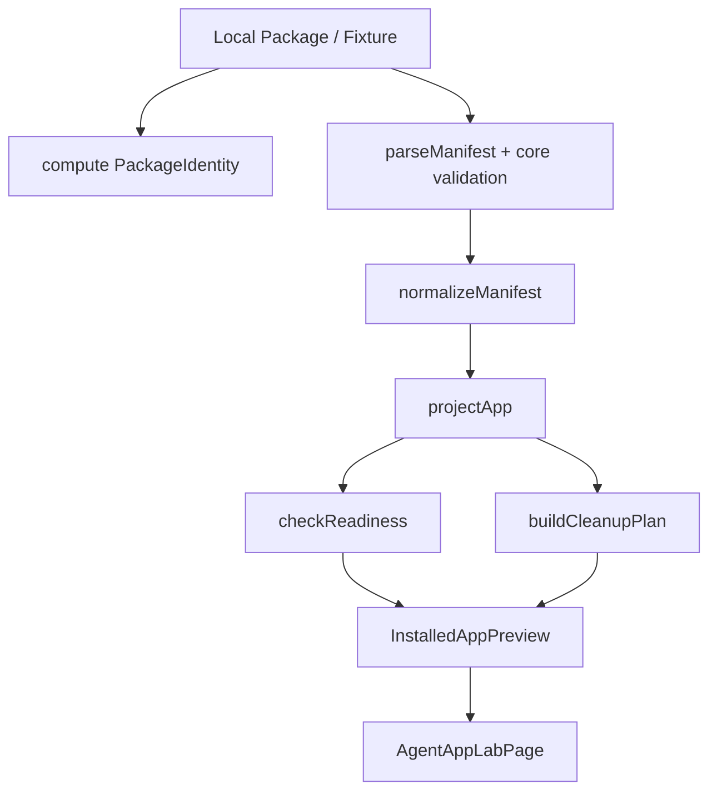

# Agent App P0 技术设计

更新时间：2026-05-15

## 一句话目标

P0 只做“只读 App Host 骨架”：客户端能读取一个 Agent App v0.3 本地 package / fixture，得到稳定的 manifest、projection、readiness、cleanup dry-run，并在 Lab 页面展示出来；不执行 App UI，不执行 App worker，不写入主路径 registry。

P0 成功后，才允许进入 P1 Mock Capability Host。没有 cleanup dry-run，不进入 P1。

## P0 范围

| 范围 | 做 | 不做 |
|---|---|---|
| Package source | 读取本地 fixture / local package metadata。 | 不接 Cloud 下载，不做 marketplace。 |
| Manifest | parse、normalize、校验核心字段。 | 不执行 APP.md 中引用的 runtime 文件。 |
| Projection | 生成只读派生对象。 | 不注册到 command / skill / artifact / route 全局 registry。 |
| Readiness | 检查 host capability、runtime target、权限声明、storage 声明。 | 不弹真实授权，不执行 migration。 |
| Cleanup | 生成 dry-run cleanup plan。 | P0 不真实删除用户数据，除非后续进入卸载功能。 |
| UI | Lab 只读展示 App、entries、readiness、cleanup plan。 | 不加载 App UI bundle。 |

## 设计原则

1. **只读优先**：P0 不执行 App 代码，只处理声明和派生对象。
2. **显式降级**：缺 capability 时给出 `blocked` / `degraded` / `ready`，不静默失败。
3. **派生对象可重建**：projection、readiness、cleanup plan 都可由 package + host profile 重新生成。
4. **主路径零污染**：不写 global registry，不修改 Chat / Skill / Artifact 主模型。
5. **可删除优先**：每个 P0 产物都有 appId、packageHash、路径或 ref，方便后续清理。

## P0 数据流



P0 不产生正式安装状态，只产生 `InstalledAppPreview`。

## 文件边界

```text
src/features/agent-app/
├── featureFlag.ts
├── types.ts
├── manifest/
│   ├── parseManifest.ts
│   ├── normalizeManifest.ts
│   └── parseManifest.test.ts
├── projection/
│   ├── projectApp.ts
│   └── projectApp.test.ts
├── readiness/
│   ├── hostCapabilityProfile.ts
│   ├── checkReadiness.ts
│   └── checkReadiness.test.ts
├── install/
│   ├── packageIdentity.ts
│   ├── installedAppPreview.ts
│   └── cleanupPlan.ts
├── ui/
│   ├── AgentAppLabPage.tsx
│   └── AgentAppLabPage.test.tsx
└── fixtures/
    └── content-factory-app.json
```

P0 如果能全部在前端完成，就不增加 Tauri command。只有本地 package hash、文件枚举或 app data 路径必须走系统能力时，才增加 `src-tauri/src/agent_app/`。

## Feature Flag

P0 只需要前五个开关：

```ts
type AgentAppHostFlags = {
  labEnabled: boolean
  localPackageEnabled: boolean
  projectionEnabled: boolean
  readinessEnabled: boolean
  cleanupDryRunEnabled: boolean
  mockSdkEnabled: false
  localStorageEnabled: false
  realAdapterEnabled: false
  uiRuntimeEnabled: false
  workerRuntimeEnabled: false
  cloudBootstrapEnabled: false
}
```

P0 默认：

```ts
const defaultAgentAppHostFlags: AgentAppHostFlags = {
  labEnabled: false,
  localPackageEnabled: false,
  projectionEnabled: false,
  readinessEnabled: false,
  cleanupDryRunEnabled: false,
  mockSdkEnabled: false,
  localStorageEnabled: false,
  realAdapterEnabled: false,
  uiRuntimeEnabled: false,
  workerRuntimeEnabled: false,
  cloudBootstrapEnabled: false
}
```

验收要求：关闭 `labEnabled` 后，所有 Agent App UI 入口消失。

## 核心类型

### PackageIdentity

```ts
type PackageSourceKind = 'fixture' | 'local_folder' | 'local_archive' | 'cloud_release'

type PackageIdentity = {
  sourceKind: PackageSourceKind
  sourceUri: string
  appId: string
  appVersion: string
  packageHash: string
  manifestHash: string
  loadedAt: string
}
```

P0 只实现 `fixture`，可预留 `local_folder` 类型但不接 UI。

### AppManifest

`AppManifest` 对齐 Agent App v0.3 声明，P0 只解析核心字段：

```ts
type AppManifest = {
  manifestVersion: string
  name: string
  version: string
  status?: 'draft' | 'preview' | 'stable' | 'deprecated'
  appType?: 'domain-app' | 'tool-app' | 'expert-pack' | 'workflow-app'
  description?: string
  runtimeTargets?: RuntimeTarget[]
  requires?: AppRequires
  runtimePackage?: RuntimePackageDeclaration
  capabilities?: string[]
  permissions?: PermissionDeclaration[]
  entries: AppEntry[]
  storage?: StorageDeclaration
  knowledgeTemplates?: KnowledgeTemplateDeclaration[]
  artifacts?: ArtifactDeclaration[]
  policies?: PolicyDeclaration[]
}
```

P0 校验规则：

| 字段 | P0 规则 |
|---|---|
| `manifestVersion` | 必须存在，支持 `0.2.x`。 |
| `name` | 必须存在，作为 appId 原始来源。 |
| `version` | 必须存在，语义化版本或标准允许的版本字符串。 |
| `runtimeTargets` | 缺省按 `local` 处理；P0 只允许 `local`。 |
| `requires.capabilities` | 可以为空；为空时 readiness 显示无额外能力需求。 |
| `entries` | 必须至少一个；P0 只投影，不执行。 |
| `storage` | 可选；存在时只生成 storage projection，不创建真实 namespace。 |

### NormalizedAppManifest

normalize 的目标是消除可选字段和命名差异，让后续 projection 不重复判断：

```ts
type NormalizedAppManifest = {
  manifestVersion: '0.2'
  appId: string
  displayName: string
  version: string
  status: 'draft' | 'preview' | 'stable' | 'deprecated'
  appType: 'domain-app' | 'tool-app' | 'expert-pack' | 'workflow-app'
  description: string
  runtimeTargets: RuntimeTarget[]
  requires: NormalizedRequires
  runtimePackage: NormalizedRuntimePackage
  permissions: PermissionDeclaration[]
  entries: NormalizedAppEntry[]
  storage?: NormalizedStorageDeclaration
  knowledgeTemplates: KnowledgeTemplateDeclaration[]
  artifacts: ArtifactDeclaration[]
  policies: PolicyDeclaration[]
}
```

normalize 不做 readiness 判断，只做结构归一化。

### AppEntry

```ts
type AppEntryKind =
  | 'page'
  | 'panel'
  | 'expert-chat'
  | 'command'
  | 'workflow'
  | 'artifact-viewer'
  | 'background-task'
  | 'settings'

type NormalizedAppEntry = {
  key: string
  kind: AppEntryKind
  title: string
  description?: string
  route?: string
  workflow?: string
  persona?: string
  requiredCapabilities: string[]
  permissions: string[]
  enabledByDefault: boolean
}
```

P0 entry 只展示，不注册、不执行。

## Projection 设计

Projection 是只读派生对象：

```ts
type AgentAppProjection = {
  app: AppSummary
  package: PackageIdentity
  entries: ProjectedEntry[]
  requiredCapabilities: CapabilityRequirement[]
  runtimePackage: RuntimePackageProjection
  storage?: StorageProjection
  knowledgeBindings: KnowledgeBindingProjection[]
  artifactTypes: ArtifactProjection[]
  policies: PolicyProjection[]
  readinessHints: ReadinessHint[]
  provenance: AgentAppProvenance
}
```

### AppSummary

```ts
type AppSummary = {
  appId: string
  displayName: string
  version: string
  status: string
  appType: string
  description: string
}
```

### ProjectedEntry

```ts
type ProjectedEntry = {
  appId: string
  key: string
  kind: AppEntryKind
  title: string
  description?: string
  presentation: 'lab-only' | 'eligible-for-main-entry'
  readiness: 'unknown' | 'ready' | 'degraded' | 'blocked'
  requiredCapabilities: CapabilityRequirement[]
  provenance: AgentAppProvenance
}
```

P0 所有 entry 的 `presentation` 都是 `lab-only`。

### CapabilityRequirement

```ts
type CapabilityRequirement = {
  capability: string
  requestedRange: string
  required: boolean
  declaredBy: 'requires' | 'entry' | 'storage' | 'policy' | 'runtimePackage'
}
```

Projection 生成规则：

1. 从 `requires.capabilities` 收集全局能力。
2. 从 entry 收集入口级能力。
3. 从 `storage` 自动推导 `lime.storage`。
4. 从 `runtimePackage.ui` 自动推导 `lime.ui`。
5. 从 `runtimePackage.worker` / workflow 自动推导 `lime.workflow` 或 `lime.agent`，但 P0 只标记，不运行。
6. 去重后保留来源信息；相同 capability 多来源时合并 `declaredBy` 或保留多条 detail。

## Readiness 设计

Readiness 只回答“当前 Host 能否启用这个 App / entry”，不执行修复动作。

```ts
type ReadinessStatus = 'ready' | 'degraded' | 'blocked'

type ReadinessResult = {
  appId: string
  status: ReadinessStatus
  checkedAt: string
  blockers: ReadinessIssue[]
  warnings: ReadinessIssue[]
  supportedCapabilities: CapabilitySupport[]
  missingCapabilities: CapabilityRequirement[]
  entryReadiness: EntryReadiness[]
}
```

### ReadinessIssue

```ts
type ReadinessIssue = {
  code:
    | 'MANIFEST_VERSION_UNSUPPORTED'
    | 'RUNTIME_TARGET_UNSUPPORTED'
    | 'CAPABILITY_MISSING'
    | 'CAPABILITY_VERSION_UNSUPPORTED'
    | 'PERMISSION_REQUIRED'
    | 'STORAGE_DECLARED_BUT_DISABLED'
    | 'UI_RUNTIME_DISABLED'
    | 'WORKER_RUNTIME_DISABLED'
    | 'PACKAGE_HASH_MISSING'
    | 'PACKAGE_HASH_MISMATCH'
  severity: 'blocker' | 'warning'
  message: string
  capability?: string
  entryKey?: string
}
```

### HostCapabilityProfile

P0 使用静态 profile，不读取真实 runtime：

```ts
type HostCapabilityProfile = {
  appRuntimeVersion: string
  runtimeTargets: RuntimeTarget[]
  capabilities: Record<string, {
    version: string
    enabled: boolean
    implementation: 'none' | 'mock' | 'adapter' | 'native'
  }>
  featureFlags: AgentAppHostFlags
}
```

P0 默认 profile：

```ts
const p0HostCapabilityProfile: HostCapabilityProfile = {
  appRuntimeVersion: '0.3.0',
  runtimeTargets: ['local'],
  capabilities: {
    'lime.ui': { version: '0.3.0', enabled: false, implementation: 'none' },
    'lime.storage': { version: '0.3.0', enabled: false, implementation: 'none' },
    'lime.agent': { version: '0.3.0', enabled: false, implementation: 'none' },
    'lime.knowledge': { version: '0.3.0', enabled: false, implementation: 'none' },
    'lime.artifacts': { version: '0.3.0', enabled: false, implementation: 'none' },
    'lime.evidence': { version: '0.3.0', enabled: false, implementation: 'none' }
  },
  featureFlags: defaultAgentAppHostFlags
}
```

Readiness 判定：

| 情况 | 状态 |
|---|---|
| manifest 版本不支持 | `blocked` |
| runtime target 不含 `local` | `blocked` |
| 必需 capability 缺失 | `blocked` |
| 可选 capability 缺失 | `degraded` |
| storage 声明存在但 `localStorageEnabled=false` | `degraded`，P0 不创建 namespace。 |
| UI entry 存在但 `uiRuntimeEnabled=false` | `degraded`，Lab 只读展示。 |
| worker / background-task 存在但 `workerRuntimeEnabled=false` | `degraded`，Lab 只读展示。 |
| 仅有 expert-chat 但 mock SDK 未启用 | `degraded`，不运行。 |

## Cleanup Dry-run 设计

P0 只生成清理计划，不删除文件。

```ts
type AppCleanupPlan = {
  mode: 'dry-run'
  appId: string
  packageHash: string
  generatedAt: string
  packageCachePaths: CleanupTarget[]
  projectionPaths: CleanupTarget[]
  readinessPaths: CleanupTarget[]
  storageNamespaces: CleanupTarget[]
  artifactRefs: CleanupTarget[]
  evidenceRefs: CleanupTarget[]
  taskRefs: CleanupTarget[]
  secretRefs: CleanupTarget[]
  logPaths: CleanupTarget[]
  exportPaths: CleanupTarget[]
  warnings: CleanupWarning[]
}

type CleanupTarget = {
  kind: 'path' | 'namespace' | 'ref'
  value: string
  exists: boolean | 'unknown'
  safeToDelete: boolean
  reason: string
}
```

P0 cleanup plan 来源：

| 目标 | 来源 |
|---|---|
| package cache | `PackageIdentity.packageHash`。 |
| projection | `appId`。 |
| readiness | `appId`。 |
| storage namespace | `manifest.storage.namespace` 或 `appId`。 |
| artifacts | P0 无真实 artifact，返回空数组。 |
| evidence | P0 无真实 evidence，返回空数组。 |
| secrets | P0 不申请 secret，返回空数组。 |
| logs | `<LimeAppData>/agent-apps/logs/<appId>`。 |

P0 Lab 必须展示 cleanup dry-run，让用户和开发者知道未来失败时会删哪些东西。

## InstalledAppPreview

P0 不写正式 installed app registry，只生成 preview：

```ts
type InstalledAppPreview = {
  identity: PackageIdentity
  manifest: NormalizedAppManifest
  projection: AgentAppProjection
  readiness: ReadinessResult
  cleanupPlan: AppCleanupPlan
}
```

后续 P1 / P2 若需要持久化，再引入 `InstalledAppState`：

```ts
type InstalledAppState = InstalledAppPreview & {
  installedAt: string
  enabled: boolean
  source: PackageSourceKind
  installState: 'installed' | 'disabled' | 'blocked' | 'uninstalling'
}
```

## Lab UI 设计

P0 Lab 页面只做开发者 / 内测入口：

```text
Agent App Lab
├── Package Source
│   └── content-factory-app fixture
├── App Card
│   ├── name / version / status / packageHash
│   └── readiness badge
├── Entries
│   ├── page / expert-chat / workflow / background-task
│   └── lab-only 标记
├── Capability Requirements
│   ├── supported
│   ├── missing
│   └── degraded
├── Readiness Issues
│   ├── blockers
│   └── warnings
└── Cleanup Dry-run
    ├── package / projection / storage / logs
    └── safe-to-delete 标记
```

P0 UI 不出现“运行 App”“打开 App 页面”“启用 App 到主导航”等按钮。最多可以出现 disabled button，并说明需要 P1/P3。

## Fixture 要求

`content-factory-app.json` 应该覆盖足够多字段，避免 P0 只验证玩具样例：

```json
{
  "manifestVersion": "0.3.0",
  "name": "content-factory-app",
  "version": "0.3.0",
  "status": "draft",
  "appType": "domain-app",
  "description": "APP 内容工厂 fixture",
  "runtimeTargets": ["local"],
  "requires": {
    "lime": {
      "appRuntime": ">=0.3.0 <1.0.0"
    },
    "capabilities": {
      "lime.ui": "^0.3.0",
      "lime.storage": "^0.3.0",
      "lime.agent": "^0.3.0",
      "lime.knowledge": "^0.3.0",
      "lime.artifacts": "^0.3.0",
      "lime.evidence": "^0.3.0"
    }
  },
  "runtimePackage": {
    "ui": { "path": "./dist/ui" },
    "worker": { "path": "./dist/worker" }
  },
  "storage": {
    "namespace": "content-factory-app",
    "schema": "./storage/schema.json",
    "migrations": "./storage/migrations"
  },
  "entries": [
    { "key": "dashboard", "kind": "page", "title": "项目首页", "route": "/dashboard" },
    { "key": "content_strategist", "kind": "expert-chat", "title": "内容策略专家", "persona": "./agents/content-strategist.md" },
    { "key": "content_scenario_planning", "kind": "workflow", "title": "内容场景规划", "workflow": "./workflows/content-scenarios.workflow.md" }
  ]
}
```

注意：fixture 是 manifest fixture，不是业务实现；P4 才需要 demo package。

## P0 测试用例

| 测试 | 输入 | 期望 |
|---|---|---|
| parse valid fixture | content factory fixture | 返回 `AppManifest`。 |
| reject missing entries | 无 entries | manifest validation error。 |
| normalize defaults | 缺 status / runtimeTargets | 默认 draft / local。 |
| project entries | page + expert-chat + workflow | 生成 3 个 `ProjectedEntry`。 |
| derive storage capability | 有 storage 声明 | requiredCapabilities 包含 `lime.storage`。 |
| readiness blocked | 不支持 manifestVersion | status `blocked`。 |
| readiness degraded | UI runtime 关闭但有 page entry | status `degraded`。 |
| cleanup dry-run | appId + packageHash | 返回 package / projection / storage / logs targets。 |
| flag off hides UI | `labEnabled=false` | 不展示 Lab entry。 |

## P0 验收标准

P0 完成必须同时满足：

1. 本地 fixture 可以 parse / normalize / project。
2. Lab 页面展示 app card、entries、capability requirements、readiness、cleanup dry-run。
3. 关闭 `labEnabled` 后没有任何可见入口。
4. Projection 不写入任何全局 registry。
5. 不执行 App UI bundle / worker / workflow。
6. 不创建真实 App storage namespace。
7. cleanup dry-run 能列出未来会删除的 package / projection / readiness / storage / logs。
8. 单测覆盖 parser、projection、readiness、cleanup plan。

## 进入 P1 的门槛

只有 P0 验收通过后，才能进入 P1：

```text
LimeAppSdk types
→ CapabilityHost interface
→ MockCapabilityHost
→ mock storage / artifact / evidence
→ runEntry 内置 mock action
→ uninstall delete data
```

P1 之前不接真实 Agent Runtime，不接真实 Artifact Store，不接 UI bundle。
