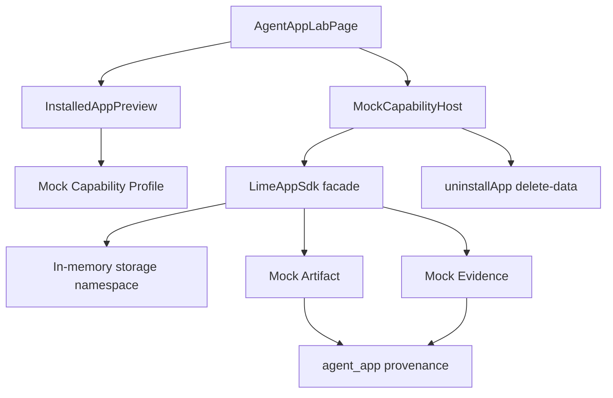
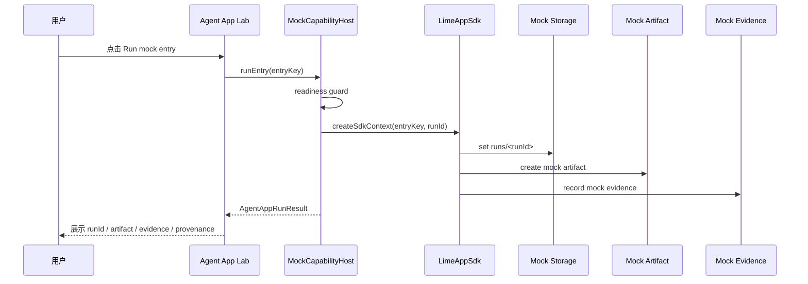

# Agent App P1 Mock Capability Host 技术设计

更新时间：2026-05-15

## 一句话目标

P1 在 P0 只读 Lab 之后，增加一个默认关闭的 mock SDK 运行层：点击 fixture entry 时不执行 App 自带 UI / worker，只通过 `LimeAppSdk` facade 调用内存态 `MockCapabilityHost`，生成带 `sourceKind: agent_app` provenance 的 mock Artifact、Evidence 和 run record，并能通过 uninstall delete-data 清理实验数据。

## 范围

| 范围 | 做 | 不做 |
|---|---|---|
| SDK facade | 定义 `LimeAppSdk`、storage、artifact、evidence capability 类型。 | 不暴露 Lime internal path。 |
| Mock Host | 内存态运行 entry、写 run record、生成 mock Artifact / Evidence。 | 不写真实 Artifact Store / Evidence Store。 |
| Readiness | `mockSdkEnabled` 时使用 mock capability profile，消除 capability blocker。 | 不启用 UI runtime / worker runtime。 |
| Lab UI | 在实验开关开启时显示 “Run mock entry”，展示 run result。 | 默认关闭，不进入主导航命令面板。 |
| Cleanup | `uninstallApp(deleteData)` 清理 package、projection、readiness、storage、artifact、evidence 目标。 | 不执行真实文件删除。 |

## Feature Flag

P1 只新增一层开关：

```text
VITE_LIME_AGENT_APP_MOCK_SDK=1
```

或通过 `resolveAgentAppHostFlags({ mockSdkEnabled: true })` 注入测试状态。

规则：

1. `mockSdkEnabled=false` 时，P0 行为保持只读，不出现运行按钮。
2. `mockSdkEnabled=true` 时，自动打开 Lab / local package / projection / readiness / cleanup dry-run。
3. 即使 `mockSdkEnabled=true`，`uiRuntimeEnabled`、`workerRuntimeEnabled`、`realAdapterEnabled` 仍保持关闭。

## 架构图



## 运行时序



## 用例

| 用例 | 验收 |
|---|---|
| 开关关闭 | Lab 只读展示，不出现 run entry 按钮。 |
| 开关开启 | 点击 `content_scenario_planning` 生成 `mock-artifact-*` 与 `mock-evidence-*`。 |
| Provenance | Artifact / Evidence / storage entry 均带 `sourceKind: agent_app`、appId、entryKey、packageHash、manifestHash、workflowRunId。 |
| 卸载 delete-data | 返回 deleted targets，覆盖 package、projection、readiness、storage、artifact、evidence，并清空内存态 mock 数据。 |
| Readiness 阻断 | 如果 capability 未启用或 entry 不存在，抛稳定 `AgentAppCapabilityError.code`。 |

## 文件边界

```text
src/features/agent-app/
├── sdk/
│   ├── CapabilityHost.ts
│   ├── MockCapabilityHost.ts
│   ├── MockCapabilityHost.test.ts
│   ├── capabilityErrors.ts
│   ├── mockCapabilityProfile.ts
│   └── provenance.ts
├── install/
│   └── uninstallApp.ts
└── ui/
    └── AgentAppLabPage.tsx
```

## P1 不变量

1. P1 不执行 App 自带 UI bundle、worker 或 workflow 文件。
2. P1 不新增 Tauri command。
3. P1 不写 command / skill / artifact / workspace 全局 registry。
4. P1 mock host 不 import Lime 主业务 store，只依赖 Agent App projection / readiness / cleanup plan。
5. P1 产物必须可追溯、可删除、可通过 feature flag 关闭。

