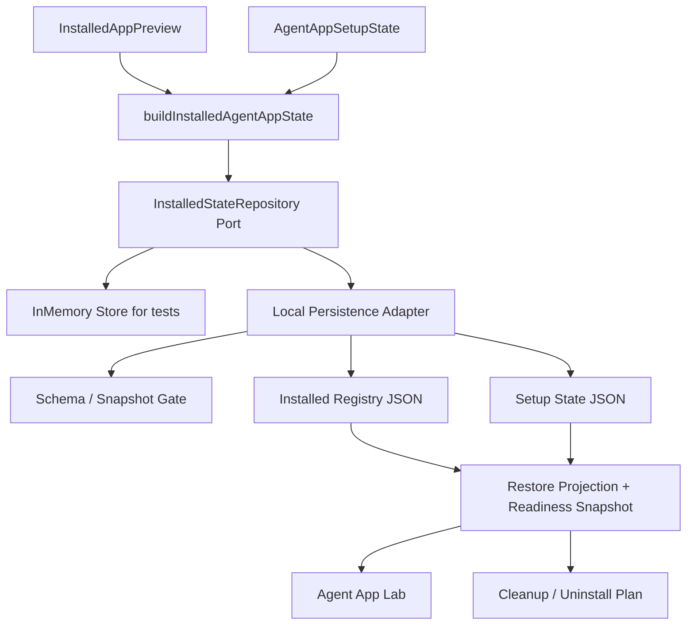
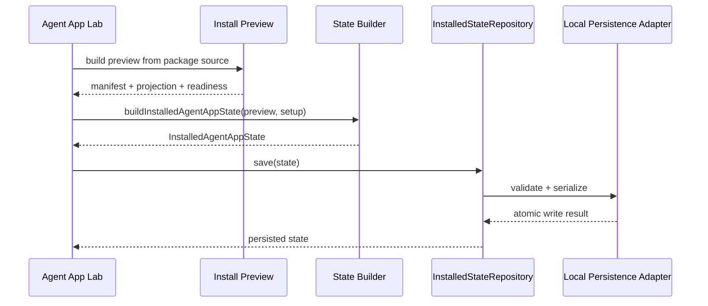
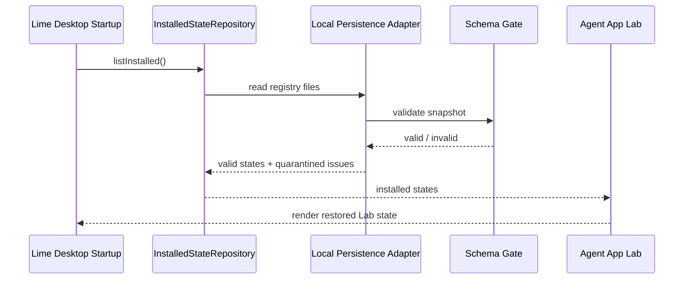
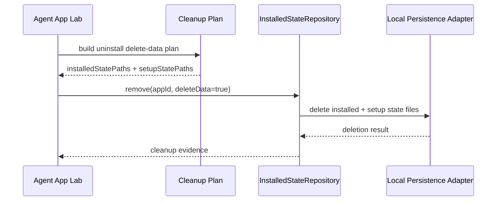

# Agent App P11 Local Persistence Adapter

更新时间：2026-05-15

## 一句话目标

P11 的目标是把 P10 已经验证的 installed state snapshot 从 in-memory store 推进到客户端本地可恢复的 persistence adapter。P11 仍只做 Agent App 实验岛内的状态持久化边界，不下载 package、不接市场页、不进入正式主导航、不新增 Tauri command。

## 背景

P10 已经证明客户端可以把 `installed preview + setup state + projection + readiness` 汇总为可序列化的 `InstalledAgentAppState`，并把 installed state path 纳入 cleanup / uninstall preview。

但 in-memory store 不能支撑真实安装闭环：

1. 重启 Lime Desktop 后无法恢复已安装 App。
2. Cloud bootstrap 断网回退缺少本地 installed registry。
3. setup binding 已进入 store，但还没有统一的持久化边界。
4. uninstall delete-data 只能预览路径，还不能删除真实状态文件。

因此 P11 只补“本地状态仓库”这一层，不扩大为下载器、市场页或正式运行入口。

## 当前落地

| 项 | 证据 |
|---|---|
| Repository / envelope | `InstalledAgentAppStateEnvelope`、`AgentAppSetupStateEnvelope`、`AgentAppPersistenceDriver`、`LocalInstalledAgentAppStateRepository` 已落到 `src/features/agent-app/install/installedAppState.ts`。 |
| 本地 Lab driver | `BrowserLocalStorageAgentAppPersistenceDriver` 提供 Lab 可恢复 persistence driver；`InMemoryAgentAppPersistenceDriver` 保留为测试 driver。 |
| save / restore | Repository 写入 installed state 与 setup state envelope，并可通过 `get()` / `list()` 恢复 projection / readiness snapshot。 |
| schema gate | 恢复时执行 projection / readiness schema gate；坏文件或坏 snapshot 返回 load issue，不进入可运行状态。 |
| disable / remove | Repository 支持 `setDisabled()` 与 `remove()`；`remove()` 同时删除 installed state 与 setup state。 |
| uninstall 集成 | `uninstallApp()` 支持注入 `installedStateRepository`，卸载时同步清理本地 installed / setup persistence 状态。 |
| 导出入口 | `src/features/agent-app/index.ts` 导出 P11 repository、driver 和 envelope 类型。 |

## 架构图



关键点：

1. `Repository Port` 是 App Host 的依赖，避免 UI / runtime 直接知道文件细节。
2. `InMemory Store` 保留为测试和实验岛 fallback。
3. `Local Persistence Adapter` 只能保存 snapshot 与 refs，不能保存 secret value、客户知识正文、workspace data 或 App storage 业务记录。
4. 读入状态必须先过本地 schema / snapshot gate，避免坏文件污染运行时。

## 时序图

### 安装 / 更新状态



### 启动恢复



### 卸载并删除数据



## 数据契约

P11 新增一个明确的本地持久化 envelope：

```ts
type InstalledAgentAppStateEnvelope = {
  schemaVersion: 1
  savedAt: string
  state: InstalledAgentAppState
}
```

允许保存：

```text
package identity
normalized manifest
projection snapshot
readiness snapshot
setup binding refs
disabled flag
installedAt / updatedAt / savedAt
schemaVersion
```

禁止保存：

```text
secret value
API key / OAuth token
客户知识正文
workspace 文件内容
App storage 业务记录
Tool 调用输入输出全文
raw package code
```

## 分期状态

| 阶段 | 目标 | 不做什么 |
|---|---|---|
| P11.0 | 已完成：定义 repository port、envelope 和错误类型。 | 未绑定 Tauri 文件系统。 |
| P11.1 | 已完成：保留 P10 in-memory store，并新增 repository / driver contract。 | 未改 Lab 正式行为。 |
| P11.2 | 已完成：实现 local persistence adapter，写入 `<LimeAppData>/agent-apps/installed/<app-id>.json` 与 setup state envelope。 | 未硬编码平台用户目录，未新增 Tauri command。 |
| P11.3 | 已完成：读取时执行 schema gate / snapshot validation，坏文件隔离为 load issue。 | 未自动修复未知 schema。 |
| P11.4 | 已完成：`uninstallApp()` 可注入 repository 并删除 installed / setup state。 | `keep-data` 仍不删除用户数据。 |
| P11.5 | 已完成：测试覆盖本地恢复、坏文件隔离、disable、remove 和卸载清理。 | 未接 marketplace，未进入正式主导航。 |

## 文件边界

| 文件 | 当前改动 |
|---|---|
| `src/features/agent-app/install/installedAppState.ts` | 保留 builder 与 in-memory store，新增 repository contract、localStorage driver、in-memory driver、schema gate load validation。 |
| `src/features/agent-app/install/installedAppState.test.ts` | 覆盖 repository save / restore、localStorage driver、disable、remove、坏文件隔离和 schema gate。 |
| `src/features/agent-app/install/uninstallApp.ts` | 支持注入 installed state repository，卸载时清理 installed / setup persistence 状态。 |
| `src/features/agent-app/sdk/MockCapabilityHost.test.ts` | 覆盖卸载时 repository persistence 状态被清理。 |
| `src/features/agent-app/schema/schemaGate.ts` | 恢复坏 snapshot 时不崩溃，返回结构化 issue。 |
| `src/features/agent-app/index.ts` | 导出 repository、driver、envelope 与卸载 repository 类型。 |

如果需要真实文件系统能力，优先复用 Lime 现有客户端存储封装；不能在 Agent App 内直接 `safeInvoke` / `invoke`，也不能新增 Agent App 专属 Tauri command。

## 验收标准

1. 重启后能从本地状态恢复 installed app snapshot。
2. 断网时可用本地 installed registry 展示已安装 App 的 projection / readiness snapshot。
3. `delete-data` 能清理 installed state 与 setup state；`keep-data` 不删除用户数据。
4. 坏文件不会让 Lab 崩溃，必须输出 load issue 并跳过该 App。
5. 状态文件不包含 secret value、客户知识正文、workspace data 或 raw package code。
6. `src/features/agent-app` 仍没有 `safeInvoke` / `invoke` / Tauri 注册 / raw Worker 越界入口。

## 验证记录

| 命令 | 结果 |
|---|---|
| `npm run test -- src/features/agent-app/install/installedAppState.test.ts src/features/agent-app/install/setupStateStore.test.ts src/features/agent-app/schema/schemaGate.test.ts src/features/agent-app/sdk/MockCapabilityHost.test.ts` | 通过，18 tests。 |
| `npm run test -- src/features/agent-app/schema/schemaGate.test.ts src/features/agent-app/manifest/parseManifest.test.ts src/features/agent-app/projection/projectApp.test.ts src/features/agent-app/readiness/checkReadiness.test.ts src/features/agent-app/install/cloudBootstrap.test.ts src/features/agent-app/install/setupStateStore.test.ts src/features/agent-app/install/installedAppState.test.ts src/features/agent-app/featureFlag.test.ts src/features/agent-app/sdk/MockCapabilityHost.test.ts src/features/agent-app/adapters/AdapterCapabilityHost.test.ts src/features/agent-app/runtime/contentFactoryDemo.test.ts src/features/agent-app/runtime/workflowRuntimeHost.test.ts src/features/agent-app/runtime/uiExtensionHost.test.ts src/features/agent-app/ui/AgentAppLabPage.test.tsx` | 通过，65 tests。 |
| `npm run typecheck` | 通过。 |
| `npm run test:contracts` | 通过。 |

## 剩余差距

| 差距 | 处理 |
|---|---|
| P11 只持久化 installed / setup state，不管理 package cache 实体。 | P12 已处理 package cache / verify / rollback。 |
| P11 不执行 App package JS，也不加载 UI bundle。 | P13 之后评估 runtime package loader。 |
| 当前 localStorage driver 面向 Lab persistence；真实文件 driver 仍需通过 Lime 平台存储封装注入。 | 不在 Agent App 内新增 Tauri command 或直接 `safeInvoke`。 |

## 下一刀

P11 已完成 Local Persistence Adapter，P12-P13 已继续完成 [Package Cache / Verify / Rollback](./p12-package-cache-verify-rollback.md) 与 [Runtime Package Loader / UI Bundle Loader](./p13-runtime-package-loader.md)。[P14 Entry Runtime Guard / Permission Prompt](./p14-entry-runtime-guard-permission-prompt.md) 与 [P15 Lab Install / Launch Flow](./p15-lab-install-launch-flow.md) 已完成当前实现与定向验证，P15-H 已补 Agent App Lab 专用 GUI smoke / cleanup rehearsal 证据，P16 已完成最小 Agent App Manager；P17 Gate 审计、P17.0 Formal Entry Contract、P17.1 Formal route / nav / copy hardening、P17.2.1 Source state model、P17.2.2 Install review descriptor、P17.2.3 Registration hardening 与 P17.2.4a Cloud release descriptor / verification gate、P17.2.4b-1 acquisition seam / verified cache source、P17.2.4b-2 packageUrl fetch / staging / manifest extraction 与 P17.2.5 public schema / reference CLI / standard example package cross-check 已完成，P17.3 lifecycle / cleanup contract 与 P17.4 runtime surface production hardening 已完成，当前进入 P17.5 formal entry GUI smoke。
