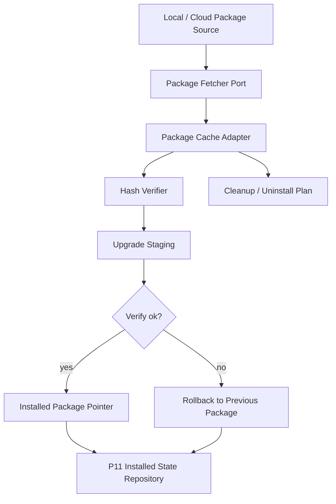
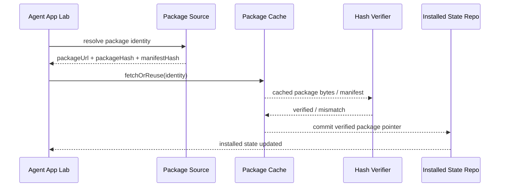

# Agent App P12 Package Cache / Verify / Rollback

更新时间：2026-05-15

## 一句话目标

P12 的目标是在 P11 本地 installed state 可恢复之后，补齐 package cache、hash verify、upgrade staging 和 rollback 边界。P12 仍不做 marketplace、不接正式主导航、不执行任意 App package code，只让客户端能够安全地保存、校验、复用和回退 package 输入。

## 背景

P5 已把 Cloud bootstrap payload 收敛为统一 package source，P10/P11 已把安装状态推进到可恢复状态。但真实安装闭环仍缺少 package 层能力：

1. package URL / package hash 目前只是 metadata，没有缓存实体。
2. 断网恢复只能恢复 installed state snapshot，不能验证 package 文件仍存在。
3. upgrade 还没有 staging 区，hash mismatch 后缺少 rollback 结果。
4. cleanup plan 已包含 package cache path，但还没有 cache index / verify result。

P12 只补 package cache 这一层，不抢做 raw worker sandbox 或正式 App 入口。

## 当前落地

| 项 | 证据 |
|---|---|
| Package hash 事实源 | `src/features/agent-app/install/packageIdentity.ts` 导出稳定 hash 构造函数，继续复用 `PackageIdentity`。 |
| Cache entry / repository | `src/features/agent-app/install/packageCache.ts` 新增 `AgentAppPackageCacheEntry`、verify result、stage / commit / rollback result 和 `InMemoryAgentAppPackageCacheRepository`。 |
| Hash verify | `verifyAgentAppPackageCacheEntry()` 校验 package hash / manifest hash；mismatch 不进入 active cache。 |
| Cached fallback | Repository `resolve()` 可返回 `cache_hit / cache_miss / hash_mismatch`，只复用 verified active entry。 |
| Upgrade staging | `stageUpgrade()` 不覆盖 active package；`commitStaged()` 成功后才更新 active entry。 |
| Rollback | `rollback()` 恢复 previous verified package，并输出 `agent_app` provenance evidence。 |
| Readiness blocker | `checkReadiness()` 接收 package verification result；missing / mismatch 会生成 `PACKAGE_HASH_MISSING` / `PACKAGE_HASH_MISMATCH` blocker。 |
| Cleanup 集成 | `AppCleanupPlan` 增加 package cache index / staging paths；Mock / Adapter uninstall delete-data 会纳入清理目标。 |

## 架构图

## 时序图

## 分期状态

| 阶段 | 目标 | 不做什么 |
|---|---|---|
| P12.0 | 已完成：定义 package cache entry、verify result、rollback result 类型。 | 未下载远程 package。 |
| P12.1 | 已完成：实现 in-memory cache repository。 | 未接 marketplace。 |
| P12.2 | 已完成：校验 `packageHash` / `manifestHash`，hash mismatch 生成 blocker。 | 未绕过本地 readiness。 |
| P12.3 | 已完成：支持 cached package fallback，只复用 verified package。 | 未让 Cloud 标记 ready。 |
| P12.4 | 已完成：支持 upgrade staging 与 rollback。 | 未覆盖旧可用 package。 |
| P12.5 | 已完成：package cache index / staged package 进入 cleanup / uninstall delete-data。 | `keep-data` 不删用户数据。 |

## 文件边界

| 文件 | 当前改动 |
|---|---|
| `src/features/agent-app/install/packageIdentity.ts` | 导出 stable stringify、manifest hash、package hash helper，继续由 `PackageIdentity` 统一承载身份。 |
| `src/features/agent-app/install/packageCache.ts` | 新增 package cache entry / verify / resolve / stage / commit / rollback。 |
| `src/features/agent-app/install/packageCache.test.ts` | 覆盖 verified cache、hash mismatch、staging、commit、rollback、missing cache。 |
| `src/features/agent-app/readiness/checkReadiness.ts` | 接入 package verification blocker。 |
| `src/features/agent-app/install/cleanupPlan.ts` | package cache index / staging paths 进入 cleanup preview。 |
| `src/features/agent-app/sdk/MockCapabilityHost.ts`、`src/features/agent-app/adapters/AdapterCapabilityHost.ts` | uninstall delete-data 纳入 package cache index / staging paths。 |

## 验收标准

1. hash mismatch 时拒绝启用新 package，并保留旧可用 package。
2. 断网但本地 cache 存在且 hash 已验证时，可以恢复 installed state。
3. upgrade staging 不覆盖旧 package；commit 成功后才更新 installed pointer。
4. rollback 有明确结果和 evidence，不吞掉失败原因。
5. cleanup / uninstall delete-data 能清理 package cache 和 staging。
6. 不新增 Tauri command，不让 Agent App 直接 `safeInvoke` / `invoke`。

## 验证记录

| 命令 | 结果 |
|---|---|
| `npm run test -- src/features/agent-app/install/packageCache.test.ts src/features/agent-app/readiness/checkReadiness.test.ts src/features/agent-app/projection/projectApp.test.ts src/features/agent-app/sdk/MockCapabilityHost.test.ts src/features/agent-app/adapters/AdapterCapabilityHost.test.ts src/features/agent-app/ui/AgentAppLabPage.test.tsx` | 通过，25 tests。 |
| `npm run test -- src/features/agent-app/schema/schemaGate.test.ts src/features/agent-app/manifest/parseManifest.test.ts src/features/agent-app/projection/projectApp.test.ts src/features/agent-app/readiness/checkReadiness.test.ts src/features/agent-app/install/cloudBootstrap.test.ts src/features/agent-app/install/setupStateStore.test.ts src/features/agent-app/install/installedAppState.test.ts src/features/agent-app/install/packageCache.test.ts src/features/agent-app/featureFlag.test.ts src/features/agent-app/sdk/MockCapabilityHost.test.ts src/features/agent-app/adapters/AdapterCapabilityHost.test.ts src/features/agent-app/runtime/contentFactoryDemo.test.ts src/features/agent-app/runtime/workflowRuntimeHost.test.ts src/features/agent-app/runtime/uiExtensionHost.test.ts src/features/agent-app/ui/AgentAppLabPage.test.tsx` | 通过，70 tests。 |
| `npm run typecheck` | 通过。 |
| `npm run test:contracts` | 通过。 |

## 剩余差距

| 差距 | 处理 |
|---|---|
| P12 只实现 package cache / verify / rollback，不加载 package UI bundle。 | P13 处理 runtime package loader / UI bundle loader。 |
| P12 不下载远程 package。 | 后续真实 fetcher 仍必须作为 package source adapter 注入，不直接接 Cloud 管理台。 |
| P12 不执行 App package JS。 | P13/P14 继续保持 raw worker sandbox 关闭。 |

## 下一刀

P12 已完成 Package Cache / Verify / Rollback，P13 已继续完成 [Runtime Package Loader / UI Bundle Loader](./p13-runtime-package-loader.md)。[P14 Entry Runtime Guard / Permission Prompt](./p14-entry-runtime-guard-permission-prompt.md) 与 [P15 Lab Install / Launch Flow](./p15-lab-install-launch-flow.md) 已完成当前实现与定向验证，P15-H 已补 Agent App Lab 专用 GUI smoke / cleanup rehearsal 证据，P16 已完成最小 Agent App Manager；P17 Gate 审计、P17.0 Formal Entry Contract、P17.1 Formal route / nav / copy hardening、P17.2.1 Source state model、P17.2.2 Install review descriptor、P17.2.3 Registration hardening 与 P17.2.4a Cloud release descriptor / verification gate、P17.2.4b-1 acquisition seam / verified cache source、P17.2.4b-2 packageUrl fetch / staging / manifest extraction 与 P17.2.5 public schema / reference CLI / standard example package cross-check 已完成，P17.3 lifecycle / cleanup contract 与 P17.4 runtime surface production hardening 已完成，当前进入 P17.5 formal entry GUI smoke。
