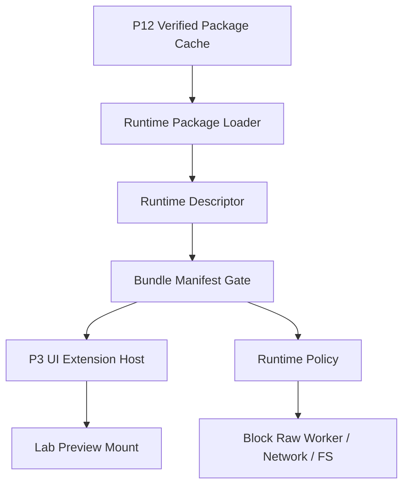

# Agent App P13 Runtime Package Loader / UI Bundle Loader

更新时间：2026-05-15

## 一句话目标

P13 的目标是在 P12 package cache / verify / rollback 稳定后，开始让客户端从已验证 package 中加载受控 runtime descriptor 和 UI bundle descriptor。P13 仍不执行任意 App JS，不开放 raw worker sandbox，只做 loader、allowlist、bundle manifest 和 UI host 接线前的安全边界。

## 背景

P0-P12 已经覆盖 manifest、projection、readiness、SDK host、UI host、workflow runtime、Cloud bootstrap、setup state、installed state、local persistence 与 package cache。下一步不能直接“运行 App package”，否则会绕开 Capability SDK 和 sandbox policy。

因此 P13 只做 loader 层：

1. 从已验证 package cache 读取 runtime descriptor。
2. 校验 UI bundle descriptor 与 manifest projection 一致。
3. 将 bundle 交给现有 UI Extension Host 的受控 mount contract。
4. 保持 worker runtime / raw JS 执行关闭。

## 当前落地

| 项 | 证据 |
|---|---|
| Runtime descriptor | `src/features/agent-app/runtime/runtimePackageLoader.ts` 新增 `AgentAppRuntimePackageDescriptor`、UI bundle descriptor 与 policy evidence。 |
| Verified cache gate | `loadRuntimePackageDescriptor()` 只接受通过 P12 `verifyAgentAppPackageCacheEntry()` 的 package cache entry。 |
| Bundle manifest gate | `findUiBundleDescriptor()` 校验 entry 必须存在于 projection，且必须是 `page / panel / settings` UI entry。 |
| UI Host 接线 | `mountRuntimePackageUiEntry()` 复用 P3 `UiExtensionHost.mountEntry()`，不绕过 sandbox / injected SDK bridge。 |
| Policy evidence | descriptor 固定输出 raw worker / network / filesystem / raw Tauri / Node API 全部关闭。 |
| 导出入口 | `src/features/agent-app/index.ts` 导出 loader API 和类型。 |

## 架构图

## 分期状态

| 阶段 | 目标 | 不做什么 |
|---|---|---|
| P13.0 | 已完成：定义 runtime package loader port 和 descriptor 类型。 | 未执行 JS。 |
| P13.1 | 已完成：从 verified cache 读取 package descriptor。 | 未下载 package。 |
| P13.2 | 已完成：校验 UI bundle descriptor 与 projection entry 一致。 | 未接正式主导航。 |
| P13.3 | 已完成：接入现有 `UiExtensionHost` 的 mount contract。 | 未开放 raw Tauri / Node API。 |
| P13.4 | 已完成：对 raw worker / network / filesystem 输出 policy block 证据。 | 未运行任意 worker bundle。 |
| P13.5 | 已完成：补 Lab-only unit coverage。 | 未进入 marketplace。 |

## 验收标准

1. 只有已通过 P12 verify 的 package 能进入 loader。
2. bundle descriptor entry 必须存在于 projection。
3. UI mount 只能通过 P3 `UiExtensionHost`，不能绕过 Capability SDK。
4. raw worker、network、filesystem 默认阻断并有测试证据。
5. 不新增 Tauri command，不让 Agent App 直接 `safeInvoke` / `invoke`。

## 验证记录

| 命令 | 结果 |
|---|---|
| `npm run test -- src/features/agent-app/runtime/runtimePackageLoader.test.ts src/features/agent-app/runtime/uiExtensionHost.test.ts src/features/agent-app/install/packageCache.test.ts src/features/agent-app/ui/AgentAppLabPage.test.tsx` | 通过，17 tests。 |
| `npm run test -- src/features/agent-app/schema/schemaGate.test.ts src/features/agent-app/manifest/parseManifest.test.ts src/features/agent-app/projection/projectApp.test.ts src/features/agent-app/readiness/checkReadiness.test.ts src/features/agent-app/install/cloudBootstrap.test.ts src/features/agent-app/install/setupStateStore.test.ts src/features/agent-app/install/installedAppState.test.ts src/features/agent-app/install/packageCache.test.ts src/features/agent-app/featureFlag.test.ts src/features/agent-app/sdk/MockCapabilityHost.test.ts src/features/agent-app/adapters/AdapterCapabilityHost.test.ts src/features/agent-app/runtime/contentFactoryDemo.test.ts src/features/agent-app/runtime/workflowRuntimeHost.test.ts src/features/agent-app/runtime/uiExtensionHost.test.ts src/features/agent-app/runtime/runtimePackageLoader.test.ts src/features/agent-app/ui/AgentAppLabPage.test.tsx` | 通过，74 tests。 |
| `npm run typecheck` | 通过。 |

## 剩余差距

| 差距 | 处理 |
|---|---|
| P13 只加载 descriptor，不执行 App package JS。 | P14/P15/P15-H 已继续通过 guard / prompt / smoke 验证 launch flow；P16 仍不执行 raw package JS。 |
| P13 没有合并 entry-level permission prompt。 | P14 已处理 Entry Runtime Guard / Permission Prompt。 |
| P13 不进入正式主导航。 | P16 先在实验岛内验证 App Manager，再评估是否从 Lab 升级。 |

## 下一刀

P13 已完成 Runtime Package Loader / UI Bundle Loader，[P14 Entry Runtime Guard / Permission Prompt](./p14-entry-runtime-guard-permission-prompt.md) 已继续把 loader 与 entry-level permission、setup state、readiness 和 runtime policy 合并；[P15 Lab Install / Launch Flow](./p15-lab-install-launch-flow.md) 已串成 Lab-only 端到端流程，P15-H 已补 Agent App Lab 专用 GUI smoke / cleanup rehearsal 证据，P16 已完成最小 Agent App Manager。P17 Gate 审计、P17.0 Formal Entry Contract、P17.1 Formal route / nav / copy hardening、P17.2.1 Source state model、P17.2.2 Install review descriptor、P17.2.3 Registration hardening 与 P17.2.4a Cloud release descriptor / verification gate、P17.2.4b-1 acquisition seam / verified cache source、P17.2.4b-2 packageUrl fetch / staging / manifest extraction 与 P17.2.5 public schema / reference CLI / standard example package cross-check 已完成，P17.3 lifecycle / cleanup contract 与 P17.4 runtime surface production hardening 已完成，当前进入 P17.5 formal entry GUI smoke。
