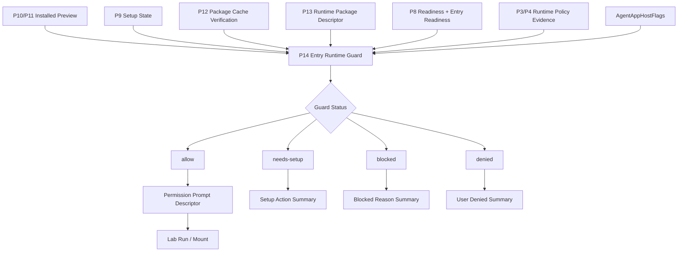
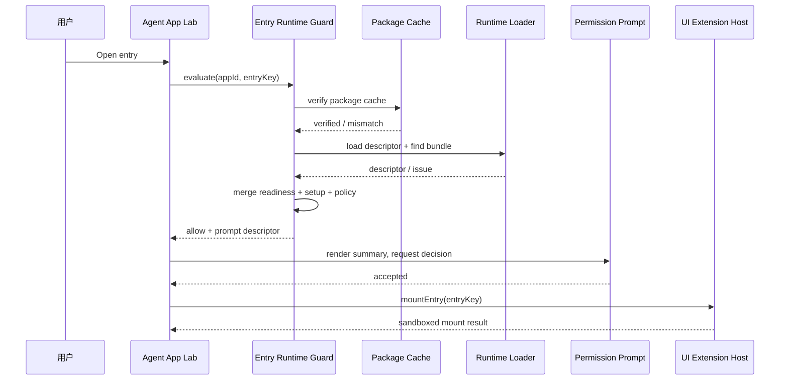
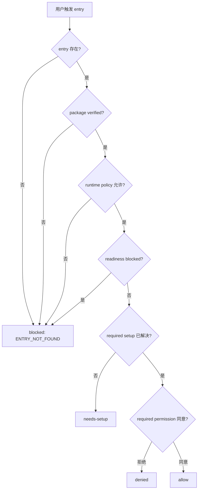

# Agent App P14 Entry Runtime Guard / Permission Prompt

更新时间：2026-05-15

## 一句话目标

P14 已在 P13 runtime package loader 和 UI bundle loader 稳定后，把 entry-level readiness、setup state、package verification、runtime policy 和 permission prompt 合并成统一运行前守卫。P14 仍只服务 Lab 实验岛，不进入正式主导航，不执行 raw worker，不让 App 绕过 Capability SDK。

## 计划更新判断

上游 Agent App 标准已经把宿主最低职责明确为：`Discover → Validate → Project → Check readiness → Authorize → Inject capabilities → Isolate data → Clean up`。Lime 客户端 P0-P13 已经覆盖到 package、projection、readiness、setup、persistence、cache、loader，但还缺少独立的 `Authorize` 运行前 gate。

因此计划需要这样调整：

1. P14 不再只是 UI 上的权限说明，而是所有 entry `run / mount` 前必须经过的统一 guard。
2. P14 完成前，P15 的 Lab install / launch flow 不得直接串 runtime loader。
3. P14 guard 必须复用 P8-P13 的事实源，不能新增第二套 readiness 或 package verification。
4. Permission prompt 只展示 capability、permission、policy、setup 摘要，不保存 secret value，不携带客户数据。
5. Cloud / LimeCore 仍只提供 catalog、release、tenant enablement、metadata；不运行 Agent、不渲染 UI、不接管本地 storage。

## 当前落地

| 项 | 证据 |
|---|---|
| Guard evaluator | `src/features/agent-app/runtime/entryRuntimeGuard.ts` 新增 `evaluateAgentAppEntryRuntimeGuard()`，输出 `allow / needs-setup / blocked / denied`。 |
| Permission prompt descriptor | Guard 生成 capability、permission、setup、policy、secret slot 和 warning 摘要，不包含 secret value 或客户数据。 |
| Package / loader 合并 | Guard 复用 P12 package verification 与 P13 `loadRuntimePackageDescriptor()`，hash mismatch 优先 `blocked`。 |
| Lab 前置接线 | `AgentAppLabPage` 在 `runEntry`、`mountEntry` 和内容工厂 demo 前先调用 P14 guard；非 `allow` 不继续调用 CapabilityHost / UI Host。 |
| 五语言文案 | `src/i18n/resources/*/agent.json` 增加 guard 状态、摘要、policy 和 setup 文案。 |
| 导出入口 | `src/features/agent-app/index.ts` 导出 P14 guard API 和类型。 |

## 当前输入事实源

| 输入 | 事实源 | P14 用法 |
|---|---|---|
| Installed preview | `InstalledAppPreview` | 获取 manifest、projection、readiness、cleanup plan 和 package identity。 |
| Setup state | `AgentAppSetupState` / `InMemoryAgentAppSetupStateStore` | 判断 required Knowledge / Skill / Tool / Secret / Overlay 是否已绑定。 |
| Package verification | `verifyAgentAppPackageCacheEntry()` | hash mismatch / missing 必须先于 runtime mount 阻断。 |
| Runtime descriptor | `loadRuntimePackageDescriptor()` | 确认 UI bundle descriptor 来自 verified package cache。 |
| UI sandbox policy | `agentAppUiSandboxPolicy` | 输出 raw Tauri / Node / network / filesystem 阻断证据。 |
| Readiness result | `ReadinessResult.entryReadiness` | 合并 app-level blocker 和 entry-level blocker。 |
| Host flags | `AgentAppHostFlags` | 确认 UI / worker / adapter / cloud bootstrap 是否显式开启。 |
| Projection declarations | `AgentAppProjection` | 汇总 capabilities、permissions、tools、secrets、policies、runtime package。 |

## 架构图



## 状态模型

| 状态 | 含义 | 是否允许 run / mount | 典型原因 |
|---|---|---:|---|
| `allow` | package、setup、readiness、policy 均满足，且用户已同意必要权限。 | 是 | verified package、entry ready、permission accepted。 |
| `needs-setup` | 结构合法，但 required setup 未完成。 | 否 | `project_knowledge` 未绑定、required skill / tool / secret 未配置。 |
| `blocked` | 宿主或 package 层硬阻断。 | 否 | hash mismatch、Cloud disabled、capability missing、runtime policy block。 |
| `denied` | 用户或 workspace owner 拒绝必要授权。 | 否 | required file / tool / model / secret permission 被拒绝。 |

P14 不引入“半运行”状态：只要 entry 被判为 `needs-setup / blocked / denied`，Lab 不得继续调用 `UiExtensionHost.mountEntry()` 或 `CapabilityHost.runEntry()`。

## Guard 决策顺序

```text
1. 校验 entry 存在并属于当前 projection。
2. 校验 feature flag 与 entry kind 是否允许当前 Lab 操作。
3. 校验 package cache verification，missing / mismatch 直接 blocked。
4. 校验 runtime package descriptor 与 entry bundle 是否一致。
5. 校验 runtime policy evidence，raw worker / network / filesystem / Tauri / Node 默认 blocked。
6. 合并 app-level readiness blockers。
7. 合并 entry-level readiness blockers。
8. 合并 setup state：required 未解决输出 needs-setup，optional 未解决输出 warning。
9. 生成 permission prompt descriptor。
10. 用户拒绝 required permission 输出 denied；同意后输出 allow。
```

## Entry 类型处理

| Entry kind | P14 行为 | 不做什么 |
|---|---|---|
| `page` / `panel` / `settings` | 通过 runtime package loader 找到 UI bundle，再交给 UI Host。 | 不注册正式 route，不开放 raw Tauri / Node。 |
| `workflow` | 仅允许受控 workflow DSL 和现有 Lab runner。 | 不执行 raw worker bundle。 |
| `expert-chat` | 只生成 permission / capability review 摘要。 | 不接 Chat 主路径。 |
| `command` / `artifact` / `background-task` | 默认 blocked 或 Lab-only disabled，直到后续阶段定义 runtime host。 | 不自动注册命令、Artifact viewer 或后台任务。 |

## Permission Prompt Descriptor 草案

```ts
type AgentAppEntryRuntimeGuardStatus = "allow" | "needs-setup" | "blocked" | "denied";

type AgentAppPermissionDecision = "not-required" | "requires-review" | "accepted" | "denied";

interface AgentAppPermissionPromptDescriptor {
  appId: string;
  appVersion: string;
  entryKey: string;
  entryTitle: string;
  packageHash: string;
  manifestHash: string;
  decision: AgentAppPermissionDecision;
  requestedCapabilities: Array<{
    capability: string;
    requestedRange: string;
    implementation: "mock" | "adapter" | "native";
    required: boolean;
  }>;
  requestedPermissions: Array<{
    key: string;
    reason: string;
    required: boolean;
  }>;
  setupSummary: Array<{
    kind: string;
    key: string;
    required: boolean;
    resolved: boolean;
    remediation?: string;
  }>;
  policySummary: {
    rawWorkerAllowed: false;
    networkAllowed: false;
    fileSystemAllowed: false;
    rawTauriAllowed: false;
    nodeApiAllowed: false;
  };
  secretSlots: Array<{
    key: string;
    provider?: string;
    required: boolean;
  }>;
  warnings: string[];
}

interface AgentAppEntryRuntimeGuardResult {
  status: AgentAppEntryRuntimeGuardStatus;
  prompt?: AgentAppPermissionPromptDescriptor;
  blockers: ReadinessIssue[];
  warnings: ReadinessIssue[];
  provenance: AgentAppProvenance;
}
```

约束：`secretSlots` 只能展示 slot metadata，不能展示 secret value；prompt descriptor 不能包含 workspace 私有文件内容、Knowledge 原文或客户数据。

## 时序图：打开 UI entry



## 流程图：运行前阻断



## 用户故事

| 编号 | 用户故事 | 验收标准 |
|---|---|---|
| US-P14-01 | 作为用户，我在打开 App 页面前能看到它要用哪些能力和权限。 | Prompt descriptor 展示 capability、permission、policy 和 setup 摘要。 |
| US-P14-02 | 作为用户，我拒绝必要权限后 App 不会继续运行。 | Guard 输出 `denied`，Lab 不调用 run / mount。 |
| US-P14-03 | 作为管理员，我希望 hash mismatch 不能被权限确认绕过。 | Package verification blocker 优先级高于 prompt。 |
| US-P14-04 | 作为 App 作者，我希望缺 setup 时用户看到明确修复动作。 | `needs-setup` 输出 kind、key、required、remediation。 |
| US-P14-05 | 作为平台维护者，我希望 guard 复用已有 readiness 和 loader。 | 不新增第二套 readiness checker 或 package verifier。 |

## 典型用例

| 用例 | 输入 | 预期结果 |
|---|---|---|
| 打开 `dashboard` page | verified package、UI runtime enabled、entry ready | 输出 `allow`，展示 prompt，确认后 mount UI Host。 |
| 运行 `content_scenario_planning` | `project_knowledge` required 但未绑定 | 输出 `needs-setup`，提示绑定 Agent Knowledge。 |
| 升级包 hash 不一致 | package cache entry 与 identity mismatch | 输出 `blocked`，不展示可确认运行按钮。 |
| App 声明 worker bundle | raw worker sandbox 未开放 | 输出 policy block 或 warning；P14 不执行 worker bundle。 |
| 用户拒绝文件读取 | required permission denied | 输出 `denied`，不调用 SDK。 |

## 分期计划

| 阶段 | 目标 | 不做什么 |
|---|---|---|
| P14.0 | 已完成：定义 guard result、prompt descriptor、permission decision 类型。 | 未接正式主导航。 |
| P14.1 | 已完成：实现 guard evaluator，合并 readiness、setup state、package verification、runtime policy。 | 未新增第二套 readiness。 |
| P14.2 | 已完成：实现 prompt descriptor builder，只输出 capability / permission / policy 摘要。 | 未保存 secret value。 |
| P14.3 | 已完成：将 guard 接到 Lab `runEntry` / `mountEntry` 前置路径。 | 未执行 raw worker。 |
| P14.4 | 已完成：覆盖 allow / needs-setup / blocked / denied 测试。 | 未新增 Tauri command。 |
| P14.5 | 已完成：更新五语言 Lab 文案与边界审计。 | 未进入 marketplace。 |

## 文件边界

| 文件 | 计划改动 |
|---|---|
| `src/features/agent-app/runtime/entryRuntimeGuard.ts` | 新增 guard evaluator、prompt descriptor builder 和 status 合并逻辑。 |
| `src/features/agent-app/runtime/entryRuntimeGuard.test.ts` | 覆盖 allow、needs-setup、blocked、denied、policy block、hash mismatch。 |
| `src/features/agent-app/runtime/runtimePackageLoader.ts` | 仅作为输入复用；如需补 issue code，只做局部扩展。 |
| `src/features/agent-app/runtime/uiExtensionHost.ts` | 保留最后防线；Lab 前置 guard 通过后再调用 mount。 |
| `src/features/agent-app/ui/AgentAppLabPage.tsx` | 在 run / open UI 前展示 guard 和 prompt 状态。 |
| `src/features/agent-app/ui/AgentAppLabPage.test.tsx` | 覆盖 prompt、拒绝、needs-setup、blocked 不继续运行。 |
| `src/features/agent-app/index.ts` | 仅导出 P14 public test seam，不暴露 Lime internal。 |
| `src/i18n/resources/*/agent.json` | 增加五语言 prompt / guard 文案。 |

## 验证记录

| 命令 | 结果 |
|---|---|
| `npm run test -- src/features/agent-app/schema/schemaGate.test.ts src/features/agent-app/manifest/parseManifest.test.ts src/features/agent-app/projection/projectApp.test.ts src/features/agent-app/readiness/checkReadiness.test.ts src/features/agent-app/install/cloudBootstrap.test.ts src/features/agent-app/install/setupStateStore.test.ts src/features/agent-app/install/installedAppState.test.ts src/features/agent-app/install/packageCache.test.ts src/features/agent-app/featureFlag.test.ts src/features/agent-app/sdk/MockCapabilityHost.test.ts src/features/agent-app/adapters/AdapterCapabilityHost.test.ts src/features/agent-app/runtime/contentFactoryDemo.test.ts src/features/agent-app/runtime/workflowRuntimeHost.test.ts src/features/agent-app/runtime/uiExtensionHost.test.ts src/features/agent-app/runtime/runtimePackageLoader.test.ts src/features/agent-app/runtime/entryRuntimeGuard.test.ts src/features/agent-app/ui/AgentAppLabPage.test.tsx` | 通过，17 files / 79 tests。 |
| `npm run test -- src/i18n/__tests__/translation-coverage.test.ts src/i18n/__tests__/loadNamespace.test.ts src/features/agent-app/ui/AgentAppLabPage.test.tsx` | 通过，3 files / 22 tests。 |
| `npm run test:contracts` | 通过。 |
| `git diff --check -- docs/roadmap/agentapp src/features/agent-app src/i18n/resources src/vite-env.d.ts` | 通过。 |
| `rg` boundary / legacy audit | 通过，`src/features/agent-app` 与五语言 `agent.json` 无 `safeInvoke` / Tauri / raw Worker 越界，也未复活旧内容工程化 key。 |
| `npm run typecheck` | 通过；已将既有 `src/lib/sceneapp/product.test.ts` 的详情视图测试输入收窄到产品层实际消费字段，未扩展 deprecated SceneApp 运行面。 |

## 验收标准

1. `runEntry` 和 `mountEntry` 前必须先调用 P14 guard。
2. `needs-setup` 不得被误判为 `allow`。
3. `package_hash_mismatch`、`manifest_hash_mismatch`、Cloud disabled、runtime policy block 必须直接 `blocked`。
4. Permission prompt 不展示 secret value、文件内容、Knowledge 原文或客户数据。
5. UI Host 仍阻断 raw Tauri API、Node API、network、filesystem、download 和 popup。
6. 不新增 Tauri command，不直接 `safeInvoke` / `invoke`。
7. P14 仍保持 Lab 实验岛，不注册正式主导航、命令面板、Chat 主路径或 Artifact 主 schema。

## 最小验证

```bash
npm run test -- \
  src/features/agent-app/runtime/entryRuntimeGuard.test.ts \
  src/features/agent-app/runtime/runtimePackageLoader.test.ts \
  src/features/agent-app/runtime/uiExtensionHost.test.ts \
  src/features/agent-app/readiness/checkReadiness.test.ts \
  src/features/agent-app/install/setupStateStore.test.ts \
  src/features/agent-app/ui/AgentAppLabPage.test.tsx

npm run typecheck
npm run test:contracts

git diff --check -- docs/roadmap/agentapp src/features/agent-app src/i18n/resources

rg -n "safeInvoke|invoke\(|tauri::|generate_handler|mockPriorityCommands|defaultMocks|new Worker|Worker\(" src/features/agent-app || true
```

## 非目标

- 不做 marketplace、公开审核流、支付、企业管理台。
- 不把 Agent App entry 接入正式主导航或 Chat 主路径。
- 不执行任意 App package JS、raw worker bundle、native binary 或 npm install。
- 不新增 Tauri command。
- 不让 Cloud / LimeCore 运行默认 Agent Runtime 或渲染 App UI。

## 下一刀

P14 已完成当前实现与定向验证，P15 已继续把 install review、package cache、permission prompt、runtime loader、entry launch 和 cleanup 串成一个可演示的 Lab-only 端到端流程，P15-H 已补 Agent App Lab 专用 GUI smoke / cleanup rehearsal 证据，P16 已完成最小 Agent App Manager。P17 Gate 审计、P17.0 Formal Entry Contract、P17.1 Formal route / nav / copy hardening、P17.2.1 Source state model、P17.2.2 Install review descriptor、P17.2.3 Registration hardening 与 P17.2.4a Cloud release descriptor / verification gate、P17.2.4b-1 acquisition seam / verified cache source、P17.2.4b-2 packageUrl fetch / staging / manifest extraction 与 P17.2.5 public schema / reference CLI / standard example package cross-check 已完成，P17.3 lifecycle / cleanup contract 与 P17.4 runtime surface production hardening 已完成，当前进入 P17.5 formal entry GUI smoke。
