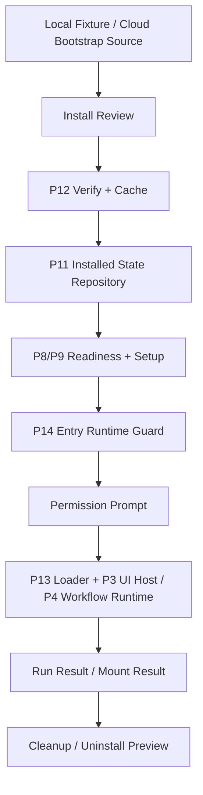

# Agent App P15 Lab Install / Launch Flow

更新时间：2026-05-15

## 一句话目标

P15 已在 P14 Entry Runtime Guard / Permission Prompt 稳定后，把 `package source → install review → verify/cache → setup/readiness → permission prompt → run/mount → cleanup` 串成一个 Lab-only 端到端演示流程。P15 仍不是 marketplace，也不进入正式主导航。

## 背景

P0-P13 已经把客户端需要的底层部件逐层补齐，P14 会补上运行前授权 gate。完成 P14 后，最大的缺口不再是单个能力，而是用户在 Lab 中无法像安装一个小程序一样完成连续流程：看到包、审查包、安装、处理 setup、确认权限、打开 entry、失败后清理。

P15 因此只做编排，不新增底层平台能力。

## P15 输入

| 来源阶段 | 可复用能力 |
|---|---|
| P5 | Cloud bootstrap / local package source 统一输入。 |
| P7 | Schema / snapshot gate。 |
| P8-P9 | `needs-setup` 与 setup state store。 |
| P10-P11 | installed state snapshot 与 local persistence adapter。 |
| P12 | package cache / verify / rollback。 |
| P13 | runtime package loader / UI bundle loader。 |
| P14 | entry runtime guard / permission prompt。 |

## 当前进入状态

| 前置项 | 状态 | 说明 |
|---|---|---|
| P14 guard | 已具备 | `runEntry`、`mountEntry` 和内容工厂 demo 已先过 P14 guard，非 `allow` 不继续调用 CapabilityHost / UI Host。 |
| typecheck | 已恢复 | `npm run typecheck` 已通过；修复点只收窄 deprecated SceneApp 测试输入，未恢复旧 SceneApp 主路径。 |
| Lab 范围 | 保持实验岛 | P15 只能升级 `src/features/agent-app/ui/AgentAppLabPage.tsx` 和 `src/features/agent-app/install/labInstallFlow.ts` 一类 Lab-only 编排。 |
| 主路径边界 | 不变 | 不新增 Tauri command，不接正式主导航，不让 App 直接 `safeInvoke` / `invoke`。 |

## 当前落地

| 项 | 证据 |
|---|---|
| Lab install flow orchestrator | `src/features/agent-app/install/labInstallFlow.ts` 新增 `evaluateAgentAppLabInstallFlow()`，输出状态机、install review、verified cache、installed state、runtime loader、guard、cleanup 与 keep-data / delete-data 分支预览。 |
| Lab setup resolver | `buildAgentAppLabResolvedSetupState()` 只从 projection required 项生成 Lab 示例 setup，用于演示完整闭环；不写真实 workspace。 |
| Lab UI 接线 | `AgentAppLabPage` 新增安装启动流程卡片，展示 package identity、setup、permission、launch readiness、cleanup target、keep-data / delete-data 分支。 |
| P14 guard 复用 | run / mount / 内容工厂 demo 仍先过 `evaluateAgentAppEntryRuntimeGuard()`；P15 不绕过 package verification、setup 或 runtime policy。 |
| 五语言文案 | `src/i18n/resources/*/agent.json` 已补齐 install flow、状态机、setup、permission、卸载分支文案。 |
| 导出入口 | `src/features/agent-app/index.ts` 导出 P15 current API 和类型。 |

## 架构图



## Lab 状态机

```text
source-selected
→ package-reviewed
→ package-verified
→ installed
→ setup-review
→ permission-review
→ launched
→ cleanup-preview
```

失败状态：

```text
package-invalid
package-mismatch
needs-setup
permission-denied
runtime-blocked
cleanup-required
```

## 用户故事

| 编号 | 用户故事 | 验收标准 |
|---|---|---|
| US-P15-01 | 作为用户，我可以在 Lab 中看到安装包来源、hash、manifest hash 和 release metadata。 | Install review 展示 package identity，不展示客户数据。 |
| US-P15-02 | 作为用户，我可以先审查再安装，而不是点击 entry 时才知道缺什么。 | 安装前能看到 readiness、setup、permissions 摘要。 |
| US-P15-03 | 作为维护者，我希望升级失败能回滚。 | P12 staging / rollback 结果在 Lab 中可见。 |
| US-P15-04 | 作为用户，我可以在同一流程里打开 App 页面或运行 Lab entry。 | P14 guard allow 后才调用 loader / UI host / workflow host。 |
| US-P15-05 | 作为用户，我可以清楚看到卸载会删除和保留什么。 | Cleanup preview 使用 P10-P12 的 installed/setup/cache/storage/artifact/evidence 目标。 |

## 分期计划

| 阶段 | 目标 | 不做什么 |
|---|---|---|
| P15.0 | 已完成：定义 Lab install flow state machine 和 orchestrator。 | 未新增正式 installer 服务。 |
| P15.1 | 已完成：把 fixture source 映射到 install review；Cloud source 仍复用 P5 metadata 输入，不在 UI 伪装成 ready。 | 未接公开 marketplace。 |
| P15.2 | 已完成：串联 package cache verify、installed state repository 和 readiness。 | 未绕过 hash / schema gate。 |
| P15.3 | 已完成：接入 P14 guard 和 permission prompt，再触发 run / mount。 | 未执行 raw worker。 |
| P15.4 | 已完成：展示 uninstall keep-data / delete-data 分支预览；rollback 能力继续复用 P12 package cache 测试覆盖。 | 未删除非 Agent App 数据。 |
| P15.5 | 已完成：补 Lab E2E-ish component tests 和边界审计。 | 未进入主导航。 |

## 文件边界

| 文件 | 计划改动 |
|---|---|
| `src/features/agent-app/install/labInstallFlow.ts` | 新增 Lab-only orchestrator，组合 package source、cache、repository、readiness、guard。 |
| `src/features/agent-app/install/labInstallFlow.test.ts` | 覆盖 source、verify、install、guard、launch、cleanup 分支。 |
| `src/features/agent-app/ui/AgentAppLabPage.tsx` | 从“能力展示页”升级为 Lab install / launch flow 页面。 |
| `src/features/agent-app/ui/AgentAppLabPage.test.tsx` | 覆盖安装审查、权限确认、阻断、清理预览。 |
| `src/features/agent-app/index.ts` | 导出 Lab flow 必需的 current API。 |
| `src/i18n/resources/*/agent.json` | 补全五语言安装、授权、启动、清理文案。 |

## 验收标准

1. Lab 能从 current fixture 完成 install review、verified cache、installed state、readiness、guard、launch、cleanup preview。
2. hash mismatch、schema gate failure、needs-setup、permission denied、runtime policy block 都有可解释 UI。
3. 所有 runtime 行为仍通过 Capability SDK / UI Host / Workflow Runtime，不 import Lime internal。
4. Cloud bootstrap 仍只是 source / metadata 输入，不能把 App 直接标记为 ready。
5. 卸载 keep-data / delete-data 分支不删除非 Agent App 数据。
6. 不新增 Tauri command，不接正式主导航、命令面板或 Chat 主路径。

## 最小验证

```bash
npm run test -- \
  src/features/agent-app/install/labInstallFlow.test.ts \
  src/features/agent-app/runtime/entryRuntimeGuard.test.ts \
  src/features/agent-app/install/packageCache.test.ts \
  src/features/agent-app/install/installedAppState.test.ts \
  src/features/agent-app/ui/AgentAppLabPage.test.tsx

npm run typecheck
npm run test:contracts
```

## 验证记录

| 命令 | 结果 |
|---|---|
| `npm run test -- src/features/agent-app/install/labInstallFlow.test.ts src/features/agent-app/runtime/entryRuntimeGuard.test.ts src/features/agent-app/install/packageCache.test.ts src/features/agent-app/install/installedAppState.test.ts src/features/agent-app/ui/AgentAppLabPage.test.tsx` | 通过，5 files / 28 tests。 |
| `npm run test -- src/i18n/__tests__/translation-coverage.test.ts src/i18n/__tests__/loadNamespace.test.ts src/i18n/__tests__/types.test.ts` | 通过，3 files / 17 tests。 |
| `npm run typecheck` | 通过。 |
| `npm run test:contracts` | 通过。 |
| `git diff --check -- docs/roadmap/agentapp src/features/agent-app src/i18n/resources src/vite-env.d.ts src/lib/sceneapp/product.test.ts` | 通过。 |
| `rg` boundary / legacy audit | 通过，`src/features/agent-app` 无 `safeInvoke` / Tauri / raw Worker 越界，未复活旧内容工程化 key。 |
| `npm run smoke:agent-app-lab -- --timeout-ms 180000` | 通过；P15-H 已补 Agent App Lab 专用 GUI smoke，summary / 截图输出到 `.lime/qc/gui-evidence/agent-app-lab/`。 |
| `npm run verify:gui-smoke` | 最新 P16 验证已通过；此前 provider/model 探测失败已不再阻塞当前 Lab 证据。 |

## P15 之后再评估

P15 Lab 端到端流程已经具备代码、组件测试和 P15-H 专用 GUI smoke 证据，P16 已补实验岛内最小 Agent App Manager；P16-H.1 / P16-H.2 / P16-H.3 / P16-H.4 / P16-H.5 已把 Manager 推进到多 App repository list、selected launcher、持久化 lifecycle、cleanup evidence export、residual audit 与 flag-off GUI smoke。P17 Gate 审计、P17.0 Formal Entry Contract 与 P17.1 Formal route / nav / copy hardening 已完成，下一刀应优先做 P17.2 Source / install contract hardening，而不是直接讨论 marketplace、Workspace 内 App pin、命令面板入口、Chat expert entry 或真实 delete-data。
