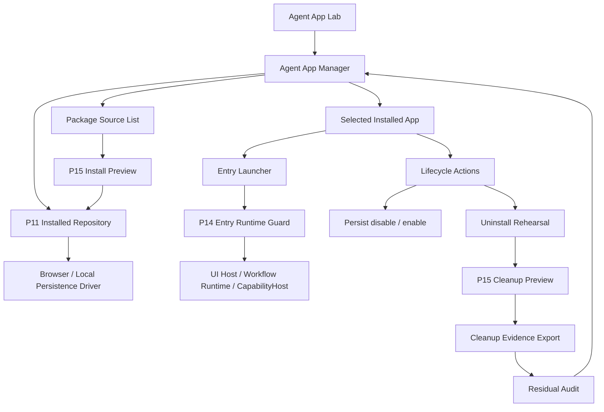
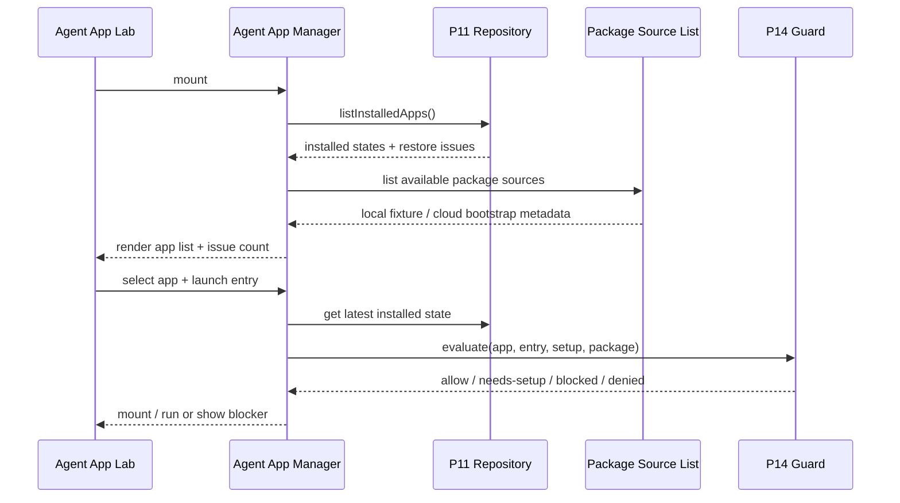
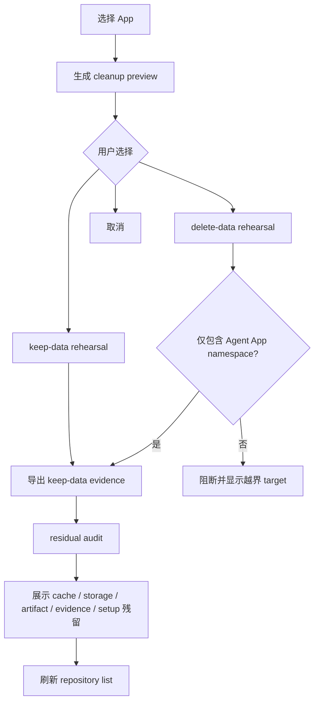

# Agent App P16-H Multi-app Repository / Lifecycle Hardening

更新时间：2026-05-15

## 一句话目标

P16-H 的目标不是把 Agent App 直接发布到正式主入口，而是在实验岛内把 P16 单 App Manager 升级为可管理多个 installed app 的可靠生命周期面：同一套 P11 repository、P14 guard、P15 cleanup preview 和 GUI smoke 证据必须同时覆盖多 App list、持久化 enable / disable、uninstall rehearsal、cleanup evidence export 与 residual audit。

## 背景

P16 已证明最小 Agent App Manager 可以展示一个 Lab fixture 形成的 installed app，并通过 P14 guard 打开 entry、执行 disable / enable、生成 keep-data / delete-data preview。但这个状态仍不够支撑正式 Agent Apps 入口：

1. 单 fixture 不能证明 Manager 是平台能力，只能证明 demo 可用。
2. disable / enable 如果只停留在 UI state，失败后无法恢复真实生命周期。
3. uninstall preview 如果没有可导出 evidence 和 residual audit，失败后无法清理。
4. 多 App 场景下如果绕过 P11 repository，很容易长出第二套 install store。
5. 如果此时接主导航或 marketplace，会把实验岛风险带进主产品。

因此 P16-H 先补“平台最小可靠性”，不补“生态规模化”。

## 当前落地

| 项 | 状态 | 证据 |
|---|---|---|
| P16-H.0 计划收口 | 已完成 | README、implementation plan、P16 文档与本文已指向同一 P16-H 主链。 |
| Repository-backed multi-app list | 已完成最小实现 | `AgentAppManagerPanel` 从 repository states 渲染 App list，`AgentAppLabPage` 通过 P11 repository seed 当前 App 与本地 companion fixture。 |
| Selected app launcher | 已完成最小实现 | 选中 App 后 identity、source、readiness、entry launcher、P14 guard、UI Host 和 lifecycle action 使用 selected state。 |
| 持久化 lifecycle | 已完成最小实现 | disable / enable 已按 selected appId 调用 P11 repository，并通过组件 / Lab 测试覆盖 remount 恢复和 disabled blocker。 |
| Cleanup evidence export | 已完成最小实现 | `cleanupRehearsalEvidence` 生成 selected app JSON summary，Manager / Lab / smoke 覆盖 selected appId、strategy、targets、blockedTargets。 |
| Residual audit | 已完成最小实现 | `cleanupResidualAudit` 消费 selected app cleanup evidence 与 repository issues，Manager / Lab / smoke 覆盖 pending deletion、out-of-scope blocker 和 repository issue summary。 |
| GUI smoke + flag-off regression | 已完成最小实现 | `smoke:agent-app-lab` 已覆盖 multi-app、selected app、disable blocker、cleanup evidence、residual audit 和 flag-off Lab 隔离。 |
| P17 gate audit | 已完成 | 详见 [p17-formal-entry-gate-audit.md](./p17-formal-entry-gate-audit.md)：对照正式入口前 Gate 映射 P16-H 证据，结论是可进入正式入口设计，但不能发布 marketplace / Cloud 管理台 / 真实 delete-data。 |
| P17.0 Formal Entry Contract | 已完成计划收口 | 详见 [p17-formal-entry-contract.md](./p17-formal-entry-contract.md)：固定 `agent-apps`、`agent-app-lab` 与 runtime surface 的职责边界；P17.1、P17.2.1、P17.2.2、P17.2.3、P17.2.4a、P17.2.4b-1、P17.2.4b-2 与 P17.2.5 已完成，下一刀进入 [P17.3 lifecycle / cleanup contract hardening](./p17-source-install-contract-hardening.md)。 |

## 目的与收益

| 目的 | 收益 |
|---|---|
| 让 Manager 从单 App demo 变成多 App repository view。 | 后续正式入口可以复用同一数据事实源，不必重写 App 列表。 |
| 生命周期动作全部持久化。 | 重启、失败恢复、flag-off 回归都有一致状态。 |
| cleanup rehearsal 产出可复核 evidence。 | 未来真实 delete-data 前可以先证明不会误删非 Agent App 数据。 |
| residual audit 明确“还剩什么”。 | 失败后可以快速定位 cache、storage、artifact、evidence、setup state 的残留。 |
| 保持 Lab-only。 | 产品可继续探索，不污染 Chat、Skill、Artifact、Workspace 主路径。 |

## 当前输入事实源

| 分类 | 对象 | 说明 |
|---|---|---|
| current | `src/features/agent-app/install/installedAppState.ts` | P10 / P11 installed state、repository 与 persistence adapter 事实源。 |
| current | `src/features/agent-app/ui/AgentAppManagerPanel.tsx` | P16 Manager shell current 入口。 |
| current | `src/features/agent-app/runtime/entryRuntimeGuard.ts` | 所有 entry launch / mount 的唯一运行前 gate。 |
| current | `src/features/agent-app/install/labInstallFlow.ts` | Lab-only install / launch / cleanup preview 编排。 |
| current | `scripts/agent-app-lab-smoke.mjs` | Agent App Lab 专用 GUI smoke 与证据输出。 |
| reference | `/Users/coso/Documents/dev/ai/limecloud/limecore/docs/roadmap/agentapp` | Cloud / LimeCore 只提供 catalog、release、tenant metadata，不运行 Agent App。 |
| dead | 旧 `SceneAppsPage`、`sceneapp_*` 命令、`contentEngineering*` 旧命名 | 不作为 P16-H 兼容目标，不复活。 |

## 非目标

1. 不做 marketplace、审核流、支付、企业控制台或 Cloud 管理台。
2. 不把 Agent App 接入正式主导航、命令面板、Chat expert 入口或 Artifact 主 schema。
3. 不新增 Tauri command，不让 Agent App 直接 `safeInvoke` / `invoke`。
4. 不执行 raw worker bundle、任意 package JS、native binary、npm install 或外部网络调用。
5. 不做完整 内容工厂 SaaS，不进入真实平台抓取、批量生产、质量评分和外部数据复盘。
6. 不实现真实 delete-data；本阶段只做 rehearsal evidence 与 residual audit，真实删除需单独 gate。

## 架构图



关键约束：

- `Repo` 是多 App installed state 的唯一事实源；React state 只能作为展示缓存。
- `Launcher` 只负责选 entry 和显示结果；guard 规则仍由 P14 统一决定。
- `Cleanup Evidence Export` 只导出 summary，不导出 secret value、客户原文或非 App 数据。
- `Residual Audit` 只检查 Agent App namespace，不扫描或删除 Lime 主业务数据。

## 时序图：多 App 启动恢复



## 流程图：卸载演练与残留检查



## 用户故事

| 编号 | 用户故事 | 验收标准 |
|---|---|---|
| US-P16H-01 | 作为用户，我可以看到多个已安装 App 及其状态。 | Manager list 从 P11 repository 读取，展示 appId、version、source、readiness、enabled 和 issue count。 |
| US-P16H-02 | 作为用户，我可以选择某个 App 再打开它的 entry。 | 当前选中 App 的 entry launcher 复用 P14 guard；disabled / blocked App 不可旁路启动。 |
| US-P16H-03 | 作为用户，我可以禁用 / 启用某个 App，并在重启后保持状态。 | disable / enable 调用 repository lifecycle API，不只改 React state。 |
| US-P16H-04 | 作为维护者，我可以导出 cleanup rehearsal evidence。 | summary 包含 appId、version、packageHash、manifestHash、strategy、targets、blockedTargets、timestamp。 |
| US-P16H-05 | 作为维护者，我可以看到残留检查结果。 | residual audit 区分 expected retained、pending deletion、blocked out-of-scope 和 repository issue。 |

## 典型用例

### 用例 1：多 App 列表恢复

1. Lab 启动后从 P11 repository 读取 installed states。
2. Manager 展示 内容工厂和一个本地测试 App source 的状态。
3. 如果某个 state 损坏，坏记录进入 issue count，不影响其他 App 展示。
4. 用户选择 App 后，右侧展示 entries、readiness、setup、permissions 和 lifecycle actions。

### 用例 2：禁用后阻断启动

1. 用户点击某 App 的 disable。
2. Manager 调用 repository lifecycle API 持久化 disabled 状态。
3. entry launcher 重新评估 P14 guard。
4. 再次点击 launch 时展示 disabled blocker，不调用 UI Host 或 CapabilityHost。

### 用例 3：卸载演练和 evidence 导出

1. 用户选择 uninstall delete-data preview。
2. Cleanup preview 列出 storage、artifact、evidence、setup state、package cache target。
3. Namespace guard 过滤并阻断非 Agent App target。
4. Manager 展示可导出 JSON summary 与 residual audit。
5. 状态刷新后仍保持 rehearsal，不执行真实删除。

## 分期计划

| 阶段 | 目标 | 不做什么 |
|---|---|---|
| P16-H.0 | 已完成：新增本计划并收敛 README / implementation plan / P16 文档索引。 | 不改 runtime 行为。 |
| P16-H.1 | 已完成最小实现：Manager list 从 P11 repository 渲染多个 installed app，并支持选中 App。 | 不做 marketplace 搜索或远程分页。 |
| P16-H.2 | 已完成最小实现：生命周期动作全部走 repository：enable / disable / launch state refresh。 | 不新增第二套 lifecycle store。 |
| P16-H.3 | 已完成最小实现：cleanup rehearsal evidence export：生成 summary、blocked target、timestamp。 | 不保存 secret value，不执行真实 delete-data。 |
| P16-H.4 | 已完成最小实现：residual audit：检查 Agent App namespace 内 cache / storage / artifact / evidence / setup 残留。 | 不扫描 Lime 主业务目录。 |
| P16-H.5 | 已完成最小实现：GUI smoke 与 flag-off 回归：覆盖多 App list、选中、disable、cleanup evidence、residual audit 和关闭实验岛后的 Lab 隔离。 | 不接正式主导航。 |
| P17 Gate | 已完成：正式入口前完成度审计。 | P17.0 已完成契约收口，P17.1 已完成正式入口 route / nav / copy 最小硬化；P17.2 前仍不新增 marketplace、真实 delete-data 或 Cloud 管理台。 |

### P16-H.3 实施拆解

P16-H.3 只把卸载演练从“UI preview”升级为“可复核 evidence summary”，不执行真实删除，也不新增任何持久化删除入口：

| 切片 | 实施内容 | 验收 |
|---|---|---|
| Evidence builder | 在 `install/cleanupPlan.ts` 或独立 `install/cleanupRehearsalEvidence.ts` 增加纯函数，输入 selected installed state、cleanup plan、strategy、generatedAt。 | 输出只含 appId、appVersion、packageHash、manifestHash、strategy、targets、blockedTargets、generatedAt 与 counts。 |
| Target 分类 | 将 package cache、installed state、setup state、storage namespace、artifact / evidence / task refs、log / export path 按 App namespace 分类。 | `delete-data` 只把 Agent App namespace 内 target 标为可删除；越界或不可判定 target 进入 blockedTargets。 |
| Secret / 原文保护 | `secretRefs` 只保留 ref id / capability key / reason，不记录 secret value；artifact / evidence 只保留 ref 元数据，不记录客户原文。 | JSON summary 中不能出现 secret value、客户原文、外部业务数据。 |
| Manager 展示 | `AgentAppManagerPanel` 展示 selected app 的 latest rehearsal summary，并提供 Lab-only JSON 预览。 | 选择 companion app 后 summary appId 跟随 selected app，不回落到默认 fixture。 |
| Lab 编排 | `AgentAppLabPage` 的 keep-data / delete-data preview 复用 P15 cleanup preview 与 selected state。 | 不新增 store，不直接调用 Tauri，不绕过 P11 repository。 |
| 专用验证 | 扩展组件测试、Lab 测试和 `smoke:agent-app-lab` summary。 | smoke summary 至少覆盖 cleanup evidence JSON、strategy、selected appId、blocked target count。 |

P16-H.3 已按最小实现完成；P16-H.4 已继续把 evidence summary 推进到 residual audit。后续仍不要在 P16-H 内实现真实 `delete-data`、全盘扫描、正式下载文件或 Cloud 回写。

### P16-H.4 实施拆解

P16-H.4 只把 cleanup rehearsal evidence 转换为可复核 residual audit，不扫描真实文件系统，也不执行真实删除：

| 切片 | 实施内容 | 验收 |
|---|---|---|
| Audit builder | 新增 `install/cleanupResidualAudit.ts` 纯函数，输入 selected installed state、cleanup evidence、repository issues。 | 输出 `retainedTargets`、`pendingDeletionTargets`、`blockedOutOfScopeTargets`、`repositoryIssues` 四类 summary 与 count。 |
| Namespace 保守边界 | 只消费 P16-H.3 evidence 中已分类的 target，不新增全盘扫描器。 | `delete-data` 只产生 pending deletion；`keep-data` 区分 retained 与 pending deletion。 |
| Repository issue 映射 | 只保留当前 appId 或无 appId 的 repository issue。 | 不把其他 App 的损坏记录泄漏到当前 App audit。 |
| Manager 展示 | `AgentAppManagerPanel` 在 cleanup JSON 下展示 residual audit summary。 | UI 显示 retained、pending deletion、blocked out-of-scope、repository issue 四类计数。 |
| Lab 编排 | `AgentAppLabPage` 在 keep-data / delete-data preview 后基于 selected app 生成 audit。 | companion app delete-data preview 后 audit 与 selected app 对齐。 |
| 专用验证 | 扩展纯函数测试、组件测试、Lab 测试和 `smoke:agent-app-lab` summary。 | smoke summary 覆盖 `residualAuditVisible`、`residualAuditPending` 与 selected app cleanup evidence。 |

## 文件边界

| 文件 / 目录 | 计划 |
|---|---|
| `src/features/agent-app/ui/AgentAppManagerPanel.tsx` | 拆出或扩展 list / selected app / lifecycle / evidence 子面板，避免把多 App 状态继续堆在 Lab page。 |
| `src/features/agent-app/ui/AgentAppManagerPanel.test.tsx` | 新增组件级测试，覆盖多 App list、选择、disabled blocker、evidence summary。 |
| `src/features/agent-app/ui/AgentAppLabPage.tsx` | 只负责编排实验岛与 repository driver，不承载多 App 业务规则。 |
| `src/features/agent-app/install/installedAppState.ts` | 复用 P11 repository；如需新增方法，只添加通用 lifecycle API，不添加 UI 专用 store。 |
| `src/features/agent-app/install/cleanupRehearsalEvidence.ts` / `cleanupResidualAudit.ts` | 补 rehearsal evidence 与 residual audit 的纯函数，保持无 Tauri command。 |
| `scripts/agent-app-lab-smoke.mjs` | 已扩展断言多 App list、selected app、disable blocker、cleanup evidence export、residual audit 与 flag-off。 |
| `src/i18n/resources/*/agent.json` | 新增用户可见文案时必须覆盖五语言。 |
| `docs/roadmap/agentapp/*` | 记录 P16-H 验证证据和正式入口 gate 结论。 |

## 验收标准

1. Manager 能展示至少两个 installed app 或一个 installed app 加一个 repository issue，不依赖 hard-coded 单 fixture UI。
2. 用户选择 App 后，entry launcher、readiness、setup、permission、lifecycle action 都绑定当前 selected app。
3. Disable / enable 通过 P11 repository 持久化；刷新或 remount 后状态不丢。
4. Disabled / blocked entry 无法绕过 P14 guard 启动。
5. Uninstall keep-data / delete-data rehearsal 生成可导出 evidence summary。
6. residual audit 只报告 Agent App namespace 内对象，并明确 out-of-scope target。
7. `src/features/agent-app` 仍无 `safeInvoke` / `invoke` / Tauri command / raw Worker 越界入口。
8. flag-off 后 Manager 不出现在正式主路径，普通 Chat / Skill / Artifact / Workspace 不受影响。

## 最小验证

```bash
npm run test -- \
  src/features/agent-app/ui/AgentAppManagerPanel.test.tsx \
  src/features/agent-app/ui/AgentAppLabPage.test.tsx \
  src/features/agent-app/install/cleanupRehearsalEvidence.test.ts \
  src/features/agent-app/install/cleanupResidualAudit.test.ts \
  src/features/agent-app/install/installedAppState.test.ts

npm run test -- \
  src/i18n/__tests__/translation-coverage.test.ts \
  src/i18n/__tests__/loadNamespace.test.ts \
  src/i18n/__tests__/types.test.ts

npm run typecheck
npm run smoke:agent-app-lab -- --timeout-ms 180000
npm run test:contracts

git diff --check -- docs/roadmap/agentapp src/features/agent-app scripts/agent-app-lab-smoke.mjs package.json src/i18n/resources

rg -n "safeInvoke|invoke\(|tauri::|generate_handler|mockPriorityCommands|defaultMocks|new Worker|Worker\(" src/features/agent-app || true
rg -n "contentEngineering|ContentEngineering|content_engineering|scene_exhaustion|shenlan-content-engineering|AI 内容工程化|content-engineering-app" src/features/agent-app src/i18n/resources || true
```

## 验证记录

更新时间：2026-05-15

| 命令 | 结果 |
|---|---|
| `npm run test -- src/features/agent-app/install/cleanupRehearsalEvidence.test.ts src/features/agent-app/install/cleanupResidualAudit.test.ts src/features/agent-app/install/installedAppState.test.ts src/features/agent-app/ui/AgentAppManagerPanel.test.tsx src/features/agent-app/ui/AgentAppLabPage.test.tsx` | 通过，5 files / 26 tests；覆盖 P16-H.3 evidence builder、P16-H.4 residual audit、secret redaction、blocked target、Manager JSON 和 selected companion App delete-data preview。 |
| `npm run test -- src/features/agent-app/ui/AgentAppRuntimePage.test.tsx src/features/agent-app/ui/AgentAppsPage.test.tsx src/lib/navigation/sidebarNav.test.ts` | 通过，3 files / 10 tests；覆盖正式 Agent Apps 入口、runtime surface、Cloud registration、installed App lifecycle 和 Lab flag sidebar gate。 |
| `npm run test -- src/i18n/__tests__/translation-coverage.test.ts src/i18n/__tests__/loadNamespace.test.ts src/i18n/__tests__/types.test.ts` | 通过，3 files / 17 tests；覆盖新增 Manager evidence / residual audit / Agent Apps runtime 文案五语言资源。 |
| `npm run smoke:agent-app-lab -- --timeout-ms 180000` | 通过；DevBridge 88658ms ready，summary 包含 `managerMultiApp`、`managerSelectedApp`、`managerDisableBlocked`、`managerEnableAvailable`、`managerReenabled`、`selectedRuntimeApp`、`cleanupEvidenceJson`、`residualAuditVisible`、`residualAuditPending`、`flagOffLabNavHidden`、`flagOffLabPageHidden`、`flagOffAgentAppsNavVisible`、`flagOffNoConsoleErrors`。 |
| `npm run typecheck` | 通过；`tsc --noEmit` 已覆盖 Agent Apps runtime page、display helper 和新增 i18n key 类型。 |
| `node --check scripts/agent-app-lab-smoke.mjs` | 通过；P16-H.5 smoke 脚本语法有效。 |
| `npm run test:contracts` | 通过；frontend commands 399、Rust registered commands 555、mock priority commands 48、default mock commands 379，命令契约、Harness 契约、modality contracts 与 cleanup report contract 均通过。 |
| `git diff --check -- docs/roadmap/agentapp src/features/agent-app scripts/agent-app-lab-smoke.mjs package.json src/i18n/resources` | 通过。 |
| `rg` boundary / legacy audit | 通过，`src/features/agent-app` 无 `safeInvoke` / Tauri / raw Worker 越界，未复活旧内容工程化 key。 |

如果 P16-H 触及 GUI 主路径或正式入口候选，再补：

```bash
npm run verify:gui-smoke
npm run verify:local
```

## 进入 P17 / 正式入口前 Gate

P16-H 完成后也不自动发布正式入口。P17 Gate 审计结论详见 [p17-formal-entry-gate-audit.md](./p17-formal-entry-gate-audit.md)；只有同时满足以下条件，才进入 P17 正式 Agent Apps 入口设计：

1. 多 App repository、生命周期动作、cleanup rehearsal、residual audit 都有组件测试和 GUI smoke 证据。
2. Manager 没有第二套 store；所有 installed state 都能追溯到 P11 repository。
3. App entry launcher 与 P14 guard 的耦合可测试证明，不存在直接调用 runtime 的旁路。
4. flag-off 后 Agent App Lab、storage、runtime、evidence 不影响普通主路径。
5. Cloud / LimeCore 仍只提供 catalog / release / tenant metadata，不运行 Agent、不渲染 UI、不接管本地 storage。
6. 失败退出方案可执行：删除实验岛、清理 Agent App namespace，不影响非 Agent App 数据。

## Current / Compat / Deprecated / Dead 分类

| 分类 | 对象 | P16-H 处理 |
|---|---|---|
| current | `src/features/agent-app/**` | 唯一可继续演进的客户端 Agent App 实验岛。 |
| current | P11 repository、P14 guard、P15 cleanup preview、P16 Manager | P16-H 必须复用这些事实源，不新增平行实现。 |
| compat | 无新增 | 如果出现兼容层，只允许委托到 current，并必须写退出条件。 |
| deprecated | 旧 SceneApp 只读执行摘要 / 历史回看 | 不新增业务能力，不作为 Agent App 启动入口。 |
| dead | `sceneapp_*` command、旧 SceneApps 页面、旧 `contentEngineering*` / `shenlan-content-engineering` | 不复活，不补包装层，不作为测试 fixture。 |

## 下一刀

P16-H 的实现顺序已经完成最小闭环，P17 Gate 审计、P17.0 Formal Entry Contract、P17.1 Formal route / nav / copy hardening、P17.2.1 Source state model、P17.2.2 Install review descriptor、P17.2.3 Registration hardening、P17.2.4a Cloud release descriptor / verification gate、P17.2.4b-1 acquisition seam / verified cache source、P17.2.4b-2 packageUrl fetch / staging / manifest extraction 与 P17.2.5 public schema / reference CLI / standard example package cross-check 已完成，P17.3 lifecycle / cleanup contract 与 P17.4 runtime surface production hardening 已完成，当前进入 P17.5 formal entry GUI smoke。不能因为 smoke 已通过就直接发布 marketplace、Cloud 管理台或真实 delete-data：

```text
P16-H.1 repository-backed multi-app list（已完成最小实现）
→ P16-H.2 selected app launcher + persisted lifecycle（已完成最小实现）
→ P16-H.3 cleanup rehearsal evidence export（已完成最小实现）
→ P16-H.4 residual audit（已完成最小实现）
→ P16-H.5 Agent App Lab GUI smoke + flag-off regression（已完成最小实现）
→ P17 正式入口前 Gate 审计（已完成）
→ P17.0 Formal Entry Contract（已完成计划收口）
→ P17.1 Formal route / nav / copy hardening（已完成最小实现）
→ P17.2.1 Source state model（已完成）
→ P17.2.2 Install review descriptor（已完成）
→ P17.2.3 Registration hardening（已完成最小实现）
→ P17.2.4a Cloud release descriptor / verification gate（已完成）
→ P17.2.4b-1 acquisition seam / verified cache source（已完成）
→ P17.2.4b-2 packageUrl fetch / staging（已完成）
→ P17.2.5 Schema / reference CLI / example package cross-check（已完成）
→ P17.3 Lifecycle / cleanup contract hardening（已完成）
→ P17.4 Runtime surface production hardening（已完成，含 P17.4.5 GUI smoke）
→ P17.5 Formal entry GUI smoke（下一刀）
```

完成 P17.3 lifecycle / cleanup contract hardening 前，不讨论 marketplace、Workspace pin、命令面板入口、Chat expert entry、真实 delete-data 或 Cloud 管理台。
