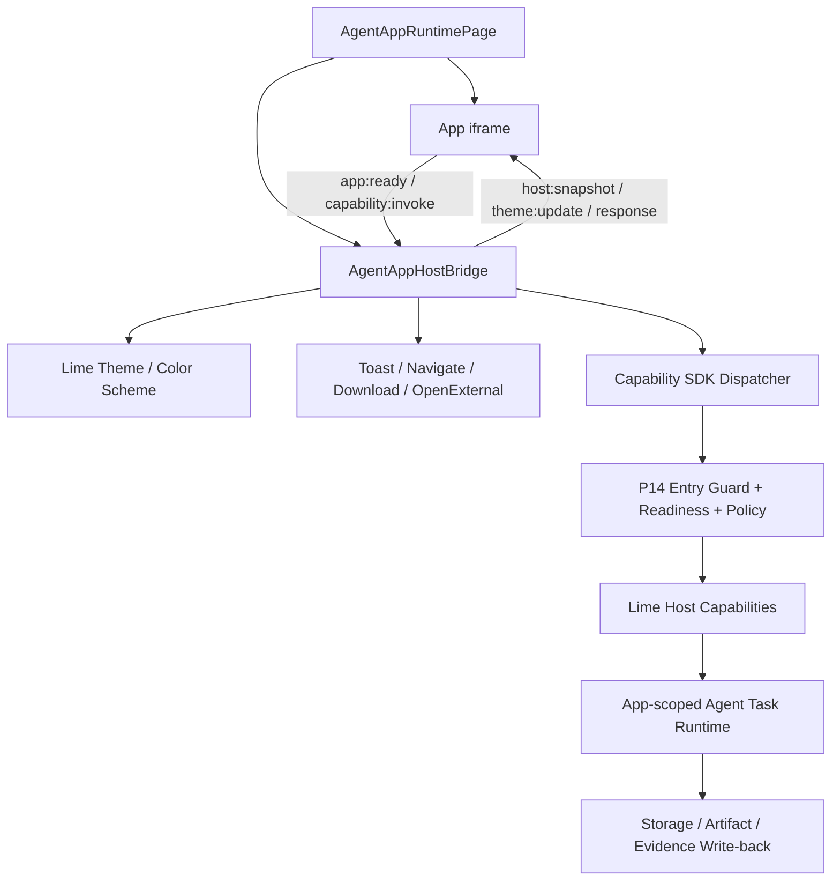

# Agent App P17.4-H Host Bridge Runtime

更新时间：2026-05-16

## 一句话目标

在正式 `agent-apps` runtime surface 中建立标准 Host Bridge：App UI 运行在受控 iframe / sandbox 内，通过 `lime.agentApp.bridge` 与 Lime Host 同步主题、语言、入口上下文、导航、通知、下载和 capability 请求；App 不再拥有私有 `postMessage` 协议，也不能直接访问 Tauri / Node / 宿主 DOM。

P17.4 的产品验收不止“App UI 能打开”。它必须证明用户可在 App 业务界面内启动、观察、取消、重试、确认 Agent task，并把结构化结果写回 App storage / Artifact / Evidence；通用 Chat 不能成为核心流程的强制回跳点。

## 标准来源

上游事实源是 `/Users/coso/Documents/dev/ai/limecloud/agentapp` 的 Agent App v0.3 Host Bridge v1 文档。Lime 客户端只做标准实现，不重新定义协议。

## 范围

| 范围                  | 做                                                                                            | 不做                                                  |
| --------------------- | --------------------------------------------------------------------------------------------- | ----------------------------------------------------- |
| Bridge lifecycle      | iframe load 后推 `host:snapshot`，App `app:ready` 后可重拉。                                  | 不让 App 读取外层 DOM。                               |
| Theme sync            | 订阅 Lime theme / color scheme / system mode，广播 `theme:update`。                           | 不让 App 自己猜 Lime 主题。                           |
| Host actions          | 支持 `host:toast`、`host:navigate`、`host:openExternal`、`host:download` 的受控请求。         | 不开放 raw Tauri / Node API。                         |
| Capability invoke     | 用 `capability:invoke` 承载 SDK 请求，并继续走 readiness / permission / policy。              | 不用 mock 结果伪装真实能力成功。                      |
| Agent task            | 通过 `lime.agent.startTask` / `lime.workflow.start` 在 App 内运行任务、流式事件和结构化结果。 | 不跳转通用 Chat 完成核心工作，不让 App 自建模型网关。 |
| Structured write-back | App 确认后通过 `lime.storage` / `lime.artifacts` / `lime.evidence` 写回业务对象和证据。       | 不让聊天文本成为唯一结果，不要求用户手工复制。        |
| Security              | 校验 `event.source`、`event.origin`、`protocol`、`version`、`appId`、`entryKey`。             | 不接收任意 window 消息。                              |

## 消息信封

```ts
interface LimeAgentAppBridgeMessage {
  protocol: "lime.agentApp.bridge";
  version: 1;
  type: string;
  requestId?: string;
  appId: string;
  entryKey?: string;
  payload?: unknown;
}
```

## 首批事件

Host -> App：

- `host:snapshot`
- `theme:update`
- `host:response`
- `host:error`
- `host:visibility`

App -> Host：

- `app:ready`
- `host:getSnapshot`
- `host:navigate`
- `host:toast`
- `host:openExternal`
- `host:download`
- `capability:invoke`

Agent task 事件通过 `capability:invoke` 的标准请求 / 响应承载，不新增私有协议。`lime.agent.startTask` 返回 `taskId` / `traceId` 后，后续 stream 至少要表达：

- `task:status`
- `task:progress`
- `task:toolCall`
- `task:citation`
- `task:partialArtifact`
- `task:blocked`
- `task:error`
- `task:cancelled`
- `task:completed`

## 主题同步

Host 只发送当前已生效的主题 token，不发送设计推导逻辑：

- `themeMode`
- `effectiveThemeMode`
- `colorSchemeId`
- `--lime-*`
- `--app-*`

App 收到后只写入自身 `document.documentElement.style`，并设置 `data-lime-theme`、`data-lime-theme-effective`、`data-lime-color-scheme`。主题 token 不是业务数据，不进入 App storage、Artifact 或 Evidence。

## 架构图



## 实现边界

| 模块                        | 责任                                                                                                          |
| --------------------------- | ------------------------------------------------------------------------------------------------------------- |
| `AgentAppRuntimePage`       | 持有 iframe ref、runtime origin、selected app / entry，上线 bridge lifecycle。                                |
| `AgentAppHostBridge`        | 构建快照、收发消息、校验来源、派发 Host action。                                                              |
| Appearance helpers          | 读取当前 Lime CSS variables，产出 theme payload。                                                             |
| Capability dispatcher       | 把 `capability:invoke` 转成现有 SDK / adapter 调用或 blocked error。                                          |
| Agent task dispatcher       | 把 `lime.agent.startTask` / stream / cancel / retry 绑定到 App 作用域 task，附加 appId / entryKey / traceId。 |
| Structured write-back guard | 只允许 App 通过声明过的 storage table、artifact type 和 evidence subject 写回。                               |
| App bootstrap               | 内容工厂先作为样板接入 `host-bridge.js`。                                                                     |

## 验收

- 切换 Lime 主题 / 配色后，已打开的 App iframe 内颜色同步变化。
- App 首次打开即收到 `host:snapshot`，刷新 / 慢加载时 `host:getSnapshot` 可补偿。
- 非当前 iframe source、非 runtime origin、错误 protocol / version 的消息被忽略。
- `host:toast` / `host:navigate` 可用；`host:openExternal` / `host:download` 只允许安全 URL。
- 未开放 capability 返回 `host:error`，不写假数据。
- 内容工厂至少一条主链能在 App 内完成 `startTask -> stream -> human review -> storage/artifact/evidence write-back`，不回跳通用 Chat。
- Expert Chat 可以嵌入同一 App 上下文，但不能替代业务页面和 workflow 状态。
- `npm run test:contracts`、受影响前端测试和 GUI smoke 覆盖 runtime bridge 主路径。

## 与 P17.4 的关系

Host Bridge 是 P17.4 Runtime surface production hardening 的前置子项。没有 Host Bridge，App UI 即使能打开，也无法证明主题、语言、导航、下载和能力调用都在 Host policy 下运行。

## 实施拆解

| 阶段    | 交付                                           | 范围                                                                                                  | 验收                                                                                 |
| ------- | ---------------------------------------------- | ----------------------------------------------------------------------------------------------------- | ------------------------------------------------------------------------------------ |
| P17.4.0 | Host Bridge baseline。                         | `hostBridge`、`capabilityDispatcher`、`AgentAppRuntimePage` iframe bridge lifecycle。                 | snapshot / theme / trusted message / host actions / capability invoke 定向测试通过。 |
| P17.4.1 | 已完成：runtime surface guard-before-start。   | `AgentAppRuntimePage` 启动 UI runtime 前先执行 P14 guard。                                            | needs-setup / blocked App 不调用 `agent_app_start_ui_runtime`。                      |
| P17.4.2 | 已完成：Agent task stream contract hardening。 | `lime.agent.startTask / streamTask / getTask / cancelTask / retryTask` 与 Host Bridge response 证据。 | App 内可 start / stream / get / cancel / retry，不回跳通用 Chat。                    |
| P17.4.3 | 已完成：Structured write-back guard。          | storage namespace / artifact kind / evidence subject 写回声明校验。                                   | 未声明 storage / artifact / evidence 写回被拒绝；声明项写回保留 provenance。         |
| P17.4.4 | App bootstrap sample。                         | content factory runtime package / host-bridge.js 样板。                                               | 示例 App 通过标准 bridge 取 snapshot、发 task、写回结果。                            |
| P17.4.5 | 已完成：Security and smoke。                   | hostBridge 安全、RuntimePage UI、schema / contract 回归。                                             | feature island 无直接 Tauri / raw Worker，完整 GUI smoke 已通过。                    |

## 当前下一刀

P17.4 已完成当前 production hardening 闭环：`AgentAppHostBridge`、`capabilityDispatcher`、`AgentAppRuntimePage` 已覆盖 snapshot、theme update、trusted message、host action、safe URL、capability invoke 和结构化错误码透传。P17.4.1 已补 runtime surface guard-before-start。P17.4.2 已补 RuntimePage Host Bridge 层 `startTask -> streamTask -> getTask -> cancelTask -> retryTask` 回归证据。P17.4.3 已补 storage namespace / artifact kind / evidence subject 写回声明 guard。P17.4.4 内容工厂样板已接入 promise-based Host Bridge，并在确认链后完成 `startTask -> streamTask -> storage/artifacts/evidence write-back` 的 App 内证据。P17.4.5 已在健康 DevBridge 下完成完整 GUI smoke。下一刀进入 P17.5 formal entry GUI smoke，仍不能用 Lab smoke 或全局 GUI smoke 替代正式 `agent-apps` 专用证据。

## 2026-05-15 P17.4.1 实施记录

协作分工：

1. 本轮只触碰客户端 runtime surface、对应 UI 回归和本 P17.4 roadmap。
2. 不新增 Tauri command，不改 `src/lib/api/agentApps.ts`，不改变 Cloud / LimeCore control-plane 边界。
3. 不触碰 agentknowledge、上游 `agentapp` 标准仓库或真实 delete-data。

本轮完成内容：

1. `AgentAppRuntimePage` 在调用 `startAgentAppUiRuntime()` 前先构建 installed preview，并执行 `evaluateAgentAppEntryRuntimeGuard()`。
2. guard 输入包含 runtime package load、P14 UI mount operation、accepted permission decision 和 installed state disabled lifecycle。
3. 当 guard 返回 `needs-setup / blocked / denied` 时，页面进入 runtime error 态，不启动 UI runtime、不创建 iframe、不上线 Host Bridge。
4. `AgentAppRuntimePage.test.tsx` 新增 needs-setup 回归，证明 runtime surface 不能绕过 P14 guard 直接打开 App UI。

验证记录：

| 命令 / 证据                                                                                                                                            | 结果                       |
| ------------------------------------------------------------------------------------------------------------------------------------------------------ | -------------------------- |
| `npm run test -- src/features/agent-app/ui/AgentAppRuntimePage.test.tsx src/features/agent-app/runtime/entryRuntimeGuard.test.ts`                      | 通过，2 files / 13 tests。 |
| `rg -n "safeInvoke\|invoke\\(\|tauri::\|generate_handler\|mockPriorityCommands\|defaultMocks\|new Worker\|Worker\\(" src/features/agent-app \|\| true` | 通过，无命中。             |
| `git diff --no-index --check /dev/null <touched-file>`                                                                                                 | 通过，覆盖本轮触碰文件。   |
| `nice -n 10 npm run typecheck`                                                                                                                         | 通过。                     |

未完成：

1. P17.4.3 structured write-back guard 仍未收口声明校验。
2. P17.4.4 content factory runtime package / host-bridge.js bootstrap 样板仍未接入。
3. P17.4.5 security and smoke 仍需补 GUI smoke 或可替代 runtime 证据。

## 2026-05-15 P17.4.2 实施记录（局部）

协作分工：

1. 本轮只认领客户端 Host Bridge runtime 任务流回归，不触碰 `agentknowledge`、Lime Cloud / LimeCore、上游标准仓库或 AgentApp 其他 roadmap 资料。
2. 不新增 Tauri command，不改 `src/lib/api/agentApps.ts`，不改变桌面端 Agent 本地运行边界。
3. P17.4.2 暂不声明完整完成；本轮只证明 App UI 内 start / stream / cancel 可以通过标准 `capability:invoke` 闭环。

本轮完成内容：

1. `AgentAppRuntimePage.test.tsx` 增加 Host Bridge 集成回归，模拟同一 iframe / origin / appId / entryKey 下连续发起 `lime.agent.startTask`、`lime.agent.streamTask`、`lime.agent.cancelTask`。
2. 回归断言 Host 返回 `host:response`，并保留 `taskId`、`traceId`、`status`、`humanReview` 和 `task:cancelled` 事件。
3. 该证据证明内容工厂类 App 不需要回跳通用 Chat，也不需要私有模型网关，就能在 App 业务 UI 内控制 App-scoped Agent task。

验证记录：

| 命令 / 证据                                                                                                                                                                                       | 结果                       |
| ------------------------------------------------------------------------------------------------------------------------------------------------------------------------------------------------- | -------------------------- |
| `nice -n 10 npm run test -- src/features/agent-app/ui/AgentAppRuntimePage.test.tsx src/features/agent-app/runtime/capabilityDispatcher.test.ts src/features/agent-app/runtime/hostBridge.test.ts` | 通过，3 files / 18 tests。 |

未完成：

1. `getTask` 当时仍只在 dispatcher / adapter 层有能力，尚未补 RuntimePage Host Bridge 集成证据；已在 2026-05-16 记录中补齐。
2. `retry` 语义当时尚未进入 SDK / dispatcher / Host Bridge 明确契约；已在 2026-05-16 记录中补齐。
3. P17.4.3 structured write-back guard 仍未开始。

## 2026-05-16 P17.4.2 实施记录（完成）

协作分工：

1. 本轮只认领 P17.4.2 Host Bridge task contract，不触碰 AgentApp 其他 roadmap 总纲资料、`agentknowledge`、Lime Cloud / LimeCore 或上游标准仓库。
2. 不新增 Tauri command，不改 `src/lib/api/agentApps.ts`，不绕过 `src/features/agent-app` feature island。
3. retry 语义先做 SDK / adapter / mock / dispatcher / Host Bridge response 的最小闭环，不提前做真实模型重试、成本策略或后台队列。

本轮完成内容：

1. `LimeAgentCapability` 增加 `retryTask(taskId)`；`AgentAppTaskRecord` 增加 `retryOfTaskId` 和 `retryAttempt`，用于在 App 内审计重试来源。
2. `buildRetryAgentAppTaskRecord()` 统一复用源任务的 title、prompt、taskKind、input、expectedOutput、knowledge、tools、files、secrets 和 humanReview，并生成新的 retry idempotency key。
3. `AdapterCapabilityHost` 和 `MockCapabilityHost` 支持 `retryTask`，缺失任务返回 `TASK_NOT_FOUND`，成功时创建新的 App-scoped running task。
4. `capabilityDispatcher` 支持 `lime.agent.retryTask`，继续只通过 Host Capability SDK 路径调用，不新增私有 bridge method。
5. `AgentAppRuntimePage.test.tsx` 的 Host Bridge 集成回归覆盖 `startTask -> streamTask -> getTask -> cancelTask -> retryTask`，证明 App UI 可在同一 iframe / origin / appId / entryKey 内管理 Agent task。

验证记录：

| 命令 / 证据                                                                                                                                                                                                                                                                                                           | 结果                          |
| --------------------------------------------------------------------------------------------------------------------------------------------------------------------------------------------------------------------------------------------------------------------------------------------------------------------- | ----------------------------- |
| `nice -n 10 npm run test -- src/features/agent-app/runtime/capabilityDispatcher.test.ts src/features/agent-app/runtime/hostBridge.test.ts src/features/agent-app/adapters/AdapterCapabilityHost.test.ts src/features/agent-app/sdk/MockCapabilityHost.test.ts src/features/agent-app/ui/AgentAppRuntimePage.test.tsx` | 通过，5 files / 30 tests。    |
| `rg -n "safeInvoke\|invoke\\(\|tauri::\|generate_handler\|mockPriorityCommands\|defaultMocks\|new Worker\|Worker\\(" src/features/agent-app \|\| true`                                                                                                                                                                | 通过，无命中。                |
| touched-file whitespace check                                                                                                                                                                                                                                                                                         | 通过，覆盖 P17.4.2 触碰文件。 |
| `nice -n 10 npm run typecheck`                                                                                                                                                                                                                                                                                        | 通过。                        |

未完成：

1. P17.4.3 structured write-back guard 仍未开始。
2. P17.4.4 content factory runtime package / host-bridge.js bootstrap 样板仍未接入。
3. P17.4.5 security and smoke 仍需补 runtime bridge 主路径 smoke 或可替代证据。

## 2026-05-16 P17.4.4 实施记录（完成）

协作分工：

1. 本轮只认领内容工厂 App bootstrap 和 Host Bridge request / response 样板，不触碰 SceneApp 清理、安装生命周期和 Cloud / LimeCore 控制面。
2. 内容工厂继续保持非技术用户界面；Host 同步发生在用户确认链后，不把业务主链回跳到通用 Chat。
3. 不新增私有 postMessage 协议，不新增 Tauri command，不绕过 Host capability readiness。

本轮完成内容：

1. `content-factory-app/src/ui/host-bridge.js` 新增 requestId / pending request 管理，处理 `host:response` 与 `host:error`，并暴露 `invokeCapability`、`startHostTask`、`streamHostTask`、`cancelHostTask`、`syncHostConfirmation`。
2. `content-factory-app/src/ui/app.js` 在 `confirmCurrentStep()` 成功后调用 Host Bridge，同步执行 `lime.agent.startTask -> lime.agent.streamTask -> lime.storage.set -> lime.artifacts.create -> lime.evidence.record`。
3. 内容工厂写回 artifact kind 映射到 APP.md 已声明类型：`knowledge_pack`、`content_batch`、`strategy_report`、`review_report`，样板不写入未声明 `content_factory_asset_pack`。
4. `dist/ui/host-bridge.js` 与 `dist/ui/app.js` 已通过 `npm run build` 重新生成。
5. `AgentAppHostBridge` 对 dispatcher 的结构化错误 `code` 做透传，App 侧不再只能收到泛化 `HOST_ACTION_FAILED`。

验证记录：

| 命令 / 证据                                                                                                                                                                                                                                                                      | 结果                                                                                                                                         |
| -------------------------------------------------------------------------------------------------------------------------------------------------------------------------------------------------------------------------------------------------------------------------------- | -------------------------------------------------------------------------------------------------------------------------------------------- |
| `/Users/coso/Documents/dev/ai/limecloud/content-factory-app: npm run verify`                                                                                                                                                                                                     | 通过，build、41 tests、validate、readiness 均 OK；readiness 在未绑定 host setup 时保持 `needs-setup`。                                       |
| `npx eslint "src/features/agent-app/runtime/hostBridge.ts" "src/features/agent-app/runtime/hostBridge.test.ts" "src/features/agent-app/ui/AgentAppRuntimePage.tsx" "src/features/agent-app/ui/AgentAppRuntimePage.test.tsx" "src/features/experts/expertAgentInstances.test.ts"` | 通过。                                                                                                                                       |
| `npx vitest run "src/features/agent-app/runtime/hostBridge.test.ts" "src/features/agent-app/runtime/capabilityDispatcher.test.ts" "src/features/agent-app/ui/AgentAppRuntimePage.test.tsx" "src/features/experts/expertAgentInstances.test.ts"`                                  | 通过，4 files / 23 tests。                                                                                                                   |
| `npm run typecheck`                                                                                                                                                                                                                                                              | 通过。                                                                                                                                       |
| `npm run test:contracts`                                                                                                                                                                                                                                                         | 通过，command / harness / modality / cleanup contracts 均 OK。                                                                               |
| `npm run verify:gui-smoke -- --reuse-running --timeout-ms 300000`                                                                                                                                                                                                                | 通过，DevBridge、workspace、browser runtime、site adapters、agent runtime tool surface、chat streaming、knowledge GUI、design canvas 均 OK。 |

未完成：

1. P17.4.3 的 Host 侧 artifact / evidence 声明级拒绝负例在当时仍未补齐；已在 2026-05-16 P17.4.3 记录中补齐。

## 2026-05-16 P17.4.3 实施记录（完成）

协作分工：

1. 本轮只认领客户端 Host 侧 structured write-back guard，不触碰上游 `content-factory-app`、Lime Cloud / LimeCore 或其他 AgentApp roadmap 总纲资料。
2. 不新增 Tauri command，不改 `src/lib/api/agentApps.ts`，App UI 仍只能通过 `capability:invoke` 进入 Host Capability SDK。
3. storage 暂按 manifest storage namespace 约束，不扩展到表级 schema 校验；artifact / evidence 做声明级强制校验。

本轮完成内容：

1. `createAgentAppCapabilityDispatcher()` 增加 `projection` 输入，生产路径由 `AgentAppRuntimePage` 传入当前 installed App projection。
2. `lime.storage.set/delete` 写回前要求 manifest 声明 storage namespace；没有 storage 声明时返回 `WRITEBACK_NOT_DECLARED`。
3. `lime.artifacts.create` 写回前校验 `input.kind` 必须命中 `projection.artifactTypes[].key`，未声明 artifact kind 返回 `WRITEBACK_NOT_DECLARED`。
4. `lime.evidence.record` 写回前校验 `input.kind` 必须命中 `projection.evals[].key`，未声明 evidence subject 返回 `WRITEBACK_NOT_DECLARED`。
5. RuntimePage Host Bridge 集成回归覆盖声明内 artifact / evidence 写回成功，以及未声明 artifact / evidence 被 `host:error` 以结构化错误码拒绝。

验证记录：

| 命令 / 证据                                                                                                                                                                                                                                                                                                           | 结果                          |
| --------------------------------------------------------------------------------------------------------------------------------------------------------------------------------------------------------------------------------------------------------------------------------------------------------------------- | ----------------------------- |
| `nice -n 10 npm run test -- src/features/agent-app/runtime/capabilityDispatcher.test.ts src/features/agent-app/runtime/hostBridge.test.ts src/features/agent-app/adapters/AdapterCapabilityHost.test.ts src/features/agent-app/sdk/MockCapabilityHost.test.ts src/features/agent-app/ui/AgentAppRuntimePage.test.tsx` | 通过，5 files / 32 tests。    |
| `rg -n "safeInvoke\|invoke\\(\|tauri::\|generate_handler\|mockPriorityCommands\|defaultMocks\|new Worker\|Worker\\(" src/features/agent-app \|\| true`                                                                                                                                                                | 通过，无命中。                |
| touched-file whitespace check                                                                                                                                                                                                                                                                                         | 通过，覆盖 P17.4.3 触碰文件。 |
| `nice -n 10 npm run typecheck`                                                                                                                                                                                                                                                                                        | 通过。                        |

未完成：

1. P17.4.5 security and smoke 仍需结合最新 write-back guard 复核 feature island 边界、contracts、typecheck 和 runtime smoke。
2. 上游内容工厂若继续使用 `content_factory_confirmation` 作为 evidence kind，需要在 APP.md 中声明对应 eval，或改用已声明 eval key；本轮不跨仓库改样板。

## 2026-05-16 P17.4.5 验证记录（阻塞）

协作分工：

1. 本轮只做验证收口，不新增 Agent App runtime 功能。
2. 不结束或重启隔壁正在运行的 Tauri / Cargo 任务，避免破坏并行工作。
3. P17.4.5 暂不标记完成，直到 GUI smoke 在健康 DevBridge 下完整通过。

已完成验证：

| 命令 / 证据                                                                                                                        | 结果                                                                                                                                                                                              |
| ---------------------------------------------------------------------------------------------------------------------------------- | ------------------------------------------------------------------------------------------------------------------------------------------------------------------------------------------------- |
| `nice -n 10 npm run test:contracts`                                                                                                | 通过，command / harness / modality / cleanup contracts 均 OK。                                                                                                                                    |
| `nice -n 10 npm run smoke:agent-service-skill-entry`                                                                               | 通过，Skill Forge 前端 metadata、8 个 Rust 定向测试、服务技能入口路由、Agent 对话 A2UI 挂起主链均通过，并生成 `.lime/qc/skill-forge-runtime-transcript-current.json`。                            |
| `nice -n 10 npm run verify:gui-smoke -- --reuse-running --timeout-ms 300000`                                                       | 未通过：第一次在 `smoke:agent-service-skill-entry` 因 Cargo artifact lock / 编译超时；第二次在 `smoke:claw-chat-ready-streaming` 阶段出现 provider detail `fetch failed`，随后 DevBridge 不可用。 |
| `nice -n 10 npm run verify:gui-smoke -- --timeout-ms 300000`                                                                       | 未通过：检测到已有前端 dev server，尝试拉起独立 headless Tauri；Rust 编译完成后 headless Tauri 父进程 exitCode=0，但 DevBridge 在 30s 内仍未就绪。                                                |
| `curl http://127.0.0.1:3030/health` / `lsof -nP -iTCP:3030 -sTCP:LISTEN` / `lsof -nP -iTCP:1420 -sTCP:LISTEN` / `ps ... tauri dev` | 3030 无监听，1420 前端仍在；存在外部 `pnpm run tauri dev` 进程但没有健康 DevBridge 后端。                                                                                                         |
| `rg -n "port\|3030\|1420\|health-url\|invoke-url" scripts/verify-gui-smoke.mjs src-tauri`                                          | 已确认 smoke 脚本可替换 health / invoke URL，但当前 DevBridge 端口仍由 Tauri 后端固定为 3030；没有不碰现有 Tauri dev 的隔离端口路径。                                                             |

阻塞判断：

1. 最新 Host Bridge / dispatcher 代码层验证已通过，但 GUI smoke 不能作为 P17.4.5 完成证据。
2. 当前 blocker 是运行环境：已有 Tauri dev / single-instance 状态不健康，且本轮不应擅自结束隔壁进程。
3. 下一步需要在确认可重启现有 Tauri dev 后，重新执行 `npm run verify:gui-smoke -- --timeout-ms 300000`；通过后才能把 P17.4.5 标为完成。

## 2026-05-16 P17.4.5 复测记录（仍阻塞）

协作分工：

1. 本轮只复用现有运行会话，不杀进程、不重启 Tauri / Vite / Cargo。
2. 只验证 P17.4.5 smoke 缺口，不新增 runtime 功能。
3. 发现隔壁仍有 Vitest / Tauri 相关任务时，继续保持阻塞记录，不抢占运行环境。

复测前状态：

| 命令 / 证据 | 结果 |
|---|---|
| `curl -fsS http://127.0.0.1:3030/health` | 通过，返回 `{"service":"DevBridge","status":"ok","version":"1.0.0"}`。 |
| `lsof -nP -iTCP:3030 -sTCP:LISTEN` | `target/debug/lime` 正在监听 3030。 |
| `lsof -nP -iTCP:1420 -sTCP:LISTEN` | Vite dev server 正在监听 1420。 |

复测结果：

| 命令 / 证据 | 结果 |
|---|---|
| `nice -n 10 npm run verify:gui-smoke -- --reuse-running --timeout-ms 300000` | 未通过：脚本选择复用已运行 headless Tauri，但 `bridge:health` 持续 `fetch failed`，300s 后超时。 |
| `curl -fsS http://127.0.0.1:3030/health` | 复测后失败，3030 无法连接。 |
| `lsof -nP -iTCP:3030 -sTCP:LISTEN` | 复测后无监听。 |
| `lsof -nP -iTCP:1420 -sTCP:LISTEN` | 复测后 1420 仍由 Vite dev server 监听。 |
| `ps ... tauri / vite / cargo / vitest` | 仍存在外部 `pnpm run tauri dev`、Vite dev server 与 Vitest 任务；本轮未结束这些进程。 |

阻塞判断：

1. P17.4.5 仍不能标记完成；完整 GUI smoke 没有通过。
2. 失败点仍是 DevBridge 运行环境，而不是 Host Bridge / dispatcher 的新增代码层断言。
3. 下一步仍需要在确认可接管运行环境后，重启到健康 Tauri / DevBridge 会话，再执行完整 `npm run verify:gui-smoke -- --timeout-ms 300000`。

## 2026-05-16 P17.4.5 复测记录（完成）

协作分工：

1. 等隔壁 Vitest 任务结束后再复测，避免争抢 Cargo / Vitest 资源。
2. 继续复用现有 headless Tauri / DevBridge 会话，不杀进程、不手动重启。
3. 本轮只收口 P17.4.5 验证，不新增 runtime 功能、不改 Cloud / LimeCore。

复测前状态：

| 命令 / 证据 | 结果 |
|---|---|
| `ps ... vitest / tauri / vite` | 隔壁 Vitest 已结束，仅保留现有 Tauri / Vite 会话。 |
| `curl -fsS http://127.0.0.1:3030/health` | 通过，返回 `{"service":"DevBridge","status":"ok","version":"1.0.0"}`。 |
| `lsof -nP -iTCP:3030 -sTCP:LISTEN` | `target/debug/lime` 正在监听 3030。 |

验证记录：

| 命令 / 证据 | 结果 |
|---|---|
| `nice -n 10 npm run verify:gui-smoke -- --reuse-running --timeout-ms 300000` | 通过。 |

覆盖范围：

1. `smoke:workspace-ready` 通过。
2. `smoke:browser-runtime` 通过。
3. `smoke:site-adapters` 通过。
4. `smoke:agent-service-skill-entry` 通过。
5. `smoke:agent-runtime-tool-surface` 通过。
6. `smoke:agent-runtime-tool-surface-page` 通过。
7. `smoke:at-command-registry` 通过。
8. `smoke:claw-chat-ready-streaming` 通过。
9. `smoke:knowledge-gui` 通过，i18n Patch metrics 为 `no-hit`。
10. `smoke:design-canvas` 通过。

结论：

1. P17.4.5 已完成；完整 GUI smoke 通过，可以把 P17.4 runtime surface production hardening 标记为当前闭环完成。
2. P17.5 仍未开始；下一刀需要新增或扩展正式 `agent-apps` 专用 smoke，覆盖 install / registration / launch / disable / uninstall rehearsal / runtime surface / flag-off。
3. P17.5 之前仍不得发布 marketplace、Cloud 管理台或真实 delete-data。
