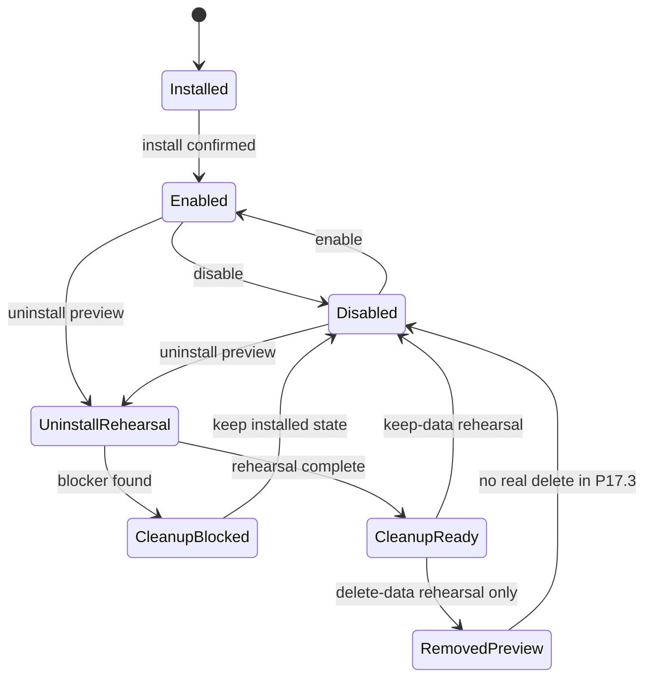
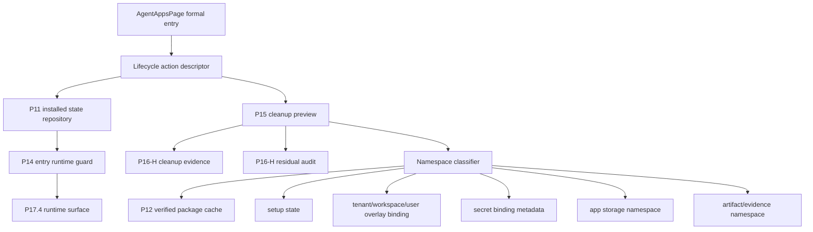
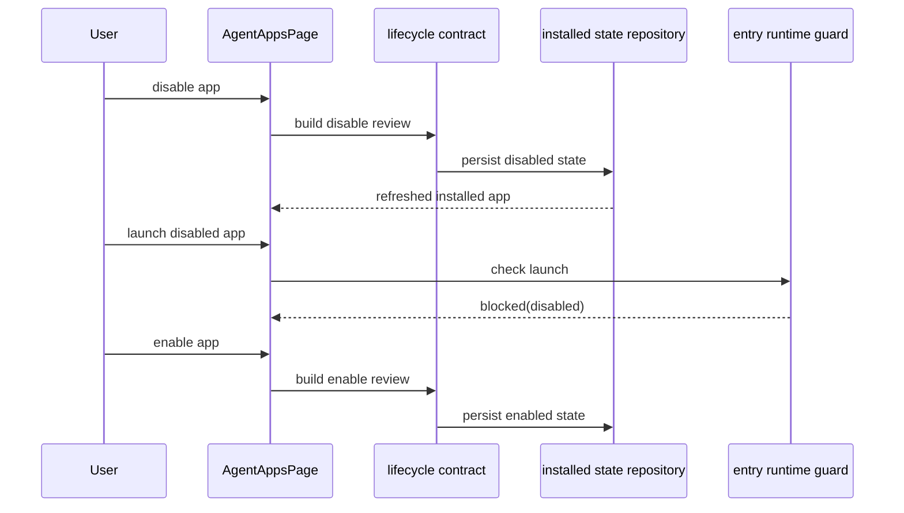
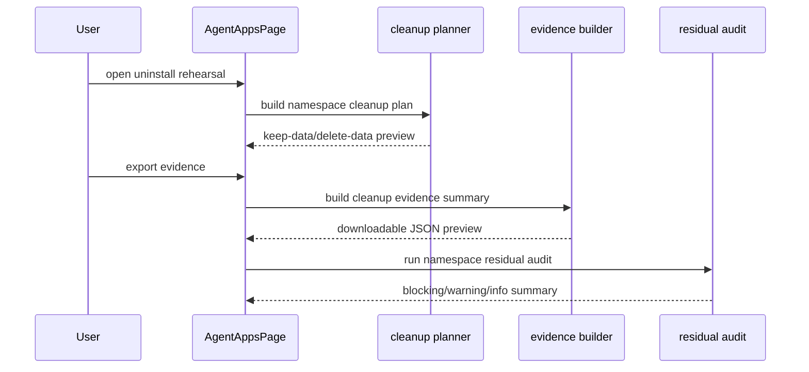
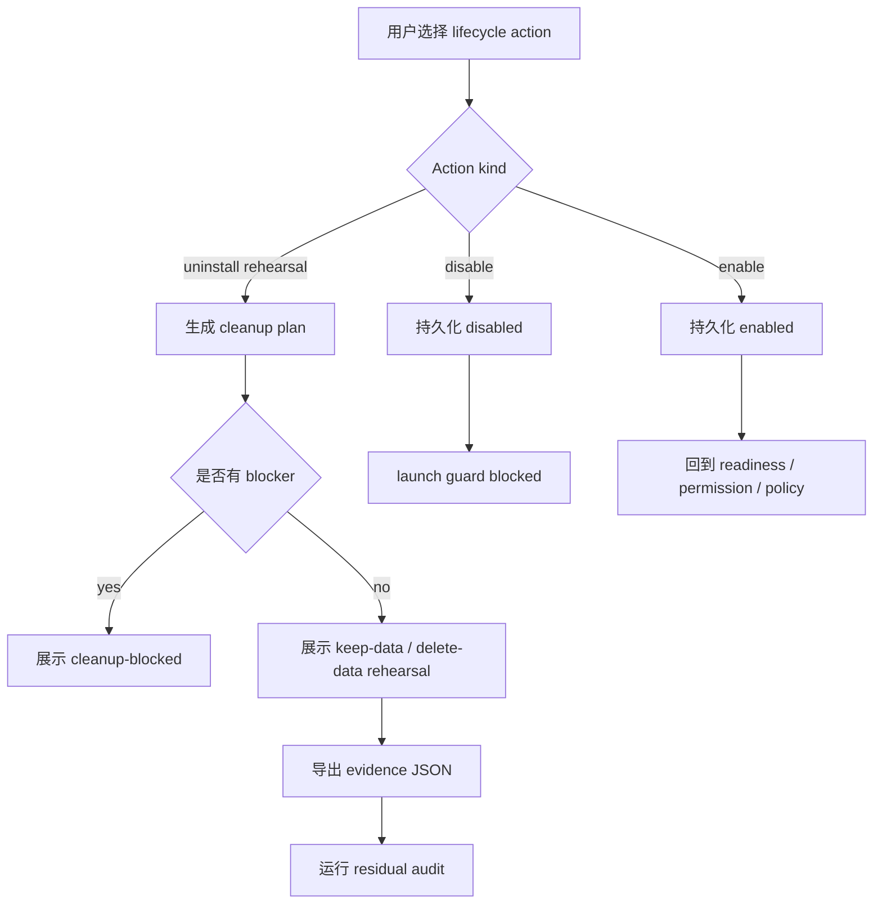

# P17.3 Lifecycle / Cleanup Contract Hardening

更新时间：2026-05-15

## 一句话结论

P17.3 的目标不是做真实卸载器、市场页或 Cloud 管理台，而是在 P17.2 source / install / schema contract 已完成后，把正式 `agent-apps` 入口的生命周期、失败退出、清理演练、残留审计和 namespace 归属固定成可测试契约。

P17.3 结束后，用户在正式入口里应该能明确知道：一个 App 是否已启用、能否启动、卸载会影响哪些本地 namespace、哪些数据会保留、哪些清理动作只是 rehearsal、失败后如何恢复，以及 Cloud / LimeCore 不会接管本地删除或运行时状态。

## 背景

P17.2 已完成以下主链：

1. `agent-apps` 正式入口不再直接使用 Lab fixture 作为安装证据。
2. local / cloud 安装都先生成 install review，用户确认后才写入 P11 installed state repository。
3. Cloud release metadata 已落成 release descriptor，缺少 verified package source 会被 blocker 阻断。
4. `packageUrl` fetch / staging / manifest extraction 已通过 `agent_app_fetch_cloud_package` 集中命令进入 P12 verified cache。
5. P17.2.5 已用上游 public schema、reference CLI 和标准 `content-factory-app` 示例包做 projection / readiness / review descriptor cross-check。

剩余问题不是“能不能装”，而是“装上之后怎么失败、停用、卸载、清理、审计且不留下不可解释状态”。如果这一层没有契约，后续 P17.4 runtime surface production hardening 会被迫同时解决 lifecycle、storage、overlay、secret、evidence 和 runtime package 多个问题，成本和风险都会放大。

## 目标

1. 固定正式入口生命周期状态：`enabled / disabled / uninstall-rehearsal / cleanup-blocked / residual-warning` 等状态必须来自同一 installed state / cleanup contract。
2. 保证 disabled App 不能被 `agent-apps` 启动，也不能被 runtime surface 通过 fallback 绕过。
3. 复用 P15 cleanup preview 与 P16-H residual audit，不新增第二套 scanner、repository 或 evidence store。
4. 把 package code、setup state、overlay、secret binding、artifact、evidence、app storage 分成可解释 namespace。
5. 支持 keep-data uninstall rehearsal 和 delete-data rehearsal，但本阶段仍不执行真实 delete-data。
6. 为 P17.4 提供前置条件：runtime 只需要相信 lifecycle contract，不再自己判断禁用、残留或清理状态。

## 非目标

- 不发布 marketplace。
- 不做 Cloud 管理台。
- 不做真实 delete-data。
- 不做完整行业内容系统。
- 不把 `agent-app-lab` 的 smoke 当正式入口证据。
- 不让 App 直接调用 Lime internal store、Tauri command 或 raw Worker。
- 不解决 P17.4 runtime production hardening；P17.4 只在 P17.3 状态契约稳定后继续。

## 客户端 / 服务端边界

| 边界 | P17.3 客户端职责 | 非客户端职责 |
|---|---|---|
| Lifecycle | 持久化 enable / disable、uninstall rehearsal、cleanup review、residual audit summary。 | Cloud 不远程修改本地 lifecycle state。 |
| Cleanup | 生成 namespace 级 cleanup plan、export-before-delete preview、evidence。 | Cloud 不执行本地文件删除。 |
| Package | 复用 P12 verified cache 和 P17.2 release descriptor。 | P17.3 不重新下载或重验 package。 |
| Overlay / setup | 只记录绑定与清理归属，不把 overlay 写入 package hash。 | LimeCore 只提供 tenant / release metadata，不保管用户 overlay 值。 |
| Secret binding | 只记录 binding key / provider / scope，不导出 secret value。 | 不把 secret 明文写入 evidence。 |
| Runtime | 只消费 lifecycle allow / block 结果。 | P17.3 不启动生产 runtime hardening。 |

## 当前事实源分类

| 分类 | 对象 | P17.3 规则 |
|---|---|---|
| current | `src/features/agent-app/install/*` | installed state、setup state、cleanup preview、package cache、install review 的客户端事实源。 |
| current | `src/lib/api/agentApps.ts` | 允许集中调用 Tauri command 的 API gateway；feature island 不直接 `safeInvoke` / `invoke`。 |
| current | `src/features/agent-app/ui/AgentAppsPage.tsx` | 正式用户入口，展示 lifecycle / cleanup review / residual audit。 |
| current | `src/features/agent-app/runtime/entryRuntimeGuard.ts` | 启动前唯一 guard；P17.3 要让它消费 disabled / cleanup-blocked 状态。 |
| current | `docs/roadmap/agentapp/p17-lifecycle-cleanup-contract-hardening.md` | P17.3 当前执行计划。 |
| reference | `docs/roadmap/agentapp/p17-source-install-contract-hardening.md` | P17.2 source / install / schema 已完成记录。 |
| reference | `/Users/coso/Documents/dev/ai/limecloud/agentapp` | 标准、public schema、reference CLI 和示例包。 |
| reference | `/Users/coso/Documents/dev/ai/limecloud/limecore/docs/roadmap/agentapp` | 服务端 control-plane；不写客户端 runtime / cleanup 实现。 |
| compat | `agent-app-lab` lifecycle / cleanup panel | 仍可作为研发验证入口，但不能作为正式入口验收证据。 |
| dead | `SceneApp` / `contentEngineering*` / `sceneapp_*` | 不恢复、不迁移、不兼容。 |

## 用户故事

| ID | 用户故事 | 验收要点 |
|---|---|---|
| P17.3-US1 | 作为用户，我能在正式 App 列表里禁用某个 App。 | disabled 状态持久化；刷新后仍禁用；启动按钮不可用；runtime guard 返回 blocked。 |
| P17.3-US2 | 作为用户，我能重新启用被禁用的 App。 | enabled 状态持久化；readiness / setup 重新参与启动判断；不重新安装 package。 |
| P17.3-US3 | 作为用户，我能在卸载前看到会清理哪些数据。 | cleanup rehearsal 列出 package cache、setup state、overlay binding、storage、artifact、evidence；不执行真实删除。 |
| P17.3-US4 | 作为用户，我能选择保留数据卸载演练。 | keep-data rehearsal 只标记 package / lifecycle action；storage / artifact / evidence 保留原因清晰。 |
| P17.3-US5 | 作为维护者，我能导出 cleanup evidence。 | evidence 不含 secret value；包含 appId、version、namespace、action、blocked reason、timestamp。 |
| P17.3-US6 | 作为维护者，我能看到 residual audit。 | audit 只检查 Agent App namespace；残留按 blocking / warning / informational 分类。 |
| P17.3-US7 | 作为开发者，我能证明 App 无法绕过 lifecycle。 | `src/features/agent-app` 无直接 Tauri / raw Worker；launch 必经 P14 guard 和 P17.3 lifecycle gate。 |

## 状态模型



状态口径：

- `Enabled`：允许进入 P14 guard，但仍需 readiness / permission / policy 通过。
- `Disabled`：不能启动；不删除 package 或数据。
- `UninstallRehearsal`：只生成预览与 evidence，不删除。
- `CleanupBlocked`：存在不可解释 namespace、secret value 泄露风险或 hash / identity 不匹配。
- `CleanupReady`：清理计划可解释，但 P17.3 仍不真实执行 delete-data。
- `RemovedPreview`：只表示 rehearsal 结果，不能从 repository 删除真实 installed state。

## 架构图



## 时序图

### Disable / Enable



### Uninstall Rehearsal



## 流程图



## 用例

### UC1：禁用后启动被阻断

1. 用户在 `agent-apps` 中点击禁用。
2. 系统生成 disable review，写回 installed state。
3. 页面刷新后 App 显示 disabled。
4. 用户尝试启动，P14 guard 读取 disabled 状态并返回 blocker。
5. 验收：不会进入 runtime surface，不会启动 App UI。

### UC2：保留数据卸载演练

1. 用户选择 uninstall rehearsal。
2. 系统生成 cleanup plan，列出 package cache、setup state、overlay binding、storage、artifact、evidence。
3. 用户选择 keep-data rehearsal。
4. 系统导出 evidence，但不删除 installed state 或 namespace 数据。
5. 验收：evidence 能说明哪些数据保留及原因。

### UC3：delete-data 演练发现 blocker

1. 用户选择 delete-data rehearsal。
2. cleanup planner 发现 secret binding 含不可导出 value 或 namespace 不可归属。
3. 页面显示 cleanup-blocked。
4. residual audit 输出 blocking issue。
5. 验收：不执行真实删除，不把 App 从 repository 移除。

## 实施拆解

| 阶段 | 交付 | 范围 | 验收 |
|---|---|---|---|
| P17.3.0 | 计划收口。 | README、implementation plan、P17 contract、P17 source doc。 | current 文档下一刀统一指向 P17.3，不再指向 P17.2.5。 |
| P17.3.1 | 已完成最小实现：Lifecycle action descriptor。 | `install/lifecycleAction.ts` 纯函数：disable / enable / uninstall rehearsal descriptor；`agent_app_uninstall` 收口为 rehearsal-only。 | 单测覆盖 enabled / disabled / out-of-scope blocker / no-op；mock 与 Rust 命令均不执行真实删除。 |
| P17.3.2 | 已完成最小实现：Formal page lifecycle UI。 | `AgentAppsPage` disable / enable / uninstall preview / confirm / launch flow 消费 lifecycle descriptor。 | UI test 覆盖 disable、enable、disabled launch blocked。 |
| P17.3.3 | 已完成最小实现：Cleanup namespace classifier。 | 复用 cleanup plan，补 package / setup / overlay / secret / storage / artifact / evidence 分类。 | 单测覆盖 keep-data 与 delete-data rehearsal 差异。 |
| P17.3.4 | 已完成最小实现：Evidence export / residual audit formalize。 | 复用 P16-H evidence / audit，正式入口展示 JSON preview。 | evidence 不含 secret value；audit 只查 Agent App namespace。 |
| P17.3.5 | 已完成最小实现：Guard integration。 | P14 guard 消费 lifecycle disabled / cleanup-blocked。 | disabled / cleanup-blocked 都不能启动；enabled 仍走 readiness。 |
| P17.3.6 | 已完成：Boundary and regression。 | feature island boundary rg、UI tests、schema cross-check 回归。 | 不新增 Tauri command；不直接 `safeInvoke`；P17.2.5 cross-check 继续通过。 |

## 验收标准

1. 禁用状态持久化，刷新后仍禁用。
2. disabled / cleanup-blocked App 无法从正式入口启动。
3. enable 不重新安装 package、不改 package hash。
4. uninstall rehearsal 不执行真实 delete-data。
5. cleanup evidence 不含 secret value，不写入 App package。
6. residual audit 只检查 Agent App namespace，不扫描全局用户目录。
7. keep-data 与 delete-data rehearsal 的数据影响可解释。
8. `agent-app-lab` 仍只是研发验证入口，不能替代正式入口证据。
9. `src/features/agent-app` 不直接 `safeInvoke` / `invoke` / Tauri command / raw Worker。
10. Cloud / LimeCore 不运行 Agent、不渲染 UI、不接管本地 storage 或 delete-data。

## 最小验证

P17.3 文档收口：

```bash
rg -n "P17\\.2\\.5|P17\\.3" docs/roadmap/agentapp
git diff --check -- docs/roadmap/agentapp
```

P17.3 实现后至少执行：

```bash
npm run test -- src/features/agent-app/install/cleanupPlan.test.ts src/features/agent-app/install/cleanupResidualAudit.test.ts src/features/agent-app/install/cleanupRehearsalEvidence.test.ts
npm run test -- src/features/agent-app/ui/AgentAppsPage.test.tsx src/features/agent-app/ui/AgentAppRuntimePage.test.tsx
npm run test -- src/features/agent-app/schema/referenceCliCrossCheck.test.ts
rg -n "safeInvoke|invoke\(|tauri::|generate_handler|mockPriorityCommands|defaultMocks|new Worker|Worker\(" src/features/agent-app || true
git diff --check -- docs/roadmap/agentapp src/features/agent-app src/lib/api/agentApps.ts
```

如改动 Tauri command / bridge，必须追加：

```bash
npm run test:contracts
```

P17.3 不要求 `verify:gui-smoke` 全量通过；若改动正式入口 GUI 主路径，则至少补 `AgentAppsPage` / `AgentAppRuntimePage` 定向 UI 测试。P17.5 才新增正式入口 smoke，不能用 Lab smoke 冒充。

## 当前下一刀

P17.3.0 到 P17.3.6 已完成阶段闭环：lifecycle descriptor、正式页面 UI、cleanup namespace classifier、evidence / residual audit、guard integration 与 boundary regression 均已收口。下一刀进入 P17.4 runtime surface production hardening：继续只做客户端 runtime surface，不碰真实删除、不新增 Cloud Agent、不改 LimeCore control-plane 职责。

## 2026-05-15 P17.3.1 实施记录

本轮完成内容：

1. 新增 `src/features/agent-app/install/lifecycleAction.ts`，作为 P17.3 lifecycle action descriptor 的纯函数事实源。
2. `buildAgentAppLifecycleToggleDescriptor()` 生成 disable / enable request，并能识别 no-op。
3. `buildAgentAppLifecycleUninstallRehearsalDescriptor()` 复用 cleanup evidence 与 residual audit，固定 `realDeleteAllowed: false` 和 `completionEffect: rehearsal-only`。
4. `buildAgentAppLifecycleLaunchGate()` 明确 disabled App 的启动阻断语义，为后续 P14 guard 接线做准备。
5. `agent_app_uninstall` Rust 命令与浏览器 mock 已收口为 rehearsal-only：返回演练摘要和 installed list，但不删除 installed state、不删除本地文件 / 目录。
6. `docs/aiprompts/commands.md` 已补 Agent App uninstall 命令边界：P17.3 之前禁止真实 delete-data。

验证记录：

| 命令 / 证据 | 结果 |
|---|---|
| `npm run test -- src/features/agent-app/install/lifecycleAction.test.ts src/lib/tauri-mock/core.test.ts src/features/agent-app/ui/AgentAppsPage.test.tsx` | 通过，3 files / 36 tests。 |

当时未完成：

1. P17.3.2 formal page lifecycle UI 仍未消费 descriptor；当前页面已有 disable / enable / rehearsal 操作，但还没把 descriptor 作为统一 view model。该项已在后续 P17.3.2 记录中收口。
2. P17.3.5 guard integration 仍未完成；`buildAgentAppLifecycleLaunchGate()` 已新增，但 P14 guard 尚未直接消费。
3. P17.4 runtime production hardening 与 P17.5 formal smoke 仍保持后续。

## 2026-05-15 P17.3.2 实施记录

协作分工：

1. 本轮只触碰客户端正式入口 `AgentAppsPage`、对应 UI 回归和本 P17.3 roadmap 记录。
2. 不触碰 `/Users/coso/Documents/dev/ai/limecloud/limecore`、`agentknowledge`、Cloud control-plane 文档和上游 `agentapp` 标准仓库。
3. 不继续改 Tauri command / mock / API gateway；P17.3.1 已完成的 rehearsal-only 命令边界保持原样。

本轮完成内容：

1. `AgentAppsPage` 的 disable / enable 操作改为先生成 `buildAgentAppLifecycleToggleDescriptor()`，再把 descriptor request 交给 `setAgentAppDisabled()`；no-op 不再触发持久化请求。
2. uninstall preview 改为先用 installed state 构建 cleanup plan，再生成 `buildAgentAppLifecycleUninstallRehearsalDescriptor()`；blocked descriptor 不继续调用远端 preview。
3. uninstall confirm 改为复用 preview 阶段生成的 descriptor request，保持 P17.3 `rehearsal-only` 语义，不从页面散拼请求。
4. 正式入口 launch 改为先经过 `buildAgentAppLifecycleLaunchGate()`；disabled App 即使从导航参数触发自动启动，也不会进入 runtime surface。
5. UI 回归补充 disabled 自动启动阻断断言，并把 disable / enable 请求断言扩展到 descriptor 生成的 `updatedAt`。

验证记录：

| 命令 / 证据 | 结果 |
|---|---|
| `npm run test -- src/features/agent-app/install/lifecycleAction.test.ts src/features/agent-app/ui/AgentAppsPage.test.tsx` | 通过，2 files / 16 tests。 |
| `rg -n "safeInvoke\|invoke\\(\|tauri::\|generate_handler\|mockPriorityCommands\|defaultMocks\|new Worker\|Worker\\(" src/features/agent-app \|\| true` | 通过，无命中。 |
| `git diff --no-index --check /dev/null <touched-file>` | 通过，覆盖本轮触碰的 roadmap、`AgentAppsPage.tsx`、`AgentAppsPage.test.tsx`。 |
| `npm run typecheck` | 未完成；运行约 3 分钟仍在编译，为避免与隔壁任务抢资源已终止，不计为通过。 |

未完成：

1. P17.3.3 cleanup namespace classifier 仍未完成；当前仍复用 P15 cleanup plan 的既有分类。该项已在后续 P17.3.3 记录中收口。
2. P17.3.4 evidence export / residual audit formalize 仍未接入正式入口展示。
3. P17.3.5 guard integration 仍未把 P14 guard 内部直接改成消费 lifecycle descriptor；本轮只封住了正式页面启动入口。

## 2026-05-15 P17.3.3 实施记录

协作分工：

1. 本轮只触碰客户端 cleanup contract、Agent App feature island 内部 adapter/mock uninstall projection、对应测试和本 P17.3 roadmap。
2. 不触碰 `/Users/coso/Documents/dev/ai/limecloud/limecore`、`agentknowledge`、Cloud control-plane 文档和上游 `agentapp` 标准仓库。
3. 不新增 Tauri command，不改 `src/lib/api/agentApps.ts`，不改变 P17.3 rehearsal-only 卸载边界。

本轮完成内容：

1. 新增 `src/features/agent-app/install/cleanupNamespaceClassifier.ts`，作为 cleanup target 分类的纯函数事实源。
2. `listAgentAppCleanupNamespaceGroups()` 把 cleanup plan 分成 `lifecycle / package / setup / overlay / storage / artifact / evidence / task / secret / log / export`。
3. `classifyAgentAppCleanupNamespaceTargets()` 统一生成 keep-data / delete-data 的 delete / retain 结果，并保留 `UNSAFE_TARGET / OUT_OF_SCOPE` blocker。
4. `buildCleanupPlan()` 补齐 overlay refs、secret refs、artifact refs、evidence refs、task refs；secret 仍只记录 binding ref，不记录 secret value。
5. `buildAgentAppCleanupRehearsalEvidence()` 改为消费 namespace classifier，不再私有维护第二套 target group / blocker / secret sanitization 逻辑。
6. Lab install flow、install review cleanup count、adapter/mock uninstall projection 已改为消费同一分类口径，避免 keep-data / delete-data 统计分叉。

验证记录：

| 命令 / 证据 | 结果 |
|---|---|
| `npm run test -- src/features/agent-app/install/cleanupNamespaceClassifier.test.ts src/features/agent-app/install/cleanupRehearsalEvidence.test.ts src/features/agent-app/install/cleanupResidualAudit.test.ts src/features/agent-app/install/lifecycleAction.test.ts` | 通过，4 files / 13 tests。 |
| `npm run test -- src/features/agent-app/install/installReview.test.ts src/features/agent-app/install/labInstallFlow.test.ts src/features/agent-app/projection/projectApp.test.ts src/features/agent-app/ui/AgentAppsPage.test.tsx` | 通过，4 files / 23 tests。 |
| `npm run test -- src/features/agent-app/adapters/AdapterCapabilityHost.test.ts src/features/agent-app/sdk/MockCapabilityHost.test.ts` | 通过，2 files / 11 tests。 |
| `npm run test -- src/features/agent-app/ui/AgentAppManagerPanel.test.tsx` | 通过，1 file / 3 tests。 |
| `rg -n "safeInvoke\|invoke\\(\|tauri::\|generate_handler\|mockPriorityCommands\|defaultMocks\|new Worker\|Worker\\(" src/features/agent-app \|\| true` | 通过，无命中。 |
| `git diff --no-index --check /dev/null <touched-file>` | 通过，覆盖本轮触碰文件。 |
| `nice -n 10 npm run typecheck` | 未通过；Agent App 相关新增类型错误已修复，剩余失败位于 `src/features/experts/expertAgentInstances.test.ts:117`，不属于本轮改动范围，未处理以避免和隔壁任务打架。 |

未完成：

1. P17.3.4 evidence export / residual audit formalize 仍未接入正式入口展示。该项已在后续 P17.3.4 记录中收口。
2. P17.3.5 guard integration 仍未把 P14 guard 内部直接改成消费 lifecycle descriptor。
3. P17.3.6 boundary and regression 仍需在 P17.3 收尾时集中回归 schema cross-check 与 feature island boundary。

## 2026-05-15 P17.3.4 实施记录

协作分工：

1. 本轮只触碰正式客户端入口 `AgentAppsPage`、对应 UI 回归和本 P17.3 roadmap。
2. 不新增 i18n key；正式入口复用已覆盖五语言的 cleanup evidence / residual audit 展示 key，避免新增未本地化文案。
3. 不新增 Tauri command，不改 `src/lib/api/agentApps.ts`，不改变 P17.3 rehearsal-only 卸载边界。

本轮完成内容：

1. `AgentAppsPage` 在 uninstall preview 中展示 descriptor 生成的 cleanup evidence JSON preview。
2. 同一预览区展示 residual audit 四类摘要：retained、pending deletion、blocked out-of-scope、repository issue。
3. evidence JSON 来自 `buildAgentAppLifecycleUninstallRehearsalDescriptor()`，因此继承 P17.3.3 namespace classifier，并继续隐藏 secret value。
4. UI 回归断言正式入口能看到 cleanup evidence、residual audit、overlay namespace、secret-ref 分类，且不会泄露原始 secret value。

验证记录：

| 命令 / 证据 | 结果 |
|---|---|
| `npm run test -- src/features/agent-app/ui/AgentAppsPage.test.tsx src/features/agent-app/install/cleanupNamespaceClassifier.test.ts src/features/agent-app/install/cleanupRehearsalEvidence.test.ts src/features/agent-app/install/cleanupResidualAudit.test.ts` | 通过，4 files / 21 tests。 |
| `rg -n "safeInvoke\|invoke\\(\|tauri::\|generate_handler\|mockPriorityCommands\|defaultMocks\|new Worker\|Worker\\(" src/features/agent-app \|\| true` | 通过，无命中。 |
| `git diff --no-index --check /dev/null <touched-file>` | 通过，覆盖本轮触碰文件。 |
| `nice -n 10 npm run typecheck` | 未重跑；上一次仍因 `src/features/experts/expertAgentInstances.test.ts:117` 失败，该失败不属于 Agent App 本轮改动。 |

未完成：

1. P17.3.5 guard integration 仍未把 P14 guard 内部直接改成消费 lifecycle descriptor。该项已在后续 P17.3.5 记录中收口。
2. P17.3.6 boundary and regression 仍需集中回归 schema cross-check 与 feature island boundary。

## 2026-05-15 P17.3.5 实施记录

协作分工：

1. 本轮只触碰 P14 runtime guard、正式入口 guard 调用、Lab guard 调用、对应 guard / UI 回归和本 P17.3 roadmap。
2. 不新增 Tauri command，不改 `src/lib/api/agentApps.ts`，不改变 P17.3 rehearsal-only 卸载边界。
3. 不触碰 Cloud / LimeCore / agentknowledge / 上游 `agentapp` 标准仓库。

本轮完成内容：

1. `EvaluateAgentAppEntryRuntimeGuardParams` 新增 `lifecycle` 输入，允许调用方传入 disabled / cleanup-blocked 状态。
2. `evaluateAgentAppEntryRuntimeGuard()` 新增 `AGENT_APP_DISABLED` 与 `CLEANUP_BLOCKED` blocker；这两个 blocker 在权限确认、runtime package、readiness 之外独立生效。
3. `AgentAppsPage` 在调用 P14 guard 时传入 installed state disabled 状态，以及当前 uninstall descriptor 的 cleanup-blocked 状态。
4. `AgentAppLabPage` 的 manager guard 调用也传入 selected state disabled 状态，避免 Lab manager 与正式入口口径分叉。
5. `entryRuntimeGuard.test.ts` 新增 disabled / cleanup-blocked guard 单测，证明不能只依赖页面按钮状态。

验证记录：

| 命令 / 证据 | 结果 |
|---|---|
| `npm run test -- src/features/agent-app/runtime/entryRuntimeGuard.test.ts src/features/agent-app/ui/AgentAppsPage.test.tsx src/features/agent-app/ui/AgentAppLabPage.test.tsx` | 通过，3 files / 28 tests。 |
| `rg -n "safeInvoke\|invoke\\(\|tauri::\|generate_handler\|mockPriorityCommands\|defaultMocks\|new Worker\|Worker\\(" src/features/agent-app \|\| true` | 通过，无命中。 |
| `git diff --no-index --check /dev/null <touched-file>` | 通过，覆盖本轮触碰文件。 |
| `nice -n 10 npm run typecheck` | 未重跑；上一次仍因 `src/features/experts/expertAgentInstances.test.ts:117` 失败，该失败不属于 Agent App 本轮改动。 |

待补验证：

1. P17.3.6 仍需集中执行 schema cross-check 和阶段汇总回归。

未完成：

1. P17.3.6 boundary and regression 仍未收口。该项已在后续 P17.3.6 记录中收口。
2. P17.4 runtime production hardening 与 P17.5 formal smoke 仍保持后续。

## 2026-05-15 P17.3.6 实施记录

协作分工：

1. 本轮只做 P17.3 阶段回归与边界验证，不继续扩大实现范围。
2. 不新增 Tauri command，不改 `src/lib/api/agentApps.ts`，不改变 P17.3 rehearsal-only 卸载边界。
3. 不触碰 Cloud / LimeCore / agentknowledge / 上游 `agentapp` 标准仓库。

本轮验证内容：

1. reference CLI / public schema cross-check 继续通过，证明 P17.2.5 标准对齐未被 P17.3 lifecycle / cleanup 改动破坏。
2. 正式入口 `AgentAppsPage`、runtime surface `AgentAppRuntimePage`、P14 guard、cleanup classifier / evidence / audit、Lab manager、adapter/mock uninstall projection 均完成定向回归。
3. feature island boundary 扫描无命中：`src/features/agent-app` 仍不直接 `safeInvoke` / `invoke` / Tauri command / raw Worker。
4. touched-file whitespace check 通过。
5. `nice -n 10 npm run typecheck` 通过；上轮外部 experts test 类型错误已不再出现。

验证记录：

| 命令 / 证据 | 结果 |
|---|---|
| `npm run test -- src/features/agent-app/schema/referenceCliCrossCheck.test.ts src/features/agent-app/ui/AgentAppsPage.test.tsx src/features/agent-app/ui/AgentAppRuntimePage.test.tsx src/features/agent-app/runtime/entryRuntimeGuard.test.ts` | 通过，4 files / 27 tests。 |
| `npm run test -- src/features/agent-app/install/cleanupNamespaceClassifier.test.ts src/features/agent-app/install/cleanupRehearsalEvidence.test.ts src/features/agent-app/install/cleanupResidualAudit.test.ts src/features/agent-app/install/lifecycleAction.test.ts src/features/agent-app/install/installReview.test.ts src/features/agent-app/install/labInstallFlow.test.ts src/features/agent-app/adapters/AdapterCapabilityHost.test.ts src/features/agent-app/sdk/MockCapabilityHost.test.ts src/features/agent-app/ui/AgentAppManagerPanel.test.tsx` | 通过，9 files / 36 tests。 |
| `rg -n "safeInvoke\|invoke\\(\|tauri::\|generate_handler\|mockPriorityCommands\|defaultMocks\|new Worker\|Worker\\(" src/features/agent-app \|\| true` | 通过，无命中。 |
| `git diff --no-index --check /dev/null <touched-file>` | 通过，覆盖本轮触碰文件。 |
| `nice -n 10 npm run typecheck` | 通过。 |

P17.3 阶段剩余：

1. 不再声明 P17.3 内部剩余实现项；P17.3 已完成当前规划闭环。
2. P17.4 runtime surface production hardening 与 P17.5 formal smoke 仍是后续阶段，不混入 P17.3。
