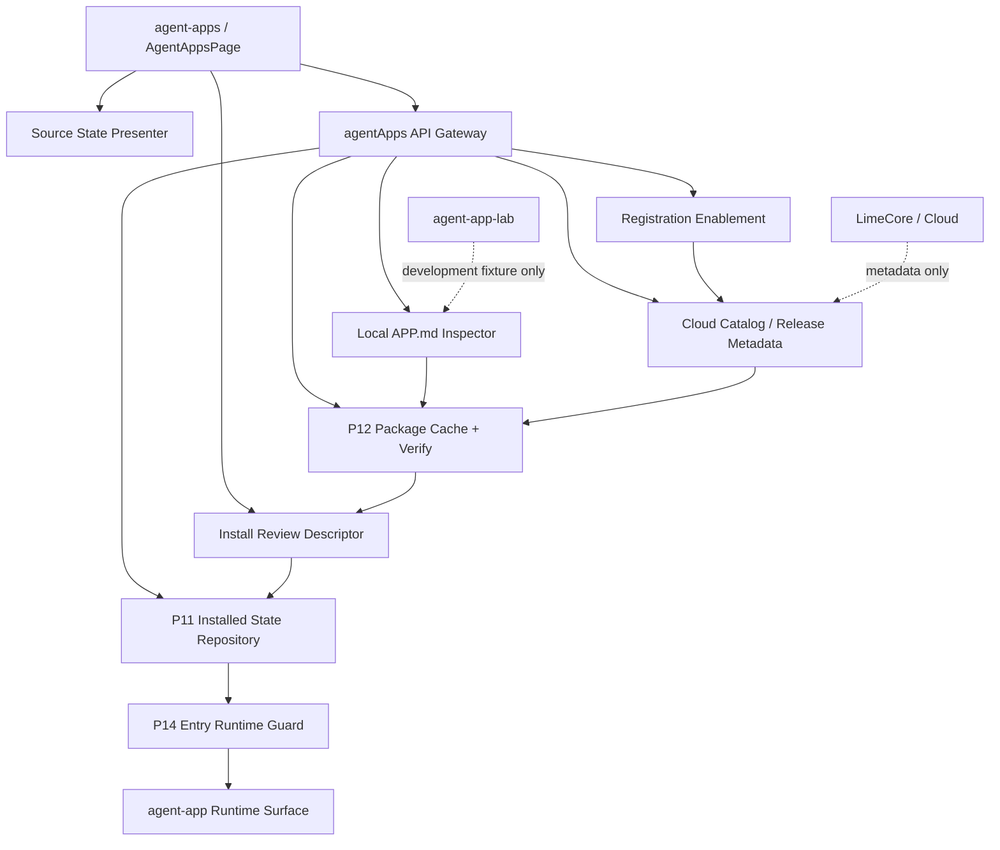
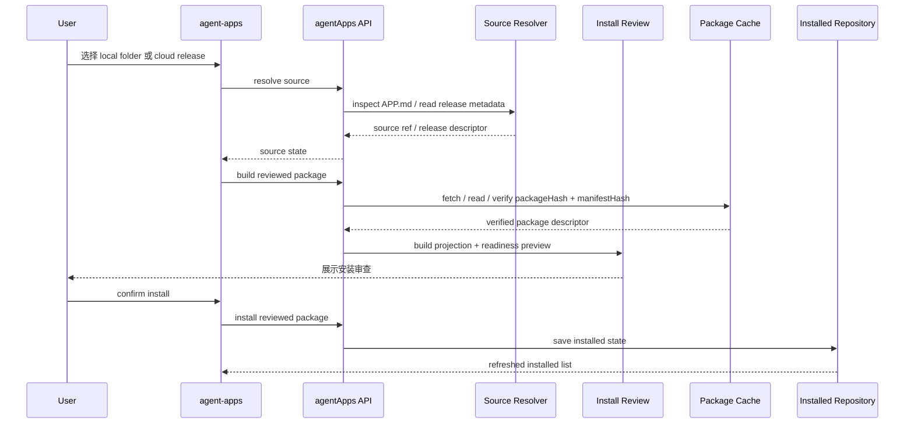
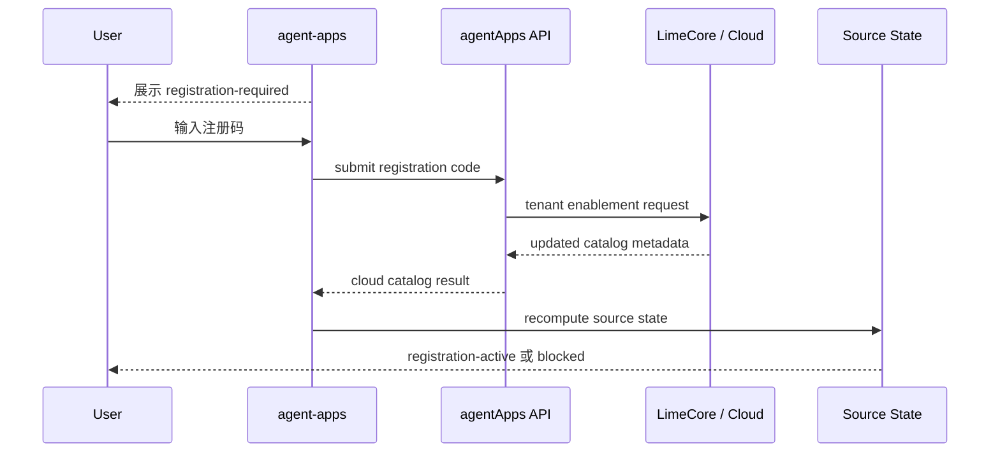
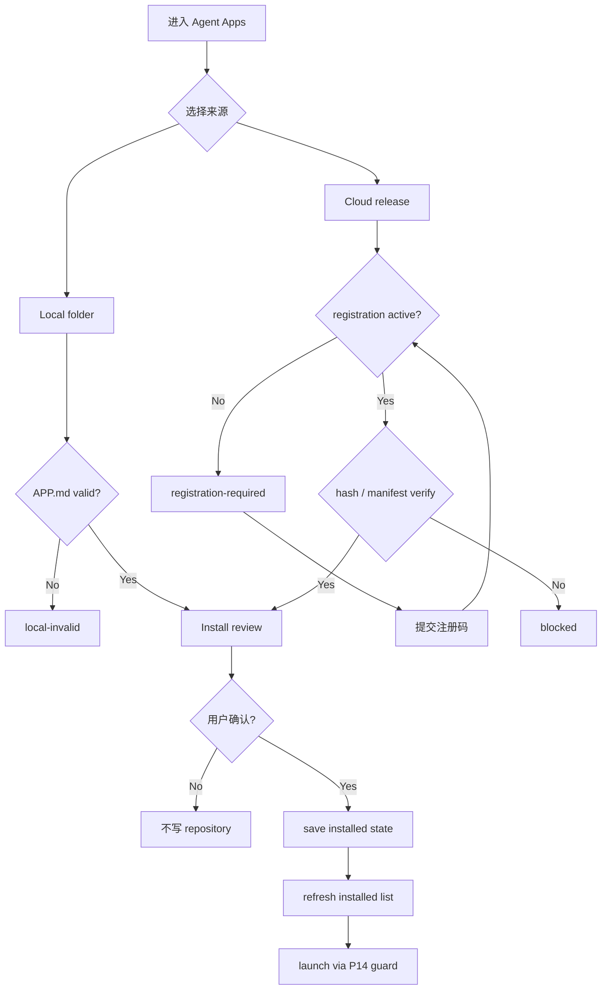

# Agent App P17.2 Source / Install Contract Hardening

更新时间：2026-05-15

## 一句话结论

P17.2 不做 marketplace，也不做 Cloud 管理台。它只把 P17.1 已经进入正式入口的 `agent-apps` 页面继续硬化成可审查、可取消、可复核、可刷新、可回滚的安装入口：所有 local folder、Cloud release metadata、registration、offline fallback 都必须先收敛成同一份 source / install review 契约，再写入 P11 installed state repository。

```text
Source discovery
  -> Package verify
  -> Projection / readiness preview
  -> Install review
  -> Installed state repository
  -> Entry guard
  -> Runtime surface
```

## 背景

P17.1 已经完成正式入口的 route / nav / copy 最小硬化：`agent-apps` 是用户入口，`agent-app-lab` 是研发验证入口，UI entry 会进入独立 `agent-app` runtime surface。

但正式入口还不能继续停留在 Lab 语义上：

1. local folder、Cloud catalog、bootstrap payload、seeded demo 现在容易在 UI 上被看成同一种“可安装 App”。
2. Cloud registration 现在只是按钮前置条件，还没有成为 install review 的正式状态输入。
3. 安装前缺少统一 review descriptor，用户无法在写入 repository 前看到 appId、version、source、hash、manifest、capability 和数据边界摘要。
4. Cloud / LimeCore 的 release metadata 只应作为 source 输入，不能让客户端绕过 package verify、readiness、permission guard 或 local storage boundary。
5. Lab fixture 可以继续服务研发验证，但不能继续泄漏成正式入口的默认安装路径。

上游 Agent App v0.3 标准已经明确：宿主应从包含 `APP.md` 的本地目录、registry catalog item、tenant bootstrap payload、private package URL 或 development fixture 发现 App；所有来源都应收敛到同一个 package identity 和 manifest parser。LimeCore 服务端路线图进一步明确：Cloud 只提供 catalog / release / tenant enablement / policy metadata，未激活注册码时不下发 `packageUrl / packageHash / manifestHash`，真实 release 必须 pin 到 `https` package URL 和完整 `sha256:<64 hex>` hash。Lime Desktop P17.2 的任务就是把这个原则落到正式入口。

## 标准升级影响

上游 `/Users/coso/Documents/dev/ai/limecloud/agentapp` 已补齐宿主实现视角的 v0.3 文档：discovery / installation、release and distribution、runtime model、security model、overlay resolver、readiness runner、public JSON Schema、reference CLI 与完整 `content-factory-app` 示例包。P17.2 不需要改方向，但要把“Cloud install hardening”从一个 UI 状态补丁升级为可机械验证的安装契约：

| 上游标准约束 | P17.2 对应动作 |
|---|---|
| Release 必须 pin 到具体 package，而不是只给 channel 或 catalog card。 | P17.2.4 新增 Cloud release descriptor 归一化，至少包含 `appId`、`version`、`sourceUri`、`packageUrl`、`packageHash`、`manifestHash`、`compatibility`、`releaseChannel`、`tenantEnablementRef`、可选 `signatureRef`。 |
| 安装审查要基于 projection，且 projection 不执行 App code。 | P17.2.4 的 review 来源必须是 verified package 解析后的 manifest / projection / readiness summary，不能继续把 seeded demo、Cloud card 或 Lab fixture 当成 production review。 |
| cached fallback 只服务已安装版本。 | P17.2.4 允许离线启动已安装同 hash package，但禁止在离线时从 Cloud metadata 生成新安装态。 |
| 未激活 tenant registration 不暴露 package metadata。 | P17.2.4b 必须把 `registration-required / expired / revoked` 停在 source state，不能从 seeded fixture、本地开发目录或历史 cache 伪造新安装 review。 |
| seeded catalog 不能携带假 release。 | P17.2.4b 只承认可验证的 `packageUrl / packageHash / manifestHash` 或已安装同 hash cache，缺 source 时展示 blocker。 |
| Public schema / reference CLI 是机械契约。 | P17.2.5 使用上游 `docs/public/schemas/*`、`agentapp-ref` 与 `docs/examples/content-factory-app` 做客户端 projection / readiness cross-check。 |
| Overlay 不进入 package hash。 | P17.3 lifecycle / cleanup hardening 要把 tenant / workspace / user overlay、secret binding、setup state 和 package code 分离。 |
| Runtime 必须通过 injected SDK handles。 | P17.4 继续硬化 runtime surface；当前 dev resolver 只保留开发态，生产路径必须来自 verified package cache。 |

## 目标

| 目标 | 说明 |
|---|---|
| 统一 source 模型 | local folder、cloud release metadata、bootstrap catalog 和 offline cached release 都编译成同一类 source ref。 |
| 增加 install review | 写入 installed state 前展示 identity、hash、manifest、capability、permission、storage、cleanup 和 readiness 摘要。 |
| 收紧 registration 语义 | registration 只改变 tenant enablement / source availability，不写入 App package，不绕过 verify。 |
| 固定 release descriptor | Cloud metadata 必须落成具体 release descriptor，不能只以 channel、注册码或 catalog card 代表可安装 package。 |
| 接入标准校验 | P17.2.5 以后，客户端 projection / readiness 要能和上游 schema、reference CLI、示例包做 cross-check。 |
| 收掉 Lab-only 泄漏 | 正式入口不再把 development fixture 当作真实 source；fixture 只留在 `agent-app-lab`。 |
| 保持客户端边界 | Cloud / LimeCore 只提供 catalog / release / tenant metadata；客户端仍负责 install、verify、projection、readiness、runtime 和 cleanup。 |

## 非目标

1. 不发布 public marketplace。
2. 不做 Cloud 管理台、审核后台、支付分账或完整企业控制台。
3. 不执行真实 delete-data；仍只做 uninstall rehearsal / residual audit。
4. 不新增完整远程下载器或 raw worker sandbox。
5. 不把 内容工厂扩成行业 SaaS。
6. 不新增第二套 store、installer、package cache、readiness runner 或 cleanup scanner。
7. 不让 `src/features/agent-app` 直接 `safeInvoke` / `invoke` 或调用 Tauri command。

## 架构图



## Source State 契约

正式入口只暴露可解释的 source state，不暴露内部实现细节。

| State | 触发条件 | UI 行为 | 可否安装 |
|---|---|---|---|
| `local-selected` | 用户选择包含 `APP.md` 的本地目录；企业定制 manifest 仍必须先有 Cloud `registration-active`。 | 展示本地路径摘要、manifest hash、package hash、capability summary；未注册企业定制包直接阻断 sideload。 | 普通包需要通过 install review；企业定制包还需要注册码已激活。 |
| `local-cancelled` | 用户取消目录选择。 | 只提示取消，不写入状态。 | 否。 |
| `local-invalid` | 缺 `APP.md`、frontmatter 非法、manifest schema 不通过或 hash 缺失。 | 展示 blocker，不保留半安装态。 | 否。 |
| `cloud-discovered` | Cloud / bootstrap 返回 release metadata。 | 展示 appId、version、channel、license、hash、registration 状态。 | 取决于 enabled / registration。 |
| `registration-required` | `registrationRequired=true` 且 `registrationState!=active`。 | 展示注册码输入和原因。 | 否。 |
| `registration-active` | Cloud 返回 active enablement。 | 可以进入 install review，但仍需 package verify。 | 是。 |
| `cloud-disabled` | release 或 tenant enablement disabled。 | 展示 disabledReason。 | 否。 |
| `offline-cached` | 远端不可用但本地已有 verified package / installed state。 | 允许启动已安装版本，不能伪装成新安装。 | 仅已安装版本可用。 |
| `installed` | repository 中已有同 appId + version 或同 release。 | 展示已安装状态和 refresh 时间。 | 不重复安装，允许 refresh / launch。 |

## Install Review Descriptor

P17.2 应新增一个前端可测试的 review descriptor，而不是把 review 文案散在 JSX 中。

```text
AgentAppInstallReview
  identity: appId / version / manifestVersion
  source: sourceKind / sourceUri / releaseId / channel / catalogSource / tenantEnablementRef
  integrity: packageUrl / packageHash / manifestHash / signatureRef
  manifestSummary: title / entries / runtimePackage / compatibility
  capabilitySummary: required capabilities / tools / secrets / knowledge slots
  dataBoundary: storage namespace / artifact namespace / cleanup targets
  readinessPreview: status / blockers / setup tasks
  policyPreview: permissions / tenant defaults / disabled reason
  provenance: loadedAt / checkedAt / generatedAt
```

最低要求：

1. review descriptor 是纯数据，可被单测 snapshot 或字段断言覆盖。
2. local 和 Cloud release 使用同一个 descriptor。
3. Cloud registration 只影响 `policyPreview` / source availability，不改 package manifest。
4. descriptor 进入 installed state 前生成；repository 只保存 verify 通过后的结果。
5. descriptor 的 hash、manifest、capability、namespace 会进入 evidence / cleanup plan 的 provenance。

## 安装时序



## Registration 时序



## 主流程



## 用户故事

| ID | 用户故事 | 验收口径 |
|---|---|---|
| P17.2-US1 | 作为用户，我选择本地目录后可以先看到安装审查，而不是直接写入安装状态。 | cancel / invalid / review / confirm 状态都有测试。 |
| P17.2-US2 | 作为团队管理员，我能区分 Cloud release 是未注册、已注册、禁用还是可安装。 | source state 不只用一个 disabled 按钮表达。 |
| P17.2-US3 | 作为用户，我能看到安装包的 appId、version、hash、capability、storage 和 cleanup 摘要。 | review descriptor 字段完整且五语言展示。 |
| P17.2-US4 | 作为维护者，我能证明 registration 没有绕过 package verify。 | registration active 后仍走 P12 cache / P11 repository。 |
| P17.2-US5 | 作为维护者，我能证明 Lab fixture 没有进入正式入口。 | `development_fixture` 只允许在 Lab 测试和 Lab UI 中出现。 |

## 分阶段计划

| 阶段 | 交付 | 范围 | 验收 |
|---|---|---|---|
| P17.2.0 | 已完成：计划收口。 | 本文、README、implementation plan、P17 contract、P17 gate audit。 | 当时所有 current 文档的下一刀已统一进入 P17.2；后续 P17.3 与 P17.4 已完成，当前进入 P17.5 formal entry GUI smoke。 |
| P17.2.1 | Source state model。 | `src/features/agent-app` 纯函数 / 类型；正式入口 source state copy。 | local / cloud / registration / disabled / installed 状态单测。 |
| P17.2.2 | Install review descriptor。 | `src/lib/api/agentApps.ts` 或 feature 内 builder；`AgentAppsPage` review UI。 | local confirm 前不写 repository；cancel / invalid 稳定。 |
| P17.2.3 | 已完成最小实现：Registration hardening。 | Cloud registration 结果刷新 source state；install button 与 review gate 分离。 | registration-required / active / hash-missing 流程测试。 |
| P17.2.4a | 已完成最小实现：Cloud release descriptor / verification gate。 | Cloud release metadata 归一为 release descriptor；Cloud review 必须显式传入 package manifest；package / manifest mismatch 阻断；cached fallback 必须同 hash。 | `buildCloudReleaseDescriptor()`、`buildVerifiedCloudReleasePackage()`、`reviewCloudAgentAppRelease()`、source state exact-hash tests 通过。 |
| P17.2.4b | 已完成最小实现：Cloud package acquisition hardening。 | 已完成 acquisition seam、verified cache source、`packageUrl` fetch / staging / manifest extraction，并写入 P12 verified package cache。 | Cloud review 可从 explicit verified manifest、verified cache 或 fetched package 生成 projection / readiness；下载 / 验证失败不写 repository；Tauri fetch command 已同步命令契约事实源。 |
| P17.2.5 | 已完成最小实现：Schema / reference CLI / example package cross-check。 | 使用上游 public schema、`agentapp-ref`、`docs/examples/content-factory-app` 校验客户端 projection / readiness / review descriptor 字段。 | reference CLI validate / project / readiness、本地 projection/readiness/review descriptor 字段映射和 accepted divergence 均有测试覆盖；后续 P17.3 lifecycle / cleanup hardening 已完成。 |

### P17.2.4 实施拆解

1. 已完成 P17.2.4a：定义 release descriptor，从 Cloud / bootstrap metadata 归一 `appId`、`version`、`sourceUri`、`packageUrl`、`packageHash`、`manifestHash`、`compatibility`、`releaseChannel`、`tenantEnablementRef`、可选 `signatureRef`。
2. 已完成 P17.2.4a：统一 Cloud review 来源，`reviewCloudAgentAppRelease()` 不再直接从 `contentFactoryFixture` 生成 production review；调用方必须显式传入 package manifest，并通过 verification gate 才能生成 review。
3. 已完成 P17.2.4a：强化 blocker，缺 package manifest、hash mismatch、manifest mismatch、registration inactive、cloud disabled 都不能写入 repository。
4. 已完成 P17.2.4a：固定 cached fallback，`offline-cached` 只允许 repository 中已有且 hash / manifest hash 匹配的版本。
5. 已完成 P17.2.4b-1：在 `src/lib/api/agentApps.ts` 加 package acquisition seam，统一处理 release descriptor、explicit manifest、verified cache lookup 和 missing source blocker；feature island 只消费 review / source state。
6. 已完成 P17.2.4b-2：复用 P12 cache 完成 `packageUrl` 下载 / 读取 / staging / hash verify / manifest extraction / rollback，不新增第二套 downloader / installer / repository。
7. P17.2.4b 当前 UI 仍通过 source state / review blocker 区分“可进入 verified review”和“缺 verified package source”；P17.2.5 已只做标准 cross-check，不扩 UI 入口。
8. P17.2.4b 已把 fetched package source kind、release descriptor、package identity、manifest hash 带回 review 构建链路；更细的 evidence / support diagnostic 字段进入 P17.3 cleanup / lifecycle hardening。
9. P17.2.4b 已固定 registration inactive 时不得用 seeded catalog、Lab fixture 或 dev resolver 补 package manifest；expired / revoked 的字段级 schema 对齐已纳入 P17.2.5 cross-check 证据。

### P17.2.4b 实施顺序

```text
Cloud release descriptor
  -> package acquisition seam
  -> verified cache lookup
  -> optional fetch / staging bridge
  -> manifest extraction
  -> P12 verification
  -> install review
  -> user confirm
  -> P11 repository save
```

1. 已完成：`reviewCloudAgentAppRelease()` 的 production 路径先走 `resolveCloudReleasePackageManifest()`；显式传入 `packageManifest` 只作为测试 / 已验证 source 注入 seam。
2. 已完成：无 verified cache 且测试 / 离线路径显式禁用 fetch 能力时，返回 `missing a verified package source` blocker；正式路径会继续走集中 fetch command，失败也不能写 repository。
3. 已完成：真实下载只通过 `src/lib/api/agentApps.ts -> agent_app_fetch_cloud_package` 集中 Tauri command；`AgentAppsPage`、`cloudBootstrap.ts` 和 Cloud control-plane API 客户端不各自下载。
4. 下载 / staging 必须先验证 packageHash 和 manifestHash；verify 通过前不得生成 production install review。
5. 已安装同 appId + version + packageHash + manifestHash 的 cache 只允许作为 offline / refresh review 来源，不允许在不同 hash 时伪装命中。
6. 所有 blocker 必须带 source provenance：catalog source、releaseId、tenantEnablementRef、packageUrl、expected hash、actual hash。

### P17.2.5 实施拆解

1. 已完成：以 `/Users/coso/Documents/dev/ai/limecloud/agentapp/docs/public/schemas` 为 reference，给客户端 projection / readiness / review descriptor 增加字段映射表和 accepted divergence 检查。
2. 已完成：以 `/Users/coso/Documents/dev/ai/limecloud/agentapp/bin/agentapp-ref.mjs` 的 `validate / project / readiness` 输出为对照，测试客户端 projection、readiness setup checks、capability keys 与 install review descriptor。
3. 已完成：用上游 `docs/examples/content-factory-app` 作为标准示例包，替代只依赖 Lime 内部 fixture 的单一路径验证。
4. cross-check 只验证 package contract，不运行 Agent、不启动 worker、不接 Cloud 管理台。

## 文件边界

| 分类 | 路径 / 对象 | 规则 |
|---|---|---|
| current | `src/features/agent-app/ui/AgentAppsPage.tsx` | 正式入口 UI，只消费 source state / review descriptor，不直接拼 Cloud / Lab 内部状态。 |
| current | `src/lib/api/agentApps.ts` | 前端 API gateway，允许集中 `safeInvoke`；feature island 不直接调用 Tauri。 |
| current | `src/features/agent-app/install/*` | package identity、cache、installed state、setup state、cleanup preview 的事实源。 |
| current | `src/features/agent-app/runtime/entryRuntimeGuard.ts` | launch 前唯一 guard，不因 install review 通过而绕过。 |
| current | `docs/roadmap/agentapp/p17-source-install-contract-hardening.md` | P17.2 已完成执行记录。 |
| current | `docs/roadmap/agentapp/p17-lifecycle-cleanup-contract-hardening.md` | P17.3 已完成执行计划。 |
| reference | `/Users/coso/Documents/dev/ai/limecloud/agentapp` | Agent App v0.3 标准、发现安装、发布分发、安全模型、public schema、reference CLI 和示例包。 |
| reference | `/Users/coso/Documents/dev/ai/limecloud/limecore/docs/roadmap/agentapp` | Cloud / LimeCore 控制面，不写客户端 runtime。 |
| deprecated | `agent-app-lab` source 语义进入正式入口 | Lab 仍 current 于研发验证，但 fixture / smoke 不能成为正式 install 证据。 |
| dead | `SceneApp` / `contentEngineering*` / `sceneapp_*` | 不恢复、不迁移、不兼容。 |

## 验收标准

1. `agent-apps` 对 local folder 和 Cloud release 展示同一类 install review。
2. 用户取消本地目录选择时不写入 repository、不留下半安装态。
3. invalid package / hash mismatch / manifest mismatch 必须阻断安装。
4. registration required 只能解锁 source availability，不能写 package、不能绕过 verify；本地 sideload 的企业定制包同样必须先确认 Cloud `registrationState=active`。
5. Cloud release 必须先归一成带 `packageUrl / packageHash / manifestHash / compatibility` 的 release descriptor；只返回 channel、license 或 registration 状态不能被视为可安装 package。
6. Cloud / LimeCore 只作为 metadata source；Desktop 仍负责 install、projection、readiness、guard、runtime、cleanup。
7. cached fallback 只允许启动已安装且 hash 匹配的 package；不能用离线缓存创建新安装态。
8. P17.2.5 已对齐上游 public schema、reference CLI 和 `content-factory-app` 示例包；projection `permissions` 仍作为明确 accepted divergence，当前由 install review `permissionCount` 覆盖，完整 permission projection 后移到 P18。
9. 正式入口不直接使用 Lab fixture source；Lab smoke 不能替代 formal smoke。
10. 用户可见文案覆盖 `zh-CN / zh-TW / en-US / ja-JP / ko-KR`。
11. `src/features/agent-app` 不直接出现 `safeInvoke`、`invoke(`、`tauri::`、`generate_handler`、`new Worker`。

## 最小验证

P17.2 文档收口：

```bash
git diff --check -- docs/roadmap/agentapp
rg -n "下一刀进入 P17\\.1|P17\\.1 Formal route / nav / copy hardening（下一刀）" docs/roadmap/agentapp
```

P17.2 实现后至少执行：

```bash
npm run test -- src/features/agent-app/install/cloudBootstrap.test.ts src/features/agent-app/install/installReview.test.ts src/features/agent-app/install/packageCache.test.ts src/lib/api/agentApps.test.ts
npm run test -- src/features/agent-app/ui/AgentAppsPage.test.tsx src/features/agent-app/ui/AgentAppRuntimePage.test.tsx
npm run test -- src/i18n/__tests__/translation-coverage.test.ts src/i18n/__tests__/loadNamespace.test.ts src/i18n/__tests__/types.test.ts
rg -n "safeInvoke|invoke\\(|tauri::|generate_handler|mockPriorityCommands|defaultMocks|new Worker|Worker\\(" src/features/agent-app || true
git diff --check -- docs/roadmap/agentapp src/features/agent-app src/lib/api/agentApps.ts src/i18n/resources
```

P17.2.5 标准 cross-check：

```bash
node /Users/coso/Documents/dev/ai/limecloud/agentapp/bin/agentapp-ref.mjs validate /Users/coso/Documents/dev/ai/limecloud/agentapp/docs/examples/content-factory-app
node /Users/coso/Documents/dev/ai/limecloud/agentapp/bin/agentapp-ref.mjs project /Users/coso/Documents/dev/ai/limecloud/agentapp/docs/examples/content-factory-app
node /Users/coso/Documents/dev/ai/limecloud/agentapp/bin/agentapp-ref.mjs readiness /Users/coso/Documents/dev/ai/limecloud/agentapp/docs/examples/content-factory-app
```

如改动 Tauri command / bridge：

```bash
npm run test:contracts
```

如改动正式入口 GUI 主流程：

```bash
npm run test -- src/features/agent-app/ui/AgentAppsPage.test.tsx src/features/agent-app/ui/AgentAppRuntimePage.test.tsx src/components/AppPageContent.test.tsx src/lib/navigation/sidebarNav.test.ts
```

P17.5 前仍可用 Lab smoke 做辅助回归，但不能把 `smoke:agent-app-lab` 当作正式入口 smoke。

## 当前下一刀

P17.2.1、P17.2.2 与 P17.2.3 已完成最小实现：正式入口已补 source state model、install review descriptor 和 registration-active refresh；local / cloud 安装都改为先生成审查卡片，用户确认后才写入 P11 installed state repository。P17.2.4a 已完成 release descriptor、verification gate、hash mismatch blocker 和 exact-hash cached fallback 的最小实现。P17.2.4b-1 已完成 package acquisition seam、verified cache source 和 missing source blocker。P17.2.4b-2 已把 `packageUrl` 下载 / staging / manifest extraction 接入 P12 verified cache。P17.2.5 已完成 public schema / reference CLI / standard example package cross-check。后续 P17.3 lifecycle / cleanup contract hardening 与 P17.4 runtime surface production hardening 已完成；当前进入 P17.5 formal entry GUI smoke。

## 2026-05-15 P17.2.1 / P17.2.2 / P17.2.3 实施记录

本轮完成内容：

1. 新增 `src/features/agent-app/install/installReview.ts`，作为正式入口 source state 与 install review descriptor 的纯函数事实源。
2. `src/lib/api/agentApps.ts` 新增 `reviewLocalAgentAppPackage()` 与 `reviewCloudAgentAppRelease()`；原 `installLocalAgentAppPackage()` / `installCloudAgentAppRelease()` 继续保留为兼容 API，但内部先 review 再 save。
3. `AgentAppsPage` 的 local folder 和 Cloud release 安装不再点击即写入 repository，而是先展示 `agent-apps-install-review`，确认后才调用 `saveInstalledAgentAppState()`。
4. Cloud source card 展示 `registration-required / registration-active / cloud-disabled / hash-missing / installed / offline-cached` 等 source state；不可审查的 source 禁用安装按钮。
5. 五语言补齐 source state 与 install review 文案。
6. registration submit 后先刷新 installed list，再保留 submit 返回的 active catalog，避免 UI 被旧 catalog 重新冲回 `registration-required`。
7. 单测覆盖 source state、local cancel、invalid package、Cloud review、registration-active refresh、hash-missing blocker、confirm install 和 API review no-save。

验证记录：

| 命令 / 证据 | 结果 |
|---|---|
| `npm run test -- src/features/agent-app/install/installReview.test.ts src/features/agent-app/ui/AgentAppsPage.test.tsx src/lib/api/agentApps.test.ts` | 通过，3 files / 24 tests。 |
| `npm run test -- src/i18n/__tests__/translation-coverage.test.ts src/i18n/__tests__/loadNamespace.test.ts src/i18n/__tests__/types.test.ts` | 通过，3 files / 17 tests。 |
| `rg -n "safeInvoke\|invoke\\(\|tauri::\|generate_handler\|mockPriorityCommands\|defaultMocks\|new Worker\|Worker\\(" src/features/agent-app \|\| true` | 无命中，feature island 未直接扩展命令边界。 |
| `git diff --check -- src/features/agent-app src/lib/api/agentApps.ts src/lib/api/agentApps.test.ts src/i18n/resources docs/roadmap/agentapp` | 通过。 |

未完成：

1. P17.2.4b-1 之前的 Cloud review 已不再默认使用 fixture，但当时仍依赖调用方显式传入 package manifest；该缺口已由 P17.2.4b-1 的 acquisition seam / verified cache source 部分收口。
2. P17.2.4b-2 packageUrl fetch / staging / manifest extraction 已完成；当前没有 explicit verified manifest 或 verified cache 时，会尝试集中 fetch command，下载或验证失败仍安全阻断。
3. P17.2.5 schema / reference CLI cross-check 已新增；客户端 projection / readiness 已和上游 public schema、`agentapp-ref`、标准 `content-factory-app` 示例包形成机械对照。
4. P17.5 formal entry GUI smoke 仍未新增；当前仍不能用 Lab smoke 代替正式入口 smoke。

## 2026-05-15 P17.2.4a 实施记录

本轮完成内容：

1. `cloudBootstrap.ts` 新增 `buildCloudReleaseDescriptor()`，把 Cloud metadata 归一为带 `packageUrl / packageHash / manifestHash / compatibility / tenantEnablementRef / signatureRef` 的 release descriptor。
2. `cloudBootstrap.ts` 新增 `buildVerifiedCloudReleasePackage()`，复用 P12 package cache entry 与 verification 结果，支持 package / manifest hash mismatch blocker。
3. `reviewCloudAgentAppRelease()` 不再默认使用 `contentFactoryFixture` 生成 production review；缺少 package manifest 时抛出 `AgentAppCloudBootstrapError`，避免 Cloud card / Lab fixture 伪装成 verified package。
4. `AgentAppInstallReview` 增加 release provenance 字段：`packageUrl / releaseId / releaseChannel / tenantEnablementRef / signatureRef / packageVerificationStatus`。
5. `buildCloudAgentAppSourceState()` 的 installed / offline-cached 判断改为 appId + version + packageHash + manifestHash 全部匹配，避免同版本不同 hash 伪装成 cached fallback。

验证记录：

| 命令 / 证据 | 结果 |
|---|---|
| `npm run test -- src/features/agent-app/install/cloudBootstrap.test.ts src/features/agent-app/install/installReview.test.ts src/lib/api/agentApps.test.ts` | 通过，3 files / 30 tests。 |
| `npm run test -- src/features/agent-app/ui/AgentAppsPage.test.tsx src/features/agent-app/ui/AgentAppRuntimePage.test.tsx src/lib/api/agentApps.test.ts` | 通过，3 files / 25 tests。 |
| `npm run typecheck` | 通过。 |
| `rg -n "safeInvoke\|invoke\\(\|tauri::\|generate_handler\|mockPriorityCommands\|defaultMocks\|new Worker\|Worker\\(" src/features/agent-app \|\| true` | 无命中，feature island 未直接扩展命令边界。 |
| `git diff --check -- src/features/agent-app src/lib/api/agentApps.ts src/lib/api/agentApps.test.ts docs/roadmap/agentapp` | 通过。 |

## 2026-05-15 P17.2.4b-1 实施记录

本轮完成内容：

1. `src/lib/api/agentApps.ts` 新增 `resolveCloudReleasePackageManifest()`，作为 Cloud package acquisition 的 API gateway seam。
2. `reviewCloudAgentAppRelease()` 不再在入口处强制调用方传入 `packageManifest`；现在先尝试 explicit verified manifest，再尝试 verified cache source。
3. 新增 `packageCacheEntry / resolveCachedPackage` 注入点，允许 P12 verified cache 命中后直接生成 production review。
4. 缺 verified source 时抛出明确 blocker，不写 P11 repository；cache hash / manifest hash mismatch 仍阻断。
5. `src/features/agent-app` 仍无直接 `safeInvoke` / Tauri / raw Worker；本轮未新增 Tauri command。

验证记录：

| 命令 / 证据 | 结果 |
|---|---|
| `npm run test -- src/lib/api/agentApps.test.ts src/features/agent-app/install/cloudBootstrap.test.ts src/features/agent-app/install/installReview.test.ts` | 通过，3 files / 32 tests。 |
| `npm run test -- src/features/agent-app/ui/AgentAppsPage.test.tsx src/features/agent-app/ui/AgentAppRuntimePage.test.tsx src/lib/api/agentApps.test.ts` | 通过，3 files / 27 tests。 |
| `npm run typecheck` | 通过。 |
| `rg -n "safeInvoke\|invoke\\(\|tauri::\|generate_handler\|mockPriorityCommands\|defaultMocks\|new Worker\|Worker\\(" src/features/agent-app \|\| true` | 无命中，feature island 未直接扩展命令边界。 |
| `git diff --check -- src/lib/api/agentApps.ts src/lib/api/agentApps.test.ts docs/roadmap/agentapp` | 通过。 |

后续阶段：

1. P17.2.4b-2 已接真实 `packageUrl` fetch / staging / manifest extraction；当前没有 verified cache 时会走集中 fetch command，下载或验证失败仍安全阻断。
2. 新增 Tauri fetch command 已同步 frontend gateway、Rust registration、DevBridge dispatcher、command catalog、mock priority / default mocks，并执行 `npm run test:contracts`。
3. P17.2.5 schema / reference CLI cross-check 已新增并通过定向验证。

## 2026-05-15 P17.2.4b-2 实施记录

本轮完成内容：

1. `src/lib/api/agentApps.ts` 新增 `fetchCloudAgentAppPackage()`，`resolveCloudReleasePackageManifest()` 在 explicit manifest、verified cache 未命中后，会通过集中命令 fetch package 并把结果标记为 `fetched_package`。
2. `agent_app_fetch_cloud_package` 新增 Rust current 命令：只接受 `https` `packageUrl`、`sha256:<64 hex>` package / manifest hash，且要求 `sourceUri == packageUrl`。
3. Rust 命令完成 `packageUrl -> bytes -> packageHash verify -> staging unzip -> unique APP.md root -> manifestHash verify -> frontmatter app/version match -> packages/<sha256_package_hash>`，验证失败只返回 blocker，不写 installed state。
4. 命令同步 `runner.rs`、DevBridge dispatcher、`agentCommandCatalog.json`、`mockPriorityCommands.ts` 与 `agentAppMocks.ts`；feature island 仍不直接 `safeInvoke` / `invoke`。
5. `docs/aiprompts/commands.md` 已登记 Agent App current 命令主链，并明确 `agent_app_fetch_cloud_package` 不做 projection、不写 installed state、不绕过 install review。

验证记录：

| 命令 / 证据 | 结果 |
|---|---|
| `npm run test -- src/lib/api/agentApps.test.ts src/features/agent-app/install/cloudBootstrap.test.ts src/features/agent-app/install/installReview.test.ts` | 通过，3 files / 33 tests。 |
| `npm run test -- src/features/agent-app/ui/AgentAppsPage.test.tsx src/features/agent-app/ui/AgentAppRuntimePage.test.tsx src/lib/api/agentApps.test.ts` | 通过，3 files / 28 tests。 |
| `npm run typecheck` | 通过。 |
| `npm run test:contracts` | 通过。 |
| `cargo test --manifest-path src-tauri/Cargo.toml -p lime agent_app_cmd --lib --target-dir /tmp/lime-cargo-test-agent-app-fetch` | 通过，2 tests；首次独立 target 编译下载了 `sherpa-onnx` 预编译依赖。 |
| `rg -n "safeInvoke\|invoke\\(\|tauri::\|generate_handler\|mockPriorityCommands\|defaultMocks\|new Worker\|Worker\\(" src/features/agent-app \|\| true` | 无命中，feature island 未直接扩展命令边界。 |
| `npm run verify:local` | 未通过；smart 模式触发全仓 lint，阻塞于 `src/components/agent/chat/experts/ExpertInfoPanel.tsx` 的 `react-hooks/exhaustive-deps` warning，非本轮 Agent App P17.2.4b-2 命令 / roadmap 文件。 |

未完成：

1. P17.3 lifecycle / cleanup contract hardening 已完成：formal page、guard integration、cleanup namespace、evidence 和 residual audit 均已收口，overlay、secret binding、setup state、package code 与 cleanup evidence 已按 namespace 分离。
2. P17.4 production hardening 已完成 P17.4.1-P17.4.5，包含健康 DevBridge 下的完整 GUI smoke 证据。
3. P17.5 formal entry GUI smoke 仍未新增；Lab smoke 不能替代正式入口 smoke。

## 2026-05-15 P17.2.5 实施记录

本轮完成内容：

1. 新增 `src/features/agent-app/schema/referenceCliCrossCheck.test.ts`，本地存在上游标准仓库时运行 `/Users/coso/Documents/dev/ai/limecloud/agentapp/bin/agentapp-ref.mjs validate / project / readiness`。
2. cross-check 读取上游 `docs/public/schemas/app-projection.schema.json` 与 `app-readiness.schema.json`，把 reference projection 字段映射到 Lime `AgentAppProjection`，未映射字段必须进入 accepted divergence。
3. cross-check 使用上游标准示例包 `docs/examples/content-factory-app/APP.md`，而不是 Lime 内部 fixture，生成客户端 projection、readiness 和 install review descriptor。
4. 断言 reference CLI 的 entry / capability / knowledge / tool / artifact / eval / service / workflow / secret / overlay keys 能映射到 Lime projection / readiness setup checks。
5. 明确 accepted divergence：reference projection 的 `permissions` 当前不进入 Lime projection，而由 P17.2 install review 的 `permissionCount` 覆盖；完整 permission projection 后移到 P17.3 / P18。

验证记录：

| 命令 / 证据 | 结果 |
|---|---|
| `npm run test -- src/features/agent-app/schema/referenceCliCrossCheck.test.ts` | 通过，1 file / 3 tests；本机标准仓库存在，测试实际运行未 skip。 |
| `npm run typecheck` | 通过。 |

未完成：

1. P17.3 lifecycle / cleanup contract hardening 已完成，formal page / guard integration 已收口。
2. P17.4 runtime surface production hardening 已完成 P17.4.1-P17.4.5，GUI smoke 已通过。
3. P17.5 formal entry GUI smoke 仍未新增。

## 2026-05-15 Formal Runtime Surface 补丁

本轮针对正式左侧 App 入口补了最小可用闭环，避免已安装 App 进入一个 Host 伪页面或停在 `cloud_release` 假启动状态：

1. `agent_app_start_ui_runtime` 仍走 current Tauri 命令边界，但 runtime 目录解析改为通用 resolver：优先 `local_folder`，再查 package cache / staging，再读 `LIME_AGENT_APP_LOCAL_ROOTS`，最后在开发态按 `limecloud/<appId>` 约定发现本地 App；所有候选目录都必须包含 `APP.md` / `package.json`，且 `APP.md` 的 `name/appId` 必须匹配 installed state。
2. `AgentAppRuntimePage` 不再渲染 Host 自己的“运行条件 / 交付物 / 知识绑定 / entry 卡片”，只负责启动 App runtime 并用 iframe 打开 App 自己的 `entryUrl`。
3. `内容工厂` 的正式入口现在打开的是 App 包自己的 `/dashboard` 页面；Host 只提供安装状态、导航和 runtime 容器。
4. 这不是 marketplace / Cloud 执行器；`cloud_release` 仍必须最终落到本地 verified runtime package。当前 dev resolver 只用于本地开发与已存在源码包的可用闭环，P17.2 后续仍要补正式 install review / package verify。
5. 计划分类：该补丁属于 P17.4 runtime surface pre-work，不改变 P17.2 主线。P17.2.4b-2 已把 `packageUrl` 下载 / staging / manifest extraction 接入 P12；P17.4 仍需继续证明 `cloud_release` runtime 不依赖本地源码目录或开发态 resolver。
6. 后续约束：P17.4 production hardening 必须证明 runtime 只加载 verified cache / staging，disabled / unverified / missing package 无法启动，App UI 只能通过 injected SDK handles 使用 Lime 能力。

验证记录：

| 命令 / 证据 | 结果 |
|---|---|
| `npm run test -- src/features/agent-app/ui/AgentAppRuntimePage.test.tsx src/lib/api/agentApps.test.ts src/lib/dev-bridge/mockPriorityCommands.test.ts src/lib/tauri-mock/core.test.ts` | 通过，4 files / 34 tests。 |
| `npx eslint ...agent-app/runtime/api/mock files... --max-warnings 0` | 通过。 |
| `cargo check --manifest-path src-tauri/Cargo.toml -p lime --lib --target-dir /tmp/lime-cargo-check-agent-app` | 通过。 |
| `npm run test:contracts` | 通过。 |
| `npm run bridge:health` + DevBridge `agent_app_start_ui_runtime` | 通过，返回 `entryUrl=http://127.0.0.1:<port>/dashboard`，runtime 目录为本地 `limecloud/content-factory-app`。 |
| Playwright 打开 runtime `/dashboard` | 通过，页面标题 `内容工厂`，App 内导航包含 `项目中心 / 资料整理 / 场景规划 / 写文案 / 做脚本 / 交付文件 / 看数据 / 团队设置`。 |
| `npm run verify:gui-smoke` | 通过。 |

## 2026-05-15 内容工厂端到端复测

本轮从正式 Agent App runtime 打开 `内容工厂` App 自己的页面，并按业务用户路径重走一遍，不再接受 Host hard code 或 Host 仿页面作为通过标准。

复测结论：

1. 正式 runtime 可启动并打开 App 页面：DevBridge `agent_app_start_ui_runtime` 返回 `http://127.0.0.1:65290/dashboard`，页面标题和 App 内导航均为 `内容工厂` 自身 UI。
2. 已在真实 runtime 中完成：创建项目 `E2E 内容工厂项目 20260515`、粘贴资料整理、确认资料版本、进入场景规划、写文案、做脚本、交付文件、看数据、团队设置并保存规则。
3. 当前真实 runtime 未配置 `LIME_MODEL / LIME_ACCESS_TOKEN`，所以场景、文案、脚本、交付结论生成按钮按设计禁用，并显示“需要先在 Lime 中连接内容生成能力”；这属于宿主能力接入缺口，不再用前端假数据伪造成可生成。
4. 完整生成链用 App 自带 fake-model 产品 E2E 验证通过，覆盖空项目、新建项目、资料导入、确认链、120 场景、20 条文案、6 条脚本、交付结论、复盘、团队设置和 dashboard 持久化。
5. 复测中发现并修复了 App 自身三个问题：粘贴资料未选文件会被当成不支持文件、`用户痛点 / 竞品与差评` 显式标签被分错区、项目资产页泄露内部 `content_batch_* / scene_table_* / knowledge_*` ID。

验证记录：

| 命令 / 证据 | 结果 |
|---|---|
| Playwright MCP `http://127.0.0.1:65290/dashboard` | 通过，当前停留 dashboard，控制台 error 为 0。 |
| Playwright MCP 真实 runtime 业务流 | 通过到“生成能力未连接”的受控门禁；资料整理 / 确认 / 复盘 / 设置均成功，场景 / 文案 / 脚本 / 交付生成按钮按缺能力禁用。 |
| `npm run build && npm test` in `/Users/coso/Documents/dev/ai/limecloud/content-factory-app` | 通过，34 tests。 |
| `npm run e2e:user-flow` in `/Users/coso/Documents/dev/ai/limecloud/content-factory-app` | 通过，验证未连接模型时的受控门禁，证据输出到 `.local/e2e/content-factory-disconnected-2026-05-15T13-40-55-658Z/`，包含 7 张页面截图。 |
| `npm run e2e:user-flow:fake-model` in `/Users/coso/Documents/dev/ai/limecloud/content-factory-app` | 通过，验证完整生成链，证据输出到 `.local/e2e/content-factory-fake-2026-05-15T13-36-10-918Z/`，包含 8 张页面截图。 |

## 2026-05-15 内容工厂 Host 能力注入补丁

本轮把“已安装但生成能力不可用”的缺口收敛到正式 Agent App runtime 主链：Host 启动 App UI runtime 时不再只注入 `PORT`，而是按 Lime 当前模型配置和本机 Gateway 生成受控运行环境，让 App 通过 Lime Gateway 使用内容生成能力。

实现内容：

1. `agent_app_start_ui_runtime` 继续沿用 current Agent App 命令，不新增平行命令；启动子进程时额外注入 `LIME_GATEWAY_BASE / LIME_GATEWAY_PROTOCOL / LIME_GATEWAY_PROVIDER / LIME_MODEL / LIME_ACCESS_TOKEN`。
2. 注入的访问凭证是 Lime 本机 Gateway API key，不把上游 Provider API Key 直接下发给 App 子进程；上游 Provider 协议和真实凭证仍由 Lime Gateway 负责。
3. 模型选择优先读取 `workspace_preferences.service_models.generation_topic.preferredModelId`，否则读取所选 / 首个可用 API Key Provider 的 `custom_models`；没有模型或没有可用 Provider 凭证时不伪造 ready。
4. 内容工厂 App 的模型适配器支持 `responses / openai_chat / anthropic_messages` 三种协议，并优先读取 Host 注入的 `LIME_*`，同时兼容标准 OpenAI / Anthropic / Ollama 环境变量。
5. 内容工厂设置页只展示业务可理解的连接状态，不暴露 API key、内部 Provider token 或 Host 调试字段。

验证记录：

| 命令 / 证据 | 结果 |
|---|---|
| `cargo test -p lime agent_app_` in `src-tauri` | 通过，Agent App 命令相关 4 tests。 |
| `npm run test:contracts` | 通过，命令契约、Harness 契约和 modality contract 均通过。 |
| `npm run test -- src/lib/api/agentApps.test.ts src/lib/dev-bridge/mockPriorityCommands.test.ts src/lib/tauri-mock/core.test.ts` | 通过，3 files / 40 tests。 |
| `npm test` in `/Users/coso/Documents/dev/ai/limecloud/content-factory-app` | 通过，39 tests。 |
| `npm run e2e:user-flow` in `/Users/coso/Documents/dev/ai/limecloud/content-factory-app` | 通过，未连接模式证据：`.local/e2e/content-factory-disconnected-2026-05-15T14-19-29-652Z/`。 |
| `npm run e2e:user-flow:fake-model` in `/Users/coso/Documents/dev/ai/limecloud/content-factory-app` | 通过，完整生成链证据：`.local/e2e/content-factory-fake-2026-05-15T14-19-46-127Z/`。 |
| DevBridge `agent_app_start_ui_runtime` + Playwright `http://127.0.0.1:55396/settings` | 通过，内容工厂设置页显示“已连接”，当前模型 `deepseek-v4-pro`，控制台新增 error 为 0。 |
| Playwright `http://127.0.0.1:55396/scenario-planning` | 通过，`更新场景和图片需求` 按钮在模型 ready 后可点击。 |

未执行：

1. 未点击真实模型生成按钮；这会通过本机 Gateway 调用真实上游模型并消耗用户 Provider 配额。完整生成链已由 fake-model E2E 覆盖，真实模型调用需用户明确允许后再跑一轮最小样本。
2. 本节当时注入仍是进程级环境变量，不是 per-app scoped secret capability；后续已在“内容工厂 scoped Gateway token 补丁”和“model-generation scope 收窄补丁”中继续收紧，P17.4 / P18 仍需补审计事件和 revoke。

## 2026-05-15 内容工厂 scoped Gateway token 补丁

本轮把上一节遗留的“App 子进程拿到全局 `server.api_key`”收窄为短期 Agent App scoped token，继续落在 `agent_app_start_ui_runtime` current 主链，不新增平行启动命令。

实现内容：

1. 新增 `lime_core::agent_app_runtime_token`，用 `server.api_key` 作为本机签名 secret 签发短期 token，token 默认 12 小时过期。
2. Host 启动 App UI runtime 时注入 scoped token 到 `LIME_ACCESS_TOKEN / OPENAI_API_KEY`，不再把全局 `server.api_key` 原样下发给 App。
3. 启动子进程前清理常见上游 Provider API Key 环境变量，避免父进程环境里的 `OPENAI_API_KEY / ANTHROPIC_API_KEY / DEEPSEEK_API_KEY` 等透传给 App。
4. Lime Gateway 的 OpenAI / Anthropic HTTP 鉴权继续接受原有全局 API Key，同时识别签名有效且未过期的 Agent App scoped token；上游 Provider 凭证仍只由 Gateway 侧读取。
5. `docs/aiprompts/commands.md` 已补充 Agent App runtime token 约束，避免后续回退到把全局 Gateway key 或 Provider key 注入 App。

验证记录：

| 命令 / 证据 | 结果 |
|---|---|
| `cargo test -p lime-core agent_app_runtime_token --target-dir /tmp/lime-cargo-agent-app-token-core` | 通过，3 tests。 |
| `cargo test -p lime-server verify_api_key --target-dir /tmp/lime-cargo-agent-app-token-core` | 通过，3 tests。 |
| `cargo test -p lime agent_app_ --lib --target-dir /tmp/lime-cargo-test-agent-app-p17-3` | 通过，5 tests。 |
| `npm run test:contracts` | 通过，命令契约、Harness 契约、modality runtime contracts 和 cleanup report contract 均通过。 |
| `npm run bridge:health -- --timeout-ms 120000` | 通过，DevBridge ready。 |
| DevBridge stop/start `content-factory-app` runtime | 通过，新 runtime `http://127.0.0.1:51728/dashboard`，目录 `/Users/coso/Documents/dev/ai/limecloud/content-factory-app`。 |
| `GET http://127.0.0.1:51728/api/bootstrap` | 通过，`model.ready=true`，`provider=deepseek`，`model=deepseek-v4-pro`，`protocol=openai_chat`，`gatewayBase=http://127.0.0.1:8999`，`missing=[]`。 |
| Playwright `http://127.0.0.1:51728/settings` | 通过，设置页显示“已连接”，当前模型 `deepseek-v4-pro`，新增 console error 为 0。 |
| Playwright `http://127.0.0.1:51728/scenario-planning` | 通过，`更新场景和图片需求` 按钮 `disabled=false`，新增 console error 为 0。 |

未执行：

1. 未点击真实模型生成按钮；该操作会消耗真实上游 Provider 配额。完整生成链仍以 App fake-model E2E 作为不耗费配额的回归证据。
2. scoped token 在本节后仍是 Gateway 级短期 bearer token；后续已继续收窄到 `model-generation` 生成能力，P17.4 / P18 后续仍需补更细粒度 capability、审计和 token revoke。

## 2026-05-15 model-generation scope 收窄补丁

本轮继续把 Agent App runtime token 从“Gateway 级短期 bearer”收窄为“内容生成能力级 bearer”，不扩大 App 可访问的 Gateway 控制面。

实现内容：

1. `lime_core::agent_app_runtime_token` 默认签发 `lime-agent-app:v1:<appId>:<expiresAt>:<nonce>:model-generation:<signature>`，并新增 scope 校验入口。
2. `agent_app_start_ui_runtime` 继续只注入短期 token，但 token claims 的 scope 固定为 `model-generation`。
3. `verify_api_key` / `verify_api_key_anthropic` 回到只接受全局 Gateway key，避免 Agent App token 被图片、count tokens、Gemini 原生或其他管理端点通用复用。
4. 仅 `/v1/chat/completions` 与 `/v1/messages` 生成端点使用 `verify_model_generation_api_key*`，接受全局 Gateway key 或未过期的 Agent App `model-generation` scoped token。
5. `docs/aiprompts/commands.md` 已同步记录：Agent App scoped token 当前只覆盖生成端点，不代表全 Gateway 权限。

验证记录：

| 命令 / 证据 | 结果 |
|---|---|
| `cargo test -p lime-core agent_app_runtime_token --target-dir /tmp/lime-cargo-agent-app-token-core` | 通过，4 tests；覆盖签发、过期、篡改、错误 secret 和 unsupported scope。 |
| `cargo test -p lime-server auth_tests --target-dir /tmp/lime-cargo-agent-app-token-core` | 通过，4 tests；覆盖全局 key、Agent App token 被普通鉴权拒绝、生成端点接受 scoped token、错误 secret 拒绝。 |
| `cargo test -p lime agent_app_ --lib --target-dir /tmp/lime-cargo-test-agent-app-p17-3` | 通过，5 tests；覆盖 Agent App runtime 注入的 token claims。 |
| `npm run test:contracts` | 通过，命令契约、Harness 契约、modality runtime contracts 和 cleanup report contract 均通过。 |
| `npm run bridge:health -- --timeout-ms 120000` | 通过，DevBridge ready。 |
| DevBridge `agent_app_start_ui_runtime` + `agent_app_get_ui_runtime_status` | 通过，新 runtime `http://127.0.0.1:56285/dashboard`，目录 `/Users/coso/Documents/dev/ai/limecloud/content-factory-app`。 |
| `GET http://127.0.0.1:56285/api/bootstrap` | 通过，`model.ready=true`，`provider=deepseek`，`model=deepseek-v4-pro`，`protocol=openai_chat`，`gatewayBase=http://127.0.0.1:8999`，`missing=[]`。 |
| Playwright `http://127.0.0.1:56285/settings` | 通过，设置页显示“生成内容：已连接”，当前模型 `deepseek-v4-pro`，console error 为 0。 |
| Playwright `http://127.0.0.1:56285/scenario-planning` | 通过，`更新场景和图片需求` 按钮 `disabled=false`，console error 为 0。 |

未执行：

1. 未点击真实模型生成按钮；该操作会消耗真实上游 Provider 配额。当前只验证到生成入口 ready 和按钮可用。
2. 未跑 `npm run verify:gui-smoke`；本轮没有修改 Host GUI 壳、Workspace 或前端可见文案，且本机有并行任务，避免为了 auth scope 收窄打断现有 GUI 会话。若下一刀改 Agent Apps 正式入口或 Host runtime 页面，再补 GUI smoke。
