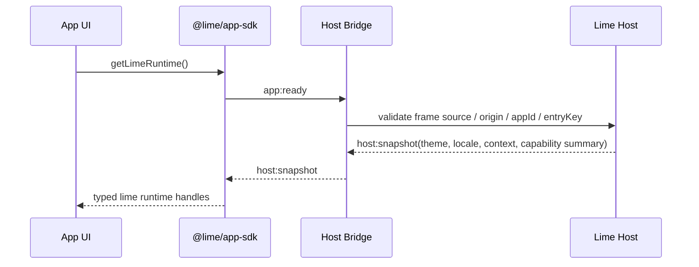
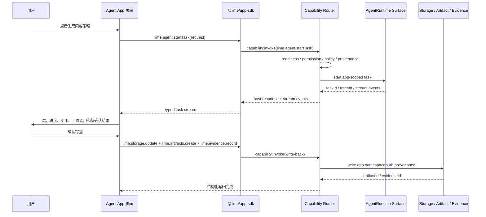
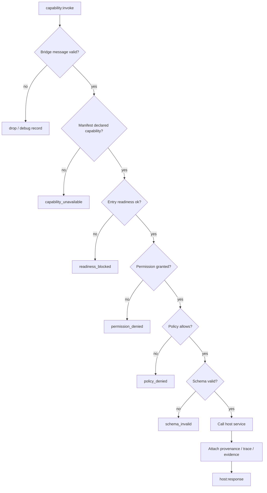

# P18 Typed Capability SDK Gate

更新时间：2026-05-16

状态：P18.0 文档计划已完成；P18.1 SDK facade / stable error / mock host 已完成最小代码契约；P18.2 Host Bridge typed router / stable error response 已完成；P18.3 Core capability adapters 已完成；P18.4 App-scoped Agent task SDK facade 已完成；P18.4-H AgentRuntime handoff gate 已完成；P18.5.1 Lime-side 内容工厂 SDK 回归已完成；P18.5.2 package-side read-only tests 已通过；P18.5-S Host Bridge SDK client 已完成 capability invoke、subscription、Host action 和 Host event contract；P18.5.3 package-side SDK facade / verify / dist 同步已完成；P18.6 Raw Worker 前 Gate 已完成；P17.5 Formal entry GUI smoke 已通过；完整 `verify:local` 已于 2026-05-16 07:33 通过，2026-05-16 10:53 SDK seam / handoff core 定向测试 5 files / 17 tests passed，`typecheck`、`test:contracts` 与 `lint` 当前会话复核通过；P18 功能完成，剩余 owner handoff / git 写集收口。

## 协作分工

P17.5 正式入口 smoke 已收口；P18 代码实施继续和 AgentRuntime / GUI 验证任务分工，避免抢同一运行环境或改同一底层投影。

| 分工 | 负责范围 | 暂不触碰 |
|---|---|---|
| P17.5 / 已收口 | 正式 `agent-apps` smoke、`scripts/agent-apps-smoke.mjs`、P17.5 evidence summary。 | 不把通过 smoke 扩大解释为 marketplace / 真实 delete-data / Cloud 管理台。 |
| AgentRuntime / 隔壁任务 | `AgentRuntimeThreadReadModel`、`agent_app_runtime_*` facade、artifact / evidence / handoff 投影、`artifact:created` refs、跨刷新 task 恢复、Host response 回写；`docs/roadmap/agentruntime/claw-capability-sharing.md` 进一步把 Claw `@` 能力收敛到 AgentRuntime capability catalog。 | 不改 Agent App SDK 路线图，不由 P18 复制 runtime read model；push subscribe、workspace patch producer、capability catalog service、Claw capability catalog 和真实桌面 GUI smoke 仍由 AgentRuntime 任务收口。 |
| P18 / 完成候选 | 上游 Agent App v0.4 Host Bridge 标准对齐、Typed Capability SDK gate、App-scoped Agent task 契约。P18.1 已落 SDK 类型、stable error、mock host 和 contract seam；P18.2 已收敛 Host Bridge typed router；P18.3 已完成 core adapters；P18.4 已完成 `lime.agent` SDK facade；P18.4-H 已完成 handoff gate；P18.5.1 已完成 Lime-side 内容工厂 SDK 回归；P18.5.2 已完成 package-side read-only tests；P18.5-S 已补 Host Bridge SDK client；P18.5.3 已完成真实 package verify 和 dist 同步；P18.6 已完成 raw worker 前 gate。 | 不启停隔壁 Tauri / Vite / DevBridge，不改 `src-tauri/*` / runtime facade，不改 `src/features/agent-app/runtime/agentRuntimeCapabilityHost*`，不进入 raw worker；后续只做 owner handoff / 提交边界，不再扩 P18 功能面。 |

收敛规则：P17.5 已解除正式入口 smoke 阻塞；P18 代码只从 SDK contract 最小面开始，不把 SDK gate 扩大成垂直内容系统。

## 协作接口边界

| 接口面 | 隔壁 AgentRuntime 提供 | P18 消费方式 | 防打架规则 |
|---|---|---|---|
| `lime.agent` task facade | `start / stream / get / cancel / retry / submitHostResponse / listTasks` 到 `agent_app_runtime_*`，并映射 `sessionId / turnId / requestId`。 | P18.1 已定义 SDK 类型和 mock 行为；P18.4 已包装成 typed adapter；P18.4-H 已消费隔壁运行证据。 | P18 不改 Rust command、不改 `src/lib/api/agentAppRuntime.ts`。 |
| task event projection | queued / progress / missing context / review / tool call / `artifact:created` / evidence / outcome / incident。 | SDK 固定 event union、stable error 和 mock fixtures；P18.4-H 已完成 handoff 校验，push subscribe 继续归 AgentRuntime owner。 | 不在 SDK 层重建 read model，不把轮询实现写进业务 App。 |
| storage / artifact / evidence write-back | 内容工厂已用声明类型写回 `lime.storage / lime.artifacts / lime.evidence`，AgentRuntime 负责事实投影。 | P18.3 只包装 typed adapter，自动带 provenance。 | 不新增第二套 artifact / evidence store，不写垂直 `content_factory_*` adapter。 |
| structured workspace patch | 内容工厂 App 已能消费 `workspacePatch / contentFactoryWorkspacePatch`；后端 producer contract 仍是 AgentRuntime 缺口。 | P18 先把 patch 作为可选 typed artifact/event，不把它当 P18.1 完成条件。 | 不由 SDK mock 伪造生产级 patch 成功；真实 producer 缺口回挂 AgentRuntime。 |
| capability catalog | `docs/roadmap/agentruntime/claw-capability-sharing.md` 规定 Chat `@命令`、Agent App `lime.agent.startTask`、Automation job 都只是 surface adapter；首批 capability hints 已可映射 Claw `*_skill_launch` metadata，独立 catalog service 未完成。 | P18 先在 SDK 层定义 `lime.tools / lime.knowledge / lime.agent` 能力声明与错误语义；把 capability sharing 作为 AgentRuntime owner 输入消费。 | 不复制 Claw `*_skill_launch.rs`，不把 capability hint 内置成 App 专用逻辑，不新增 `content_factory_*` 垂直后端能力。 |

## 2026-05-16 隔壁 AgentRuntime 输入

本轮只把隔壁更新作为 P18 设计输入，不抢它的代码面和验证链路。最新审计结论是：AgentRuntime 对 Agent App 已达到 current MVP，但不是完整产品化完成。

- `docs/roadmap/agentruntime/*` 已补充 Agent App Runtime Surface 事实：内容工厂实际 App 已把主生产结果和确认链结果写回 `lime.storage / lime.artifacts / lime.evidence`。
- `agent_app_runtime_start_task / cancel / get / submit_host_response` facade、Host Bridge `lime.agent` 适配、`artifact:created` refs 和跨刷新 task 恢复已经进入 done / first-cut 口径。
- `docs/roadmap/agentruntime/claw-capability-sharing.md` 新增 Claw capability 共享草案：Chat `@命令`、Agent App `lime.agent.startTask`、Automation job 都应作为 surface adapter 进入 AgentRuntime capability catalog；首刀已将 image / cover / research / report / pdf / summary capability hint 写入现有 Claw `*_skill_launch` metadata。
- 仍不能宣称整体完成的缺口是：后端 push subscribe / stream、`content_factory.workspace_patch` 后端 producer contract、独立 capability catalog service、真实桌面 GUI smoke。
- P18 不重新实现 artifact / evidence / handoff 读模型，也不新增第二套 write-back；P18 只把这些 host surface 包成 typed SDK contract。
- P18 不接管 Claw capability catalog owner，不复制 `*_skill_launch.rs`，也不新增 `content_factory_*` 垂直后端能力；内容工厂只能通过 `lime.agent` / capability intent 消费共享主链。
- P18.0 gap matrix 需要新增一列检查 `task:*`、`artifact:created`、`evidence:recorded`、`evidence:verified` 的事件语义、顺序、幂等键和跨刷新恢复边界。
- P18.1 已在不等待所有 AgentRuntime 缺口收口的前提下固定 SDK 类型、stable error 和 mock host，避免下游 App 继续手写私有 bridge。

## 背景

上游 `/Users/coso/Documents/dev/ai/limecloud/agentapp` 已发布 `agentapp-ref@0.4.0`，把 Host Bridge v1 明确为 sandboxed Agent App UI 的标准运行时事件协议。P17.4 已在 Lime Desktop 内完成 runtime surface / Host Bridge 的生产硬化，P17.5 已证明正式 `agent-apps` 入口能独立跑通 install、registration、launch、disable、uninstall rehearsal、runtime surface 和 flag-off。

P18 的问题不是继续扩大页面能力，而是把已经出现的 `lime.agentApp.bridge` 固定为 App 可依赖的 Typed Capability SDK：

- App 拥有业务 UI、workflow、storage schema、结构化结果写回和人工确认。
- Lime Desktop 拥有 Host runtime、Agent Runtime、Tool Broker、Knowledge、Artifact、Evidence、Policy、Secrets、cleanup 和 provenance。
- Lime Cloud / LimeCore 只作为 catalog、release、tenant enablement、policy defaults、ToolHub / gateway metadata 的 control-plane 输入，不成为默认 Agent Runtime。
- App 不能 import Lime 内部模块，也不能绕过 SDK 自建模型网关、凭证系统、权限系统、证据系统或工具调度器。

## 一句话目标

在扩展 raw worker 或更多业务 App 前，把 `@lime/app-sdk`、`lime.agentApp.bridge` 和 Lime host services 之间的 typed contract 固定下来，让 Agent App 可以稳定调用 Lime 能力，同时不依赖内部实现。

## 非目标

- 不做 marketplace、支付、审核流、Cloud 管理台。
- 不把 Cloud 变成默认 Agent Runtime。
- 不执行任意 raw worker bundle；P18 只允许 typed workflow / capability invoke。
- 不把通用 Chat 作为 Agent App 核心流程容器；Expert Chat 只是 entry 或嵌入式协作者。
- 不新增第二套 repository、installer、cleanup scanner 或 Agent Runtime。
- 不为了 P18 增加新的 Tauri command；除非现有 host service 无法表达且先完成命令边界审计。

## 核心原则

1. **SDK 暴露能力，不暴露实现**：App 只依赖 `@lime/app-sdk` 类型和稳定错误码。
2. **Bridge 只做传输**：`lime.agentApp.bridge` 是跨 iframe / sandbox 的消息协议，不保存执行事实。
3. **Host 最终裁决**：readiness、permission、policy、secret、provenance 和 cleanup 都由 Host 强制执行。
4. **声明先于调用**：manifest / entry / setup / overlay 声明通过后，capability 才能被调用。
5. **结果结构化写回**：Agent task 输出进入 `lime.storage`、`lime.artifacts`、`lime.evidence`，不靠用户复制聊天文本。
6. **全链路可 mock**：每个 capability 至少有 type、schema、mock host、contract test。
7. **失败可清理**：SDK 调用和写回必须带 appId、entryKey、packageHash、manifestHash、workspace / tenant 上下文。

## 架构图

```mermaid
flowchart TD
  AppUI[Agent App UI / Sandbox Frame] --> SDK[@lime/app-sdk Typed Facade]
  AppWorker[Typed Workflow / Future Worker] --> SDK
  SDK --> Bridge[lime.agentApp.bridge v1]
  Bridge --> Router[AgentAppCapabilityRouter]
  Router --> Guard[P14 Entry Guard / Readiness / Permission / Policy]
  Guard --> UI[Lime UI Host]
  Guard --> Storage[Storage Namespace Service]
  Guard --> Files[File Service]
  Guard --> Agent[AgentRuntime Surface]
  Guard --> Knowledge[Agent Knowledge Resolver]
  Guard --> Tools[Tool Broker / ToolHub]
  Guard --> Artifact[Artifact Store]
  Guard --> Evidence[Evidence Store]
  Guard --> Secrets[Secret Manager]
  Guard --> Cleanup[Lifecycle / Cleanup Evidence]
  Cloud[Lime Cloud Control Plane] --> Installer[Desktop Installer / Release Metadata]
  Installer --> Guard
```

## 边界表

| 层 | 负责 | 不负责 |
|---|---|---|
| `@lime/app-sdk` | TypeScript facade、调用参数类型、稳定错误码、mock host。 | 不 import Lime internal path，不执行模型 / 工具。 |
| Host Bridge v1 | ready、snapshot、theme、visibility、toast、navigate、download、capability invoke 传输。 | 不绕过 readiness / permission / policy，不返回假成功。 |
| Capability Router | 校验 appId、entryKey、origin、source、capability allowlist、requestId。 | 不拥有业务 UI，不做垂直业务逻辑。 |
| AgentRuntime Surface | App-scoped task、stream、cancel、retry、trace、evidence。 | 不把 Claw Chat 复制一套，不让 App 直接拿模型 API。 |
| App runtime package | UI、workflow、storage schema、业务状态和结果确认。 | 不保存 secret 明文，不访问宿主文件系统 / DB / Tauri API。 |
| Lime Cloud / LimeCore | catalog、release、tenant enablement、license、policy defaults。 | 不默认运行 Agent，不渲染 App UI，不接管本地 storage。 |

## Typed Capability Matrix

P18 的最小 SDK 不追求能力全覆盖，而是先固定调用语义、错误语义和 mock 语义。

| Capability | 最小调用 | P18 口径 |
|---|---|---|
| `lime.ui` | `toast`、`navigate`、`openExternal`、`download`、`getSnapshot` | 走 Host Bridge action；外链 / 下载必须校验协议、origin、权限。 |
| `lime.storage` | `table.get`、`table.insert`、`table.update`、`table.query` | 只写 App namespace；自动附加 provenance；schema 不匹配返回 stable error。 |
| `lime.files` | `pick`、`readRef` | 只接收 host file ref，不暴露 raw path。 |
| `lime.agent` | `startTask`、`streamTask`、`getTask`、`cancelTask`、`retryTask`、`submitHostResponse`、`listTasks` | 映射到 AgentRuntime Surface；不跳通用 Chat；P18.4 已补 typed adapter，P18.4-H 已对齐 handoff 运行证据。 |
| `lime.knowledge` | `search`、`bindStatus` | 只能访问 manifest / setup 声明的 Knowledge binding。 |
| `lime.tools` | `invoke`、`getProgress` | 通过 Tool Broker / ToolHub；policy 和 secret handle 由 Host 管。 |
| `lime.artifacts` | `create`、`open`、`export` | artifact 带 appId、entryKey、packageHash、manifestHash。 |
| `lime.workflow` | `start`、`checkpoint`、`awaitHuman` | P18 仍是 typed workflow；raw worker 进入后续 gate。 |
| `lime.policy` | `check`、`requestPermission` | UI prompt 不是最终授权；bridge 层必须强制。 |
| `lime.secrets` | `getRef`、`requestBinding` | App 只能拿 scoped handle，不能拿 secret value。 |
| `lime.evidence` | `record`、`linkArtifact` | 记录 task、tool、knowledge、artifact、eval 和 cleanup provenance。 |

## Bridge Envelope

Host Bridge 继续采用 v1 标准信封：

```ts
interface LimeAgentAppBridgeMessage {
  protocol: "lime.agentApp.bridge";
  version: 1;
  type: string;
  requestId?: string;
  appId: string;
  entryKey?: string;
  payload?: unknown;
}
```

P18 在 `capability:invoke` 内固定 SDK 调用信封：

```ts
interface LimeCapabilityInvokeRequest {
  capability: string;
  method: string;
  args: unknown;
  idempotencyKey?: string;
  expectedSchema?: unknown;
  provenance?: {
    appId: string;
    entryKey: string;
    packageHash: string;
    manifestHash: string;
  };
}

type LimeCapabilityInvokeResponse =
  | { ok: true; value: unknown; traceId?: string; evidenceId?: string }
  | { ok: false; error: LimeCapabilityError };
```

稳定错误码首版：

| 错误码 | 含义 |
|---|---|
| `capability_unavailable` | Host 不支持该 capability / method。 |
| `readiness_blocked` | App / entry readiness 未通过。 |
| `permission_denied` | 用户或租户未授权。 |
| `policy_denied` | 企业策略、成本、网络或工具策略阻断。 |
| `schema_invalid` | 请求参数或结果 schema 不匹配。 |
| `source_unverified` | package / manifest / provenance 不可信。 |
| `secret_required` | 缺必需 secret binding。 |
| `timeout` | 调用超时。 |
| `cancelled` | 用户或 Host 取消。 |
| `conflict` | 幂等键、版本或并发状态冲突。 |
| `upstream_failed` | 底层服务失败但边界仍完整。 |

## 时序图：SDK 初始化



## 时序图：App 内 Agent Task



## 流程图：Capability 调用裁决



## 用户故事

| 角色 | 用户故事 | 验收 |
|---|---|---|
| 业务用户 | 我在内容工厂页面内启动资料整理、文案生成和复盘，不需要跳回通用 Chat。 | App 内显示任务流、引用、错误、取消、重试和确认写回。 |
| App 开发者 | 我只依赖 `@lime/app-sdk` 类型和 mock host，就能本地测试 App 工作流。 | 不 import Lime internal path；mock / real host 的错误码一致。 |
| 平台维护者 | 我升级 storage、AgentRuntime 或 Tool Broker 时，不需要修改每个 App。 | SDK contract tests 通过；App 只感知兼容版本和稳定错误码。 |
| 企业管理员 | 我可以用 policy / tenant overlay 控制工具、secret、成本和 network。 | Bridge 层强制策略；UI 只展示结果，不承担最终授权。 |
| QA / 智能体 | 我能用 contract tests 和 GUI smoke 证明正式入口与 SDK 边界没有漂移。 | `src/features/agent-app` 无直接 `safeInvoke` / `invoke` / Tauri / raw Worker 越界。 |

## 用例

1. **内容工厂批量文案**：App 调 `lime.agent.startTask`，流式展示资料引用、工具调用和结构化草稿；用户确认后写入 `content_assets` 表和 `content_table` Artifact。
2. **知识绑定检查**：App 调 `lime.knowledge.bindStatus` / `search`，缺客户 Knowledge pack 时返回 `readiness_blocked` 或 `secret_required`，不落假数据。
3. **工具调用**：App 调 `lime.tools.invoke` 生成搜索或分析结果；Tool Broker 负责权限、进度和证据。
4. **受控下载**：App 调 `lime.ui.download` 导出报告；Host 校验同源 runtime asset / artifact permission 后执行。
5. **失败退出**：App disable 或 uninstall rehearsal 后，SDK 调用返回 blocked，并可导出 cleanup evidence / residual audit。

## 实施拆分

| 阶段 | 目标 | 主要产物 | 验收 |
|---|---|---|---|
| P18.0 | v0.4 标准差距收口 | 对齐 `agentapp-ref@0.4.0` Host Bridge v1、SDK typed API、错误码 gap matrix。 | 文档 diff check；不改运行代码。 |
| P18.1 | SDK 类型与 schema | 已完成：`sdk` types、capability invoke envelope、stable error enum、mock host。 | `capabilityContract` + `MockCapabilityHost` SDK contract tests；`typecheck`。 |
| P18.2 | Host Bridge router | 已完成：capability invoke typed envelope、`args` / `input` 兼容、requestId / idempotency / expectedSchema / provenance 透传、stable error response。 | bridge router / dispatcher / runtime page tests；未知 capability 不写假成功。 |
| P18.3 | Core capability adapters | 已完成：`lime.ui`、`storage`、`artifacts`、`evidence`、`knowledge`、`tools` typed adapter facade。 | adapter contract tests、namespace / provenance tests、typecheck、contracts。 |
| P18.4 | App-scoped Agent Task | 已完成：`lime.agent.startTask` / stream / get / cancel / retry / submitHostResponse / listTasks typed adapter，并覆盖 `task:*`、`artifact:created`、`evidence:*` 事件契约。 | App task adapter contract tests；不回跳通用 Chat；不重复实现 runtime read model。 |
| P18.4-H | AgentRuntime handoff gate | 已完成：对齐隔壁 current MVP 与剩余缺口，新增消费侧 handoff checklist，并明确 push subscribe、workspace patch producer、capability catalog、GUI smoke owner。 | 只做 SDK 消费侧 gate，不抢 AgentRuntime Rust / TS 修改。 |
| P18.5 | 内容工厂 SDK 化回归 | 已完成 Lime-side SDK regression、Host Bridge SDK client contract 和 package-side 只读 `npm test`；内容工厂 task / write-back / evidence 可由通用 facade 表达，也可穿过 Host Bridge v1。 | 下一刀等待 package owner 稳定后做 P18.5.3 package-side SDK facade / verify；不复刻内容工厂后端能力。 |
| P18.6 | Raw worker 前 gate | 已完成：明确 worker sandbox、resource limit、network / secret policy 进入后续 P19，并记录 P18 不执行 raw worker 的证据。 | P18 不执行 raw worker。 |

## P18.1 实施记录

P18.1 的最小目标是先固定 SDK contract，而不是把真实 AgentRuntime、ToolHub 或 storage adapter 全接完。本轮落地：

- `src/features/agent-app/sdk/capabilityContract.ts`：新增 `LimeCapabilityContractMap`、typed invoke request / response、provenance envelope、success / error response helper、invoker 和 mock transport。
- `src/features/agent-app/sdk/capabilityErrors.ts`：新增稳定错误码 `capability_unavailable / readiness_blocked / permission_denied / policy_denied / schema_invalid / source_unverified / secret_required / timeout / cancelled / conflict / upstream_failed`，并把旧边界错误映射到 stable error。
- `src/features/agent-app/sdk/capabilityContract.test.ts`：覆盖 typed envelope、stable error mapping、mock transport success / blocked error。
- `src/features/agent-app/sdk/MockCapabilityHost.test.ts`：补 mock host stable error parity 断言。
- `src/features/agent-app/index.ts`：导出 P18.1 SDK contract 类型与 helper，便于后续 App runtime / contract tests 复用。

已验证：

```bash
nice -n 10 npm test -- src/features/agent-app/sdk/capabilityContract.test.ts src/features/agent-app/sdk/MockCapabilityHost.test.ts
nice -n 10 npm run typecheck -- --pretty false
```

边界：P18.1 未修改 `src-tauri/*`、`src/lib/api/agentAppRuntime.ts`、`src/features/agent-app/runtime/agentRuntimeCapabilityHost*`、GUI smoke 脚本或 Cloud / LimeCore。

## P18.2 实施记录

P18.2 的最小目标是把 P18.1 typed contract 接到 Host Bridge router，并保持现有内容工厂 App 对 `response.result` 的兼容消费。本轮落地：

- `src/features/agent-app/runtime/hostBridge.ts`：`capability:invoke` 构建 typed `LimeCapabilityInvokeRequest`，支持 `args` 新信封和 `input` 旧信封兼容，透传 `idempotencyKey / expectedSchema / provenance`。
- `src/features/agent-app/runtime/hostBridge.ts`：Host success payload 固定为 `{ ok: true, value, result }`，其中 `value` 对齐 P18 typed response，`result` 保留给现有 App 消费。
- `src/features/agent-app/runtime/hostBridge.ts`：capability error payload 固定为 `{ ok: false, error, code, message, causeCode }`，旧错误码只进入 `causeCode`，App 对外只依赖 stable lowercase code。
- `src/features/agent-app/runtime/capabilityDispatcher.ts`：dispatcher 读取 `invokeRequest.args`，同时保留直接 `input` / legacy `args[0]` 兼容，不扩真实 AgentRuntime adapter。
- `src/features/agent-app/runtime/hostBridge.test.ts`、`src/features/agent-app/runtime/capabilityDispatcher.test.ts`、`src/features/agent-app/ui/AgentAppRuntimePage.test.tsx`：补齐 typed envelope、stable error response 和现有 runtime page 兼容断言。

已验证：

```bash
nice -n 10 npm test -- src/features/agent-app/sdk/capabilityContract.test.ts src/features/agent-app/sdk/MockCapabilityHost.test.ts src/features/agent-app/runtime/hostBridge.test.ts src/features/agent-app/runtime/capabilityDispatcher.test.ts src/features/agent-app/ui/AgentAppRuntimePage.test.tsx
nice -n 10 npm run typecheck -- --pretty false
nice -n 10 npm run test:contracts
git diff --check -- src/features/agent-app/sdk src/features/agent-app/runtime src/features/agent-app/ui/AgentAppRuntimePage.test.tsx src/features/agent-app/index.ts docs/roadmap/agentapp
rg -n "SceneApp|contentEngineering|sceneapp_|safeInvoke|invoke\\(|new Worker|Worker\\(" src/features/agent-app || true
```

边界：P18.2 未修改 `src-tauri/*`、`src/lib/api/agentAppRuntime.ts`、GUI smoke 脚本、Cloud / LimeCore，也不抢隔壁 AgentRuntime 的 Rust / facade / GUI 验证链路；`agentRuntimeCapabilityHost*` 的并行改动由隔壁任务负责。

## P18.3 实施记录

P18.3 的最小目标是先把 core capabilities 包成 App 可调用的 typed adapter facade，而不是新增第二套 store、ToolHub 或 UI runtime。本轮落地：

- `src/features/agent-app/sdk/capabilityAdapters.ts`：新增 `createLimeCoreCapabilityAdapters`，把 `lime.ui / lime.storage / lime.artifacts / lime.evidence / lime.knowledge / lime.tools` 包成 typed facade。
- `src/features/agent-app/sdk/capabilityAdapters.ts`：adapter 调用统一走 P18.1 `LimeCapabilityInvoker`，自动附加默认 provenance，并允许 per-call 覆盖 `requestId / idempotencyKey / expectedSchema / provenance`。
- `src/features/agent-app/sdk/capabilityAdapters.ts`：storage adapter 暴露 `namespace`，但不在 SDK 层重复实现真实 storage；写入仍由 Host / adapter owner 决定。
- `src/features/agent-app/sdk/capabilityAdapters.ts`：新增 `LimeCapabilityAdapterError`，把 mock / host 返回的 stable error 原样暴露给 App 调用方，避免把旧错误码重新变成业务判断。
- `src/features/agent-app/sdk/capabilityAdapters.test.ts`：覆盖 ui / storage / artifact / evidence / knowledge / tools typed request、namespace、provenance 与 stable error parity。
- `src/features/agent-app/index.ts`：导出 P18.3 adapter facade 与类型。
- `src/features/agent-app/types.ts`：补齐 `AgentAppTaskRequest` 对 `queueIfBusy / skipPreSubmitResume / runStartHooks` 的可选类型声明，和隔壁 AgentRuntime API / host surface 保持一致，解除全局 typecheck 阻塞。

已验证：

```bash
nice -n 10 npm test -- src/features/agent-app/sdk/capabilityAdapters.test.ts src/features/agent-app/sdk/capabilityContract.test.ts src/features/agent-app/sdk/MockCapabilityHost.test.ts src/features/agent-app/runtime/hostBridge.test.ts src/features/agent-app/runtime/capabilityDispatcher.test.ts src/features/agent-app/runtime/agentRuntimeCapabilityHost.test.ts src/features/agent-app/ui/AgentAppRuntimePage.test.tsx
nice -n 10 npm run typecheck -- --pretty false
nice -n 10 npm run test:contracts
git diff --check -- src/features/agent-app/sdk src/features/agent-app/index.ts docs/roadmap/agentapp
rg -n "SceneApp|contentEngineering|sceneapp_|safeInvoke|invoke\\(|new Worker|Worker\\(" src/features/agent-app || true
```

边界：P18.3 未新增真实 store、ToolHub、GUI smoke 脚本、Cloud / LimeCore，也未改 `agentRuntimeCapabilityHost*` 的实现逻辑；只对共享 `AgentAppTaskRequest` 做 additive 类型对齐。

## P18.4 实施记录

P18.4 的最小目标是把 `lime.agent` 暴露成 App 可依赖的 typed task adapter，而不是把 AgentRuntime read model、Rust facade 或 GUI smoke 验证链路搬进 SDK。本轮落地：

- `src/features/agent-app/sdk/capabilityAdapters.ts`：新增 `LimeAgentCapabilityAdapter`，覆盖 `startTask / streamTask / getTask / cancelTask / retryTask / submitHostResponse / listTasks`。
- `src/features/agent-app/sdk/capabilityAdapters.ts`：`createLimeCoreCapabilityAdapters` 新增 `agent` facade，统一走 P18.1 `LimeCapabilityInvoker` 和 P18.2 typed invoke envelope，自动带默认 provenance。
- `src/features/agent-app/sdk/capabilityAdapters.test.ts`：补 P18.4 App-scoped task contract fixture，覆盖 `queueIfBusy / skipPreSubmitResume / runStartHooks` 透传、Host response、cancel / retry / list，以及 `task:queued / task:progress / task:missingContextRequested / task:reviewRequested / task:toolCall / artifact:created / evidence:recorded / evidence:verified / task:completed / task:incident` 事件语义。
- `src/features/agent-app/index.ts`：导出 `LimeAgentCapabilityAdapter` 类型，便于 App SDK 使用方只依赖公开 facade。

已验证：

```bash
nice -n 10 npm test -- src/features/agent-app/sdk/capabilityAdapters.test.ts src/features/agent-app/sdk/capabilityContract.test.ts src/features/agent-app/sdk/MockCapabilityHost.test.ts src/features/agent-app/runtime/hostBridge.test.ts src/features/agent-app/runtime/capabilityDispatcher.test.ts src/features/agent-app/runtime/agentRuntimeCapabilityHost.test.ts src/features/agent-app/ui/AgentAppRuntimePage.test.tsx
nice -n 10 npm run typecheck -- --pretty false
nice -n 10 npm run test:contracts
git diff --check -- src/features/agent-app/sdk src/features/agent-app/index.ts docs/roadmap/agentapp
rg -n "SceneApp|contentEngineering|sceneapp_|safeInvoke|invoke\\(|new Worker|Worker\\(" src/features/agent-app || true
```

边界：P18.4 未修改 `src-tauri/*`、`src/lib/api/agentAppRuntime.ts`、`src/features/agent-app/runtime/agentRuntimeCapabilityHost*`、GUI smoke 脚本、DevBridge / Tauri / Vite 进程、Cloud / LimeCore；真实 runtime push subscribe、workspace patch producer、capability catalog 和桌面 GUI smoke 仍归 P18.4-H / 隔壁 AgentRuntime 收口。

## P18.4-H 实施记录

P18.4-H 的最小目标是做 Agent App 消费侧 handoff gate，而不是抢隔壁 AgentRuntime owner。本轮落地：

- `docs/roadmap/agentapp/p18-4-h-agentruntime-handoff-gate.md`：新增 prompt-to-artifact checklist，把 `lime.agent` facade、task request options、task event union、Host response、Artifact / Evidence refs、workspace patch、跨刷新恢复、no-private-bridge 和协作边界逐项映射到代码 / 测试 / 文档证据。
- 明确不能由 P18 SDK 伪造完成的缺口：后端 push subscribe / runtime event 主动推送、真实 Skill / Agent 端到端写出 workspace patch artifact、独立 capability catalog service、真实桌面 GUI smoke。
- 将 P18 下一刀从 P18.4-H 切到 P18.5：内容工厂 SDK 化回归，验证现有 content-factory package 只依赖 SDK facade 完成 App 内业务闭环。

已验证：

```bash
git diff --check -- docs/roadmap/agentapp
```

边界：P18.4-H 未修改 `src-tauri/*`、`src/lib/api/agentAppRuntime.ts`、`src/features/agent-app/runtime/agentRuntimeCapabilityHost*`、GUI smoke 脚本、DevBridge / Tauri / Vite 进程、Cloud / LimeCore。

## P18.5 实施记录

P18.5 的最小目标是证明内容工厂 App 可以只依赖 Lime 公开 SDK facade 完成 App 内业务闭环。本阶段先做不打架的 Lime-side 回归和 Host Bridge SDK client 目标收敛：

- `src/features/agent-app/sdk/contentFactorySdkRegression.test.ts`：新增内容工厂 SDK contract regression，模拟 `content.copy.generate` task、`task:missingContextRequested` Host response、`artifact:created` / `evidence:recorded` stream、`contentFactoryWorkspacePatch` payload、`lime.storage.set`、`lime.artifacts.create(content_batch)`、`lime.evidence.record(fact_grounding)`。
- `src/features/agent-app/sdk/hostBridgeClient.ts`：新增标准 Host Bridge SDK client，覆盖 `capability:invoke`、ready / snapshot / theme / visibility、toast / navigate / openExternal / download、`capability:subscribe / event / unsubscribe`、trusted origin、timeout、pending cleanup 和 stable error unwrap。
- `src/features/agent-app/sdk/hostBridgeClient.test.ts`：证明内容工厂主链可以穿过 Host Bridge v1，并覆盖 Host action / Host event / subscription contract。
- `src/features/agent-app/sdk/index.ts` 与 `src/features/agent-app/sdk/publicSdkSurface.test.ts`：新增 SDK-only public surface，固定后续正式 `@lime/app-sdk` / package-local shim 的窄导出清单，避免从 feature 总入口误导出 UI、installer、repository 或 runtime host 内部实现。
- `src/features/agent-app/index.test.ts`：固定 feature public entry 导出 `createLimeCoreCapabilityAdapters`、`createLimeHostBridgeCapabilityInvoker`、`LIME_AGENT_APP_BRIDGE_PROTOCOL` 与 `LIME_AGENT_APP_BRIDGE_VERSION`，防止外部 package 后续只能依赖深路径。
- `src/features/agent-app/runtime/hostBridge.ts`：仅做 `AgentAppTaskSubscription.timerId` 浏览器 timer 类型修正，解除 `typecheck` 阻塞，不改 task subscription runtime 行为。
- `docs/roadmap/agentapp/p18-5-content-factory-sdk-regression.md`：新增 P18.5 记录，说明 Lime-side regression 和 package-side read-only tests 已完成，并明确外部 `/Users/coso/Documents/dev/ai/limecloud/content-factory-app` 当前 dirty，暂不跨仓库改 package-side bridge wrapper。
- `docs/roadmap/agentapp/p18-5-3-package-sdk-migration-plan.md`：新增外部 package 迁移计划，固定推荐写集、迁移步骤、验收清单和回滚点。
- `docs/roadmap/agentapp/p18-completion-audit.md`：新增 completion audit，记录 P18.1-P18.6 证据、外部 package 阻塞、完整 `verify:local` 已通过和下一刀判定。

已验证：

```bash
nice -n 10 npm test -- src/features/agent-app/sdk/contentFactorySdkRegression.test.ts src/features/agent-app/sdk/capabilityAdapters.test.ts src/features/agent-app/sdk/capabilityContract.test.ts src/features/agent-app/sdk/MockCapabilityHost.test.ts src/features/agent-app/runtime/hostBridge.test.ts src/features/agent-app/runtime/capabilityDispatcher.test.ts src/features/agent-app/runtime/agentRuntimeCapabilityHost.test.ts src/features/agent-app/ui/AgentAppRuntimePage.test.tsx
nice -n 10 npm test -- src/features/agent-app/sdk/hostBridgeClient.test.ts src/features/agent-app/sdk/contentFactorySdkRegression.test.ts src/features/agent-app/sdk/capabilityAdapters.test.ts src/features/agent-app/sdk/capabilityContract.test.ts src/features/agent-app/sdk/MockCapabilityHost.test.ts src/features/agent-app/runtime/hostBridge.test.ts src/features/agent-app/runtime/capabilityDispatcher.test.ts src/features/agent-app/runtime/agentRuntimeCapabilityHost.test.ts src/features/agent-app/ui/AgentAppRuntimePage.test.tsx
nice -n 10 npm run typecheck -- --pretty false
nice -n 10 npm run test:contracts
nice -n 10 npm test -- src/features/agent-app/index.test.ts
nice -n 10 npm test -- src/features/agent-app/sdk/hostBridgeClient.test.ts src/features/agent-app/sdk/contentFactorySdkRegression.test.ts src/features/agent-app/index.test.ts
nice -n 10 npm run verify:local
cd /Users/coso/Documents/dev/ai/limecloud/content-factory-app && nice -n 10 npm test
git diff --check -- src/features/agent-app/sdk src/features/agent-app/runtime/hostBridge.ts src/features/agent-app/index.ts src/features/agent-app/index.test.ts docs/roadmap/agentapp
rg -n "SceneApp|contentEngineering|sceneapp_|safeInvoke|invoke\\(|new Worker|Worker\\(" src/features/agent-app || true
```

2026-05-16 09:22 当前会话补充复核：

- Lime-side SDK seam 最小集：`hostBridgeClient.test.ts`、`contentFactorySdkRegression.test.ts`、`index.test.ts`，3 files / 8 tests passed。
- Agent App feature island 全量定向测试：`npm test -- src/features/agent-app`，35 files / 173 tests passed。
- 外部 `content-factory-app` 只读 `npm test`：46 tests passed。
- Lime `typecheck` 与 `test:contracts`：均通过。
- 外部 package 仍有 39 个 dirty / untracked 条目；`src/ui/host-bridge.js` 仍包含 `pendingRequests / buildMessage / window.parent.postMessage / requestHostBridge / capability:invoke / capability:subscribe / capability:event`，未出现 `createLimeHostBridgeCapabilityInvoker` 或 `createLimeCoreCapabilityAdapters`。

边界：P18.5.1 / P18.5.2 / P18.5-S 未修改外部 content-factory package、`src-tauri/*`、`src/lib/api/agentAppRuntime.ts`、`src/features/agent-app/runtime/agentRuntimeCapabilityHost*`、GUI smoke 脚本、DevBridge / Tauri / Vite 进程、Cloud / LimeCore；`hostBridge.ts` 仅有 timer 类型修正用于恢复 `typecheck`，`index.test.ts` 只固定 public SDK export seam。后续 P18.5.3 已在 10:55 完成真实 package verify / dist 同步；完整 `verify:local` 已于 2026-05-16 07:33 端到端通过，不再是当前阻塞。

## P18.6 实施记录

P18.6 的目标是关闭 P18 阶段对 raw worker 的误解：P18 只提供受控 workflow DSL 和 typed capability SDK，不执行 App package 自带 raw worker bundle。本轮落地：

- `docs/roadmap/agentapp/p18-6-raw-worker-pre-gate.md`：新增 raw worker 前 gate，映射 runtime policy、workflow runtime、runtime package loader、entry runtime guard、feature flag 和 feature-island boundary scan 证据。
- 明确 raw worker sandbox、resource limits、network policy、secret policy、worker storage / artifact / evidence 写回和 GUI / security tests 全部后移到 P19 以后。

已验证：

```bash
nice -n 10 npm test -- src/features/agent-app/runtime/workflowRuntimeHost.test.ts src/features/agent-app/featureFlag.test.ts src/features/agent-app/runtime/runtimePackageLoader.test.ts src/features/agent-app/runtime/entryRuntimeGuard.test.ts
rg -n "SceneApp|contentEngineering|sceneapp_|safeInvoke|invoke\\(|new Worker|Worker\\(" src/features/agent-app || true
```

边界：P18.6 未新增 worker runtime、未执行 raw worker、未新增 network / filesystem / secret 通道，也未修改 Cloud / LimeCore / Tauri command。

## 验收标准

- App UI / workflow 只能通过 `@lime/app-sdk` / Host Bridge 调 Lime 能力。
- 每个 capability 调用都有类型、schema、mock、稳定错误码和 contract test。
- `capability:invoke` 统一经过 manifest 声明、entry readiness、permission、policy、provenance。
- `lime.agent` / `lime.workflow` 进入 AgentRuntime Surface，不返回无 provenance 的模型文本。
- storage、artifact、evidence、task、trace、secret binding 都按 app namespace 隔离。
- P17.5 正式入口 smoke 通过后，P18 新增能力不降低 install / launch / disable / uninstall rehearsal / flag-off 证据。
- feature island 仍不直接出现 `safeInvoke` / `invoke(` / `tauri::` / `generate_handler` / raw `Worker(` 越界；2026-05-16 08:33 当前会话重跑边界扫描仍无输出。

## 最小验证命令

P18.0 文档阶段：

```bash
git diff --check -- docs/roadmap/agentapp
rg -n "SceneApp|contentEngineering|sceneapp_|safeInvoke|invoke\\(|new Worker|Worker\\(" src/features/agent-app || true
```

P18 代码阶段按改动扩大：

```bash
npm run test:contracts
npm run typecheck
npm run smoke:agent-apps -- --timeout-ms 300000 --interval-ms 1000
npm run verify:gui-smoke -- --reuse-running --timeout-ms 300000
```

如果 P18 引入或修改 Tauri command，必须同步前端 gateway、Rust handler、治理目录册和 mock priority，并执行 `npm run test:contracts`。

## 风险与应对

| 风险 | 影响 | 应对 |
|---|---|---|
| SDK 过厚，变成 Lime internal API 重导出。 | App 绑定内部实现，升级成本高。 | 只暴露 capability facade；禁止 internal import。 |
| SDK 过薄，App 重复造底座。 | 每个 App 重复做 storage、tool、evidence。 | P18 优先封装高频底座和稳定错误语义。 |
| Bridge 被当成私有协议滥用。 | 每个 App 自定义 postMessage，无法治理。 | App 作者只调用 SDK；Host Bridge 保持标准 v1 信封。 |
| Agent task 退化为模型 API。 | 丢失 trace、tool、knowledge、evidence。 | `lime.agent` 必须走 AgentRuntime Surface。 |
| P18 把 P17.5 证据扩大解释。 | 误以为已可发布 marketplace / Cloud 管理台。 | P17.5 只证明正式入口 smoke；P18 仍按 SDK gate 最小面推进。 |
| 与隔壁任务改同一文件。 | 冲突或覆盖。 | P18 不改 AgentRuntime Rust 投影和运行中 GUI 验证链路。 |

## 决策点

| 决策点 | 时间 | 判断问题 | Go 条件 | No-Go 动作 |
|---|---|---|---|---|
| D17 | P17.5 后 | 正式入口 smoke 是否稳定？ | 已通过：独立 `smoke:agent-apps` 输出 summary。 | 如后续回归失败，不继续扩大 SDK，先修正式入口。 |
| D18 | P18.2 后 | Host Bridge typed router 是否足够稳定？ | 已通过：source / origin / appId / entryKey / requestId / typed envelope / stable error mapping 均有测试。 | 如回归失败，暂停 capability adapter 扩展，先修 router。 |
| D19 | P18.4 后 | App-scoped Agent task 是否真正进入 AgentRuntime Surface？ | task / trace / evidence 可追溯，App 内可 stream / cancel / retry / submitHostResponse / write-back，并完成 P18.4-H handoff gate。 | 不开放更多 workflow / worker 能力。 |
| D20 | P18 完成 | SDK 是否足够支撑更多 Agent App？ | types / schema / mock / contract / GUI smoke 均有证据，且外部 `content-factory-app` 已从手写 bridge wrapper 收敛到标准 SDK facade，并完成 package verify / Lime regression。 | 已满足；进入 owner handoff / 提交边界，不进入 raw worker 或 marketplace。 |

## 下一刀口径

P18.0 文档计划、P18.1 SDK contract、P18.2 Host Bridge typed router、P18.3 Core capability adapters、P18.4 App-scoped Agent task SDK facade、P18.4-H AgentRuntime handoff gate、P18.5.1 Lime-side 内容工厂 SDK 回归、P18.5.2 package-side read-only tests、P18.5-S Host Bridge SDK client、P18.5.3 package-side SDK facade / verify / dist 同步与 P18.6 Raw Worker 前 Gate 已完成，完整 `verify:local` 已于 2026-05-16 07:33 端到端通过，2026-05-16 10:53 SDK seam / handoff core 定向测试 5 files / 17 tests passed，`typecheck`、`test:contracts` 与 `lint` 当前会话复核通过。下一刀只做 owner handoff / 提交边界，不继续扩大 P18 功能面。

P18.5 允许范围：

- `src/features/agent-app/sdk/*`：如内容工厂 package 消费 SDK 时发现 facade 缺口，只补通用 SDK contract，不写垂直业务 adapter。
- `src/features/agent-app/runtime/*test.ts`、`ui/*test.tsx`：只补 App 内闭环消费侧回归，不改 runtime owner。
- `/Users/coso/Documents/dev/ai/limecloud/content-factory-app`：仅在 package owner 稳定且确认不覆盖隔壁改动后，做 package-side SDK facade / verify。
- `docs/roadmap/agentapp/*`：同步记录内容工厂 SDK 化证据和剩余缺口。

P18.5 暂不触碰：

- `src-tauri/*`、`src/lib/api/agentAppRuntime.ts`、`src/features/agent-app/runtime/agentRuntimeCapabilityHost*`。
- GUI smoke 脚本、DevBridge / Tauri / Vite 进程、Cloud / LimeCore。
- raw Worker、marketplace、真实 delete-data、垂直内容工厂专用命令。
