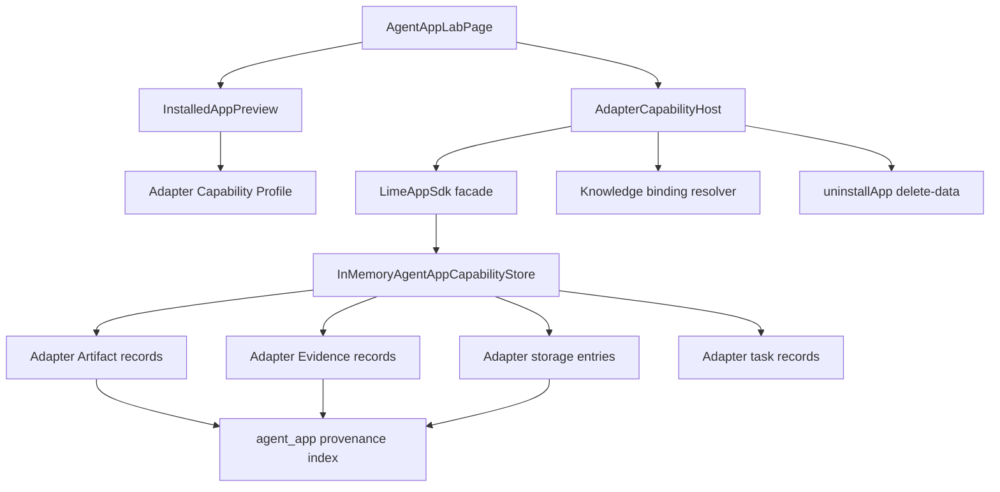
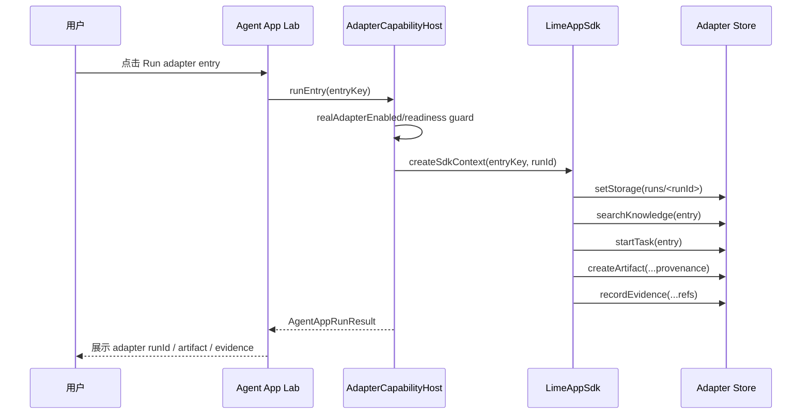

# Agent App P2 Adapter Capability Host 技术设计

更新时间：2026-05-15

## 一句话目标

P2 在 P1 mock host 之后增加一个仍默认关闭的 adapter host：不执行 App UI / worker、不改 AgentChat 主流程，只把 `lime.storage`、`lime.artifacts`、`lime.evidence` 从硬编码 mock 行为推进到可替换的本地 adapter store，并证明产物可以按 `agent_app` provenance 查询和卸载清理。

## 范围

| 范围 | 做 | 不做 |
|---|---|---|
| Adapter Host | 新增 `AdapterCapabilityHost`，复用 `CapabilityHost` 接口。 | 不接正式 Artifact 主 schema，不写全局 registry。 |
| Adapter Store | 新增 `InMemoryAgentAppCapabilityStore`，按 appId / entryKey / workflowRunId 查询 storage、Artifact、Evidence、Task。 | 不把实验数据写入真实用户文件目录。 |
| Knowledge Adapter | `lime.knowledge.search` 从 App knowledge bindings 中只读解析候选资料。 | 不访问真实项目知识库、不做网络检索。 |
| Agent Adapter | `lime.agent.startTask / cancelTask / getTask` 记录本地任务 trace。 | 不修改 AgentChat 主流程、不提交真实模型 turn。 |
| Capability Profile | 新增 `buildAdapterCapabilityProfile`，`storage / artifacts / evidence / knowledge / agent` 标记为 `adapter`，其余能力保留 mock readiness。 | 不声明 UI / worker runtime 已可执行。 |
| Feature Flag | 新增 `VITE_LIME_AGENT_APP_REAL_ADAPTER=1` 与 `realAdapterEnabled`。 | 默认不启用，不影响主产品路径。 |
| Lab UI | real adapter 开启后使用 adapter host 运行 entry，展示 adapter artifact / evidence。 | 不把 App entry 放入正式命令面板。 |
| Cleanup | `delete-data` 清理 adapter storage、artifact、evidence refs。 | 不执行真实文件删除。 |

## Feature Flag

```text
VITE_LIME_AGENT_APP_REAL_ADAPTER=1
```

或测试注入：

```ts
resolveAgentAppHostFlags({ realAdapterEnabled: true })
```

规则：

1. `realAdapterEnabled=false` 时，P2 adapter host 完全不可运行。
2. `realAdapterEnabled=true` 时，自动打开 Lab / local package / projection / readiness / cleanup dry-run / local storage capability。
3. `mockSdkEnabled` 不会被自动打开；如果 mock 和 adapter 同时开启，Lab 优先使用 adapter host。
4. `uiRuntimeEnabled`、`workerRuntimeEnabled`、`cloudBootstrapEnabled` 仍保持关闭。

## 架构图



## 运行时序



## 用例

| 用例 | 验收 |
|---|---|
| 开关关闭 | `AdapterCapabilityHost.runEntry` 抛 `FEATURE_DISABLED`。 |
| 开关开启 | 点击 `dashboard` 生成 `adapter-artifact-*` 与 `adapter-evidence-*`。 |
| Workflow entry | 点击 `content_scenario_planning` 生成 knowledge search result 与 `adapter-task-*` trace。 |
| Provenance 查询 | `getArtifacts({ appId })`、`getEvidence({ entryKey })`、`getStorageEntries({ workflowRunId })`、`getTasks({ entryKey })` 能命中本次运行数据。 |
| 任务取消 | `sdk.agent.cancelTask(taskId)` 可把 running task 标记为 cancelled 并追加 trace。 |
| 卸载 delete-data | 返回 deleted targets，覆盖 package、projection、readiness、storage namespace、adapter storage、artifact、evidence、task，并清空 adapter store。 |
| 主路径隔离 | 不新增 Tauri command，不写正式命令面板，不执行 App UI / worker。 |

## 文件边界

```text
src/features/agent-app/
├── adapters/
│   ├── AdapterCapabilityHost.ts
│   ├── AdapterCapabilityHost.test.ts
│   ├── InMemoryAgentAppCapabilityStore.ts
│   └── adapterCapabilityProfile.ts
├── sdk/
│   ├── CapabilityHost.ts
│   └── provenanceQuery.ts
└── ui/
    └── AgentAppLabPage.tsx
```

## P2 不变量

1. P2 adapter host 只验证 capability facade 与 adapter seam，不代表正式 Artifact / Evidence Store 已接入。
2. P2 不改 AgentChat、Skill Catalog、Artifact 主 schema 或 command registry。
3. P2 的 adapter store 必须可以整体删除；失败时只需移除 `adapters/`、feature flag 和 Lab 分支。
4. 所有 adapter 产物和任务必须带 `agent_app` provenance，支持按 appId / entryKey / workflowRunId 查询。
5. P2 仍保持 UI / worker runtime 关闭，避免把未沙箱化 App 代码带入主路径。
