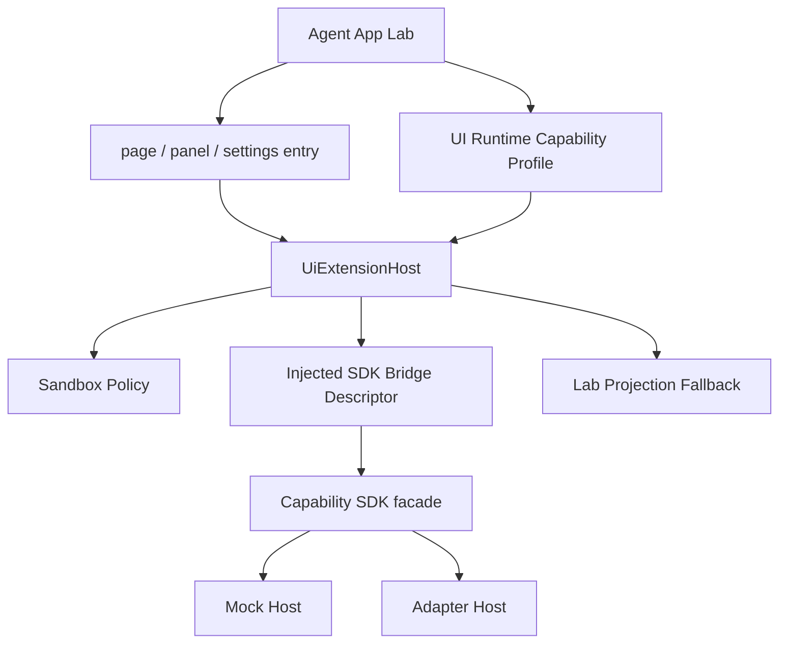
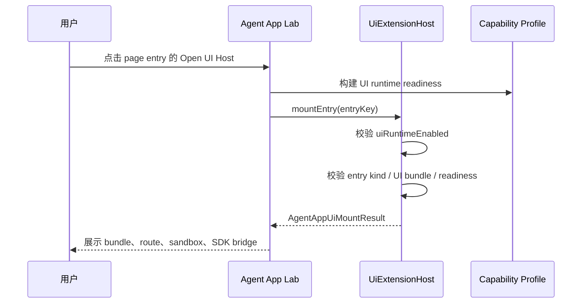

# Agent App P3 UI Extension Host 技术设计

更新时间：2026-05-15

## 一句话目标

P3.1 在 P2 adapter 之后增加一个仍默认关闭的受控 UI Host：App 可以拥有自己的 `page / panel / settings` UI 表现形式，但 UI 只能在 Lab 实验岛里挂载，只能拿到 injected SDK bridge，不能注册主路由、不能访问 raw Tauri / Node API、不能执行 worker。

## 范围

| 范围 | 做 | 不做 |
|---|---|---|
| UI Runtime Flag | 新增 `VITE_LIME_AGENT_APP_UI_RUNTIME=1` 与 `uiRuntimeEnabled`。 | 不默认开启，不自动进入正式导航。 |
| Capability Profile | `buildUiRuntimeCapabilityProfile` 将 `lime.ui` 标记为 `native`，可叠加 mock 或 adapter capability。 | 不把 worker runtime 一起打开。 |
| UI Host | `UiExtensionHost.mountEntry()` 只允许 `page / panel / settings` entry。 | 不执行任意 JS、不加载远程资源、不运行 npm 依赖。 |
| Sandbox Contract | 输出 sandbox policy，明确阻断 raw Tauri、Node、未声明网络、下载和弹窗。 | 不把安全只做成 UI 提示。 |
| SDK Bridge | 输出 injected SDK bridge descriptor，只暴露 readiness 允许的 capability。 | App 不能 import Lime internal modules。 |
| Lab UI | Lab 中可点击 page entry 打开 UI Host 预览，并展示 bundle、route、sandbox、SDK bridge。 | 不修改 Workspace layout 或正式命令面板。 |
| Tests | 覆盖 flag、host mount、非 UI entry 拒绝、Lab UI 可视化。 | 不做完整业务 App UI。 |

## Feature Flag

```text
VITE_LIME_AGENT_APP_UI_RUNTIME=1
```

规则：

1. `uiRuntimeEnabled=false` 时，`UiExtensionHost.mountEntry()` 必须抛 `FEATURE_DISABLED`。
2. `uiRuntimeEnabled=true` 时，只自动打开 Lab / local package / projection / readiness / cleanup dry-run。
3. P3 不自动打开 `workerRuntimeEnabled`；worker 仍需要 P4 单独设计。
4. 若同时打开 `realAdapterEnabled=true`，UI Host 使用 adapter capability readiness；若只开 UI runtime，其他 capability 仍可能被 readiness 阻塞。
5. 关闭 `uiRuntimeEnabled` 后，所有 App UI 回退 Lab projection 展示。

## 架构图



关键点：

- `UiExtensionHost` 只负责挂载契约与边界，不拥有业务状态。
- `buildUiRuntimeCapabilityProfile` 只把 `lime.ui` 变成 native；其他能力仍来自 mock / adapter。
- `AgentAppLabPage` 只显示 P3 实验入口，不把 App entry 写入主产品路由。

## 运行时序



## 用例

| 用例 | 验收 |
|---|---|
| 开关关闭 | `mountEntry("dashboard")` 抛 `FEATURE_DISABLED`。 |
| Page entry | `mountEntry("dashboard")` 返回 `entryKind=page`、`bundlePath=./dist/ui`、`route=/dashboard`。 |
| Sandbox | `allowRawTauriApi=false`、`allowNodeApi=false`、`allowNetworkAccess=false`。 |
| SDK Bridge | 只列出 readiness 支持且启用的 capability，raw Tauri / Node 永远为 false。 |
| 非 UI entry | `mountEntry("content_scenario_planning")` 抛 `UI_ENTRY_UNSUPPORTED`。 |
| Lab UI | 开启 UI runtime 后，Entry 卡片出现 Open UI Host，面板展示 sandbox 与 SDK bridge。 |
| 主路径隔离 | 不新增 Tauri command，不注册主路由，不执行 App worker。 |

## 文件边界

```text
src/features/agent-app/
├── runtime/
│   ├── uiExtensionHost.ts
│   ├── uiExtensionHost.test.ts
│   └── uiRuntimeCapabilityProfile.ts
├── ui/
│   └── AgentAppLabPage.tsx
├── featureFlag.ts
└── types.ts
```

## P3 不变量

1. UI Host 是实验岛能力，不是正式 App 路由系统。
2. UI Host 不能绕过 Capability SDK；所有能力都必须经 injected SDK bridge。
3. UI Host 关闭后必须回退只读 projection，不影响 Chat、Skill、Artifact、Workspace 主路径。
4. P3 不执行 worker，不支持任意 JS worker、native binary、任意网络和任意文件访问。
5. 进入 P4 前，必须继续证明业务状态、Artifact、Evidence、cleanup 都仍按 app namespace 可追踪、可删除。
