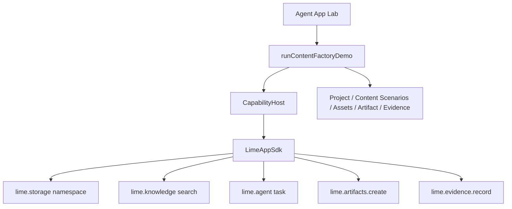
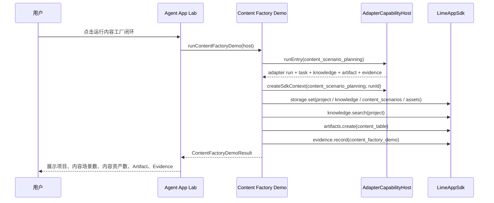

# Agent App P4 APP 内容工厂最小闭环

更新时间：2026-05-15

## 一句话目标

P4.1 用 APP 内容工厂验证 Agent App 不是专家聊天框，也不是 Markdown 声明，而是可以通过 Capability SDK 跑通自己的业务流程：创建项目、绑定知识、规划内容场景、生成内容资产、保存内容表 Artifact、记录 Evidence，并在卸载 delete-data 时可清理。

## 范围

| 范围 | 做 | 不做 |
|---|---|---|
| 业务闭环 | `runContentFactoryDemo()` 编排项目、知识、内容场景、内容资产、Artifact、Evidence。 | 不做完整 SaaS、不做外部平台 API。 |
| SDK 边界 | 只通过 `CapabilityHost` / `LimeAppSdk` 调用 storage、knowledge、agent、artifacts、evidence。 | 不 import Lime 内部 store、AgentChat 或 Artifact 主 schema。 |
| Storage | 写入 `projects/*`、`knowledge-bindings/*`、`content_scenarios/*`、`content-assets/*`。 | 不新增 Lime Core 业务表。 |
| Artifact | 生成 `content_table` 实验 Artifact。 | 不接正式 Artifact catalog。 |
| Evidence | 记录 `content_factory_demo`，refs 串联内容表、P2 adapter 产物、Evidence 和 task。 | 不伪造外部来源。 |
| Lab UI | Adapter 模式下展示 P4 demo 按钮和结果统计。 | 不进入正式主导航。 |
| Cleanup | 复用 adapter store delete-data 清理 storage、artifact、evidence、task。 | 不删除非 Agent App 数据。 |

## 架构图



## 运行时序



## 验收

| 用例 | 验收 |
|---|---|
| 项目创建 | `projects/<projectId>` 写入 App namespace storage。 |
| 知识绑定 | `knowledge-bindings/<projectId>` 保存 `agentknowledge` binding 结果。 |
| 内容场景规划 | `content_scenarios/<projectId>` 保存场景、痛点、解决方案、决策阶段、标签。 |
| 内容资产 | `content-assets/<projectId>` 保存平台、格式、标题、正文、评分。 |
| 内容表 | Artifact kind 为 `content_table`，带 `agent_app` provenance。 |
| Evidence | Evidence kind 为 `content_factory_demo`，refs 包含内容表、adapter artifact、adapter evidence、task。 |
| 清理 | delete-data 后 storage、artifact、evidence、task 均清空。 |
| 隔离 | 不新增 Tauri command，不修改 AgentChat / Skill Catalog / Artifact 主 schema。 |

## 文件边界

```text
src/features/agent-app/
├── runtime/
│   ├── contentFactoryDemo.ts
│   └── contentFactoryDemo.test.ts
└── ui/
    └── AgentAppLabPage.tsx
```

## P4.1 不变量

1. APP 内容工厂只是 Agent App 平台验证样板，不进入 Lime Core 垂直功能。
2. 业务状态必须写入 App namespace，不新增全局业务表。
3. 所有产物必须带 `sourceKind: agent_app` provenance。
4. cleanup / uninstall 必须覆盖 P4 demo 写入的数据。
5. P4.1 仍不等于完整内容系统；worker runtime、真实文件解析、批量生成、质量评分和 Cloud bootstrap 仍在后续阶段。

## P4.2 增量

P4.2 已把同一内容工厂闭环迁移到受控 workflow runtime 可执行路径：

- `runContentFactoryDemo({ workflowRuntime })` 使用 `WorkflowRuntimeHost.runWorkflow()` 执行 `content_factory_demo` definition。
- workflow 只允许白名单 DSL step，不执行 App package raw worker。
- `workerRuntimeEnabled` 受控开启，关闭时返回 `WORKFLOW_RUNTIME_DISABLED`。
- Lab 展示 workflow status、trace count、关键 step、raw worker / network block 状态。
- delete-data 清理仍依赖 `CapabilityHost` 写入的 storage、Artifact、Evidence 和 Task，不新增独立 runtime store。

详见 [p4-workflow-runtime.md](./p4-workflow-runtime.md)。
