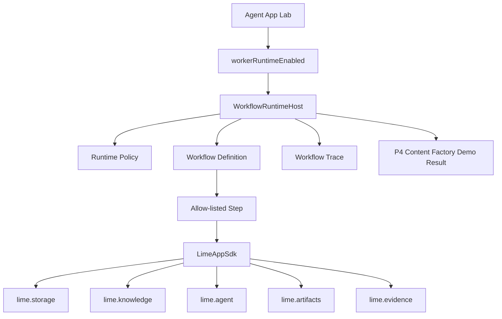
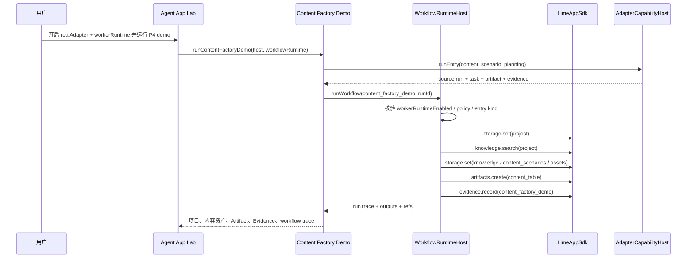
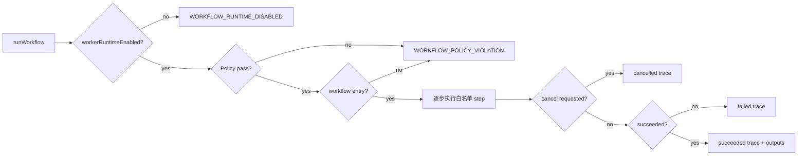

# Agent App P4.2 受控 Workflow Runtime

更新时间：2026-05-15

## 一句话目标

P4.2 把 P4.1 的“内置 demo 编排”推进为可执行的受控 workflow runtime：App 仍不能执行 raw worker bundle 或任意 JS，只能通过 Lime Desktop 提供的白名单 DSL step 调用 Capability SDK，并产出可取消、可追溯、可清理的运行记录。

## 背景

P4.1 已证明 内容工厂可以作为 Product-level Agent App 跑通项目、知识、内容场景、内容资产、Artifact 和 Evidence；但它仍像一段内置 TypeScript 编排。下一步如果直接执行 App package 里的 worker，会过早暴露安全、资源、权限和清理风险。

因此 P4.2 先做“受控 workflow DSL runner”：

- 只执行 `storage.set`、`knowledge.search`、`agent.startTask`、`artifacts.create`、`evidence.record` 等白名单 step。
- `workerRuntimeEnabled` 默认关闭，开启后仍不执行 raw worker bundle。
- 每个 step 通过 `CapabilityHost` / `LimeAppSdk` 调用能力，不 import Lime 内部模块。
- runtime trace 只记录在 Lab 结果中；业务数据仍写入 App namespace，继续由 delete-data 清理。

## 目标与收益

| 目标 | 收益 |
|---|---|
| 把业务流程从散落的内置函数收敛成 workflow definition。 | 后续 App package 可以由 manifest / DSL 编译到同一 runner，避免每个 App 重复造 orchestration。 |
| 建立 runtime policy。 | 在真正 worker sandbox 前先固定安全边界，降低未来失败后清理成本。 |
| 建立 trace / cancel seam。 | UI 可以展示每一步执行结果，后续可接暂停、重试、回滚和 Evidence 归档。 |
| 继续复用 Capability SDK。 | App 能力调用层稳定，后续 SDK 升级不需要重写每个 App。 |
| 保持实验岛。 | 不污染 AgentChat、Skill Catalog、Artifact 主 schema 和 Workspace 主路径。 |

## 非目标

1. 不执行 App package 中的任意 JS / worker bundle。
2. 不新增 Tauri command。
3. 不把 workflow 注册进正式命令面板或 Workspace 主路由。
4. 不实现完整内容工厂 SaaS。
5. 不让 Lime Cloud / LimeCore 运行默认 Agent。

## 架构图



## 时序图



## 流程图



## 用户故事

| 角色 | 故事 | 验收 |
|---|---|---|
| App 开发者 | 我希望把内容工厂流程声明成 workflow step，而不是写死在 Lime 内部。 | `runContentFactoryDemo()` 可通过 `WorkflowRuntimeHost` 执行 `content_factory_demo`。 |
| Lime 平台维护者 | 我希望 workflow 只能调用 SDK 能力，不直接碰内部 store。 | runner 只依赖 `CapabilityHost` / `LimeAppSdk`。 |
| 安全审查者 | 我希望 raw worker、外部代码、网络、文件系统默认被阻断。 | policy 固定 `allowRawWorker=false`、`allowExternalCode=false`、`allowNetworkAccess=false`、`allowFileSystemAccess=false`。 |
| 产品使用者 | 我希望看到 workflow 每一步是否成功。 | Lab 在 P4 demo 结果里展示 workflow status、trace count 和关键 step。 |
| 失败清理负责人 | 我希望实验失败后能删除业务数据。 | workflow 写入的 storage / artifact / evidence 仍由 adapter delete-data 清理。 |

## 当前落地

| 文件 | 作用 |
|---|---|
| `src/features/agent-app/runtime/runtimePolicy.ts` | 定义白名单 step kind 与默认 runtime policy。 |
| `src/features/agent-app/runtime/workflowRuntimeHost.ts` | 执行受控 workflow、生成 trace、支持 step 间取消。 |
| `src/features/agent-app/runtime/workflowRuntimeCapabilityProfile.ts` | 在 `workerRuntimeEnabled=true` 时把 `lime.workflow` 标记为 native。 |
| `src/features/agent-app/runtime/contentFactoryDemo.ts` | 支持把 P4 demo 迁移到受控 workflow DSL。 |
| `src/features/agent-app/ui/AgentAppLabPage.tsx` | Lab 展示 P4.2 policy hint、trace count 和关键 step。 |
| `src/i18n/resources/*/agent.json` | 补齐五语言 UI 文案。 |

## Runtime Policy

```ts
{
  maxSteps: 24,
  maxTraceEvents: 96,
  allowedStepKinds: [
    "storage.set",
    "knowledge.search",
    "agent.startTask",
    "artifacts.create",
    "evidence.record"
  ],
  allowRawWorker: false,
  allowExternalCode: false,
  allowNetworkAccess: false,
  allowFileSystemAccess: false
}
```

## 用例

| 用例 | 结果 |
|---|---|
| workflow runtime 默认关闭 | `WorkflowRuntimeHost.runWorkflow()` 返回 `WORKFLOW_RUNTIME_DISABLED`。 |
| 运行内容工厂 P4 demo | 生成 project、knowledge binding、content_scenarios、content assets、content table Artifact、Evidence 和 workflow trace。 |
| policy 禁止某类 step | 返回 `WORKFLOW_POLICY_VIOLATION`，不执行后续 step。 |
| step 间取消 | runtime 返回 `cancelled`，已完成 step 的数据保留并可由 delete-data 清理，后续 Artifact 不生成。 |
| raw worker / network 类 step | 被 policy 拒绝，不进入执行阶段。 |

## 清理与失败退出

P4.2 不新增独立持久化 runtime store。workflow 产生的业务数据全部通过 SDK 写入 App namespace：

- `projects/*`
- `knowledge-bindings/*`
- `content_scenarios/*`
- `content-assets/*`
- `content_table` Artifact
- `content_factory_demo` Evidence

如果路线失败，关闭 `VITE_LIME_AGENT_APP_WORKFLOW_RUNTIME` / `workerRuntimeEnabled` 即可让 workflow runner 失效；delete-data 仍由 `AdapterCapabilityHost.uninstall()` 清理 storage、Artifact、Evidence、Task。

## 验收命令

```bash
npm run test -- \
  src/features/agent-app/runtime/workflowRuntimeHost.test.ts \
  src/features/agent-app/runtime/contentFactoryDemo.test.ts \
  src/features/agent-app/ui/AgentAppLabPage.test.tsx
```

进入正式主路径前仍需补：真实 worker sandbox、资源限额、长期 trace 持久化、UI 级取消按钮、package hash 校验和 Cloud bootstrap。
