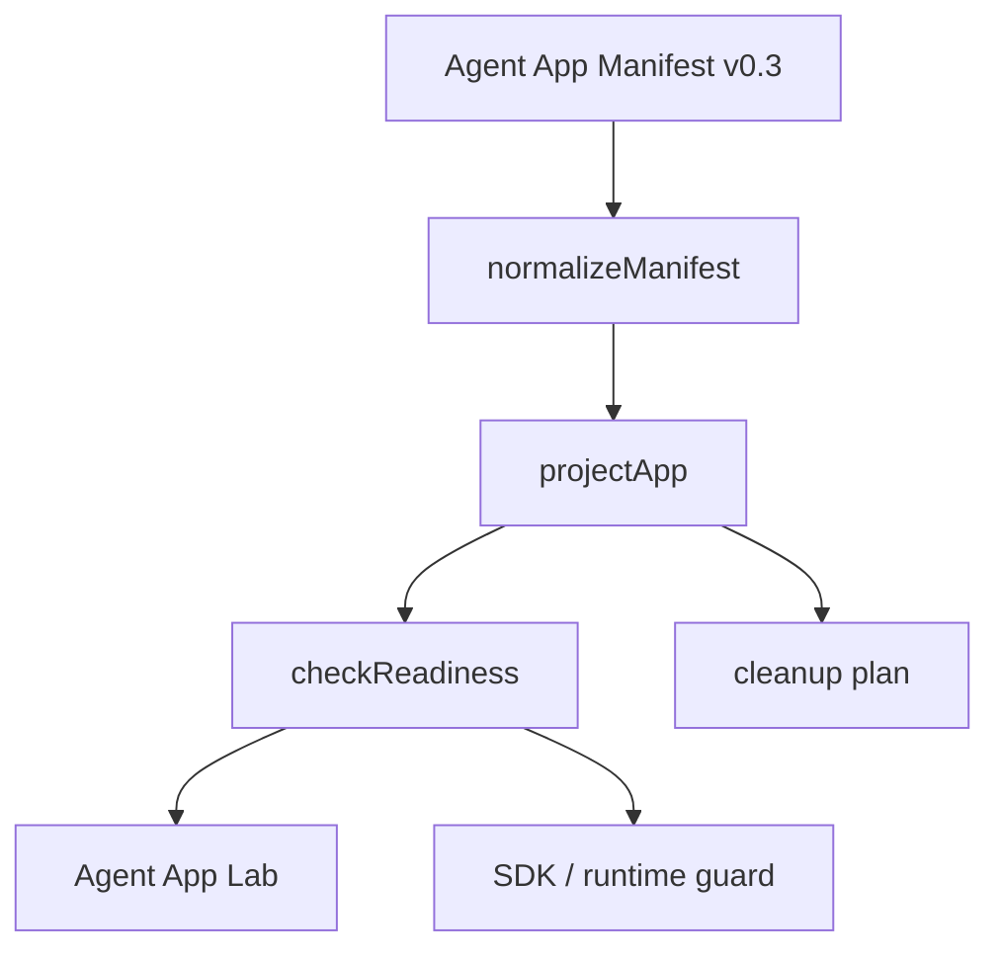

# Agent App P6 v0.3 Projection / Readiness Schema Coverage

更新时间：2026-05-15

## 一句话目标

P6 的目标是把上游 Agent App v0.3 标准中的 projection / readiness 关键对象落到 Lime Desktop 实验岛：让 `services / workflows / skillRefs / toolRefs / evals / events / secrets / overlayTemplates / lifecycle / ui` 能被 manifest parser 保留、projection 投影、readiness 输出 setup checks，但仍不执行 App code、不接正式主路径。

## 背景

P5.5 cross-check 发现：上游 reference CLI 的 projection 已覆盖 v0.3 多数对象，而 Lime Desktop 只覆盖了 app、package、entries、capabilities、runtimePackage、storage、knowledge、artifact、policies 的子集。

P6 先补 schema coverage，不补完整 runtime：

| 领域 | P6 做 | P6 不做 |
|---|---|---|
| Manifest | 保留 v0.3 descriptor 字段。 | 不引入完整 JSON Schema validator。 |
| Projection | 生成 host 可读 projection 子集。 | 不注册正式 catalog / route / command。 |
| Readiness | 输出 setup checks、remediation、required 标记。 | 不真的安装 Skill、绑定 Secret、启用 ToolHub。 |
| Runtime | 保持 Lab / SDK / adapter 现状。 | 不执行 raw worker / service。 |

## 当前落地

| 项 | 证据 |
|---|---|
| Manifest 类型 | `src/features/agent-app/types.ts` 增加 `ServiceDeclaration`、`WorkflowDeclaration`、`SkillRefDeclaration`、`ToolRefDeclaration`、`EvalDeclaration`、`EventDeclaration`、`SecretDeclaration`、`OverlayTemplateDeclaration`、`UiDeclaration`、`LifecycleDeclaration`。 |
| Normalize | `normalizeManifest()` 保留 `services / workflows / skillRefs / toolRefs / evals / events / secrets / overlayTemplates / ui / lifecycle`。 |
| Projection | `projectApp()` 输出 `services / workflows / skillRequirements / toolRequirements / evals / events / secrets / overlayTemplates / ui / lifecycle`。 |
| Readiness | `checkReadiness()` 输出 `KNOWLEDGE_BINDING_REQUIRED / SKILL_REQUIRED / TOOL_REQUIRED / ARTIFACT_TYPE_REQUIRED / EVAL_REQUIRED / SECRET_REQUIRED / OVERLAY_REQUIRED / SERVICE_REQUIRED / WORKFLOW_REQUIRED`，包含 `kind / key / required / remediation`。 |
| Fixture | `content-factory-app.json` 补齐 service、workflow、skill、tool、eval、event、secret、overlay、ui、lifecycle 子集。 |
| 运行边界 | setup checks 当前作为 warning / degraded 输出，避免破坏 P1-P4 实验岛 runtime；Cloud disable / license / required tool 仍可产生 blocker。 |

## 架构图

## Readiness 映射

| Projection 对象 | Readiness kind | Issue code | 当前 severity |
|---|---|---|---|
| `knowledgeBindings` | `knowledge` | `KNOWLEDGE_BINDING_REQUIRED` | warning |
| `skillRequirements` | `skill` | `SKILL_REQUIRED` | warning |
| `toolRequirements` | `tool` | `TOOL_REQUIRED` | warning |
| `artifactTypes` | `artifact` | `ARTIFACT_TYPE_REQUIRED` | warning |
| `evals` | `eval` | `EVAL_REQUIRED` | warning |
| `secrets` | `secret` | `SECRET_REQUIRED` | warning |
| `overlayTemplates` | `overlay` | `OVERLAY_REQUIRED` | warning |
| `services` | `service` | `SERVICE_REQUIRED` | warning |
| `workflows` | `workflow` | `WORKFLOW_REQUIRED` | warning |

说明：P6 先选择 warning / degraded，是为了避免 P6 schema coverage 破坏已验证的 P1-P4 Lab runtime。进入正式主路径前，required setup 必须升级为 `needs-setup` 或 blocker 语义，并提供真实 resolver / binding 状态。

## 验证记录

| 命令 | 结果 |
|---|---|
| `npm run test -- src/features/agent-app/manifest/parseManifest.test.ts src/features/agent-app/projection/projectApp.test.ts src/features/agent-app/readiness/checkReadiness.test.ts src/features/agent-app/install/cloudBootstrap.test.ts src/features/agent-app/featureFlag.test.ts` | 通过，24 tests。 |
| `npm run test -- src/features/agent-app/sdk/MockCapabilityHost.test.ts src/features/agent-app/adapters/AdapterCapabilityHost.test.ts src/features/agent-app/runtime/contentFactoryDemo.test.ts src/features/agent-app/runtime/workflowRuntimeHost.test.ts src/features/agent-app/ui/AgentAppLabPage.test.tsx` | 通过，22 tests。 |
| `npm run typecheck` | 通过。 |
| `npm run test:contracts` | 通过。 |

## 剩余差距

| 差距 | 处理 |
|---|---|
| 尚未接完整 JSON Schema validator。 | P7 再接 schema validator 或 reference CLI fixture snapshot。 |
| Reference CLI 示例 entry key 与客户端 P4 current key 不一致。 | 继续记录差异；进入主路径前统一或向标准反馈。 |
| setup checks 目前是 warning，不是完整 `needs-setup` 状态。 | P7/P8 引入 setup resolver 后再升级语义。 |
| Skill / Tool / Secret / Overlay 没有真实 resolver。 | 后续接 AgentSkills / ToolHub / Secret Manager / Overlay Resolver。 |
| Projection 未校验 UI descriptor shape。 | P7 schema validator 覆盖。 |

## 下一刀

P6 已完成最小 schema coverage，后续 P7-P13 已继续完成 schema gate、setup resolver、setup state store、installed state snapshot、local persistence adapter、package cache / verify / rollback 与 runtime package loader。[P14 Entry Runtime Guard / Permission Prompt](./p14-entry-runtime-guard-permission-prompt.md) 与 [P15 Lab Install / Launch Flow](./p15-lab-install-launch-flow.md) 已完成当前实现与定向验证，P15-H 已补 Agent App Lab 专用 GUI smoke / cleanup rehearsal 证据，P16 已完成最小 Agent App Manager；P17 Gate 审计、P17.0 Formal Entry Contract、P17.1 Formal route / nav / copy hardening、P17.2.1 Source state model、P17.2.2 Install review descriptor、P17.2.3 Registration hardening 与 P17.2.4a Cloud release descriptor / verification gate、P17.2.4b-1 acquisition seam / verified cache source、P17.2.4b-2 packageUrl fetch / staging / manifest extraction 与 P17.2.5 public schema / reference CLI / standard example package cross-check 已完成，P17.3 lifecycle / cleanup contract 与 P17.4 runtime surface production hardening 已完成，当前进入 P17.5 formal entry GUI smoke。
