# Agent App v2 架构设计：模块化、隔离、解耦

更新时间：2026-05-18
状态：Draft
适用范围：Lime Desktop / Lime 客户端实现，不替代 Agent App v0.8 标准
配套文档：接口契约与扩展升级剧本见 [`interface-contracts.md`](./interface-contracts.md)，可执行开发切片见 [`implementation-plan.md`](./implementation-plan.md)。

## 1. 设计目标

v2 的架构目标不是“给 Agent App 再包一层壳”，而是把 Lime 的智能能力拆成可组合、可隔离、可升级的模块：

1. **模块化**：每个模块有单一职责、清晰输入输出和可独立测试的纯逻辑核心。
2. **隔离**：App 代码、Host shell、Runtime capability、用户数据、secrets、tool side effects 互相隔离。
3. **解耦**：Agent App 不依赖 Lime Desktop 内部；Lime Desktop / Lime App Shell / runtime-backed shell 只依赖同一套 Runtime ports。
4. **可升级**：Manifest / install contract 先 normalize 成 current domain model，后续 v0.9 / v1.0 只新增 adapter，不在业务代码里散落版本判断。
5. **可扩展但不过度设计**：v2 只实现 `in_lime`、`standalone`、`runtime_backed`，`web_host` 只保留 contract seam，不做假实现。

## 2. 一句话架构

```text
Agent App Package -> Contract Normalizer -> Projection / Readiness -> Runtime Ports -> Host Shell Adapters
```

所有外部能力都必须通过 port / adapter 注入。Core domain 不 import React、不 import Tauri、不 import Desktop UI、不 import App Shell 实现。

### 架构不变量

| 不变量 | 含义 | 违反信号 |
| --- | --- | --- |
| App 只看 SDK | Agent App package 只能消费 `@lime/app-sdk` 与 `lime.*` capability。 | App import Lime Desktop internals、私有 postMessage bridge 或 secret 明文。 |
| Domain 只看 Port | projection、readiness、install、runtime profile 都是纯逻辑。 | Domain import React、Tauri、filesystem、network 或 shell class。 |
| Shell 只是 Adapter | Desktop / App Shell / runtime-backed shell 输出同一 `LimeRuntimeProfile`。 | 新 shell 复制模型网关、tool broker、secret store 或 evidence store。 |
| 升级进 Adapter / Strategy | 版本、mode、capability 变化只通过 normalizer、strategy、port adapter 扩展。 | UI / runtime 中散落 manifestVersion、mode、capability if-else。 |

## 3. C4 Context

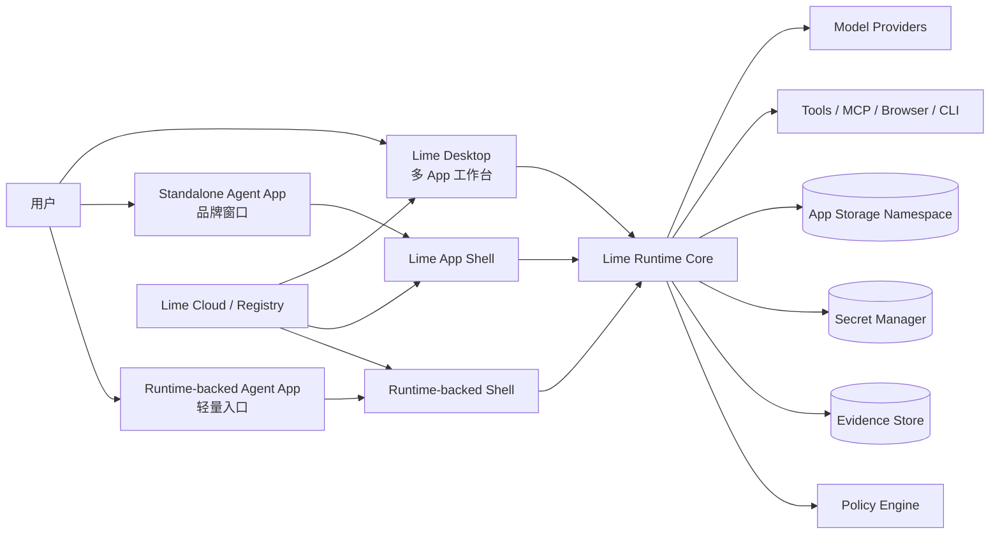

### 关键约束

- Desktop、Shell、Runtime-backed shell 是 **Host Shell** 的不同 adapter，不是三套 Runtime。
- Agent App 永远只看到 `@lime/app-sdk` 和 `lime.*` capability。
- `lime.cloudSession` 只提供通用登录、会话和 just-in-time token 入口，不允许 Host 代业务 App 代理发布或把 token 写入 snapshot。
- Model / Tools / Secrets / Evidence / Policy 不进入 App package。

## 4. 分层架构

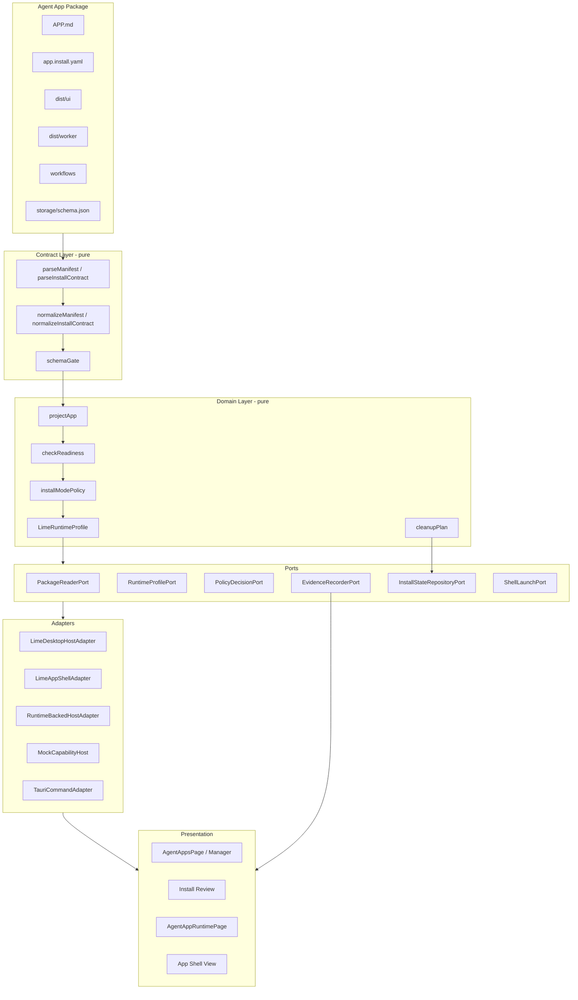

### 依赖方向

```text
UI -> Application Services -> Domain -> Ports
Adapters -> Ports
Domain -X-> UI / Tauri / filesystem / network
Agent App Package -X-> Lime Desktop internals
```

这是一种 **Hexagonal Architecture / Ports and Adapters**。依赖倒置保证未来新增 Shell、Web Host、企业托管 Runtime 时，不需要修改 core domain。


### 4.1 模块依赖 DAG（禁止环）

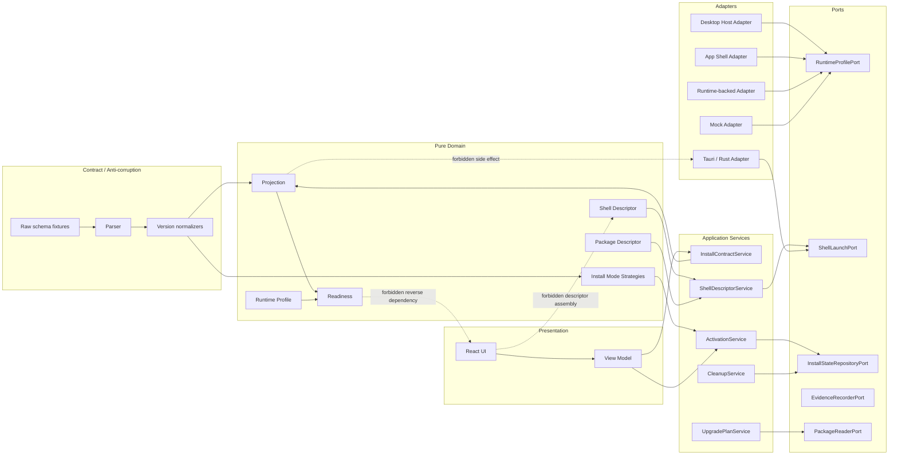

硬规则：

- `Contract` 是唯一反腐层；raw v0.8 / v0.9 / v1.0 contract 只能在这里被识别和兼容。
- `Domain` 必须无副作用、无平台 API、无 React state；输出 stable plan / descriptor / readiness。
- `Application Services` 编排 domain 与 ports，但不直接执行 filesystem、process、network。
- `Adapters` 只实现 port；新增宿主时只加 adapter，不复制 domain service。
- `Presentation` 只渲染 view model；不直接拼 `ShellDescriptor`、`UpgradePlan`、`CleanupPlan`。
- 边界不是靠评审记忆维护；`src/features/agent-app/architecture/importBoundaries.test.ts` 已把核心 import 禁区固化为结构测试，新增模块必须同步更新守卫。

### 4.2 可替换宿主拓扑

```mermaid
flowchart TD
  subgraph StableCore[Stable Core]
    SDK[@lime/app-sdk]
    Bridge[Host Bridge Envelope]
    Runtime[Lime Runtime Core]
    Policy[Policy / Evidence / Secret / Tool Brokers]
  end

  subgraph HostAdapters[Host Adapters]
    DesktopHost[Lime Desktop Host]
    StandaloneHost[Lime App Shell Host]
    RuntimeBackedHost[Runtime-backed Host]
    FutureHost[Future Web / Enterprise Host]
  end

  App[Agent App Package] --> SDK --> Bridge --> Runtime --> Policy
  DesktopHost --> Bridge
  StandaloneHost --> Bridge
  RuntimeBackedHost --> Bridge
  FutureHost --> Bridge

  DesktopHost --> Profile[LimeRuntimeProfile]
  StandaloneHost --> Profile
  RuntimeBackedHost --> Profile
  FutureHost --> Profile
  Profile --> Runtime
```

拓扑含义：

- 宿主可替换，但 SDK、Host Bridge envelope、Runtime governance 不可替换。
- Standalone 是“单 App 宿主”，不是“独立 Runtime”；它只改变窗口、品牌、安装和启动体验。
- Runtime-backed 是“轻 shell + 系统 Runtime”，不是“App 自带模型网关”。
- Future Host 必须先输出 `LimeRuntimeProfile`，再进入 readiness / guard；不能绕开 profile。

### 4.3 扩展槽与组合根

v2 的可扩展性不靠在 UI 或 Runtime 里继续加 `if mode === ...`，而靠少量稳定扩展槽。新增能力必须先进入对应槽位，再由组合根注入到 current 主链。

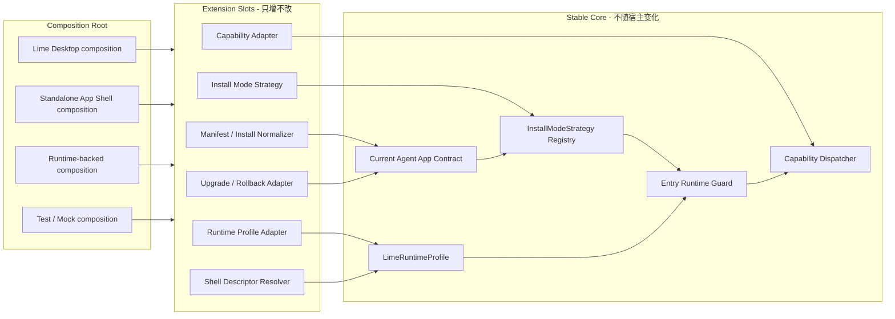

组合根规则：

| 扩展槽 | 允许扩展 | 不允许扩展 | 组合位置 |
| --- | --- | --- | --- |
| Version Adapter | 新 manifest / install contract normalizer。 | 让 UI 或 runtime 读 raw version。 | `manifest` / `install-mode`。 |
| Install Mode Strategy | 新 mode strategy、blocked strategy、readiness rule。 | 在组件、command、dispatcher 横向散落 mode 分支。 | `install-mode` registry。 |
| Runtime Profile Adapter | 新 shell kind / host capability 映射。 | shell 复制 model / tool / secret / evidence service。 | `runtime-profile`。 |
| Shell Descriptor Resolver | 新 shell launch descriptor / blocker。 | UI 直接拼 `ShellDescriptor`。 | `shell` application service。 |
| Capability Adapter | 新 capability handler / mock / policy。 | Agent App 直接调 Tauri / provider。 | `runtime` dispatcher。 |
| Upgrade Adapter | 新 dry-run / rollback / migration plan。 | 原地覆盖 installed state 或用户数据。 | `install` / future upgrade service。 |

这保证未来 v0.9、企业 Runtime、Web Host 或新的 shell kind 都是“新增 adapter / strategy”，而不是修改已验证的 domain service。

### 4.4 扩展升级提交顺序

任何未来扩展都必须按同一顺序推进，避免 UI 先行导致耦合回流：

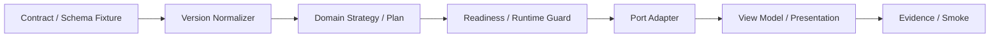

执行规则：

1. **先 contract fixture**：没有 raw fixture 和 normalizer 的字段，不允许进入 UI 状态。
2. **再 domain strategy**：新增 mode / shell / capability 先变成 strategy、profile 或 plan，不在组件里写分支。
3. **再 guard / readiness**：不确定是否可用时先 `blocked`，不能为了演示返回 ready。
4. **再 adapter 副作用**：filesystem、Tauri、process、network 只能在 port adapter 或 Rust command 边界出现。
5. **最后 presentation**：UI 只消费 view model、descriptor result 和 stable error code。
6. **证据收尾**：GUI / smoke / evidence pack 证明 standalone 没有绕过 Runtime governance。

## 5. 模块边界

| 模块 | 目录建议 | 职责 | 禁止依赖 |
| --- | --- | --- | --- |
| Contract Normalizer | `src/features/agent-app/manifest`、新增 `install-mode` | 读取 v0.8 manifest / install contract，归一化为 current domain type。 | React、Tauri、真实文件副作用。 |
| Projection | `src/features/agent-app/projection` | 生成 host-facing app projection。 | Host shell 细节、GUI 状态。 |
| Readiness | `src/features/agent-app/readiness` | 根据 runtime profile / install mode 生成 `ready / needs-setup / blocked`。 | 直接调用模型、工具或外部 API。 |
| Install State | `src/features/agent-app/install` | installed state、package identity、cleanup plan、rollback metadata。 | App 业务逻辑、Desktop UI。 |
| Runtime Profile | 新增 `src/features/agent-app/runtime-profile` | 描述 Runtime version、capabilities、policy、storage、evidence、shell constraints。 | 具体 Shell 实现。 |
| Capability SDK | `src/features/agent-app/sdk` | typed facade、capability catalog、errors、provenance。 | 业务 App 特例。 |
| Runtime Host | `src/features/agent-app/runtime` | Host Bridge、capability dispatch、runtime package loader、entry guard。 | 直接读取未验证 package、依赖具体 Shell class。 |
| Shell Adapter | 新增 `src/features/agent-app/shell` | Desktop / App Shell / runtime-backed shell descriptor 与 launch port。 | Domain 反向依赖。 |
| Packager | 新增 `src/features/agent-app/packaging` | 生成 standalone / runtime-backed descriptor，校验 package 与 shell contract。 | 生产签名 / updater 具体实现，首轮不做。 |
| UI | `src/features/agent-app/ui` | 安装审查、App 管理、Runtime 页面、Shell prototype UI。 | Manifest 解析细节、Tauri 命令常量散落。 |

## 6. Install Mode Strategy

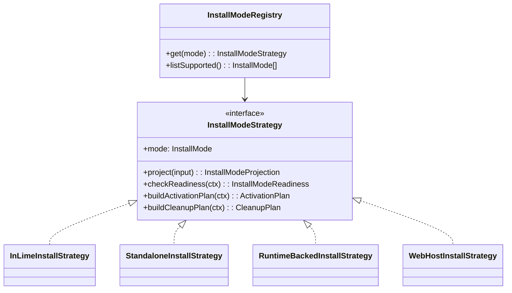

设计规则：

- `InstallModeRegistry` 是唯一分发点，禁止在 UI / readiness / runtime 中散落 `if mode === 'standalone'`。
- `web_host` 在 v2 只注册为 `unsupportedReservedStrategy`，输出明确 `blocked / not implemented`，不做假通路。
- 新增模式只能新增 Strategy + tests，不能改已有 strategy 的分支。

## 7. Runtime Profile 抽象

```ts
export type LimeRuntimeProfile = {
  runtimeId: string
  runtimeVersion: string
  shellKind: 'desktop' | 'app_shell' | 'runtime_backed' | 'web_host'
  installMode: 'in_lime' | 'standalone' | 'runtime_backed' | 'web_host'
  capabilities: Record<string, {
    version: string
    available: boolean
    reason?: string
    implementation: 'none' | 'mock' | 'adapter' | 'native'
  }>
  policy: {
    permissionPrompt: 'required' | 'optional' | 'disabled'
    externalSideEffects: 'deny' | 'confirm' | 'allow'
    maxRisk: 'low' | 'medium' | 'high'
  }
  storage: {
    namespaceRoot: string
    quotaBytes?: number
    cleanupSupported: boolean
  }
  evidence: {
    recordRequired: boolean
    exportSupported: boolean
  }
}
```

`LimeRuntimeProfile` 是 Desktop 与 App Shell 的共享事实源。Readiness、entry guard、capability dispatcher 都读它，不直接读 Shell 类型。

落地守卫：

- `RuntimeProfilePort` 是 Shell / Desktop 向 Runtime Host 暴露能力的唯一入口，禁止 Runtime Host 反向 import shell adapter。
- `EntryRuntimeGuard` 必须同时接收 selected `installMode` 与 `LimeRuntimeProfile`；非 `in_lime` 启动缺 profile 或 profile mode 不一致时，统一返回 `RUNTIME_PROFILE_MISSING` blocker。
- Permission prompt 只展示 runtime profile summary，不能把 `HostCapabilityProfile`、Tauri payload 或 Shell 内部对象透给 UI。
- 新增 shell kind 只能新增 profile adapter 和 descriptor 测试；不得复制 capability dispatcher、model gateway、secret store 或 evidence writer。

## 8. 隔离模型

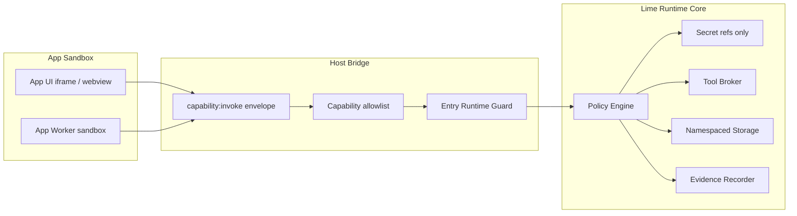

隔离规则：

1. App UI / Worker 只拿 capability handle，不拿 secret 明文。
2. Package mount 默认只读；storage 写入必须进入 app namespace。
3. Tool / MCP / Browser / CLI 调用只从 Runtime 发起，App 不直接启动外部进程。
4. Evidence 写入由 Runtime 注入 provenance，不接受 App 自填可信 evidence。
5. Standalone Shell 只能复用 Runtime capability，不允许复制 Desktop 内部 service。

### 8.1 四层隔离平面

v2 的隔离必须同时覆盖代码、数据、能力和升级；只隔离窗口不等于安全。

| 隔离平面 | 边界对象 | 强制规则 | 验证证据 |
| --- | --- | --- | --- |
| Code Plane | `App UI / Worker` vs Host Shell | package mount 只读；App 只拿 SDK facade。 | shell descriptor、entry guard trace。 |
| Data Plane | storage / artifact / evidence namespace | namespace 由 Runtime 分配；卸载只按 cleanup plan 处理。 | cleanup rehearsal、namespace refs。 |
| Capability Plane | model / tool / browser / CLI | 只走 capability dispatcher + policy；禁止 App 直接副作用。 | capability trace、stable denial code。 |
| Upgrade Plane | package / manifest / installed state | 新版本先 dry-run；active pointer 切换前必须可 rollback。 | upgrade plan、rollback plan、package hash。 |

隔离失败的典型信号：

- App package 能读到 host filesystem path、secret 明文或 provider key。
- Shell adapter 持有模型网关、tool broker、secret store 的第二份实现。
- UI 组件自己拼 shell descriptor、upgrade plan 或 cleanup plan。
- 安装升级直接覆盖用户数据，没有 dry-run / rollback evidence。

## 9. 可升级策略

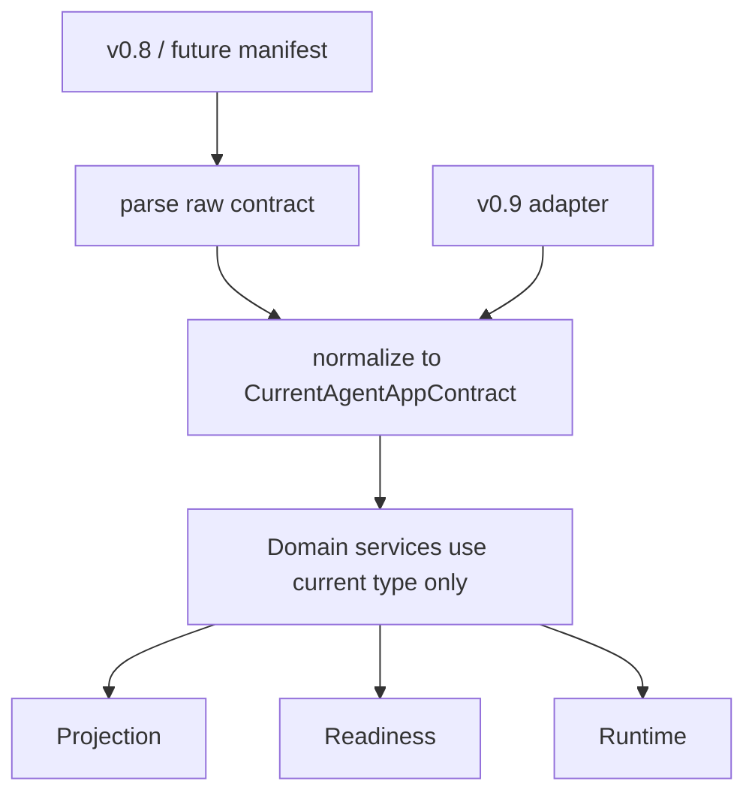

升级原则：

- **版本判断只在 normalizer**：业务服务不读 `manifestVersion` 分支。
- **Current domain type 稳定**：新增字段默认 optional，并带明确 readiness 语义。
- **迁移有退出条件**：旧字段只在 adapter 层兼容，不能进入 current 主链。
- **schema 先行**：新增 install mode / capability 必须先补 schema、fixture、projection snapshot、readiness tests。

## 10. 错误与恢复流

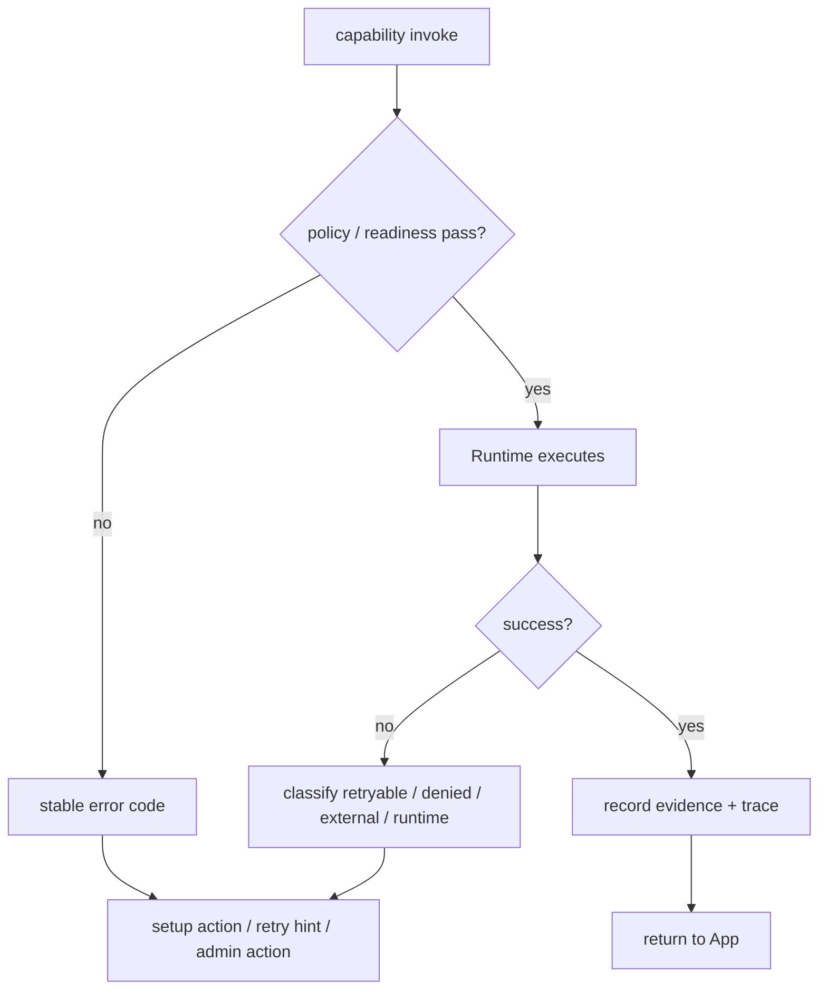

每个错误必须有：`code`、`capability`、`method`、`installMode`、`traceId?`、`setupAction?`。不要只返回字符串。

## 11. 设计模式选择

| 场景 | 模式 | 原因 |
| --- | --- | --- |
| Shell / Runtime 解耦 | Ports and Adapters | Shell 可替换，domain 稳定。 |
| 多安装模式 | Strategy + Registry | 新增模式不改旧逻辑，符合 OCP。 |
| SDK 入口 | Facade | App 作者只面对简单 `lime.*`。 |
| installed state | Repository | 存储实现可替换，测试可 mock。 |
| readiness / activation | State Machine | 状态转移可验证，避免隐式布尔。 |
| package descriptor 创建 | Factory | 不让 UI 拼装复杂 descriptor。 |
| side-effect evidence | Outbox / Event Log | 先记录意图和结果，再异步导出。 |

## 12. SOLID / KISS / DRY / YAGNI 约束

- **S**：每个模块只负责一种变化原因；install mode 不写进 UI 组件内部。
- **O**：新增 shell / install mode 通过新 strategy 和 adapter 扩展。
- **L**：所有 `InstallModeStrategy` 必须可被 registry 等价调度，不能要求调用方知道具体子类。
- **I**：port 要窄；不要做一个 `LimePlatformGodService`。
- **D**：domain 依赖 port interface，不依赖 Tauri / React / shell class。
- **KISS**：v2 MVP 不做插件系统、生产签名安装器、完整 updater。
- **DRY**：capability catalog、install mode enum、stable error code 只保留一个事实源。
- **YAGNI**：`web_host` 只保留 blocked strategy，不提前实现云端运行时。


## 13. 扩展升级分层

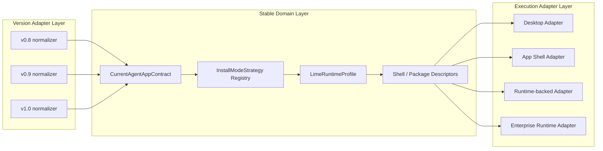

升级规则：

| 变化类型 | 允许修改 | 禁止修改 | 必补验证 |
| --- | --- | --- | --- |
| 新 manifest 版本 | 新 normalizer / schema fixture。 | UI / runtime 读取版本号分支。 | parser、normalizer、projection、readiness。 |
| 新 install mode | 新 strategy + registry entry。 | 旧 strategy 内堆分支。 | registry exhaustiveness、readiness、cleanup、activation。 |
| 新 shell kind | 新 adapter + profile builder。 | 复制 Runtime / SDK / evidence writer。 | descriptor snapshot、profile readiness、launch blocker。 |
| 新 capability | catalog / SDK facade / dispatcher / mock。 | App 直接调用 Tauri 或 provider。 | contract test、policy denial、evidence trace。 |
| 新 package upgrade | migration plan / rollback plan。 | 覆盖用户数据或跳过 evidence。 | dry-run、rollback、cleanup evidence。 |

设计目标是让“新增能力”落在明确扩展点，而不是在 UI、runtime、Tauri 命令里横向扩散。

## 14. 隔离边界与信任等级

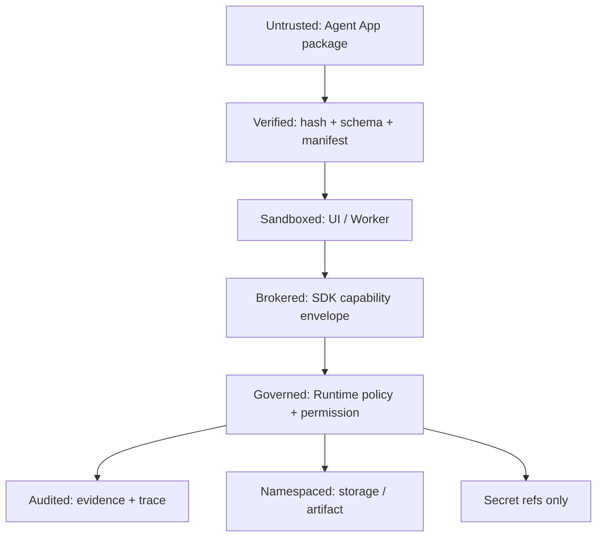

| 边界 | 信任等级 | 进入条件 | 退出证据 |
| --- | --- | --- | --- |
| Package | 不可信输入 | hash、schema、manifest、install contract 全部通过。 | package identity、manifest hash。 |
| UI / Worker | 沙箱执行 | 只读 package mount + capability handles。 | runtime guard trace。 |
| Capability | 受管调用 | allowlist、runtime profile、policy 均通过。 | capability trace / stable error。 |
| Data | 命名空间资源 | appId + package identity + install mode。 | storage / artifact / evidence refs。 |
| Side Effect | 高风险外部动作 | Runtime broker + permission prompt / admin policy。 | tool run evidence。 |
| Upgrade | 可回滚变更 | dry-run + rollback plan + user/admin approval。 | upgrade evidence + active package pointer。 |

任何跨边界传递都必须传递 ref / descriptor / plan，不传递 mutable internal object；这能避免耦合、提升测试可控性，并为未来多 shell / 多 Runtime 升级保留空间。

## 15. macOS 身份隔离模型

独立 App 的隔离不仅发生在 Runtime / SDK，也发生在操作系统身份层。macOS 上不能让多个独立产品共用 Lime Desktop 的 Bundle ID；否则系统会把它们视为同一个 App 的安装 / 更新 / 容器 / 默认 keychain 身份，破坏 standalone 的产品边界。

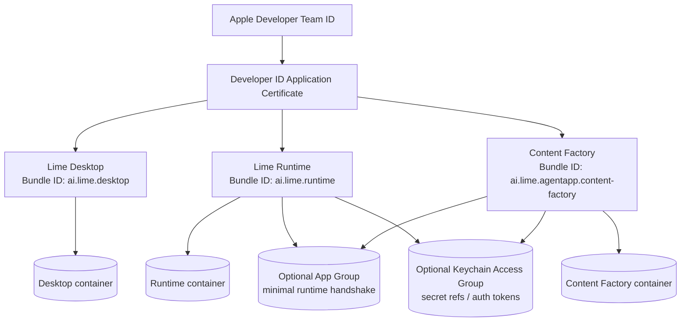

### 15.1 决策

| 决策 | 说明 |
| --- | --- |
| 独立 Bundle ID | 每个 standalone `.app` 必须有自己的 `CFBundleIdentifier`，例如 `ai.lime.agentapp.content-factory`。 |
| 独立 explicit App ID | 需要 App Group、keychain sharing、push、iCloud 等能力时，为该 Bundle ID 注册 explicit App ID。 |
| 证书按 Team 复用 | Lime 官方发布的多个 App 可以使用同一 Team 下的 Developer ID Application 证书签名；证书不是每个 App 一张。 |
| Updater key 按产品隔离 | Tauri updater signing key 不是 Apple 证书；每个 standalone App / channel 默认使用独立 updater key。 |
| 能力按 App 授权 | App Groups、Keychain Access Groups、App Sandbox entitlements 按 App ID / provisioning profile 显式授权。 |
| 默认隔离，按需共享 | Runtime 与 standalone shell 默认不同容器；只有 Runtime broker 必需的 handshake / secret ref 才进入共享组。 |
| 跨 Team 不共享组 | 第三方签名 App 不能加入 Lime Team 的 App Group / Keychain group；必须通过 Runtime broker / account auth / cloud trust。 |

### 15.2 命名建议

| 产品 | Bundle ID 示例 | 角色 |
| --- | --- | --- |
| Lime Desktop | `ai.lime.desktop` | 多 App 工作台。 |
| Lime Runtime | `ai.lime.runtime` | 本地能力底座 / broker。 |
| Content Factory standalone | `ai.lime.agentapp.content-factory` | 单 App 产品壳。 |
| 共享 App Group | `group.ai.lime.runtime` | 可选，仅给 Runtime 与受信 Shell 共享最小状态。 |
| 共享 Keychain Group | `<TeamID>.ai.lime.runtime.shared` | 可选，仅存 secret ref / 授权 token，不存 App 私有业务数据。 |

这套命名让产品、系统身份和治理边界一致：用户安装的是独立 App，macOS 识别的是独立 Bundle ID，Runtime 能力共享通过明确 entitlements 完成。

### 15.3 打包与更新影响

- Standalone App 的 updater feed、notarization 记录、crash symbol、日志 namespace 和安装路径都必须按 Bundle ID 隔离。
- Lime Runtime 可以独立升级；standalone App 通过 `RuntimeProfile` 检查 minVersion，不把 Runtime 二进制复制进每个 App，除非 packager 明确选择 embedded runtime。
- App 升级只切换该 App 的 package / shell descriptor；不能覆盖 Lime Desktop 或其他 Agent App 的容器。
- 卸载时 cleanup plan 默认只处理该 Bundle ID / appId 对应的 container、storage namespace、artifact refs 和 evidence refs；共享组数据必须由 Runtime cleanup policy 单独管理。

## 16. 模块化开发蓝图

开发时先判断变更属于哪一类，再进入对应模块。不要先从 UI、Tauri command 或某个 smoke 脚本倒推实现，否则 standalone 会很快长成第二套 Desktop。

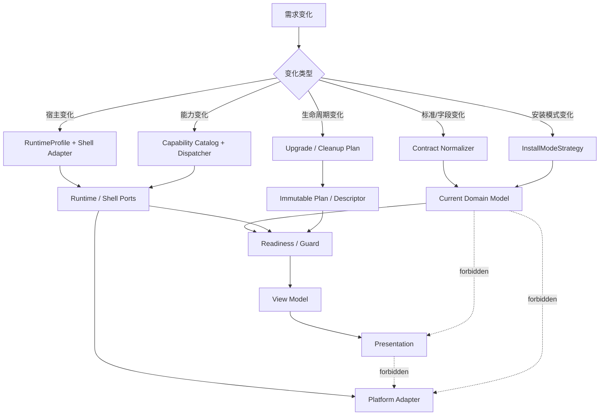

### 16.1 变化类型到落点

| 变化类型 | 首选落点 | 只允许新增 | 禁止 |
| --- | --- | --- | --- |
| `app.install.yaml` 字段 | `install-mode` normalizer / schema fixture | raw adapter、current type optional 字段、readiness rule | UI 直接读 raw yaml 或 `manifestVersion`。 |
| 新 install mode | `InstallModeStrategy` + registry | strategy、projection、activation / cleanup plan | 在 UI、runtime、Rust command 横向新增 mode 分支。 |
| 新 shell kind | `runtime-profile` adapter + `shell` descriptor resolver | profile adapter、descriptor factory、launch port adapter | 复制 Host Bridge、Capability Dispatcher、model gateway。 |
| 新 capability | `sdk` catalog + `runtime` dispatcher | SDK facade、mock、policy denial、evidence event | App package 直接调用 Tauri / provider / filesystem。 |
| App 升级 / 回滚 | install state migration + upgrade service seam | dry-run plan、rollback plan、evidence event | 覆盖用户数据、跳过 package hash、跳过 evidence。 |
| 产品 UI 展示 | view model / presentation | label map、setup action renderer、本地化文案 | 组装 domain descriptor、执行副作用。 |

### 16.2 模块 API 封装规则

- 每个模块只暴露 `index.ts` 或少量明确 public 文件；跨模块禁止 import `internal/*`、测试 fixture 或 adapter 私有实现。
- Public API 只返回 immutable value object、descriptor、plan、ref、stable error code；不返回 React state、Tauri payload、process handle、filesystem path guard 或 mutable singleton。
- Domain 函数必须可用普通单测验证；需要真实 filesystem、network、Tauri、process、browser 的逻辑必须退到 adapter 或 Rust command 边界。
- Application Service 只编排 plan 与 port，不拥有平台状态；Composition Root 负责选择 adapter，但不能改 domain 规则。
- Mock 只能模拟 port contract，不允许伪装生产 ready；standalone / runtime-backed 缺 Runtime profile 时必须 blocked。

### 16.3 扩展升级生命周期

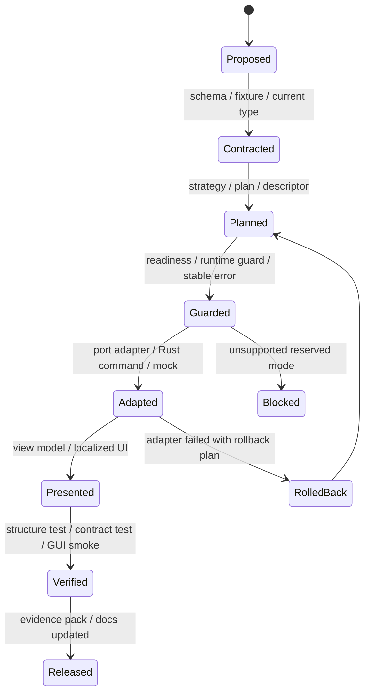

这条生命周期把“未来扩展”限制在可审计步骤里：任何扩展都必须先被 contract 化，再被 domain plan 化，最后才进入 adapter 和 UI。这样既满足 OCP，又避免提前实现不需要的 Web Host / marketplace / updater。

### 16.4 隔离优先级

隔离策略按风险从高到低处理；高风险未满足时，低风险 UI polish 不能继续推进。

| 优先级 | 边界 | 必须先证明 | 失败时行为 |
| --- | --- | --- | --- |
| P0 | Secret / Provider | App 只见 secret ref，provider key 不出 Runtime。 | capability denied，停止执行。 |
| P0 | Tool / External Side Effect | 所有外部副作用由 Runtime broker 发起并记录 policy。 | blocked 或二次确认。 |
| P1 | Package Mount | package hash / manifest hash / install contract 通过，只读挂载。 | 不启动 shell。 |
| P1 | Storage / Artifact / Evidence | namespace 与 package identity 绑定，cleanup plan 明确。 | 禁止升级或卸载执行。 |
| P2 | Shell / Window | Shell 只接 descriptor 和 runtime entry，不持有 Desktop 私有状态。 | 返回 `shell_launch_blocked`。 |
| P2 | UI / Presentation | UI 只消费 view model 和 setup action。 | 退回 service 层重构。 |

### 16.5 解耦完成判定

实现完成时必须能用一张依赖链说明：

```text
Agent App package -> SDK facade -> Host Bridge envelope -> Runtime ports -> Runtime governance
Host shell -> RuntimeProfile adapter -> Shell descriptor -> ShellLaunchPort
UI -> ViewModel -> Application Service -> Domain plan -> Port
```

如果某条路径绕过 SDK、RuntimeProfile、Domain plan 或 Port，说明解耦没有完成；如果为了 standalone 新增了一份模型、密钥、工具或 evidence 实现，说明架构方向错误。
