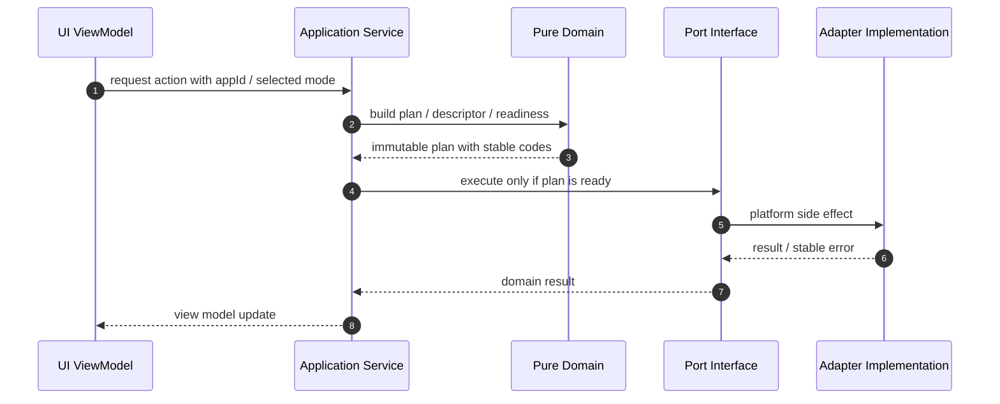
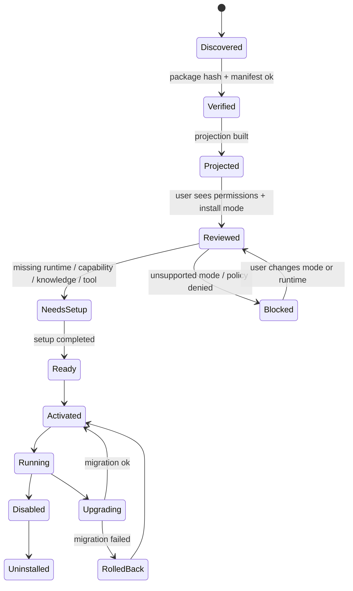

# Agent App v2 代码规划

更新时间：2026-05-18
状态：Draft
写集原则：先补 current 主链，不新增平级 compat，不抢并行 Agent 的代码写集
配套文档：接口契约见 [`interface-contracts.md`](./interface-contracts.md)，文件级执行切片见 [`implementation-plan.md`](./implementation-plan.md)。

## 1. 当前事实源分类

| 分类                   | 路径                                                         | 说明                                                                             |
| ---------------------- | ------------------------------------------------------------ | -------------------------------------------------------------------------------- |
| current                | `src/features/agent-app/manifest`                            | Manifest parse / normalize 主路径。                                              |
| current                | `src/features/agent-app/projection`                          | App projection 主路径。                                                          |
| current                | `src/features/agent-app/readiness`                           | Readiness 主路径。                                                               |
| current                | `src/features/agent-app/install`                             | package identity、installed state、cleanup plan 主路径。                         |
| current                | `src/features/agent-app/sdk`                                 | Capability SDK、public surface、Host Bridge client 主路径。                      |
| current                | `src/features/agent-app/runtime`                             | runtime package loader、entry guard、capability dispatcher、Host Bridge 主路径。 |
| current                | `src/features/agent-app/ui`                                  | Agent Apps 管理与 Runtime 页面主路径。                                           |
| current                | `src-tauri/src/commands/agent_app_runtime_cmd.rs`            | Agent App Runtime Tauri 命令主路径。                                             |
| deprecated / dead 禁区 | SceneApp、旧 `scene` / `home` entry、私有 postMessage bridge | v2 不扩展、不包裹、不迁回。                                                      |

事实源声明：v2 只向 `src/features/agent-app/*` current 模块和 `agent_app_runtime_cmd` 主链收敛；不新增与它们平级的第二套 App Host。

## 2. 推荐目录演进

```text
src/features/agent-app/
├── install-mode/                 # 新增：v0.8 install contract 纯逻辑
│   ├── installContract.ts
│   ├── normalizeInstallContract.ts
│   ├── installModeRegistry.ts
│   ├── installModeStrategy.ts
│   ├── installModePolicy.ts
│   ├── installModeReadiness.ts
│   └── *.test.ts
├── runtime-profile/              # 新增：host-neutral Runtime profile
│   ├── LimeRuntimeProfile.ts
│   ├── resolveRuntimeProfile.ts
│   ├── runtimeCapabilityMatrix.ts
│   ├── runtimeProfileReadiness.ts
│   └── *.test.ts
├── shell/                        # 新增：Shell descriptor / launch port
│   ├── ShellLaunchPort.ts
│   ├── buildStandaloneShellDescriptor.ts
│   ├── buildRuntimeBackedDescriptor.ts
│   ├── resolveShellLaunchDescriptorForEntry.ts
│   ├── shellChromeDescriptor.ts
│   ├── shellIsolationPolicy.ts
│   └── *.test.ts
├── packaging/                    # 新增：descriptor 级 packager，不做生产签名
│   ├── packageTarget.ts
│   ├── validatePackageTarget.ts
│   ├── buildPackageDescriptor.ts
│   ├── macosIdentity.ts
│   ├── releasePlan.ts
│   └── *.test.ts
├── manifest/                     # 现有：接入 install normalizer，不塞 shell 逻辑
├── projection/                   # 现有：projection 增加 installProjection
├── readiness/                    # 现有：readiness 合并 installModeReadiness
├── install/                      # 现有：installed state / cleanup 增加 install mode 字段
├── runtime/                      # 现有：entry guard / dispatcher 读取 RuntimeProfile
├── sdk/                          # 现有：保持 public SDK surface 稳定
└── ui/                           # 现有：只展示 view model，不拼 domain 逻辑
```

Rust 侧只有在需要系统能力时再补：

```text
src-tauri/src/agent_app/
├── runtime_profile.rs            # 可选：系统 runtime profile 读取
├── package_mount.rs              # 可选：verified package mount / path guard
└── shell_launch.rs               # 可选：App Shell prototype 启动

src-tauri/src/services/
└── agent_app_shell_window.rs      # current：dev shell 独立 Tauri WebviewWindow 宿主

src-tauri/src/commands/agent_app_cmd.rs
src-tauri/src/commands/agent_app_runtime_cmd.rs
```

禁止首轮新增一整套 `agent_app_v2_cmd.rs`。如果必须新增命令，也要走现有 `agent_app_*` 命令族和命令边界同步规则。

## 2.1 模块化写集规则

| 规则               | 执行方式                                                                                                |
| ------------------ | ------------------------------------------------------------------------------------------------------- |
| Contract 先行      | 新字段先进入 schema / parser / normalizer / fixture，再进入 projection 或 UI。                          |
| Domain 纯逻辑      | `install-mode`、`runtime-profile`、`projection`、`readiness` 不 import UI、Tauri、filesystem、network。 |
| Adapter 隔离副作用 | filesystem、shell launch、Tauri command、network 只能在 adapter 或 Rust command 边界出现。              |
| Strategy 扩展 mode | 新 install mode 只新增 strategy + tests，不改 UI / runtime 分支。                                       |
| Profile 解耦 shell | Desktop、App Shell、runtime-backed shell 统一输出 `LimeRuntimeProfile`。                                |
| Evidence 不自证    | App 只能拿 evidence ref，可信 provenance 由 Runtime / Host 写入。                                       |

## 2.2 模块契约与所有权

| 模块              | Public API                                                                                                                                                                                                                                         | 内部实现                                                                                                                                                                                                                                                                                                                                                                | 测试锚点                                                                                                                                                                                                                                                                                                                | 扩展点                                                                    | 不能做                                                                                          |
| ----------------- | -------------------------------------------------------------------------------------------------------------------------------------------------------------------------------------------------------------------------------------------------- | ----------------------------------------------------------------------------------------------------------------------------------------------------------------------------------------------------------------------------------------------------------------------------------------------------------------------------------------------------------------------- | ----------------------------------------------------------------------------------------------------------------------------------------------------------------------------------------------------------------------------------------------------------------------------------------------------------------------- | ------------------------------------------------------------------------- | ----------------------------------------------------------------------------------------------- |
| `manifest`        | `parseManifest`、`normalizeManifest`                                                                                                                                                                                                               | raw schema adapter                                                                                                                                                                                                                                                                                                                                                      | parser / schema gate fixtures                                                                                                                                                                                                                                                                                           | 新 manifest normalizer                                                    | 读取 UI route 或 shell kind。                                                                   |
| `install-mode`    | `InstallModeRegistry`、`normalizeInstallContract`                                                                                                                                                                                                  | mode strategy                                                                                                                                                                                                                                                                                                                                                           | registry exhaustiveness                                                                                                                                                                                                                                                                                                 | 新 mode strategy                                                          | 在 UI / runtime 散落 mode 分支。                                                                |
| `projection`      | `projectApp`                                                                                                                                                                                                                                       | projection mapper                                                                                                                                                                                                                                                                                                                                                       | projection snapshot                                                                                                                                                                                                                                                                                                     | 新 projection section                                                     | 读取 filesystem / Tauri。                                                                       |
| `readiness`       | `checkReadiness`                                                                                                                                                                                                                                   | blocker / setup action builders                                                                                                                                                                                                                                                                                                                                         | readiness issue tests                                                                                                                                                                                                                                                                                                   | 新 readiness rule                                                         | 执行 App 或外部副作用。                                                                         |
| `runtime-profile` | `LimeRuntimeProfile`、`resolveRuntimeProfile`                                                                                                                                                                                                      | capability matrix                                                                                                                                                                                                                                                                                                                                                       | profile matrix tests                                                                                                                                                                                                                                                                                                    | 新 shell profile adapter                                                  | import shell implementation。                                                                   |
| `runtime`         | `EntryRuntimeGuard`、`CapabilityDispatcher`                                                                                                                                                                                                        | host bridge / guard                                                                                                                                                                                                                                                                                                                                                     | dispatcher / guard tests                                                                                                                                                                                                                                                                                                | 新 capability handler                                                     | 直接访问 provider / secret 明文。                                                               |
| `shell`           | `ShellDescriptor`、`ShellChromeDescriptor`、`ShellLaunchPort`、`resolveShellLaunchDescriptorForInstalledEntry`                                                                                                                                     | descriptor factory / launch resolver / 单 App chrome policy / native close policy seam / per-app native action router / label-key menu spec                                                                                                                                                                                                                             | shell launch tests / chrome policy tests / close event policy tests / deep link and menu routing tests                                                                                                                                                                                                                  | 新 shell adapter / 产品壳 adapter                                         | 复制 Desktop runtime service、暴露多 App 管理面，或让 UI 直接拼 descriptor。                    |
| `packaging`       | `PackageDescriptor`、`MacOsStandaloneIdentity`、`StandaloneReleasePlan`、`TauriConfigWritePlan`、`TauriConfigWriter`、`TauriBuildRunner`、`ReleasePipelineGate`、`MacOsReleaseCommandPlan`、`ProductionArtifactBuilderPort`、`UpdaterManifestPlan` | descriptor hash / target validation / macOS identity gate / release blocker projection / deterministic config/env write plan / controlled filesystem writer executor / Node writer CLI adapter / Tauri build runner command gate / artifact-level release pipeline gate / macOS release command plan / artifact builder blocked adapter / updater manifest blocked seam | deterministic hash tests / macOS identity warning tests / release plan blocker tests / config write plan tests / writer executor tests / Node writer CLI tests / Tauri build runner tests / release pipeline gate tests / macOS release command tests / artifact builder adapter tests / updater manifest blocker tests | 新 target validator / updater publisher adapter / Windows signing adapter | 假装生产签名 ready，生成伪 artifact、提前发布 updater manifest，或复用 Lime Desktop Bundle ID。 |
| `install`         | `InstalledAgentAppState`、cleanup plan、delete-data confirmation gate                                                                                                                                                                              | state mapper / migration / rehearsal evidence / residual audit / destructive gate                                                                                                                                                                                                                                                                                       | state / cleanup / lifecycle gate tests                                                                                                                                                                                                                                                                                  | 新 migration plan / delete adapter                                        | 未经 rehearsal、越界检查和精确确认短语就覆盖或删除用户数据。                                    |
| `ui`              | view model props                                                                                                                                                                                                                                   | React presentation                                                                                                                                                                                                                                                                                                                                                      | `*.test.tsx`                                                                                                                                                                                                                                                                                                            | 新页面状态                                                                | 组装 domain descriptor。                                                                        |

所有权规则：一个模块只能暴露少量 public API；跨模块只 import `index.ts` 或明确的 public type，避免绕进同级内部文件造成隐式耦合。

## 2.3 Import 边界门禁

```text
manifest/install-mode/projection/readiness/runtime-profile
  -> 可以依赖 types、纯函数、同层 public API
  -> 禁止依赖 ui、tauri、filesystem、network、shell adapter

runtime
  -> 可以依赖 sdk、runtime-profile、readiness、types
  -> 禁止依赖 React UI、业务 App、provider 具体实现

shell/packaging
  -> 可以依赖 install-mode、runtime-profile、types
  -> 禁止依赖 Desktop UI、多 App 管理状态、provider service

ui
  -> 可以依赖 view model、application service、public domain type
  -> 可以调用 shell 模块公开的 resolveShellLaunchDescriptorForInstalledEntry
  -> 禁止直接调用 Tauri 命令常量、直接 import buildStandaloneShellDescriptor / buildRuntimeBackedDescriptor、直接拼 descriptor / plan
```

推荐结构扫描先用仓库已有工具和 `rg`，不急着引入新依赖：

```bash
rg "from ['"].*features/agent-app/ui" "src/features/agent-app/install-mode" "src/features/agent-app/runtime-profile" "src/features/agent-app/readiness" "src/features/agent-app/projection"
rg "mode === ['"]standalone|mode === ['"]runtime_backed" "src/features/agent-app/ui" "src/features/agent-app/runtime"
rg "invoke\(|safeInvoke\(" "src/features/agent-app/ui"
```

这些扫描有命中时不一定直接失败，但必须人工确认是否违反边界；稳定后再沉淀为结构测试或 lint rule。

当前已落地的机械守卫：

| 守卫                           | 文件                                                           | 覆盖内容                                                                                                                                                                                                       |
| ------------------------------ | -------------------------------------------------------------- | -------------------------------------------------------------------------------------------------------------------------------------------------------------------------------------------------------------- |
| Agent App v2 import boundaries | `src/features/agent-app/architecture/importBoundaries.test.ts` | `install-mode` / `runtime-profile` / `projection` / `readiness` / `shell` / `packaging` 不反向 import UI、Tauri 或前端命令网关；UI 不直接 `safeInvoke` / `invoke`；`runtime` / `sdk` 不 import shell adapter。 |

后续新增模块时必须先回答它属于 `Contract`、`Domain`、`Application Service`、`Port`、`Adapter` 还是 `Presentation`；如果新增层级会改变依赖方向，先更新结构测试，再改业务代码。不要用“临时 import”绕过边界。

## 2.4 模块封装规则

模块化不是简单拆目录，而是限制每个模块的 public surface。v2 新增或改动模块必须遵循以下规则：

| 规则                | 要求                                                                           | 目的                                                            |
| ------------------- | ------------------------------------------------------------------------------ | --------------------------------------------------------------- |
| Public API 单入口   | 模块优先通过 `index.ts` 或少量明确 public 文件导出。                           | 避免其他模块 import 内部 helper 形成隐式耦合。                  |
| Value Object 输出   | 跨模块只传 domain type、descriptor、plan、ref、stable error。                  | 避免 React state、Tauri payload、process handle 泄漏到 domain。 |
| 无全局可变单例      | domain / strategy / normalizer 不持有 mutable singleton。                      | 便于测试、升级、回滚和多宿主并存。                              |
| Adapter 只实现 port | Tauri、filesystem、network、process、browser 只出现在 adapter / Rust command。 | 保持 domain 可替换、可单测。                                    |
| UI 只消费 ViewModel | UI 不拼 `ShellDescriptor`、`UpgradePlan`、`CleanupPlan`。                      | 防止 presentation 变成业务编排层。                              |
| Mock 不伪造生产     | Mock profile / launch port 只能表达测试能力。                                  | 防止 standalone readiness 被假 ready 污染。                     |

推荐导出形态：

```text
src/features/agent-app/install-mode/index.ts
src/features/agent-app/runtime-profile/index.ts
src/features/agent-app/shell/index.ts
src/features/agent-app/packaging/index.ts
```

跨模块 import 优先使用这些 public 入口；确需读取内部文件时，先判断是否应把该能力提升为稳定 public API，并补结构测试。

## 2.5 扩展点到文件的映射

| 未来变化                         | 首先修改                                                   | 然后修改                                               | 最后修改                                           | 不应修改                                           |
| -------------------------------- | ---------------------------------------------------------- | ------------------------------------------------------ | -------------------------------------------------- | -------------------------------------------------- |
| manifest / install contract v0.9 | `install-mode/normalizeInstallContract.ts`、schema fixture | `projection`、`readiness` tests                        | UI view model label / docs                         | runtime dispatcher、Tauri command。                |
| 新 install mode                  | `install-mode/installModeStrategy.ts`、registry            | activation / cleanup plan                              | shell resolver / GUI entry                         | 旧 strategy 内部加 mode 分支。                     |
| 新 shell kind                    | `runtime-profile/*` adapter                                | `shell/*` descriptor / launch port                     | `src/lib/api/agentApps.ts` gateway 和 Rust adapter | `runtime/capabilityDispatcher.ts` 的核心分发语义。 |
| 新 capability                    | `sdk/capabilityCatalog.ts`                                 | `runtime/capabilityDispatcher.ts`、mock、policy denial | evidence / UI prompt                               | App package 直接使用 provider 或 Tauri。           |
| package upgrade                  | future upgrade service seam、installed state migration     | dry-run / rollback / cleanup plan                      | evidence export / GUI recovery                     | 直接覆盖 active package / user data。              |
| 独立安装产品化                   | packaging descriptor / shell launch port                   | Rust shell window / installer adapter                  | updater / signing / release evidence               | Desktop App Center 私有状态。                      |

这张表是后续扩展升级的默认代码路线：新增能力先在 contract / domain 形成稳定 plan，再进入 adapter 和 UI；如果必须反向推进，需在 PR 中说明原因和退出条件。

## 3. Domain Types

### 3.1 Install Contract

```ts
export type AgentAppInstallMode =
  | "in_lime"
  | "standalone"
  | "runtime_backed"
  | "web_host";

export type AgentAppInstallContract = {
  modes: AgentAppInstallMode[];
  runtime?: {
    minVersion?: string;
    distribution?: {
      standalone?: { embedRuntime?: boolean; shell?: string };
      runtimeBacked?: { requires?: string; minVersion?: string };
    };
  };
  standalone?: {
    shell?: string;
    bundleId?: string;
    platforms?: Array<"macos" | "windows" | "linux">;
    autoUpdate?: boolean;
  };
  runtimeBacked?: {
    requires?: string;
    minVersion?: string;
  };
  branding?: {
    name?: string;
    icon?: string;
    windowTitle?: string;
  };
};
```

### 3.2 Projection

```ts
export type AgentAppInstallProjection = {
  supportedModes: AgentAppInstallMode[];
  preferredMode: AgentAppInstallMode;
  shellRequirements: ShellRequirement[];
  runtimeRequirements: RuntimeRequirement[];
  branding: InstallBranding;
  warnings: InstallProjectionWarning[];
};
```

### 3.3 Readiness

```ts
export type InstallModeReadiness = {
  mode: AgentAppInstallMode;
  status: "ready" | "needs-setup" | "blocked";
  blockers: ReadinessIssue[];
  setupActions: SetupAction[];
  evidencePolicy: "required" | "optional";
};
```

## 4. Ports

```ts
export interface RuntimeProfilePort {
  resolve(input: RuntimeProfileResolveInput): Promise<LimeRuntimeProfile>;
}

export type RuntimeProfileResolveInput = {
  appId: string;
  installMode: AgentAppInstallMode;
  hostProfile: HostCapabilityProfile;
  shellKind?: "desktop" | "app_shell" | "runtime_backed" | "web_host";
  storageNamespace?: string;
};

export interface ShellLaunchPort {
  canLaunch(descriptor: ShellDescriptor): Promise<ShellLaunchReadiness>;
  launch(descriptor: ShellDescriptor): Promise<ShellLaunchResult>;
}

export interface InstallStateRepositoryPort {
  read(appId: string): Promise<InstalledAppState | null>;
  write(state: InstalledAppState): Promise<void>;
  updateInstallMode(appId: string, mode: AgentAppInstallMode): Promise<void>;
}

export interface EvidenceRecorderPort {
  recordInstallEvent(
    event: InstallEvidenceEvent,
  ): Promise<{ evidenceId: string }>;
}
```

Port 设计规则：

- 每个 port 只表达一个外部能力，避免胖接口。
- port 输入输出使用 domain type，不使用 React state / Tauri payload。
- adapter 负责转换平台异常为 stable error code。

## 5. Application Services

| Service                          | 输入                                  | 输出                        | 说明                                       |
| -------------------------------- | ------------------------------------- | --------------------------- | ------------------------------------------ |
| `AgentAppInstallContractService` | package root / manifest               | normalized install contract | 只做解析归一化。                           |
| `AgentAppProjectionService`      | manifest + install contract           | projection                  | 合并 v1 projection 与 install projection。 |
| `AgentAppReadinessService`       | projection + runtime profile          | readiness                   | 不执行 App 代码。                          |
| `AgentAppActivationService`      | installed state + selected mode       | activation plan             | 只生成 plan，由 adapter 执行。             |
| `AgentAppShellDescriptorService` | package identity + install projection | shell descriptor            | 不直接启动进程。                           |
| `AgentAppCleanupService`         | installed state + install mode        | cleanup plan                | 支持 disable / keep data / delete data。   |

### 5.1 Service 编排原则



Service 只做编排，不持有平台状态：

- 输入必须是 domain id、package identity、selected install mode、runtime profile summary 等稳定值。
- 输出必须是 immutable plan / descriptor / result；禁止返回 adapter 内部对象。
- 副作用必须通过 port；port error 必须转换为 stable error code。
- UI 层只接 view model，不知道 Tauri command name、filesystem path guard 或 process handle。
- Shell launch resolver 属于 application service seam：UI 可以提交 `state / preview / runtimeProfile / entry`，但 descriptor 组装、install mode 分发、entry 投影必须在 `shell` 模块内完成。

### 5.2 最小服务接口草案

```ts
export interface AgentAppShellDescriptorService {
  build(input: BuildShellDescriptorInput): ShellDescriptorResult;
}

export interface AgentAppShellLaunchResolver {
  resolve(
    input: ResolveShellLaunchDescriptorInput,
  ): ShellLaunchDescriptorResolution;
}

export interface AgentAppActivationService {
  plan(input: BuildActivationPlanInput): ActivationPlanResult;
  activate(input: ExecuteActivationInput): Promise<ActivationResult>;
}

export interface AgentAppUpgradeService {
  dryRun(input: DryRunUpgradeInput): Promise<UpgradePlanResult>;
  apply(input: ApplyUpgradeInput): Promise<UpgradeResult>;
  rollback(input: RollbackUpgradeInput): Promise<RollbackResult>;
}
```

这些接口先作为代码规划约束；实现时优先落到现有 current 模块，只有出现真实复用需求时才抽成新文件，避免为了“架构感”提前制造空服务。

### 5.3 Composition Root 落地规则

| 组合根               | 注入内容                                                                                                                                                       | 不能持有                                                           |
| -------------------- | -------------------------------------------------------------------------------------------------------------------------------------------------------------- | ------------------------------------------------------------------ |
| Desktop UI           | `resolveShellLaunchDescriptorForInstalledEntry`、`launchAgentAppShell` API gateway、Runtime profile factory。                                                  | Tauri command name、shell process handle、secret / provider 实例。 |
| Standalone App Shell | Runtime profile adapter、SDK bridge、single-app route mount、native close policy adapter、per-app menu / deep link action router、label-key native menu spec。 | App Center、多 App 管理状态、Desktop sidebar。                     |
| Runtime-backed Shell | runtime discovery adapter、SDK bridge、package mount ref。                                                                                                     | 嵌入式模型网关、重复 tool broker。                                 |
| Test / Mock          | static runtime profile port、in-memory shell launch port、mock capability host。                                                                               | 生产签名、真实 updater、真实 external side effects。               |

代码准则：组合根负责“选用哪个 adapter”，application service 负责“生成什么 plan / descriptor”，adapter 负责“执行副作用”；三者不能互相吞职责。

### 5.4 macOS Signing / Identity Service seam

生产化 standalone packager 进入 V2-P5 前，需要把 macOS 身份作为独立 contract 处理，不能让 Bundle ID、证书、entitlements 散落在脚本里。

```ts
export type MacOsAppIdentity = {
  teamId: string;
  bundleId: string;
  appId: string; // `${teamId}.${bundleId}`
  productName: string;
  signingKind: "developer_id" | "apple_distribution" | "ad_hoc" | "unsigned";
  appGroups: string[];
  keychainAccessGroups: string[];
  sandbox: {
    enabled: boolean;
    entitlementsProfile: "desktop" | "runtime" | "standalone_shell";
  };
};
```

规划规则：

- `bundleId` 属于 package / shell descriptor 的身份字段，每个 standalone App 独立；不能复用 Lime Desktop 的 Bundle ID。
- `teamId` / `signingKind` 属于 packager adapter 配置；同一 Lime Team 可以签多个独立 App。
- `appGroups`、`keychainAccessGroups` 必须由 identity service 显式生成并进入 readiness；缺 entitlements 时先 blocked。
- `packaging` 模块只生成 identity descriptor / validation result，不直接调用 `codesign`、`notarytool` 或修改系统 keychain；真实签名放到 release adapter / CI。
- 第三方签名 App 的 `teamId` 与 Lime 不一致时，不能声明 Lime App Group / Keychain group；必须走 Runtime broker 授权。

## 6. State Machine



实现要求：

- 状态转移必须由纯函数校验，不能由 UI 组件直接改任意状态。
- `installMode`、`runtimeProfileSummary`、`packageHash`、`manifestHash` 是 installed state 必填字段。
- `Blocked` 必须带 `blocker.code` 和用户可行动的 `setupAction`。

## 7. 分阶段代码计划

### V2-P0：消费 `app.install.yaml`

写集：

- `src/features/agent-app/install-mode/*`
- `src/features/agent-app/types.ts`
- `src/features/agent-app/manifest/normalizeManifest.ts`
- `src/features/agent-app/projection/projectApp.ts`
- `src/features/agent-app/readiness/checkReadiness.ts`
- 对应 `*.test.ts`

验收：

- Content Factory fixture 能投影 `install.supportedModes`。
- unsupported mode 输出 stable warning / blocker。
- `web_host` 不可执行但有清晰 blocked reason。

### V2-P1：Runtime Profile seam

写集：

- `src/features/agent-app/runtime-profile/*`
- `src/features/agent-app/readiness/hostCapabilityProfile.ts`
- `src/features/agent-app/runtime/entryRuntimeGuard.ts`
- `src/features/agent-app/runtime/capabilityDispatcher.ts`

验收：

- Desktop 和 Mock 都能产出 `LimeRuntimeProfile`。
- Readiness 不直接读取 shell 类型。
- Entry runtime guard 只读 `installMode` + `LimeRuntimeProfile`，非 `in_lime` 缺 profile 或 profile mode 不一致必须 `blocked`。
- Permission prompt 只暴露 runtime profile summary，UI 不反查 `HostCapabilityProfile`。
- Capability denial 带 install mode / runtime version。

### V2-P2：Lime App Shell prototype

写集：

- `src/features/agent-app/shell/*`
- `src/features/agent-app/ui/AgentAppRuntimePage.tsx` 或新增单 App view model
- `src-tauri/src/services/agent_app_shell_window.rs`
- 必要时新增最小 Tauri package mount / shell launch adapter

验收：

- 单 App Shell descriptor 可加载 verified package。
- Shell UI 不展示多 App 管理面。
- Host Bridge 复用 current SDK client。
- dev shell 必须打开独立 Tauri WebviewWindow，并返回 `shellWindow` 作为启动证据。

### V2-P3：Packager descriptor

写集：

- `src/features/agent-app/packaging/*`
- `scripts/agent-app-*` 仅在确有必要时新增 descriptor 生成脚本

验收：

- 输入 package + target，输出 deterministic descriptor。
- 不做生产签名 / updater 假实现。
- descriptor hash 可纳入 evidence。

### V2-P4：Content Factory standalone dogfood

写集：

- v2 Shell / runtime profile / install state 相关 current 模块
- 不接管 `limecloud/content-factory-app` 并行源码写集，除非另行明确

验收：

- 独立窗口能打开 dashboard。
- 能跑一条最小 Agent / Artifact / Evidence 流。
- 可导出 dogfood evidence pack。

## 8. 测试计划

| 层级               | 测试                                                                   | 命令                                                                                                                                 |
| ------------------ | ---------------------------------------------------------------------- | ------------------------------------------------------------------------------------------------------------------------------------ |
| Contract           | install contract parse / normalize / schema gate                       | `npm test -- src/features/agent-app/install-mode`                                                                                    |
| Domain             | projection / readiness / state machine                                 | `npm test -- src/features/agent-app/projection src/features/agent-app/readiness src/features/agent-app/install`                      |
| SDK / Bridge       | capability dispatcher / host bridge client                             | `npm test -- src/features/agent-app/sdk src/features/agent-app/runtime`                                                              |
| 架构边界           | import boundary / UI command boundary / runtime-shell 解耦             | `npm test -- src/features/agent-app/architecture/importBoundaries.test.ts`                                                           |
| 契约边界           | Tauri / DevBridge / mock 同步                                          | `npm run test:contracts`                                                                                                             |
| 文档               | roadmap link / path refs                                               | `npm run harness:doc-freshness`                                                                                                      |
| GUI                | 安装审查、启动、卸载预案                                               | `npm run verify:gui-smoke`                                                                                                           |
| Standalone dogfood | shell launch + browser-accessible host bridge + Content Factory action | `node scripts/agent-apps-content-factory-flow.mjs --launch-mode standalone-shell --actions run-scenarios --prefix <evidence-prefix>` |

纯文档改动的最低校验是 `npm run harness:doc-freshness`；结构守卫变更需追加 `npm test -- src/features/agent-app/architecture/importBoundaries.test.ts`。进入 GUI / Tauri / command 实现后，按触及边界逐步加 `verify:local`、`test:contracts`、`verify:gui-smoke`。

## 9. 代码质量守卫

### 必须新增的结构测试

- 已落地：`src/features/agent-app/architecture/importBoundaries.test.ts` 禁止 `install-mode` / `runtime-profile` / `projection` / `readiness` / `shell` / `packaging` import `src/features/agent-app/ui`、`@tauri-apps/*`、`@/lib/api/agentApps` 或直接 `safeInvoke` / `invoke`。
- 已落地：`src/features/agent-app/architecture/importBoundaries.test.ts` 禁止 `runtime` / `sdk` import `shell` adapter，避免 standalone 反向污染核心运行时。
- 待补：禁止 Agent App package 侧引用 `src/features/agent-app/runtime/hostBridge` 私有实现。
- `InstallModeRegistry` 覆盖所有 enum 值。
- `web_host` strategy 在 v2 返回 blocked，不静默 ready。
- `standalone` / `runtime_backed` readiness 必须检查 runtime minVersion。

### 推荐扫描规则

```text
rg "mode === 'standalone'" src/features/agent-app/ui src/features/agent-app/runtime
```

UI / runtime 内出现 install mode 分支时，应优先收回 `InstallModeStrategy`。

## 10. 迁移与升级策略

- v0.8 package 进入 `normalizeInstallContract` 后，业务代码只读 current type。
- v0.9 若新增字段，只新增 `normalizeV09InstallContract`，不改 UI 分支。
- installed state 保存 `schemaVersion`，升级通过 migration plan 执行。
- migration 必须 dry-run 并输出 rollback plan。
- 用户数据、secrets、artifact、evidence 默认保留，不随 package 替换覆盖。

### 10.1 未来升级扩展流程

| 场景          | 第一步                           | 第二步                            | 第三步                         | 验证                                             |
| ------------- | -------------------------------- | --------------------------------- | ------------------------------ | ------------------------------------------------ |
| manifest v0.9 | 增 raw fixture / schema。        | 增 normalizer 输出 current type。 | 补 projection / readiness。    | parser + schema + projection + readiness tests。 |
| 新安装模式    | 增 enum + blocked strategy。     | 补 activation / cleanup plan。    | 最后接 shell adapter。         | registry exhaustiveness + launch blocker。       |
| 新宿主 shell  | 先实现 runtime profile adapter。 | 再实现 shell launch port。        | 最后接 GUI 入口。              | profile matrix + shell tests + GUI smoke。       |
| 新 capability | catalog / SDK facade 先行。      | dispatcher / mock / policy。      | evidence / UI prompt。         | `npm run test:contracts` + denial tests。        |
| package 升级  | dry-run + diff。                 | rollback plan。                   | evidence 后切 active pointer。 | upgrade / rollback / cleanup tests。             |

升级顺序必须从 contract / domain 向 adapter / UI 推进；不能因为 UI 先需要展示，就把未来字段直接挂到组件状态里。

## 11. 反模式清单

| 反模式                            | 为什么禁止                         | 正确做法                              |
| --------------------------------- | ---------------------------------- | ------------------------------------- |
| 在 UI 组件中判断所有 install mode | UI 变成业务编排层，难测试。        | 用 view model + strategy projection。 |
| 新建 `agent-app-v2` 平级运行时    | 形成双轨，后续无法收口。           | 在 current 模块补 seam。              |
| Shell 直接调用模型或工具          | 绕过 Runtime governance。          | Shell 只负责 capability bridge。      |
| App package 自带 secret 明文      | 安全风险。                         | 使用 `lime.secrets.getRef`。          |
| 为未来 Web Host 做完整实现        | YAGNI，且 cloud runtime 边界未定。 | 保留 blocked strategy 和 schema。     |

## 12. Definition of Done

每个实现 PR 必须回答：

1. 本 PR 修改的是哪一个模块边界？
2. 是否新增 current path，还是错误地新增 compat path？
3. Domain 是否仍不依赖 UI / Tauri / Shell？
4. 新增字段是否有 schema、normalizer、projection、readiness、测试？
5. GUI 可见变化是否有稳定回归和 smoke 证据？
6. 是否能导出 evidence 证明 standalone 未绕过 Runtime？

## 13. 开发任务模板

后续每个 v2 开发任务建议按这个模板落到 PR / exec plan，避免实现时偏离模块化、扩展升级、隔离和解耦目标：

```text
目标：
  - 本任务解决哪个用户路径或架构缺口？

模块边界：
  - Contract:
  - Domain:
  - Application Service:
  - Port:
  - Adapter:
  - Presentation:

扩展升级：
  - 是否新增 manifest / install contract / install mode / shell kind / capability？
  - 新扩展落在哪个 normalizer / strategy / adapter？
  - rollback / cleanup / evidence 如何证明？

隔离：
  - package 是否只读？
  - storage / artifact / evidence namespace 是否明确？
  - secret 是否只以 ref 传递？
  - tool side effect 是否只走 Runtime broker？

解耦：
  - Agent App 是否只依赖 SDK？
  - Shell 是否只依赖 RuntimeProfile / ShellDescriptor / ShellLaunchPort？
  - UI 是否只消费 view model，不直接执行副作用？

验证：
  - 单测：
  - 结构测试：
  - 契约测试：
  - GUI / smoke / evidence：
```

如果模板中某一项填不上，说明任务切分过大或边界未定，应先回到架构 / 接口契约补设计，而不是继续写代码。
