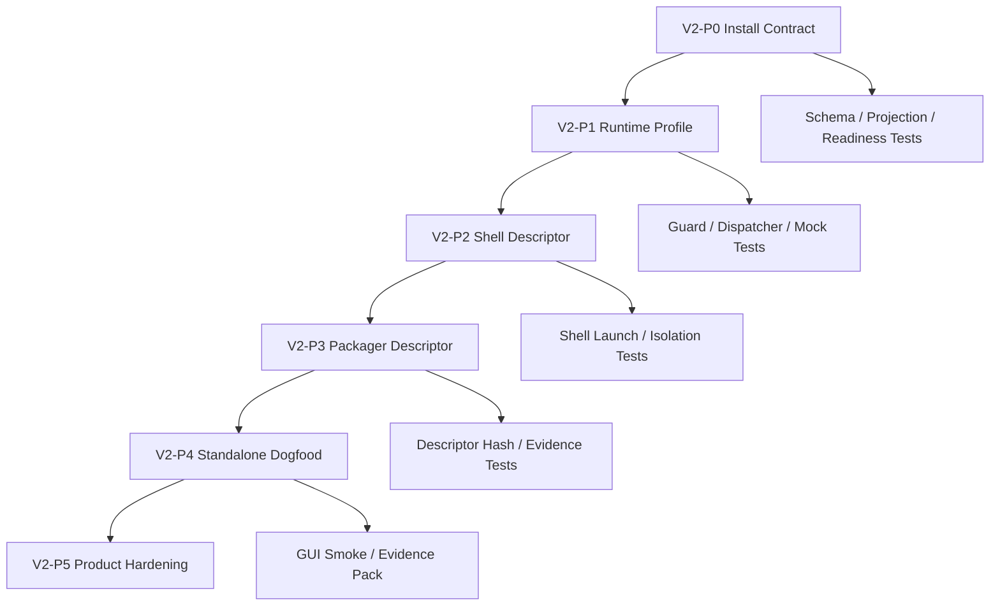

# Agent App v2 实施计划：模块化、升级、隔离、解耦

更新时间：2026-05-19
状态：Draft
用途：把 PRD、架构和接口契约翻译成可执行开发切片；每个切片都必须能独立验证，不与并行 Agent App 代码写集互相覆盖。

## 0. 当前落地状态

更新时间：2026-05-19

| 切片                                     | 状态                                                                                                                        | 证据                                                                                                                                                                                                                                                                                                                                                                                                                                                                                                                                                                                                                                                                                                                                                                                                                                                                                          |
| ---------------------------------------- | --------------------------------------------------------------------------------------------------------------------------- | --------------------------------------------------------------------------------------------------------------------------------------------------------------------------------------------------------------------------------------------------------------------------------------------------------------------------------------------------------------------------------------------------------------------------------------------------------------------------------------------------------------------------------------------------------------------------------------------------------------------------------------------------------------------------------------------------------------------------------------------------------------------------------------------------------------------------------------------------------------------------------------------- |
| V2-P0 Install Contract 主链              | 已完成首刀，Rust local inspection 已合并 `app.install.yaml`                                                                 | `src/features/agent-app/install-mode/*`、`projection.install`、`readiness.installModes`、`InstalledAgentAppState.installMode` 已接入；`src-tauri/src/commands/agent_app_cmd.rs` 已把 `app.install.yaml -> manifest.install` 纳入分层 manifest 主链，`resolves_layered_manifest_files` 覆盖 standalone mode 与 runtime minVersion。                                                                                                                                                                                                                                                                                                                                                                                                                                                                                                                                                            |
| V2-P1 Runtime Profile seam               | 已接入 entry guard / dispatcher / runtime page / mock / denial evidence                                                | `src/features/agent-app/runtime-profile/*` 已能从 `HostCapabilityProfile` / installed state / preview 生成 `LimeRuntimeProfile`；`entryRuntimeGuard` 已按 selected install mode 校验 profile，非 `in_lime` 缺 profile 或 mode 不一致会输出 `RUNTIME_PROFILE_MISSING` stable blocker 与 permission prompt evidence；`capabilityDispatcher` 的 `lime.capabilities.getProfile` 已输出 runtime profile summary 与 capability matrix；mock profile 已进入 `agentAppMocks`；`lime.tools` / connectors 的 execution envelope 会 handoff 到 `lime.agent.startTask` 主链并脱敏 token、绝对路径和 app-owned evidence；RuntimePage / AppCenter / LabPage 已把 selected install mode 与 runtime profile 传入 guard。                                                                                                                                                                                                                                                                                                                                                                                               |
| V2-P2 Lime App Shell prototype           | 已完成 descriptor、launch port prototype、Tauri dev-shell adapter、Agent Apps 管理页 UI entry 接线与独立 dev shell 窗口首刀 | `src/features/agent-app/shell/*` 已能生成 standalone / runtime-backed shell descriptor、隔离策略，并通过 `InMemoryShellLaunchPort` 校验 package identity、runtime profile mode、shell kind 与隔离策略；`resolveShellLaunchDescriptorForInstalledEntry` 已把 UI entry、install mode 分发和 descriptor 组装收回 shell application service；`agent_app_launch_shell` 已进入 `src/lib/api/agentApps.ts`、Rust command、runner 注册、DevBridge dispatcher、governance catalog 与 mocks，能校验 descriptor / installed state / package mount 后复用 current UI runtime，并通过 `agent_app_shell_window` 打开独立 Tauri WebviewWindow；产品化 App Shell 已具备 chrome descriptor、原生关闭策略、per-app deep link / menu action router、standalone macOS App menu 与单 App TrayIcon lifecycle 首刀。                                                                                                                                                |
| V2-P3 Packager descriptor                | 已完成 descriptor 纯逻辑首刀，生产打包待做                                                                                  | `src/features/agent-app/packaging/*` 已能生成 deterministic non-production descriptor hash；签名、updater、安装器仍未开始。                                                                                                                                                                                                                                                                                                                                                                                                                                                                                                                                                                                                                                                                                                                                                                   |
| V2-P4 Content Factory standalone dogfood | 已完成 standalone Agent / Artifact / Evidence 主流程与正式 evidence pack，产品化 shell / installer 仍待 P5                  | `scripts/agent-apps-standalone-shell-smoke.mjs` 已以 `/Users/coso/Documents/dev/ai/limecloud/content-factory-app` 验证 standalone launch，证据见 `.lime/qc/gui-evidence/agent-apps/content-factory-standalone-shell-summary.json`；`scripts/agent-apps-content-factory-flow.mjs --launch-mode standalone-shell --actions none` 已把 shell launch 与 browser-accessible host bridge runtime 页面合并到 summary，证据见 `.lime/qc/gui-evidence/agent-apps/content-factory-standalone-host-actions-none-20260518-codex-rerun-summary.json`；`run-scenarios` 已跑绿，证据见 `.lime/qc/gui-evidence/agent-apps/content-factory-standalone-scenarios-20260518-codex-current-task-guard-summary.json`；`scripts/agent-apps-standalone-evidence-pack.mjs --check` 已汇总正式 pack，证据见 `.lime/qc/gui-evidence/agent-apps/content-factory-standalone-v2-evidence-pack.json`，15/15 checklist pass。 |
| V2-DOC 模块化架构开发蓝图                | 已完成二轮补强，并补机械守卫                                                                                                | `README.md` 已加入模块化、扩展升级、隔离、解耦四个硬目标；`prd.md` 已把四个目标和 macOS App 身份策略提升为产品验收质量门槛；`architecture.md`、`interface-contracts.md`、`code-plan.md` 已固定模块 DAG、Port / Adapter 边界、扩展升级生命周期、macOS Bundle ID / App ID / signing contract、隔离平面、结构扫描和 DoD；`src/features/agent-app/architecture/importBoundaries.test.ts` 已把关键 import 边界变成可执行测试，用于约束后续实现不长成第二套 Runtime。                                                                                                                                                                                                                                                                                                                                                                                                                               |

本轮完成的 V2-P0 证明 Lime 客户端已经能消费 v0.8 install contract 并进入 current projection / readiness / installed state，Rust local inspection 也会把本地 App package 的 `app.install.yaml` 合并到 `manifest.install`，避免 UI / smoke 读到假缺口；V2-P1 已把 Runtime Profile 推进到 entry guard、capability discovery、mock profile、denial evidence、tool handoff context 和主要 Runtime UI 调用链；V2-P2 已有 Shell descriptor、launch port prototype、`agent_app_launch_shell` dev-shell adapter、Agent Apps 管理页 UI entry 接线、DevBridge dispatcher、独立 dev shell WebviewWindow、原生关闭策略、per-app deep link / menu action router、standalone macOS App menu 与单 App TrayIcon lifecycle 首刀；V2-P4 已证明 Content Factory 可用 standalone shell 启动并保持严格隔离，`run-scenarios` 已完成最小 Agent / Artifact / Evidence / workspace patch / page materialization 闭环，正式 evidence pack 为 `.lime/qc/gui-evidence/agent-apps/content-factory-standalone-v2-evidence-pack.json`，verdict 为 `pass` 且 15/15 checklist pass；V2-P3 仍是 Packager descriptor 纯逻辑 seam，尚未接入生产签名 / updater；这些说明 v2 MVP 主链已跨过 standalone 业务闭环门槛，但还不等于完整 standalone 产品发布完成。文档侧已补齐模块化、未来扩展升级、隔离和解耦的开发蓝图，并新增 import boundary 结构测试把关键边界从散文升级为机械守卫；后续代码必须按该蓝图从 contract / domain 到 adapter / GUI 逐层推进。

## 1. 执行原则

1. **先 Contract 后 UI**：先让 `app.install.yaml` 进入 normalizer / projection / readiness，再改安装审查 UI。
2. **先纯逻辑后副作用**：先做 Domain 和 Ports，再接 Tauri / shell launch / filesystem adapter。
3. **先 blocked 再可启动**：不确定的 install mode 先给稳定 blocked strategy，禁止假 ready。
4. **先 descriptor 后安装器**：P2/P3 只证明 Shell descriptor 和 dev shell 可启动，不提前做生产签名 / updater。
5. **每刀都可回滚**：installed state、package hash、runtime profile、evidence 必须能证明切换和回滚边界。
6. **先系统身份后签名发布**：macOS standalone `.app` 必须先确定独立 Bundle ID / App ID / entitlements，再进入 signing、notarization、updater 和 installer。

## 2. 开发切片总览



## 3. V2-P0：Install Contract 主链

### 写集

| 模块       | 文件建议                                                          | 说明                                                |
| ---------- | ----------------------------------------------------------------- | --------------------------------------------------- |
| Contract   | `src/features/agent-app/install-mode/installContract.ts`          | 定义 current install contract。                     |
| Contract   | `src/features/agent-app/install-mode/normalizeInstallContract.ts` | raw v0.8 -> current type。                          |
| Strategy   | `src/features/agent-app/install-mode/installModeStrategy.ts`      | strategy interface。                                |
| Strategy   | `src/features/agent-app/install-mode/installModeRegistry.ts`      | 唯一分发点。                                        |
| Projection | `src/features/agent-app/projection/*`                             | 增加 `installProjection`。                          |
| Readiness  | `src/features/agent-app/readiness/*`                              | 合并 install mode blocker / setup action。          |
| Types      | `src/features/agent-app/types.ts`                                 | 只放 stable public domain type，不塞 adapter type。 |

### 验收

- Content Factory fixture 能输出 `supportedModes`、`preferredMode`、runtime requirement、branding。
- `web_host` 输出 `install_mode_unsupported`，不进入 launch。
- UI 不直接解析 `app.install.yaml`。
- Registry 覆盖全部 `AgentAppInstallMode`。

### 最小测试

```bash
npm test -- src/features/agent-app/install-mode src/features/agent-app/projection src/features/agent-app/readiness
npm run harness:doc-freshness
```

## 4. V2-P1：Runtime Profile seam

### 写集

| 模块            | 文件建议                                                            | 说明                                          |
| --------------- | ------------------------------------------------------------------- | --------------------------------------------- |
| Runtime Profile | `src/features/agent-app/runtime-profile/LimeRuntimeProfile.ts`      | Host-neutral profile type。                   |
| Runtime Profile | `src/features/agent-app/runtime-profile/resolveRuntimeProfile.ts`   | Application service，只依赖 port。            |
| Runtime Profile | `src/features/agent-app/runtime-profile/runtimeCapabilityMatrix.ts` | capability version / availability matrix。    |
| Runtime Guard   | `src/features/agent-app/runtime/entryRuntimeGuard.ts`               | 读取 profile 和 readiness，不读 shell class。 |
| Dispatcher      | `src/features/agent-app/runtime/capabilityDispatcher.ts`            | stable error + evidence context。             |
| Mock            | `src/features/agent-app/sdk/MockCapabilityHost.ts`                  | 输出 mock profile，不伪造生产 ready。         |

### 验收

- Desktop、Mock、App Shell prototype 能产出同一形状的 `LimeRuntimeProfile`。
- Entry guard 不依赖具体 shell class；只接收 selected `installMode` 与 `LimeRuntimeProfile`。
- 非 `in_lime` 启动必须先解析 profile；缺失或 mode 不一致必须 blocked，不能降级为 warning。
- Permission prompt 只暴露 runtime profile summary，不让 UI 反查 `HostCapabilityProfile` 或 shell adapter。
- Capability denial 包含 `installMode`、`runtimeVersion`、`capability`、`method`、`traceId?`。
- Readiness 不 import Desktop UI 或 shell adapter。

### 最小测试

```bash
npm test -- src/features/agent-app/runtime-profile src/features/agent-app/runtime src/features/agent-app/sdk
npm run test:contracts
```

### 当前已落地

- `src/features/agent-app/runtime/entryRuntimeGuard.ts` 增加 `installMode?: AgentAppInstallMode` 与 `runtimeProfile?: LimeRuntimeProfile` 输入，保持 guard 作为 runtime 启动边界，而不是 shell adapter 的内部实现。
- `runtimeProfileIssueForInstallMode` 进入 guard；standalone / runtime-backed 等非 Desktop 安装模式如果没有 profile 或 profile mode 不一致，统一输出 `RUNTIME_PROFILE_MISSING`。
- `AgentAppPermissionPromptDescriptor.runtimeProfile` 只包含 `runtimeId`、`runtimeVersion`、`shellKind`、`installMode` 和 capability 可用性计数，避免 presentation 层读取 host profile 细节。
- `src/features/agent-app/runtime-profile/installedRuntimeProfile.ts` 提供 preview / installed state 到 runtime profile 的复用工厂，避免 UI / AppCenter / LabPage 各自拼接 profile。
- `src/features/agent-app/runtime/capabilityDispatcher.ts` 接收 `runtimeProfile?: LimeRuntimeProfile`，`lime.capabilities.getProfile` 输出 `runtimeProfile` summary 与 `runtimeCapabilities` matrix。
- `src/features/agent-app/ui/AgentAppRuntimePage.tsx`、`AgentAppsPage.tsx`、`AgentAppLabPage.tsx` 已把 selected install mode 与 runtime profile 传入 guard；`AgentAppRuntimePage` 的 Host Bridge dispatcher 同步带 profile。
- 定向验证：`npm test -- src/features/agent-app/runtime-profile src/features/agent-app/runtime/capabilityDispatcher.test.ts src/features/agent-app/ui/AgentAppRuntimePage.test.tsx src/features/agent-app/runtime/entryRuntimeGuard.test.ts src/features/agent-app/install/labInstallFlow.test.ts src/features/agent-app/ui/AgentAppsPage.test.tsx src/features/agent-app/ui/AgentAppLabPage.test.tsx`，75 tests passed。

### 仍待落地

- `MockCapabilityHost` 需要输出 mock runtime profile，不能伪造 standalone production-ready。
- Capability denial / tool handoff evidence 还需要补 `installMode`、`runtimeVersion`、`shellKind` 上下文。

## 5. V2-P2：Lime App Shell prototype

### 写集

| 模块         | 文件建议                                                         | 说明                                                                     |
| ------------ | ---------------------------------------------------------------- | ------------------------------------------------------------------------ |
| Shell        | `src/features/agent-app/shell/ShellLaunchPort.ts`                | shell launch port。                                                      |
| Shell        | `src/features/agent-app/shell/buildStandaloneShellDescriptor.ts` | deterministic descriptor factory。                                       |
| Shell        | `src/features/agent-app/shell/shellIsolationPolicy.ts`           | package / execution / side-effect 隔离策略。                             |
| Rust Service | `src-tauri/src/services/agent_app_shell_window.rs`               | dev shell 独立窗口宿主；只打开已校验 runtime entry URL，不复制 Runtime。 |
| UI           | `src/features/agent-app/ui/*`                                    | 只接 view model，不写 domain 分支。                                      |
| Rust 可选    | `src-tauri/src/agent_app/package_mount.rs`                       | verified package mount / path guard。                                    |
| Rust 可选    | `src-tauri/src/agent_app/shell_launch.rs`                        | dev shell launch adapter。                                               |

### 验收

- 单 App Shell descriptor 能加载 verified package。
- Shell 不展示多 App 管理 UI，不复制 Desktop service。
- App UI / Worker 只拿 SDK bridge，不拿 secrets / filesystem / process。
- Launch port 必须在启动前校验 runtime profile mode、shell kind、package identity 与隔离策略。
- dev shell 必须打开独立 Tauri WebviewWindow，并返回 `shellWindow` 作为启动证据。

### 最小测试

```bash
npm test -- src/features/agent-app/shell src/features/agent-app/runtime
npm run verify:gui-smoke
```

### 当前已落地

- `src/features/agent-app/shell/InMemoryShellLaunchPort.ts` 提供无副作用 launch port prototype，用于验证 descriptor 是否满足 standalone / runtime-backed 启动边界。
- `src/features/agent-app/shell/resolveShellLaunchDescriptorForEntry.ts` 已把 UI entry、install mode 分发和 shell descriptor 组装收回 shell application service，Agent Apps 页面只消费 resolver 输出，不直接拼 `ShellDescriptor`。
- `canLaunch` / `launch` 会在 package identity 缺失、runtime profile mode 不一致、shell kind 不匹配或 isolation policy 非只读 / ref-only / runtime-broker / runtime-provenance 时返回 stable blocker code。
- `agent_app_launch_shell` 已作为 Tauri dev-shell adapter 首刀接入 current 命令边界：前端网关 `launchAgentAppShell` 只提交 `ShellDescriptor`，Rust 侧校验 installed state、package / manifest hash、install mode、runtime profile shell kind 与只读隔离策略，通过后复用 `agent_app_start_ui_runtime` 的 current UI runtime 启动路径，并返回 `shellWindow` 证明已打开独立 dev shell 窗口；浏览器 DevBridge smoke 也桥接同一个 Rust application service，不再落回 unknown command 或 mock。
- `src-tauri/src/services/agent_app_shell_window.rs` 已提供独立 Tauri WebviewWindow 宿主，窗口 label 固定为 `agent-app-shell-<appId>-<mode>`，只接受 http/https runtime entry URL，避免 Shell 直接访问本地文件或复制 Runtime。
- 本轮定向验证：`npm test -- src/lib/api/agentApps.test.ts src/lib/tauri-mock/core.test.ts src/features/agent-app/shell`，42 tests passed；`npm run test:contracts` 通过；`cargo test --manifest-path "src-tauri/Cargo.toml" shell_` 通过 11 tests / 0 failed。
- 定向验证：`npm test -- src/features/agent-app/shell src/features/agent-app/runtime-profile src/features/agent-app/runtime/capabilityDispatcher.test.ts src/features/agent-app/ui/AgentAppRuntimePage.test.tsx src/features/agent-app/ui/AgentAppsPage.test.tsx src/features/agent-app/ui/AgentAppLabPage.test.tsx`，64 tests passed。

### 仍待落地

- 产品化 App Shell 窗口壳：品牌菜单、单 App deep link、托盘/关闭策略与 Tauri 原生 lifecycle 首刀已完成；安装器、签名、公证、远端 updater 与发布 evidence 尚未完成。
- 安装审查到 shell launch 的 view model 接线和失败恢复 evidence；Agent Apps 管理页 UI entry 已能通过 resolver 调用 `agent_app_launch_shell` dev-shell adapter。
- GUI smoke / Playwright evidence 仍需覆盖失败恢复与 evidence pack；standalone 启动首刀证据已由 `scripts/agent-apps-standalone-shell-smoke.mjs` 产出。

## 6. V2-P3：Packager descriptor

### 写集

| 模块        | 文件建议                                                     | 说明                                                 |
| ----------- | ------------------------------------------------------------ | ---------------------------------------------------- |
| Packaging   | `src/features/agent-app/packaging/packageTarget.ts`          | target type：standalone / runtime-backed。           |
| Packaging   | `src/features/agent-app/packaging/validatePackageTarget.ts`  | 校验 package 与目标平台。                            |
| Packaging   | `src/features/agent-app/packaging/buildPackageDescriptor.ts` | deterministic descriptor + hash。                    |
| Evidence    | `src/features/agent-app/install/*`                           | descriptor hash 写入 install evidence。              |
| Script 可选 | `scripts/agent-app-*`                                        | 只在需要生成 descriptor 时新增，不做生产 installer。 |

### 验收

- 相同输入产出相同 descriptor hash。
- descriptor 包含 package hash、runtime requirement、shell requirement、isolation policy。
- 未签名 / updater 缺失必须明确标记为 non-production，不伪装 release-ready。

### 最小测试

```bash
npm test -- src/features/agent-app/packaging src/features/agent-app/install
npm run harness:doc-freshness
```

## 7. V2-P4：Content Factory standalone dogfood

### 写集

| 模块            | 文件建议                                              | 说明                                                           |
| --------------- | ----------------------------------------------------- | -------------------------------------------------------------- |
| Shell / Runtime | `src/features/agent-app/shell/*`、`runtime-profile/*` | 接通 standalone dogfood。                                      |
| Install State   | `src/features/agent-app/install/*`                    | 记录 selected mode、runtime profile summary、descriptor hash。 |
| Runtime         | `src/features/agent-app/runtime/*`                    | capability 调用带 evidence。                                   |
| UI              | `src/features/agent-app/ui/*`                         | 安装审查、启动、失败恢复文案。                                 |
| 外部 App        | `/Users/coso/Documents/dev/ai/limecloud/agentapp`     | 只读标准输入；修改需另行认领写集。                             |

### 验收

- 用户能直接启动内容工厂窗口，不必先进入 Lime Desktop 多 App 管理页。已由 standalone shell smoke 首刀验证 dev shell 窗口与 runtime entry URL。
- 最小 Agent / Artifact / Evidence 流跑通。
- 证据包包含 install mode、runtime profile、package hash、capability trace、artifact refs、evidence refs。

### 当前已落地

- `app.install.yaml` 已进入 Rust local inspection 分层 manifest 主链，Content Factory 本地目录在 review / install 时能投影 `standalone` 支持，不再因为 APP.md 仍是 `manifestVersion: 0.7.0` 而丢失 v0.8 install contract。
- `scripts/agent-apps-standalone-shell-smoke.mjs` 已覆盖 Content Factory standalone shell 启动：强制 installed state 为 `standalone`、通过 `resolveShellLaunchDescriptorForInstalledEntry` 生成 descriptor、经 `launchAgentAppShell` / DevBridge / Rust command 打开 `agent-app-shell-content-factory-app-standalone`，并探测 runtime entry URL。
- 当前证据文件：`.lime/qc/gui-evidence/agent-apps/content-factory-standalone-shell-summary.json`；核心断言 `launched`、`devShell`、`standaloneMode`、`appShellKind`、`shellWindowReturned`、`runtimeEntryReachable`、`strictIsolation` 均为 `true`。
- `scripts/agent-apps-content-factory-flow.mjs` 已新增 `--launch-mode standalone-shell`：先通过 current Agent Apps install/review 主链保存 standalone installed state，再调用 `agent_app_launch_shell` 产出 standalone shellWindow / runtime entry evidence，随后打开 browser-accessible Agent App runtime host 页面承载 Host Bridge，便于 Playwright 继续跑 Content Factory 业务动作。
- 当前可通过的合并入口证据：`.lime/qc/gui-evidence/agent-apps/content-factory-standalone-host-actions-none-20260518-codex-rerun-summary.json`，证明 standalone shell launch、runtime entry probe、strict isolation、host bridge runtime 页面可合并到同一个 summary。
- `agent_app_runtime_get_task` 已补 Agent App 输出合同保底：当 `content_factory.scenario.generate` 的 required Skills `knowledge-builder` / `content-reviewer` 均已完成，但外部模型回合进入 `turn_stuck` 且没有最终 `contentFactoryWorkspacePatch` 时，Runtime 会生成需人工复核的 `scene_table` workspace patch，并作为 `artifact:created`、`evidence:recorded`、`task:completed` task events 暴露；同时对 requested taskId 与 runtime summary taskId 做 mismatch guard，避免复用旧 session 时把历史 patch 误判为当前任务完成。
- 当前可通过的 standalone 业务闭环证据：`.lime/qc/gui-evidence/agent-apps/content-factory-standalone-scenarios-20260518-codex-current-task-guard-summary.json`。该 evidence 的 `allActionsFullRuntimeReady`、`allActionsUsedExpectedSkills`、`allActionsHaveModelUsageCost`、`allActionsHaveWorkspacePatch`、`standaloneShellLaunched`、`standaloneRuntimeEntryReachable`、`standaloneBusinessHostReady`、`strictStandaloneIsolation`、`noConsoleErrors` 均为 `true`；直接复查 task `agent-app-task-4bac1c15-c867-47c6-9aa7-1f05ceb6d143` / session `agent-app-runtime-e27c7c52-0cfb-4fd6-b273-cbd277dc7cd2` 可见 `sceneTable.actualCount=120`，summary 中保留 30 条 rows / imagePrompts 样本以避免 evidence 过大，`skillEvidence=[knowledge-builder, content-reviewer]`。
- `scripts/agent-apps-standalone-evidence-pack.mjs` 已把 standalone shell launch、host runtime、run-scenarios summary、RuntimeProfile、package / manifest hash、task id / session id、Capability SDK trace、artifact / evidence counts、workspace patch、page materialization 和 known gaps 汇总为正式 V2-P4 evidence pack；当前 pack 为 `.lime/qc/gui-evidence/agent-apps/content-factory-standalone-v2-evidence-pack.json`，`verdict.status=pass`，`passed=15/15`，同时明确 `releaseReadiness=not_release_ready`，避免把 P4 dogfood 证据误当成 P5 发布证书。

### 仍待落地

- 产品化独立 App Shell 壳、安装器、签名、公证和 updater 仍属于 V2-P5；当前 evidence pack 只证明 V2-P4 standalone dogfood，不证明 release-ready。
- 卸载 delete-data 已从 rehearsal / confirmation gate 推进到注入式 filesystem executor seam，并在 Rust/Tauri `agent_app_uninstall` 中接入 `confirmationPhrase` 门禁后的受控删除 adapter；Agent Apps UI 已要求精确短语确认并覆盖五语言资源；本轮已补 post-delete residual audit 和 Agent Apps smoke 适配。Claw Chat ready streaming 的 scoped interrupt / recovery turn active gate 已修复，最新全量 `npm run verify:gui-smoke -- --reuse-running --timeout-ms 300000` 已通过。当前剩余发布级缺口不在 delete-data、GUI smoke、CI secret presence、GitHub release secret gate workflow、installer verification command gate 或 final release evidence checker 主链，而在真实 `tauri build`、签名 / 公证 / installer verify 执行、updater 远端上传和真实发布环境运行 evidence。

### 最小测试

```bash
npm run verify:local
npm run verify:gui-smoke
```

如涉及 Tauri command / bridge / mock，同轮追加：

```bash
npm run test:contracts
```

正式 P4 evidence pack 可用以下命令复查：

```bash
node scripts/agent-apps-standalone-evidence-pack.mjs --check
```

## 8. V2-P5：产品化收口

| 工作            | 验收                                                                                                      | 退出条件                                                                                                                                                                                                           |
| --------------- | --------------------------------------------------------------------------------------------------------- | ------------------------------------------------------------------------------------------------------------------------------------------------------------------------------------------------------------------ |
| macOS App 身份  | 每个 standalone `.app` 有独立 Bundle ID / App ID / entitlements；Lime 官方 App 可复用同一 Team 证书签名。 | `src/features/agent-app/packaging/macosIdentity.ts` 已提供 `MacOsStandaloneIdentity` 构造与校验；Content Factory standalone 与 Lime Desktop / Lime Runtime 不共享 Bundle ID，App Group / Keychain group 最小授权。 |
| 升级 / 回滚计划 | dry-run、rollback plan、evidence 均可导出。                                                               | Content Factory 升级失败可回滚到上一 verified package。                                                                                                                                                            |
| 卸载 / 清理     | keep data / delete data 边界明确。                                                                        | cleanup rehearsal evidence、destructive confirmation gate、受控 delete-data executor、Rust/Tauri confirmation adapter、post-delete residual audit 与 UI 精确短语确认回归通过；真实发布前仍需安装器级卸载场景 evidence。 |
| 跨平台路径      | macOS / Windows 路径走统一封装。                                                                          | 无硬编码用户目录或平台路径。                                                                                                                                                                                       |
| 文案与本地化    | 用户可见文案覆盖五语言。                                                                                  | UI test 或 snapshot 覆盖关键状态。                                                                                                                                                                                 |
| 治理守卫        | legacy path 不回流。                                                                                      | governance / contract 检查通过。                                                                                                                                                                                   |

### 当前已落地

- `src/features/agent-app/packaging/macosIdentity.ts` 已把 macOS standalone 身份从文档契约推进到 packager 纯逻辑 seam：`teamId + bundleId -> appId`，并校验不能复用 Lime Desktop Bundle ID、Developer ID 分发必须要求 notarization、`.pkg` 目标必须声明 Developer ID Installer、App Group 使用 `group.*` 命名空间、Keychain Access Group 使用 Team ID 前缀。
- `AgentAppPackageTarget` 已可携带 `packageFormat` 与 `macosIdentity`；`validatePackageTarget` 会在 macOS standalone target 缺少 identity、复用 Desktop Bundle ID 或 `.pkg` 缺 installer identity 时给出稳定 warning。该实现仍保持 `productionReady=false`，不伪装成已完成签名 / notarization / updater。
- `src/features/agent-app/packaging/releasePlan.ts` 已新增 standalone release plan 门禁，把 descriptor non-production、生产 artifact builder、application signing、installer signing、notarization、updater 和 stable rollback 缺口输出为稳定 blocker；同时保留 signing / updater / rollback 的非敏感摘要，证明升级与回滚计划是否已配置；即使 identity / signing 参数齐全，只要真实 builder 与 production descriptor 未完成，release plan 仍保持 `productionReady=false`。
- `src/features/agent-app/packaging/artifactBuilder.ts` 已补 production artifact builder port 与 blocked adapter seam：发布构建计划会列出 macOS `.app/.pkg/.dmg` builder、application signer、installer signer、notarization、updater manifest、rollback manifest 等必需 adapter，并在真实 builder 缺失时固定 `status=blocked`、`artifactRefs=[]`，避免生成伪发布产物。
- `src/features/agent-app/packaging/updaterManifest.ts` 已补 updater manifest writer 的 blocked seam：只有 release plan 与 artifact build plan 都就绪后才允许发布更新清单；当前会把 release blocker 与 `ARTIFACT_BUILD_BLOCKED` 合并成 manifest blocker，并固定 `readyToPublish=false`，避免 updater 清单先于真实签名产物发布。
- `src/features/agent-app/shell/shellChromeDescriptor.ts` 已新增产品化单 App shell chrome descriptor：固定品牌窗口标题、单 App deep link、菜单 label key、托盘状态来源、hide-to-tray 关闭策略，并校验不允许暴露 Desktop 多 App 管理面或绕过 Runtime。它只描述产品壳 chrome policy，不启动第二套 Runtime。
- `src-tauri/src/services/agent_app_shell_window.rs` 已让 dev shell window 返回 `chrome` 证据，包括 deep link scheme、open entry、tray、close policy、menu item ids、`multiAppManagement=false` 与 `runtimeBypass=false`；浏览器 mock 同步返回同形状信息。
- `src-tauri/src/app/runner.rs` 已把 `agent-app-shell-*` 窗口接入 Tauri close event：standalone shell close policy 为 `hide_to_tray` 时，即使全局 `minimize_to_tray=false`，关闭窗口也会隐藏而不是销毁，避免下一次启动丢失 single-app shell 会话。
- `src-tauri/src/services/agent_app_shell_window.rs` 与 `src-tauri/src/app/runner.rs` 已补产品化 native chrome lifecycle 首刀：Agent App deep link URL 必须使用该 App 独立 scheme 且只能打开单 App entry；单实例转发不再只接受 `lime://`，会把 `lime-agent-*://open` 转给主实例；standalone runtime env 会让 macOS App menu 切到 Agent App 菜单，启动时创建单 App `TrayIcon`，托盘 / 菜单共用 `about / open / check_updates / quit` 的 per-app namespace action id；standalone `main` 窗口与 `agent-app-shell-*` 窗口关闭时均按 hide-to-tray 隐藏，避免独立 App 继承 Lime Desktop 多 App 管理面或销毁单 App 会话。
- `src/features/agent-app/packaging/nativeShellRegistration.ts` 已补 standalone native shell registration plan：从 package descriptor 推导独立 `productName`、macOS Bundle ID、per-app deep link scheme、Tauri `deep-link` config patch、runtime env、菜单 label key、托盘与关闭策略；缺 macOS identity 或复用 Desktop deep link scheme 会 blocked，避免独立 App 打包时继续沿用 Lime Desktop 的 `lime://` 注册。
- `src/features/agent-app/packaging/tauriConfigMaterializer.ts` 已把 registration plan 从 patch 推进到 deterministic config materializer：会把独立 `productName`、Bundle ID、单 App 初始窗口标题 / 隐藏策略、per-app deep link scheme 和 runtime env 合并到 standalone Tauri config；registration blocked 时拒绝输出配置，避免 production builder 写出半成品。Tauri menu / tray lifecycle 已在 Rust runner 侧完成首刀，剩余缺口是把 materialized config 经过真实 `tauri build`、签名、公证、installer verify 执行和 updater 上传形成发布 evidence。
- `src/features/agent-app/packaging/artifactBuilder.ts` 已把 standalone Tauri config materializer 接入 production artifact build plan：发布构建计划现在必须显式携带 ready 的 materialized config，并把 `tauri_config_writer`、`tauri_build_runner` 纳入 required adapters；缺 config materializer 时输出 `TAURI_CONFIG_MATERIALIZATION_BLOCKED`，防止真实 builder 绕过 per-app `tauri.conf` 直接打包 Lime Desktop 身份。
- `src/features/agent-app/packaging/tauriConfigWritePlan.ts` 已补 deterministic Tauri config write plan seam：把 materialized config 与 runtime env 转成可落盘的 `tauri.conf.json` / `.env.standalone` 文件计划、content hash 与 plan hash，并在缺输出路径或 config 未就绪时阻断 artifact build；它仍是纯逻辑 Port 前的 write plan，不直接写文件，不伪装真实 `tauri build` 已完成。
- `src/features/agent-app/packaging/tauriConfigWriter.ts` 已补受控 writer executor seam：只能写 output root 内的 `utf8` 文件，拒绝路径穿越和越界路径，写入成功只返回 path / kind / content hash / plan hash evidence，写入失败会带已写文件与失败原因返回；真实 production builder / Node 或 Rust filesystem port 仍待接入。
- `scripts/lib/agent-app-standalone-tauri-config-writer-core.mjs` 与 `scripts/agent-app-standalone-tauri-config-writer.mjs` 已补 Node 发布工具适配器：从 write plan JSON 写入受控 build workspace，并可输出非敏感 writer evidence；脚本仍只负责 config/env 文件写入，不执行 `tauri build`、签名、公证或 updater 发布。
- `scripts/lib/agent-app-standalone-tauri-build-runner-core.mjs` 与 `scripts/agent-app-standalone-tauri-build-runner.mjs` 已补 Tauri build runner seam：要求 writer evidence 为 `written`，从受控 output root 内的 standalone `tauri.conf.json` / `.env.standalone` 生成 `npm run tauri -- build --config ...` 命令计划；CLI 默认只生成 build plan，只有显式 `--execute` 才会运行真实构建，且结果仍标记为 `build_only_not_release_ready`，不伪装签名 / 公证 / updater 已完成。
- `src/features/agent-app/packaging/releasePipeline.ts` 已补 artifact-level release pipeline gate：从 build artifact refs、application / installer signing evidence、notarization evidence、updater manifest 和 rollback manifest 逐项判定发布阻断；即使 artifact evidence 齐全，只要 descriptor 仍是 non-production，pipeline 仍保持 `readyToPublish=false`。
- `scripts/lib/agent-app-standalone-macos-release-commands-core.mjs` 与 `scripts/agent-app-standalone-macos-release-commands.mjs` 已补 macOS 签名 / 公证命令计划 seam：从 artifact refs 生成 `codesign`、`productsign`、`xcrun notarytool submit --wait` 与 `xcrun stapler staple` 命令计划；CLI 默认只产出命令计划，显式 `--execute` 才会执行真实签名 / 公证命令，无 identity 或 notary profile 时保持 blocked。
- `scripts/lib/agent-app-standalone-updater-publisher-core.mjs` 与 `scripts/agent-app-standalone-updater-publisher.mjs` 已补 updater publisher 本地发布 seam：要求 artifact updater signature、macOS notarization evidence、endpoint、pubkey 和 stable rollback refs，生成 `latest.json` / `rollback.json` 与 upload plan；CLI 默认只生成计划，显式 `--write` 只写本地 manifest，不做网络上传。
- `scripts/lib/agent-app-standalone-release-secret-preflight-core.mjs` 与 `scripts/agent-app-standalone-release-secret-preflight.mjs` 已补 release secret preflight：按 platform / package format / channel / updater / remote upload 组合检查 Apple certificate、Developer ID Application / Installer identity、notarization、Tauri updater signing key、rollback ref、remote upload token 和 Windows signing certificate 的 presence；输出只包含 secret 名称和类别，不序列化 secret 值。该门禁可进入 CI release job 前置步骤，避免真实 `codesign` / `notarytool` / updater upload 执行到一半才发现缺配置。
- `scripts/lib/agent-app-standalone-installer-verify-core.mjs` 与 `scripts/agent-app-standalone-installer-verify.mjs` 已补 installer verification gate：从 artifact refs 生成 macOS `codesign --verify`、`spctl --assess`、`pkgutil --check-signature`、`hdiutil verify`、`xcrun stapler validate` 与 Windows `signtool verify /pa /v` 命令计划；CLI 默认只生成 plan，显式 `--execute` 才执行真实系统命令，并拒绝缺 output root、路径穿越、output root 外 artifact、缺 artifact path 与不支持的 package format。该门禁用于签名 / 公证后的发布产物验收，不能替代真实执行 evidence。
- `.github/workflows/agent-app-standalone-release-gate.yml` 已补手动 release secret gate workflow：`workflow_dispatch` 输入 platform / package format / channel / remote upload / updater 组合，将 GitHub Secrets / Vars 注入 `agent-app-standalone-release-secret-preflight.mjs --check`，并在成功或失败时上传非敏感 JSON evidence、写入 step summary；可选 `release_evidence_path` 会调用 final release evidence checker 并上传最终 audit；可选 `artifact_root` 会开启产物路径存在性与安装包 sha256 校验。该 workflow 只证明发布环境 secret 注入、最终 evidence 与产物文件门禁可被 CI 调用，不执行真实 build、signing、notarization、installer verify 或 remote upload。
- `scripts/lib/agent-app-standalone-release-evidence-core.mjs` 与 `scripts/agent-app-standalone-release-evidence-check.mjs` 已补 final release evidence checker：只在 secret preflight ready、Tauri build completed、artifact refs、application / installer signing、notarization / stapler、installer verify `completed`、远端 updater upload evidence 绑定目标 distributable、stable rollback evidence 全部存在时返回 `readyToRelease=true`；传入 artifact root 时还会要求 artifact path 留在 root 内、真实存在，并校验 `.pkg/.dmg/.exe` 的 `sha256:<64 hex>`；缺任一真实 evidence 或文件校验会 stable blocked，避免把本地 plan / manifest write / workflow preflight 误判为可发布。
- `src-tauri/src/services/agent_app_shell_window.rs` 已补 native tray spec、native chrome spec 与 Tauri adapter：menu / tray 共用 per-app namespace action id，tray 只保留 `open / check_updates / quit` 单 App 动作，chrome spec 统一输出 deep link scheme、hide-to-tray close policy，并继续禁止 `multi_app_management` 与 `runtime_bypass`；`cargo test --manifest-path "src-tauri/Cargo.toml" agent_app_shell -- --nocapture` 已覆盖 env gate、close policy、deep link、menu / tray namespace 和 chrome spec。
- `src/features/agent-app/install/lifecycleAction.ts` 已补 delete-data destructive confirmation gate：真实删除 adapter 之前必须先有 ready 的 delete-data rehearsal、无 out-of-scope blocker，并输入精确确认短语 `DELETE_AGENT_APP_DATA <appId> <packageHash>`；该 gate 只允许进入后续 adapter，不直接删除用户数据。
- `src/features/agent-app/install/deleteDataExecutor.ts` 已补 delete-data 受控执行 seam：只有 gate allowed、descriptor / gate 匹配、rehearsal ready 且无 blocked residual target 时才会通过注入式 `AgentAppDeleteDataFileSystemPort` 删除 `path` / `namespace` 目标；`ref` 目标只作为 evidence 保留；空路径、路径穿越、data root 外目标和非本 App namespace 都会阻断；部分删除失败会返回已删除目标与失败 evidence；删除后会通过 `pathExists` 产出 `postDeleteResidualAudit`，发现残留则返回 `POST_DELETE_RESIDUAL_PRESENT`，避免把残留数据误报为已删除。该实现是 production filesystem adapter 前的 current port，不直接绑定 Tauri command。
- `src-tauri/src/commands/agent_app_cmd.rs` 已把 delete-data 受控删除接入 Tauri command seam：`AgentAppUninstallRequest.confirmationPhrase` 必须精确等于 `DELETE_AGENT_APP_DATA <appId> <packageHash>` 才会删除 rehearsal 中 action 为 `delete` 的 `path` / `namespace` 目标；adapter 在删除前统一拒绝路径穿越、data root 外目标、非本 App namespace、unsafe target 和不可删除 kind，成功 / missing / blocked / failed 都返回稳定 `deleteEvidence`；删除后会重新检查真实路径，`postDeleteResidualAudit.status=clear` 才能给出 `deleted`，否则以 `POST_DELETE_RESIDUAL_PRESENT` 失败收口。`src/lib/api/agentApps.ts` 与 `src/lib/tauri-mock/agentAppMocks.ts` 已同步返回 `status / blockerCodes / deleteEvidence / postDeleteResidualAudit`，浏览器 mock 只有精确确认短语才移除 installed state。
- `src/features/agent-app/ui/AgentAppsPage.tsx` 已补 delete-data GUI 精确短语确认：预览 delete-data 时展示确认短语、输入框和匹配状态，确认按钮在短语不匹配时保持锁定；提交时把 `confirmationPhrase` 传给 `uninstallAgentApp`，如果 native 返回 blocked 会保留预览并显示阻断摘要。相关文案已覆盖 `zh-CN / zh-TW / en-US / ja-JP / ko-KR`；`scripts/agent-apps-smoke.mjs` 已读取确认短语并填入输入框，`.lime/qc/gui-evidence/agent-apps/agent-apps-smoke-summary.json` 断言 `deleteDataConfirmationGateAccepted=true`。

## 9. PR 切分建议

| PR   | 目标                                          | 不做                         |
| ---- | --------------------------------------------- | ---------------------------- |
| PR-1 | `install-mode` 纯逻辑 + tests。               | 不改 UI，不接 Tauri。        |
| PR-2 | projection / readiness 合并 install mode。    | 不启动 standalone。          |
| PR-3 | runtime profile + guard / dispatcher。        | 不新增 shell 二进制。        |
| PR-4 | shell descriptor + isolation policy。         | 不做生产安装器。             |
| PR-5 | App Shell prototype + GUI smoke。             | 不做 marketplace / updater。 |
| PR-6 | Content Factory standalone dogfood evidence。 | 不把业务逻辑写进 Lime Core。 |

## 10. 风险门禁

| 风险                | 门禁                                                                                    |
| ------------------- | --------------------------------------------------------------------------------------- |
| 双 runtime          | 禁止新增 `agent-app-v2` 平级运行时；新增能力必须回 current `src/features/agent-app/*`。 |
| UI 业务化           | UI 只能消费 view model；状态转移由 service / strategy 产出。                            |
| Shell 复制 Desktop  | Shell adapter 不 import Desktop UI / App Center / multi-app manager。                   |
| Capability 绕过治理 | App side 只能走 SDK facade；Runtime side 必须记录 policy / evidence。                   |
| 过度设计            | v2 MVP 不做 marketplace、生产签名安装器、完整 updater、Cloud Web Host。                 |

## 11. 完成定义

V2-P0 到 V2-P4 可宣称 MVP 完成的条件：

- `app.install.yaml` 被 current normalizer 消费，并进入 projection / readiness / installed state。
- `LimeRuntimeProfile` 驱动 Desktop / App Shell / runtime-backed 的 readiness 与 guard。
- Standalone shell descriptor 可启动 verified package。
- Content Factory standalone dogfood 至少跑通一条主流程。
- capability 调用、artifact、evidence 都能证明没有绕过 Runtime governance。
- GUI smoke 或 Playwright 证据覆盖安装审查、启动、主流程和失败恢复。
