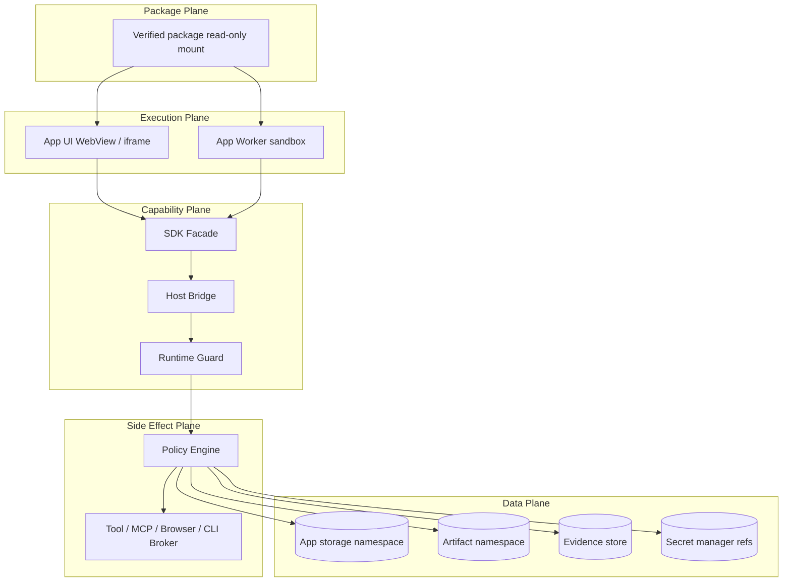
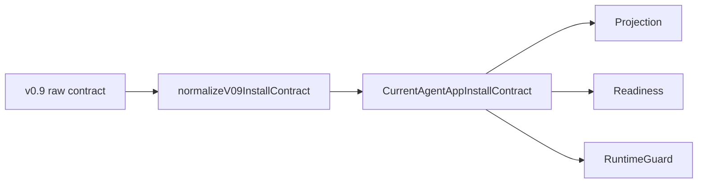
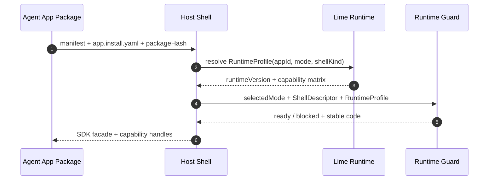

# Agent App v2 接口契约与扩展蓝图

更新时间：2026-05-18
状态：Draft
用途：给实现者固定模块边界、port contract、扩展升级方式和隔离规则，避免 v2 在开发中长成第二套运行时或第二个 Desktop。

## 1. 架构不变量

v2 所有实现必须同时满足这四条不变量：

1. **Agent App 只依赖 SDK Facade**：App package 只能通过 `@lime/app-sdk` 与 `lime.*` capability 调用宿主能力。
2. **Domain 只依赖 Port**：projection、readiness、install state、runtime profile 等纯逻辑不能 import React、Tauri、filesystem、network 或 shell 实现。
3. **Shell 只做宿主适配**：Lime Desktop、Lime App Shell、runtime-backed shell 都是 Host Shell adapter，不复制 Runtime 能力。
4. **升级只进 Normalizer / Strategy**：manifest 版本、install mode、runtime capability 的变化不能散落到 UI 分支或 runtime 分支。

```mermaid
flowchart LR
  App[Agent App Package] --> SDK[@lime/app-sdk Facade]
  SDK --> Bridge[Host Bridge Envelope]
  Bridge --> Port[Runtime Ports]
  Port --> Runtime[Lime Runtime Core]

  UI[Presentation / ViewModel] --> AppSvc[Application Services]
  AppSvc --> Domain[Domain Model]
  Domain --> Port
  Adapter[Desktop / AppShell / Tauri Adapters] --> Port

  Domain -. forbidden .-> UI
  Domain -. forbidden .-> Adapter
  App -. forbidden .-> Runtime
  App -. forbidden .-> DesktopInternals[Lime Desktop Internals]
```

## 2. 模块依赖矩阵

| From / To | Contract | Domain | Application Service | Port | Adapter | UI |
| --- | --- | --- | --- | --- | --- | --- |
| Contract | 可以 | 可以输出 current type | 禁止 | 禁止 | 禁止 | 禁止 |
| Domain | 可以 | 可以 | 禁止 | 可以依赖接口 | 禁止 | 禁止 |
| Application Service | 可以 | 可以 | 可以 | 可以依赖接口 | 禁止 | 禁止 |
| Adapter | 可以 | 可以 | 可以委托 | 实现接口 | 可以 | 禁止反向注入 |
| UI / ViewModel | 可以读取 view model | 禁止直接改 domain 状态 | 可以调用 | 禁止直接调用底层 port | 禁止直接 import | 可以 |

落地守卫：

- `install-mode`、`runtime-profile`、`projection`、`readiness` 内禁止 import `src/features/agent-app/ui`。
- `ui` 内禁止直接拼 `ShellDescriptor`、`ActivationPlan`、`CleanupPlan`，必须调用 Application Service。
- `runtime` 内禁止根据 UI route 选择 capability；只读 `RuntimeProfile`、`EntryRuntimeGuard` 和 capability catalog。
- `sdk` 内禁止引用 Content Factory 或其他业务 App 专用类型。

### 2.1 接口稳定性等级

不同接口的稳定性不同；实现者必须先判断自己修改的是哪一层契约，避免把 experimental 细节暴露成长期包袱。

| 等级 | 适用对象 | 兼容要求 | 变更方式 |
| --- | --- | --- | --- |
| Public Stable | `@lime/app-sdk` facade、`lime.*` capability envelope、stable error code。 | 不能破坏已发布 App；新增字段默认 optional。 | 新 capability 先加 catalog / mock / denial / evidence，再开放给 App。 |
| Runtime Contract | `LimeRuntimeProfile`、Host Bridge envelope、Capability Dispatcher 输入输出。 | Desktop、Standalone、runtime-backed 必须共享语义。 | 新 shell kind 只加 profile adapter，不改 dispatcher 核心语义。 |
| Install Contract | current install contract、install mode enum、shell / runtime requirement。 | raw 版本可变，current type 稳定。 | 新版本只加 normalizer；旧字段不进入 domain 分支。 |
| Internal Current | projection、readiness、activation、cleanup、upgrade plan。 | 模块内可演进，但跨模块只暴露 public type。 | 修改时同步 tests、结构守卫和 docs。 |
| Experimental | packager descriptor、dev shell adapter、future updater / signer。 | 不承诺生产兼容。 | 必须标注 non-production，不能伪装 release-ready。 |

判断规则：只要接口会被 Agent App package、Host Shell、Runtime、Tauri command 或 evidence pack 消费，就必须有 version / descriptorVersion / stable error code / optional 字段策略中的至少一种。

## 3. 核心契约草案

### 3.1 Current Install Contract

```ts
export type AgentAppInstallMode = 'in_lime' | 'standalone' | 'runtime_backed' | 'web_host'

export type CurrentAgentAppInstallContract = {
  schemaVersion: 1
  supportedModes: AgentAppInstallMode[]
  preferredMode: AgentAppInstallMode
  runtimeRequirement: RuntimeRequirement
  shellRequirement: ShellRequirement
  branding: InstallBranding
  upgradePolicy: InstallUpgradePolicy
  isolationPolicy: InstallIsolationPolicy
}
```

规则：

- raw `app.install.yaml` 不进入业务模块；所有业务模块只读 `CurrentAgentAppInstallContract`。
- `web_host` 在 v2 只能产生 `blocked` readiness，不能因为 schema 里存在就变成可启动。
- `preferredMode` 必须由 normalizer 决定，UI 只能展示和让用户选择已支持模式。

### 3.2 Install Mode Strategy

```ts
export interface InstallModeStrategy {
  readonly mode: AgentAppInstallMode
  project(input: InstallModeProjectionInput): AgentAppInstallProjection
  checkReadiness(input: InstallModeReadinessInput): InstallModeReadiness
  buildActivationPlan(input: InstallModeActivationInput): ActivationPlan
  buildCleanupPlan(input: InstallModeCleanupInput): CleanupPlan
}

export interface InstallModeRegistry {
  get(mode: AgentAppInstallMode): InstallModeStrategy
  listSupported(): AgentAppInstallMode[]
  assertExhaustive(): void
}
```

扩展规则：

- 新增 install mode 只允许新增一个 strategy、fixture 和 tests。
- Registry 必须覆盖 enum 全集；未实现模式用明确的 `UnsupportedReservedInstallStrategy`。
- UI / runtime 中出现 `mode === 'standalone'` 应视为设计异味，除非是测试断言或 view model label map。

### 3.3 Runtime Profile Port

```ts
export interface RuntimeProfilePort {
  resolve(input: RuntimeProfileResolveInput): Promise<LimeRuntimeProfile>
}

export type RuntimeProfileResolveInput = {
  appId: string
  installMode: AgentAppInstallMode
  hostProfile: HostCapabilityProfile
  shellKind?: 'desktop' | 'app_shell' | 'runtime_backed' | 'web_host'
  storageNamespace?: string
}
```

实现规则：

- Desktop、App Shell、runtime-backed shell 各自实现 adapter，但输出同一个 `LimeRuntimeProfile`。
- Readiness、EntryRuntimeGuard、CapabilityDispatcher 只读 profile，不反查 shell 具体类。
- EntryRuntimeGuard 必须把 selected install mode 与 profile mode 作为启动边界；非 `in_lime` 缺 profile 或 mode 不一致时返回 `RUNTIME_PROFILE_MISSING`。
- Prompt / UI 只能拿 profile summary，不能读 `HostCapabilityProfile` 或 shell adapter 私有字段。
- profile 中 capability 缺失必须变成 stable blocker，而不是 runtime 抛字符串。

### 3.4 Shell Launch Port

```ts
export interface ShellLaunchPort {
  canLaunch(descriptor: ShellDescriptor): Promise<ShellLaunchReadiness>
  launch(descriptor: ShellDescriptor): Promise<ShellLaunchResult>
}

export type ShellDescriptor = {
  descriptorVersion: 1
  appId: string
  packageHash: string
  installMode: AgentAppInstallMode
  runtimeProfileSummary: RuntimeProfileSummary
  entry: ShellEntryDescriptor
  isolation: ShellIsolationPolicy
  branding: InstallBranding
}
```

实现规则：

- Shell descriptor 由 Application Service 构建；UI 不能直接拼 descriptor。
- `launch` 只能启动已验证 package；未验证 package 必须停在 `canLaunch` readiness blocker。
- 首轮 packager 只输出 deterministic descriptor，不做生产签名和 updater 假实现。

### 3.5 Evidence Recorder Port

```ts
export interface EvidenceRecorderPort {
  recordInstallEvent(event: InstallEvidenceEvent): Promise<EvidenceRef>
  recordCapabilityEvent(event: CapabilityEvidenceEvent): Promise<EvidenceRef>
  recordUpgradeEvent(event: UpgradeEvidenceEvent): Promise<EvidenceRef>
}
```

实现规则：

- Evidence 由 Runtime / Host 注入 provenance，App 不能自填可信 evidence。
- 安装、启动、capability 调用、升级、回滚、卸载都必须可追踪。
- Evidence event 只能引用 secret ref、artifact ref、trace id，不能写入 secret value。

### 3.6 macOS App Identity Contract

```ts
export type MacOsStandaloneIdentity = {
  platform: 'macos'
  teamId: string
  bundleId: string
  appId: string
  appGroups: string[]
  keychainAccessGroups: string[]
  signingCertificateKind: 'developer_id_application' | 'apple_distribution' | 'ad_hoc' | 'unsigned'
  installerCertificateKind?: 'developer_id_installer'
  notarizationRequired: boolean
}
```

契约规则：

- `bundleId` 必须对每个 standalone App 唯一；`appId` 是 Team ID 与 Bundle ID 组合后的系统身份。
- 多个 Lime 官方 standalone App 可以复用同一 Team 的 Developer ID Application 证书签名，但必须有各自的 Bundle ID / App ID / entitlements。
- `.pkg` 安装器需要单独的 installer signing identity；这不改变 App 的 Bundle ID。
- App Group / Keychain Access Group 是共享能力 allow list，不是默认打开；只有 Runtime broker 需要本地共享时才配置。
- `unsigned` / `ad_hoc` 只能用于 dev shell 或测试 descriptor，不能标记为 production-ready。

## 4. 隔离平面



| 平面 | 隔离要求 | 失败处理 |
| --- | --- | --- |
| Package | verified package 只读挂载，hash / manifest mismatch 直接 blocked。 | 不启动 App，生成 install evidence。 |
| Execution | UI / Worker 不拿 Node、filesystem、secret 明文和外部进程能力。 | Runtime guard 返回 stable error。 |
| Capability | 所有调用进入 `capability:invoke` envelope，按 allowlist / policy 判断。 | 返回 `capability_denied` / `capability_unavailable`。 |
| Data | storage / artifact / event namespace 按 appId 与 package identity 隔离。 | cleanup plan 可保留或删除 namespace。 |
| Side Effect | Tool / MCP / Browser / CLI 只由 Runtime broker 发起。 | policy deny 或二次确认。 |
| Evidence | Runtime 写 provenance，App 只能读取授权 evidence ref。 | evidence 写失败时 capability 结果不得假装已审计。 |

## 5. 扩展升级剧本

### 5.1 新 manifest / install contract 版本



执行步骤：

1. 新增 raw schema fixture 和 parser 测试。
2. 新增 `normalizeVxxInstallContract`，输出 current type。
3. 补 projection snapshot 和 readiness blocker 测试。
4. 禁止在 UI / runtime 中读取 `manifestVersion`。

### 5.2 新 install mode

执行步骤：

1. 在唯一 enum 事实源新增 mode。
2. 新增 `InstallModeStrategy` 实现和 registry 测试。
3. 新增 readiness、activation、cleanup 三类测试。
4. 如果 mode 不能在本阶段启动，必须注册 blocked strategy，而不是留空。

### 5.3 新 Host Shell

执行步骤：

1. 新增 shell adapter，实现 `RuntimeProfilePort` 和 `ShellLaunchPort`。
2. 复用 `LimeRuntimeProfile`、Host Bridge envelope、Capability SDK。
3. 补 shell descriptor snapshot，不新增第二套 Runtime service。
4. GUI 可见时补 smoke 或 Playwright 证据。

### 5.4 新 Runtime capability

执行步骤：

1. 先进入 capability catalog / SDK facade 事实源。
2. 补 RuntimeProfile capability matrix。
3. 补 policy / evidence / stable error code。
4. 再接 Host Bridge dispatcher 和 mock；涉及 Tauri 命令时跑 `npm run test:contracts`。

### 5.5 App package 升级

执行步骤：

1. `dryRunUpgrade` 比较 package hash、manifest hash、install contract 和 storage migration。
2. 输出 `UpgradePlan`、`RollbackPlan`、`CleanupPlan`。
3. 先写 upgrade evidence，再切换 active package。
4. 失败回滚到上一 verified package，用户数据默认保留。

## 6. 错误码约束

稳定错误码必须比文案更早设计，避免 UI、SDK、Runtime 各自造字符串。

| Code | 场景 | 用户行动 |
| --- | --- | --- |
| `install_contract_invalid` | `app.install.yaml` 无法解析或 schema 不通过。 | 让 App 作者修 package。 |
| `install_mode_unsupported` | mode 合法但 v2 当前不支持启动。 | 选择其他 mode 或等待后续版本。 |
| `runtime_profile_missing` | 找不到符合要求的 Runtime。 | 安装或升级 Lime Runtime。 |
| `capability_unavailable` | Runtime 缺少 capability 或版本不足。 | 升级 Runtime / 调整 App 要求。 |
| `capability_denied` | policy 拒绝 capability 调用。 | 管理员授权或改配置。 |
| `package_not_verified` | package hash / manifest hash 不可信。 | 重新下载或停止安装。 |
| `shell_launch_blocked` | Shell descriptor 不满足启动条件。 | 查看 blocker 和 setup action。 |
| `evidence_record_failed` | evidence 写入失败。 | 停止可审计动作或重试。 |

## 7. 开发者检查清单

每个 v2 PR 合并前必须能回答：

- 改动落在哪个模块？是否保持单一职责？
- 是否新增了 current path，还是错误地新增了 compat / deprecated path？
- Domain 是否仍只依赖 port interface？
- 新增字段是否经过 schema、normalizer、projection、readiness、测试全链？
- 新增 shell / mode / capability 是否只通过 strategy / adapter 扩展？
- 是否有 stable error code、setup action 和 evidence ref？
- GUI 可见变化是否补了五语言文案和稳定回归？
- 是否证明 standalone / runtime-backed 没有绕过 Runtime governance？

## 8. 版本协商与升级兼容

v2 允许 Agent App、Host Shell 和 Runtime 独立升级，但升级必须通过显式协商，不允许靠“能跑就行”的隐式兼容。



协商规则：

- App 声明的是需求，RuntimeProfile 声明的是事实，Readiness / Guard 负责把两者比对成 `ready`、`needs-setup` 或 `blocked`。
- `minVersion`、capability version、shell kind、install mode 不匹配时必须阻断或给 setup action，不能静默降级。
- 新字段进入 current type 时默认 optional，但必须定义“缺失时的 readiness 语义”；没有语义的字段不应进入 current domain。
- adapter 可以兼容旧版本输入，但输出必须是 current contract；UI、runtime、shell service 不读历史版本分支。
- 升级前必须 dry-run，升级后必须记录 evidence；失败必须能按 rollback plan 回到上一 verified package。

## 9. 隔离契约矩阵

| 调用方向 | 允许传递 | 禁止传递 | 失败码 |
| --- | --- | --- | --- |
| App -> SDK | capability name、method、payload、trace hint。 | provider key、host path、Tauri command、process handle。 | `capability_denied` / `capability_unavailable` |
| SDK -> Runtime | envelope、appId、package identity、permission context。 | React state、UI route 私有状态。 | `runtime_profile_missing` |
| Shell -> Runtime | `LimeRuntimeProfile` resolve input、shell kind、storage namespace ref。 | Desktop service instance、tool broker instance、secret value。 | `runtime_profile_missing` |
| UI -> Application Service | app id、selected mode、view model action。 | raw yaml、Tauri payload、mutable installed state。 | `shell_launch_blocked` |
| Adapter -> Domain | stable result、ref、descriptor hash、error code。 | adapter internal object、filesystem handle、network response body 原样透传。 | 对应 stable code |
| Runtime -> Evidence | provenance、traceId、artifact ref、capability event。 | secret value、未授权用户数据。 | `evidence_record_failed` |

这张矩阵是“隔离”和“解耦”的接口层定义：每次跨边界都必须传递可序列化、可审计、可替换的契约对象，而不是传递实现对象。
