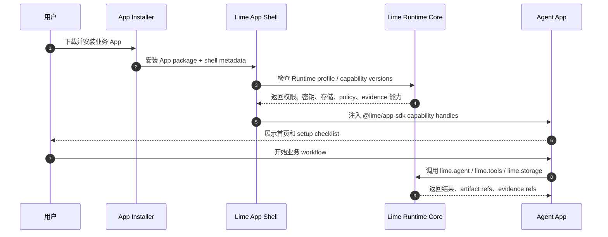
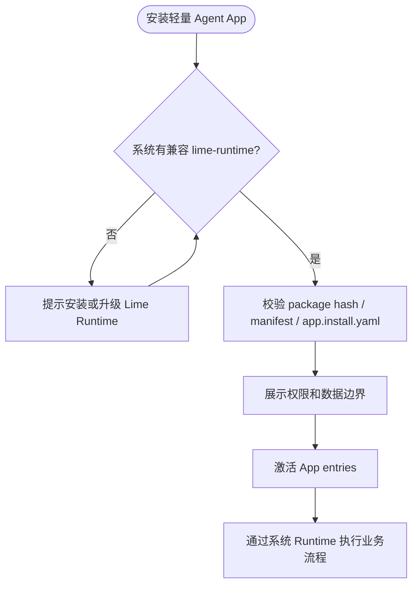

# Agent App v2 PRD：独立安装与 Runtime 底座拆分

更新时间：2026-05-18
状态：Draft
事实源：`/Users/coso/Documents/dev/ai/limecloud/agentapp` v0.8 标准、`docs/roadmap/agentapp/` v1 客户端路线图

## 1. 一句话目标

让任意合格 Agent App 可以像普通桌面软件一样被独立安装和启动，同时继续复用 Lime Runtime 的 Agent、模型、工具、权限、密钥、存储、Artifact、Evidence 和审计能力。

```text
Agent App 是产品
Lime Runtime 是底座
Lime Desktop 是多 App 工作台
Lime App Shell 是独立单 App 宿主
```

## 2. 背景与问题

v1 已把 Agent App 从“文档 / 专家 / prompt 集合”推进为可安装、可投影、可 readiness、可通过 Capability SDK 调用宿主能力的桌面 App 形态。但当前产品心智仍容易被理解为“用户必须先下载 Lime Desktop，才能使用某个 Agent App”。

这会带来三个问题：

| 问题 | 影响 |
| --- | --- |
| 分发摩擦高 | 用户只想使用一个业务 App，却要先理解 Lime Desktop。 |
| 产品品牌被稀释 | 垂直 App 难以像独立软件一样拥有自己的窗口、图标、启动器和更新节奏。 |
| 平台边界不清 | 如果不抽出 Runtime，App 作者容易选择自建模型网关、凭证库和证据链。 |

v2 要解决的不是“再做一个壳”，而是把 Lime 的底层能力产品化为可嵌入 Runtime，让 Agent App 有独立分发机会。

## 3. 目标与非目标

### 目标

1. 支持 `in_lime`、`standalone`、`runtime_backed` 三种本地安装路径，并为 `web_host` 保留兼容边界。
2. 在 Lime 客户端消费 Agent App v0.8 `app.install.yaml`，并把 install mode 纳入 projection、readiness、安装审查、激活、升级、卸载和 evidence。
3. 抽出 Lime Runtime Core 的客户端侧最小接口，让 Lime Desktop 和 Lime App Shell 使用同一 Capability SDK / Host Bridge / policy / evidence 语义。
4. 做出 Content Factory standalone dogfood：用户直接启动“内容工厂”，不必先打开 Lime Desktop。
5. 保持治理边界：独立 App 不得自建模型网关、密钥存储、权限系统、tool runtime 或 evidence store。

### 非目标

- 不在 v2 首刀实现完整 Marketplace、计费、团队授权或 Cloud 运营后台。
- 不把 Lime Desktop 拆成多个发布仓库，除非独立 shell 打包已证明需要。
- 不重写现有 Agent App v1 投影、readiness、Host Bridge、Artifact / Evidence 主链。
- 不为了兼容旧 SceneApp / deprecated entry 继续扩展旧路径。
- 不把 Content Factory 的业务逻辑写入 Lime Core。

## 4. 用户与场景

| 用户 | 需求 | v2 体验 |
| --- | --- | --- |
| 普通业务用户 | 只想安装一个能完成工作的 App。 | 下载并打开 `Content Factory.app` / `Content Factory Setup.exe`，完成权限和设置后直接工作。 |
| Lime 重度用户 | 在一个工作台管理多个 Agent App。 | 继续通过 Lime Desktop App Center 安装、启动、调试和管理。 |
| 企业管理员 | 控制 Runtime、权限、数据边界和版本。 | 可预装 `lime-runtime`，让多个 runtime-backed App 复用同一底座。 |
| App 作者 | 希望业务 App 有独立品牌和低摩擦分发。 | 在 package 中声明 `app.install.yaml`，通过 packager 产出独立安装包。 |
| Lime 开发者 | 不希望每个 App 复制 Runtime 能力。 | 抽出 Runtime capability profile，用同一套 bridge / policy / evidence 服务多宿主。 |

## 5. 核心用户路径

### 5.1 独立安装路径



### 5.2 Runtime-backed 路径



### 5.3 Lime Desktop 路径

Lime Desktop 继续是高级宿主：App Center、调试、开发者模式、多 App 编排、统一升级、团队策略和跨 App evidence 查询仍放在 Desktop 中。v2 不削弱 Desktop，而是把 Desktop 从“唯一入口”升级为“最强入口”。

## 6. 产品需求

### 6.1 Install mode 消费

| 编号 | 需求 | 验收 |
| --- | --- | --- |
| FR-01 | Lime 能解析 Agent App v0.8 `app.install.yaml`。 | projection 输出 `install`，readiness 能识别 `in_lime` / `standalone` / `runtime_backed`。 |
| FR-02 | 安装审查页展示安装模式、Runtime 要求、Shell 要求和品牌信息。 | 用户能在激活前看到“安装到 Lime / 独立 App / 依赖系统 Runtime”的差异。 |
| FR-03 | install mode 写入 installed state。 | 重启后仍能看到该 App 以何种模式安装。 |
| FR-04 | cleanup / uninstall plan 覆盖 install mode。 | 独立壳、runtime-backed 状态、storage、artifact、evidence 清理边界明确。 |

### 6.2 Lime Runtime Core seam

| 编号 | 需求 | 验收 |
| --- | --- | --- |
| FR-05 | 定义 `LimeRuntimeProfile`，表达 runtime version、capabilities、policy、storage、evidence、shell constraints。 | Lime Desktop 与 App Shell 可用同一 profile 驱动 readiness。 |
| FR-06 | Host Bridge 不绑定 Desktop 内部路径。 | App Shell 可以复用 bridge 协议，不 import Lime Desktop UI internals。 |
| FR-07 | Capability SDK 调用仍走统一 policy / evidence。 | Standalone dogfood 的 `lime.agent` / `lime.tools` / `lime.storage` 调用能生成 trace/evidence。 |

### 6.3 Lime App Shell

| 编号 | 需求 | 验收 |
| --- | --- | --- |
| FR-08 | 最小单 App Shell 能加载已验证 Agent App package。 | 能启动 Content Factory dashboard，不显示 Lime Desktop 多 App 管理 UI。 |
| FR-09 | Shell 支持品牌化窗口信息。 | 图标、窗口标题、App 名称来自 `app.install.yaml` / manifest presentation。 |
| FR-10 | Shell 支持权限审查和 setup checklist。 | 首次启动前能展示权限、Knowledge binding、Tool/Connector 缺口。 |
| FR-11 | Shell 支持基础更新和禁用策略的预留接口。 | PRD 阶段只定义接口，不实现完整 updater。 |

### 6.4 Packager / Dogfood

| 编号 | 需求 | 验收 |
| --- | --- | --- |
| FR-12 | 提供最小 packager 设计，输入 Agent App package，输出 standalone shell descriptor。 | 不要求首轮生成生产签名安装包，但 descriptor 可被 Shell 启动。 |
| FR-13 | Content Factory 完成 standalone dogfood。 | 用户能直接打开内容工厂窗口，完成一个最小知识构建 / 内容生成流程。 |
| FR-14 | Dogfood evidence 可导出。 | 输出安装模式、runtime profile、capability 调用、artifact、evidence 的证据包。 |

## 7. 非功能需求

| 维度 | 要求 |
| --- | --- |
| 安全 | App 不得直接读取 secrets、绕过 permission、直接启动 tool runtime 或 import Desktop internals。 |
| 隐私 | 客户数据仍留在 workspace、Knowledge、app storage、secrets 或 overlay，不进入官方 package。 |
| 可回滚 | 独立壳失败时可禁用 App、保留数据、导出 evidence。 |
| 跨平台 | macOS / Windows 默认同等考虑；路径走统一封装，不硬编码平台目录。 |
| 可观测 | install mode、runtime version、capability version、traceId、evidenceId 必须可记录。 |
| 可测试 | 每个新增边界优先补结构测试；GUI 改动必须做最小真实 smoke。 |

### 7.1 macOS App 身份与签名策略

独立 Agent App 一旦作为 `.app` 分发，就必须拥有自己的 macOS 身份；不能和 Lime Desktop 复用同一个 Bundle ID / App ID。

| 对象 | v2 决策 | 原因 |
| --- | --- | --- |
| Bundle ID | 每个 standalone App 独立，例如 `ai.lime.agentapp.content-factory`；Lime Desktop、Lime Runtime、Content Factory 分别使用不同 Bundle ID。 | Bundle ID / App ID 是 macOS 识别 App、容器、默认 keychain access group、升级关系和权限能力的基础；复用会造成安装、更新、容器和权限碰撞。 |
| Apple App ID | 每个需要独立能力的 `.app` 使用 explicit App ID；App ID 由 Team ID + Bundle ID 组成。 | explicit App ID 对应单个 App，能力开关是 allow list；standalone App 需要自己的 entitlements / provisioning profile。 |
| 签名证书 | Lime 官方分发的多个 App 默认复用同一 Team 下的 Developer ID Application 证书；`.pkg` 安装器另用 Developer ID Installer 证书。 | 证书证明“谁签的”，不是“这是哪个 App”；App 身份由 Bundle ID / App ID / entitlements 决定。 |
| App Group | 只有需要本地共享容器或 IPC 时才加入共享 App Group，例如 Runtime 与 Shell 共享最小 handshake 状态。 | 默认数据隔离；共享必须显式、最小化、可审计。 |
| Keychain Access Group | secrets 默认留在 Runtime / Secret Manager；如需跨 App 共享登录态，只写入显式 shared access group，不使用各 App 默认 keychain group。 | 默认 keychain group 绑定单个 App；共享凭证必须可控，避免所有 standalone App 互相读 secrets。 |
| 第三方作者签名 | 第三方自行分发 standalone `.app` 时使用自己的 Apple Developer Team / 证书，不能直接加入 Lime 的 App Group / Keychain group。 | Apple 的共享组受 Team 边界限制；跨 Team 共享必须走 Runtime broker、账号授权或云端协议。 |

产品口径：用户看到的是独立 App，系统看到的是独立 Bundle ID；Lime Runtime 通过 SDK / Host Bridge / IPC / capability broker 提供能力，不靠复用 Lime Desktop 的 App ID 伪装成同一个 App。

### 7.2 架构质量门槛

v2 的产品成功不是“能打开一个独立窗口”，而是独立安装后仍能长期演进。每个里程碑必须同时满足以下质量门槛：

| 门槛 | 产品解释 | 工程验收 |
| --- | --- | --- |
| 模块化 | 一个 App 可以选择不同宿主，而不会改业务包。 | Contract / Domain / Port / Adapter / UI 分层清晰，新增宿主不改核心 domain。 |
| 扩展升级 | v0.9 / v1.0 标准、企业 Runtime、Web Host 后续可接入。 | 新版本只加 normalizer，新模式只加 strategy，新 shell 只加 adapter，并带 dry-run / rollback / evidence。 |
| 隔离 | 独立 App 不会扩大用户安全面。 | package 只读、storage namespace、secret ref-only、tool side effects 走 Runtime broker。 |
| 解耦 | 用户不必装完整 Lime Desktop，但治理能力不能被复制或绕过。 | Standalone / runtime-backed 共享 `LimeRuntimeProfile`、Host Bridge、Capability SDK、Policy 和 Evidence。 |

验收口径：只要某个功能需要复制模型网关、secret store、tool broker、evidence store 或 Desktop 私有状态，就判定为不满足 v2 PRD。

## 8. 架构边界

详细架构见 [`architecture.md`](./architecture.md)，接口契约与扩展升级剧本见 [`interface-contracts.md`](./interface-contracts.md)，代码落地计划见 [`code-plan.md`](./code-plan.md) 和 [`implementation-plan.md`](./implementation-plan.md)。PRD 只固定产品目标和验收口径，架构、接口和代码规划以这些文档为执行事实源。

```text
Agent App Package
  APP.md / app.install.yaml / dist/ui / dist/worker / storage / workflows
        ↓
@lime/app-sdk
  stable capability facade
        ↓
Lime Runtime Core
  agent / model / tools / connectors / storage / secrets / policy / evidence
        ↓
Host Shells
  Lime Desktop / Lime App Shell / runtime-backed shell / Web Host
```

| 边界 | 可以做 | 禁止做 |
| --- | --- | --- |
| Agent App | 业务 UI、workflow、storage schema、artifact contract、调用 SDK。 | 自建模型网关、明文凭证、绕过 Host Bridge。 |
| Lime Runtime | 执行 Agent、工具、存储、密钥、权限、Evidence。 | 写入垂直业务逻辑或硬编码 Content Factory。 |
| Lime Desktop | 多 App 管理、调试、App Center、团队工作台。 | 成为所有 App 的强制入口。 |
| Lime App Shell | 单 App 窗口、品牌、权限审查、runtime bridge。 | 复制 Desktop 的完整管理面或绕过 Runtime。 |

### 8.1 模块化原则

- Contract normalizer、projection、readiness、install state、runtime profile、shell adapter、packager 必须拆成独立模块。
- Domain 只依赖 port interface，不依赖 React、Tauri、Desktop shell 或 App Shell 具体实现。
- 多安装模式通过 `InstallModeStrategy` 扩展，禁止 UI / runtime 中散落 mode 分支。
- 未来版本只在 normalizer 兼容，current domain type 不携带历史包袱。

### 8.2 隔离与解耦原则

- App package 只读挂载；写入只能进入 app storage namespace。
- Secrets 只能以 ref 形式进入 App，明文只在 Runtime / Secret Manager 边界内。
- Tool / MCP / Browser / CLI 只由 Runtime 触发，Standalone Shell 不直接执行外部副作用。
- Evidence 由 Runtime 注入 provenance；App 不能自证可信。
- Desktop / App Shell / runtime-backed shell 共享 `LimeRuntimeProfile` 和 Capability SDK，不复制 Runtime。

## 9. 里程碑

| 阶段 | 目标 | 交付物 |
| --- | --- | --- |
| V2-P0 | 标准跟进 | Lime 消费 v0.8 `app.install.yaml`，projection/readiness/install state 带 install mode。 |
| V2-P1 | Runtime seam | `LimeRuntimeProfile`、Host Bridge runtime-neutral seam、Capability SDK host-neutral 验证。 |
| V2-P2 | App Shell prototype | 最小 Lime App Shell 能加载单个 verified package。 |
| V2-P3 | Packager design | standalone descriptor / runtime-backed descriptor / packaging check。 |
| V2-P4 | Content Factory dogfood | 内容工厂独立启动，完成最小业务闭环并导出 evidence。 |
| V2-P5 | 产品化收口 | 更新 / 卸载 / rollback / GUI smoke / 文档 / 技术债收口。 |

## 10. 验收标准

v2 MVP 完成时必须满足：

- [ ] Lime 能解析并投影 `app.install.yaml`。
- [ ] readiness 能基于 install mode 给出 `ready` / `needs-setup` / `blocked`。
- [ ] installed state 持久化 install mode 和 runtime profile 摘要。
- [ ] Lime App Shell prototype 能启动一个 verified Agent App package。
- [ ] Content Factory standalone dogfood 至少完成一个主流程。
- [ ] 所有 Agent / Tool / Storage 调用仍通过 `@lime/app-sdk` 与 `lime.*` capability。
- [ ] Evidence 可证明独立安装没有绕过 Runtime governance。
- [ ] GUI smoke 或 Playwright 证据覆盖安装审查、启动、主流程、卸载预案。

## 11. 风险与应对

| 风险 | 应对 |
| --- | --- |
| 独立 App 复制 Runtime 能力 | 强制 SDK / capability handles；禁止 package import Desktop internals；结构测试扫描。 |
| Shell 变成第二个 Desktop | P2 只做单 App 窗口、权限、bridge，不做多 App 管理。 |
| Runtime seam 抽象过度 | 先服务 Content Factory dogfood，保留最小接口，拒绝未来式插件系统。 |
| 跨平台安装复杂度膨胀 | 首轮只做 descriptor + dev shell；生产安装包签名 / updater 进入后续阶段。 |
| 现有 v1 主线被打断 | v2 只复用 current path，不扩展 compat / deprecated 路线。 |

## 12. 指标

| 指标 | 目标 |
| --- | --- |
| 首次启动成功率 | Standalone dogfood 本地 smoke 通过率 100%。 |
| 用户路径长度 | 用户从打开独立 App 到看到首页不超过 2 个确认屏。 |
| Runtime 复用率 | Standalone / Desktop 共享同一 Capability SDK 调用语义。 |
| 治理覆盖率 | Agent / Tool / Storage / Evidence 主调用 100% 带 trace 或 evidence ref。 |
| 文档完整度 | v2 README、PRD、技术设计、验证记录都落在 repo 内。 |

## 13. 开放问题

1. Lime App Shell 是放在 Lime repo 内作为二进制 target，还是后续独立 repo？首轮默认 repo 内 target，避免提前拆仓。
2. `lime-runtime` 是否需要系统级安装器？首轮默认不做生产安装器，只定义 runtime-backed 检查和 descriptor。
3. Web Host 是否进入 v2 MVP？默认只保留 schema 和兼容字段，不做主实现。
4. App 更新机制是否复用 Tauri updater？首轮只定义接口，等 dogfood 后再定。

## 14. 下一刀建议

下一刀优先做 V2-P0：在 Lime current Agent App projection/readiness/install state 中消费 v0.8 `app.install.yaml`，因为它直接把标准事实源落到客户端主路径，并为后续 App Shell / Runtime seam 提供机械输入。
