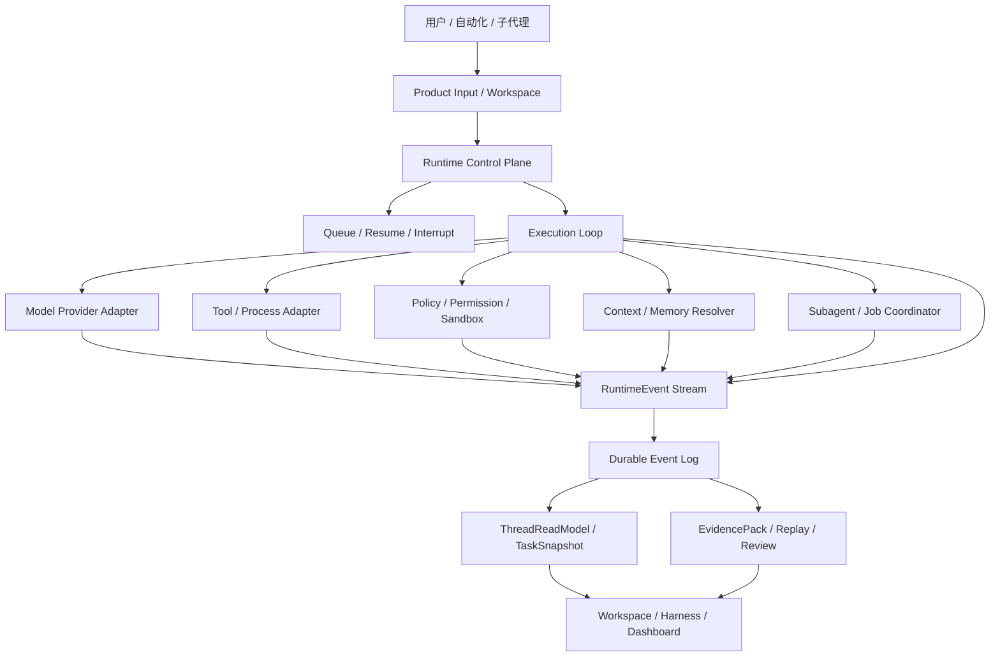
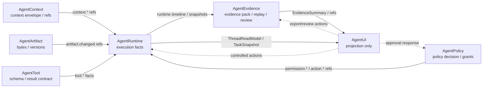
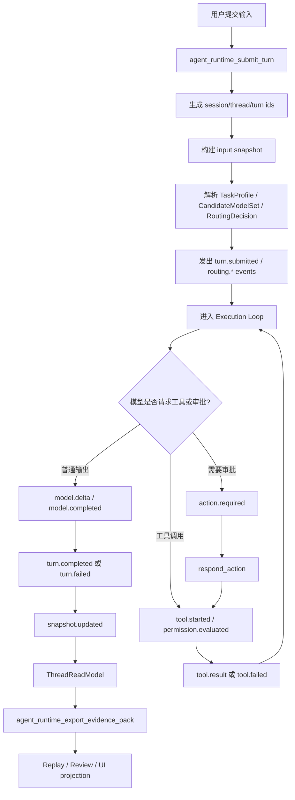
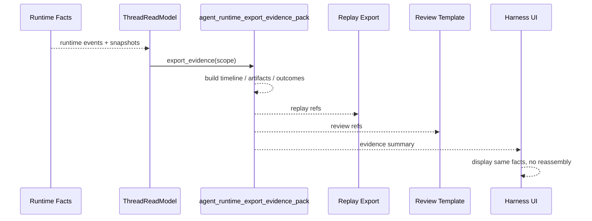
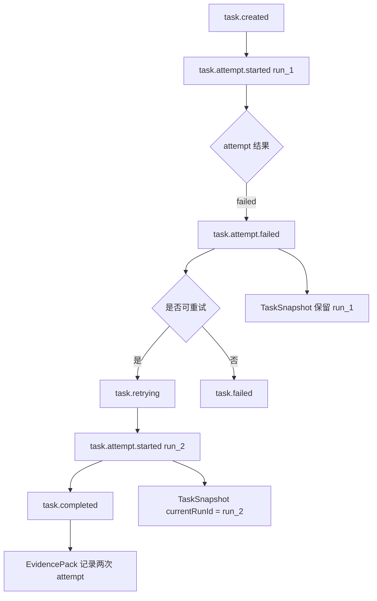
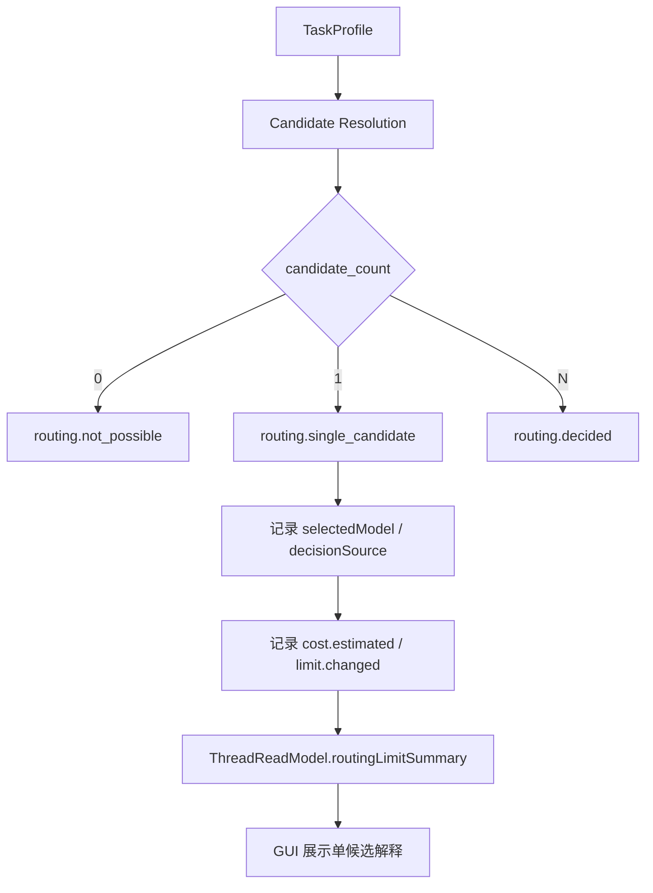
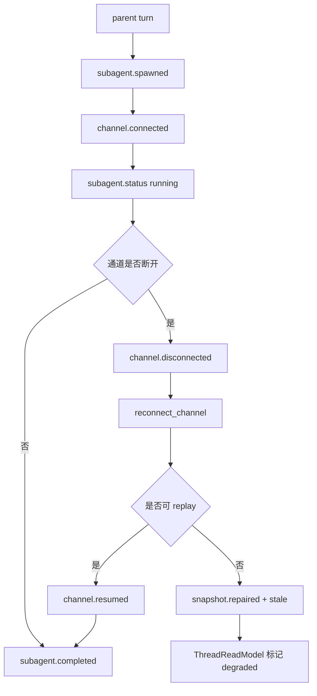
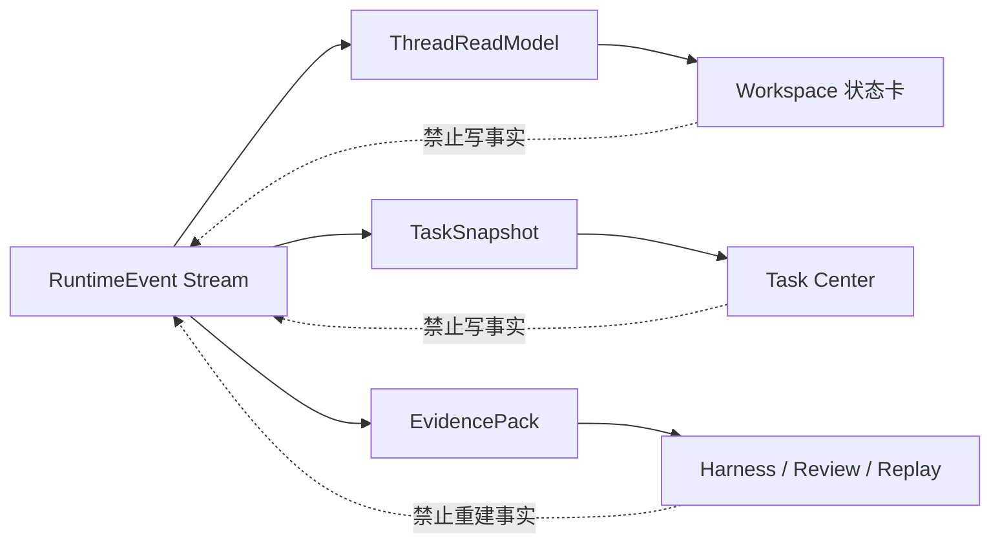

# Lime AgentRuntime Profile 图纸集

> 状态：proposal
> 更新时间：2026-05-11
> 作用：用图固定 AgentRuntime Profile 在 Lime 中的架构、主流程、时序和证据链路。

## 1. 总体架构图



## 2. 相邻标准协同图



约束：Context、Policy、Evidence、Artifact、Tool 都是 owner 系统；AgentRuntime 只记录 execution facts 与 owner refs；AgentUI 不拥有执行真相。

## 3. 主链流程图



## 4. Submit Turn 时序图

```mermaid
sequenceDiagram
    participant U as 用户
    participant FE as Workspace
    participant API as agent_runtime_submit_turn
    participant RT as Runtime Control Plane
    participant Loop as Execution Loop
    participant Read as ThreadReadModel
    participant UI as GUI Projection

    U->>FE: 输入任务
    FE->>API: submit_turn(input, metadata)
    API->>RT: 创建 session/thread/turn ids
    RT-->>FE: accepted / queued
    RT->>Loop: start turn
    Loop-->>Read: turn.submitted / turn.started
    Read-->>UI: preparing / running
    Loop-->>Read: turn.completed / turn.failed
    Read-->>UI: last outcome / incidents
```

## 5. Tool Approval 时序图

```mermaid
sequenceDiagram
    participant Loop as Execution Loop
    participant Policy as Permission / Policy
    participant UI as Workspace Approval UI
    participant Tool as Tool Runtime
    participant Read as ThreadReadModel

    Loop->>Policy: evaluate tool call
    Policy-->>Loop: ask required
    Loop-->>Read: permission.evaluated
    Loop-->>Read: action.required(actionId)
    Read-->>UI: pending action
    UI->>Loop: respond_action(actionId, approve/deny)
    Loop-->>Read: action.resolved
    alt approved
        Loop->>Tool: execute tool
        Tool-->>Read: tool.result
    else denied
        Loop-->>Read: tool.failed / denied
    end
```

## 6. Evidence Export 时序图



## 7. Task Retry 流程图



## 8. 模型路由单候选流程图



## 9. Remote / Subagent 恢复图



## 10. UI 只读投影图



## 11. 图纸使用规则

1. 所有图都表达 current 主链，不表达理想化全量标准。
2. 图中每个事实节点都必须能映射到 Lime runtime、read model、evidence 或 GUI 消费层。
3. 后续实现改变主链时，先更新本图，再更新散文说明。
