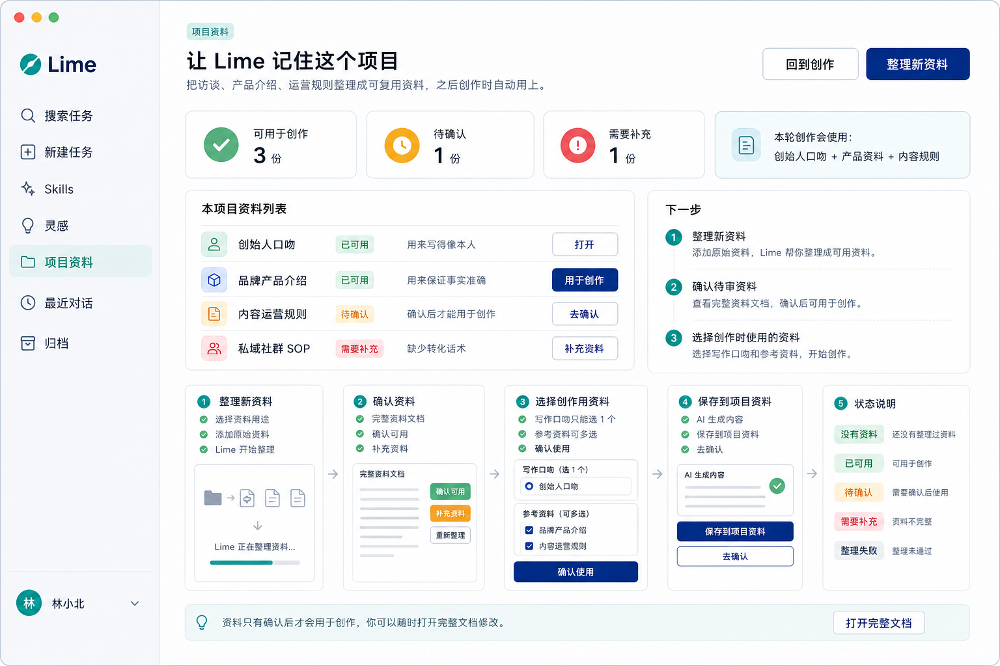
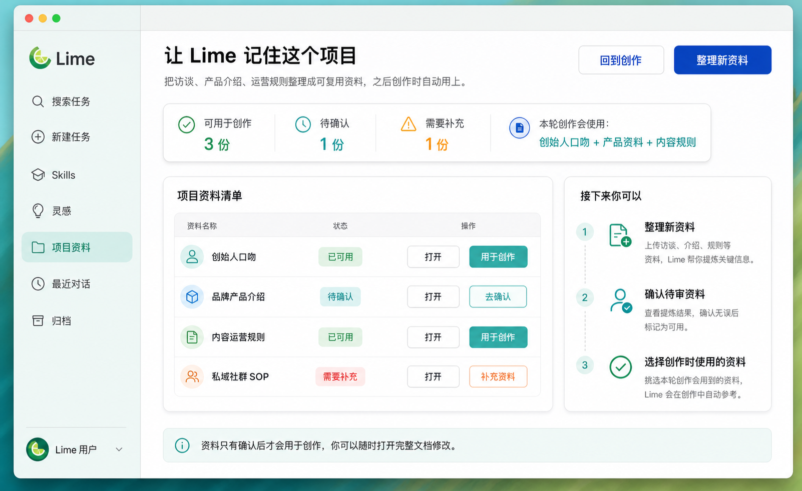
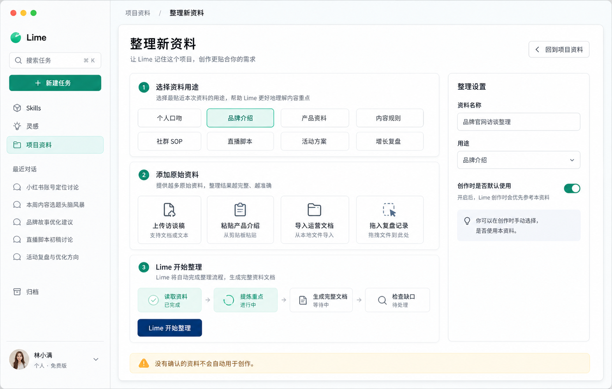
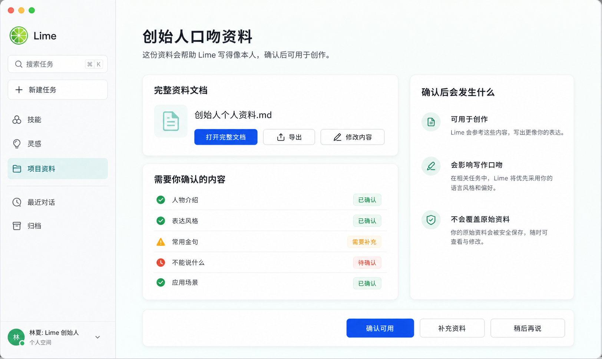
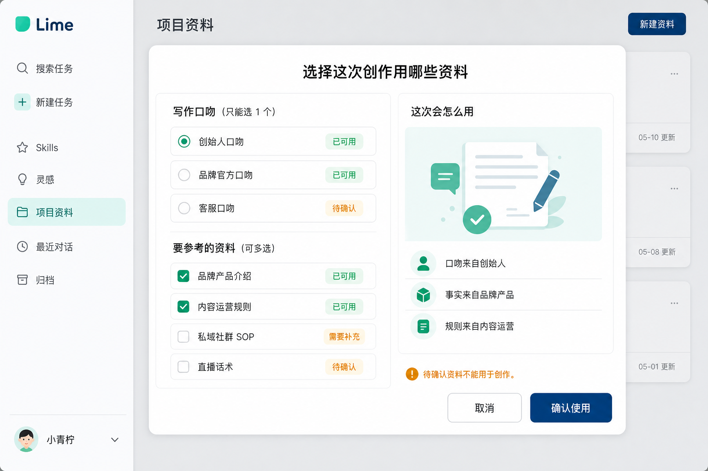
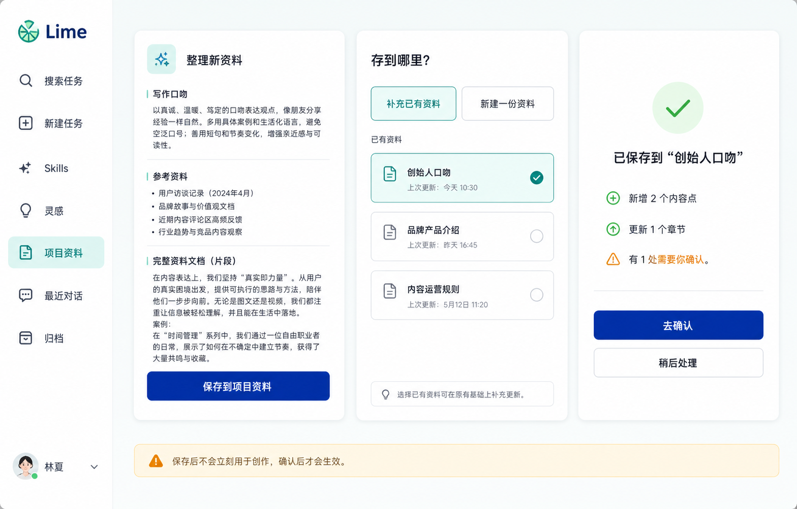
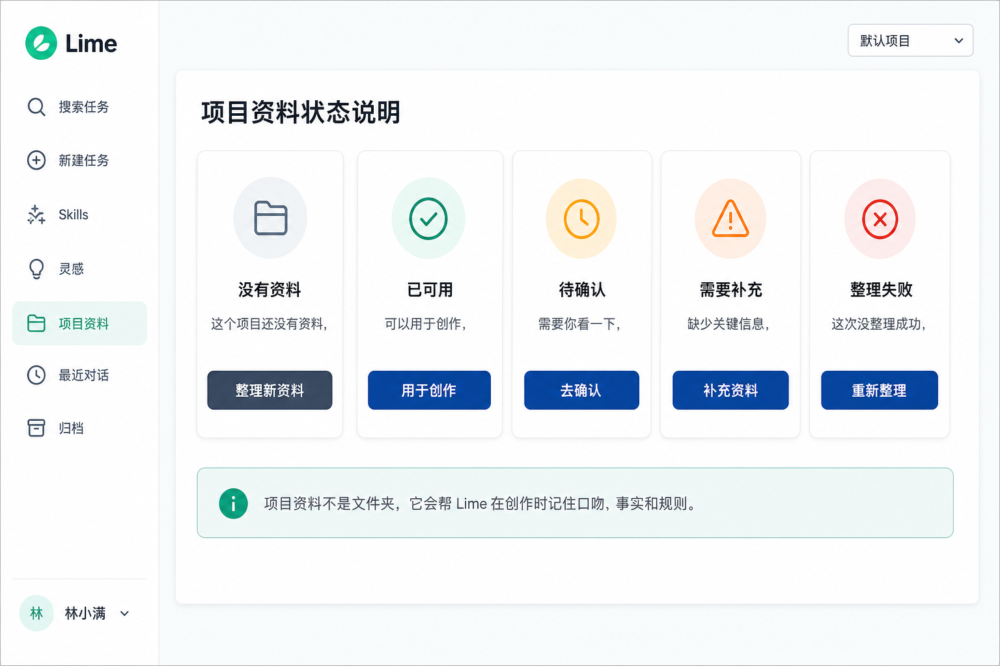

# Lime Agent Knowledge PRD v3

> 状态：draft / 第三轮 Knowledge 体验改造 PRD  
> 更新时间：2026-05-08  
> 关系：v3 **继承** v2 (`prd-v2.md`) 的 Skills-first、document-first、persona / data、Resolver 和运行时安全主链；v3 **替换** v2 默认 UI 表达、项目资料页信息架构、普通用户词表和交互原型。  
> 目标：把 Knowledge 从“工程上正确的知识包系统”推进成普通创作者能直接理解和使用的“项目资料”体验。

## 1. 背景与诊断

v2 已经完成底层主链：Builder Skills 负责生产工艺，KnowledgePack 以 `documents/` 成品文档为第一事实源，Resolver 支持 `1 persona + N data`，运行时只读取受保护资料。

但 v2 UI 仍有三个体验问题：

1. **默认界面像工程控制台**  
   `Builder Skill`、`Knowledge Pack`、`Resolver`、`Context Run`、`runtime.mode` 等概念对开发者有意义，但普通创作者不知道这些词和自己的创作任务有什么关系。
2. **页面之间不够连贯**  
   多张原型如果各自生成，容易出现侧栏、主色、状态词、按钮文案和信息架构漂移，用户会以为进入了不同产品。
3. **“资料如何用于创作”没有被讲清楚**  
   用户真正关心的是：这个项目有哪些资料、哪些能用于创作、哪些还要确认、这次创作用哪些口吻和参考资料，以及怎么把对话里的好内容保存回来。

v3 的核心任务不是推翻 v2 技术架构，而是给它换一层普通用户能理解的产品外壳。

## 2. 核心结论

**v3 默认产品名是“项目资料”，不是 Knowledge。**

在默认 UI 中：

- `Knowledge Pack` 显示为“一份资料 / 项目资料”。
- `persona` 显示为“写作口吻”。
- `data` 显示为“参考资料 / 事实资料”。
- `documents/<doc>.md` 显示为“完整资料文档”。
- `Builder Skill` 显示为“整理方式 / Lime 帮你整理”。
- `Context Run` 显示为“本轮使用记录”，只在高级信息里出现。

普通创作者只需要理解一句话：

> 项目资料会帮 Lime 在创作时记住这个项目的口吻、事实和规则；资料只有确认后才会用于创作。

## 3. 产品原则

1. **用户语言优先**  
   默认界面禁止暴露工程术语。工程概念保留在实现和高级信息里，不进入主路径文案。
2. **Lime 外壳稳定**  
   侧栏、主色、选中态、按钮层级必须和现有 Lime 保持一致，不因“创作者友好”重画成另一套应用。
3. **一屏先回答下一步**  
   首页首先告诉用户：可用于创作几份、待确认几份、需要补充几份、本轮创作会用哪些资料。
4. **确认后才生效**  
   整理、保存、补充后的资料不会自动进入创作上下文，必须经过用户确认。
5. **完整文档仍是第一公民**  
   用户看到的是可打开、可编辑、可导出的“完整资料文档”，不是文件夹树或数据库。

## 4. 信息架构

默认一级页面仍是左侧导航里的“项目资料”。

项目资料页包含 6 个主交互：

1. **资料首页**：查看项目资料状态和下一步。
2. **整理新资料**：选择资料用途，添加原始资料，让 Lime 整理。
3. **确认资料**：查看完整资料文档，确认、修改或补充。
4. **选择创作资料**：选择一个写作口吻和多份参考资料。
5. **保存到项目资料**：把对话中有价值的内容沉淀回资料。
6. **状态说明**：解释没有资料、已可用、待确认、需要补充、整理失败。

## 5. UI 原型

以下图片是 v3 实现的用户体验事实源。后续页面实现应优先对齐这些图的用户语言、左侧栏稳定性、主色调和交互顺序。

### 5.1 故事板总览



用途：说明整条用户旅程如何串联：资料首页 -> 整理资料 -> 确认资料 -> 选择创作资料 -> 保存回项目资料 -> 状态说明。

### 5.2 资料首页



首页必须回答：

- 这个项目现在有几份资料可用于创作。
- 哪些资料待确认或需要补充。
- 本轮创作会使用哪些口吻、事实和规则。
- 用户下一步应该整理、确认还是选择资料。

### 5.3 整理新资料



整理流程使用普通用户语言：

- 选择资料用途。
- 添加原始资料。
- Lime 开始整理。
- 提示“没有确认的资料不会自动用于创作”。

默认不出现 `Builder Skill`、`sources`、`compile`。

### 5.4 确认资料



确认页必须突出：

- 完整资料文档。
- 需要用户确认的内容。
- 确认后会用于创作、影响写作口吻，但不会覆盖原始资料。
- 主按钮是“确认可用”，不是“accept / approve / mark ready”。

### 5.5 选择创作资料



选择规则：

- 写作口吻只能选 1 个。
- 参考资料可多选。
- 待确认资料不能用于创作。
- 右侧用用户语言解释“这次会怎么用”。

默认不出现 `persona`、`data`、`Resolver`。

### 5.6 保存到项目资料



保存流程：

- 用户从 AI 生成内容点击“保存到项目资料”。
- 选择补充已有资料或新建一份资料。
- 保存后提示新增内容点、更新章节和需要确认的内容。
- 保存后不会立刻用于创作，确认后才会生效。

### 5.7 状态说明



状态统一为普通用户能理解的 5 类：

- 没有资料
- 已可用
- 待确认
- 需要补充
- 整理失败

## 6. 词表与禁用词

### 6.1 默认词表

| 概念 | 默认 UI 文案 |
| --- | --- |
| 页面入口 | 项目资料 |
| 创建 / 编译 | 整理新资料 |
| persona | 写作口吻 |
| data | 参考资料 / 事实资料 |
| KnowledgePack | 一份资料 / 项目资料 |
| documents 主文档 | 完整资料文档 |
| source | 原始资料 |
| run | 整理记录 |
| ready | 已可用 |
| needs-review | 待确认 |
| missing / partial | 需要补充 |
| failed | 整理失败 |

### 6.2 默认禁用词

以下词不进入普通用户默认界面：

```text
Builder Skill
Knowledge Pack
Resolver
Context Run
runtime
profile
documents
sources
runs
persona
data
wrapper
selected sections
compile
```

这些词可以出现在高级模式、调试信息、开发者文档和运行记录里。

## 7. 视觉与壳约束

项目资料页必须继承 Lime 主壳：

- 左侧栏保留参考截图中的结构：Lime 标识、搜索任务、新建任务、Skills、灵感、项目资料、最近对话、归档、底部用户区。
- 选中项必须是“项目资料”，使用浅青绿底。
- 主按钮使用深蓝实心。
- 成功 / 可用使用柔和绿色。
- 待确认使用琥珀色。
- 需要补充 / 失败使用红色问题态。
- 背景保持浅白、浅灰、浅青，不使用强插画风、强蓝紫、暗色炫技或营销页 hero。

## 8. 实现范围

### 8.1 保留 v2 current 主链

v3 不改变以下底层事实：

- Builder Skills 仍是生产工艺事实源。
- KnowledgePack 仍是产物事实源。
- `documents/` 仍是主事实源。
- `compiled/splits/` 仍是派生层。
- Resolver 仍按 `1 persona + N data` 语义工作。
- 运行时仍不执行 Builder Skill。

### 8.2 v3 需要改造的产品层

1. 项目资料页默认文案和信息架构。
2. 整理资料流程入口。
3. 资料确认页。
4. 创作资料选择弹层。
5. 从对话保存到项目资料流程。
6. 状态文案与空态。
7. 高级信息入口，把工程细节收起。

## 9. 验收标准

1. 普通创作者不需要理解 `Builder Skill / Knowledge Pack / Resolver / Context Run`，也能完成整理、确认、选择和保存资料。
2. 项目资料首页能在首屏回答“哪些资料可用、哪些要处理、下一步做什么”。
3. 资料只有用户确认后才会用于创作。
4. 用户能打开完整资料文档并修改。
5. 选择创作资料时，用户能清楚区分“写作口吻”和“参考资料”。
6. 从对话保存到项目资料后，用户知道这次保存更新了什么，以及还有什么需要确认。
7. 侧栏、主色、状态色和按钮层级与 Lime 现有 GUI 保持一致。
8. GUI smoke 或 Playwright 验证覆盖：项目资料首页、整理新资料、确认资料、选择创作资料、保存到项目资料、状态页。

## 10. 非目标

- 不重做 Knowledge v2 底层存储结构。
- 不改变 Builder Skill 标准包结构。
- 不把项目资料做成文件管理器。
- 不在默认 UI 暴露工程调试信息。
- 不新增移动端主路径。

