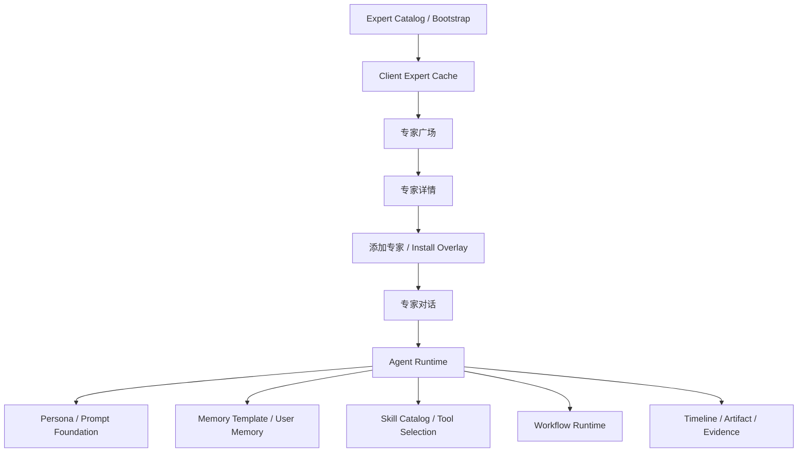

# 专家功能路线图

更新时间：2026-05-15

## 定位

本目录承载 Lime Desktop 客户端侧的专家功能路线图。

专家功能的目标是把“可复用的专业 Agent 能力”做成用户能发现、理解、添加和持续使用的产品入口：专家广场负责发现，专家详情负责决策，添加专家负责建立本地使用关系，专家对话负责执行任务，右侧专家信息面板负责解释专家的人设、记忆、技能和工作流。

```text
LimeCore / Lime Cloud
  Expert Catalog / Release / Tenant Enablement / Ranking / Audit
    ↓
Lime Desktop Client
  Expert Plaza / Detail / Install Overlay / Local Cache / Agent Runtime Binding
    ↓
Agent Runtime Current Chain
  Prompt Foundation / Memory / Skill Catalog / Workflow / Evidence
```

## 当前事实源

| 分类 | 对象 | 说明 |
|---|---|---|
| current | `docs/roadmap/zuanjia/prd.md` | 专家广场、详情、添加和对话体验的产品方案。 |
| current | `docs/roadmap/zuanjia/architecture.md` | 客户端投影、缓存、安装 overlay、运行时绑定和失败模式。 |
| current | `docs/roadmap/zuanjia/implementation-plan.md` | P0-P5 客户端实施顺序、测试和验收。 |
| current | `/Users/coso/Documents/dev/ai/limecloud/limecore/docs/roadmap/zuanjia` | LimeCore 专家云市场控制面方案。 |
| reference | `docs/aiprompts/skill-standard.md` | 专家绑定技能时必须复用的 Skill / ServiceSkill 标准。 |
| reference | `docs/aiprompts/prompt-foundation.md` | 专家 persona 注入 Agent Runtime 的 Prompt 主链。 |
| reference | `docs/aiprompts/memory-compaction.md` | 专家记忆和上下文压缩边界。 |
| reference | `docs/roadmap/agentapp/README.md` | Agent App 与 `expert-chat` entry 的平台边界。 |

## 文档索引

| 文档 | 说明 |
|---|---|
| [prd.md](./prd.md) | 产品目标、用户故事、页面结构、MVP 和非目标。 |
| [architecture.md](./architecture.md) | 客户端数据模型、运行时绑定、云同步、离线和 readiness 设计。 |
| [implementation-plan.md](./implementation-plan.md) | 分期实施、文件边界、验收命令和风险控制。 |

## 客户端边界

1. 专家不是第二套聊天系统，专家对话必须继续进入 `agent_runtime_submit_turn` 主链。
2. 专家不是独立技能格式，`skillRefs` 必须引用 `SkillCatalog` / `ServiceSkillCatalog` 中的 current 对象。
3. 专家不是完整 Agent App 平台替代品；如果某个专家需要独立 UI、storage、worker 或 workflow runtime，应升级为 Agent App。
4. 专家目录来自 LimeCore；客户端 seeded catalog 只做离线兜底和开发 fixture。
5. 用户私有记忆、对话内容、workspace 数据不进入公共专家目录。
6. 新增用户可见文案必须覆盖 `zh-CN / zh-TW / en-US / ja-JP / ko-KR`。
7. GUI 改动必须按 Lime 桌面产品视觉语言落地，并做最小 GUI 冒烟。

## 主路线



## 当前执行顺序

```text
P0 文档与本地 fixture
→ P1 本地专家广场 MVP
→ P2 专家对话闭环
→ P3 技能 / 记忆 / 工作流绑定
→ P4 LimeCore 云目录同步
→ P5 榜单与运营质量闭环
```

## 下一刀判定

先按 [implementation-plan.md](./implementation-plan.md) 做 P0：补本地 `ExpertProfile` fixture、parser / projection 单测和专家广场静态页面，不直接接正式云 API，也不新增第二套 runtime。
