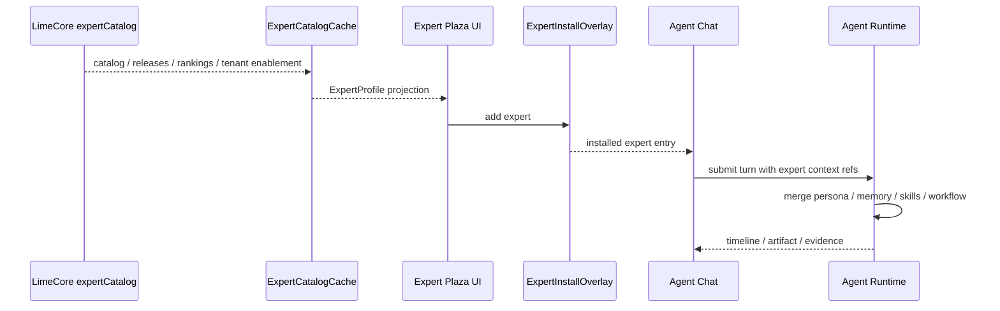

# 专家功能客户端架构

更新时间：2026-05-15

## 一句话结论

专家功能在客户端只新增“专家产品投影”和“安装 overlay”，执行仍回到现有 Agent Runtime、Prompt Foundation、Memory、Skill Catalog 和 Workflow 主链。

## 架构边界

| 层 | current 职责 | 不做 |
|---|---|---|
| LimeCore | 下发专家目录、release、租户可见性、榜单和策略。 | 不运行默认 Agent，不保存客户私有对话。 |
| Lime Desktop | 渲染专家广场、缓存目录、保存添加状态、组装运行时上下文。 | 不维护第二份云目录事实源。 |
| Agent Runtime | 执行专家会话、工具调用、Artifact、Evidence。 | 不关心市场排序和运营榜单。 |
| Skill / ServiceSkill | 提供专家可绑定的能力引用。 | 不被复制到专家对象内部。 |
| Memory | 提供专家记忆模板和用户侧记忆。 | 公共目录不保存用户私有记忆全文。 |

## 数据流



## 客户端模块建议

| 模块 | 责任 |
|---|---|
| `expertCatalog` | 解析云端 / seeded `ExpertProfile`，做 schema guard、版本和 fallback。 |
| `expertProjection` | 合并目录、ranking、tenant enablement、本地 overlay，生成 UI view model。 |
| `expertInstallOverlay` | 保存已添加、置顶、最近使用、自定义 starter、隐藏状态。 |
| `ExpertPlazaPage` | 专家广场页面、榜单、分类、搜索和卡片网格。 |
| `ExpertDetailDialog` | 专家详情大浮层。 |
| `expertRuntimeBinding` | 把专家引用转换为 Agent Runtime 可消费的 prompt/context/tool selection 输入。 |
| `ExpertInfoPanel` | 专家对话右侧信息栏。 |

具体文件名以后续代码结构为准；首期不应把全部逻辑塞进 `AppSidebar` 或 `AgentChatWorkspace`。

## 本地状态

### ExpertCatalogCache

缓存云端目录和 seeded fallback 的归一化结果：

```text
version
syncedAt
tenantId
items[]
rankings[]
releases[]
```

缓存只用于展示和启动，不是用户真实使用状态。

### ExpertInstallOverlay

用户侧 overlay 独立保存：

```text
expertId
releaseId
installedAt
lastUsedAt
pinned
hidden
customTitle?
customPromptStarters?
memoryEnabled
workflowEnabled
```

overlay 必须可迁移、可清理，且不能写回公共目录对象。

## 运行时绑定

专家启动会话时生成一个 `ExpertRuntimeContext`，再并入现有 turn input：

| 引用 | 注入位置 |
|---|---|
| `personaRef` | Prompt Foundation / runtime agents system prompt。 |
| `memoryTemplateRef` | Memory source resolver 和 thread memory prefetch。 |
| `skillRefs` | Skill selection / tool catalog 裁剪。 |
| `workflowRefs` | Workflow runtime launcher 或 starter chips。 |
| `promptStarters` | 聊天首屏建议任务。 |
| `readiness` | 启动前依赖检查和错误提示。 |

不允许把 persona 文本散落在 UI 组件里；UI 只消费展示摘要，运行时消费版本化引用。

## 离线与失败模式

| 场景 | 行为 |
|---|---|
| 云目录请求失败 | 使用上次成功缓存；没有缓存时使用 seeded fallback。 |
| 专家 release 被下架 | 已安装专家保留本地入口，但显示“云端已下架 / 可继续本地使用”提示；不自动删除用户 overlay。 |
| 绑定 skill 缺失 | 专家卡片和详情显示 readiness 缺口，启动时提示安装或禁用对应技能。 |
| persona hash 不匹配 | 阻断启动，提示刷新目录或回落到上一可用 release。 |
| workflow 不可用 | 专家仍可聊天，但工作流区域显示不可用原因。 |
| 用户删除专家 | 只删除 install overlay，不删除公共缓存和历史会话。 |

## UI 设计约束

- 专家广场是卡片型列表工作台，宽度应按桌面容器自适应，不锁死窄列。
- 榜单区要轻，不做大面积营销 hero。
- 详情浮层主体使用实体底色、清晰边框和浅阴影，不使用半透明主表面。
- 右侧信息栏信息密度可以高，但必须分组，避免连续套三层卡片。
- 所有新文案必须进入 i18n 资源，不写死中文。

## Telemetry 与隐私

首期只允许聚合运营事件：

```text
expert_impression
expert_detail_opened
expert_installed
expert_chat_started
expert_liked
expert_shared
```

事件只携带 `tenantId`、`expertId`、`releaseId`、页面来源、时间和匿名会话引用；不得携带用户 prompt、assistant response、文件内容或私有记忆全文。
