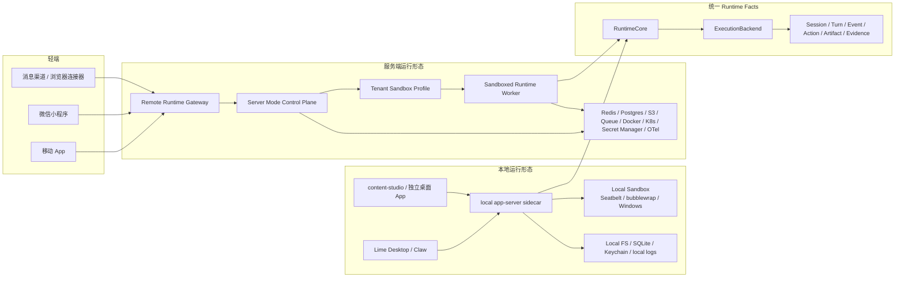
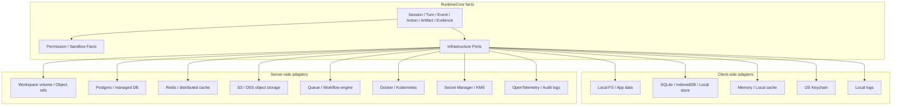
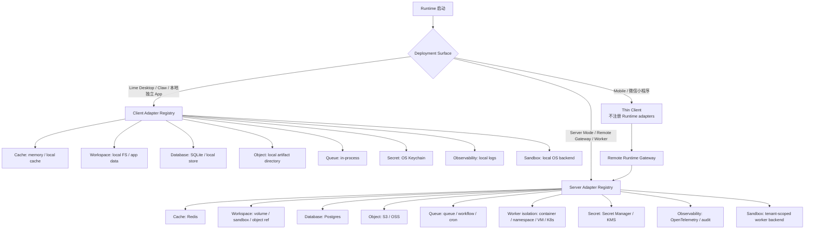

# Lime Next 架构

> 状态：north-star planning source
> 更新时间：2026-06-07

## 1. 架构原则

1. 后端事实源只有一条：App Server JSON-RPC 语义 + RuntimeCore + ExecutionBackend。
2. 前端复用只复用 projection、ViewModel 和 UI primitives，不复用 Claw 整页 shell。
3. HostBridge 只负责宿主能力和 sidecar 生命周期，不承接 runtime 业务逻辑。
4. Agent Apps、独立 App、移动 App 和微信小程序只通过 client / gateway / protocol / capability 消费 runtime。
5. 服务端模式复用 RuntimeCore facts，不发明第二套 session / turn / event。
6. Sandbox-first：客户端和服务端都必须通过 permission profile、sandbox manager、approval / escalation、exec policy 和 audit 执行工具。
7. 客户端和服务端的基础设施能力必须分层隔离：缓存、文件、数据库、对象存储、队列、容器调度、密钥和观测都走 ports / adapters，不在 RuntimeCore 写死平台实现。
8. Docker / Kubernetes 只是服务端 worker isolation / scheduling 的承载选项，不是 sandbox 抽象本身。
9. production 不能通过 mock fallback 成功。

## 2. 总体架构图

```mermaid
flowchart TB
    subgraph ProductShells["产品壳 / Host Shells"]
        Claw["Claw / Lime Desktop<br/>旗舰 Agent 工作台"]
        AgentApps["Agent Apps<br/>垂直任务 App"]
        ContentStudio["content-studio<br/>内容业务 App"]
        FutureApps["未来独立 App"]
        Mobile["移动 App<br/>审批 / 查看 / 轻量继续任务"]
        MiniProgram["微信小程序<br/>任务提醒 / 审批 / 预定义能力"]
        ServerConsole["Web / Server Console<br/>后台任务与运营入口"]
    end

    subgraph FrontendShared["端侧共享层"]
        Projection["AgentRuntime Headless Projection<br/>AgentEvent + ReadModel -> ViewModel"]
        Primitives["AgentRuntime UI / Native Primitives<br/>Message / Timeline / Tool / Action / Artifact / Evidence"]
        ShellAdapters["Shell Adapters<br/>业务对象 / 导航 / 本地化 / 宿主能力 / 推送"]
    end

    subgraph ClientLayer["Client / Gateway / Host Bridge"]
        DesktopBridge["Electron Desktop Host Bridge<br/>current"]
        AppClient["app-server-client<br/>TS / Rust client"]
        Preload["Preload IPC Projection"]
        RemoteGateway["Remote Runtime Gateway<br/>HTTPS / SSE / WebSocket / Push"]
    end

    subgraph ServerLayer["App Server / Server Mode"]
        Transport["Local Transport<br/>stdio JSONL first"]
        ServerMode["Server Mode Control Plane<br/>Auth / Tenant / Sandbox / Policy / Approval / Audit / Queue"]
        Router["Request Router<br/>JSON-RPC / REST mapping"]
        Protocol["app-server-protocol<br/>shared semantics"]
        RuntimeFacade["RuntimeCore Facade"]
    end

    subgraph SandboxPlane["Permission / Sandbox Control Plane"]
        PermissionProfile["Permission Profile<br/>FS / Network / Approval / Exec / Secret Scope"]
        SandboxManager["Sandbox Manager"]
        ApprovalSvc["Approval / Escalation Service"]
        SandboxAudit["Sandbox / Approval Audit"]
    end

    subgraph InfraPorts["Runtime Infrastructure Ports"]
        CachePort["Cache Port"]
        FilePort["File / Workspace Port"]
        DbPort["Database Port"]
        ObjectPort["Object Store Port"]
        QueuePort["Queue / Scheduler Port"]
        SecretPort["Secret Port"]
        ObservePort["Observability Port"]
    end

    subgraph ClientInfra["Client Adapters"]
        LocalCache["Memory / IndexedDB / Local cache"]
        LocalFiles["Local FS / App data"]
        LocalDb["SQLite / local store"]
        LocalSecrets["OS Keychain"]
        LocalLogs["Local logs"]
    end

    subgraph ServerInfra["Server Adapters"]
        Redis["Redis / distributed cache"]
        Postgres["Postgres / managed DB"]
        S3["S3 / OSS object storage"]
        ServerQueue["Queue / Cron / Workflow engine"]
        K8s["Docker / Kubernetes worker carriers"]
        SecretManager["Secret Manager / KMS"]
        OTel["OpenTelemetry / logs / metrics / traces"]
    end

    subgraph RuntimeLayer["RuntimeCore"]
        Session["Session / Thread / Turn / Run"]
        BackendPort["ExecutionBackend Port"]
        Tool["Tool / Skill Runtime"]
        Workspace["Workspace / Memory"]
        Policy["Policy / Action"]
        Artifact["Artifact Service"]
        Evidence["Evidence Service"]
    end

    subgraph Backends["Execution Backends"]
        Aster["AsterBackend"]
        FutureBackend["Future Backend"]
    end

    subgraph SandboxBackends["Platform Sandbox Backends"]
        LocalSandbox["Local OS Sandbox<br/>macOS Seatbelt / Linux bubblewrap / Windows restricted token"]
        ServerSandbox["Server Worker Sandbox<br/>container / namespace / VM / microVM"]
        NetworkProxy["Managed Network Proxy"]
        ProcessHardening["Process Hardening"]
    end

    Claw --> ShellAdapters
    AgentApps --> ShellAdapters
    ContentStudio --> ShellAdapters
    FutureApps --> ShellAdapters
    Mobile --> ShellAdapters
    MiniProgram --> ShellAdapters
    ServerConsole --> ShellAdapters
    ShellAdapters --> Projection
    Projection --> Primitives
    ShellAdapters --> DesktopBridge
    ShellAdapters --> AppClient
    ShellAdapters --> RemoteGateway
    DesktopBridge --> Preload
    Preload --> AppClient
    AppClient --> Transport
    RemoteGateway --> ServerMode
    Transport --> Router
    ServerMode --> Router
    Router --> Protocol
    Protocol --> RuntimeFacade
    RuntimeFacade --> PermissionProfile
    RuntimeFacade --> Session
    RuntimeFacade --> CachePort
    RuntimeFacade --> FilePort
    RuntimeFacade --> DbPort
    RuntimeFacade --> ObjectPort
    RuntimeFacade --> QueuePort
    RuntimeFacade --> SecretPort
    RuntimeFacade --> ObservePort
    CachePort --> LocalCache
    FilePort --> LocalFiles
    DbPort --> LocalDb
    SecretPort --> LocalSecrets
    ObservePort --> LocalLogs
    CachePort --> Redis
    FilePort --> S3
    DbPort --> Postgres
    ObjectPort --> S3
    QueuePort --> ServerQueue
    QueuePort --> K8s
    SecretPort --> SecretManager
    ObservePort --> OTel
    Session --> BackendPort
    BackendPort --> Aster
    BackendPort --> FutureBackend
    Session --> Tool
    Tool --> PermissionProfile
    Tool --> SandboxManager
    PermissionProfile --> ApprovalSvc
    PermissionProfile --> SandboxAudit
    SandboxManager --> LocalSandbox
    SandboxManager --> ServerSandbox
    SandboxManager --> NetworkProxy
    SandboxManager --> ProcessHardening
    Session --> Workspace
    Session --> Policy
    Session --> Artifact
    Session --> Evidence
```



## 2.1 部署形态图



## 2.2 客户端与服务端基础设施分层

客户端和服务端只共享 Runtime facts 与 port 语义，不共享 adapter 实现。完整矩阵见 [client-server-infrastructure.md](./client-server-infrastructure.md)。



## 2.3 Adapter 注册与运行形态



## 3. 分层职责

| 层 | 负责 | 不负责 |
| --- | --- | --- |
| Product Shell | 产品导航、业务对象、布局、本地化、宿主能力入口 | Agent 执行事实、工具调度、artifact/evidence 判定 |
| Mobile / Mini Program Shell | 轻量任务、审批、查看、通知、预定义 capability 入口 | 本地 ToolRuntime、secret 明文、完整桌面工作台 |
| Headless Projection | 把 runtime facts 投影成 UI view model | 发请求、读 Electron 状态、管理 sidecar |
| UI Primitives | 展示 message、timeline、tool、action、artifact、evidence | 业务对象写回、路由、模型选择、runtime 调用 |
| Client / Host Bridge | 启动 sidecar、JSON-RPC 连接、preload IPC、安全边界 | Runtime 业务逻辑、完成态判定 |
| App Server | 协议、初始化门禁、method 分发、notification | UI 状态、桌面壳能力 |
| Remote Runtime Gateway | 认证、租户隔离、HTTP/SSE/WebSocket/push 映射、端侧安全边界 | 重新定义 runtime facts、绕过 RuntimeCore |
| Server Mode Control Plane | sandbox profile、队列、长任务、审计、配额、secret ref、事件持久化 | Electron Host、桌面 UI 状态、直接执行工具 |
| Permission / Sandbox Control Plane | permission profile、filesystem / network policy、approval、exec policy、sandbox attempt、audit | Redis / S3 等基础设施实现、UI 终态 |
| Platform Sandbox Backend | 本地 OS sandbox、服务端 worker isolation、managed network proxy、process hardening | protocol facts、业务对象、UI projection |
| Runtime Infrastructure Ports | cache、file、database、object store、queue、secret、observability 的抽象合同 | 具体 Redis / S3 / DB / k8s 实现细节 |
| Client Infrastructure Adapters | 本地文件、SQLite / local store、OS keychain、本地日志、内存缓存 | 多租户队列、分布式锁、对象存储、k8s 调度 |
| Server Infrastructure Adapters | Redis、Postgres、S3 / OSS、queue、Docker / Kubernetes、Secret Manager、OpenTelemetry | UI 状态、端侧缓存、直接访问用户本机文件 |
| RuntimeCore | session / turn / event / action / artifact / evidence facts | 具体后端私有循环、App 业务对象 UI、具体基础设施 SDK |
| ExecutionBackend | Aster / 后续执行引擎适配 | 公共协议、App lifecycle、UI projection |

## 4. 数据事实源

| 数据 | Owner | App 可见性 |
| --- | --- | --- |
| session / thread / turn | RuntimeCore | 通过 `agentSession/read` / event read model 可见 |
| runtime event | RuntimeCore | 通过 `agentSession/event` 可见 |
| tool call | Tool runtime | 事件摘要和结果可见 |
| action / approval | Policy / Action service | App 可响应指定 action |
| permission profile | Permission / Sandbox Control Plane | App 可读摘要；不能修改服务端强制约束 |
| sandbox attempt | Sandbox Manager | 只暴露审计摘要和失败原因 |
| artifact | Artifact service | refs、preview、content status 可见 |
| evidence | Evidence service | summary、export ref 可见 |
| workspace / memory | Workspace / Memory service | 受 policy 过滤 |
| business object | Product Shell | Runtime 只保存 ref / 必要 snapshot |
| UI selection / layout | Product Shell | 不进入 runtime facts |
| remote user / tenant / auth binding | Remote Runtime Gateway | 只作为访问控制上下文进入 runtime |
| push / notification token | Mobile / Mini Program Shell + Gateway | Runtime 不直接持有端侧推送实现 |
| cache | Runtime Infrastructure Port | 客户端可用 memory / IndexedDB / local cache；服务端可用 Redis。 |
| file / workspace | Runtime Infrastructure Port | 客户端走本地 FS / app data；服务端走 workspace volume、sandbox 或 object store ref。 |
| database | Runtime Infrastructure Port | 客户端可用 SQLite / local store；服务端可用 Postgres / managed DB。 |
| object artifact | Artifact / Object Store Port | 客户端可本地文件；服务端默认 S3 / OSS / compatible object storage。 |
| queue / scheduler | Queue Port | 客户端可进程内队列；服务端默认 queue / workflow engine / k8s job。 |
| secret | Secret Port | 客户端走 OS keychain；服务端走 Secret Manager / KMS。 |
| observability | Observability Port | 客户端本地日志；服务端 OpenTelemetry / metrics / traces / audit log。 |

## 5. 前端共享架构

前端共享必须按三层拆分：

```text
AgentRuntime facts
  -> projection / selector / reducer
  -> UI primitives
  -> shell adapter
```

### 5.1 Projection

输入：

1. `AgentEvent[]`
2. `AgentSessionReadResponse`
3. artifact / evidence summary
4. action 状态
5. shell 提供的业务上下文 ref

输出：

1. message view model
2. timeline view model
3. tool / action / artifact / evidence parts
4. runtime status
5. terminal state
6. pending user action

### 5.2 UI Primitives

可共享候选：

1. message list / assistant body / user body
2. runtime status strip
3. task card
4. tool process step
5. action request card
6. artifact preview card
7. evidence summary card
8. timeline group
9. streaming renderer

### 5.3 Shell Adapter

每个 App 自己实现：

1. 路由和导航。
2. 工作区选择。
3. 模型 / provider 选择入口。
4. 业务对象读写。
5. 本地化资源和产品文案。
6. 桌面壳能力。
7. mobile navigation、push token、小程序 OpenID 绑定。
8. callbacks：send、cancel、respondAction、openArtifact、exportEvidence。

## 6. 禁止依赖方向

```mermaid
flowchart TD
    A["UI Primitive"] -.禁止.-> B["safeInvoke / Electron bridge"]
    A -.禁止.-> C["app-server-client"]
    A -.禁止.-> D["Claw workspace store"]
    A -.禁止.-> E["legacy command"]
    F["Independent App"] -.禁止.-> G["Claw shell internals"]
    F -.禁止.-> H["lime-rs internal crates"]
    I["HostBridge"] -.禁止.-> J["Runtime completion logic"]
    K["Mobile / Mini Program"] -.禁止.-> L["local sidecar direct connect"]
    K -.禁止.-> M["provider secret"]
    N["Remote Gateway"] -.禁止.-> O["second runtime facts"]
    P["RuntimeCore"] -.禁止.-> Q["direct Redis / S3 / Postgres SDK"]
    P -.禁止.-> R["Docker / Kubernetes API"]
    S["ToolRuntime / ExecutionBackend"] -.禁止.-> T["bypass Sandbox Manager"]
    U["Docker / Kubernetes"] -.禁止.-> V["act as Permission Model"]
```



## 7. 与现有路线图关系

1. `internal/roadmap/appserver/` 继续作为 App Server current 执行源。
2. 本目录固定 Lime Next 的上层目标和共享边界。
3. 远程入口分类继续遵循 `internal/aiprompts/remote-runtime.md`。
4. 客户端 / 服务端基础设施边界以 [client-server-infrastructure.md](./client-server-infrastructure.md) 为北极星约束。
5. Sandbox / permissions 以 [sandbox-and-permissions.md](./sandbox-and-permissions.md) 为北极星约束。
6. 如果两者冲突，App Server 的具体协议和实现细节以 `internal/roadmap/appserver/` 为准；产品方向、端侧矩阵和前端共享原则以本目录为准。

## 8. 架构验收

1. 新 Agent 能力能说明落在 Product Shell、Projection、UI Primitive、Client、App Server、RuntimeCore、ExecutionBackend、Infrastructure Port 或 Adapter 哪一层。
2. 新共享组件不直接依赖 host、bridge、safeInvoke、store 或 legacy command。
3. 新 App 接入不需要复制 runtime 或 Claw shell。
4. 移动 App / 微信小程序只通过 Remote Runtime Gateway 消费 projection，不直连 sidecar。
5. 服务端模式复用 RuntimeCore facts，不发明第二套 session / turn / event。
6. 每个 turn / tool attempt 都能追溯 active permission profile、sandbox backend、approval / escalation 和 audit。
7. ToolRuntime / ExecutionBackend 不绕过 Sandbox Manager。
8. RuntimeCore 只依赖 infrastructure ports，不直接 import Redis、S3、Postgres、Docker、Kubernetes 或具体云 SDK。
9. 服务端 adapters 必须显式覆盖 cache、database、object store、queue、secret、observability。
10. 事件终态只能从 runtime facts 派生，不能由 UI 本地猜测。
11. 真实 GUI E2E 证明至少一条 turn lifecycle 可用。
