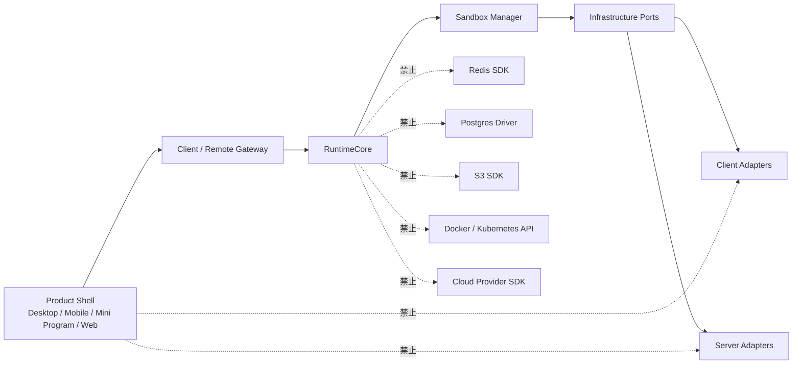
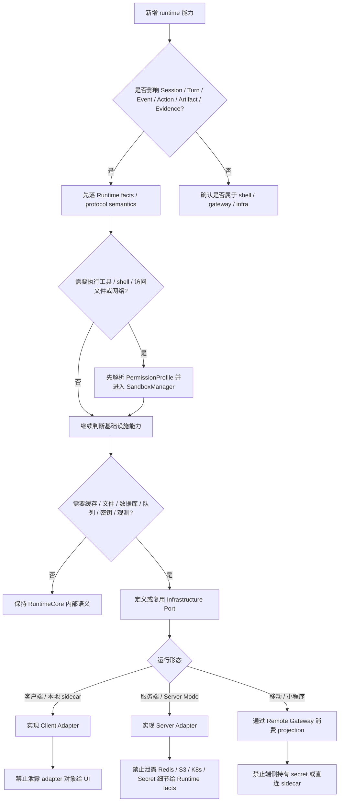
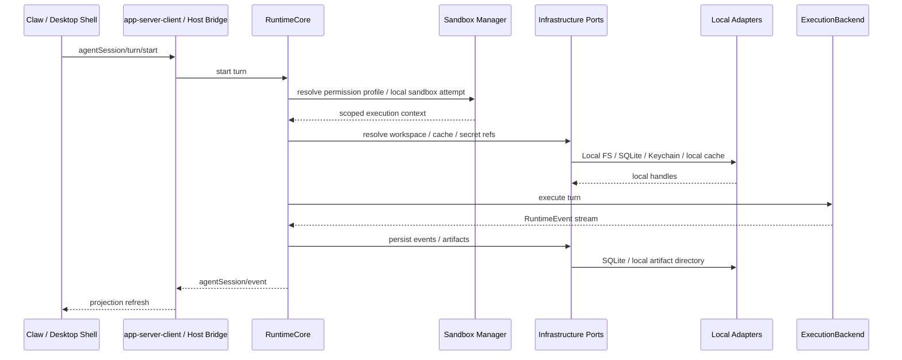
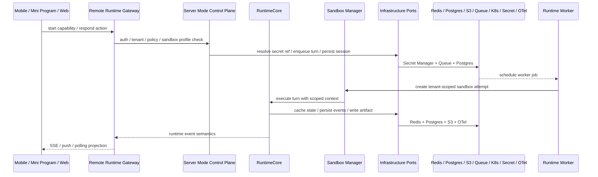

# 客户端与服务端基础设施边界

> 状态：north-star planning source
> 更新时间：2026-06-07

## 1. 结论

Lime Next 只能共享 Runtime 语义，不能共享基础设施实现。

```text
共享：
Runtime facts / protocol semantics / projection contract / capability policy

不共享：
cache implementation / file system / database / object storage / queue / worker scheduling / secret storage / observability backend
```

Sandbox / permissions 也不是服务端附属项。客户端和服务端都必须先解析 permission profile，通过 Sandbox Manager 选择执行后端，再进入具体基础设施 ports。

服务端模式不是把本地 sidecar、Electron Host 或桌面 App Server 原样部署到云上。服务端必须通过 infrastructure ports 接入 Redis、Postgres、S3 / OSS、Queue、Docker / Kubernetes、Secret Manager、OpenTelemetry 等基础设施；客户端则通过同一 ports 接入 memory、local cache、本地 FS、SQLite、OS Keychain、本地日志等实现。

## 2. 分层架构图

```mermaid
flowchart TB
    subgraph Shared["可共享事实层"]
        Facts["Runtime Facts<br/>Session / Turn / Event / Action / Artifact / Evidence"]
        Protocol["Protocol Semantics<br/>agentSession / artifact / evidence / capability"]
        Projection["Headless Projection<br/>facts -> ViewModel"]
        Policy["Capability / Policy Contract"]
        Sandbox["Permission / Sandbox Contract"]
    end

    subgraph Ports["Infrastructure Ports"]
        CachePort["CachePort"]
        WorkspacePort["WorkspacePort"]
        DatabasePort["DatabasePort"]
        ObjectStorePort["ObjectStorePort"]
        QueuePort["QueuePort"]
        SecretPort["SecretPort"]
        ObservabilityPort["ObservabilityPort"]
    end

    subgraph Client["客户端 / 本地 Sidecar Adapters"]
        Memory["Memory / Local Cache"]
        LocalFs["Local FS / App Data / Workspace Root"]
        SQLite["SQLite / IndexedDB / Local Store"]
        LocalArtifacts["Local Artifact Directory"]
        LocalQueue["In-process Queue / Sidecar Lifecycle"]
        Keychain["OS Keychain"]
        LocalLogs["Local Logs / stderr / Dev Trace"]
        LocalSandbox["Local OS Sandbox"]
    end

    subgraph Server["服务端 / Server Mode Adapters"]
        Redis["Redis / Distributed Cache"]
        Volumes["Workspace Volume / Sandbox Mount"]
        Postgres["Postgres / Managed DB"]
        S3["S3 / OSS / Compatible Object Storage"]
        ServerQueue["Queue / Workflow / Cron"]
        K8s["Docker / Kubernetes Worker Carrier"]
        SecretManager["Secret Manager / KMS / Vault"]
        OTel["OpenTelemetry / Metrics / Traces / Audit"]
        WorkerSandbox["Server Worker Sandbox Backend"]
    end

    Facts --> Protocol
    Facts --> Projection
    Protocol --> Policy
    Protocol --> Sandbox
    Facts --> Ports
    Ports --> CachePort
    Ports --> WorkspacePort
    Ports --> DatabasePort
    Ports --> ObjectStorePort
    Ports --> QueuePort
    Ports --> SecretPort
    Ports --> ObservabilityPort

    CachePort --> Memory
    WorkspacePort --> LocalFs
    DatabasePort --> SQLite
    ObjectStorePort --> LocalArtifacts
    QueuePort --> LocalQueue
    SecretPort --> Keychain
    ObservabilityPort --> LocalLogs
    Sandbox --> LocalSandbox

    CachePort --> Redis
    WorkspacePort --> Volumes
    DatabasePort --> Postgres
    ObjectStorePort --> S3
    QueuePort --> ServerQueue
    QueuePort --> K8s
    SecretPort --> SecretManager
    ObservabilityPort --> OTel
    Sandbox --> WorkerSandbox
```



## 3. 依赖方向



规则：

1. RuntimeCore 只能依赖 port trait / interface，不依赖具体基础设施 SDK。
2. Product Shell 只能消费 projection、action、artifact preview、evidence summary，不直接消费 adapter 对象。
3. Remote Runtime Gateway 可以选择 server adapters，但不能把 Redis key、S3 path、K8s job、Secret ARN 暴露给端侧。
4. 客户端 adapter 和服务端 adapter 都是 infrastructure implementation，不是 Runtime facts。

## 4. 能力差异矩阵

| 能力 | 客户端 / 本地 sidecar | 服务端 / Server Mode | 共享什么 | 禁止什么 |
| --- | --- | --- | --- | --- |
| 缓存 | memory、IndexedDB、local cache | Redis、distributed cache、lease / lock | cache port 语义、TTL、失效策略 | RuntimeCore 直接使用 Redis key。 |
| 文件 / workspace | 本地 FS、App data、用户选择的 workspace root | workspace volume、sandbox mount、object ref | workspace ref、permission policy、path capability | 服务端直接信任客户端本地路径。 |
| 数据库 | SQLite、local store、本地 timeline 表 | Postgres、managed DB、event store | session / turn / event schema 语义 | UI 或 RuntimeCore 绑定具体 SQL driver。 |
| Artifact | 本地 artifact directory、App data 文件 | S3 / OSS、signed URL、object policy | artifact ref、preview、contentStatus | 端侧暴露 bucket、object key、内部路径。 |
| 队列 / 调度 | 进程内队列、sidecar 生命周期 | Redis queue、workflow engine、cron、K8s job | enqueue / cancel / resume / status 语义 | ExecutionBackend 直接做租户队列控制面。 |
| Sandbox / 权限 | 本机 permission profile、OS sandbox、approval | tenant scoped profile、worker sandbox、approval / audit | permission profile、FS / network / exec / approval policy | ToolRuntime 绕过 Sandbox Manager。 |
| Worker 承载 | 本地进程、sidecar lifecycle | container / namespace / VM / microVM / Kubernetes job | worker lifecycle contract | 把 Docker / Kubernetes 当作 permission model。 |
| 密钥 | OS Keychain、本地 credential resolver | Secret Manager、KMS、vault、scoped secret ref | secret ref、capability policy | 移动端 / 小程序持有 provider secret。 |
| 观测 | local logs、stderr、dev trace | OpenTelemetry、metrics、traces、audit logs | runtime event、trace context、audit event shape | 把 audit log 当作 UI timeline facts。 |
| 网络入口 | Electron IPC、stdio JSONL、local socket | HTTPS、SSE、WebSocket、push、webhook | protocol method 语义 | 服务端发明第二套 session / turn / event。 |
| 身份 | 本机用户、workspace grant、本地账号 | user、tenant、app、OpenID / unionId 绑定 | auth context、policy decision | 把 push token / OpenID 写入 Runtime facts。 |
| 部署 | App bundle、sidecar binary、local resources | Docker image、K8s deployment、worker pool | version / capability compatibility | 用 Electron Host 承担服务端业务后端。 |

## 5. Port 列表

| Port | 职责 | 客户端 adapter | 服务端 adapter |
| --- | --- | --- | --- |
| `CachePort` | 短期状态、幂等令牌、backpressure hint | memory / local cache | Redis / distributed cache |
| `WorkspacePort` | workspace ref、路径解析、权限检查、sandbox mount | Local FS / App data | workspace volume / sandbox / object ref |
| `DatabasePort` | session、turn、event、read model 持久化 | SQLite / local store | Postgres / managed DB |
| `ObjectStorePort` | artifact、evidence、large payload 存取 | local artifact directory | S3 / OSS / compatible object storage |
| `QueuePort` | turn enqueue、cancel、resume、worker dispatch | in-process queue | queue / workflow engine / K8s job |
| `SecretPort` | secret ref 解析、凭证作用域、密钥轮换 | OS Keychain | Secret Manager / KMS / vault |
| `ObservabilityPort` | trace、metrics、audit、diagnostic event | local logs / stderr | OpenTelemetry / audit pipeline |

Sandbox 不作为普通 infrastructure port 暴露给业务层。它是 execution boundary，由 `PermissionProfile`、`SandboxManager`、platform sandbox backend、approval / escalation 和 audit 组成。普通 ports 只能在该边界之后被 RuntimeCore / ToolRuntime 使用。

## 6. Adapter 选择流程



## 7. 时序图：本地 Turn



## 8. 时序图：服务端长任务



## 9. 服务端实现前置条件

服务端方向进入实现前，必须先具备：

1. Remote Runtime Gateway PRD：认证、租户、App、capability、事件订阅、action 幂等、artifact 安全预览。
2. Sandbox / Permissions 合同：permission profile、filesystem / network policy、approval、exec policy、client/server sandbox backend。
3. Infrastructure Port 合同：缓存、文件 / workspace、数据库、对象存储、队列、密钥、观测。
4. Adapter registry：根据运行形态选择 client adapter 或 server adapter。
5. Secret ref 机制：端侧只看到 ref 和权限，不看到 provider secret。
6. Object ref 机制：artifact / evidence 只通过 ref、preview、contentStatus 暴露。
7. Event store 机制：session / turn / event 可被多端恢复和订阅。
8. 结构测试：RuntimeCore 不依赖 Redis、Postgres、S3、Docker、Kubernetes 或云 SDK。
9. 结构测试：ToolRuntime / ExecutionBackend 不绕过 Sandbox Manager。

## 10. 反模式

以下路径直接判为 `deprecated` 或 `dead` 候选：

1. 把本地 sidecar 容器化后当作服务端模式。
2. 在 RuntimeCore 里直接写 Redis / S3 / Postgres / Docker / Kubernetes SDK。
3. 用 Docker / Kubernetes 替代 permission profile 和 sandbox policy。
4. ToolRuntime / ExecutionBackend 直接启动进程而不经过 Sandbox Manager。
5. 让移动 App 或微信小程序持有 provider secret。
6. 让小程序直连本地 sidecar。
7. 把 S3 object key、Redis key、K8s job name 当作 Runtime facts 暴露。
8. 为服务端重新定义一套 session / turn / event。
9. 用 Electron Host 或 Desktop Bridge 承担服务端业务后端。

## 11. 验收口径

每个涉及基础设施的实现 PR 都要回答：

1. 这个能力属于 Runtime facts、Gateway context、Shell state 还是 Infrastructure Adapter？
2. 是否复用了既有 port，还是必须新增 port？
3. 客户端 adapter 和服务端 adapter 是否可以独立替换？
4. RuntimeCore 是否没有 import 具体 infra SDK？
5. ToolRuntime / ExecutionBackend 是否没有绕过 Sandbox Manager？
6. Docker / Kubernetes 是否仅作为 worker 承载选项？
7. artifact / evidence / secret 是否只暴露 ref / preview / summary？
8. 移动 App / 小程序是否只通过 Remote Gateway 消费 projection？
9. 是否有结构测试或扫描规则阻止基础设施实现泄露到 RuntimeCore / UI primitives？
