# Lime Next 流程图

> 状态：north-star planning source
> 更新时间：2026-06-07

## 1. 用户路径：从任意端发起 Agent 任务

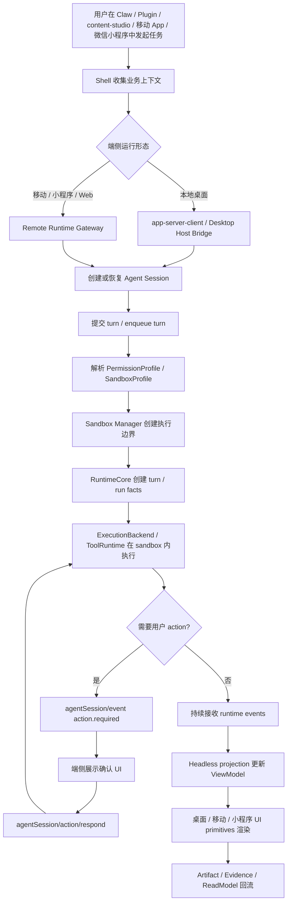

## 2. 部署形态选择流程

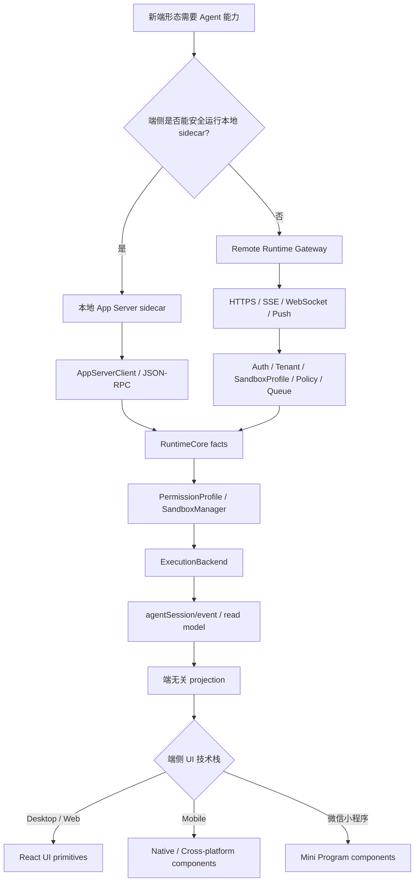

## 3. 技术主链

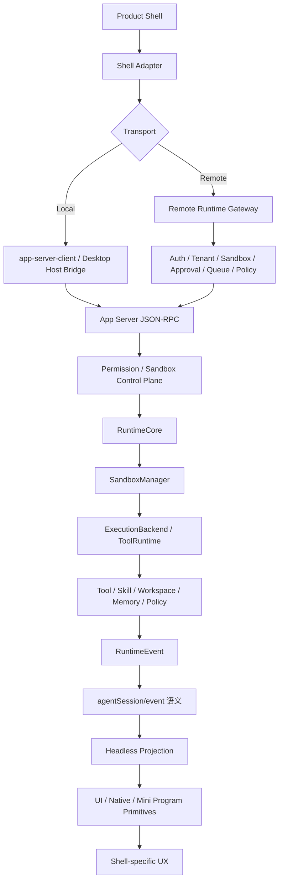

## 4. Claw UI 规范化流程

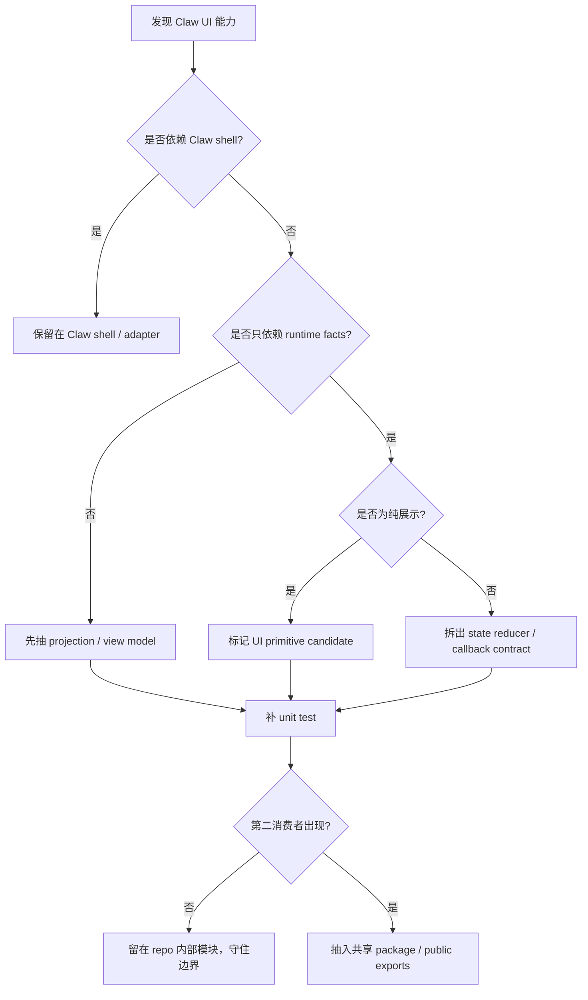

## 5. 本地独立 App 接入流程

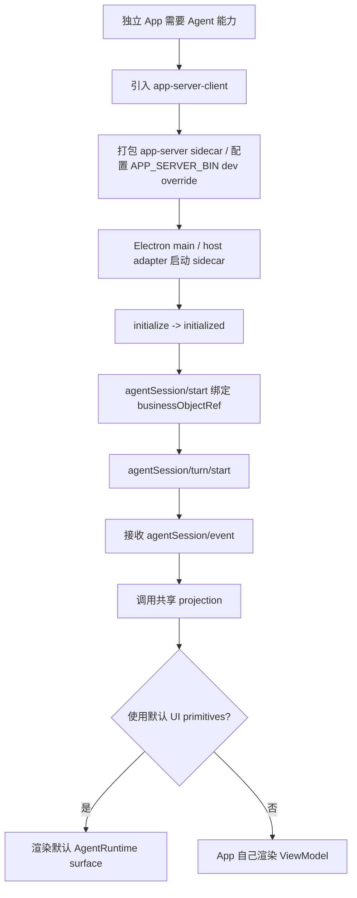

## 6. 移动 App / 微信小程序接入流程

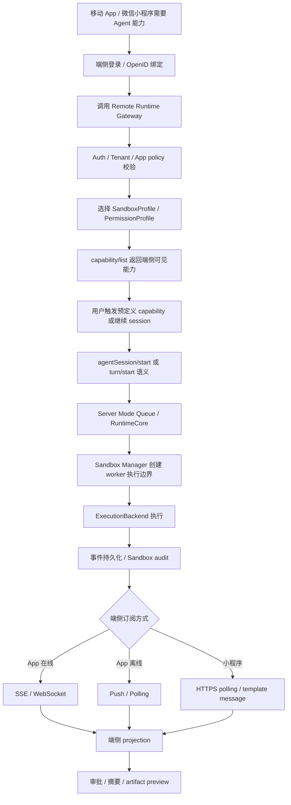

## 7. 服务端长任务流程

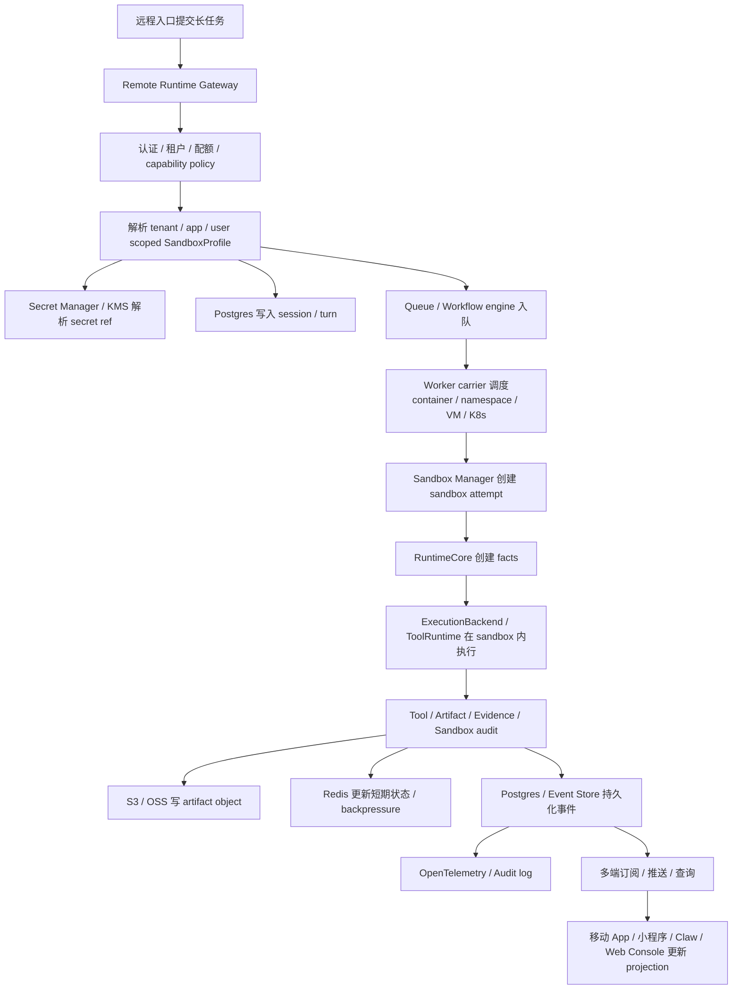

## 7.1 基础设施 Adapter 选择流程

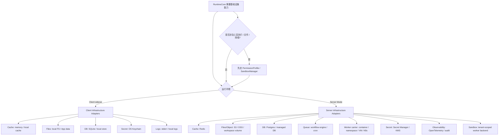

## 8. Runtime 能力新增流程

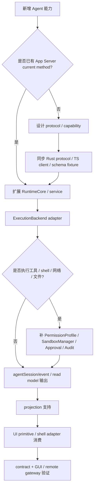

## 9. 治理收口流程

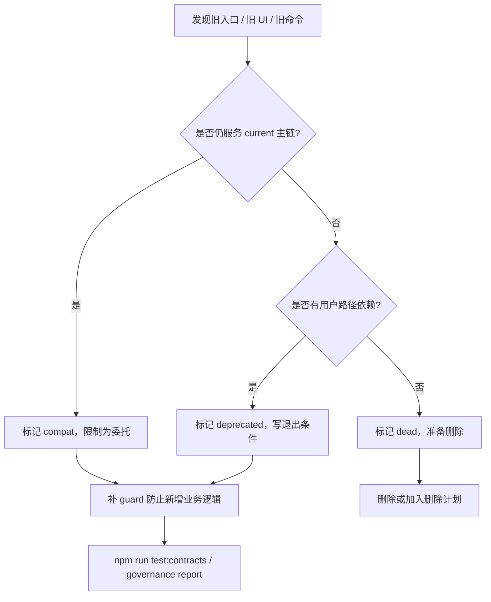

## 10. 禁止路径

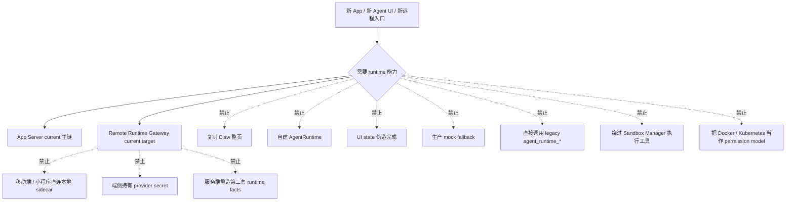
