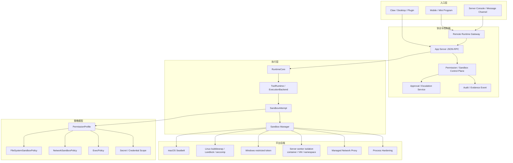
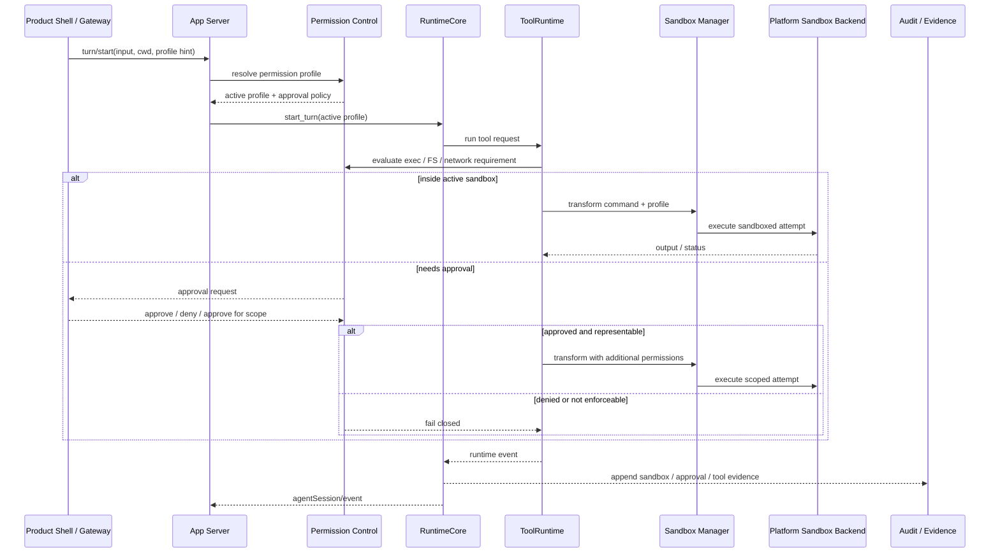

# Sandbox 与 Permissions 北极星

> 状态：north-star planning source  
> 更新时间：2026-06-07  
> Owner：Lime Runtime / App Server / Security Boundary

## 1. 结论

Lime Next 必须采用 **sandbox-first** 架构。Sandbox 不是服务端专属能力，也不是 Docker / Kubernetes 的同义词；它是客户端、本地 sidecar、服务端 worker、移动审批入口和小程序 gateway 共同遵守的执行安全主轴。

后续新增 Agent 执行能力必须能回答：

1. 当前 turn / tool attempt 使用哪个 permission profile？
2. 文件系统可读、可写、拒读范围是什么？
3. 网络默认是否关闭？如果开启，allow / deny 策略是什么？
4. 哪些动作需要 approval？
5. 哪些命令可由 exec policy 放行、提示或禁止？
6. 发生越界时是 sandbox 内追加权限、审批升级，还是 fail closed？
7. 客户端与服务端分别由哪个 platform sandbox backend 执行？
8. 审批、拒绝、越界、网络拦截和 artifact 写入是否可审计？

事实源必须收敛为：

```text
Product Shell / Remote Gateway
  -> App Server Protocol
  -> RuntimeCore
  -> ToolRuntime / ExecutionBackend
  -> Permission Profile
  -> Sandbox Manager
  -> Platform Sandbox Backend
  -> Approval / Escalation / Audit
```

## 2. Codex 架构借鉴

Codex 的关键启发不是“有一个 app-server”，而是 app-server、core runtime、permission profile、sandbox manager、平台 sandbox backend 和 approval flow 共同形成安全闭环。

从 `/Users/coso/Documents/dev/rust/codex/codex-rs/` 可验证的分层：

| Codex 层 | 作用 | Lime Next 借鉴 |
| --- | --- | --- |
| `app-server` | JSON-RPC、thread / turn / item、approval、permissions、event stream | App Server 是多端入口，但不拥有最终安全边界。 |
| `app-server-client` | in-process typed channel facade，保留 app-server 语义 | 本地 CLI / Desktop / App 可去掉进程边界，但不能发明第二协议。 |
| `app-server-daemon` | remote app-server lifecycle，服务 desktop / mobile remote clients | 服务端或远程机器生命周期独立于 UI 壳。 |
| `protocol/src/permissions.rs` | permission profile、FS / network policy、protected metadata、deny-read fail-closed | Lime 需要明确 profile、FS、network、metadata 保护和拒读语义。 |
| `core/src/tools/sandboxing.rs` | approval cache、approval requirement、sandbox attempt、denied-read escalation guard | ToolRuntime 每次执行都要带 sandbox attempt 和 approval 判断。 |
| `sandboxing/src/manager.rs` | 选择 macOS Seatbelt、Linux seccomp / bubblewrap、Windows restricted token，并把 command + permissions transform 成 exec request | Lime 需要平台 sandbox manager，而不是在 backend 里散落判断。 |
| `linux-sandbox` | bubblewrap 默认、read-only root、writable roots bind、protected subpaths re-ro-bind、namespace / seccomp、managed proxy routing | Linux 端不能把“跑在容器里”误当作完整 permission enforcement。 |
| `network-proxy` | allowlist-first、deny wins、local/private protection、limited mode、OTel audit | 网络必须是 policy-first，不能只用网络开关。 |
| `process-hardening` | pre-main hardening、禁 core dump / ptrace、清理危险 env | sandbox 外还需要进程硬化。 |
| `execpolicy` / `shell-escalation` | command prefix allow / prompt / forbid、越界审批 | shell 类工具需要单独的命令策略和升级流。 |

Codex 的另一个关键点：当 filesystem policy 有 denied reads 时，不能简单绕过 sandbox 运行。因为 denied-read 只有在 sandbox 内才可执行，绕过 sandbox 会悄悄扩大读取范围。Lime Next 必须保留这个 fail-closed 口径。

## 3. Lime Next Sandbox 分层图



## 4. Client Sandbox 与 Server Sandbox

| 维度 | 客户端 / 本地 sidecar | 服务端 / Server Mode | 共享约束 |
| --- | --- | --- | --- |
| Permission profile | `:read-only`、`:workspace`、`:danger-full-access` 或自定义 profile | tenant / app / user / workspace scoped profile | 每个 turn / tool attempt 必须可追溯 profile。 |
| 文件系统 | 本机 workspace roots、App data、临时目录、protected metadata | workspace volume、object refs、ephemeral workdir、tenant volume | 默认最小可写；deny-read fail-closed。 |
| 网络 | 默认关闭；开启后走 allowlist / managed proxy | egress policy、private network deny、service allowlist | network enabled 不等于 unrestricted。 |
| 审批 | 本地用户或自动 reviewer 响应 | user / admin / policy reviewer / webhook approval | approval 是越界流，不是权限常开。 |
| Shell / exec | 本地 shell、apply patch、tool subprocess | worker shell、job sandbox、remote tool subprocess | shell 命令必须受 exec policy 约束。 |
| Secret | OS Keychain、本地 credential resolver | Secret Manager / KMS / Vault、scoped handles | 端侧只看 secret ref，不看明文。 |
| Sandbox backend | macOS Seatbelt、Linux bubblewrap / Landlock / seccomp、Windows restricted token | container / VM / namespace / gVisor / Firecracker / Kubernetes policy 等承载选项 | backend 是实现，policy 是事实源。 |
| 审计 | local logs、runtime events、approval log | OTel、audit log、event store、evidence refs | 审计事件不能泄露 secret、完整 URL query 或内部 object key。 |

客户端也必须有 sandbox。没有客户端 sandbox，Lime Desktop / Claw / 本地 Plugin 就会在用户机器上以 UI 壳权限直接执行工具，无法证明 workspace、metadata、secret 和网络边界。

服务端也必须有 sandbox。没有服务端 sandbox，租户隔离、长任务 worker、secret ref、对象存储和网络 egress 都会退化成“平台自律”，不能作为多端 Agent 底座。

## 5. 核心策略模型

### 5.1 Permission Profile

Permission profile 是执行安全的入口对象，不是 UI 设置项。它至少包含：

1. profile id 与来源：built-in、project config、tenant policy、turn override。
2. filesystem policy：read / write / deny entries、workspace roots、tmp、protected metadata。
3. network policy：enabled、allow / deny domains、local/private network、proxy mode。
4. approval policy：never、on-request、granular、auto reviewer。
5. exec policy：command prefix allow / prompt / forbid。
6. secret scope：可解析 secret ref 的范围与生命周期。
7. enforcement mode：是否必须平台 sandbox、是否允许 external sandbox、是否允许 full access。

### 5.2 FileSystem Sandbox Policy

文件系统策略必须支持：

1. workspace roots 与 runtime workspace roots 分离。
2. exact path 与 glob pattern。
3. read / write / deny 三态，deny 优先。
4. protected metadata 默认只读：`.git`、`.agents`、`.codex` 或 Lime 等价目录。
5. denied-read 失败关闭：无法证明拒读可执行时，不允许降级为无 sandbox。
6. symlink、缺失路径、挂载点与路径规范化处理。

### 5.3 Network Sandbox Policy

网络策略必须支持：

1. 默认关闭。
2. 开启后仍可 allowlist-first。
3. deny wins。
4. local / private network 默认禁止，除非显式允许。
5. 可选 managed proxy，必要时支持 limited read-only mode。
6. 审计只记录必要 host / policy decision，不记录敏感 query / secret。

### 5.4 Approval Policy

审批策略负责“何时停下来问”，不负责替代 sandbox。要求：

1. inside sandbox 的安全动作可自动执行。
2. sandbox 越界、网络越界、破坏性工具、secret 扩权必须进入 approval。
3. approval 可由用户、自动 reviewer 或服务端 policy reviewer 处理。
4. approval scope 必须窄：session、turn、tool call、path、command prefix 或 network host。
5. approval 被拒绝后不能重试同一越界路径绕过策略。

### 5.5 Exec Policy 与 Shell Escalation

shell / exec 类工具必须额外受 exec policy 约束：

1. 支持 command prefix allow / prompt / forbid。
2. 支持 sandbox 内执行失败后的受控升级。
3. 当 denied-read 生效时，升级不能绕过 sandbox。
4. 用户发起的 maintenance command 和模型发起的 tool command 要分开审计。

## 6. Platform Sandbox Backends

Lime Next 不应把 Docker / Kubernetes 当成 sandbox 抽象本身。建议模型：

```text
SandboxManager
  -> LocalPlatformBackend
      -> macOS Seatbelt
      -> Linux bubblewrap / Landlock / seccomp
      -> Windows restricted token
  -> ServerWorkerBackend
      -> container / namespace
      -> VM / microVM
      -> gVisor / Firecracker
      -> Kubernetes policy / job runner
  -> NetworkProxyBackend
  -> ProcessHardeningBackend
```

验收标准不是“用了容器”，而是：

1. 能否准确执行 active permission profile。
2. 能否证明文件、网络、secret、进程、metadata 边界。
3. 能否在策略不支持时 fail closed。
4. 能否输出审计和 evidence。

## 7. Sandbox Lifecycle Sequence



## 8. 反模式

以下做法直接判为 `deprecated` 或 `dead` 候选：

1. 把 Docker / Kubernetes 当作 sandbox 本身，跳过 permission profile。
2. 客户端本地工具直接用 UI 进程权限执行。
3. 服务端 worker 只做租户字段过滤，不做进程 / 文件 / 网络隔离。
4. 网络只用 `enabled: true/false`，没有 allow / deny 与 local/private 保护。
5. approval 通过后直接 full access，丢失 denied-read 限制。
6. 移动 App / 小程序持有 provider secret 或发起任意 tool command。
7. 审计日志记录完整 URL query、secret、S3 key、Redis key、本地绝对路径。
8. RuntimeCore 直接 import Docker、Kubernetes、Redis、S3 或云 SDK 来判断安全边界。

## 9. 验收口径

进入实现前，任何 Runtime / Tool / Server Mode / Remote Gateway 方案都必须回答：

1. active permission profile 从哪里解析？
2. filesystem policy 是否支持 read / write / deny 和 protected metadata？
3. denied-read 是否 fail closed？
4. network policy 是否默认关闭，开启后是否 allowlist-first？
5. approval policy 与 sandbox boundary 是否分离？
6. exec policy 是否能约束 shell / command prefix？
7. 客户端与服务端分别使用哪个 sandbox backend？
8. Docker / Kubernetes 是否只作为 worker isolation / scheduling backend？
9. secret ref 是否只在受控边界解析？
10. audit / evidence 是否能还原每次越界、审批、拒绝和 sandbox attempt？

## 10. 下一刀

服务端方向的下一刀不是先选 Redis / S3 / K8s，而是先定义：

1. `PermissionProfile` / `SandboxPolicy` / `ApprovalPolicy` 的协议模型。
2. `SandboxManager` 与 `SandboxBackend` port。
3. 客户端 local sandbox backend 与服务端 worker sandbox backend 的最小实现矩阵。
4. 结构测试：ToolRuntime / ExecutionBackend 不允许绕过 sandbox manager。
