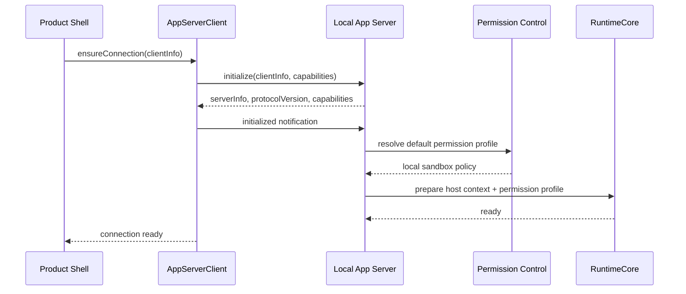
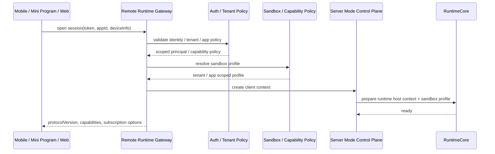
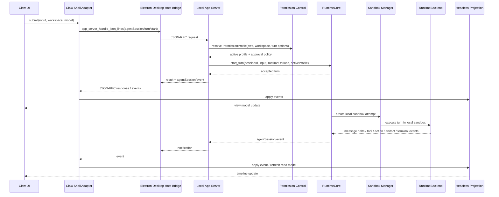
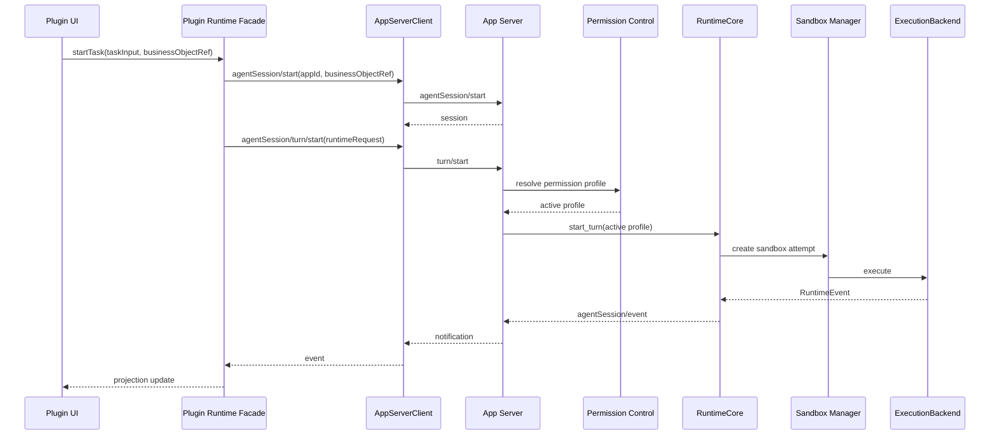
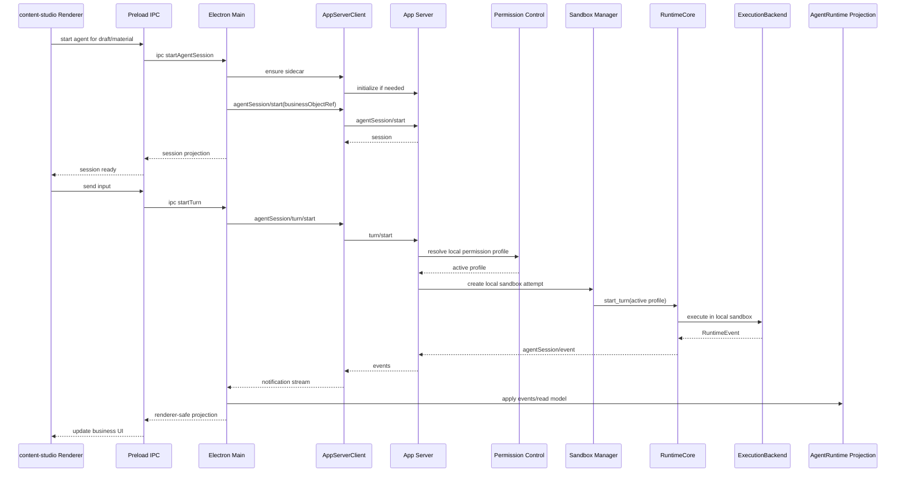
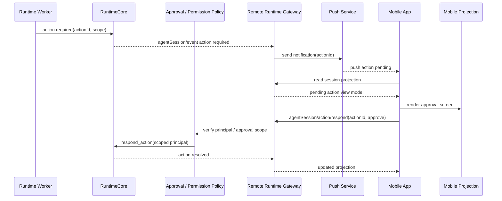
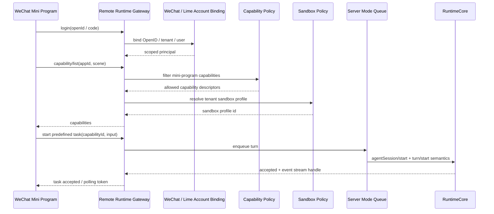
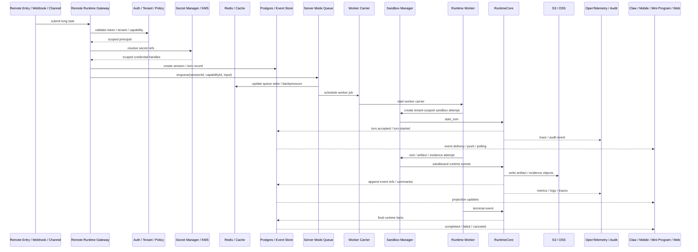
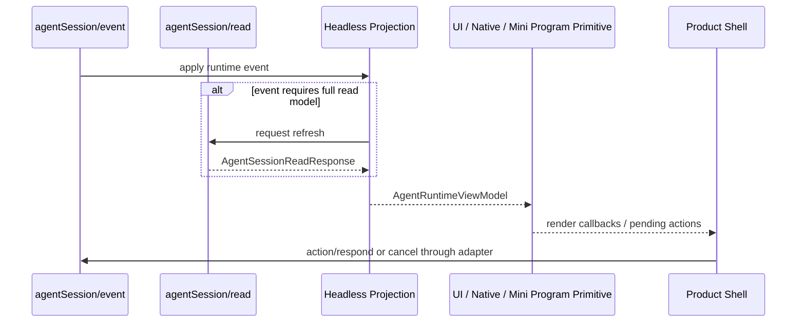
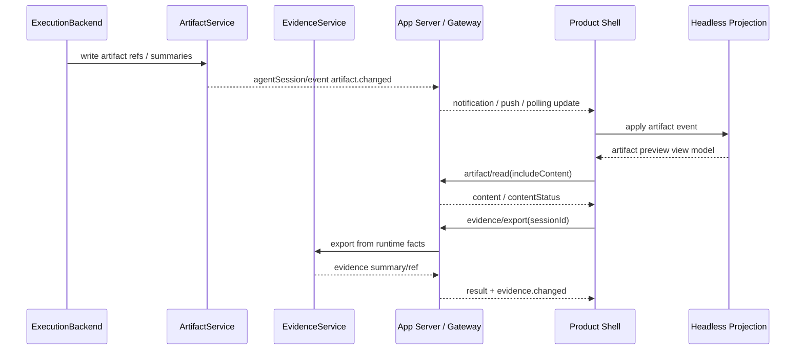

# Lime Next 时序图

> 状态：north-star planning source
> 更新时间：2026-06-07

## 1. 本地 App Server 初始化

## 2. Remote Runtime Gateway 初始化

## 3. Claw 发起 Turn

## 4. Plugin 对话 Turn

要求：Plugin UI runtime start/status/stop 只负责 UI 子进程生命周期，不承接对话 runtime。对话必须进入 `agentSession/* -> RuntimeCore -> ExecutionBackend`。

## 5. content-studio 业务对象绑定

## 6. 移动 App 审批 Action

## 7. 微信小程序触发预定义 Capability

要求：微信小程序只通过 HTTPS Remote Runtime Gateway 调用，不直连本地 sidecar，不持有 provider secret，不自建 runtime。

## 8. 服务端长任务与多端订阅

## 9. UI Projection 更新

## 10. Artifact / Evidence

