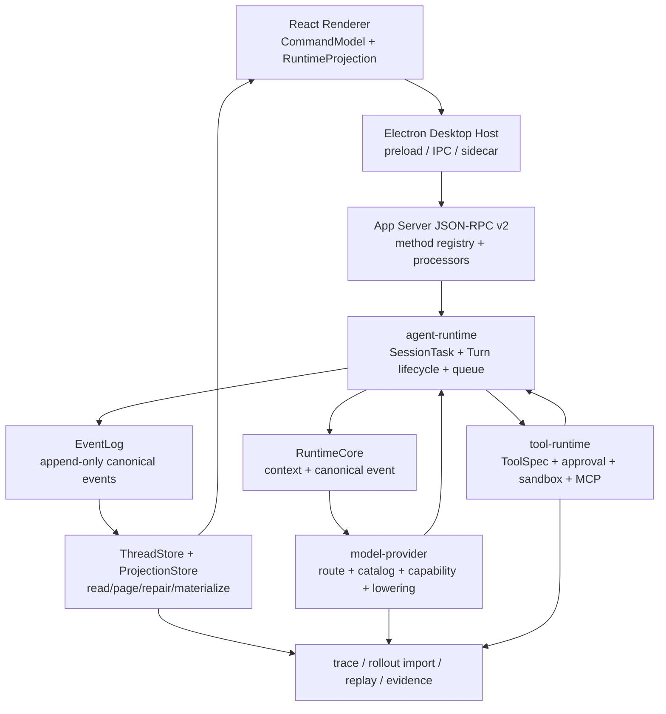

# Codex 对齐终态架构

## 1. 北极星

Lime 的终态是一个 App Server v2、多客户端可消费的 runtime。Electron/Renderer 是客户端壳，Codex 语义在 Rust current owner 内落地；多模型/provider 在 `model-provider` 内保持 provider-neutral。没有长期 `agentSession` 或 provider compat 层。



## 2. Owner 表

| Owner | 允许承载 | 明确禁止 |
| --- | --- | --- |
| `agent-protocol` / `app-server-protocol` | Codex v2 Thread/Turn/Item、method、notification、schema、server request、experimental filtering | `protocol/v0`、`agentSession/*`、provider raw JSON、GUI local state |
| `agent-runtime` | SessionTask、Turn queue、cancel/steer、action-required、attempt 生命周期 | DB schema、provider wire、Electron IPC |
| `runtime-core` | context fragment、canonical content、history assembly、compaction input | UI 状态、credential、工具 executor |
| `model-provider` | catalog、route、capability、credential readiness、lowering、stream reducer、retry/breaker | Thread/Turn/Item 状态机、tool side effect |
| `tool-runtime` | ToolSpec/Call、tool snapshot、permission、sandbox、approval、MCP dispatch | provider request body、GUI approval dialog |
| `thread-store` | raw canonical rollout item append、独立 metadata patch、Thread/Turn/Item durable schema、graph/identity/mailbox、page/repair | provider history、从 item 推 metadata、临时 queue、Renderer cache |
| `app-server` | JSON-RPC transport、processor 接线、projection、server request、repository wiring | provider wire、tool executor、第二 runtime |
| Electron Desktop Host | window、preload、IPC、system capability、sidecar 生命周期 | Agent loop、模型路由、Thread/Turn/Item、mock backend |
| Renderer | CommandModel、RuntimeProjection、SceneComposition、i18n | runtime truth、provider request、local parallel state machine |
| Evidence/Replay | trace、usage、route provenance、replay fixture、Gate B artifact | 反向驱动生产 runtime |

## 3. 写路径

```text
GUI command
  -> typed gateway
  -> App Server JSON-RPC v2 method
  -> agent-runtime command
  -> resolve effective runtime options
  -> append canonical rollout item / lifecycle event
  -> execute provider/tool attempt
  -> append canonical lifecycle item
  -> apply ThreadStore + independent metadata patch
  -> notify clients
```

关键规则：

1. 写请求响应只代表 accepted/rejected/identity；Renderer 不从响应拼 transcript。
2. canonical history append 与 metadata patch 是分离 API；ThreadStore append 只接收 canonical item，不从 item 内容推导 metadata。顺序/repair provenance 失败时不能 ack mailbox 或通知客户端。
3. 每个 provider sampling attempt 都绑定 `(thread_id, turn_id, attempt_id, route_id, model_id)`；late event 只能被 identity gate 丢弃并记录诊断。
4. 工具执行必须由 `RuntimeTool::execute_call` 进入，且 definitions/executor 来自同一个 `RuntimeToolStepSnapshot`。

## 4. 读路径

```text
ThreadStore raw history + metadata / ProjectionStore
  -> App Server v2 thread/read / thread/list / thread/turns/list / thread/items/list
  -> typed client projection
  -> Renderer scene
  -> Evidence / Replay export
```

`thread/read`、live notification、evidence/replay 必须共享 Item identity 和 terminal status。禁止从 raw event、metadata、文本正则、旧 session repository、`agentSession/read` 或 Renderer cache 合成第二份事实。

## 5. Thread / Turn / Item 语义

### Thread

- 持有 `id/sessionId/forkedFromId/parentThreadId`、workspace/environment、preview、ephemeral/history mode、provider/session default、source/path/cwd/gitInfo/name 和 child graph 关系。
- 不因为 model switch 生成新 Thread。
- child Thread 的 parent edge、identity、fork lineage 必须 durable。

### Turn

- 一次用户输入到 terminal 的执行边界。
- 状态至少覆盖 queued、in_progress、completed、failed、interrupted、cancelled；时间单位和 Codex v2 schema 固定。
- terminal timestamp/error/usage/route 一次性写入；timeout 不能伪造 terminal。
- `turn_runtime_options[turn_id]` 是 child、resume、recovery 复制有效 provider/model 的唯一来源。

### Item

- 输入、HookPrompt、AgentMessage、Reasoning、Plan、CommandExecution、FileChange、MCP、DynamicTool、CollabAgent、SubAgent、Web/Image/Media、Review、Compaction、MemoryCitation 都是 Codex v2 typed tagged union。
- 同一 Item identity 贯穿 started/delta/completed；terminal 后拒绝 late delta。
- Item ordinal 取首次 canonical event sequence，后续 lifecycle merge 不重排。
- presentation 只能 lower typed Item，不得创建 synthetic Team/Tool/Message item。

## 6. 多模型数据流

```text
RuntimeRequest
  -> RuntimeModelSelection
  -> model catalog resolve
  -> provider readiness
  -> capability enforcement
  -> ResolvedModelRoute
  -> ProviderRequest(canonical content + tool snapshot)
  -> provider lowering
  -> NormalizedProviderEvent
  -> agent-runtime attempt lifecycle
  -> canonical Item/EventLog
```

`ResolvedModelRoute` 必须包含 provider、model、protocol、credential reference、capability snapshot、effective request options、auxiliary route、route source、credential/tenant identity 和 failure state。route 解析必须同时证明 model match、provider availability、credential/endpoint readiness 和显式 capability；未知 model/capability 必须在联网前返回 typed failure，不能用默认模型、provider 名称、legacy heuristic 或 mock backend 猜测。

## 7. MCP 与 Tool snapshot

- MCP 管理面负责 server config、status、resource/prompt read；sampling 面只看到 thread-scoped immutable `McpRuntimeSnapshot`。
- 每个 step 的 tools、caller policy、connection handle、generation、auth/environment provenance、timeout 一起冻结。
- registry replace 不影响 in-flight step；下一 sampling step 才 capture 新 generation。
- elicitation 是 server request 的瞬时 waiter，不写 Thread/Turn/Item durable history。

## 8. Multi-Agent 拓扑

```text
root Thread
  └── AgentGraphStore edge
      └── child Thread + AgentIdentity
          └── AgentMailbox queue
              └── RuntimeCore consumer
                  └── canonical Item + child Turn
```

- graph、identity、mailbox 分属 `thread-store` owner；不能用 session metadata 或内存 map 重建。V2 还必须固化 role/config precedence、depth/width/residency/rollout budget。
- parent 只有在 effective runtime options 已解析后才能 spawn child。
- child history fork 只复制 canonical input 和 final AgentMessage；不复制 tool/reasoning/approval/raw Team side-channel。
- `wait_agent`、`send_message`、`followup_task`、`interrupt_agent` 等必须由 current gateway 产生 typed Tool lifecycle。

## 9. 禁止路径

以下路径一律不进入新代码；无外部兼容时直接标记 `dead / deleted / forbidden-to-restore`：

- Electron/Renderer 自己执行 model request、工具 executor 或 Thread/Turn/Item 持久化。
- `agent_runtime_*` 第二套业务后端、`protocol/v0`/`agentSession/*`、旧 session repository、第二 transcript/event store。
- `lime-providers` 或任何第二 provider trait/stream/session owner。
- provider adapter 直接发 `ToolStart/ToolEnd` 或拼 GUI Message/Tool item。
- App Server handler 拼 provider body、实现 approval/sandbox 或解析 provider raw stream。
- model selection 写在 processor、Electron host、Renderer component 或旧 `lime-agent` adapter。
- production mock/fallback backend、synthetic Team roster、raw event 到 GUI 的文本推断。

## 10. 架构完成定义

只有同时满足以下条件，才可以称为“完全对齐 Codex”：

1. Codex v2 Thread/Turn/Item、raw rollout、ThreadStore append/metadata patch、ProjectionStore 的 canonical write/read/recovery contract 通过测试。
2. SessionTask、queue、cancel、steer、approval、tool lifecycle、MCP、Skills、Multi-Agent 走同一 current owner。
3. 每个 Turn 的 provider/model/capability/attempt/usage 可从 read model 和 evidence 追溯。
4. renderer、Electron、App Server、runtime、provider、tool、store 没有第二业务实现。
5. 真实 Electron Gate B 能证明重启、恢复、模型切换、工具审批和 child agent 闭环；production 不再存在 `agentSession/*`、`protocol/v0` 或 `lime-providers`。
