# Codex 架构图谱：从 Agent 原语到工程系统

> 状态：current research baseline
> 更新时间：2026-07-05
> Codex 仓库：`/Users/coso/Documents/dev/rust/codex`
> Lime 落点：`/Users/coso/Documents/dev/ai/aiclientproxy/lime`

## 1. 阅读结论

Codex 的核心不是单点能力，而是一套围绕 Agent 原语建立的工程系统：

```text
Thread / Turn / ThreadItem
  -> typed app-server protocol
  -> App Server request processor
  -> core session / task / tool runtime
  -> event materialization
  -> rollout / state / history
  -> TUI typed facade / rendering projection
  -> fixtures / schema / integration validation
```

其中 `Thread / Turn / ThreadItem` 是第一层原语，但它必须和下面这些核心一起看才完整：

| 核心层 | 为什么核心 |
| --- | --- |
| Agent 原语 | 决定会话、执行边界、UI item、历史恢复、replay 的语义骨架 |
| Protocol-first | method、params、response、notification、schema、typed client 成组演进 |
| Request serialization scope | 按 global / thread / process / fs watch / mcp oauth 等范围串行或并发 |
| App Server processor | 多客户端统一进入同一后端，不让 UI 承接业务 |
| Core session runtime | turn queue、task lifecycle、context、tool execution、model stream 都在 core 内闭环 |
| Event materialization | core event 统一变成 notification / ThreadItem / history change |
| Tool / Approval / Sandbox | 工具调用、权限、沙箱、命令执行是结构化控制面 |
| Context fragments | 模型可见上下文按 fragment 管理，而不是把所有东西拼进 prompt |
| Rollout / State / Thread history | 可持久化、可恢复、可 replay，是 Agent 可信历史基础 |
| TUI facade | UI 通过 typed app-server session 消费协议，不在主组件拼 JSON-RPC |
| Plugin / Skills / MCP | 能力发现、技能注入、MCP 工具和插件包是一套 runtime capability 系统 |
| Test fixture / schema | app-server-test-client、schema export、core suite、TUI snapshots 共同防漂移 |

## 2. 总体架构图

```mermaid
flowchart TB
    subgraph Surfaces[用户入口 / 产品壳]
        CLI[cli / codex CLI]
        TUI[tui]
        AppServerDaemon[app-server-daemon]
        TestClient[app-server-test-client]
    end

    subgraph Transport[传输层]
        Stdio[stdio / uds]
        WS[websocket / transport]
        AppTransport[app-server-transport]
    end

    subgraph Protocol[app-server-protocol]
        MethodRegistry[common.rs method registry]
        RequestScope[ClientRequestSerializationScope]
        V2Types[v2 domain types]
        Notifications[ServerNotification]
        SchemaExport[JSON Schema / TypeScript export]
    end

    subgraph Primitives[Agent 原语]
        Thread[Thread]
        Turn[Turn]
        Item[ThreadItem]
        ThreadHistory[ThreadHistoryBuilder]
    end

    subgraph AppServer[app-server]
        MessageProcessor[message_processor.rs]
        RequestProcessors[request_processors/*]
        ThreadProcessor[thread_processor.rs]
        TurnProcessor[turn_processor.rs]
        ThreadState[thread_state.rs]
        ThreadStatus[thread_status.rs]
        Outgoing[OutgoingMessage / server requests]
    end

    subgraph Core[core runtime]
        Session[session/session.rs]
        TurnContext[session/turn_context.rs]
        InputQueue[session/input_queue.rs]
        Tasks[tasks/*]
        Tools[tools handlers / orchestrator]
        Context[context fragments]
        Compaction[compact / context_window / token_budget]
    end

    subgraph Execution[工具与执行]
        ToolCrate[tools crate]
        Exec[exec / unified_exec]
        ExecPolicy[execpolicy]
        Sandboxing[sandboxing / windows-sandbox-rs]
        ExecServer[exec-server]
        Mcp[codex-mcp / rmcp-client]
    end

    subgraph Persistence[历史与状态]
        Rollout[rollout]
        ThreadStore[thread-store]
        State[state]
        MessageHistory[message-history]
        RolloutTrace[rollout-trace]
    end

    subgraph Capability[扩展能力]
        Plugin[plugin / core-plugins]
        Skills[skills / core-skills / ext/skills]
        Hooks[hooks]
        Connectors[connectors]
        Realtime[realtime / image generation]
    end

    subgraph UIFacade[UI 投影]
        AppServerSession[tui app_server_session.rs]
        ChatWidget[chatwidget.rs + chatwidget/*]
        ChatProtocol[chatwidget/protocol.rs]
        HistoryCells[history_cell/*]
        Markdown[markdown_stream / diff_render]
    end

    CLI --> TUI
    TUI --> AppServerSession
    AppServerDaemon --> AppTransport
    TestClient --> AppTransport
    AppServerSession --> AppTransport
    AppTransport --> Stdio
    AppTransport --> WS

    Stdio --> MessageProcessor
    WS --> MessageProcessor

    MethodRegistry --> V2Types
    MethodRegistry --> RequestScope
    MethodRegistry --> Notifications
    MethodRegistry --> SchemaExport
    V2Types --> Thread
    V2Types --> Turn
    V2Types --> Item

    MessageProcessor --> RequestProcessors
    RequestProcessors --> ThreadProcessor
    RequestProcessors --> TurnProcessor
    ThreadProcessor --> ThreadState
    ThreadProcessor --> ThreadStatus
    TurnProcessor --> Session

    Session --> TurnContext
    Session --> InputQueue
    Session --> Tasks
    Tasks --> Tools
    TurnContext --> Context
    TurnContext --> Compaction

    Tools --> ToolCrate
    Tools --> Exec
    Tools --> Mcp
    Exec --> ExecPolicy
    Exec --> Sandboxing
    Exec --> ExecServer

    Core --> Rollout
    Rollout --> ThreadHistory
    ThreadHistory --> ThreadStore
    ThreadStore --> State
    Rollout --> RolloutTrace
    MessageHistory --> ThreadHistory

    Plugin --> Skills
    Skills --> Context
    Hooks --> Context
    Connectors --> Mcp
    Realtime --> Item

    ThreadState --> Notifications
    Core --> Notifications
    Notifications --> AppServerSession
    Notifications --> ChatProtocol
    ChatProtocol --> ChatWidget
    Item --> HistoryCells
    ChatWidget --> Markdown
```

## 3. 分层拓扑

| 层级 | Codex 路径 | 责任 | 关键模式 |
| --- | --- | --- | --- |
| 产品入口 | `cli`、`tui`、`app-server-daemon`、`app-server-test-client` | 用户入口、TUI、daemon、测试客户端 | 多壳共享 App Server，而不是每个壳一套 runtime |
| 传输层 | `app-server-transport`、`uds`、`stdio-to-uds` | stdio / websocket / UDS 连接 | transport 与协议类型分离 |
| 协议层 | `app-server-protocol/src/protocol/common.rs`、`v2/*`、`export.rs` | method、params、response、notification、schema、TS | 宏定义统一 method catalog；serialization scope 与实验 API gating 同步 |
| Agent 原语 | `v2/thread_data.rs`、`v2/thread.rs`、`v2/turn.rs`、`v2/item.rs` | Thread / Turn / ThreadItem | Agent 运行、历史、恢复、UI 投影的第一骨架 |
| 协议投影 | `event_mapping.rs`、`item_builders.rs`、`thread_history.rs` | core event 到 notification / ThreadItem / history | materialization 独立于 UI |
| App Server | `app-server/src/message_processor.rs`、`request_processors/*` | JSON-RPC 分发和 domain processor | 中心 processor 薄，domain processor 厚 |
| Thread 管理 | `thread_state.rs`、`thread_status.rs`、`thread_processor.rs`、`turn_processor.rs` | active turn、thread subscribers、status、resume/fork/read | 线程状态独立跟踪，终态结构化 |
| Core session | `core/src/session/*`、`core/src/tasks/*` | session lifecycle、turn context、input queue、task lifecycle | user input -> turn context -> task -> model/tool stream |
| Context | `core/src/context/*`、`context-fragments`、`context_manager/*` | model-visible context fragments | fragment 化、token budget、compaction、world state |
| Tools | `tools`、`core/src/tools/*`、`codex-mcp`、`rmcp-client` | function tools、dynamic tools、MCP、tool output | ToolCall 携带 turn_id / call_id / env / truncation / emitter |
| Exec / sandbox | `exec`、`exec-server`、`execpolicy`、`sandboxing`、`windows-sandbox-rs` | 命令执行、权限、沙箱、远程执行 | approval policy 与 sandbox policy 是控制面，不是 UI 文案 |
| Persistence | `rollout`、`thread-store`、`state`、`message-history`、`rollout-trace` | rollout、线程历史、state db、trace reducer | 历史可 materialize、可 replay、可 trace |
| Plugin / Skills | `plugin`、`core-plugins`、`skills`、`core-skills`、`ext/skills` | plugin manifest、skills loader、skill metadata、注入 | manifest / skills / MCP / UI metadata 分层 |
| Realtime / media | `realtime-*`、`core/src/realtime_*`、`v2/realtime.rs`、image generation extension | 实时音频、图片、媒体 item | 仍进入 Thread / Item / notification 体系 |
| UI facade | `tui/src/app_server_session.rs`、`chatwidget/protocol.rs` | typed request facade 和 notification handling | UI 不直接拼协议，主组件消费 facade |
| UI rendering | `chatwidget/*`、`history_cell/*`、`markdown_stream.rs`、`diff_render.rs` | TUI state machine、history cell、stream markdown、diff | chatwidget 是经验也是债，facade 思路比组件形态更值得学 |
| Quality | `app-server-test-client`、`core/tests/suite`、`tui/tests`、schema fixtures | integration fixture、snapshot、schema drift | 行为、协议、UI snapshot 三类证据共同防漂移 |

## 4. Agent 原语层

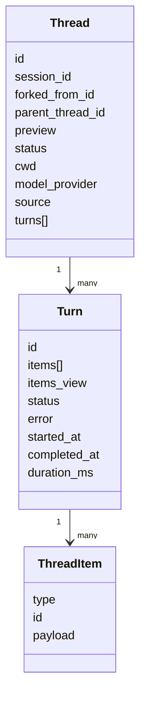

### 4.1 Thread

事实源：

- `app-server-protocol/src/protocol/v2/thread_data.rs`
- `app-server-protocol/src/protocol/v2/thread.rs`
- `thread-store`
- `app-server/src/request_processors/thread_processor.rs`

语义：

| 字段 / 能力 | 架构意义 |
| --- | --- |
| `id` | 线程唯一 ID，Codex 生成的 thread ID 是 UUIDv7 |
| `session_id` | 同一 session tree 的共享 ID |
| `forked_from_id` | fork 来源 thread |
| `parent_thread_id` | sub-agent 所属父 thread |
| `status` | 运行时状态，不是 UI 文案 |
| `turns` | 可选加载的历史 turn 列表 |
| `path / cwd / source / git_info` | thread 的运行上下文和来源 |

Thread 不是“消息列表 ID”。它承载的是长期会话、fork、sub-agent、resume、archive、read、list、search、goal、metadata 等完整会话事实。

### 4.2 Turn

事实源：

- `app-server-protocol/src/protocol/v2/turn.rs`
- `app-server-protocol/src/protocol/v2/thread_data.rs`
- `core/src/session/turn.rs`
- `core/src/session/turn_context.rs`
- `app-server/src/request_processors/turn_processor.rs`

语义：

| 能力 | 架构意义 |
| --- | --- |
| `turn/start` | 在某个 thread 上启动一次执行 |
| `turn/steer` | 对 active turn 注入后续输入，带 `expected_turn_id` 防 stale 操作 |
| `turn/interrupt` | 结构化中断，不靠 UI 停止按钮自行推断 |
| `TurnStatus` | `completed / interrupted / failed / inProgress` 是终态事实 |
| `additional_context / environments / approval_policy / sandbox_policy / model / effort` | turn 级覆盖项，后续 turn 可继承或更新 |

Turn 不是一个 loading 状态。它是一次模型、工具、审批、上下文和输出共同组成的执行边界。

### 4.3 ThreadItem

事实源：

- `app-server-protocol/src/protocol/v2/item.rs`
- `app-server-protocol/src/protocol/event_mapping.rs`
- `app-server-protocol/src/protocol/item_builders.rs`
- `app-server-protocol/src/protocol/thread_history.rs`

`ThreadItem` 类型族：

| Item | 语义 |
| --- | --- |
| `UserMessage` | 用户输入，支持 `UserInput` 多形态 |
| `HookPrompt` | hook 注入上下文 |
| `AgentMessage` | assistant 文本，可带 phase 和 memory citation |
| `Plan` | plan 内容 |
| `Reasoning` | summary / content reasoning |
| `CommandExecution` | shell 命令、cwd、process、status、output、exit code、duration |
| `FileChange` | patch/file update 和 status |
| `McpToolCall` | MCP server/tool、arguments、result、error、duration |
| `DynamicToolCall` | dynamic tool 调用和 content items |
| `CollabAgentToolCall` | spawn / assign / send message 等协作 agent 工具 |
| `SubAgentActivity` | sub-agent 活动 |
| `WebSearch` | web search |
| `ImageView` | image view |
| `Sleep` | sleep item |
| `ImageGeneration` | image generation 状态和结果 |
| `EnteredReviewMode / ExitedReviewMode` | review mode 边界 |
| `ContextCompaction` | context compaction marker |

ThreadItem 是 Codex UI 和 history 的最小语义单元。UI 不应该直接消费 provider wire event，而应该消费 item projection。

## 5. Protocol-first 层

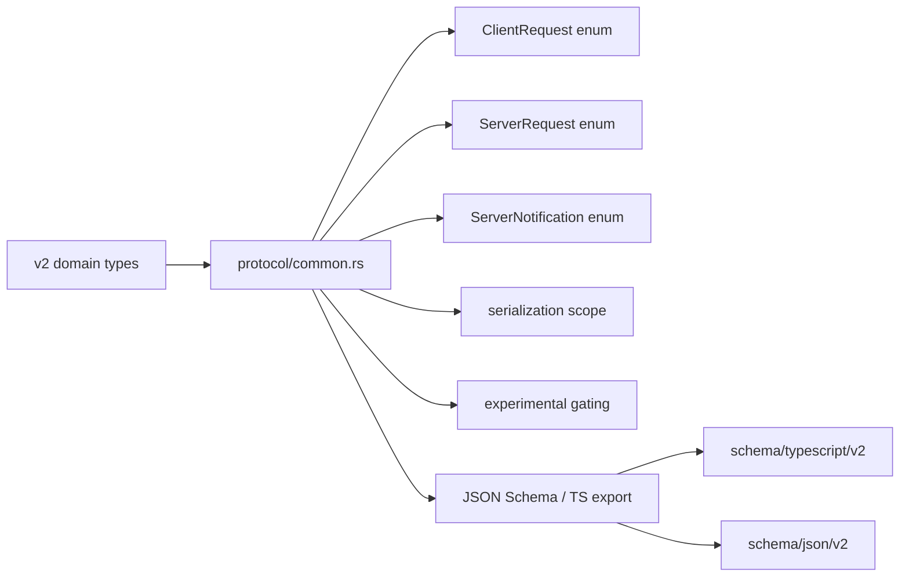

核心点：

| 机制 | Codex 做法 | Lime 应关注 |
| --- | --- | --- |
| method registry | `common.rs` 用宏集中声明 request / response / notification | 新 method 不应该多处手改 |
| serialization scope | `Global / Thread / ThreadPath / CommandExecProcess / Process / FsWatch / McpOauth` | 并发安全不是靠调用方自觉，而是 protocol 层声明 |
| experimental gating | method / field 可有 experimental reason | 兼容性和灰度能力要能被 schema 表达 |
| schema export | Rust 类型导出 JSON Schema / TypeScript | 前后端 client 不漂移 |
| typed client | `app-server-client` 消费 typed protocol | UI facade 不拼裸 JSON-RPC |

## 6. App Server 层

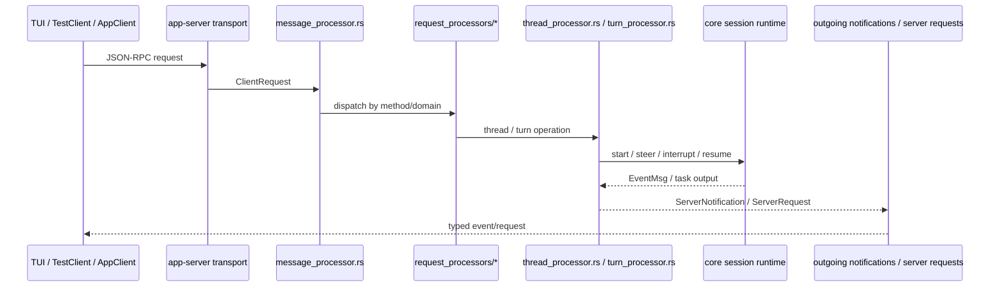

App Server 的角色不是“业务大杂烩”，而是：

1. 承接所有客户端壳的 JSON-RPC。
2. 维护 connection、subscription、thread listener。
3. 把 request 分给 domain processor。
4. 把 core runtime 的事件转成 typed notification。
5. 给 UI 发 structured server request，例如 approval。

关键路径：

| 路径 | 作用 |
| --- | --- |
| `app-server/src/message_processor.rs` | request 中心分发 |
| `app-server/src/request_processors/*` | domain processor |
| `thread_processor.rs` | thread start/resume/read/fork/list/search/archive/delete |
| `turn_processor.rs` | turn start/steer/interrupt |
| `thread_state.rs` | active turn history、listener command、pending server request |
| `thread_status.rs` | loaded / running / pending guard / terminal status |
| `outgoing_message.rs` | server -> client 消息 |

## 7. Core Session / Task Runtime

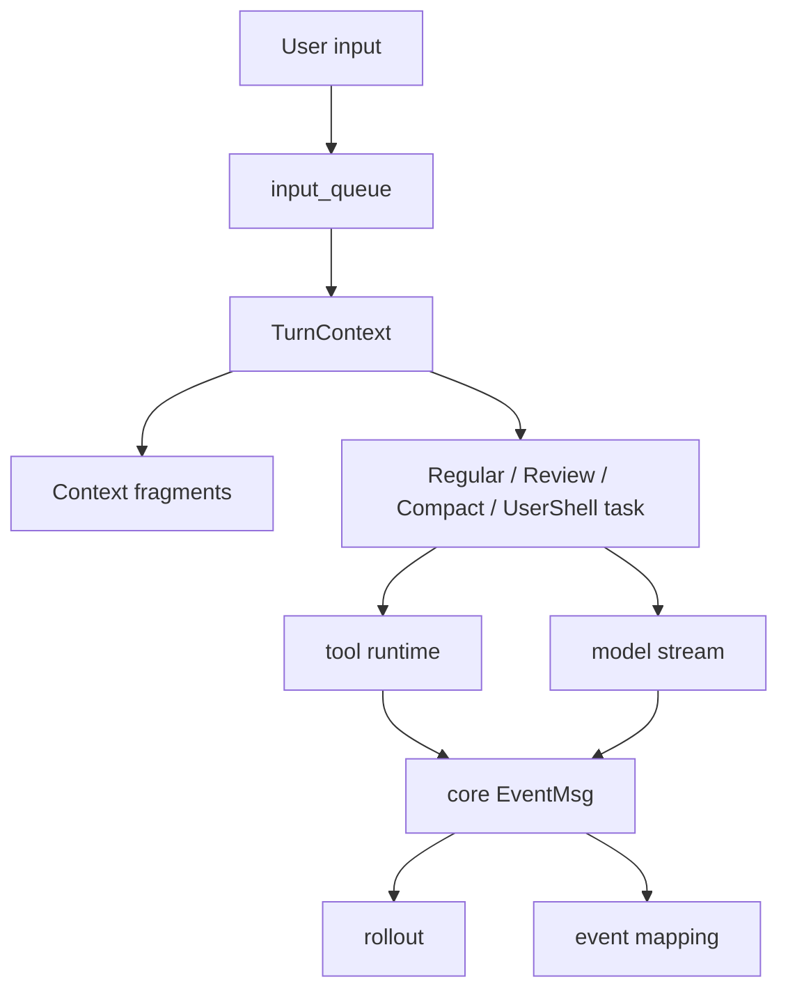

核心路径：

| 路径 | 作用 |
| --- | --- |
| `core/src/session/session.rs` | session 主体 |
| `core/src/session/turn.rs` | turn 执行 |
| `core/src/session/turn_context.rs` | turn 级配置、上下文、权限、模型 |
| `core/src/session/input_queue.rs` | 输入队列 |
| `core/src/tasks/*` | regular / compact / review / user_shell task |
| `core/src/context_window.rs`、`token_budget.rs` | context window 和 token budget |
| `core/src/compact*` | compaction |

这层是 Codex Agent 真正运行的地方。App Server 是外壳，Protocol 是契约，Core session 是执行内核。

## 8. Event Materialization 层

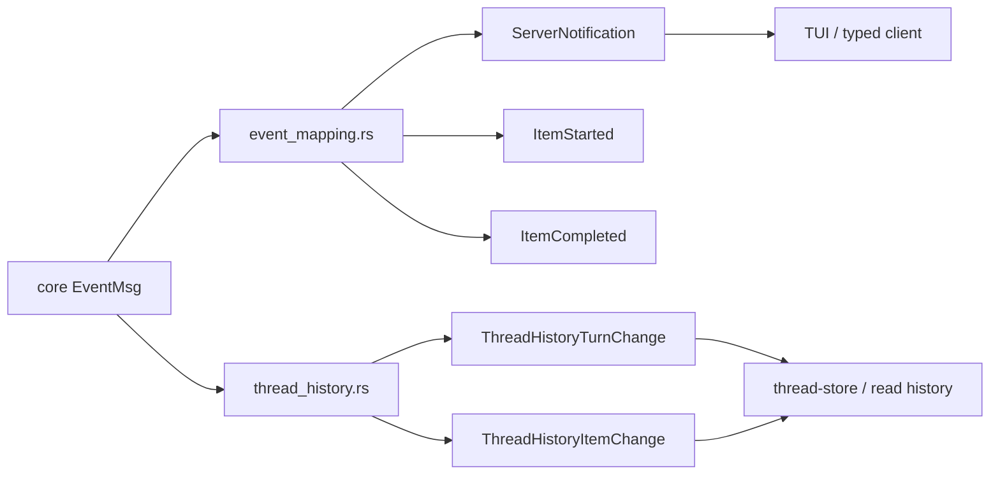

关键设计：

| 设计 | 含义 |
| --- | --- |
| one-to-one event mapping | 简单 core event 直接投影为 notification |
| item builders | command / patch 等 legacy 或 core event 可 materialize 成 ThreadItem |
| ThreadHistoryChangeSet | 增量记录 changed_items / changed_turns / removed_turn_ids |
| coalescing | 同一 item/turn 多次变化保留最终快照，但保留首次顺序 |
| active turn tracking | `thread_state.rs` 跟踪 active turn，terminal 后记录 `last_terminal_turn_id` |

这是 Codex 事件系统的关键：运行时事件、UI 通知、持久化历史不是三套语言，而是围绕 Thread / Turn / Item materialize。

## 9. Tool / Approval / Sandbox 层

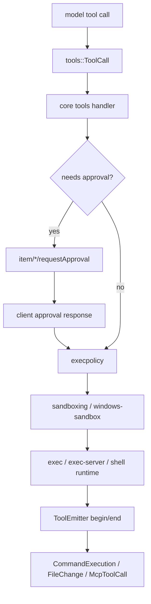

核心路径：

| 路径 | 作用 |
| --- | --- |
| `tools/src/tool_call.rs` | ToolCall，携带 turn_id、call_id、tool_name、model、truncation、conversation_history、environment、emitter |
| `tools/src/tool_definition.rs`、`tool_spec.rs` | 工具定义和 schema |
| `core/src/tools/handlers/*` | shell / apply patch / MCP / web / plugin install 等 handler |
| `core/src/tools/events.rs` | ToolEmitter 结构化事件 |
| `core/src/exec_policy.rs`、`execpolicy` | approval requirement 判断 |
| `sandboxing`、`windows-sandbox-rs` | 平台沙箱 |
| `exec-server`、`exec`、`process-hardening` | 进程执行和隔离 |
| `codex-mcp`、`rmcp-client` | MCP 工具链 |

关键结论：

1. approval 是 runtime 控制面，不是 UI 文案。
2. sandbox policy 和 approval policy 分层。
3. tool output 有 truncation policy，不能无限进模型上下文。
4. 工具生命周期最终进入 ThreadItem，而不是独立 UI 特例。

## 10. Context / Token / Compaction 层

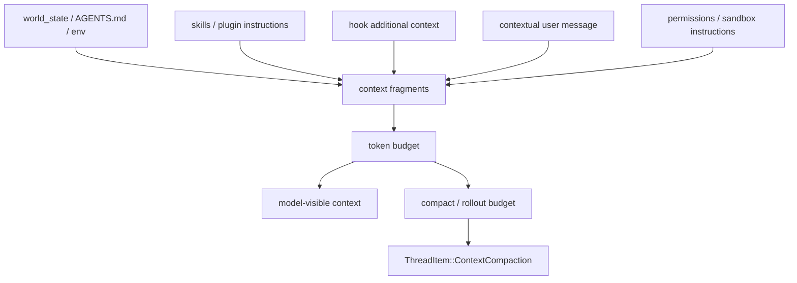

核心路径：

| 路径 | 作用 |
| --- | --- |
| `core/src/context/*` | 各类 context fragment |
| `context-fragments` | fragment 基础类型 |
| `core/src/context/world_state/*` | 环境、AGENTS.md、world state |
| `core/src/context_manager/*` | history / normalize / update |
| `core/src/session/token_budget.rs` | token budget |
| `core/src/compact*.rs` | compaction |
| `core/src/context/rollout_budget.rs` | rollout budget context |

Codex 的 context 不是字符串拼接，而是 fragment system。每类上下文都有来源、插入时机和预算约束。

## 11. Persistence / Replay / Trace 层

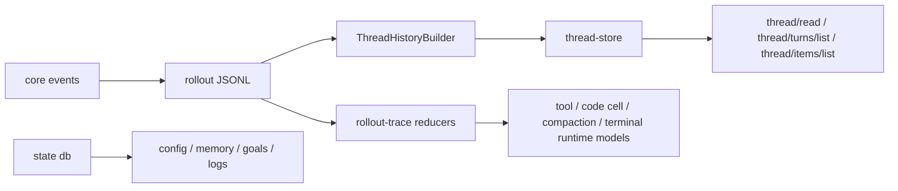

核心路径：

| 路径 | 作用 |
| --- | --- |
| `rollout` | 原始事件持久化 |
| `thread-store` | thread history 读取 |
| `message-history` | 消息历史 |
| `state` | sqlite state、goals、memory、logs 等迁移 |
| `rollout-trace` | 从 rollout 还原 runtime/debug graph |
| `core/src/session/rollout_reconstruction.rs` | session rollout 重建 |

`rollout-trace` 证明 Codex 不只关心 chat transcript。它把 tool call、code cell、terminal、compaction、MCP、agent graph 等 runtime 对象从 rollout 中还原出来。

## 12. Plugin / Skills / MCP 层

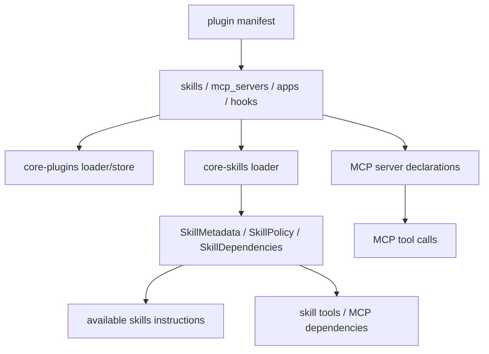

核心路径：

| 路径 | 作用 |
| --- | --- |
| `plugin/src/manifest.rs` | plugin manifest 数据结构 |
| `core-plugins/src/*` | marketplace、store、loader、provider |
| `skills/src/*` | skill assets |
| `core-skills/src/model.rs` | SkillMetadata、SkillPolicy、SkillDependencies |
| `ext/skills` | extension skill provider |
| `codex-mcp`、`rmcp-client` | MCP transport / tool |
| `hooks` | hook system |

Plugin / Skills 的关键不是“菜单”，而是让 runtime 能发现能力、读取技能文本、注入 context、暴露工具、连接 MCP，并且有 scope / policy / product gating。

## 13. TUI Facade / Projection 层

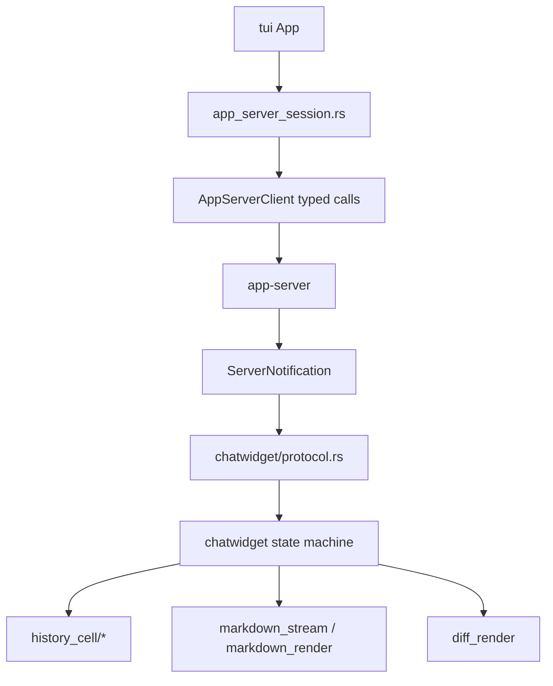

核心路径：

| 路径 | 作用 |
| --- | --- |
| `tui/src/app_server_session.rs` | typed JSON-RPC facade；避免 App / ChatWidget 拼 request |
| `tui/src/chatwidget/protocol.rs` | ServerNotification 到 ChatWidget 方法的路由 |
| `tui/src/chatwidget/*` | turn lifecycle、tool lifecycle、streaming、permissions、plugins、skills、status |
| `tui/src/history_cell/*` | ThreadItem 渲染单元 |
| `tui/src/markdown_stream.rs` | streaming markdown |
| `tui/src/diff_render.rs` | diff render |

Codex TUI 有两面：

1. `app_server_session.rs` 是强参考：UI facade typed 化，主 UI 不拼协议。
2. `chatwidget.rs` 是反面教材和经验源：状态机丰富但文件巨大，Lime 不能照搬组件形态。

## 14. Realtime / Media / Collaboration 层

| 能力 | Codex 路径 | 架构归属 |
| --- | --- | --- |
| realtime audio/text | `app-server-protocol/src/protocol/v2/realtime.rs`、`core/src/realtime_*` | Thread 级 realtime notification 和 item |
| image generation | `ext/image-generation`、`core/src/context/image_generation_instructions.rs`、`ThreadItem::ImageGeneration` | 工具 / item / context |
| image view | `ThreadItem::ImageView`、`core/src/image_preparation.rs` | item projection |
| collab agent | `core/src/agent/*`、`ThreadItem::CollabAgentToolCall`、`SubAgentActivity` | multi-agent / subagent thread tree |
| code mode | `code-mode*`、`rollout-trace/src/model/runtime.rs` | runtime graph，不只是 transcript |

这层对 Lime 的启发是：多模态和多 Agent 也必须回到 Thread / Turn / Item，而不是在 UI 或 provider adapter 上开旁路。

## 15. Quality / Fixture 层

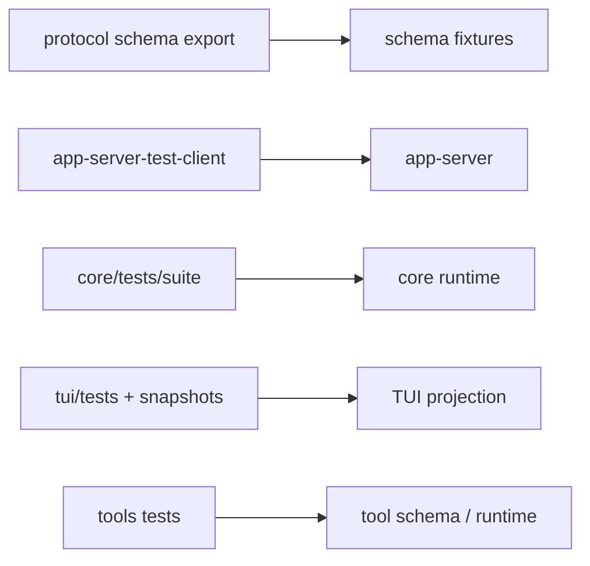

核心路径：

| 路径 | 作用 |
| --- | --- |
| `app-server-test-client` | 启动 app-server、握手、发 typed requests、处理 approvals |
| `app-server-protocol/src/schema_fixtures.rs` | schema fixture |
| `core/tests/suite/*` | Agent 行为、exec、plugins、skills、turn_state、rollout budget |
| `tui/tests`、`tui/src/chatwidget/snapshots/*` | UI snapshot 和交互回归 |
| `tools/tests/*` | tool schema policy |
| `app-server/src/*_tests.rs` | processor / tracing / thread processor 回归 |

Codex 的质量体系不是单测堆叠，而是：

```text
protocol schema 防契约漂移
  + app-server-test-client 防 integration 断裂
  + core suite 防 Agent 行为退化
  + TUI snapshot 防 projection 回归
  + tool tests 防 schema / policy 漂移
```

## 16. 典型主链时序

### 16.1 新建 Thread 并启动 Turn

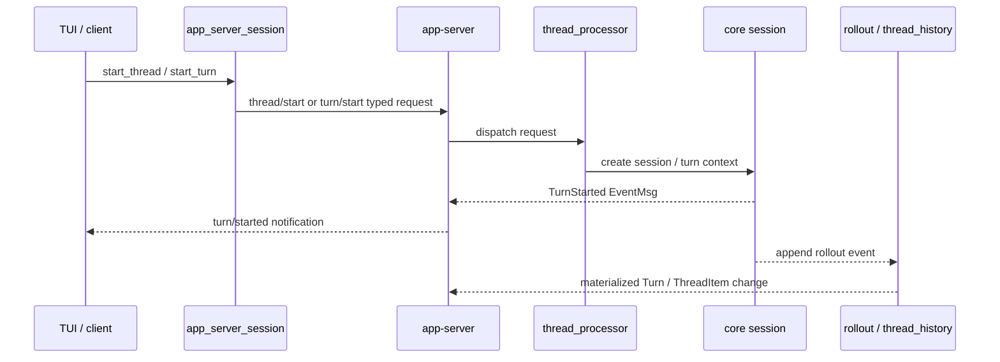

### 16.2 Model stream 到 UI

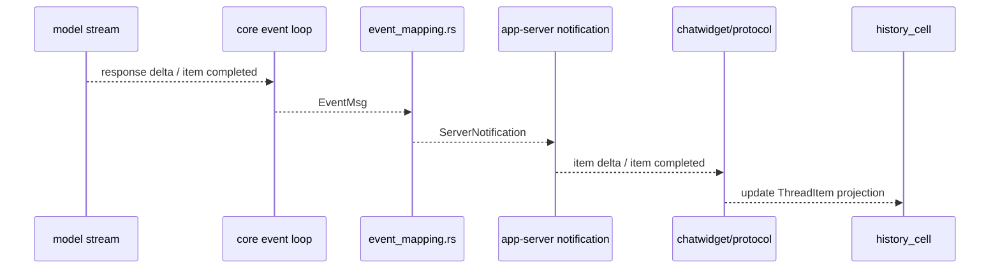

### 16.3 Tool call / approval / sandbox

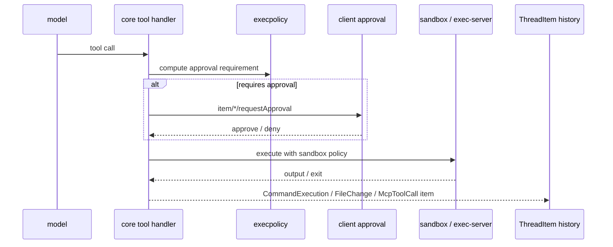

### 16.4 Resume / replay

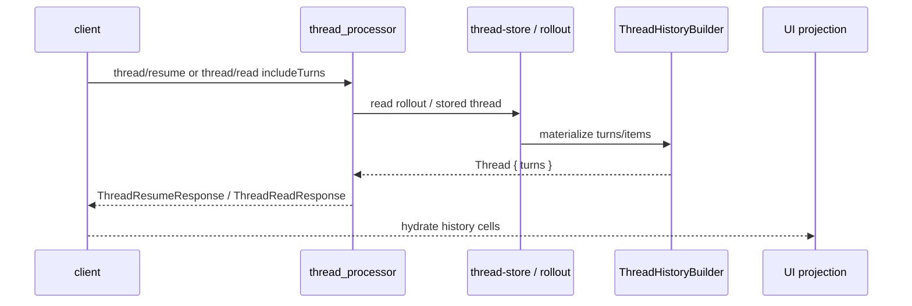

## 17. Lime 阅读视角

这份图谱不是要求 Lime 复制 Codex 目录结构，而是要求 Lime 对齐这些核心原则：

| Codex 核心 | Lime 应落点 | 对齐要求 |
| --- | --- | --- |
| Thread / Turn / Item | `agentSession/*`、turn execution、Timeline/Workbench projection | 新设计使用 Codex 短名；`agentSession/*` 只是现有协议名 |
| Protocol registry / typed client | `app-server-protocol v0`、`packages/app-server-client`、`src/lib/api/*` | method、schema、client、API gateway 成组演进 |
| Serialization scope | App Server processor / request gate | 新增请求要说明并发和资源范围 |
| App Server processor | `lime-rs/crates/app-server/src/processor/*` | processor 薄分发，runtime/domain 承接实现 |
| Core session runtime | `RuntimeCore / agent / services` | turn/context/tool/evidence 不进 Electron |
| Event materialization | `runtime/projection_*`、`packages/agent-runtime-projection` | provider / runtime event 先 materialize，再进 UI |
| Tool / approval / sandbox | `tool-runtime`、`agent/src/*tool*`、Desktop Host permission | approval 是结构化 action，桌面权限另分层 |
| Context fragments | `turn_input_envelope.rs`、`protocol_context_projection.rs`、memory prompt | 高容量内容进 sidecar/evidence，模型只看 bounded fragment |
| Rollout / state / history | `ProjectionStore`、`EventLogWriter`、`SidecarStore`、Evidence/export | Codex import 只作 source，Lime read model 是 truth |
| TUI facade | `src/lib/api/*`、front-end runtime hooks | React 组件不拼协议，不直接 safeInvoke 业务命令 |
| Plugin / Skills | Lime plugin packages、skills、app center | manifest / skill / runtime binding / UI 安装分层 |
| Quality fixture | `test:contracts`、Rust related、GUI smoke、current fixture | 协议、runtime、GUI 三类证据都要有 |

## 18. 对 Lime 的最关键架构命题

1. 不要把 Codex 简化成 App Server。
2. 不要把 Codex 简化成 TUI。
3. 不要只抄 `Thread / Turn / Item` 名字，要抄它们背后的 materialization、history、projection、replay 关系。
4. 不要让 provider wire event、mock fallback 或 React local state 绕过 Thread / Turn / Item。
5. 不要让协议新增停留在 Rust 一侧；schema、client、frontend API、contract 必须一起变。
6. 不要让工具输出、媒体、导入历史无界进入模型上下文；Codex 的 context fragment 和 truncation policy 是 token 成本控制核心。
7. 不要复制 Codex TUI 组件形态；应吸收 `app_server_session` facade 和 structured notification 消费方式。
8. 不要把 Codex rollout 当 Lime runtime store；应导入到 Lime current read model。
9. 不要把 plugin/skills 当 UI 菜单；它是 runtime capability、context injection 和 tool discovery 的系统。
10. 不要只跑 lint/typecheck；Codex 级别的对齐需要 protocol、runtime、fixture、GUI projection 多层证据。
