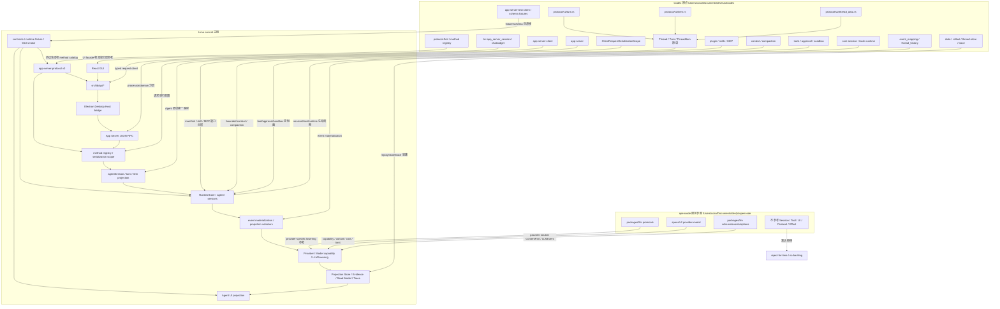
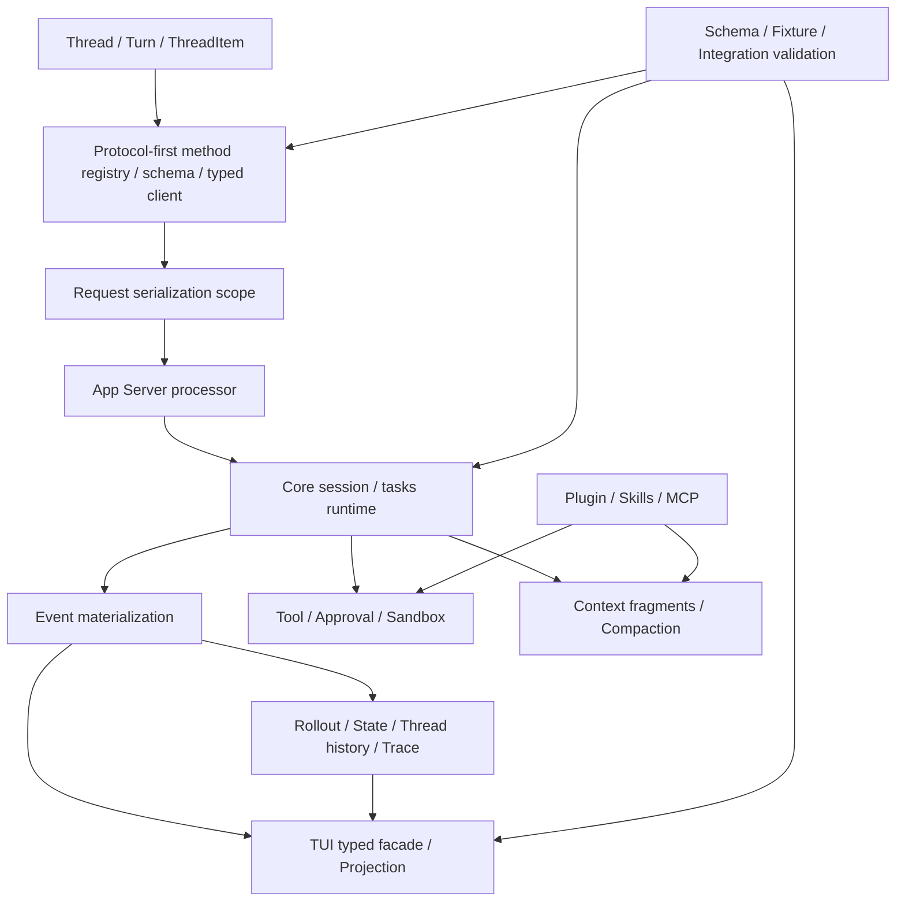
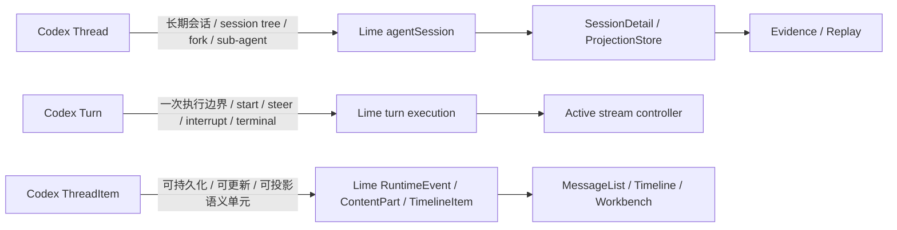
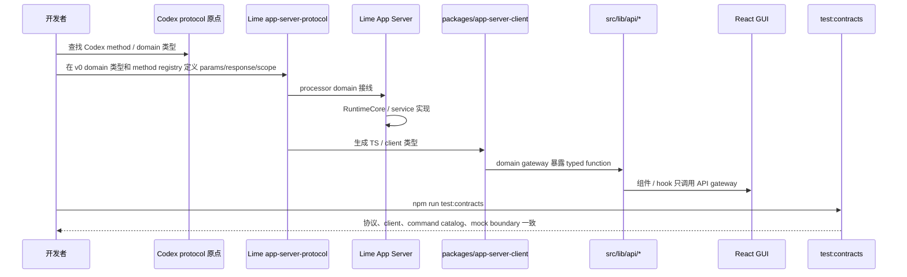
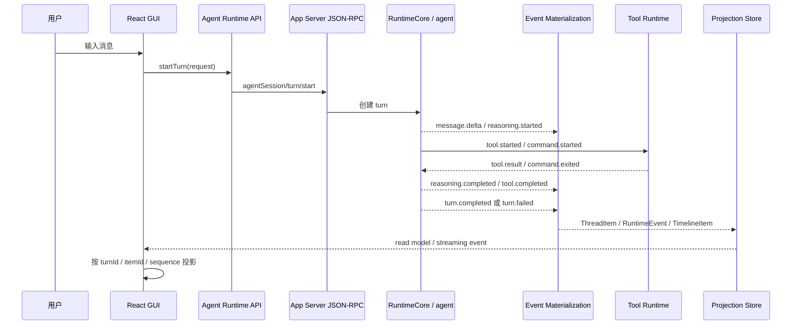
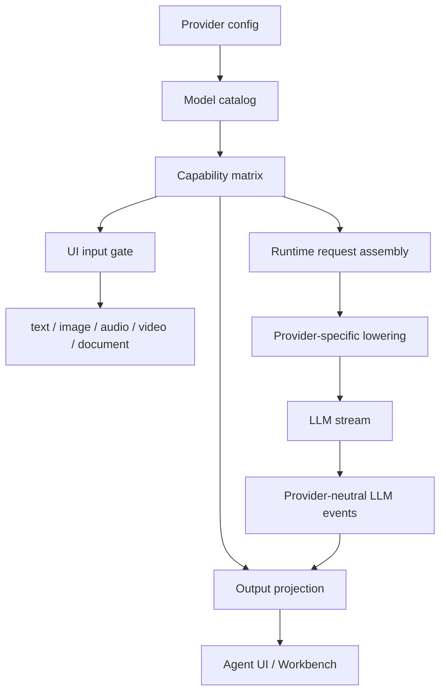
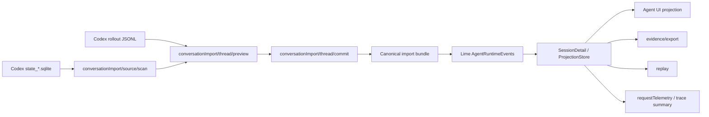
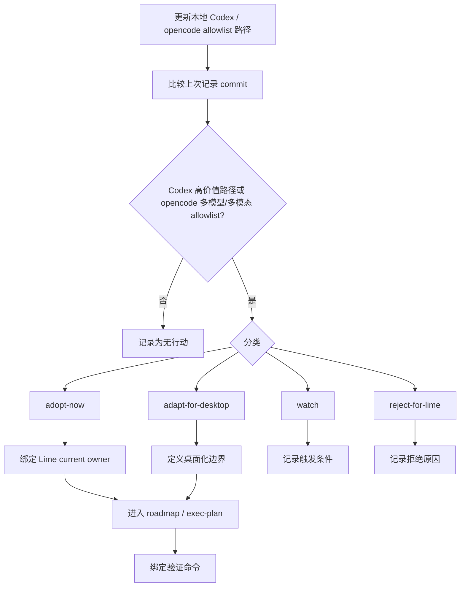
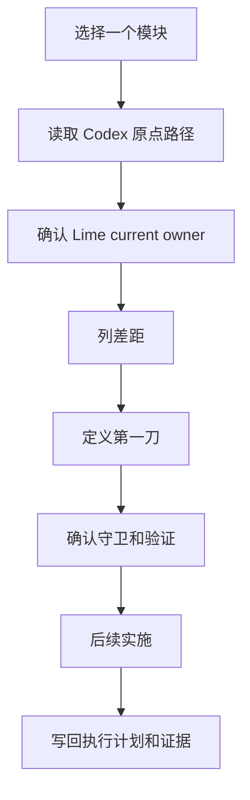

# 图纸：Codex 主原点 + opencode 多模型/多模态参照到 Lime current 主链

> 状态：current research baseline
> 更新时间：2026-07-05
> Lime current-state 基线：[lime-current-state.md](./lime-current-state.md)

## 1. 总体架构图

本文件画的是参考源到目标主链的图纸。Lime 当前真实架构、现有主链和缺口图见 [lime-current-state.md](./lime-current-state.md)，不要用本文件替代现状判断。



固定规则：

1. Codex 的第一参考不是 UI，也不是 crate 目录，而是 `Thread -> Turn -> Item`；Codex Rust 类型名是 `ThreadItem`。
2. App Server、protocol、typed client、TUI facade、state/rollout 都围绕这组三元原语服务。
3. Lime 现有 `agentSession` 是协议现状名；新设计使用 `Thread`，语义必须同构到 `Thread -> Turn -> Item`。
4. Agent 改动进入工程前，先按 [thread-turn-item-invariant.md](./thread-turn-item-invariant.md) 填 Thread、Turn、Item 归属。

## 2. Codex 核心体系分层图



固定规则：

1. `Thread / Turn / ThreadItem` 是第一原语，但不是唯一核心。
2. Protocol-first、serialization scope、runtime、event materialization、tool/context/state/plugin/fixture 必须成组看。
3. Lime 对齐时先找核心层，再找 Lime current owner。

## 3. Codex 原语映射图



固定规则：

1. 每个 Agent 事件先定位到 session/thread，再定位 turn，再定位 item。
2. UI 不根据正文文本猜 lifecycle；UI 只消费 item projection。
3. Evidence / Replay 消费 Lime current read model，不消费 Codex 原始 rollout。

## 4. 新增 JSON-RPC method 时序图



## 5. Agent turn streaming 时序图



固定规则：

1. UI 不用自然语言正文判断终态。
2. `turn.completed` 是结构化终态，不用 timeout 合成。
3. stale terminal event 不能误停新的 active stream。

## 6. 前端 timeline projection 流程图

```mermaid
flowchart TD
    Event[Runtime event / read model item] --> Normalize[normalize by sessionId / turnId / itemId / sequence]
    Normalize --> Classify{event kind}

    Classify -->|message| MessagePart[ContentPart.message]
    Classify -->|media| MediaPart[ContentPart.media]
    Classify -->|reasoning| ReasoningPart[ContentPart.reasoning]
    Classify -->|tool / command| ToolPart[ContentPart.process]
    Classify -->|artifact| ArtifactPart[ContentPart.artifact]
    Classify -->|approval| ApprovalPart[ContentPart.action]
    Classify -->|failure| FailurePart[ContentPart.failure]

    MessagePart --> Timeline[TimelineItem[]]
    MediaPart --> Timeline
    ReasoningPart --> Timeline
    ToolPart --> Timeline
    ArtifactPart --> Timeline
    ApprovalPart --> Timeline
    FailurePart --> Timeline

    Timeline --> MessageList[MessageList]
    Timeline --> AgentThreadTimeline[AgentThreadTimeline]
    Timeline --> Workspace[AgentChatWorkspace]
    Timeline --> Workbench[Canvas / Artifact Workbench]
```

## 7. 多模型 / 多模态能力矩阵流程图



固定规则：

1. UI 根据 capability 决定附件、工具和输出模式。
2. provider-specific body 只在 lowering 层生成。

## 8. Codex import 主链流程图



固定规则：

1. Codex 原始文件只读。
2. 不写回 Codex。
3. 不把 rollout JSONL 当 Lime runtime truth。
4. 导入结果进入 Lime current read model。

## 9. 上游 diff 进入 Lime backlog 流程图



固定规则：

1. Codex diff 按 app-server / protocol / turn / tool / context / state / TUI facade 等高价值路径过滤。
2. opencode diff 只看 `specs/v2/provider-model.md`、`packages/llm/src/schema/*`、`packages/llm/src/protocols/*`、`packages/core/src/provider.ts`、`packages/core/src/model.ts`。
3. opencode Session、Tool、UI、protocol generated client、Effect / Bun runtime 变化不进入 Lime backlog，最多记录为 `reject-for-lime`。

## 10. 模块推进流程图


