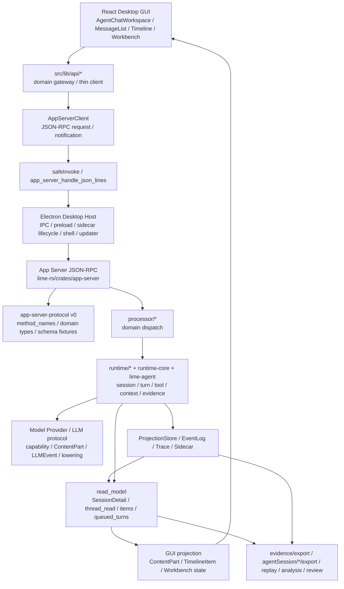
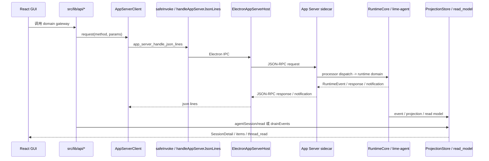
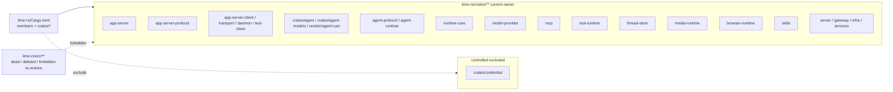
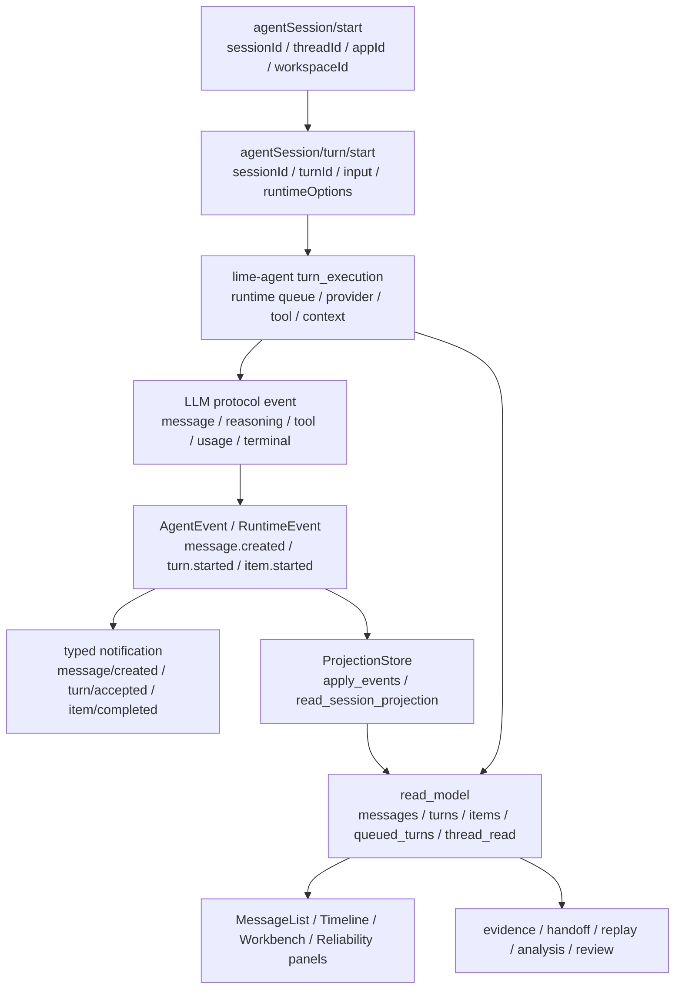
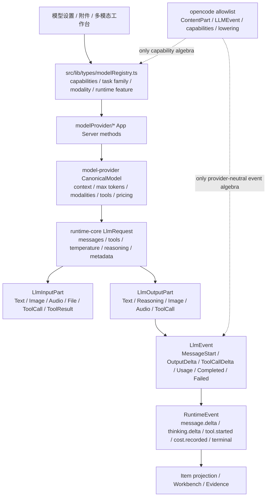

# Lime 现状架构：current 主链、事实源与 Codex 对齐缺口

> 状态：current research baseline
> 更新时间：2026-07-05
> 适用范围：Codex 原点式快速对齐 v1
> 文档定位：Lime 当前真实架构现状，不是目标架构，不是实施方案，不替代 [architecture.md](./architecture.md)

## 1. 阅读结论

这份文档只回答一个问题：Lime 现在实际长什么样，以及哪些现状必须向 Codex 的核心体系对齐。

结论如下：

1. Lime current 主链已经从旧 Tauri wrapper 收敛到 `React GUI -> src/lib/api/* -> AppServerClient / safeInvoke -> Electron Desktop Host -> App Server JSON-RPC -> lime-rs/crates/** -> read model / projection -> GUI`。
2. `lime-rs/src/**` 当前不存在，已属于 `dead / deleted / forbidden-to-restore`；Rust current owner 是 `lime-rs/crates/**`。
3. Lime 已有与 Codex `Thread / Turn / Item` 同构的基础：`agentSession`、`turn`、runtime event、ProjectionStore、read model、Timeline / MessageList / Workbench，但这些概念还没有被统一命名成第一原语。
4. App Server protocol 已经是 current 事实源，但 method name、params/response、schema fixture、dispatch、request serialization scope 仍然分散；这是和 Codex protocol-first 最大的结构差距。
5. Lime 已经有 event materialization/projection 链：`LLMEvent -> RuntimeEvent -> read_model items -> GUI projection`，但边界命名不够硬，前端仍有 Workspace 巨型编排风险。
6. Lime 是多模型、多模态桌面产品，不能只按 Codex 的 OpenAI-heavy 能力表达裁决；Provider / Model / ContentPart / LLMEvent / provider lowering 层只参考 opencode。
7. opencode 不参与 Lime 的 Session、Tool runtime、UI、协议治理或 App Server 架构；只作为多模型、多模态能力代数参照。
8. 当前最高风险不是“没有主链”，而是主链各层没有被 Codex 式原语、method definition、serialization scope、projection boundary 和 fixture 机制封住，后续新增功能容易再次扩散。

## 2. 事实源声明

本文件以仓库当前代码为事实源，阅读口径如下：

| 类别 | 事实源 |
| --- | --- |
| 仓库治理 | `AGENTS.md`、`internal/aiprompts/governance.md`、`internal/aiprompts/commands.md`、`internal/aiprompts/state-history-telemetry.md` |
| Rust workspace | `lime-rs/Cargo.toml`、`lime-rs/crates/**` |
| App Server protocol | `lime-rs/crates/app-server-protocol/src/protocol/v0/**`、`schema_export.rs`、`schema_export/registry.rs`、`schema_fixtures.rs` |
| App Server runtime | `lime-rs/crates/app-server/src/processor/**`、`lime-rs/crates/app-server/src/runtime/**` |
| Agent runtime | `lime-rs/crates/agent/src/**`、`lime-rs/crates/runtime-core/src/**` |
| 多模型 / 多模态 | `lime-rs/crates/model-provider/**`、`src/lib/types/modelRegistry.ts`、`runtime-core/src/llm_protocol/**` |
| Frontend / Desktop Host | `src/lib/api/**`、`src/lib/dev-bridge/**`、`electron/**`、`src/components/agent/chat/**` |
| Codex 对照 | `/Users/coso/Documents/dev/rust/codex/codex-rs` |
| opencode 对照 | `/Users/coso/Documents/dev/js/opencode`，仅限 Provider / Model / ContentPart / LLMEvent / provider lowering |

硬约束：

```text
本文件描述现状，不替代目标架构。
目标架构以 architecture.md 为北极星。
Codex 是 Agent 工程主原点。
opencode 只用于多模型 / 多模态能力表达。
lime-rs/src/** 不得恢复。
```

## 3. Lime Current 总体架构图



现状判断：

| 层 | 当前事实 | Codex 对齐缺口 |
| --- | --- | --- |
| GUI | 真实桌面工作台已经存在，MessageList / Timeline / Workbench 消费 read model | Workspace 编排仍过大，组件不能继续承接 runtime semantics |
| API gateway | `src/lib/api/*` 与 `src/lib/api/agentRuntime/*` 已经成为主入口 | 需要继续阻止页面和普通 Hook 绕过 gateway 直接拼协议 |
| Desktop Host | Electron 负责 IPC、sidecar、窗口、updater、桌面壳能力 | 必须持续防止 Electron 变成第二后端 |
| App Server | JSON-RPC 是后端 current 入口 | method definition、scope、schema、dispatch 需要更集中 |
| Runtime | `runtime/*`、`runtime-core`、`lime-agent` 承接 turn/tool/context/model | 需要继续把 Agent details 收缩到 agent/runtime adapter 边界 |
| Projection | ProjectionStore / read_model 已形成读模型 | 需要把 `Item` 作为第一语义，而不是组件临时 shape |
| Evidence | evidence / handoff / replay / analysis / review 已经走 App Server export | 需要持续绑定 session/thread/turn/item 和 request telemetry |

## 4. Desktop Host 到 App Server 主链



代码证据：

| 路径 | 事实 |
| --- | --- |
| `src/lib/api/appServerClient.ts` | `request(method, params)` 生成 JSON-RPC request，走 `handleAppServerJsonLines`，并安装 App Server client methods |
| `src/lib/dev-bridge/safeInvoke.ts` | 文件注释明确 current 主链是 `前端 -> Electron IPC -> App Server JSON-RPC -> RuntimeCore / backend`，HTTP Bridge 仅作诊断且失败不回退 mock |
| `electron/appServerHost.ts` | `app_server_handle_json_lines` 代理 JSON-RPC 到 sidecar，并对 `agentSession/turn/start` 做 streaming turn start 特判 |
| `electron/ipcChannels.test.ts` | `app_server_handle_json_lines` 是 Electron Host command；`agent_runtime_*` 不属于 Electron Host command |
| `src/lib/dev-bridge/commandPolicy.ts` | `app_server_handle_json_lines` 是 current bridge truth；旧命令只允许受控 fail-closed / test guard |

## 5. Rust Workspace 现状图



当前 workspace 事实：

| 分类 | 路径 / crate | 判断 |
| --- | --- | --- |
| `current` | `lime-rs/crates/app-server` | App Server JSON-RPC 后端事实源 |
| `current` | `lime-rs/crates/app-server-protocol` | protocol v0、domain types、method names、schema fixtures |
| `current` | `lime-rs/crates/app-server-client`、`app-server-transport`、`app-server-daemon`、`app-server-test-client` | client / sidecar / test client 链 |
| `current` | `lime-rs/crates/agent`、`agent-protocol`、`agent-runtime` | Agent runtime、turn execution、tool、context、projection adapter |
| `current` | `lime-rs/crates/runtime-core` | provider-neutral LLM protocol、runtime primitives |
| `current` | `model-provider`、`mcp`、`tool-runtime`、`thread-store`、`media-runtime`、`browser-runtime`、`skills` | 多模型、工具、线程、媒体、浏览器、技能领域 owner |
| `compat / controlled adapter` | `vendor/agent-rust`、workspace dependency `agent` | 受控 runtime adapter，不是新业务 owner |
| `dead / deleted / forbidden-to-restore` | `lime-rs/src/**`、`lime-rs/src/commands/**` | 当前文件系统不存在，不得恢复旧 Tauri wrapper |

体量风险：

| 文件 | 当前行数 | 现状判断 |
| --- | ---: | --- |
| `lime-rs/crates/app-server/src/processor/dispatch.rs` | 692 | 接近 800 行预警，后续只应薄 dispatch |
| `lime-rs/crates/app-server/src/runtime.rs` | 693 | 接近 800 行预警，新增逻辑应进 `runtime/**` 子模块 |
| `src/components/agent/chat/AgentChatWorkspace.tsx` | 6172 | 严重超过 1000 行，是 UI orchestration 最大治理风险 |
| `src/components/agent/chat/components/AgentThreadReliabilityPanel.tsx` | 970 | 接近 1000 行，新增逻辑需优先抽 selector / ViewModel |
| `src/components/agent/chat/components/AgentThreadTimeline.tsx` | 521 | 可控，但不得承接 runtime semantics |
| `src/components/agent/chat/components/MessageList.tsx` | 459 | 可控，应只消费 projection |
| `src/components/agent/chat/components/HarnessStatusPanel.tsx` | 546 | 可控，但 evidence / replay 语义应来自 read model |

## 6. Agent Session / Turn / Item 现状图



Lime 与 Codex 原语的现状映射：

| Codex 原语 | Codex 语义 | Lime 当前对应 | 当前成熟度 | 对齐缺口 |
| --- | --- | --- | --- | --- |
| `Thread` | 长期会话、session tree、恢复、fork、history owner | `agentSession`、`thread_id`、`SessionDetail`、ProjectionStore、Evidence/export | 已有同构基础 | 文档和守卫没有把它作为第一原语；容易退化成前端 chat id |
| `Turn` | 一次用户输入驱动的执行边界，支持 start / steer / interrupt / terminal | `agentSession/turn/start`、`turn_id`、`turn_execution.rs`、active stream controller、queued turns | 已有 current 主链 | terminal、queue、resume、cancel-then-continue 需要持续用结构化事件证明 |
| `Item` | turn 内最小可持久化、可更新、可投影语义单元 | `AgentEvent`、typed notification、`thread_item_projection`、`tool_item_projection`、read model `items` | 已有投影链 | `Item` 没有成为跨 runtime/UI/evidence 的统一命名，组件仍可能自造 shape |

关键代码事实：

| 路径 | 当前事实 |
| --- | --- |
| `app-server-protocol/src/protocol/v0/agent_session.rs` | `AgentSessionStartParams` 含 `session_id / thread_id / app_id / workspace_id / business_object_ref / locale` |
| `app-server-protocol/src/protocol/v0/agent_session.rs` | `AgentSessionTurnStartParams` 含 `session_id / turn_id / input / runtime_options / queue_if_busy / skip_pre_submit_resume` |
| `app-server-protocol/src/protocol/v0/agent_session.rs` | typed notification 覆盖 `message/created`、`turn/accepted`、`turn/started`、`turn/completed`、`item/agentMessage/delta`、`item/started`、`item/completed` |
| `app-server/src/runtime/read_model.rs` | `runtime_session_read_detail_with_options` 组装 `messages / turns / items / queued_turns / artifacts / outputs / thread_read / article_workspace` |
| `app-server/src/runtime/read_model.rs` | `items` 来源包括 `thread_item_projection`、`tool_item_projection`、`file_checkpoint_projection`、warning/error items |
| `app-server/src/runtime/projection_store.rs` | `ProjectionStore` 是 sqlite projection DB，支持 `apply_events`、`repair_session`、`read_session_projection` |
| `app-server/src/runtime/projection_store.rs` | `ProjectionReadSession` 含 `session / turns / item_count / messages_count / messages / item_events / last_event_sequence` |
| `agent/src/protocol_projection.rs` | 注释明确旧 `event_converter` 只保留 compat converter 语义，current 入口是 `project_turn_runtime` / `project_item_runtime` |

## 7. 多模型 / 多模态现状图



当前事实：

| 层 | Lime 当前 | opencode 只参考什么 |
| --- | --- | --- |
| Rust canonical model | `CanonicalModel` 含 `id / name / context_length / max_completion_tokens / input_modalities / output_modalities / supports_tools / pricing` | 参考 `capabilities / variants / cost / limit` 的结构表达 |
| App Server model policy DTO | `ModelInfo` 真字段正在按 Codex `ModelInfo` 分层接入 `execution/context/picker/tool-call/reasoning/reasoning-output/input-modality/responses/truncation/native-tool` policy owner | opencode 不参与 request policy owner；只在 input modality 词表上提供多模态参照 |
| Frontend model registry | `ModelCapabilities` 含 vision/tools/streaming/json/function/reasoning；`ModelTaskFamily` 含 chat、reasoning、vision、image、speech、embedding 等；`ModelModality` 含 text/image/audio/video/file/embedding/json | 参考 capability 粒度和前后端统一字段，不参考 opencode UI |
| Runtime LLM protocol | `LlmInputPart` 支持 Text/Image/Audio/File/ToolCall/ToolResult；`LlmOutputPart` 支持 Text/Reasoning/Image/Audio/ToolCall；`LlmEvent` 支持 MessageStart/OutputDelta/ToolCallDelta/Usage/Completed/Failed | 参考 `ContentPart`、LLM event、usage/cost、provider lowering |
| Provider lowering | `ProviderWireRequest` 已有 `protocol / method / path / body` | 参考 opencode 的集中 lowering 边界，避免 provider wire body 泄漏到 GUI/API gateway |

现状差距：

| 差距 | 影响 | 对齐方向 |
| --- | --- | --- |
| Rust `CanonicalModel` 比前端能力矩阵薄 | GUI capability gate 和 runtime assembly 可能不一致 | 建统一 provider/model capability map，覆盖 input/output/tools/reasoning/cache/media/cost/limit/variant |
| Codex `ModelInfo` 真字段尚未全部贯通协议 / generated TS / registry projection | request policy 容易被 UI、summary、runtime feature 或 provider 字符串旁路推断 | 只经各 policy owner 接线：execution/context/picker/tool-call/reasoning/reasoning-output/input-modality/responses/truncation/native-tool |
| `LlmEvent` 使用 token 字段较粗 | cost、cache、reasoning usage 难以细分 | 参考 opencode usage breakdown，但落入 Lime runtime-core 类型 |
| provider lowering 边界还没有在文档中变成强约束 | 容易让 UI/API 拼 provider body | 明确 GUI/API 只传 provider-neutral request，wire shape 只在 lowering owner 出现 |
| 多模态 Workbench 与 Agent item 的关系需要继续收紧 | 图片、音频、视频、文档结果可能分叉成 task/artifact/UI 三套状态 | media input/output 先变成 ContentPart/reference，再 materialize 到 item/projection/evidence |

## 8. Current / Compat / Deprecated / Dead 分类

| 分类 | 路径 / 能力 | 当前判断 |
| --- | --- | --- |
| `current` | `lime-rs/crates/**` | Rust 后端、runtime、protocol、domain owner |
| `current` | `lime-rs/crates/app-server-protocol/src/protocol/v0/**` | App Server JSON-RPC v0 是当前协议，不为对齐 Codex 改名 |
| `current` | `packages/app-server-client`、`src/lib/api/*`、`src/lib/api/agentRuntime/*` | 前端 typed gateway / thin client |
| `current` | `electron/**` | Desktop Host，负责 IPC、preload、窗口、updater、sidecar、本地壳能力 |
| `current` | `src/lib/dev-bridge/safeInvoke.ts`、`http-client.ts`、`app_server_handle_json_lines` | renderer 到 App Server JSON-RPC 的 current bridge |
| `current` | `ProjectionStore`、`read_model`、`evidence_provider`、`exports`、`trace_store` | Session / thread / turn / item read model 和导出事实源 |
| `current` | `runtime-core/src/llm_protocol/**`、`model-provider`、`modelProvider/*` | 多模型 / 多模态 runtime 事实源 |
| `compat / controlled residual` | `src/lib/api/agentRuntime.ts` | 外部业务模块进入分域 client 的 compat barrel |
| `compat / controlled residual` | `src/lib/dev-bridge/commandPolicy.ts` 中 legacy command policy | 只允许 fail closed、迁移记录、负向 guard，不承接业务事实 |
| `compat / controlled residual` | Agent vendor dependency / App Server runtime adapter | 只作为受控 adapter，不是新增业务 owner |
| `test-only / retired guard` | `agent_runtime_*` 字符串在 contract、negative tests、mock policy tests 中出现 | 只证明旧路未回流，不是 production truth |
| `dead / deleted / forbidden-to-restore` | `lime-rs/src/**`、`lime-rs/src/commands/**` | 当前文件系统不存在，不能恢复 bootstrap、runner、Tauri wrapper、stub 或 compat facade |
| `dead` | 旧 `agent_runtime_*` production command surface | 不得重新接回 Electron Host、App Server current、DevBridge truth、mock fallback |
| `dead` | 旧 Tauri command wrapper | 不得恢复到 `lime-rs/src/commands/**` |
| `dead` | 生产 mock fallback | `safeInvoke` / Electron Host / App Server / GUI smoke 不得通过 mock 假成功 |

## 9. Codex 核心体系 vs Lime 现状对齐矩阵

| Codex 核心体系 | Codex 事实 | Lime 当前事实 | 当前差距 | 需要对齐 |
| --- | --- | --- | --- | --- |
| `Thread / Turn / Item` | `protocol/v2/thread.rs`、`turn.rs`、`item.rs`、`thread_history.rs` | `agentSession`、`turn_execution`、ProjectionStore、read model items | 同构存在，但需要持续作为第一原语约束后续工程 | P1-1 已建立 [thread-turn-item-invariant.md](./thread-turn-item-invariant.md)，所有 Agent 改动先说明 Thread、Turn、Item 归属 |
| Protocol-first | Codex `common.rs` 用宏集中定义 request、response、scope、notification | Lime v0 domain 文件、`method_names.rs`、schema export、processor/client 分散 | 缺单一 method definition registry | P0：新增能力先走 method definition metadata，不一次性重命名协议 |
| Request serialization scope | Codex `ClientRequestSerializationScope` 覆盖 global/thread/process/fs-watch/mcp oauth | Lime 有 turn queue、processor、timeout profile，但无统一声明式 scope | 请求并发语义容易散落到 UI、client 或 runtime lock | P0：把 serialization scope 纳入 method metadata，先覆盖 turn/process/MCP/oauth/fs-watch 类 method |
| App Server processor | Codex app-server processor 薄分发到 domain | Lime `processor/*` 已分 domain，`dispatch.rs` 692 行 | 中心 dispatch 接近预警，仍需防回涨 | P1：processor 只接线，业务进入 `runtime/**` 或 domain crate |
| Core runtime | Codex `core/session`、`core/tasks` 承接 turn loop、tool、context | Lime `runtime/*`、`runtime-core`、`lime-agent` 已承接 | Agent details 和 App Server adapter 边界仍需持续收缩 | P1：新 runtime 逻辑先进 `lime-agent` / RuntimeCore / domain 子模块 |
| Event materialization | Codex `event_mapping.rs` 把 core event 变成 notification 和 ThreadItem | Lime `LlmEvent -> RuntimeEvent -> ProjectionStore/read_model -> GUI` 已存在 | materialization 命名和边界不够硬 | P0：固定 provider wire -> LLMEvent -> RuntimeEvent -> Item projection |
| Tool / approval / sandbox | Codex tool lifecycle 和 approval/sandbox 是控制面 | Lime `tool-runtime`、`agent/src/*tool*`、Desktop Host permission、action panels | Lime 工具更多，UI 展示容易膨胀 | P1：shell/MCP/web/patch/browser/artifact/approval 分 domain projection |
| Context / compaction | Codex bounded context fragment 和 compaction 是 runtime 能力 | Lime `turn_input_envelope`、memory prompt、context_compaction、sidecar/evidence | 多模态和 workspace metadata 易超预算 | P1：bounded fragment + sidecar/reference policy |
| Persistence / replay / trace | Codex rollout/state/thread-store/trace 可还原历史 | Lime ProjectionStore、EventLog、TraceStore、Evidence/export、replay | request telemetry 与 item/read model 关联要持续收紧 | P0：所有 export/replay/telemetry 回到 session/thread/turn/item |
| Plugin / skills / MCP | Codex manifest、skill metadata、MCP binding 分层 | Lime Plugin、skills、skill_registry、mcp crate、应用中心 | 桌面应用中心与 runtime skill 容易混语义 | P1：manifest / installed UI / skill metadata / MCP tool binding 四层分开 |
| UI facade / projection | Codex TUI 通过 facade 消费 app-server session | Lime React GUI 已有 API gateway 和 projection，但 Workspace 巨型 | 组件仍可能承接 runtime semantics | P0：UI 只消费 typed facade 和 projection，新逻辑进 hook/ViewModel/selector |
| Quality / fixture | Codex schema fixture、test client、core suite 防漂移 | Lime contract、runtime fixture、GUI smoke、Rust related tests | 文档阶段已经明确，工程阶段必须绑定验证 | P0：协议、runtime、GUI 三证据成组 |

## 10. 需要对齐 Codex 的事项

### P0：先封住主链语义

| 事项 | 当前 Lime 现状 | 第一刀 |
| --- | --- | --- |
| Primitive invariant | `agentSession / turn / items` 存在，已写入前置 invariant | 后续 Agent 改动必须按 [thread-turn-item-invariant.md](./thread-turn-item-invariant.md) 回答 Thread、Turn、Item 归属 |
| Method definition registry | method constants、domain type、schema、client、dispatch 分散 | 为新增 method 建 `method definition metadata`，至少含 method、params、response、notification、serialization scope |
| Request serialization scope | turn/process/MCP/oauth 等并发语义分散 | 先覆盖 `agentSession/turn/start`、execution process、MCP oauth、fs-watch 类高风险 method |
| Event materialization | 有 projection/read model，但命名不硬 | 固定 `provider wire -> LLMEvent -> RuntimeEvent -> Item -> read model -> GUI` |
| UI projection boundary | `AgentChatWorkspace.tsx` 6172 行，风险最高 | 新 runtime/UI 状态机进入 hook / ViewModel / projection selector，不进巨型组件 |
| Evidence / replay / telemetry | 已有 export 主链 | 所有导出和 request telemetry 必须带 session/thread/turn/item 关联，缺失时输出空摘要而非伪状态 |

### P1：收缩 runtime 和控制面边界

| 事项 | 当前 Lime 现状 | 第一刀 |
| --- | --- | --- |
| Core runtime owner | `runtime.rs`、`runtime/**`、`lime-agent` 已分层，但仍有中心文件回涨风险 | turn/model/tool/context 新能力优先进 domain 子模块 |
| Tool / approval / sandbox | 工具种类丰富，UI 展示和权限可能混在一起 | tool lifecycle、approval action、Desktop Host 权限分层 |
| Context / compaction | memory、context、sidecar 已存在 | 建 bounded fragment 和 sidecar reference 规则 |
| Plugin / skills / MCP | 当前已有 Plugin、skills、MCP current 主链 | manifest、installed state、skill metadata、MCP binding 分层治理 |
| Agent adapter | 仍作为 controlled adapter 存在 | 只允许减少直接耦合，不允许扩大 App Server 顶层 turn loop |

### P2：多模态和实时能力深化

| 事项 | 当前 Lime 现状 | 第一刀 |
| --- | --- | --- |
| Media item projection | image/audio/video/file 已进入任务、Workbench、runtime 类型 | 所有 media 结果先 materialize 为 item/reference，再给 Workbench |
| Realtime / collaboration | 有 browser/media/team/subagent 等能力 | 继续映射到 Thread/Turn/Item，不让实时事件绕开 read model |
| Provider usage/cost/cache | 前端和 runtime 有能力字段，但不够统一 | 参考 opencode usage breakdown，落入 Lime capability/usage 类型 |

## 11. 只参考 opencode 的事项

opencode 只进入下面这些问题：

| opencode 参考 | Lime 落点 | 不参与 |
| --- | --- | --- |
| `packages/schema/src/model.ts` 的 capabilities / variants / cost / limit | Lime provider/model capability map | 不照搬 opencode model registry 服务架构 |
| `packages/schema/src/provider.ts` 的 provider info/request 表达 | Lime provider endpoint / auth / request option 表达 | 不照搬 opencode provider lifecycle |
| `packages/llm/src/schema/messages.ts` 的 ContentPart | Lime `LlmInputPart`、attachment、ContentPart/reference、Workbench projection | 不照搬 opencode Session V2 |
| `packages/llm/src/schema/events.ts` 的 LLMEvent / usage | Lime provider-neutral LLMEvent、usage/cost/cache/reasoning usage | 不照搬 opencode Tool V2 |
| `packages/llm/src/protocols/*` 的 provider lowering | Lime provider-specific lowering owner | 不照搬 Effect/Bun runtime、HTTP protocol group |

禁止解释：

```text
opencode Session / Tool / UI / Protocol / Effect runtime
  -> Lime App Server / RuntimeCore / React GUI
```

允许解释：

```text
opencode Provider / Model / Capability / ContentPart / LLMEvent / lowering
  -> Lime model capability / LLM protocol / provider lowering
```

## 12. 明确不应对齐或不应复制

| 对象 | 为什么不对齐 | Lime 处理 |
| --- | --- | --- |
| Codex TUI 组件结构 | Lime 是桌面 GUI，有 Workbench、artifact、多模态工作台 | 只学习 facade、projection、状态机，不复制 TUI 形态 |
| Codex rollout JSONL 作为 runtime truth | Lime 已有 ProjectionStore、read_model、Evidence/export | rollout 只作为 import source |
| Codex crate 命名和目录结构 | Lime 已有半年多桌面产品架构，重命名成本高且收益低 | 保留 Lime current owner，按语义对齐 |
| opencode Session V2 | 用户已限定 opencode 只参考多模型、多模态 | 不参与 |
| opencode Tool V2 | Tool lifecycle 以 Codex + Lime current 为主 | 不参与 |
| opencode UI | Lime GUI 有自己的设计语言和桌面产品约束 | 不参与 |
| 旧 `lime-rs/src/**` | 当前已删除且仓库规则禁止恢复 | `dead / deleted / forbidden-to-restore` |
| 生产 mock fallback | 仓库规则明确生产路径 fail closed | mock 只服务测试夹具和 contract guard |

## 13. 验证入口

这份文档本身是 research 文档，不触发产品测试。但后续工程实施必须按边界选择验证：

| 改动类型 | 最小验证 |
| --- | --- |
| App Server protocol / command boundary | `npm run test:contracts` |
| Rust runtime / Agent / projection | `npm run test:rust:related -- <paths...>` 或对应 crate 定向测试 |
| Agent runtime 主链 | `npm run smoke:agent-runtime-current-fixture` |
| GUI 主路径 | `npm run verify:gui-smoke`，必要时补 Playwright |
| 多模型 / 多模态 provider | model/provider 定向测试 + contract |
| 文档一致性 | `rg --no-ignore -n "TO[D]O|待[补]|占[位]|TB[D]|FIXM[E]" internal/research/refactor/v1`，`rg --no-ignore -n "[ \t]+$" internal/research/refactor/v1` |

## 14. 本文件和其他 v1 文档的关系

| 文档 | 角色 |
| --- | --- |
| [codex-architecture-map.md](./codex-architecture-map.md) | Codex 自身架构图谱，只解释 Codex 怎么组织 |
| [lime-current-state.md](./lime-current-state.md) | Lime 当前真实状态和 current/compat/dead 分类 |
| [architecture.md](./architecture.md) | 北极星目标架构和裁决矩阵 |
| [codex-origin-comparison.md](./codex-origin-comparison.md) | 以 Codex 为原点的对照表 |
| [opencode-reference-comparison.md](./opencode-reference-comparison.md) | 仅限多模型 / 多模态参照 |
| [module-alignment-plan.md](./module-alignment-plan.md) | 分模块推进计划 |
| [fast-alignment-roadmap.md](./fast-alignment-roadmap.md) | P0/P1/P2/P3 节奏 |

使用顺序：

```text
先读 Codex 架构图谱
  -> 再读 Lime 现状文档
  -> 再读北极星架构
  -> 最后进入模块计划和路线图
```

这样可以避免两个错误：

1. 只看 Codex 目标，忽略 Lime 现有桌面主链。
2. 只看 Lime 现状，把 Codex 的核心原语降级成局部重构建议。
