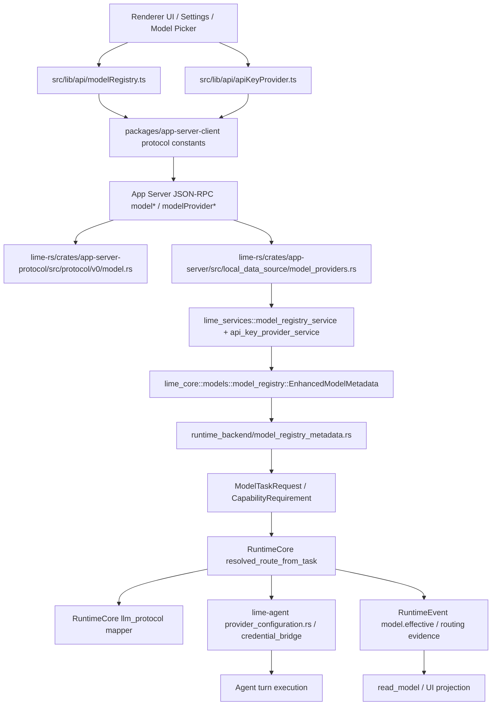
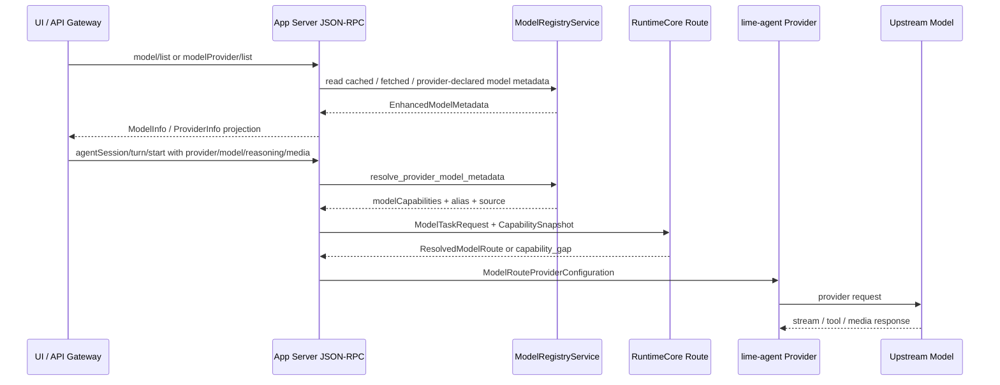

# P1-7 Provider / Model Capability 基线审计

> 状态：P1-7 第一至第三十七刀 done；Codex `ModelInfo` execution / context / picker / tool-call / reasoning / reasoning-output / input modality / responses request-mode / truncation / native tool policy 字段已接入 App Server `ModelInfo`、schema bundle、generated TS、`modelRegistry` projection 与 registry-facing types；第三十七刀已建立前端 submit metadata 入口，把 selected registry model 的 request/execution policy 投影到 `request_metadata.harness.model_request_policy`，同时保留媒体输入 final gate fail-closed；第三十七刀定向 Vitest 5 files / 28 tests、ESLint、`npm run typecheck`、scoped `git diff --check` 与 `npm run smoke:agent-runtime-current-fixture` 通过；`test:contracts` 已执行但仍被隔壁 agent/tool contract anchor 外部缺口阻塞；`auto_review_model_override` 已确认属于 Guardian / review model policy，`multi_agent_version` 已确认属于 session / Team runtime policy，二者都不进入本批 capability rollout。
> 更新时间：2026-07-06
> 范围：Provider / Model capability current owner、Codex 对齐差距、opencode 多模型 / 多模态参照
> 协作边界：第三十七刀完成写集以 `priority-tracking-plan.md` 的 P1-7 第三十七刀协作表和执行日志为准；本审计文件同步记录完成状态、验证口径和避让写集。仍只读避让 Rust runtime / projection / read model、`lime-rs/crates/agent/src/agent_tools/**`、`request_tool_policy/**`、App Server protocol / generated client / `modelRegistry` projection / governance policy 热区与未跟本刀关联的 plugin local package protocol 改动。

## 1. 结论

P1-7 的北极星不是再做一套 Provider UI，而是把 **模型能力变成运行时可执行约束**：

```text
ModelInfo / ProviderInfo picker projection -> CapabilitySnapshot / ModelTaskRequest -> ResolvedModelRoute execution facts -> provider execution
```

对照 Codex，Lime 已经有比 Codex 更宽的多模型、多模态协议骨架，但现在仍存在三类断点：

1. `ModelCapabilitiesInfo` / `EnhancedModelMetadata` 已覆盖 `vision/tools/streaming/json/function_calling/reasoning`、任务族、输入输出模态、runtime features、定价和限制；前端与 Rust canonical summary 字段合同已被守卫固定，`model.effective` reasoning policy 也已优先消费 route `CapabilitySnapshot`，旧 provider/model 字符串推断只保留为无 snapshot fallback。
2. `RuntimeCore` 已能表达多协议 route，并能对 `CapabilitySnapshot` 做 gap 检查；但 `lime-agent/src/provider_configuration.rs` 只把 `OpenaiResponses/CodexResponses/OpenaiChat` 映射成显式 runtime adapter protocol，`AnthropicMessages/Gemini/Ollama/Fal/...` 在该 façade 中会降为 `None`，需要证明下游 credential bridge 能正确重建，或把协议映射补全。
3. 前端 `modelRegistry.ts` / `apiKeyProvider.ts` 已是 current 网关；`prepareAgentStreamUserInputSend` 已能把 selected model capability summary 与 typed input gap 写入发送前 `harness.model_input_capability_gate` evidence。第十刀已把图片输入时的 registry summary 解析与 submit op fail-closed 接到执行层；第十四刀已让 submit 阶段 final summary 覆盖 prepare 阶段 `unknown` gate metadata；第十六刀已让发送 wrapper 基于当前 picker selection 注入 `SendMessageOptions.modelCapabilitySummary`；第十七刀已把 `RouteDefaults` 锁定为 execution policy 字段集合；第十八刀已新增 GUI send policy owner；第十九刀已把 Inputbar warning / disabled 接线收敛到 `ModelInputSendPolicy`，UI disabled 与最终 submit fail-closed 口径一致；第二十刀已用 `npm run verify:gui-smoke` 证明 GUI 最小闭环可运行；第二十一刀已新增 `modelExecutionPolicy`，先把 Codex 式 `tool_mode`、search tool 类型和 image detail original 归一为前端 execution policy 纯 owner；第二十二刀已用 `modelExecutionPolicyBoundary` 防止该 owner 回流 registry、capability summary、bridge、UI 或 picker/catalog 字段；第二十三刀已把 `EnhancedModelMetadata.execution_policy` 接到 `toSnakeModelInfo -> buildModelExecutionPolicy(model)`，App Server 暂无字段时保持 fail-closed；第二十四刀已用 source guard 直接锚定 Codex `ToolMode`、`WebSearchToolType` 与当前已认领 `ModelInfo` execution 字段，并把其它 Codex 字段标成独立 owner 缺口；第二十五刀已新增协议 rollout completeness guard，要求 App Server `ModelInfo`、schema bundle 与 generated TS 的 execution policy 字段成组同步；第二十六刀已新增 `modelContextPolicy`，把 Codex context window、effective percent 与 auto compact token limit 从 execution policy 拆成独立纯 owner；第二十七刀已新增 `modelPickerPolicy`，把 Codex visibility、service tiers 与 default service tier 从 capability summary / execution policy 中拆成 picker policy owner；第二十八刀已把 context / auto compact / picker 字段纳入协议 rollout completeness guard；第二十九刀已新增 `modelToolCallPolicy`，把 Codex `supports_parallel_tool_calls -> Prompt.parallel_tool_calls` 从 generic tools/runtime features 中拆成独立纯 owner；第三十刀已新增 `modelReasoningPolicy`，把 Codex `default_reasoning_level`、`supported_reasoning_levels`、`supports_reasoning_summaries`、request gate 与切模型 clamp 从旧 Lime 窄枚举 / capability summary 心智中拆成独立纯 owner；第三十一刀已新增 `modelInputModalityPolicy`，把 Codex `input_modalities` 缺省 `text/image`、prompt history 图片过滤语义，以及 opencode/models.dev 的 `modalities.input` 多模态词表拆成独立 owner，避免继续把 input modality 锁在 summary 推断或 GUI send gate 里；第三十二刀已新增 `modelReasoningOutputPolicy`，把 Codex `default_reasoning_summary`、`support_verbosity`、`default_verbosity` 的 request 输出控制拆成独立 owner，避免继续混进 reasoning effort、capability summary 或 registry 手写映射；第三十三刀前置已把 `input_modalities` 纳入协议 rollout completeness guard，防止热区后续只接 Rust/schema/generated 任一侧；第三十四刀前置已新增 `modelResponsesPolicy`，把 Codex `use_responses_lite` 的 request mode、payload shape、reasoning context、parallel tool calls gate 与 header requirement 拆成独立 owner；第三十四刀补充已让 `modelCapabilityProjectionBoundary` 显式禁止 `ModelCapabilitySummary` 承接这些 policy projection 或 Codex raw policy 字段；第三十四刀二次补充已把 `use_responses_lite/useResponsesLite` 纳入协议 rollout completeness guard，并要求后续 registry 只能经 `buildModelResponsesPolicy(model)` 暴露 `responses_policy`；第三十五刀前置已新增 `modelTruncationPolicy`，把 Codex `truncation_policy` 的 `bytes/tokens` 截断策略、默认 `10000 bytes` fallback 与 `ToolCall.truncation_policy` 链路拆成独立 owner；第三十五刀补充已把 `truncation_policy/truncationPolicy` 纳入协议 rollout completeness guard，并要求后续 registry 只能经 `buildModelTruncationPolicy(model)` 暴露 `truncation_policy`；第三十五刀三次补充已收敛到 `modelNativeToolPolicy`，把 Codex `shell_type`、`apply_patch_tool_type` 与 `experimental_supported_tools` 拆成 native tool owner，避免继续从 tools/runtime features、tool-call policy 或 picker/catalog 字段推断 shell / patch / experimental tool 暴露。

opencode 只作为多模型 / 多模态参照：它的 Provider endpoint/API 与 Model capability 分层很干净，模型能力最小公共层是 `tools/input/output`，图片和文件统一成 typed request parts。Lime 应借鉴这个边界，不借用 opencode 的 Session 架构。

第三十六刀已把上述 policy owner 从“前端纯 owner + protocol rollout guard”推进到真实 App Server `ModelInfo` 字段、schema fixture、generated TS 与 registry projection 接线；第三十七刀已把 selected registry model 的 policy projection 带入最终 submit metadata，前端不再只能靠 capability summary 或 prepare 阶段 evidence 表达模型执行约束。当前缺口不再是字段未接入或 submit 入口缺失，而是 Rust runtime/request 真正消费 `model_request_policy` 的执行侧收口。

## 2. Codex 原点

Codex 的模型能力主链非常收敛：

| 层 | Codex owner | 关键事实 |
| --- | --- | --- |
| 模型事实源 | `/Users/coso/Documents/dev/rust/codex/codex-rs/models-manager/src/model_info.rs`、`manager.rs`、`models.json` | `ModelInfo` 是模型行为配置对象；unknown slug 也会生成 fallback metadata |
| 协议类型 | `/Users/coso/Documents/dev/rust/codex/codex-rs/protocol/src/openai_models.rs` | `ModelInfo` 覆盖 reasoning levels、reasoning summary default、verbosity、shell tool、visibility、service tiers、truncation、parallel tool calls、Responses Lite request mode、image detail、context window、input modalities、search tool、tool mode |
| App Server 输出 | `/Users/coso/Documents/dev/rust/codex/codex-rs/app-server/src/models.rs` | App Server 暴露 picker-ready `Model`，只把 UI 需要的模型能力投影出去 |
| 执行使用 | `/Users/coso/Documents/dev/rust/codex/codex-rs/core/src/session/turn_context.rs`、`turn.rs` | 切模型时按支持档位重算 reasoning effort；prompt 构造时按 `input_modalities` 过滤历史，用 `supports_parallel_tool_calls` 决定工具调用策略，并按 effective context window / auto compact limit 控制 turn 上下文预算 |
| 缓存策略 | `/Users/coso/Documents/dev/rust/codex/codex-rs/models-manager/src/cache.rs` | 远程模型目录有 TTL / ETag / client version cache，fallback 与 remote override 路径清晰 |

Codex 对 Lime 的核心启发：

1. 模型能力不是 UI 标签，而是 turn 构造、工具暴露、历史过滤、reasoning 参数和压缩策略的输入。
2. `ModelInfo` 是行为 owner；Provider 只解决认证、endpoint、transport。
3. fallback metadata 必须显式标识，不能让未知模型伪装成完整可用能力。
4. App Server 对 UI 输出 picker-ready projection，但 runtime 仍消费同一个模型事实源。

## 3. opencode 参照边界

opencode 只参考多模型、多模态：

| 参照点 | opencode owner | 对 Lime 的取舍 |
| --- | --- | --- |
| Provider schema | `/Users/coso/Documents/dev/js/opencode/packages/schema/src/provider.ts`、`specs/v2/provider-model.md` | Provider 只表达 `api`、`request(headers/body)`、可用性，不承接模型能力 |
| Model schema | `/Users/coso/Documents/dev/js/opencode/packages/schema/src/model.ts` | Model capability 最小层为 `tools/input/output`，另有 cost/limit/status/variants |
| Provider / Model API | `/Users/coso/Documents/dev/js/opencode/packages/protocol/src/groups/provider.ts`、`model.ts` | Provider list 与 Model list 分开，返回 schema 化对象 |
| 多模态请求 part | `/Users/coso/Documents/dev/js/opencode/packages/app/src/components/prompt-input/build-request-parts.ts`、`attachments.ts` | 图片、文件、agent mention 都先归一成 typed part；是否可发给模型由 capability 决定 |

opencode 不参与本轮的 Agent primitive、Session runner、权限或 UI 架构决策。

## 4. Lime current owner map

### 4.1 架构图



### 4.2 时序图



## 5. Lime 事实源对照

| 能力 | current owner | 状态 | Codex 对齐判断 |
| --- | --- | --- | --- |
| 前端模型读取 | `src/lib/api/modelRegistry.ts` | current | 已统一到 App Server `model/list`；旧 preference 写链 fail-closed |
| 前端 Provider 管理 | `src/lib/api/apiKeyProvider.ts` | current | 已统一到 `modelProvider*` / `modelProviderKey*`；可继续保持 |
| 协议 DTO | `lime-rs/crates/app-server-protocol/src/protocol/v0/model.rs` | current | 覆盖比 Codex 更宽，但缺少 Codex 的 `visibility/service_tiers/default_service_tier/tool_mode/image_detail/search_tool/auto_compact` 等 policy 字段 |
| 核心模型元数据 | `lime-rs/crates/core/src/models/model_registry.rs` | current | `EnhancedModelMetadata` 已覆盖 task family、modalities、runtime features、pricing、limits |
| 模型目录服务 | `lime-rs/crates/services/src/model_registry_service.rs` | current | 负责 API fetch、provider-declared model、taxonomy 推断和 10 天缓存；需避免推断结果越权成为真实能力 |
| Provider 设置 | `lime-rs/crates/services/src/api_key_provider_service.rs`、`local_data_source/model_providers.rs` | current | Provider type、API Host、prompt cache mode、key rotation 已集中 |
| route capability | `lime-rs/crates/runtime-core/src/model_task.rs`、`model_route.rs` | current | 能把 requirement 与 snapshot 做 gap 检查，是 P1-7 应强化的主路径 |
| 多协议 wire mapper | `lime-rs/crates/runtime-core/src/llm_protocol/mapper/**` | current | 可构造 OpenAI Responses/Chat、Anthropic、Gemini、Ollama、OpenAI Images 等 wire request；Fal / Bedrock 仍显式 unsupported |
| Agent provider install | `lime-rs/crates/agent/src/provider_configuration.rs` | current but incomplete | 只显式保留 OpenAI Responses / Chat；其它协议进入 `None`，需要补验证或映射 |
| reasoning policy | `lime-rs/crates/app-server/src/runtime_backend/model_capability.rs` | current with fallback | `model.effective` 优先消费 route `CapabilitySnapshot`；provider/model 字符串推断只作为无 snapshot fallback |
| reasoning effort frontend policy | `src/lib/model/modelReasoningPolicy.ts` | current frontend owner | 已按 Codex `ReasoningEffort` 开放字符串、`ModelInfo.default_reasoning_level/supported_reasoning_levels/supports_reasoning_summaries` 与 `TurnContext` 切模型语义固定 request / model switch 两条可执行策略；第三十六刀已接入 App Server `ModelInfo` 真字段与 registry projection |
| input modality policy | `src/lib/model/modelInputModalityPolicy.ts` | current frontend owner | 已按 Codex `input_modalities` 与缺省 `text/image` 固定输入模态声明 owner；opencode 只贡献 `audio/video/pdf` 与 `modalities.input` 多模态词表参考；第三十六刀已接入 registry projection 与 App Server `ModelInfo` 真字段 |
| responses request-mode policy | `src/lib/model/modelResponsesPolicy.ts` | current frontend owner | 已按 Codex `use_responses_lite` 固定 Responses Lite 请求形态 owner；标准模式把 instructions/tools 放 request field，lite 模式把二者前置到 input、reasoning context 设为 `all_turns`、禁用 parallel tool calls request 并要求 lite header；第三十六刀已接入 App Server `ModelInfo` 真字段与 registry projection |
| truncation policy | `src/lib/model/modelTruncationPolicy.ts` | current frontend owner | 已按 Codex `truncation_policy` 固定工具输出截断策略 owner；保留 `bytes/tokens` 模式，缺失或非法值 fail-closed 到 Codex fallback `10000 bytes`；第三十六刀已接入 App Server `ModelInfo` 真字段与 registry projection |
| context / auto compact policy | `src/lib/model/modelContextPolicy.ts` | current frontend owner | 已按 Codex `ModelInfo` / `TurnContext` 语义固定 resolved context window、effective context percent、model context window 与 auto compact 上限；第三十六刀已接入 App Server `ModelInfo` 真字段与 registry projection |
| picker visibility / service tier policy | `src/lib/model/modelPickerPolicy.ts` | current frontend owner | 已按 Codex `ModelVisibility` / `ModelServiceTier` / `service_tier_for_request` 语义固定 picker 展示和请求 tier 过滤；第三十六刀已接入 App Server `ModelInfo` 真字段与 registry projection |
| legacy façade | `src/lib/governance/agentCommandCatalog.json`、`internal/aiprompts/commands.md` | dead / retired guard | 旧 Provider façade 命令族已判 `dead`，不得回流 |

## 6. 核心缺口表

| 编号 | 缺口 | 影响 | 下一刀建议 | 验证 |
| --- | --- | --- | --- | --- |
| P1-7-G1 | `runtime_backend/model_capability.rs` 用字符串推断 reasoning，而 route 主链已有 `CapabilitySnapshot` | 自定义模型、relay alias、provider-declared model 可能出现 capability 判断不一致 | 已完成：`model.effective` reasoning policy 优先消费 route `CapabilitySnapshot`，旧字符串推断仅作无 snapshot fallback | `app-server model_capability` + `model_effective_event` |
| P1-7-G2 | `provider_configuration.rs` 只把 `OpenaiResponses/CodexResponses/OpenaiChat` 映射为 runtime protocol | `ResolvedModelRoute.protocol` 和实际 provider adapter 之间可能漂移 | 已补 projection guard：非 OpenAI family protocol 只保留 route metadata，不猜 adapter；后续决策是补真实 adapter protocol，还是证明 credential bridge 重建语义 | `cargo test -p lime-agent provider_configuration` |
| P1-7-G3 | 协议 DTO 与 TS `EnhancedModelMetadata` 曾缺 Codex 的 policy 字段：`visibility/service_tiers/default_service_tier/tool_mode/search_tool/image_detail/context/auto_compact/supports_parallel_tool_calls/default_reasoning_level/supported_reasoning_levels/supports_reasoning_summaries/default_reasoning_summary/support_verbosity/default_verbosity/input_modalities/use_responses_lite/truncation_policy/shell_type/apply_patch_tool_type/experimental_supported_tools` | 字段缺失会让 UI picker / runtime 只能展示通用能力，无法驱动 Codex 式执行策略 | 已完成：第三十六刀按十层 owner 接入 App Server `ModelInfo` / schema bundle / generated TS / `modelRegistry` projection 与 registry-facing types；`modelExecutionPolicy` 承接 tool/search/image detail，`modelContextPolicy` 承接 context / auto compact，`modelPickerPolicy` 承接 visibility / service tier，`modelToolCallPolicy` 承接 parallel tool calls，`modelReasoningPolicy` 承接 reasoning effort，`modelReasoningOutputPolicy` 承接 summary / verbosity，`modelInputModalityPolicy` 承接 input modalities，`modelResponsesPolicy` 承接 Responses Lite，`modelTruncationPolicy` 承接 truncation，`modelNativeToolPolicy` 承接 shell / patch / experimental tools；后续只允许向执行侧消费推进，不再把这些字段塞回 Provider、summary、runtime features、tool-call policy 或 GUI send gate | `npm run check:protocol-types` + `cargo test --manifest-path "lime-rs/Cargo.toml" -p app-server-protocol schema_fixtures_match_generated_output -- --nocapture` + 14 files / 74 tests 定向 Vitest + 相关 ESLint + scoped `git diff --check`；`npm run test:contracts` 已执行但被 agent/tool 外部缺口阻塞 |
| P1-7-G4 | Prompt Cache 口径需要收敛 | `commands.md` 强调不能因“长得像 Anthropic”推断 automatic；代码中存在 known host whitelist 自动模式 | 已完成：Provider 类型 + Provider 持久化声明 + 已知官方 Anthropic-compatible host catalog；普通 compatible host explicit-only | `providerPromptCacheSupport.test.ts` + `lime-core provider_prompt_cache_support` |
| P1-7-G5 | 多模态 request part 到 model capability 的 UI gate 不完整 | 图片 / 文件可能在 UI 层可添加，但运行时才发现 capability gap | 已补 helper owner、发送准备边界 evidence、最终 submit op fail-closed、prepare / submit final evidence 一致性、发送 wrapper selected summary 注入、GUI send policy owner 与 Inputbar disabled 接线：图片输入 submit 执行层解析 selected model summary，`buildUserInputSubmitOp` 对 blocked / unknown 媒体输入 fail-closed；submit final gate 覆盖 prepare 阶段 unknown evidence；`createAgentChatSendMessage` 会在上游未显式传 summary 时补入当前 picker selection summary；`modelInputSendPolicy` 已把 gate result 投影成 GUI 可消费的 `enabled / warning / blocked`；`InputbarVisionCapabilityNotice` 通过 `evaluateModelInputCapability -> buildModelInputSendPolicy` 产出 `ModelInputSendPolicy`，`InputbarComposerSection` 只消费 `shouldDisableComposer` 禁用和拦截发送；GUI smoke 已证明 Electron / App Server 最小闭环可运行 | `modelCapabilitySendGate.test.ts` + `modelInputSendPolicy.test.ts` + `InputbarVisionCapabilityNotice.test.tsx` + `InputbarComposerSection.planStatus.test.tsx` + ESLint + renderer typecheck + `npm run verify:gui-smoke` |
| P1-7-G6 | `model-provider` canonical model 只有 `supports_tools/input/output/pricing/context`，与 App Server `EnhancedModelMetadata` 两套 canonical 并存 | canonical source 分裂，后续多模型维护成本上升 | 已补守卫：固定 TS / Rust summary 字段合同，并禁止生产代码绕过 owner 直接读取 bundled canonical JSON | `modelProviderCapabilityBoundary.test.ts` |
| P1-7-G7 | picker vs execution / context / tool-call / reasoning / reasoning-output / truncation / native tool projection 尚未拆清 | UI picker 字段、turn 构造字段、context budget 字段、tool-call request flag、reasoning effort clamp、summary / verbosity 输出控制、工具输出截断策略与 native tool surface 继续混在通用 capability summary 心智里 | 已补前端 execution summary 边界守卫、RuntimeCore `CapabilitySnapshot` 负向测试、route DTO 直接收口与 `RouteDefaults` execution policy guard：picker/catalog 字段不能进入 summary，不能让 route snapshot 推断能力，不能进入 route defaults；`ResolvedModelRoute` 已删除 `provider/model` picker DTO 字段，execution route 只保留 model_ref、protocol、endpoint/auth、defaults、capability snapshot、decision 与 failure；`modelExecutionPolicy` 已固定 tool/search/image-detail policy 不从 picker/catalog 字段推断；`modelContextPolicy` 已固定 context / auto compact 不从 picker/catalog 字段推断；`modelPickerPolicy` 已固定 visibility / service tier 不从 capability、pricing 或 provider catalog 字段推断，且已有 boundary guard 防止依赖 registry、capability summary、execution/context owner、bridge 或 UI；`modelToolCallPolicy` 已固定 parallel tool call request flag 不从 tools/runtime features 推断；`modelReasoningPolicy` 已固定 reasoning effort request gate / model switch clamp 不从 capability summary、runtime features 或 picker/catalog 推断；`modelReasoningOutputPolicy` 已固定 reasoning summary / verbosity request 输出控制不从 capability summary、runtime features、picker/catalog 或 effort 字段推断；`modelResponsesPolicy` 已固定 Responses Lite request mode 不从 protocol/runtime features/tools/picker 推断；`modelTruncationPolicy` 已固定工具输出截断策略不从 context、tools、runtime features 或 picker/catalog 推断；`modelNativeToolPolicy` 已固定 shell / patch / experimental tool surface 不从 capability summary、runtime features、tool-call policy、execution policy 或 picker/catalog 推断；`modelCapabilityProjectionBoundary.test.ts` 已显式禁止 `ModelCapabilitySummary` 承接 `*_policy` projection 或 Codex raw policy 字段；协议 rollout guard 防止字段只接 Rust DTO / schema / generated TS 任一侧；后续继续把真实字段接到协议 / generated client / route guard | `modelCapabilityProjectionBoundary.test.ts` + `modelExecutionPolicy.test.ts` + `modelContextPolicy.test.ts` + `modelPickerPolicy.test.ts` + `modelToolCallPolicy.test.ts` + `modelReasoningPolicy.test.ts` + `modelReasoningOutputPolicy.test.ts` + `modelResponsesPolicy.test.ts` + `modelTruncationPolicy.test.ts` + `modelNativeToolPolicy.test.ts` + `modelExecutionPolicyBoundary.test.ts` + `modelPickerPolicyBoundary.test.ts` + `modelToolCallPolicyBoundary.test.ts` + `modelReasoningPolicyBoundary.test.ts` + `modelReasoningOutputPolicyBoundary.test.ts` + `modelResponsesPolicyBoundary.test.ts` + `modelTruncationPolicyBoundary.test.ts` + `modelNativeToolPolicyBoundary.test.ts` + `codexModelExecutionPolicyOrigin.test.ts` + `codexModelContextPolicyOrigin.test.ts` + `codexModelPickerPolicyOrigin.test.ts` + `codexModelToolCallPolicyOrigin.test.ts` + `codexModelReasoningPolicyOrigin.test.ts` + `codexModelReasoningOutputPolicyOrigin.test.ts` + `codexModelResponsesPolicyOrigin.test.ts` + `codexModelTruncationPolicyOrigin.test.ts` + `codexModelNativeToolPolicyOrigin.test.ts` + `modelExecutionPolicyProtocolBoundary.test.ts` + `modelNativeToolPolicyProtocolBoundary.test.ts` + `modelRegistry.test.ts` + `runtime-core picker` + `app-server-protocol` schema fixture + generated TS check |

## 7. 推荐推进切片

### 第一阶段：只收敛能力事实，不扩协议面

1. **已完成：front / Rust capability summary owner**
   - 前端 `getModelCapabilitySummary` 与 Rust `CanonicalModel::capability_summary()` 已统一字段合同。
   - `modelProviderCapabilityBoundary.test.ts` 禁止生产代码绕过 owner 直接读取 bundled canonical JSON。

2. **已完成：protocol projection guard**
   - `lime-agent provider_configuration.rs` 已固定 route protocol projection current 行为。
   - 非 OpenAI family protocol 只保留 route metadata，不猜 adapter。

3. **已完成：Prompt Cache governance reconciliation**
   - `commands.md`、TS helper、Rust helper 的 automatic / explicit-only 口径已收敛。

4. **已完成：multi-modal send gate owner helper + 发送准备 evidence + submit fail-closed + final evidence + send wrapper summary 注入 + GUI policy owner**
   - `modelCapabilitySendGate.ts` 先提供纯函数 gate：typed request part -> required input modalities -> selected model summary gap。
   - `SendMessageOptions.modelCapabilitySummary` 允许上游传入 canonical model summary。
   - `prepareAgentStreamUserInputSend` 已在有 summary 或媒体输入时写入 `requestMetadata.harness.model_input_capability_gate`，覆盖 `allowed / blocked / unknown`。
   - `executeAgentStreamSubmit` 已在媒体输入时从 current `modelRegistryApi.getModelRegistry()` 解析 selected model summary，`buildUserInputSubmitOp` 在 runtime submit payload 构造前 fail-closed；blocked / unknown media gap 不调用 `runtime.submitOp`，也不先写入 managed objective。
   - `modelCapabilitySendGate.ts` 已成为 gate metadata merge owner；submit 阶段会用 final selected model summary 覆盖 prepare 阶段 unknown evidence，保持 `runtime.submitOp.metadata.harness.model_input_capability_gate` 与真实 submit 判定一致。
   - `createAgentChatSendMessage` 已在 raw send 前基于当前 picker provider/model selection、positional model override 与 `SendMessageOptions.providerOverride/modelOverride` 解析 current registry summary，并在上游未显式传 `modelCapabilitySummary` 时注入发送选项；显式 null/summary 不覆盖，registry miss/error 不阻断普通发送。
   - `modelInputSendPolicy.ts` 已把 `ModelCapabilitySendGateResult` 投影成 `enabled / warning / blocked`、`canSubmit`、`shouldDisableComposer` 与 `failClosedAtSubmit`；media unknown 默认与 submit fail-closed 口径一致，pure text unknown 只 warning 不阻断。
   - `InputbarVisionCapabilityNotice` 已通过 `evaluateModelInputCapability -> buildModelInputSendPolicy` 产出 `ModelInputSendPolicy`；`InputbarComposerSection` 只消费 `shouldDisableComposer` 禁用和拦截发送。
   - `model_input_capability_gap` 已接入五语言 runtime error presentation；`npm run verify:gui-smoke` 已通过。

### 第二阶段：Codex 式执行字段

5. **已完成：reasoning capability owner**
   - `model.effective` / reasoning policy 已优先消费 route `CapabilitySnapshot`。
   - 旧 provider/model 字符串推断只作为无 snapshot fallback。

6. **已完成：GUI policy 接线**
   - UI 添加图片 / 文件时只做 typed part；
   - 第十四刀已让 submit 阶段 final summary 覆盖 prepare 阶段 unknown gate evidence；
   - 第十六刀已让发送 wrapper 注入当前 picker selection summary；
   - 第十八刀已新增 `modelInputSendPolicy.ts` 作为 GUI warning / disabled 策略 owner；
   - 第十九刀已让 Inputbar 消费该 policy 禁用 composer 并拦截发送；
   - runtime route 继续保留 `CapabilityGap` 作为最终守卫。

7. **P1-7 后续：picker vs execution projection**
   - picker 字段：visibility、service tier、status、upgrade / deprecation。
   - execution 字段：input modalities、output modalities、tools、reasoning levels、context/output limits、image detail、search/tool mode、parallel tool calls。
   - 已补前端守卫：`src/lib/governance/modelCapabilityProjectionBoundary.test.ts` 固定 execution summary 不接收 `display_name/provider_name/tier/status/source/pricing/deployment_source/management_plane/alias_source` 等 picker/catalog 字段，也不承接 `*_policy` projection 或 Codex raw policy 字段。
   - 已补 RuntimeCore 负向测试：`capability_snapshot_from_model_capabilities` 只消费 `capabilities/taskFamilies/inputModalities/outputModalities/runtimeFeatures`，不会从 `displayName/providerName/tier/status/source/pricing/deploymentSource/managementPlane/aliasSource` 推断能力或 provenance。
   - 已补 route 分层守卫并直接收口协议：`CapabilityRequirement` / `CapabilitySnapshot` 字段集合被治理测试固定，`ModelTaskRequest` 不引用 `ModelInfo` / `ProviderInfo`；`ResolvedModelRoute` 已删除 `provider/model` picker DTO 字段，provider endpoint/auth 只能通过 `EndpointInfo` / `AuthMaterialRef` 进入 execution route。
   - 已补 `RouteDefaults` execution policy 守卫：route defaults 只允许 `reasoning_effort`、`prompt_cache_mode`、`toolshim`、`toolshim_model`，不允许 service tier、status、pricing、display name 等 picker/catalog 字段回流。
   - 已补 registry metadata 接线：`EnhancedModelMetadata.execution_policy` 作为前端 registry-facing projection 字段，由 `toSnakeModelInfo -> buildModelExecutionPolicy(model)` 归一，缺 App Server 字段时 fail-closed。
   - 已补 Codex 原点源级守卫：`codexModelExecutionPolicyOrigin.test.ts` 直接读取 Codex `openai_models.rs`（本地存在时），固定 `ToolMode`、`WebSearchToolType` 与当前已认领 `ModelInfo` execution 字段，并禁止把 reasoning / service tier / parallel tools / context / auto compact 等后续字段混入当前 policy owner。
   - 已补协议 rollout completeness guard：`modelExecutionPolicyProtocolBoundary.test.ts` 要求 App Server `ModelInfo` Rust DTO、schema bundle 与 generated TS 的 execution / context / picker / tool-call / reasoning / reasoning-output policy 字段成组同步；registry 仍只能通过对应 policy owner 暴露归一 projection。
   - 已补 context / auto compact owner：`modelContextPolicy.ts` 按 Codex `ModelInfo::resolved_context_window()`、`ModelInfo::auto_compact_token_limit()` 与 `TurnContext::model_context_window()` 语义归一 `resolved_context_window`、`auto_compact_token_limit` 与 `model_context_window`；`codexModelContextPolicyOrigin.test.ts` 直接读取 Codex source 作为源级守卫。
   - 已补 picker visibility / service tier owner：`modelPickerPolicy.ts` 按 Codex `ModelVisibility`、`ModelServiceTier` 与 `service_tier_for_request()` 语义归一 `show_in_picker`、`supported_service_tier_ids` 与 request service tier 过滤；`codexModelPickerPolicyOrigin.test.ts` 直接读取 Codex source 作为源级守卫；`modelPickerPolicyBoundary.test.ts` 固定该 owner 不依赖 registry、capability summary、execution/context owner、bridge 或 UI。
   - 已补 tool-call owner：`modelToolCallPolicy.ts` 按 Codex `supports_parallel_tool_calls -> Prompt.parallel_tool_calls` 语义归一 request flag；`codexModelToolCallPolicyOrigin.test.ts` 直接读取 Codex source 作为源级守卫。
   - 已补 reasoning effort owner：`modelReasoningPolicy.ts` 按 Codex `ReasoningEffort` 开放字符串、`supports_reasoning_summaries` request gate、`default_reasoning_level` fallback 和切模型 supported 中位数 clamp 语义归一；`codexModelReasoningPolicyOrigin.test.ts` 直接读取 Codex source 作为源级守卫；`modelReasoningPolicyBoundary.test.ts` 防止依赖 registry、capability summary、旧 Lime `ModelReasoningEffortLevel`、bridge 或 UI。
   - 已补 execution / context / picker / tool-call / reasoning 协议 rollout guard：`modelExecutionPolicyProtocolBoundary.test.ts` 已覆盖 execution、context、picker、`supports_parallel_tool_calls` 与 reasoning 字段；下一刀把真实字段接入协议 / generated client 时必须继续同步同一守卫。
   - 原则：Provider 不承接模型能力，Provider 只承接 endpoint/auth/request option。

## 8. 对照表：Codex / Lime / opencode

| 维度 | Codex | Lime 当前 | opencode 参照 | Lime 方向 |
| --- | --- | --- | --- | --- |
| Model primitive | `ModelInfo` 单一行为对象 | `EnhancedModelMetadata` + `ModelInfo` DTO + `CapabilitySnapshot` | `Model.Info` | 收敛到 `EnhancedModelMetadata -> CapabilitySnapshot` |
| Provider primitive | auth/backend endpoint | Provider type/API Host/API Key/prompt cache | `Provider.Info.api/request` | Provider 只管 endpoint/auth/request option |
| Reasoning | supported levels + default + turn switch clamp | route `CapabilitySnapshot` 已驱动 `model.effective`；前端 `modelReasoningPolicy` 已固定 Codex request / switch 语义，第三十六刀已接入协议真字段 | 可通过 variant/body 表达 | 用 ModelInfo 真字段驱动 reasoning policy，不再依赖字符串推断或旧窄枚举 |
| Tools | `supports_parallel_tool_calls` + tool mode | `tools/function_calling/runtime_features` | `capabilities.tools` | 区分 tools supported、parallel supported、tool mode |
| Multimodal input | `input_modalities` 过滤 prompt history | `modelInputModalityPolicy` + send gate + runtime image gap | `modalities.input` / `capabilities.input` typed part | ModelInfo 输入模态声明 -> registry projection -> UI send gate + runtime gap 双层 |
| Responses Lite | `use_responses_lite` 改变 Responses request header、payload shape、reasoning context 和 parallel tool calls gate | `modelResponsesPolicy` 已拆出前端 owner，第三十六刀已接入协议真字段 | 不参与 | 用 ModelInfo 真字段驱动 request mode，不从 runtime feature、protocol 字符串或 provider 类型推断 |
| Truncation | `truncation_policy` 驱动工具输出 / history 截断预算 | `modelTruncationPolicy` 已拆出前端 owner，第三十六刀已接入协议真字段 | 不参与 | 用 ModelInfo 真字段驱动截断策略，不从 context window、runtime feature 或 tool support 推断 |
| Output modality | App Server model projection较轻 | `output_modalities` 已存在 | `capabilities.output` | 用于 media task route 和 artifact expectation |
| Cache | models cache TTL/ETag；prompt cache跟 provider request | 模型 fetch 10 天缓存；prompt cache 有 provider mode | cost.cache | 明确 model catalog cache 与 prompt cache 不是同一层 |
| Protocol | Codex 主要 OpenAI Responses | RuntimeCore 已多协议，agent façade 部分显式 | endpoint type/native/AISDK | route protocol 与 executable adapter 做一一验证 |

## 9. 本轮不动的文件

本轮只读避让：

- `lime-rs/crates/app-server/src/runtime/read_model.rs`
- `lime-rs/crates/app-server/src/runtime/thread_item_projection.rs`
- `lime-rs/crates/app-server/src/runtime/read_model/**`
- `lime-rs/crates/app-server/src/runtime/thread_item_projection/**`
- `lime-rs/crates/agent/src/agent_tools/**`
- `src/lib/governance/appServerRuntimeBoundary.test.ts`
- `src/lib/governance/appServerRuntimeBoundary.testSupport.ts`
- `src/lib/governance/agentMigrationBoundary.test.ts`

## 10. 第三十六刀完成状态与下一刀判定

P1-7 第三十六刀已完成 **execution / context / picker / tool-call / reasoning / reasoning-output / input modality / responses request-mode / truncation / native tool policy 协议字段接线**：

```text
multi-modal send gate:
第十四刀已确认 submit final gate evidence 会覆盖 prepare 阶段 unknown metadata。
第十六刀已把当前 picker selection summary 注入 SendMessageOptions.modelCapabilitySummary；
第十七刀已把 RouteDefaults 锁定为 execution policy 字段集合；
第十八刀已新增 modelInputSendPolicy 纯 owner；
第十九刀已接入 Inputbar warning / disabled；
第二十刀已通过 GUI smoke；
第二十一刀已新增 modelExecutionPolicy 纯 owner；
第二十二刀已新增 modelExecutionPolicyBoundary 回流守卫；
第二十三刀已把 registry metadata 接到 execution policy owner；
第二十四刀已新增 Codex execution policy origin source guard；
第二十五刀已新增 protocol rollout completeness guard；
第二十六刀已新增 modelContextPolicy 与 Codex context policy origin source guard；
第二十七刀已新增 modelPickerPolicy 与 Codex picker policy origin source guard；
第二十八刀已扩展 execution / context / picker policy protocol rollout completeness guard；
第二十九刀已新增 modelToolCallPolicy 与 Codex tool-call policy origin source guard；
第三十刀前置已补 modelPickerPolicyBoundary，并把 supports_parallel_tool_calls 纳入 protocol rollout completeness guard；
第三十刀已新增 modelReasoningPolicy 与 Codex reasoning policy origin source guard；
本轮补充把 reasoning policy 字段纳入 protocol rollout completeness guard；
第三十一刀已新增 modelInputModalityPolicy、Codex input modality origin source guard 与 opencode 多模态 reference guard；
第三十二刀已新增 modelReasoningOutputPolicy 与 Codex reasoning output origin source guard；
本轮补充把 reasoning-output policy 字段纳入 protocol rollout completeness guard；
第三十三刀前置已把 input_modalities 纳入 protocol rollout completeness guard；
第三十四刀前置已新增 modelResponsesPolicy 与 Codex responses policy origin source guard；
第三十四刀二次补充已把 use_responses_lite 纳入 protocol rollout completeness guard；
第三十五刀前置已新增 modelTruncationPolicy 与 Codex truncation policy origin source guard；
第三十五刀补充已把 truncation_policy 纳入 protocol rollout completeness guard；
第三十四刀补充已让 ModelCapabilitySummary 显式拒绝 policy projection / Codex raw policy 字段；
第三十五刀三次补充已新增 modelNativeToolPolicy 与 native tool protocol rollout guard；
第三十六刀协作复核已把 modelNativeToolPolicyProtocolBoundary 纳入最小验证，前置 13 个 policy / protocol 定向测试文件、62 条用例通过；
第三十六刀真实接线已把 policy 真字段补到 App Server ModelInfo / schema bundle / generated TS / modelRegistry projection / registry-facing types，定向 14 个 policy / protocol / registry 测试文件、74 条用例通过。
```

下一刀不再继续扩 `ModelInfo` DTO，优先回到执行侧消费：让 runtime/request gate 明确使用这些 policy projection，或由持有 `lime-rs/crates/agent/**` 的进程先收口当前阻塞 `test:contracts` 的 tool orchestrator / WebSearch preflight 缺口：

```text
picker vs execution projection:
前端 execution summary 边界已由 modelCapabilityProjectionBoundary.test.ts 守住；
RuntimeCore capability snapshot 与 route DTO 分层测试已证明 picker/catalog 字段不能驱动 route capability；
ResolvedModelRoute 已直接删除 provider/model picker DTO 字段；
RouteDefaults 已固定只承接 execution policy 字段；
modelExecutionPolicyBoundary 已防止前端纯 owner 回流 registry / UI / picker catalog；
modelRegistry.ts 已只通过 modelExecutionPolicy owner 暴露 registry metadata execution_policy；
codexModelExecutionPolicyOrigin.test.ts 已把当前 tool/search/image-detail policy 锚到 Codex source，并把其余 Codex 字段标为独立 owner 缺口；
modelExecutionPolicyProtocolBoundary.test.ts 已把 execution / context / picker / tool-call / reasoning / reasoning-output / input-modality 真实协议字段 rollout 固定为 Rust DTO / schema bundle / generated TS 成组同步；
codexModelContextPolicyOrigin.test.ts 已把 context / auto compact policy 锚到 Codex source；
codexModelPickerPolicyOrigin.test.ts 已把 visibility / service tier policy 锚到 Codex source；
codexModelToolCallPolicyOrigin.test.ts 已把 parallel tool calls policy 锚到 Codex source；
codexModelReasoningPolicyOrigin.test.ts 已把 reasoning effort policy 锚到 Codex source；
codexModelReasoningOutputPolicyOrigin.test.ts 已把 reasoning summary / verbosity output policy 锚到 Codex source；
codexModelInputModalityPolicyOrigin.test.ts 已把 input modalities policy 锚到 Codex source；
codexModelTruncationPolicyOrigin.test.ts 已把 truncation policy 锚到 Codex source；
opencodeModelInputModalityReference.test.ts 已把 opencode 参考限制在多模态词表和 `modalities.input` / `capabilities.input` 形态；
第三十六刀已把真实字段接到协议 / generated client / registry projection；下一步是让执行侧继续消费 Responses Lite、truncation、native tool 等 policy，不再从 runtime feature、provider/protocol 字符串或 context 字段旁路推断。
```

## 11. 已落地守卫

- `src/lib/model/inferModelCapabilities.ts`：前端 canonical capability summary 已覆盖 tools、reasoning、modalities、prompt cache、media 和 limits。
- `lime-rs/crates/agent/src/provider_configuration.rs`：route protocol projection guard 已固定 current 行为，只有 `OpenaiResponses` / `CodexResponses` / `OpenaiChat` 会投影为 runtime adapter protocol；`AnthropicMessages` / `GeminiGenerateContent` / `OllamaChat` / `Fal` / `BedrockConverse` / `VertexGemini` / `OpenaiImages` / `Unknown` 只保留 route metadata。
- 验证：`cargo test --manifest-path "lime-rs/Cargo.toml" -p lime-agent provider_configuration -- --nocapture` 已通过；唯一 warning 来自并行热区 `agent_tools/execution/tests.rs` 的 unrelated unused import。
- `internal/aiprompts/commands.md` + `src/lib/model/providerPromptCacheSupport.ts` + `lime-rs/crates/core/src/provider_prompt_cache_support.rs`：Prompt Cache 口径已收敛为 Provider 类型 + Provider 持久化声明 + 已知官方 Anthropic-compatible host catalog；普通 `anthropic-compatible` 默认 explicit-only，只有显式 `prompt_cache_mode=automatic` 或 catalog 命中才 automatic。
- 验证：`npx vitest run "src/lib/model/providerPromptCacheSupport.test.ts"` 与 `cargo test --manifest-path "lime-rs/Cargo.toml" -p lime-core provider_prompt_cache_support -- --nocapture` 已通过。
- `internal/research/refactor/v1/priority-tracking-plan.md`：已把 P1-7 第一至第三十五刀补充标注为 `done`；下一刀切到 execution / context / picker / tool-call / reasoning / reasoning-output / input modality / responses request-mode / truncation policy App Server protocol / generated client / registry projection / route guard 接线。
- `src/lib/governance/modelProviderCapabilityBoundary.test.ts`：已固定 TS `ModelCapabilitySummary` 与 Rust `CanonicalModelCapabilitySummary` 字段合同，并禁止生产代码绕过 owner 直接读取 bundled `canonical_models.json`。
- 验证：`npx vitest run "src/lib/governance/modelProviderCapabilityBoundary.test.ts"` 已通过。
- `src/lib/governance/modelCapabilityProjectionBoundary.test.ts`：已固定前端 `ModelCapabilitySummary` / `getModelCapabilitySummary` 只能输出 execution summary 字段，并禁止 picker/catalog 字段、`*_policy` registry projection、Codex raw policy 字段污染 turn 构造摘要；`inferModelCapabilities.ts` 不得依赖各 policy owner；taxonomy input 不依赖模型选择器展示字段；App Server `CapabilityRequirement` / `CapabilitySnapshot` / `RouteDefaults` / `ResolvedModelRoute` 字段集合固定为 execution 字段，`RouteDefaults` 只允许 `reasoning_effort`、`prompt_cache_mode`、`toolshim`、`toolshim_model`，`ModelTaskRequest` 与 `ResolvedModelRoute` 不引用 picker DTO；RuntimeCore route 构造文本守卫禁止 `provider/model` 字段初始化回流。
- `lime-rs/crates/app-server-protocol/src/protocol/v0/model.rs` + schema fixture + `packages/app-server-client/src/generated/protocol-types.ts`：`ResolvedModelRoute` 已删除 `provider: Option<ProviderInfo>` / `model: Option<ModelInfo>`；`ProviderInfo` / `ModelInfo` 不再因 execution route 被内联到 `ResolvedModelRoute` schema。
- 验证：`npx vitest run "src/lib/governance/modelCapabilityProjectionBoundary.test.ts"` 已通过。
- `src/lib/model/modelInputSendPolicy.ts`：已新增 GUI warning / disabled 接线前的纯策略 owner，只消费 `ModelCapabilitySendGateResult` 并输出 `enabled / warning / blocked`、`canSubmit`、`shouldDisableComposer` 与 `failClosedAtSubmit`；媒体输入缺 summary 默认与最终 submit fail-closed 口径一致，纯文本缺 summary 只 warning。
- 验证：`npx vitest run "src/lib/model/modelInputSendPolicy.test.ts" "src/lib/model/modelCapabilitySendGate.test.ts"` 已通过。
- Inputbar warning / disabled：`InputbarVisionCapabilityNotice` 不再定义自有 capability policy；它只负责 Provider / Model 读取和推荐文案，发送策略由 `evaluateModelInputCapability -> buildModelInputSendPolicy` 产出 `ModelInputSendPolicy`。`InputbarComposerSection` 只消费 `shouldDisableComposer` 禁用 composer 并拦截发送。验证：`npx vitest run "src/lib/model/modelInputSendPolicy.test.ts" "src/lib/model/modelCapabilitySendGate.test.ts" "src/components/agent/chat/components/Inputbar/components/InputbarVisionCapabilityNotice.test.tsx" "src/components/agent/chat/components/Inputbar/components/InputbarComposerSection.planStatus.test.tsx"`、`npx eslint ... --max-warnings 0`、renderer typecheck、`npm run verify:gui-smoke` 与 `diff --check` 已通过。
- `src/lib/model/modelExecutionPolicy.ts`：已新增前端 execution policy 纯 owner，按 Codex `ToolMode`、`WebSearchToolType`、`supports_search_tool` 与 `supports_image_detail_original` 归一 `tool_mode`、search content modalities、allowed image detail values；默认 fail-closed，且不从 `tier/status/pricing/provider_name` 等 picker/catalog 字段推断执行能力。本刀不改协议 schema，不把字段塞回 `ModelCapabilitySummary`。
- 验证：`npx vitest run "src/lib/model/modelExecutionPolicy.test.ts" "src/lib/governance/modelCapabilityProjectionBoundary.test.ts"` 与 `npx eslint "src/lib/model/modelExecutionPolicy.ts" "src/lib/model/modelExecutionPolicy.test.ts" "src/lib/governance/modelCapabilityProjectionBoundary.test.ts" --max-warnings 0` 已通过；scoped whitespace scan 已通过；`npx tsc --noEmit --project "tsconfig.renderer.json" --pretty false` 已执行但被无关 `packages/app-server-client` plugin local package export 协议漂移阻塞。
- `src/lib/governance/modelExecutionPolicyBoundary.test.ts`：已新增 execution policy owner 回流守卫，固定 `ModelExecutionPolicy` 字段集合，禁止 `modelExecutionPolicy.ts` 依赖 registry、capability summary、bridge 或 UI，并禁止从 picker/catalog 字段推断执行策略。
- 验证：`npx vitest run "src/lib/governance/modelExecutionPolicyBoundary.test.ts" "src/lib/model/modelExecutionPolicy.test.ts"` 与 `npx eslint "src/lib/governance/modelExecutionPolicyBoundary.test.ts" "src/lib/model/modelExecutionPolicy.ts" "src/lib/model/modelExecutionPolicy.test.ts" --max-warnings 0` 已通过；scoped whitespace scan 已通过。
- `src/lib/types/modelRegistry.ts` / `src/lib/types/modelRegistry.d.ts` + `src/lib/api/modelRegistry.ts`：`EnhancedModelMetadata.execution_policy` 已作为 registry metadata projection 接入，`toSnakeModelInfo` 通过 `buildModelExecutionPolicy(model)` 统一归一；App Server DTO 未提供字段时默认 fail-closed，不从 tier/status/pricing/provider_name 等 picker/catalog 字段推断。
- 验证：`npx vitest run "src/lib/model/modelExecutionPolicy.test.ts" "src/lib/governance/modelExecutionPolicyBoundary.test.ts" "src/lib/api/modelRegistry.test.ts"`、`npx vitest run "src/lib/governance/modelCapabilityProjectionBoundary.test.ts" "src/lib/governance/modelProviderCapabilityBoundary.test.ts"`、`npx eslint "src/lib/model/modelExecutionPolicy.ts" "src/lib/model/modelExecutionPolicy.test.ts" "src/lib/governance/modelExecutionPolicyBoundary.test.ts" "src/lib/api/modelRegistry.ts" "src/lib/api/modelRegistry.test.ts" "src/lib/types/modelRegistry.ts" --max-warnings 0` 与 scoped `git diff --check` 已通过；`npx tsc --noEmit --project "tsconfig.renderer.json" --pretty false` 被并行未跟踪 `src/lib/api/oemCloudPluginPublish.ts:402` 的 `Uint8Array` fetch body 类型阻塞。
- `src/lib/governance/codexModelExecutionPolicyOrigin.test.ts`：已新增 Codex 原点源级守卫，固定 Lime `MODEL_TOOL_MODES` / `MODEL_WEB_SEARCH_TOOL_TYPES` 与 Codex `ToolMode` / `WebSearchToolType` 一致；当前 `ModelExecutionPolicyInput` 只接收 `web_search_tool_type`、`supports_image_detail_original`、`supports_search_tool`、`tool_mode` 这组已认领 Codex `ModelInfo` 字段；reasoning levels、visibility、service tiers、parallel tool calls、context、auto compact、input modalities 保持独立 owner 缺口。
- 验证：`npx vitest run "src/lib/governance/codexModelExecutionPolicyOrigin.test.ts"` 已通过。
- `src/lib/governance/modelExecutionPolicyProtocolBoundary.test.ts`：已新增并扩展协议 rollout completeness guard，要求 App Server `ModelInfo` Rust DTO、schema bundle 与 generated TS 的 execution / context / picker / tool-call / reasoning / reasoning-output policy 字段成组同步，并固定 `src/lib/api/modelRegistry.ts` 只能经 `buildModelExecutionPolicy(model)` / `buildModelContextPolicy(model)` / `buildModelPickerPolicy(model)` / `buildModelToolCallPolicy(model)` / `buildModelReasoningPolicy(model)` / `buildModelReasoningOutputPolicy(model)` 暴露 registry-facing projection。
- 验证：`npx vitest run "src/lib/governance/modelExecutionPolicyProtocolBoundary.test.ts" "src/lib/model/modelExecutionPolicy.test.ts" "src/lib/model/modelContextPolicy.test.ts" "src/lib/model/modelPickerPolicy.test.ts" "src/lib/model/modelToolCallPolicy.test.ts" "src/lib/model/modelReasoningPolicy.test.ts" "src/lib/governance/modelExecutionPolicyBoundary.test.ts" "src/lib/governance/modelPickerPolicyBoundary.test.ts" "src/lib/governance/modelToolCallPolicyBoundary.test.ts" "src/lib/governance/modelReasoningPolicyBoundary.test.ts" "src/lib/governance/codexModelExecutionPolicyOrigin.test.ts" "src/lib/governance/codexModelContextPolicyOrigin.test.ts" "src/lib/governance/codexModelPickerPolicyOrigin.test.ts" "src/lib/governance/codexModelToolCallPolicyOrigin.test.ts" "src/lib/governance/codexModelReasoningPolicyOrigin.test.ts"`、`npx eslint "src/lib/governance/modelExecutionPolicyProtocolBoundary.test.ts" "src/lib/model/modelReasoningPolicy.ts" "src/lib/model/modelReasoningPolicy.test.ts" "src/lib/governance/modelReasoningPolicyBoundary.test.ts" "src/lib/governance/codexModelReasoningPolicyOrigin.test.ts" --max-warnings 0` 已通过。
- `src/lib/model/modelContextPolicy.ts`：已新增 Codex context / auto compact 纯 owner，按 `context_window ?? max_context_window` 计算 `resolved_context_window`，按 effective percent 计算 `model_context_window`，并把 auto compact limit 钳制到 resolved context window 的 90%；缺 context 时 fail-closed，只保留显式 auto compact limit。
- `src/lib/governance/codexModelContextPolicyOrigin.test.ts`：已新增 Codex context policy origin source guard，本地存在 Codex 仓库时直接读取 `codex-rs/protocol/src/openai_models.rs` 与 `codex-rs/core/src/session/turn_context.rs`，锚定 `ModelInfo::resolved_context_window()`、`ModelInfo::auto_compact_token_limit()` 与 `TurnContext::model_context_window()`。
- 验证：`npx vitest run "src/lib/model/modelContextPolicy.test.ts" "src/lib/governance/codexModelContextPolicyOrigin.test.ts"` 与 `npx eslint "src/lib/model/modelContextPolicy.ts" "src/lib/model/modelContextPolicy.test.ts" "src/lib/governance/codexModelContextPolicyOrigin.test.ts" --max-warnings 0` 已通过。
- `src/lib/model/modelPickerPolicy.ts`：已新增 Codex picker visibility / service tier 纯 owner，缺字段默认 `visibility=none` 且不展示，只有 `visibility=list` 才 `show_in_picker`；request service tier 只透传显式且受支持的 tier，并过滤 Codex `default` 占位；deprecated `additional_speed_tiers` 不进入新 owner。
- `src/lib/governance/codexModelPickerPolicyOrigin.test.ts`：已新增 Codex picker policy origin source guard，本地存在 Codex 仓库时直接读取 `codex-rs/protocol/src/openai_models.rs`，锚定 `ModelVisibility`、`ModelInfo.visibility/service_tiers/default_service_tier`、`ModelPreset::from` 的 picker projection 与 `ModelInfo::service_tier_for_request()`。
- `src/lib/governance/modelPickerPolicyBoundary.test.ts`：已新增 picker policy owner 回流守卫，固定 `ModelPickerPolicyInput` / `ModelPickerPolicy` 字段集合、request service tier 过滤边界，并禁止 `modelPickerPolicy.ts` 从 execution / context / capability / provider catalog 字段推断或依赖 registry、capability summary、execution/context owner、bridge、UI。
- 验证：`npx vitest run "src/lib/governance/modelPickerPolicyBoundary.test.ts" "src/lib/model/modelPickerPolicy.test.ts" "src/lib/governance/codexModelPickerPolicyOrigin.test.ts" "src/lib/governance/modelExecutionPolicyProtocolBoundary.test.ts"` 与 `npx eslint "src/lib/governance/modelPickerPolicyBoundary.test.ts" "src/lib/governance/modelExecutionPolicyProtocolBoundary.test.ts" "src/lib/model/modelPickerPolicy.ts" "src/lib/model/modelPickerPolicy.test.ts" "src/lib/governance/codexModelPickerPolicyOrigin.test.ts" --max-warnings 0` 已通过。
- `src/lib/model/modelToolCallPolicy.ts`：已新增 Codex parallel tool calls 纯 owner，只有模型显式 `supports_parallel_tool_calls=true` 才把 request `parallel_tool_calls` 打开；不会从 tools、runtime features、capability summary 或 picker/catalog 字段推断。
- `src/lib/governance/modelToolCallPolicyBoundary.test.ts` + `src/lib/governance/codexModelToolCallPolicyOrigin.test.ts`：已固定 `ModelToolCallPolicy` 字段集合、纯 owner 依赖边界，并直接读取 Codex `ModelInfo.supports_parallel_tool_calls` 与 `Prompt.parallel_tool_calls` 转发语义作为源级守卫。
- 验证：`npx vitest run "src/lib/model/modelToolCallPolicy.test.ts" "src/lib/governance/modelToolCallPolicyBoundary.test.ts" "src/lib/governance/codexModelToolCallPolicyOrigin.test.ts"` 与 `npx eslint "src/lib/model/modelToolCallPolicy.ts" "src/lib/model/modelToolCallPolicy.test.ts" "src/lib/governance/modelToolCallPolicyBoundary.test.ts" "src/lib/governance/codexModelToolCallPolicyOrigin.test.ts" --max-warnings 0` 已通过。
- `src/lib/model/modelReasoningPolicy.ts`：已新增 Codex reasoning effort 纯 owner，支持 known `none/minimal/low/medium/high/xhigh/max/ultra` 与未来自定义非空 effort；request helper 只有 `supports_reasoning_summaries=true` 时才返回 effort；model switch helper 保留受支持 current，否则取 supported 中位数，再 fallback `default_reasoning_level`。
- `src/lib/governance/modelReasoningPolicyBoundary.test.ts` + `src/lib/governance/codexModelReasoningPolicyOrigin.test.ts`：已固定 reasoning policy 字段集合、纯 owner 依赖边界，并直接读取 Codex `ReasoningEffort`、`ModelInfo.default_reasoning_level/supported_reasoning_levels/supports_reasoning_summaries` 与 `TurnContext` request / switch 语义作为源级守卫。
- 验证：`npx vitest run "src/lib/model/modelReasoningPolicy.test.ts" "src/lib/governance/modelReasoningPolicyBoundary.test.ts" "src/lib/governance/codexModelReasoningPolicyOrigin.test.ts"` 与 `npx eslint "src/lib/model/modelReasoningPolicy.ts" "src/lib/model/modelReasoningPolicy.test.ts" "src/lib/governance/modelReasoningPolicyBoundary.test.ts" "src/lib/governance/codexModelReasoningPolicyOrigin.test.ts" --max-warnings 0` 已通过。
- `src/lib/model/modelReasoningOutputPolicy.ts`：已新增 Codex reasoning summary / verbosity 输出控制纯 owner，summary 默认 `auto`，请求值覆盖 model default，`none` 省略；verbosity 只有 `support_verbosity=true` 时才发送，请求值覆盖 `default_verbosity`。
- `src/lib/governance/modelReasoningOutputPolicyBoundary.test.ts` + `src/lib/governance/codexModelReasoningOutputPolicyOrigin.test.ts`：已固定 reasoning-output policy 字段集合、纯 owner 依赖边界，并直接读取 Codex `ReasoningSummary` / `Verbosity`、`ModelInfo.default_reasoning_summary/support_verbosity/default_verbosity`、`TurnContext` summary default 与 `Client` verbosity gate 作为源级守卫。
- 验证：`npx vitest run "src/lib/model/modelReasoningOutputPolicy.test.ts" "src/lib/governance/modelReasoningOutputPolicyBoundary.test.ts" "src/lib/governance/codexModelReasoningOutputPolicyOrigin.test.ts" "src/lib/governance/modelExecutionPolicyProtocolBoundary.test.ts"` 已通过。
- `src/lib/model/modelInputModalityPolicy.ts`：已新增 Codex input modalities 纯 owner，缺字段时按 Codex 兼容默认 `text/image`，显式 `input_modalities` 会收窄能力；同时保留 opencode / models.dev 的 `modalities.input` 形态与 `audio/video/pdf` 多模态词表，`pdf` 在 send gate 侧折叠为 `file`。
- `src/lib/governance/modelInputModalityPolicyBoundary.test.ts` + `src/lib/governance/codexModelInputModalityPolicyOrigin.test.ts` + `src/lib/governance/opencodeModelInputModalityReference.test.ts`：已固定 input modality policy 字段集合、纯 owner 依赖边界，直接读取 Codex `InputModality` / `default_input_modalities` / prompt history 图片过滤语义，并把 opencode 参考限制在多模型多模态 schema，不引入 opencode session/runtime 架构。
- 验证：`npx vitest run "src/lib/model/modelInputModalityPolicy.test.ts" "src/lib/governance/modelInputModalityPolicyBoundary.test.ts" "src/lib/governance/codexModelInputModalityPolicyOrigin.test.ts" "src/lib/governance/opencodeModelInputModalityReference.test.ts"` 已通过。
- `src/lib/model/modelResponsesPolicy.ts`：已新增 Codex Responses Lite request mode 纯 owner，只接收 `use_responses_lite/useResponsesLite`，并投影 request mode、instructions/tools payload location、reasoning context、parallel tool calls gate 与 lite header requirement。
- `src/lib/governance/modelResponsesPolicyBoundary.test.ts` + `src/lib/governance/codexModelResponsesPolicyOrigin.test.ts`：已固定 responses policy 字段集合、纯 owner 依赖边界，并直接读取 Codex `ModelInfo.use_responses_lite` 与 `Client` header、websocket metadata、reasoning context、payload shape 和 parallel tool calls gate 语义作为源级守卫。
- 验证：`npx vitest run "src/lib/model/modelResponsesPolicy.test.ts" "src/lib/governance/modelResponsesPolicyBoundary.test.ts" "src/lib/governance/codexModelResponsesPolicyOrigin.test.ts"` 与 `npx eslint "src/lib/model/modelResponsesPolicy.ts" "src/lib/model/modelResponsesPolicy.test.ts" "src/lib/governance/modelResponsesPolicyBoundary.test.ts" "src/lib/governance/codexModelResponsesPolicyOrigin.test.ts" --max-warnings 0` 已通过。
- `src/lib/model/modelTruncationPolicy.ts`：已新增 Codex truncation policy 纯 owner，只接收 `truncation_policy/truncationPolicy`，保留 `bytes/tokens` 模式，缺失或非法值 fail-closed 到 Codex fallback `10000 bytes`。
- `src/lib/governance/modelTruncationPolicyBoundary.test.ts` + `src/lib/governance/codexModelTruncationPolicyOrigin.test.ts`：已固定 truncation policy 字段集合、纯 owner 依赖边界，并直接读取 Codex `TruncationPolicyConfig`、runtime `TruncationPolicy`、models-manager override 与 `ToolCall.truncation_policy` 语义作为源级守卫。
- 验证：`npx vitest run "src/lib/model/modelTruncationPolicy.test.ts" "src/lib/governance/modelTruncationPolicyBoundary.test.ts" "src/lib/governance/codexModelTruncationPolicyOrigin.test.ts"` 与 `npx eslint "src/lib/model/modelTruncationPolicy.ts" "src/lib/model/modelTruncationPolicy.test.ts" "src/lib/governance/modelTruncationPolicyBoundary.test.ts" "src/lib/governance/codexModelTruncationPolicyOrigin.test.ts" --max-warnings 0` 已通过。
- `src/lib/model/modelNativeToolPolicy.ts`：已新增 Codex native tool 纯 owner，只接收 `shell_type/shellType`、`apply_patch_tool_type/applyPatchToolType`、`experimental_supported_tools/experimentalSupportedTools`，并投影 shell surface、apply patch gate 与实验工具 token。
- `src/lib/governance/modelNativeToolPolicyBoundary.test.ts` + `src/lib/governance/codexModelNativeToolPolicyOrigin.test.ts` + `src/lib/governance/modelNativeToolPolicyProtocolBoundary.test.ts`：已固定 native tool 字段集合、纯 owner 依赖边界、Codex `ModelInfo` / `tool_config` / `spec_plan` 源级语义，以及 App Server `ModelInfo` / schema / generated TS 三侧 rollout guard；当前工作树已不存在较窄 `modelToolSurfacePolicy*` 草稿，后续若回流只能合并进 native owner 或删除，不能成为 current 事实源。
- 验证：`npx vitest run "src/lib/model/modelNativeToolPolicy.test.ts" "src/lib/governance/modelNativeToolPolicyBoundary.test.ts" "src/lib/governance/codexModelNativeToolPolicyOrigin.test.ts" "src/lib/governance/modelNativeToolPolicyProtocolBoundary.test.ts" "src/lib/governance/modelCapabilityProjectionBoundary.test.ts"` 与对应 ESLint、scoped `git diff --check` 已通过。
- `lime-rs/crates/runtime-core/src/model_task.rs`：已补 `capability_snapshot_ignores_picker_and_catalog_metadata` 负向测试，固定 RuntimeCore `CapabilitySnapshot` 只消费 execution capability 字段，不从 picker/catalog 元数据推断能力。
- 验证：`cargo test --manifest-path "lime-rs/Cargo.toml" -p runtime-core capability_snapshot_ignores_picker_and_catalog_metadata -- --nocapture` 已通过。
- `lime-rs/crates/runtime-core/src/model_route.rs`：已补 `resolved_route_does_not_project_picker_dtos_as_execution_facts`，固定 provider endpoint/auth 可进入 execution route，但 picker-ready `ProviderInfo` / `ModelInfo` 不作为 route 事实源。
- 验证：`cargo test --manifest-path "lime-rs/Cargo.toml" -p runtime-core picker -- --nocapture` 已通过。
- `src/lib/model/modelCapabilitySendGate.ts`：已新增非热区 multi-modal send gate helper，按 typed request part 计算 required input modalities，并用 selected model `ModelCapabilitySummary.input_modalities` 输出 `allowed / blocked / unknown` 判定；同文件也是 gate metadata merge owner。
- 验证：`npx vitest run "src/lib/model/modelCapabilitySendGate.test.ts"` 已通过。
- `src/components/agent/chat/hooks/agentStreamUserInputSendPreparation.ts`：已把 `modelCapabilitySendGate` 接入 current 发送准备边界；`SendMessageOptions.modelCapabilitySummary` 存在时记录 pure text allowed，媒体输入缺 summary 时记录 unknown，text-only summary + image 时记录 blocked，结果进入 `requestMetadata.harness.model_input_capability_gate`。
- 验证：`npx vitest run "src/components/agent/chat/hooks/agentStreamUserInputSendPreparation.test.ts" "src/lib/model/modelCapabilitySendGate.test.ts"` 已通过。
- `src/components/agent/chat/hooks/agentStreamSubmitExecution.ts` + `src/components/agent/chat/utils/buildUserInputSubmitOp.ts`：媒体输入 submit 时通过 registry 解析 selected model summary，并在最终 submit op 边界通过 `assertModelInputCapabilityAllowed(..., failClosedOnUnknown: true)` 对 blocked / unknown media input fail-closed；不会调用 `runtime.submitOp`，也不会先写入 managed objective；submit final gate 会覆盖 prepare 阶段 unknown evidence，视觉模型图片输入会把 `allowed` gate 写入 `runtime.submitOp.metadata.harness.model_input_capability_gate`。
- `src/components/agent/chat/hooks/agentChatSendMessage.ts`：发送 wrapper 会基于当前 picker provider/model selection、positional model override 与 `SendMessageOptions.providerOverride/modelOverride` 解析 current registry summary，并在未显式传 `modelCapabilitySummary` 时注入 `SendMessageOptions.modelCapabilitySummary`；显式 null/summary 不被覆盖。
- `src/components/agent/chat/utils/agentRuntimeErrorPresentation.ts` + `src/i18n/resources/*/agent.json`：`model_input_capability_gap` 已接入五语言 runtime error presentation。
- 验证：`npx vitest run "src/components/agent/chat/hooks/agentChatSendMessage.test.ts"`、`npx vitest run "src/lib/model/modelCapabilitySendGate.test.ts" "src/components/agent/chat/hooks/agentStreamUserInputSendPreparation.test.ts" "src/components/agent/chat/hooks/agentStreamSubmitExecution.test.ts" "src/components/agent/chat/utils/buildUserInputSubmitOp.test.ts"`、`npx vitest run "src/components/agent/chat/utils/agentRuntimeErrorPresentation.test.ts"` 与 `npx tsc --noEmit --project "tsconfig.renderer.json" --pretty false` 已通过。
- `lime-rs/crates/app-server/src/runtime_backend/model_capability.rs`：已新增 snapshot -> `ModelCapability` owner，`model.effective` reasoning policy 优先消费 route `CapabilitySnapshot`，旧字符串推断仅作无 snapshot fallback。
- 验证：`cargo test --manifest-path "lime-rs/Cargo.toml" -p app-server model_capability -- --nocapture` 与 `cargo test --manifest-path "lime-rs/Cargo.toml" -p app-server model_effective_event -- --nocapture` 已由并行进程通过。

## 12. 第三十六刀执行合约

记录时间：2026-07-05 23:47 CST。

第三十六刀已完成 App Server protocol / generated client / registry / policy 接线；当前链路固定为：

`Codex ModelInfo -> Lime App Server ModelInfo -> schema bundle -> generated TS -> modelRegistry DTO -> policy owner projection -> runtime/request gate`

字段归属固定如下：

| 字段组 | 归属 owner | 禁止回流 |
| --- | --- | --- |
| tool/search/image detail | `modelExecutionPolicy` | `ModelCapabilitySummary`、picker/catalog、runtime features |
| context / auto compact | `modelContextPolicy` | picker/catalog、generic token helper |
| visibility / service tier | `modelPickerPolicy` | execution route、capability snapshot |
| parallel tool calls | `modelToolCallPolicy` | generic tools boolean |
| reasoning effort | `modelReasoningPolicy` | 旧 `ModelReasoningEffortLevel` 窄枚举 |
| reasoning summary / verbosity | `modelReasoningOutputPolicy` | effort owner、capability summary |
| input modalities | `modelInputModalityPolicy` | task family、runtime features、UI picker |
| Responses Lite | `modelResponsesPolicy` | provider type、protocol 字符串、runtime feature |
| truncation policy | `modelTruncationPolicy` | context window、tool support |
| shell / apply_patch / experimental tools | `modelNativeToolPolicy` | `modelToolSurfacePolicy` 或 generic tool policy |

`auto_review_model_override` 与 `multi_agent_version` 不进入本批 capability rollout：前者需要单独读 Codex auto review / Guardian 语义，后者属于 session / multi-agent policy。

补充记录：2026-07-05 23:54 CST。scoped status 仍显示 App Server protocol / schema / generated client / registry DTO / `inferModelCapabilities` / model policy / governance policy tests 存在并行脏改动，本轮只认领本审计文档与 `priority-tracking-plan.md`，不夹写代码热区。已执行 `npx vitest run "src/lib/governance/modelExecutionPolicyProtocolBoundary.test.ts" "src/lib/governance/modelNativeToolPolicyProtocolBoundary.test.ts" "src/lib/governance/modelCapabilityProjectionBoundary.test.ts" "src/lib/model/modelExecutionPolicy.test.ts" "src/lib/model/modelContextPolicy.test.ts" "src/lib/model/modelPickerPolicy.test.ts" "src/lib/model/modelToolCallPolicy.test.ts" "src/lib/model/modelReasoningPolicy.test.ts" "src/lib/model/modelReasoningOutputPolicy.test.ts" "src/lib/model/modelInputModalityPolicy.test.ts" "src/lib/model/modelResponsesPolicy.test.ts" "src/lib/model/modelTruncationPolicy.test.ts" "src/lib/model/modelNativeToolPolicy.test.ts"`，13 files / 62 tests 通过。第三十六刀最小验证必须同时包含 `modelExecutionPolicyProtocolBoundary.test.ts` 与 `modelNativeToolPolicyProtocolBoundary.test.ts`，不能用 native owner 单测替代 native protocol rollout guard。

完成记录：2026-07-06 00:25 CST。App Server `ModelInfo` 已新增 Codex policy 原字段，schema fixture 与 generated TS 已刷新，`modelRegistry.ts` 已通过各 policy owner builder 暴露 `execution_policy / context_policy / picker_policy / tool_call_policy / reasoning_policy / reasoning_output_policy / input_modality_policy / responses_policy / truncation_policy / native_tool_policy`，registry-facing types 已同步。已通过 `npm run check:protocol-types`、`cargo test --manifest-path "lime-rs/Cargo.toml" -p app-server-protocol schema_fixtures_match_generated_output -- --nocapture`、14 files / 74 tests 定向 Vitest、相关 ESLint 与 scoped `git diff --check`。`npm run test:contracts` 已执行但被 `lime-rs/crates/agent/**` tool orchestrator / WebSearch preflight 外部缺口阻塞，不属于第三十六刀写集。

## 13. auto_review_model_override 归属审计

记录时间：2026-07-06 00:14 CST。

结论：`auto_review_model_override` 不进入第三十六刀 Model capability rollout。它虽然是 Codex `ModelInfo` 字段，但消费语义属于 Guardian / approval review 的专用模型选择策略，应作为后续 `modelReviewPolicy`、approval policy 或 Guardian runtime policy 单独建 owner。

Codex 证据：

- `codex-rs/protocol/src/openai_models.rs`：`ModelInfo` 上存在 `auto_review_model_override: Option<String>`。
- `codex-rs/model-provider/src/provider.rs`：Provider 默认 approval review model 是 `DEFAULT_APPROVAL_REVIEW_PREFERRED_MODEL = "codex-auto-review"`，Provider 可通过 `approval_review_preferred_model()` 覆盖后端专用默认模型。
- `codex-rs/protocol/src/config_types.rs`：`ApprovalsReviewer::AutoReview` 是审批请求路由策略，描述对象是 sandbox escape、blocked network、MCP approval、ARC escalation 等 approval request，不是普通模型能力。
- `codex-rs/core/src/guardian/review.rs`：Guardian review session 先取 `turn.provider.approval_review_preferred_model()`，再用 `turn.model_info.auto_review_model_override` 覆盖 review model；找不到 review preset 时才回退 parent turn model，并把 override 状态写入 analytics。
- `codex-rs/core/src/guardian/tests.rs`：`guardian_review_uses_model_catalog_override_when_preferred_review_model_exists` 明确断言 override model 既不同于 parent model，也不同于 provider preferred review model，并记录 `guardian_review_model_overridden=true`。

Lime 对齐要求：

- 第三十六刀只接 execution / context / picker / tool-call / reasoning / reasoning-output / input modality / responses / truncation / native tool policy，不把 `auto_review_model_override` 塞进 `EnhancedModelMetadata` 的 generic capability summary。
- 若后续引入自动审批 / review 子代理，应从 approval reviewer / Guardian session 入口建模，例如 `review_policy.auto_review_model_override` 或 `approval_review_policy.review_model_override`，并和用户审批路由、sandbox / network / MCP approval source 绑定。
- runtime request gate 不应因为某模型有 review override 就改变普通 turn 的工具、模态、reasoning、Responses Lite 或 truncation 行为。
- governance guard 应防止 `auto_review_model_override` 出现在 `ModelCapabilitySummary`、`modelExecutionPolicy`、`modelReasoningPolicy`、`modelNativeToolPolicy` 或 `modelRegistry.ts` 的 generic policy projection 中。

下一刀建议：

1. 第三十六刀代码热区已收口后，再单独开 `modelReviewPolicy` 前置审计。
2. 先对齐 Lime 当前是否已有 approval reviewer / Guardian / auto-review 产品入口；没有入口时只保留文档与禁入守卫，不新增假字段。
3. 若要接协议，必须从 App Server turn approval / review session policy 进入，而不是从 Provider 模型 picker DTO 进入。

## 14. multi_agent_version 归属审计

记录时间：2026-07-06 00:14 CST。

结论：`multi_agent_version` 不进入第三十六刀 Model capability rollout。它虽然同样挂在 Codex `ModelInfo` 上，但语义是“当前 session / turn 使用哪一代 multi-agent runtime surface”，而不是模型本身的工具、模态、reasoning 或 request shape 能力。

Codex 证据：

- `codex-rs/protocol/src/protocol.rs`：`MultiAgentVersion` 是协议 enum，取值为 `Disabled / V1 / V2`。
- `codex-rs/protocol/src/openai_models.rs`：`ModelInfo.multi_agent_version` 是可选 selector，未知值会被反序列化为 omitted，避免未来版本误开启。
- `codex-rs/core/src/session/mod.rs`：`resolve_multi_agent_version(...)` 先保留 inherited disabled，再读 history meta / inherited version；legacy resumed/forked thread 默认 V1。`resolve_multi_agent_version_for_model(...)` 在 session 未锁定时才读取 `model_info.multi_agent_version`，否则继续沿用 session 已锁定版本。
- `codex-rs/core/src/session/turn_context.rs`：turn context 构造阶段把解析后的 `multi_agent_version` 注入 `TurnContext`，它是 session/turn runtime 参数，不是 provider execution DTO。
- `codex-rs/core/src/session/multi_agents.rs`：只有 `MultiAgentVersion::V2` 才启用 multi-agent usage hint 和 effective multi-agent mode；Ultra reasoning 会把 mode 推到 proactive，否则 explicit-request-only。
- `codex-rs/core/src/tools/spec_plan.rs`：`collab_tools_enabled(...)` 根据 `Disabled / V1 / V2` 决定协作工具面，V1 还受 spawn depth 限制，V2 直接启用。

Lime 对齐要求：

- 第三十六刀不要把 `multi_agent_version` 投影到 `ModelCapabilitySummary`、`EnhancedModelMetadata.*_policy` 或 generic model registry policy。
- Lime 后续如要对齐，应挂到 Team runtime / session runtime policy，例如 `session_multi_agent_policy`、`team_runtime_policy` 或 App Server `agentSession/turn/start` 的正式 runtime option。
- 该字段不得改变普通模型请求的 execution / context / picker / reasoning / modality / responses / truncation / native tool policy。
- 若未来模型目录需要显示“该模型默认使用 Multi-Agent V2”，只能作为 session runtime default selector 展示，不能让 picker/catalog 字段直接打开工具面；最终工具面必须由 session policy 和 runtime gate 决定。

下一刀建议：

1. 在第三十六刀后单独审计 Lime Team runtime 当前 owner：`agentSession/turn/start`、Team tool surface、child session、recent team selection 和 collaboration mode。
2. 建 `modelMultiAgentRuntimePolicy` 前先确认是否需要 model-level default；若 Lime 已有用户显式 Team mode，则 model default 只能作为低优先级 fallback。
3. 补 guard 禁止 `multi_agent_version` 出现在 `ModelCapabilitySummary`、`modelNativeToolPolicy`、`modelToolCallPolicy` 或 `modelRegistry.ts` 的 generic policy projection 中。

## 15. 第三十七刀完成状态：submit request policy metadata

记录时间：2026-07-06 00:42 CST。

结论：第三十七刀已完成前端 submit 阶段的 request policy metadata owner。第三十六刀把 Codex `ModelInfo` policy 真字段接入 registry-facing projection 后，第三十七刀把 selected registry model 的 policy projection 带入最终 submit metadata：

```text
EnhancedModelMetadata.*_policy
  -> modelRequestPolicyMetadata
  -> request_metadata.harness.model_request_policy
  -> runtime.submitOp(metadata)
```

本刀完成内容：

- `resolveModelRegistryEntryForSelection` 已修正为返回真实 `EnhancedModelMetadata`，`resolveModelCapabilitySummaryForSelection` 才负责构造 `ModelCapabilitySummary`；避免 request policy metadata 误拿 summary 当 registry model。
- `modelRequestPolicyMetadata.ts` 成为前端 request policy metadata owner，只从 selected registry model 读取 `execution_policy / context_policy / tool_call_policy / reasoning_policy / reasoning_output_policy / input_modality_policy / responses_policy / truncation_policy / native_tool_policy`。
- `agentStreamSubmitExecution.ts` 在最终 submit 阶段同一次 registry 读取中合并 `model_request_policy` 与媒体输入 final gate metadata；媒体输入仍通过 `modelCapabilitySummary` fail-closed，普通文本请求只把 policy metadata 带下去，不新增阻断。
- `modelContextPolicy.ts` 与 `modelTruncationPolicy.ts` 补最小 `unknown -> number` 类型窄化，保持策略语义不变，只修 `npm run typecheck`。

验证：

```bash
npx vitest run \
  "src/lib/model/modelRequestPolicyMetadata.test.ts" \
  "src/lib/model/modelCapabilitySendGate.test.ts" \
  "src/lib/model/modelContextPolicy.test.ts" \
  "src/lib/model/modelTruncationPolicy.test.ts" \
  "src/components/agent/chat/hooks/agentStreamSubmitExecution.test.ts"
```

结果：`5` files / `28` tests passed。

```bash
npx eslint \
  "src/lib/model/modelCapabilitySendGate.ts" \
  "src/lib/model/modelCapabilitySendGate.test.ts" \
  "src/lib/model/modelRequestPolicyMetadata.ts" \
  "src/lib/model/modelRequestPolicyMetadata.test.ts" \
  "src/lib/model/modelContextPolicy.ts" \
  "src/lib/model/modelTruncationPolicy.ts" \
  "src/components/agent/chat/hooks/agentStreamSubmitExecution.ts" \
  "src/components/agent/chat/hooks/agentStreamSubmitExecution.test.ts" \
  --max-warnings 0

npm run typecheck

git diff --check -- \
  "src/lib/model/modelCapabilitySendGate.ts" \
  "src/lib/model/modelCapabilitySendGate.test.ts" \
  "src/lib/model/modelRequestPolicyMetadata.ts" \
  "src/lib/model/modelRequestPolicyMetadata.test.ts" \
  "src/lib/model/modelContextPolicy.ts" \
  "src/lib/model/modelTruncationPolicy.ts" \
  "src/components/agent/chat/hooks/agentStreamSubmitExecution.ts" \
  "src/components/agent/chat/hooks/agentStreamSubmitExecution.test.ts"

npm run smoke:agent-runtime-current-fixture
```

结果：均通过；`smoke:agent-runtime-current-fixture` summary 显示 `liveProviderUsed=false`。

避让写集：

- `lime-rs/crates/agent/src/agent_tools/**`
- `lime-rs/crates/agent/src/request_tool_policy/**`
- `scripts/check-app-server-client-contract.mjs`
- `lime-rs/crates/app-server-protocol/**`
- `packages/app-server-client/src/generated/protocol-types.ts`
- `src/lib/api/modelRegistry.ts`
- `src/lib/types/modelRegistry.*`
- `src/lib/governance/**`
- App Server runtime / read model / projection 热区

下一刀：第三十八刀不再扩前端 policy DTO；等待 agent/tool 或 runtime 热区释放后，让 Rust runtime/request 构造消费 `request_metadata.harness.model_request_policy`，优先处理 Responses Lite request shape、truncation policy、native tool surface、parallel tool calls 与 reasoning output policy。P1-8 第二刀已在 [quality-fixture-matrix.md](./quality-fixture-matrix.md) 补齐第三十八刀 Rust consumer / evidence map；若热区继续被隔壁进程持有，则继续细化 P1-8 矩阵或记录 Codex upstream diff，不夹写 runtime / contract 热区。

## 16. 第三十八刀预备：Rust request policy consumer map

记录时间：2026-07-06 01:20 CST。

结论：第三十八刀的目标不是继续扩大 `model_request_policy` 的前端 DTO，而是让 Rust runtime/request consumer 真正消费该 metadata。Codex 对标证据显示这些字段都在执行侧消费：

- `use_responses_lite`：Codex `core/tests/suite/responses_lite.rs` 与 `core/src/client_common.rs` 固定 Responses Lite header、input prefix、instructions/tools payload shape、reasoning context 与 parallel tools gate。
- `truncation_policy`：Codex `tools/src/tool_call.rs`、`core/src/session/mod.rs`、`core/src/tools/events.rs` 与 `core/src/unified_exec/process_manager.rs` 把 selected model truncation policy 带进 tool call / shell output formatter。
- `shell_type / apply_patch_tool_type / experimental_supported_tools`：Codex `tools/src/tool_config.rs` 与 `core/src/session/turn_context.rs` 用 model info + feature gates 决定 shell / unified exec / patch tool surface。
- `supports_parallel_tool_calls`：Codex `core/src/session/turn.rs::build_prompt` 直接写入 `Prompt.parallel_tool_calls`，不是 UI 展示字段。
- `input_modalities`、`context_window / auto_compact_token_limit`、`default_reasoning_summary / support_verbosity`：Codex 分别在 prompt history filtering、context budget / auto compact 和 turn context request 参数中消费。

Lime 对齐要求：

1. `request_metadata.harness.model_request_policy` 必须先进入 typed Rust owner；不得把 `serde_json::Value` 解析散落在 App Server 顶层 loop。
2. App Server 顶层 runtime adapter 只做投影 / 接线，消费语义优先下沉到 `lime-agent`、RuntimeCore 或已有 request context / tool context owner。
3. 第三十八刀最小实现应优先覆盖 `responses_policy`、`truncation_policy`、`native_tool_policy`、`tool_call_policy` 四个高风险 request/tool surface；`reasoning/context/input modality` 可以同轮接入，或按 owner 拆后续小刀，但不能再回到前端 DTO 扩张。
4. 最小验证按 `quality-fixture-matrix.md` 的 Consumer/Evidence Map 执行：Rust request-shape fixture、tool output fixture、native tool inventory fixture、prompt parallel tool calls fixture，再跑 `npm run smoke:agent-runtime-current-fixture`；`npm run test:contracts` 若仍失败，必须保留外部缺口归因。
