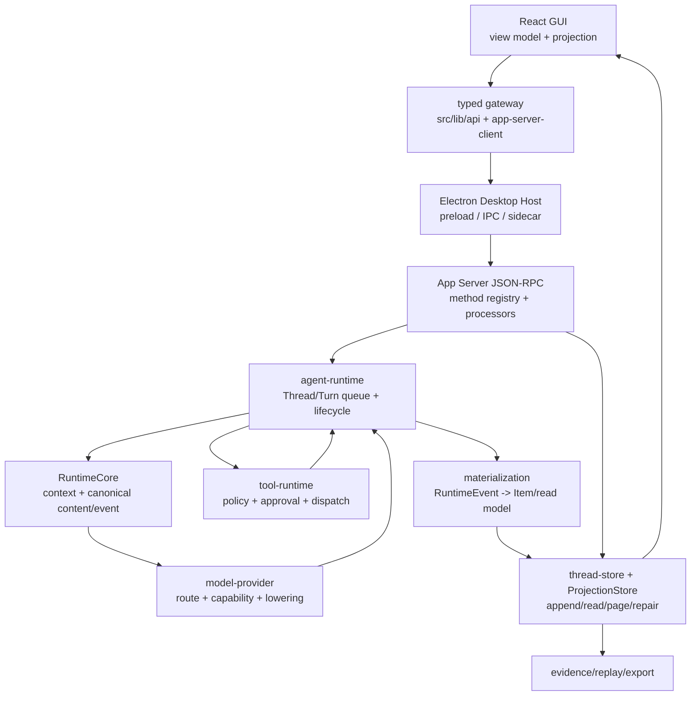

# v2 目标架构

> status: target architecture
> owner: runtime-architecture
> last_verified: 2026-07-18
> reference: Codex `2e4f5560`, OpenCode `08fb4737`

## 一句话

Lime 只保留一条桌面产品链：Electron 负责宿主，App Server 负责业务协议，RuntimeCore/agent-runtime 负责执行，model-provider/tool-runtime 负责能力，ThreadStore/ProjectionStore 负责可恢复事实，React 只消费 typed projection。

## 分层



## 依赖方向

```text
protocol/schema
  -> agent-protocol / runtime-core
  -> agent-runtime / model-provider / tool-runtime / thread-store
  -> app-server processor and read model
  -> typed client / renderer projection
  -> GUI
```

允许的反向数据仅限 typed request/response 和 notification；禁止实现层反向依赖：

- Renderer 不导入 provider wire、数据库或工具执行实现。
- Electron 不保存 Thread/Turn/Item，不解释模型 stream。
- App Server handler 不拼 provider body，不实现工具权限。
- `model-provider`、`tool-runtime`、`thread-store` 不依赖 App Server、Electron 或 React。
- GUI cache、stream buffer、optimistic state 不得写回 runtime truth。

## 读写路径

### 写路径

```text
用户操作
  -> GUI command/view model
  -> typed gateway
  -> App Server method
  -> agent-runtime command
  -> canonical event append
  -> materialization + notification
```

### 读路径

```text
ThreadStore/ProjectionStore
  -> App Server read method / notification delta
  -> typed client normalization
  -> pure GUI projection
  -> Message/Timeline/Workbench
```

GUI 不从写请求响应拼接 transcript；写请求只返回接受/拒绝/ID，最终状态从 notification 和 read model 读取。

## GUI 专属适配

Codex 的 TUI facade 在 Lime 中对应 `src/lib/api/*` 和 GUI view model，但表现层必须拆成：

1. `CommandModel`：输入、快捷操作、approval 响应和本地选择。
2. `RuntimeProjection`：Thread/Turn/Item、queue、tool、media、artifact 的纯投影。
3. `SceneComposition`：聊天、时间线、工作台和右侧面板的布局组装。
4. `HostCapability`：窗口、文件选择、通知、外链和 sidecar 状态。

这些层不能互相取代。尤其不能把 `SceneComposition` 变成第二个 runtime，也不能把 `HostCapability` 变成业务 gateway。

## 终态和失败路径

所有执行路径都必须显式 materialize：

```text
accepted -> started -> (queued | running)
running -> completed
running -> failed(error)
running -> interrupted(reason)
queued -> cancelled
stale event -> ignored + diagnostic
resume -> hydrate canonical history -> new turn
```

固定 timeout 不能生成终态；renderer 不能因窗口卸载而“假设取消”。

## 结构清理目标

| 现状                                | v2 目标                                                                                       |
| ----------------------------------- | --------------------------------------------------------------------------------------------- |
| `catalog.rs` 2698 行集中所有 method | domain declarations + 生成总 catalog；单文件只保留导出入口                                    |
| `runtime.rs` 710 行                 | 组装、依赖注入和 re-export；业务落到 runtime 子模块                                           |
| `dispatch.rs` 725 行                | method 到 processor 的薄映射；无业务分支                                                      |
| `AgentChatWorkspace.tsx` 13 行      | 公共入口只委托 `useAgentChatWorkspaceRuntime`；scene/command/projection 由 current owner 组合 |
| 多个 content/event mapper           | 一个 provider-neutral LLM contract + 一个 materialization owner                               |

Workspace GUI 的 current 组合链固定为：

```text
AgentChatWorkspace
  -> useAgentChatWorkspaceRuntime
  -> useAgentChatWorkspaceEntryRuntime
  -> useAgentChatWorkspaceSetupRuntime
  -> useAgentChatWorkspaceCommandRuntime
  -> useAgentChatWorkspaceSceneRuntime
```

主 runtime 只编排这四个 Hook，不保存第二套 Thread/Turn/Item truth；owner 返回值只在当前 render 内向下游投影，不写回 runtime store。

## 迁移原则

先复制 Codex 已验证的协议/状态/测试骨架，再将 Lime 专属能力（多 provider、媒体、artifact、工作台）接入明确扩展点。任何扩展若无法落入某个扩展点，先修改目标架构，不在现有文件旁边再开一条平行路径。
