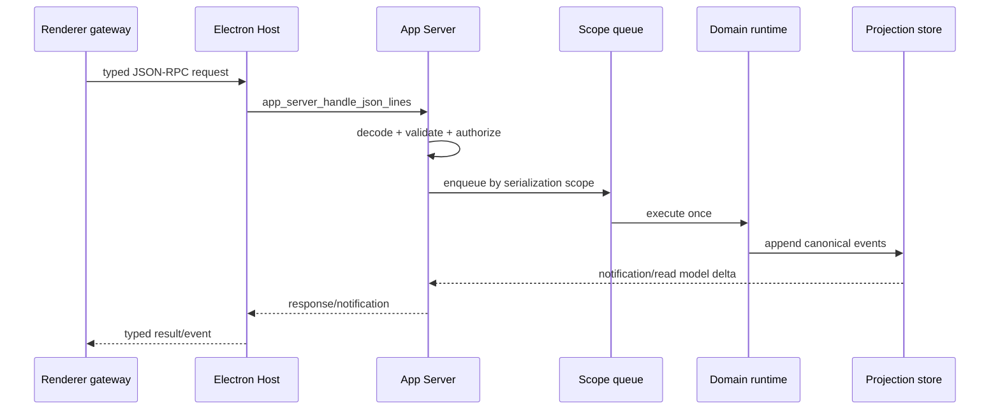

# Protocol 与跨层契约

> status: target contract
> owner: app-server-protocol
> last_verified: 2026-07-12
> codex_reference: `app-server-protocol/src/protocol/common.rs`

## 单一声明源

当前 `v0/catalog.rs` 已有 method 和 serialization scope，但 2698 行集中表会继续成为新的巨型事实源。v2 改为：

```text
domain method declaration
  -> generated AppServerMethod enum/catalog
  -> generated schema fixtures
  -> Rust client + TypeScript client
  -> command catalog / contract tests
```

每个 domain 只声明自己的 method、params、response、notification、scope 和权限；总 catalog 只由生成器产出，不允许手工复制列表。

## Method 定义最小字段

```text
method
kind: request | notification
params type
response type
serialization scope
owner domain
read/write classification
experimental/deletion status
```

`scope` 采用 Codex 语义：Thread、process、project shell、MCP OAuth/resource、browser session、filesystem mutation 等。scope 是并发合同，不是 UI 节流提示。

## Request 生命周期



请求响应只确认操作接受、拒绝或结果；streaming 的生命周期必须由 notification/read model 证明。

## Thread/Turn/Item 协议裁决

研发期直接以 Codex 语义替换旧 `agentSession/*` 命名：

- `Thread`：长期会话、父子关系、历史、恢复、分页。
- `Turn`：一次执行边界，包含 accepted/started/queued/completed/failed/interrupted。
- `Item`：可持久化、可更新、可投影的 user/assistant/reasoning/tool/approval/media/artifact/sub-agent 单元。

不建立 `agentSession` 与 `thread` 两套 DTO。若现有 consumer 仍使用旧名称，迁移调用点后删除旧类型和测试 fixture；没有外部协议约束，不保留 rename wrapper。

## Item ID 与序列

- 新写入 Item ID 必须带 domain prefix，避免跨 provider/tool/media 冲突。
- 每个 Item 必须含 `thread_id`、`turn_id`、`item_id`、`sequence/ordinal`、`kind` 和 terminal 状态（若适用）。
- 历史读取可宽松解析旧 ID，但重新写入必须 canonicalize。
- GUI 不能以数组索引、文本 hash 或时间戳替代稳定 ID。

## Schema/Client 同步门

协议改动同一变更集必须更新：

1. Rust method/params/result/notification。
2. JSON Schema 和 generated TypeScript。
3. `packages/app-server-client` 与 `src/lib/api` typed gateway。
4. Electron preload/IPC 白名单（仅涉及宿主转发时）。
5. catalog、fixture、负向 legacy guard。

最小验证：`npm run test:contracts`；若影响 runtime，再加 `npm run smoke:agent-runtime-current-fixture`。

## 删除门

删除 method 时必须证明：零生产引用、零正向 fixture、零 client export、零 i18n 文案；保留的唯一字符串只能出现在 `legacySurfaceCatalog` 或负向测试中。
