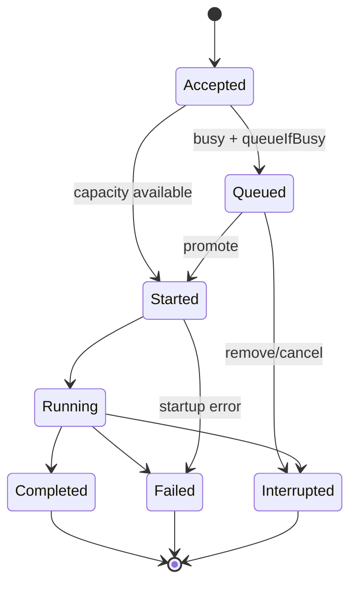

# Runtime 生命周期与状态机

> status: target runtime contract
> owner: agent-runtime
> last_verified: 2026-07-12
> codex_reference: `core/src/session/**`, `core/src/tasks/**`

## Thread 状态

```text
new -> active -> idle
active -> archived
active -> deleted
active -> recovering -> active
```

Thread 状态不等于当前 Turn 状态。Thread 可在有历史的情况下没有 active Turn，也可在 queue 中有待执行 Turn。

## Turn 状态



Codex `TurnStatus` 的 `Completed/Interrupted/Failed/InProgress` 是协议层终态；Lime 可增加 `Accepted/Queued/Started` 事件，但不能用 `loading` 或固定 timeout 替代终态。

## Turn 执行骨架

```text
start turn
  -> hydrate thread + context window
  -> resolve model capability and tool policy
  -> build bounded context fragments
  -> sample provider stream
  -> normalize LLM events
  -> materialize message/reasoning/tool/media items
  -> execute tool / approval / MCP when requested
  -> append canonical event and project
  -> emit terminal turn event
```

这段骨架优先复制 Codex `session/turn.rs` 和 `tasks` 的结构；provider lowering 由 `model-provider` 负责，GUI 不参与循环。

## Queue 与并发

- Thread scope 的 Turn 请求 FIFO；同一 Thread 不能并行写历史。
- 不同 Thread 可并行；process/browser/MCP/filesystem mutation 使用各自 scope。
- `steer` 是当前 Turn 的输入队列，不是新 Thread。
- inter-agent mailbox 与 user input queue 分开，避免用户输入被子 agent 消息抢占。
- queue remove/promote 必须产生可持久化结果，不能只改 Renderer 数组。

## 过期事件（stale event）

事件应用前校验 `(thread_id, turn_id, item_id, sequence)`：

```text
older sequence       -> ignore + diagnostic
different turn       -> ignore + diagnostic
terminal after new turn -> ignore; never stop new stream
duplicate event      -> idempotent no-op
```

这条规则必须在 Rust projection 和 TS projection 各有单测；任何一侧靠“通常不会发生”都不算完成。

## Approval 与工具循环

工具调用分为：

```text
tool requested -> policy evaluated -> approval pending (optional)
  -> approved/declined/cancelled
  -> execution started -> delta/result/error
  -> Item completed -> model continuation
```

审批是 runtime control state；GUI 只显示 projection 并提交 typed decision。Electron 系统权限是另一层 host capability，不能混成同一个布尔值。

## Resume / fork / recovery

恢复流程必须是：

```text
load canonical Thread metadata
  -> load paginated turns/items
  -> repair incomplete event/rollout record
  -> rebuild projection
  -> mark unfinished Turn as interrupted/recoverable
  -> optionally start a new Turn
```

不要从 GUI transcript 反推未完成 Turn；不要把 rollout JSONL 直接挂成 live store。

## Multi-agent

复制 Codex `AgentControl`、graph edge、budget、mailbox 和 canonical sub-agent Item 语义：

- parent/child edge 持久化在 `thread-store`。
- spawn/send/wait/resume/close 是 Thread/Turn 控制面方法。
- GUI 显示 `SubAgentActivity` projection，不拥有并发调度。
- 子 agent 失败、超时或关闭要回传父 Turn 的结构化 Item。

## 删除目标

以下实现不能进入 v2 target：

- React hook 内的独立 turn queue、terminal synthesizer、retry loop。
- `agent_runtime_*` production command loop。
- 以 session 全局单例承接 approval/input 的旧状态机。
- 依赖自然语言正文判断 reasoning/tool/final 的 parser。
