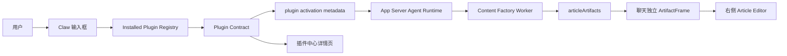
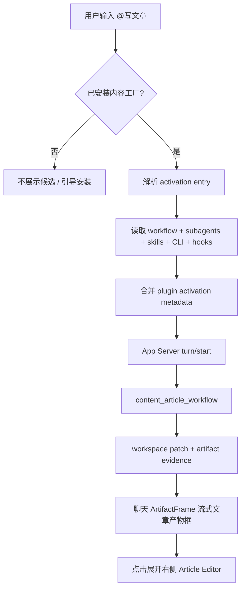

# Writing 架构设计

更新时间：2026-06-29
状态：In Progress

## 1. 一句话架构

```text
Content Factory Plugin
  -> plugin.json
  -> app.runtime.yaml / app.workbench.yaml
  -> activationEntries / defaultPrompt
  -> content_article_workflow
  -> subagents + skillRefs + CLI + connectors + hooks
  -> App Server Agent Runtime
  -> articleDraft artifact / workspace patch
  -> Claw ArtifactFrame(articleArtifacts renderer)
  -> Right Surface Article Editor
```

## 2. 系统上下文



## 3. 分层边界

| 层                 | 责任                                                                                                             | 不允许                                   |
| ------------------ | ---------------------------------------------------------------------------------------------------------------- | ---------------------------------------- |
| 内容工厂插件       | 按 Lime Plugin Package v1 声明入口、workflow、subagents、skills、CLI、connectors、hooks、article renderer 契约。 | 直接控制 Lime 右侧栏布局。               |
| Lime 插件 contract | 读取并归一化插件包能力。                                                                                         | 为内容工厂 hard code 入口或默认能力。    |
| Claw 输入框        | 从 installed registry 生成 `@` 候选并发送 metadata。                                                             | 未安装时伪造 `@写文章`。                 |
| App Server Runtime | 执行 turn、注入 plugin activation context、保存 read model。                                                     | 让前端 mock 代替 worker 结果。           |
| 内容工厂 worker    | 执行写作 workflow，产出 workspace patch 和 evidence。                                                            | 输出无法物化的长文本聊天正文。           |
| 聊天消息区         | 展示运行状态和独立 `ArtifactFrame`；文章 renderer 可在框内完整流式输出。                                         | 把完整正文散落到普通 assistant message。 |
| Right Surface      | 承载 Article Editor、编辑动作、历史恢复。                                                                        | 直接调用 provider 或插件私有文件系统。   |
| Article Workspace  | 插件工作区事实、调度桥、历史恢复输入。                                                                           | 恢复旧 Profile 命名或兼容入口。          |

## 4. 插件包事实源

插件包标准见 [Lime Plugin Package v1](../../tech/plugin/lime-plugin-package-v1.md)。内容工厂插件必须以 `plugin.json` 作为唯一入口，并通过分层能力文件声明写作能力：

```yaml
plugin.json:
  contributions:
    runtime: ./app.runtime.yaml
    workbench: ./app.workbench.yaml
    skills: ./skills
    subagents: ./subagents
    clis: ./clis/clis.json
    connectors: ./connectors/connectors.json
    hooks: ./hooks
app.runtime.yaml:
  activationEntries:
    - key: content_article_generate
      aliases: ["@写文章", "@写作"]
  workflows:
    - key: content_article_workflow
      steps:
        - id: research
          subagent: content-researcher
          skillRefs: [article-research]
        - id: strategy
          subagent: content-strategist
          skillRefs: [article-strategy]
        - id: draft
          subagent: article-writer
          skillRefs: [article-writing]
app.workbench.yaml:
  productionObjects:
    - kind: articleDraft
  artifactFrames:
    - key: article-artifact-frame
      renderer: articleArtifacts
      openTarget: article-editor
  articleArtifacts:
    - kind: articleDraft
      renderer: article-editor
      frame: article-artifact-frame
```

宿主只消费这些标准事实源，不内置内容工厂写作入口。

## 5. 数据模型

### 5.1 plugin activation metadata

```ts
type WritingPluginActivationMetadata = {
  plugin_activation: {
    source: "plugin_explicit_mention";
    trigger: "@写文章" | "@写作" | "@内容工厂";
    plugin_id: "content-factory-app";
    active_entry_key: "content_article_generate";
    workflow_key: "content_article_workflow";
    workflow?: {
      key: string;
      steps: Array<{ id: string; subagent?: string; skillRefs?: string[] }>;
    };
    subagents?: Array<{ id: string; title: string; skills?: string[] }>;
    skill_refs?: Array<{ id: string; title: string }>;
    cli_refs?: Array<{ id: string; title?: string }>;
    connector_refs?: Array<{ id: string; title?: string }>;
    hook_policy?: { prompt?: string[]; tool?: string[]; task?: string[] };
    default_prompts?: string[];
  };
};
```

### 5.2 workspace patch

```ts
type ArticleWorkspacePatch = {
  pluginId: "content-factory-app";
  primaryObjectRef: {
    pluginId: "content-factory-app";
    objectKind: "articleDraft";
    objectId: string;
    artifactIds: string[];
  };
  objects: Array<{
    objectKind: "articleDraft";
    title: string;
    status: "running" | "ready" | "needs_review" | "failed";
  }>;
};

type ArticleArtifact = {
  artifactKind: "articleDraft";
  rendererKind: "article-editor";
  title: string;
  summary: string;
  status: "running" | "ready" | "needs_review" | "failed";
  document: {
    format: "markdown" | "artifact_document.v1";
    body: string;
  };
  researchRounds: Array<{ title: string; sourceCount: number }>;
  citations: Array<{ title: string; url?: string }>;
  imageSlots: Array<{ id: string; title: string; prompt: string }>;
};

type ArtifactFrameContract = {
  frameKind:
    | "document"
    | "image_set"
    | "table"
    | "presentation"
    | "webpage"
    | "report"
    | "code"
    | "media";
  rendererKind: string;
  title: string;
  status: "streaming" | "ready" | "needs_review" | "failed";
  bodyMode: "streaming_full" | "summary" | "gallery" | "preview";
  openTarget?:
    | "article-editor"
    | "artifact-viewer"
    | "media-viewer"
    | "browser-preview";
};
```

## 6. 运行流程图



## 7. 部署边界

| 仓库                                                         | 责任                                                                                                                                                           |
| ------------------------------------------------------------ | -------------------------------------------------------------------------------------------------------------------------------------------------------------- |
| `/Users/coso/Documents/dev/ai/limecloud/content-factory-app` | 内容工厂插件包、`plugin.json`、runtime yaml、workbench yaml、skills、subagents、CLI、connectors、hooks、worker、workflow 文档和插件验证。                      |
| `/Users/coso/Documents/dev/ai/aiclientproxy/lime`            | 插件安装态读取、manifest normalize、plugin contract、输入栏建议、activation metadata、ArtifactFrame、articleArtifacts、Article Editor、GUI / Playwright 验证。 |

## 8. 架构风险

| 风险                        | 约束                                                                                              |
| --------------------------- | ------------------------------------------------------------------------------------------------- |
| 宿主继续 hard code 内容工厂 | 所有 `@写文章`、workflow、subagent 断言绑定 manifest fixture / installed registry。               |
| worker 只返回长正文         | schema 和测试要求返回 workspace patch、artifact、workerEvidence。                                 |
| 插件中心只显示营销卡片      | 详情页必须投影 subagents、CLI tools、connectors、hooks、authorization、skills。                   |
| 未登录阻断本地插件          | marketplace auth error 和 installed registry 分离。                                               |
| 右侧栏被插件重建            | 右侧 dock 由 Host 管理，插件只声明 article renderer / surface contract。                          |
| 旧 Profile 路径回流         | 旧 Profile 路径归类为 dead；文章用户界面和内部工作区都必须走 Article Workspace / Article Editor。 |
