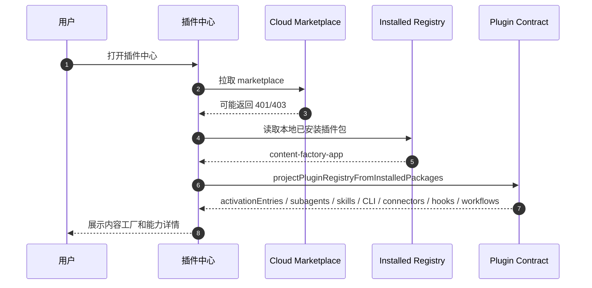
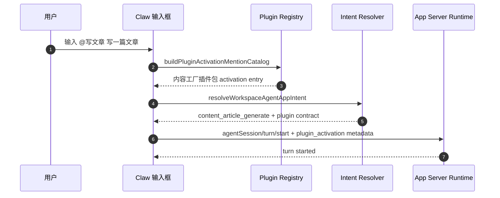
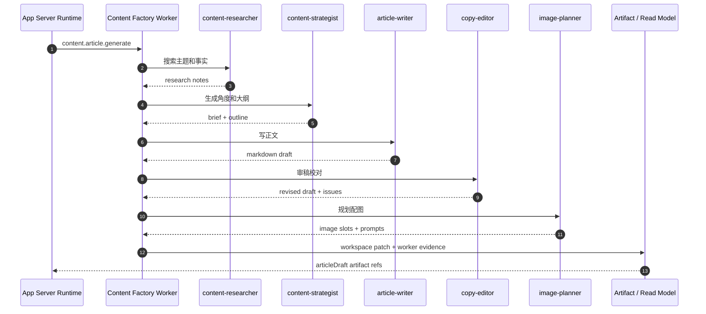
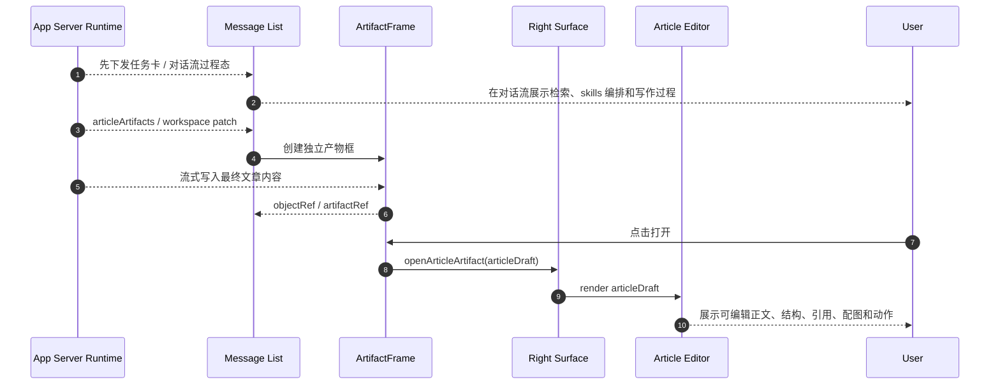

# Writing 时序图

更新时间：2026-06-30
状态：In Progress

## 1. 插件中心安装态展示

```mermaid
sequenceDiagram
  autonumber
  participant User as 用户
  participant Page as 插件中心
  participant Cloud as Cloud Marketplace
  participant Installed as Installed Registry
  participant Contract as Plugin Contract

  User->>Page: 打开插件中心
  Page->>Cloud: 拉取 marketplace
  Cloud-->>Page: 可能返回 401/403
  Page->>Installed: 读取本地已安装插件包
  Installed-->>Page: content-factory-app
  Page->>Contract: projectPluginRegistryFromInstalledPackages
  Contract-->>Page: activationEntries / subagents / skills / CLI / connectors / hooks / workflows
  Page-->>User: 展示内容工厂和能力详情
```

## 2. `@写文章` 激活

```mermaid
sequenceDiagram
  autonumber
  participant User as 用户
  participant Composer as Claw 输入框
  participant Registry as Plugin Registry
  participant Intent as Intent Resolver
  participant Runtime as App Server Runtime

  User->>Composer: 输入 @写文章 写一篇文章
  Composer->>Registry: buildPluginActivationMentionCatalog
  Registry-->>Composer: 内容工厂插件包 activation entry
  Composer->>Intent: resolveWorkspaceAgentAppIntent
  Intent-->>Composer: content_article_generate + plugin contract
  Composer->>Runtime: agentSession/turn/start + plugin_activation metadata
  Runtime-->>Composer: turn started
```

## 3. 写作 workflow 执行

```mermaid
sequenceDiagram
  autonumber
  participant Runtime as App Server Runtime
  participant Worker as Content Factory Worker
  participant Research as content-researcher
  participant Strategy as content-strategist
  participant Writer as article-writer
  participant Editor as copy-editor
  participant Image as image-planner
  participant Store as Artifact / Read Model

  Runtime->>Worker: content.article.generate
  Worker->>Research: 搜索主题和事实
  Research-->>Worker: research notes
  Worker->>Strategy: 生成角度和大纲
  Strategy-->>Worker: brief + outline
  Worker->>Writer: 写正文
  Writer-->>Worker: markdown draft
  Worker->>Editor: 审稿校对
  Editor-->>Worker: revised draft + issues
  Worker->>Image: 规划配图
  Image-->>Worker: image slots + prompts
  Worker->>Store: workspace patch + worker evidence
  Store-->>Runtime: articleDraft artifact refs
```

## 4. ArtifactFrame 到右侧 Article Editor

```mermaid
sequenceDiagram
  autonumber
  participant Runtime as App Server Runtime
  participant Chat as Message List
  participant Frame as ArtifactFrame
  participant Surface as Right Surface
  participant Editor as Article Editor

  Runtime-->>Chat: 先下发任务卡 / 对话流过程态
  Chat-->>User: 在对话流展示检索、skills 编排和写作过程
  Runtime-->>Chat: articleArtifacts / workspace patch
  Chat->>Frame: 创建独立产物框
  Runtime-->>Frame: 流式写入最终文章内容
  Frame-->>Chat: objectRef / artifactRef
  User->>Frame: 点击打开
  Frame->>Surface: openArticleArtifact(articleDraft)
  Surface->>Editor: render articleDraft
  Editor-->>User: 展示可编辑正文、结构、引用、配图和动作
```

## 5. 历史恢复

```mermaid
sequenceDiagram
  autonumber
  participant User as 用户
  participant Sidebar as 历史列表
  participant Runtime as agentSession/read
  participant Workspace as Plugin Workspace
  participant Surface as Right Surface

  User->>Sidebar: 打开历史写作会话
  Sidebar->>Runtime: read session
  Runtime-->>Sidebar: messages + artifacts + plugin workspace
  Sidebar->>Workspace: hydrate content-factory Article Workspace facts
  Workspace-->>Sidebar: selected articleDraft
  Sidebar->>Surface: open articleArtifact(articleDraft)
  Surface-->>User: 恢复右侧文章草稿
```

## 6. 继续改写

```mermaid
sequenceDiagram
  autonumber
  participant User as 用户
  participant Editor as Article Editor
  participant Action as Surface Action Router
  participant Runtime as App Server Runtime
  participant Worker as Content Factory Worker

  User->>Editor: 点击继续改写
  Editor->>Action: revise(articleDraftRef, instruction)
  Action->>Runtime: agentSession/action/respond
  Runtime->>Worker: content.article.revise
  Worker-->>Runtime: updated articleDraft artifact
  Runtime-->>Editor: 新版本 / workspace patch
```
