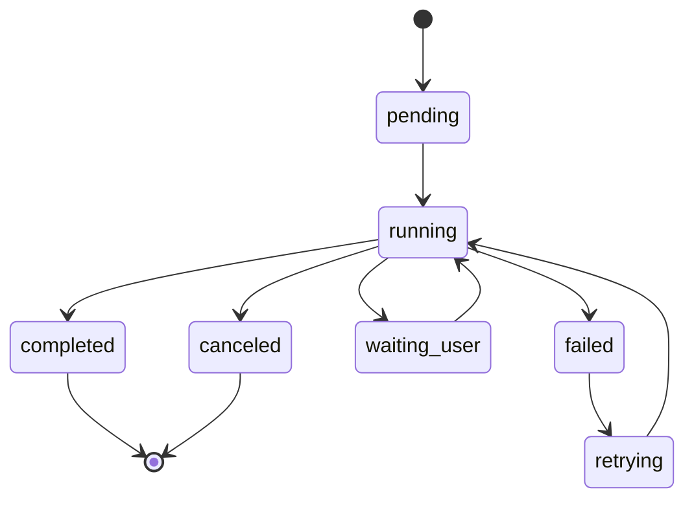
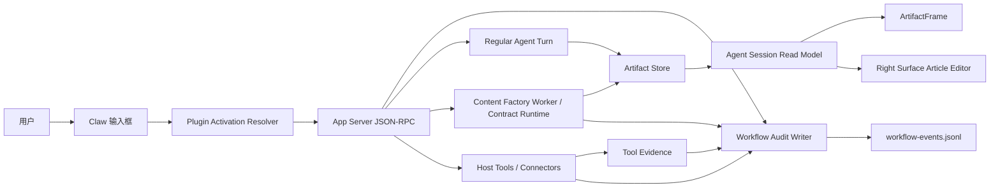
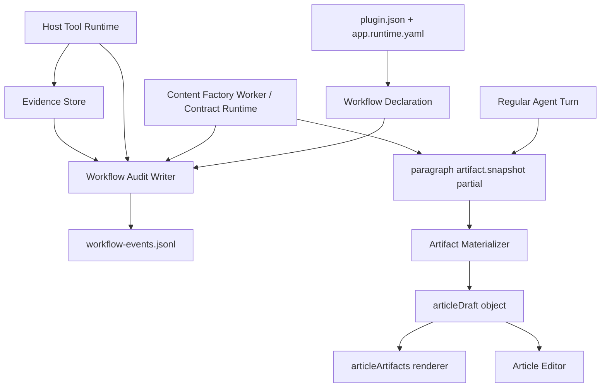
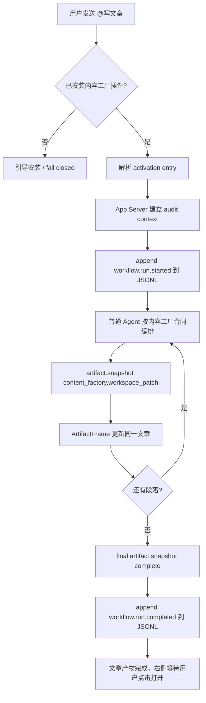
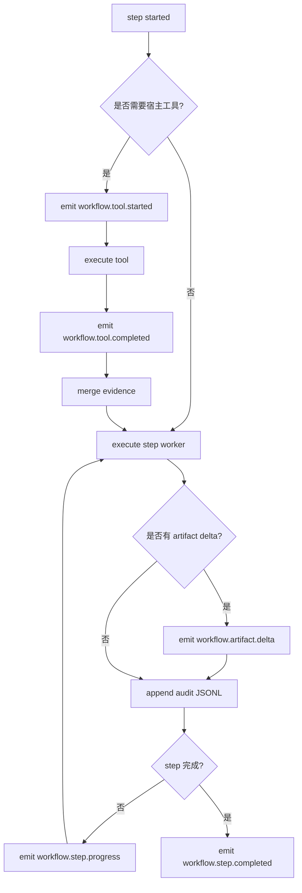
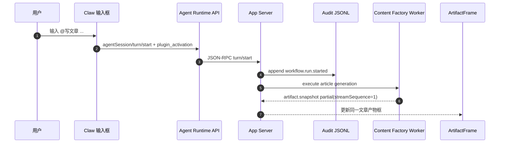
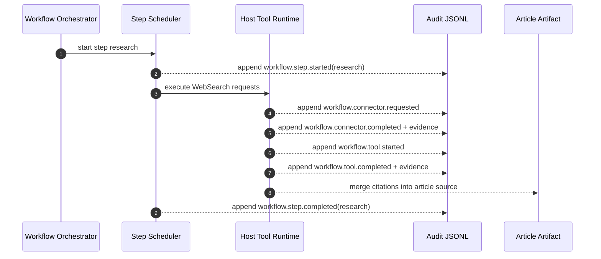
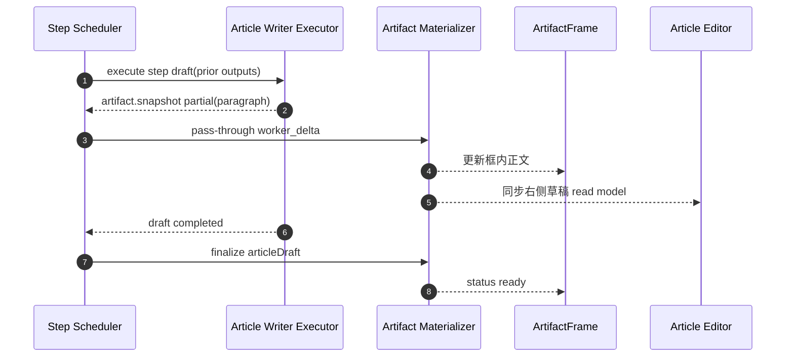
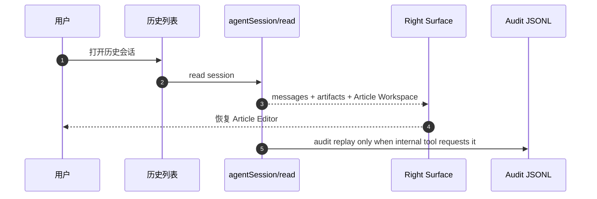

# Writing v2 产品需求

更新时间：2026-07-05
状态：Draft + ordinary Agent turn orchestration current-turn verified + Electron/CDP real desktop baseline verified + host tool evidence contract added + inline host command shortcode contract added

## 1. 背景

Writing v1 已经把内容工厂写文章链路的产品形态收敛到 Lime Plugin Package v1：用户可以通过 `@写文章` 激活内容工厂插件形态，最终目标是产出 `ArtifactFrame(articleArtifacts)`，并在右侧 Article Editor 中继续编辑文章。

截至 2026-07-05，Writing v2 已经有 Worker 接口规范、前端 Article Editor / Workspace UI、外部内容工厂包、App Server current-turn fixture 证据、host tool evidence 证据和真实 Electron/CDP baseline 证据；最新后端修复已让普通 `@写文章` current-turn smoke 从 `artifact.snapshot=0` 恢复到 `artifactSnapshotCount=7`，CDP baseline 也已证明 `agentSession/turn/start` 经 `electron-ipc` 进入真实桌面并展示文章产物。但 Electron/CDP product acceptance、live Provider production flow 和远程安装签名闭环仍未完成。`src/features/plugin/testing/fixtures` 只能用于测试和审计证据，不能作为 production current 实现；真实产品完成不能依赖 mock worker、fixture provider 或右侧 worker fast path。

当前最大缺口不在右侧栏宽度，而在流式产物、执行卡片和审计边界：用户发起写作后，界面不能只出现一个最终文章卡，也不能把内部 workflow 流程轨塞到右侧。用户面需要的是资料检索 / 网络搜索这类必要过程以可展开执行卡片出现，文章正文按段落持续进入同一个产物框；完整 workflow 步骤只作为后台 JSONL 审计记录留存。

v2 要解决的问题是：写文章这类长任务必须先保留普通 Agent 对话体验，再由内容工厂 Plugin / workflow contract 编排产物和审计。用户需要看到自然引导、思考 / 工具过程、文章产物和完成总结；宿主把 workflow 过程写入可审计 JSONL，而不是靠 fixture 最终 response 一次性投影，也不是把内容工厂写作逻辑内置到 App Server 宿主里，更不是把 workflow 步骤列表塞进右侧编辑器。

## 1.1 2026-07-05 最新主线校正

- `@写文章` 的首发回合必须走普通 `agentSession/turn/start`，不能由 Plugin worker 或右侧 pane/action fast path 接管。
- 内容工厂插件负责声明 `workflow_contract`、host tool request、artifact/workspace patch 合同和 shortcode 合同；普通 Agent turn 负责对话节奏、自然说明和编排执行。
- 生成前必须有自然引导 / 思考 / 工具过程。占位框不能一闪而过，也不能在 artifact 未生成时把 turn 标记成完成。
- App Server 必须在最终 `turn.completed` 前完成内容工厂 `artifact.snapshot` materialization；terminal 后再补 artifact 会被事件存储丢弃，历史恢复也会丢产物。
- 当前实现策略是暂存普通 backend 的 `turn.completed`，在 terminal 前完成内容工厂 artifact / host tool timeline / JSONL audit 后再封口；这保持普通 Agent 对话主链，不新增右侧 worker 首发分支。
- 聊天区不得显示 raw JSON、`.lime/artifacts/content-factory/workspace-patch.json` 文件卡、内部 workflow step 列表或固定模板文案。
- 右侧 Article Workspace 不自动打开；只有用户点击文章产物或显式打开动作才进入右侧。
- 审计只写 `workflow-events.jsonl`，并保持 metadata-only 脱敏；未来审计读取 JSONL，不从 UI 偷读内部 payload。

## 2. 当前问题诊断

| 问题               | 现象                                                       | 根因                                                                             |
| ------------------ | ---------------------------------------------------------- | -------------------------------------------------------------------------------- |
| 过程不可见         | 用户等待较久后看到一批输出同时出现。                       | worker stdout 以最终 JSON response 为主，App Server 等 worker 完成后才投影事件。 |
| 正文流式不真实     | 看起来像“流式”，但可能是最终正文完成后再切片回放。         | 增量不在 producer 侧产生，缺少稳定 artifact ref + sequence 的 partial snapshot。 |
| workflow UI 过重   | 右侧编辑器展示步骤会挤占写作主体验。                       | workflow 被当成用户界面模型，而不是后台审计模型。                                |
| 过程状态不可靠     | 有时能看到 hook / connector evidence，有时像最终结果摘要。 | 过程来自 workerEvidence 和 artifact patch 解析，不是统一审计事件。               |
| 历史恢复缺审计语义 | 可恢复文章和编辑稿，但无法独立审计当时步骤、工具和失败点。 | 没有 append-only workflow JSONL audit log。                                      |

## 3. 目的

1. 用户输入 `@写文章` 后，先看到普通 Agent 的自然引导和过程说明，再看到资料检索 / 网络搜索执行卡片和同一个文章产物框开始按段落增长，而不是等待最终长回复或假完成。
2. 右侧 Article Editor 只承载文章编辑体验，不展示 workflow step / task card / 流程轨。
3. App Server 和 worker 保持生成期增量事件合同：partial snapshot 由 producer 发出，最终 snapshot 只负责完成态和历史恢复。
4. workflow run / step / tool / connector / hook / evidence 事件进入 append-only JSONL，用于未来审计、排障和质量复盘。
5. 最终文章仍进入独立 `ArtifactFrame(articleArtifacts)` 和右侧 Article Editor，不回退普通聊天长文，也不夹带 workflow 步骤 UI。

## 4. 收益

| 角色        | 收益                                                                               |
| ----------- | ---------------------------------------------------------------------------------- |
| 普通用户    | 能持续看到文章正文按段落生成，等待有反馈，但不被 workflow 步骤列表打断。           |
| 内容创作者  | 右侧保持聚焦文章编辑、引用和配图，不被后台编排状态占用空间。                       |
| 插件开发者  | 只需要按 artifact partial / final snapshot 合同输出产物，workflow 细节留给审计层。 |
| Lime 宿主   | 长任务过程以 JSONL 留痕，后续可用于排障、评估和回放。                              |
| 运营 / 支持 | 可从 workflow JSONL 追踪失败点、耗时和工具 evidence，降低黑盒问题。                |

## 5. 产品原则

1. **主链可解释**：用户面需要可展开执行卡片和文章产物持续增长，不需要右侧 workflow 步骤 UI。
2. **普通 turn 真编排**：`@写文章` 必须走普通 Agent turn；正文 partial 可以来自内容工厂插件包、host-managed generation 或受控后处理，但不能绕过对话流，也不能由最终正文回切伪流式。
3. **稳定引用**：所有 partial 使用稳定 `artifactRef` 和递增 `streamSequence` 更新同一个文章 artifact。
4. **审计分离**：workflow run、step、tool、connector、hook、evidence、耗时和失败码只追加到 JSONL audit log。
5. **恢复聚焦产物**：普通历史恢复只恢复消息、ArtifactFrame 和右侧 Article Editor；审计回放另走后台工具。
6. **失败不伪造成功**：任何生成失败都不能生成假完成状态或空白 Article Editor，失败细节进入 JSONL。

## 6. 用户故事

| 编号     | 用户故事                                                  | 验收                                                                        |
| -------- | --------------------------------------------------------- | --------------------------------------------------------------------------- |
| W2-US-01 | 作为用户，我输入 `@写文章` 后，希望先看到 Agent 正在接手和思考，再看到文章开始生成。 | 发送后出现自然引导、资料检索 / 网络搜索执行卡片和同一个文章产物框，并开始接收段落级 partial。 |
| W2-US-02 | 作为用户，我希望右侧专注文章编辑。                        | 右侧 Article Editor 不显示 workflow 步骤、任务卡或流程轨。                  |
| W2-US-03 | 作为用户，我希望正文不是突然整篇出现。                    | draft 期间通过分段 snapshot / artifact delta 更新同一 `ArtifactFrame`。     |
| W2-US-04 | 作为用户，我从历史打开会话时，希望看到文章和编辑稿。      | 历史恢复包含最终文章、ArtifactFrame 和右侧 Article Editor，不恢复步骤列表。 |
| W2-US-05 | 作为用户，我希望失败时看到简洁失败状态。                  | 用户面显示生成失败 / 可重试；详细 step、tool、失败码写入 JSONL。            |
| W2-US-06 | 作为平台维护者，我希望能定位慢在哪个步骤。                | workflow JSONL 记录每个步骤开始、完成、耗时、工具调用和 artifact refs。     |
| W2-US-07 | 作为插件开发者，我希望输出增量产物，不写宿主 UI。         | 插件 worker 输出稳定 artifact partial / final snapshot，宿主负责投影。      |

## 7. 用户用例

### UC-01：标准写文章

1. 用户输入 `@写文章 帮我写一篇关于 AI Agent 工作流的公众号文章`。
2. 输入栏命中内容工厂插件 activation entry。
3. 发送后进入普通 Agent turn，Agent 先自然说明将按内容工厂流程编排。
4. App Server 建立后台 audit context，并在 `turn.completed` 前 materialize 同一 article artifact 的段落级 partial snapshot。
5. 聊天区同一个 `ArtifactFrame(articleArtifacts)` 持续增长，不新增多个文章卡。
6. WebSearch / connector / strategy / review / image-plan 等过程写入 workflow JSONL，不进入右侧。
7. final snapshot 到来后，聊天区文章产物进入完成态。
8. 用户点击产物框，右侧 Article Editor 打开同一篇文章。

### UC-02：搜索步骤耗时较长

1. research step 发起多个搜索请求。
2. 每个 tool call 开始 / 完成时追加到 workflow JSONL。
3. 用户面展示必要的资料检索 / 网络搜索执行卡片，但不展示 research step 流程轨。
4. 如果 draft 已有段落，段落继续进入同一个 `ArtifactFrame`。
5. 搜索完成后的引用和来源进入 articleDraft source，供 Article Editor 引用栏读取。

### UC-03：某一步失败后重试

1. draft step 执行失败。
2. 用户面显示写作失败或可重试状态，不展示 step 明细。
3. JSONL 记录失败点为 `draft`、失败码、retry attempt 和已完成 evidence。
4. 用户点击重试。
5. App Server 创建 retry attempt，只重跑必要步骤，不重建整个会话。

### UC-04：历史恢复

1. 用户从历史列表打开旧写作会话。
2. App Server 返回 messages、artifact refs 和 Article Workspace。
3. UI 恢复 `ArtifactFrame` 和右侧 Article Editor。
4. 如果 workflow 未完成或失败，用户面只恢复文章产物状态和可重试动作。
5. 审计工具可单独读取 workflow JSONL 回放步骤、工具和失败点。

## 8. 功能需求

### 8.1 Workflow audit context 创建

- `@写文章` 命中 installed plugin activation entry 后，App Server 可以在 turn accepted 阶段创建后台 `workflowAuditRun`，但该动作不能替代普通 Agent turn。
- `workflowAuditRun.workflowKey` 必须来自插件 manifest，例如 `content_article_workflow`。
- `workflowAuditRun.steps` 只用于审计和执行约束，不用于右侧 UI 展示。
- App Server 不允许内置内容工厂步骤 fallback；插件未声明 workflow key 或 steps 时，可以只记录最小 audit context，不能用宿主业务默认值补齐。
- audit context 创建失败不能阻塞普通 Agent 对话，但必须记录 fail-closed 审计错误，不能回退成无内容工厂产物的普通长文假完成。

### 8.2 Step 状态机

Step 状态机用于 JSONL 审计，不是右侧 Article Editor 的展示模型。



每个 step 至少支持：

- `pending`
- `running`
- `completed`
- `failed`
- `waiting_user`
- `canceled`

### 8.3 实时事件与 JSONL 审计

必须新增或收敛到以下事件语义：

| 事件                      | 触发时机                                   |
| ------------------------- | ------------------------------------------ |
| `workflow.run.started`    | turn 接受并创建 workflow run。             |
| `workflow.step.started`   | 某个步骤开始执行。                         |
| `workflow.run.retrying`   | run 因可重试失败进入下一次尝试。           |
| `workflow.step.retrying`  | 当前步骤因可重试失败进入下一次尝试。       |
| `workflow.step.progress`  | 长步骤输出阶段性进展。                     |
| `workflow.connector.requested` | worker 声明需要宿主 connector / 工具执行。 |
| `workflow.connector.completed` | 宿主 connector / 工具执行完成并产生 evidence。 |
| `workflow.tool.started`   | 宿主工具 / connector 开始执行。            |
| `workflow.tool.completed` | 宿主工具 / connector 完成并产生 evidence。 |
| `workflow.hook.started`   | 宿主或插件 hook 开始执行。                 |
| `workflow.hook.completed` | 宿主或插件 hook 完成，并写入状态 / 失败码。 |
| `workflow.artifact.delta` | 文章正文、结构、引用或配图规划增量更新。   |
| `workflow.step.completed` | 某个步骤完成并写入 outputs。               |
| `workflow.step.failed`    | 某个步骤失败。                             |
| `workflow.run.completed`  | 所有必需步骤完成。                         |
| `workflow.run.failed`     | workflow 无法继续。                        |

这些事件默认只追加到 App Server 管理的 append-only JSONL audit stream，例如逻辑文件 `workflow-events.jsonl`。普通 `agentSession/read`、右侧 Article Editor 和用户历史恢复不直接渲染这些 step 事件；只有审计、排障、质量复盘或专门的内部工具读取。

### 8.4 Step executor 合同

Agent / worker 接收的是 step execution request，而不是整个自由任务：

```ts
type WorkflowStepExecutionRequest = {
  workflowAuditRunId: string;
  stepId: "research" | "strategy" | "draft" | "review" | "image-plan";
  workflowKey: "content_article_workflow";
  pluginId: "content-factory-app";
  input: {
    userPrompt: string;
    locale: string;
    priorStepOutputs: Record<string, unknown>;
    artifactRefs: string[];
  };
  constraints: {
    directProviderAccess: false;
    directFilesystemAccess: false;
    allowedToolRefs: string[];
    outputSchema: string;
  };
};
```

真实 worker 返回 step result：

```ts
type WorkflowStepExecutionResult = {
  workflowAuditRunId: string;
  stepId: string;
  status: "completed" | "failed" | "waiting_user";
  outputs: Record<string, unknown>;
  artifactDeltas?: Array<{
    artifactId: string;
    kind: "articleDraft" | "workspacePatch" | "workerEvidence";
    patch: unknown;
  }>;
  toolRequests?: Array<{
    toolRef: string;
    arguments: Record<string, unknown>;
  }>;
};
```

### 8.5 ArtifactFrame 和 Article Editor

- `ArtifactFrame` 继续作为最终文章产物框。
- 文章正文必须在最终 `turn.completed` 前通过段落级 `artifact.snapshot` partial 或 artifact delta 增量进入同一个 artifact read model。
- 普通 assistant message 可以承载寒暄、思考摘要、过程说明和完成总结，但不承载整篇文章正文。
- 右侧 Article Editor 读取同一份 articleDraft object。
- 右侧 Article Editor 不展示 workflow step、task card 或流程轨。
- Article Editor 的继续改写、补充搜索、生成配图等动作绑定 `articleDraftRef`；审计层可在服务端关联 `workflowAuditRunId`，但不把该字段变成右侧 UI 依赖。

### 8.6 聊天主链执行卡片

- 内容工厂插件必须在 `articleDraft.source.hostToolRequests[]` 暴露需要宿主执行的资料检索 / 网络搜索请求。
- `hostToolRequests[]` 是当前事实源，旧 `searchRequests[]` 只作为兼容输入保留。
- 宿主执行工具后，应把 `tool.started` / `tool.result` 投影为聊天主链里的可展开执行卡片，并显示在文章产物卡之前。
- 执行卡片只展示用户可理解的标题、参数摘要、结果摘要和来源；完整 payload、失败码和内部 workflow 细节进入 `workflow-events.jsonl`。
- streaming partial 中仍要保留 `hostToolRequests[]`，不能为了精简文章流式 payload 把工具请求剥掉。
- current-turn smoke 必须同时断言：streaming / final `artifact.snapshot` 保留 `hostToolRequests[]`，普通事件流包含宿主 `tool.started -> tool.args -> tool.result`，`agentSession/read.detail.items` 与 `thread_read.tool_calls` 投影出 completed `web_search` 工具项，`evidence/export` 可证明 `hostToolEvidence` 已回填。

### 8.7 文章内联 Host Command Shortcode

内容工厂插件可以在文章正文中输出结构化 host command shortcode，用来表达“这里需要宿主已有 `@` 命令补产物”。这不是裸正则替换，也不是 worker 直接执行命令；宿主必须先把 shortcode 解析为结构化 `hostCommandRequests[]`，再按命令目录和现有运行时授权执行。

首批自动执行范围只开放 `@配图`：

```md
[@配图 一张广州夏天午后的城市照片，阳光明亮，街边绿树和高楼，真实摄影风格，前景有广州塔珠江新城的花城大道]
```

宿主解析后生成等价请求：

```ts
type HostCommandRequest = {
  commandKey: "image_generate";
  commandName: "配图";
  prompt: string;
  usage: "document-inline";
  slotId: "article-image-slot-1";
  anchorSectionTitle?: string | null;
  anchorText?: string | null;
  presentation: {
    surface: "article_editor";
    replacement: "slot_marker";
  };
};
```

执行规则：

- shortcode 只允许出现在普通 Markdown 正文；代码块、inline code、Markdown link / image alt 中的 `[@...]` 不执行。
- 单篇文章默认最多自动处理 `3` 个 `@配图` shortcode；短文建议 `2` 张，长文建议 `3` 张，超出的 shortcode 保留原文供用户手动处理。
- 宿主把 shortcode 物化为 `<!-- lime:image-task-slot:<slotId> -->`，再通过既有 `image_command_intent.image_task` 进入 App Server `ImageCommandWorkflow`。
- slotId 必须基于正文中已有 `lime:image-task-slot:*` 分配下一个可用值；同一篇文章后续新增 `[@配图 ...]` 不得重新使用已存在的 slotId。
- 图片任务 running 时回填 `pending-image-task://...` 占位；completed 后按同一 `slotId` 替换为真实图片 URL。
- worker 不允许直接创建 `.lime/tasks/image_generate/*.json`，也不允许伪造 `tool.started / tool.result`。
- 其他 `@` 命令可以先进入 `hostCommandRequests[]` 文档合同，但自动执行必须等对应 runtime contract、授权、结果卡和 viewer 都接入后再开启。

### 8.8 历史恢复

普通用户历史恢复必须按以下优先级：

1. Article Workspace selected object
2. ArtifactFrame refs
3. articleDraft object ref
4. 纯聊天历史 fallback

如果 workflow 未完成，恢复文章产物的生成 / 失败状态和可重试动作；如果已完成，恢复 ArtifactFrame 和右侧 Article Editor。workflow step 历史只通过 JSONL 审计工具读取，不进入普通历史 UI。

## 9. 非功能需求

| 维度     | 要求                                                                                                          |
| -------- | ------------------------------------------------------------------------------------------------------------- |
| 首屏反馈 | turn accepted 后尽快出现文章产物框或首个段落 partial。                                                        |
| 对话体验 | `@写文章` 必须保留普通 Agent 的自然引导、过程说明和完成总结，不允许只显示 artifact 占位或 raw JSON。           |
| 过程延迟 | artifact partial 从 producer 到 UI 的可见延迟目标 < 1s。                                                      |
| 持久化   | artifact refs / workspace patch 必须可被 `agentSession/read` 恢复；workflow 事件必须可从 JSONL 审计日志读取。 |
| 可审计   | 每个 step 记录 executor、输入摘要、输出摘要、耗时、失败码和 retry attempt，并追加到 JSONL。                   |
| 可扩展   | workflow orchestrator 不写死内容工厂，PPT / 网页 / 研报可复用。                                               |
| 安全     | worker 不直接拿 provider key，不直接读写宿主文件，不绕过 connector 授权。                                     |
| 兼容     | v1 workspace patch 可继续只读恢复，但新运行必须写 artifact partial 和 workflow JSONL audit facts。            |

## 10. 架构图

### 10.1 系统上下文



### 10.2 组件架构



## 11. 流程图

### 11.1 写文章主流程



### 11.2 长步骤进度流程



## 12. 时序图

### 12.1 `@写文章` 创建 workflow



### 12.2 research step 与宿主工具



### 12.3 draft step 流式文章产物



### 12.4 历史恢复



## 13. 数据模型草案

workflow 数据模型不进入普通用户 UI read model。它以 JSONL 行事件为事实源，面向审计、排障和质量复盘。

```ts
type WorkflowAuditEvent = {
  schemaVersion: "workflow.audit.v1";
  eventId: string;
  sessionId: string;
  turnId: string;
  auditRunId: string;
  workflowKey: string;
  stepId?: "research" | "strategy" | "draft" | "review" | "image-plan";
  eventType:
    | "workflow.run.started"
    | "workflow.step.started"
    | "workflow.step.progress"
    | "workflow.tool.started"
    | "workflow.tool.completed"
    | "workflow.artifact.delta"
    | "workflow.step.completed"
    | "workflow.step.failed"
    | "workflow.run.completed"
    | "workflow.run.failed";
  sequence: number;
  timestamp: string;
  artifactRefs?: string[];
  evidenceRefs?: string[];
  payload: Record<string, unknown>;
};
```

JSONL 约束：

- 每行一个完整 JSON object，按 `sequence` 单调递增追加。
- JSONL 是 append-only audit log，不作为右侧 Article Editor 的渲染输入。
- 可脱敏字段必须在写入前完成脱敏；不得把 provider key、原始凭证或未授权外部正文写入日志。
- 普通历史恢复只读 artifact / workspace patch；内部审计工具才读取 `workflow-events.jsonl`。

## 14. 渐进落地方案

### P0：真实产物流式

- 普通 Agent turn 在内容工厂 `workflow_contract` 约束下生成或触发段落级 `artifact.snapshot` partial。
- partial 使用稳定 `artifactRef` / path 和递增 `streamSequence`。
- App Server 对 worker 输出的 `artifact.snapshot` partial 做通用 pass-through，不再用最终正文二次切片。
- 内容工厂正文生成、标题、大纲、引用组织等领域逻辑必须来自内容工厂 Plugin / workflow contract / host-managed generation 边界；宿主不能新增 `runtime_backend/content_factory_*` 模板模块。
- final snapshot 标记 `complete=true`、`writePhase=persisted`、`contentStatus=complete`。

### P1：JSONL audit writer

- App Server 为 `@写文章` turn 建立后台 audit run。
- workflow run / step / tool / connector / hook / evidence 事件追加到 `workflow-events.jsonl`。
- 当前物理路径沿用 App Server event log 根目录，按 session 写入 `sessions/session_<id>/workflow-events.jsonl`。
- `agentSession/read` 不返回 UI-facing workflow step 列表。
- 右侧 Article Editor 不读取 workflow step，不展示流程轨。

### P2：审计工具与重试

- 内部审计工具可以按 session / turn / auditRunId 读取 JSONL。
- retry / cancel / resume 写入同一 audit stream。
- tool evidence 与 stepId / auditRunId 强绑定。

### P3：跨场景复用

- PPT、网页、研报、表格等长任务复用 artifact partial + JSONL audit 模式。
- ArtifactFrame renderer 继续按 artifact kind 扩展。
- 插件中心展示 workflow declaration 和运行权限，但用户运行态右侧不展示步骤列表。

## 15. 验收标准

- `@写文章` 发送后，普通 Agent 先给出自然引导，同一个文章 `ArtifactFrame` 在 turn completed 前接收段落级 partial，而不是最终一次性出现。
- App Server 不再对最终正文做二次切片；partial 必须来自内容工厂合同约束下的普通 turn / host-managed generation / worker 生成期事实。
- `ArtifactFrame` 不显示普通 assistant 长文 fallback。
- 右侧 Article Editor 只读取同一 articleDraft，不显示 workflow step、task card 或流程轨。
- workflow run / step / tool / connector / hook / evidence 事件写入 JSONL，可用于内部审计回放。
- `agentSession/read` 普通历史恢复能恢复 artifact refs 和 Article Editor，不恢复 workflow timeline。
- `hostToolRequests -> WebSearch tool event -> read model tool item/tool_call -> article artifact hostToolEvidence` 必须有稳定 smoke 证据，不能只靠插件 worker 本地输出证明。
- GUI smoke 覆盖发送、段落流式、最终产物、右侧展开、历史恢复；审计测试覆盖 JSONL 行事件。

## 16. 风险与约束

| 风险                          | 处理                                                                  |
| ----------------------------- | --------------------------------------------------------------------- |
| 最终正文回切伪流式            | 验收明确 partial 必须来自内容工厂 Plugin worker 生成期。           |
| worker / mock 抢跑普通对话    | `plugin_activation` 不触发 pane/action worker；fixture 只能用于测试，真实验收必须走普通 Agent turn。 |
| workflow 步骤挤占右侧写作体验 | 右侧 Article Editor 明确禁止展示 workflow step / task card / 流程轨。 |
| JSONL 被误当 UI read model    | `workflow-events.jsonl` 只供审计、排障和质量复盘读取。                |
| 旧 worker 一次性输出继续存在  | 兼容只读恢复可以保留，新运行必须产生 artifact partial。               |
| 工具 evidence 与审计步骤脱节  | tool event 必须带 `auditRunId` 和 `stepId`。                          |
| 历史恢复破坏现有文章编辑稿    | 普通历史恢复只增加 artifact / workspace patch，不加载 workflow UI。   |

## 17. 开放问题

1. JSONL retention、压缩、脱敏和导出策略已有当前实现；后续开放点是 product 运维默认值、观测告警和审计工具入口。
2. `workflow.artifact.delta` 与现有 `artifact.snapshot` 的兼容投影边界如何命名？
3. 用户取消 workflow 时，已完成的 articleDraft 是否保留为草稿？
4. 插件 manifest 中 workflow step 的最小字段是否需要沉淀到 `internal/tech/plugin/` 标准文档？

## 18. 2026-07-02 决策补充

本轮决策修正一条产品边界：workflow 不是右侧展示模型，而是后台审计模型。

- 右侧 Article Editor 不显示 workflow 步骤、任务卡或流程轨。
- workflow run / step / tool / connector / hook / evidence 只写 JSONL，用于未来审计、排障和质量复盘。
- 用户面以 `ArtifactFrame` 段落级流式和最终 Article Editor 为主。
- App Server 不应通过最终正文回切来制造流式；真实 partial 必须由内容工厂 Plugin worker 在生成期发出。

## 19. 2026-07-05 决策补充

本轮再次修正执行边界：内容工厂是编排合同，不是 `@写文章` 首发回合的对话替代品。

- `@写文章` 必须走普通 Agent turn，保留寒暄、思考、工具过程和自然总结。
- `plugin_activation.workflow_contract` 约束本轮生成目标、工具请求、artifact kind、right surface 和 expected objects。
- 右侧 worker fast path 只服务用户显式右侧动作，不服务 `@写文章` 首发。
- 后端必须在 `turn.completed` 前补齐 `artifact.snapshot` 和 read model；该缺口曾在 `.lime/qc/content-factory-current-turn-debug/content-factory-current-turn-debug-host-generation-2026-07-05T03-29-33-481Z.failure.json` 中失败，错误 `expected paragraph-level artifact snapshots, got 0`，现已由 terminal deferring + plugin activation materialization 修复。
- 下一刀做 Electron/CDP Gate B product acceptance，确认聊天排版、右侧不自动打开、历史恢复和 raw JSON / 文件卡隐藏。

## 20. 2026-07-05 Electron/CDP 证据分级

本轮补充一条验收规则：不能把“真实 Electron 里能生成文章”直接等同于“产品体验完成”。

- Gate B baseline 已有证据：`.lime/qc/gui-evidence/writing/writing-cdp-WRITING_CDP_1783188149738-summary.json` 和 `.lime/qc/gui-evidence/writing/writing-cdp-WRITING_CDP_1783188149738-turn-start-trace.json` 证明真实 Electron/CDP、`electron-ipc`、`app_server_handle_json_lines`、`agentSession/turn/start`、`content_article_workflow` activation metadata、自然过程捕获和文章产物正文可见。
- Gate B acceptance 仍未完成：同一脚本主动点击了“打开文档”，所以不能证明右侧 Article Workspace 不自动打开；脚本也没有形成历史恢复、执行卡片在文章产物前可见、raw JSON / `.lime/artifacts/content-factory/workspace-patch.json` 文件卡隐藏的负向断言。
- 后续 CDP 脚本必须先记录发送前 trace / error baseline，再只检查新增 trace；必须在点击文章产物前断言右侧未打开，点击后再验证 Article Editor；最后从历史列表重新打开同一 session，确认文章仍可恢复。
- 任何 live Provider 或远程安装证据都不能替代 Gate B acceptance；如果 GUI 投影仍缺自然引导、执行卡片、文章产物或历史恢复，生产 provider 成功也不能标记产品完成。
