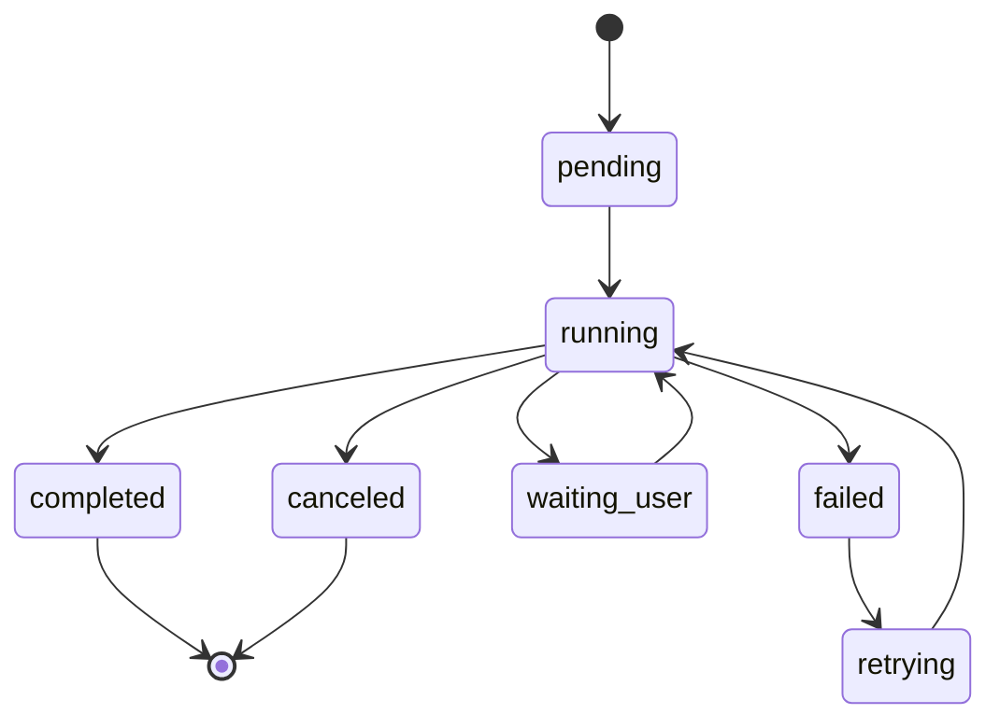
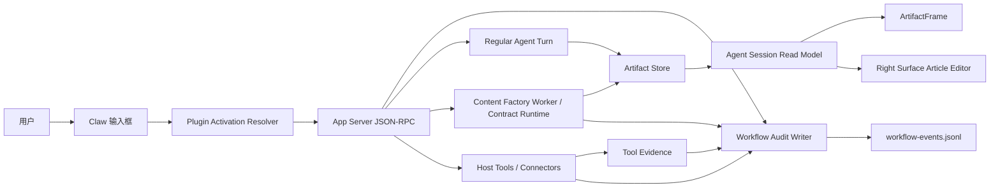
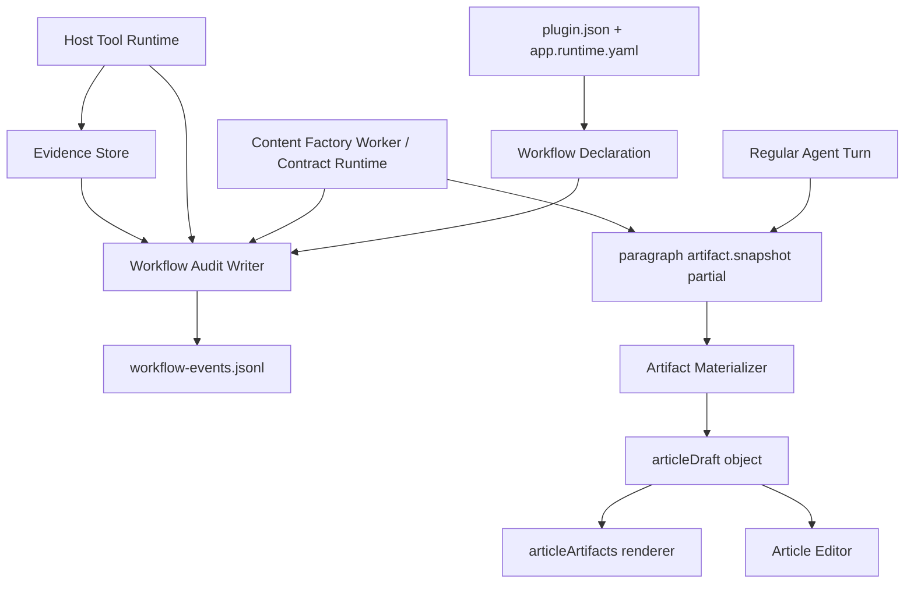
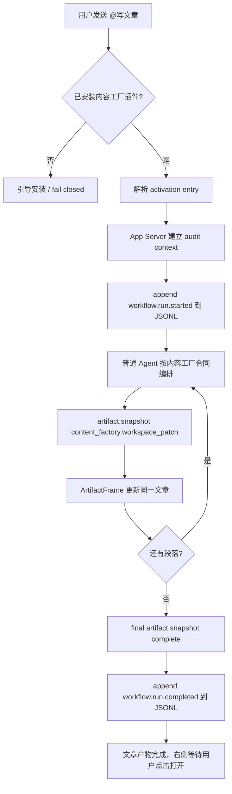
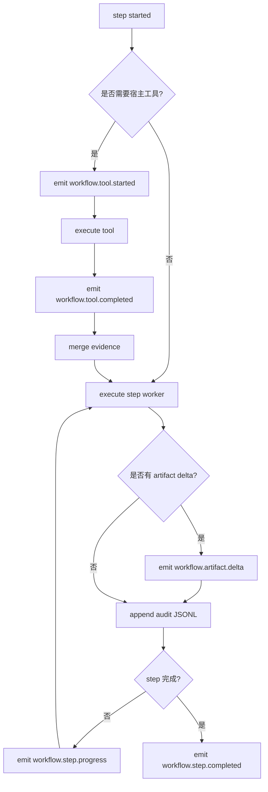
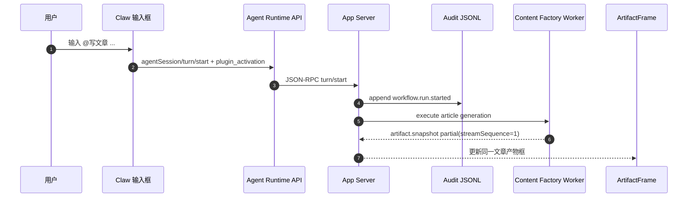
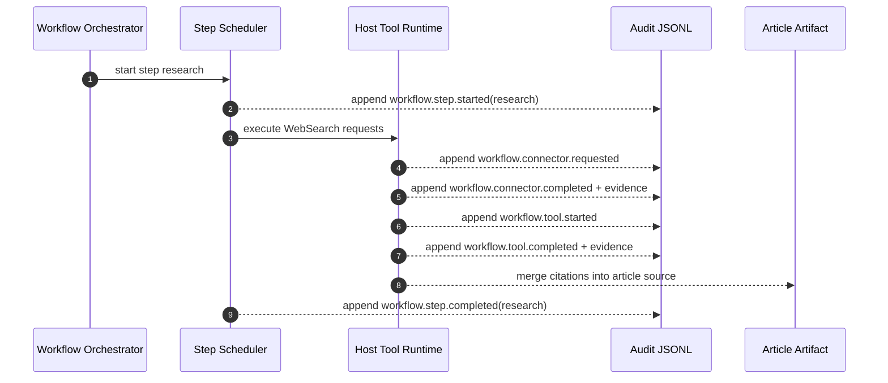
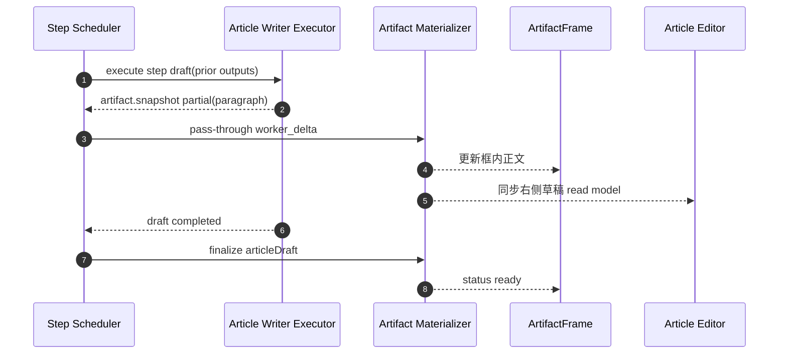
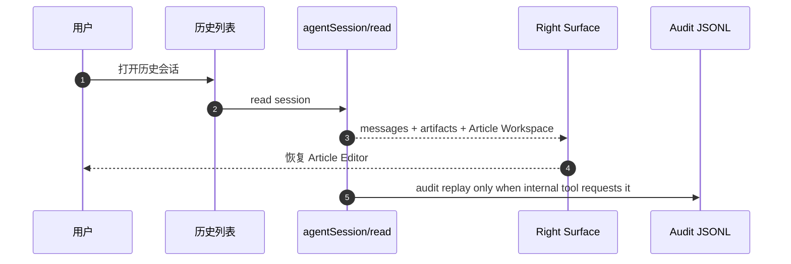

# Writing v2 产品需求

更新时间：2026-07-05
状态：Draft + ordinary Agent turn orchestration current-turn verified + Electron/CDP real desktop baseline verified + Electron/CDP Gate B product acceptance verified + live Provider current-turn verified + production preflight/readiness pipeline fail-closed verified + production signature cryptographic preflight verified + host tool evidence contract added + inline host command shortcode contract added

## 1. 背景

Writing v1 已经把内容工厂写文章链路的产品形态收敛到 Lime Plugin Package v1：用户可以通过 `@写文章` 激活内容工厂插件形态，最终目标是产出 `ArtifactFrame(articleArtifacts)`，并在右侧 Article Editor 中继续编辑文章。

截至 2026-07-05，Writing v2 已经有 Worker 接口规范、前端 Article Editor / Workspace UI、外部内容工厂包、App Server current-turn fixture 证据、Agnes live Provider current-turn 证据、host tool evidence 证据、真实 Electron/CDP baseline 证据、真实 Electron/CDP Gate B product acceptance 证据、production preflight fail-closed 证据和 canonical payload 密码学验签门禁；最新后端修复已让普通 `@写文章` current-turn smoke 从 `artifact.snapshot=0` 恢复到 `artifactSnapshotCount=7`，最终 CDP acceptance 也已证明 `agentSession/read` 经 `electron-ipc` 进入真实桌面、历史会话可恢复、右侧不自动打开、raw JSON / workflow step 不进入普通聊天、点击文章产物后 Article Editor 正确打开。production preflight 已证明真实 `.lapp` 可计算 `packageHash / manifestHash`，并会在缺 `app.signature.yaml`、trust root `publicKey`、production catalog 或签名未验证时 fail closed；远程安装签名闭环和 production resume lifecycle evidence 仍未完成。`src/features/plugin/testing/fixtures` 只能用于测试和审计证据，不能作为 production current 实现；真实产品完成不能依赖 mock worker、fixture provider 或右侧 worker fast path。

当前最大缺口不在右侧栏宽度，而在流式产物、执行卡片和审计边界：用户发起写作后，界面不能只出现一个最终文章卡，也不能把内部 workflow 流程轨塞到右侧。用户面需要的是资料检索 / 网络搜索这类必要过程以可展开执行卡片出现，文章正文按段落持续进入同一个产物框；完整 workflow 步骤只作为后台 JSONL 审计记录留存。

v2 要解决的问题是：写文章这类长任务必须先保留普通 Agent 对话体验，再由内容工厂 Plugin / workflow contract 编排产物和审计。用户需要看到自然引导、思考 / 工具过程、文章产物和完成总结；宿主把 workflow 过程写入可审计 JSONL，而不是靠 fixture 最终 response 一次性投影，也不是把内容工厂写作逻辑内置到 App Server 宿主里，更不是把 workflow 步骤列表塞进右侧编辑器。

## 1.1 2026-07-05 最新主线校正

- `@写文章` 的首发回合必须走普通 `agentSession/turn/start`，不能由 Plugin worker 或右侧 pane/action fast path 接管。
- 内容工厂插件负责声明 `workflow_contract`、host tool request、artifact/workspace patch 合同和 shortcode 合同；普通 Agent turn 负责对话节奏、自然说明和编排执行。
- 生成前必须有自然引导 / 思考 / 工具过程。占位框不能一闪而过，也不能在 artifact 未生成时把 turn 标记成完成。
- App Server 必须在最终 `turn.completed` 前完成内容工厂 `artifact.snapshot` materialization；terminal 后再补 artifact 会被事件存储丢弃，历史恢复也会丢产物。
- 当前实现策略是暂存普通 backend 的 `turn.completed`，在 terminal 前完成内容工厂 artifact / host tool timeline / JSONL audit 后再封口；这保持普通 Agent 对话主链，不新增右侧 worker 首发分支。
- 聊天区不得显示 raw JSON、`.lime/artifacts/content-factory/workspace-patch.json` 文件卡、内部 workflow step 列表或固定模板文案。
- 右侧 Article Workspace 不自动打开；只有用户点击文章产物或显式打开动作才进入右侧。
- 审计只写 `workflow-events.jsonl`，并保持 metadata-only 脱敏；未来审计读取 JSONL，不从 UI 偷读内部 payload。

## 2. 当前问题诊断

| 问题               | 现象                                                       | 根因                                                                             |
| ------------------ | ---------------------------------------------------------- | -------------------------------------------------------------------------------- |
| 过程不可见         | 用户等待较久后看到一批输出同时出现。                       | worker stdout 以最终 JSON response 为主，App Server 等 worker 完成后才投影事件。 |
| 正文流式不真实     | 看起来像“流式”，但可能是最终正文完成后再切片回放。         | 增量不在 producer 侧产生，缺少稳定 artifact ref + sequence 的 partial snapshot。 |
| workflow UI 过重   | 右侧编辑器展示步骤会挤占写作主体验。                       | workflow 被当成用户界面模型，而不是后台审计模型。                                |
| 过程状态不可靠     | 有时能看到 hook / connector evidence，有时像最终结果摘要。 | 过程来自 workerEvidence 和 artifact patch 解析，不是统一审计事件。               |
| 历史恢复缺审计语义 | 可恢复文章和编辑稿，但无法独立审计当时步骤、工具和失败点。 | 没有 append-only workflow JSONL audit log。                                      |

## 3. 目的

1. 用户输入 `@写文章` 后，先看到普通 Agent 的自然引导和过程说明，再看到资料检索 / 网络搜索执行卡片和同一个文章产物框开始按段落增长，而不是等待最终长回复或假完成。
2. 右侧 Article Editor 只承载文章编辑体验，不展示 workflow step / task card / 流程轨。
3. App Server 和 worker 保持生成期增量事件合同：partial snapshot 由 producer 发出，最终 snapshot 只负责完成态和历史恢复。
4. workflow run / step / tool / connector / hook / evidence 事件进入 append-only JSONL，用于未来审计、排障和质量复盘。
5. 最终文章仍进入独立 `ArtifactFrame(articleArtifacts)` 和右侧 Article Editor，不回退普通聊天长文，也不夹带 workflow 步骤 UI。

## 4. 收益

| 角色        | 收益                                                                               |
| ----------- | ---------------------------------------------------------------------------------- |
| 普通用户    | 能持续看到文章正文按段落生成，等待有反馈，但不被 workflow 步骤列表打断。           |
| 内容创作者  | 右侧保持聚焦文章编辑、引用和配图，不被后台编排状态占用空间。                       |
| 插件开发者  | 只需要按 artifact partial / final snapshot 合同输出产物，workflow 细节留给审计层。 |
| Lime 宿主   | 长任务过程以 JSONL 留痕，后续可用于排障、评估和回放。                              |
| 运营 / 支持 | 可从 workflow JSONL 追踪失败点、耗时和工具 evidence，降低黑盒问题。                |

## 5. 产品原则

1. **主链可解释**：用户面需要可展开执行卡片和文章产物持续增长，不需要右侧 workflow 步骤 UI。
2. **普通 turn 真编排**：`@写文章` 必须走普通 Agent turn；正文 partial 可以来自内容工厂插件包、host-managed generation 或受控后处理，但不能绕过对话流，也不能由最终正文回切伪流式。
3. **稳定引用**：所有 partial 使用稳定 `artifactRef` 和递增 `streamSequence` 更新同一个文章 artifact。
4. **审计分离**：workflow run、step、tool、connector、hook、evidence、耗时和失败码只追加到 JSONL audit log。
5. **恢复聚焦产物**：普通历史恢复只恢复消息、ArtifactFrame 和右侧 Article Editor；审计回放另走后台工具。
6. **失败不伪造成功**：任何生成失败都不能生成假完成状态或空白 Article Editor，失败细节进入 JSONL。

## 6. 用户故事

| 编号     | 用户故事                                                                             | 验收                                                                                          |
| -------- | ------------------------------------------------------------------------------------ | --------------------------------------------------------------------------------------------- |
| W2-US-01 | 作为用户，我输入 `@写文章` 后，希望先看到 Agent 正在接手和思考，再看到文章开始生成。 | 发送后出现自然引导、资料检索 / 网络搜索执行卡片和同一个文章产物框，并开始接收段落级 partial。 |
| W2-US-02 | 作为用户，我希望右侧专注文章编辑。                                                   | 右侧 Article Editor 不显示 workflow 步骤、任务卡或流程轨。                                    |
| W2-US-03 | 作为用户，我希望正文不是突然整篇出现。                                               | draft 期间通过分段 snapshot / artifact delta 更新同一 `ArtifactFrame`。                       |
| W2-US-04 | 作为用户，我从历史打开会话时，希望看到文章和编辑稿。                                 | 历史恢复包含最终文章、ArtifactFrame 和右侧 Article Editor，不恢复步骤列表。                   |
| W2-US-05 | 作为用户，我希望失败时看到简洁失败状态。                                             | 用户面显示生成失败 / 可重试；详细 step、tool、失败码写入 JSONL。                              |
| W2-US-06 | 作为平台维护者，我希望能定位慢在哪个步骤。                                           | workflow JSONL 记录每个步骤开始、完成、耗时、工具调用和 artifact refs。                       |
| W2-US-07 | 作为插件开发者，我希望输出增量产物，不写宿主 UI。                                    | 插件 worker 输出稳定 artifact partial / final snapshot，宿主负责投影。                        |

## 7. 用户用例

### UC-01：标准写文章

1. 用户输入 `@写文章 帮我写一篇关于 AI Agent 工作流的公众号文章`。
2. 输入栏命中内容工厂插件 activation entry。
3. 发送后进入普通 Agent turn，Agent 先自然说明将按内容工厂流程编排。
4. App Server 建立后台 audit context，并在 `turn.completed` 前 materialize 同一 article artifact 的段落级 partial snapshot。
5. 聊天区同一个 `ArtifactFrame(articleArtifacts)` 持续增长，不新增多个文章卡。
6. WebSearch / connector / strategy / review / image-plan 等过程写入 workflow JSONL，不进入右侧。
7. final snapshot 到来后，聊天区文章产物进入完成态。
8. 用户点击产物框，右侧 Article Editor 打开同一篇文章。

### UC-02：搜索步骤耗时较长

1. research step 发起多个搜索请求。
2. 每个 tool call 开始 / 完成时追加到 workflow JSONL。
3. 用户面展示必要的资料检索 / 网络搜索执行卡片，但不展示 research step 流程轨。
4. 如果 draft 已有段落，段落继续进入同一个 `ArtifactFrame`。
5. 搜索完成后的引用和来源进入 articleDraft source，供 Article Editor 引用栏读取。

### UC-03：某一步失败后重试

1. draft step 执行失败。
2. 用户面显示写作失败或可重试状态，不展示 step 明细。
3. JSONL 记录失败点为 `draft`、失败码、retry attempt 和已完成 evidence。
4. 用户点击重试。
5. App Server 创建 retry attempt，只重跑必要步骤，不重建整个会话。

### UC-04：历史恢复

1. 用户从历史列表打开旧写作会话。
2. App Server 返回 messages、artifact refs 和 Article Workspace。
3. UI 恢复 `ArtifactFrame` 和右侧 Article Editor。
4. 如果 workflow 未完成或失败，用户面只恢复文章产物状态和可重试动作。
5. 审计工具可单独读取 workflow JSONL 回放步骤、工具和失败点。

## 8. 功能需求

### 8.1 Workflow audit context 创建

- `@写文章` 命中 installed plugin activation entry 后，App Server 可以在 turn accepted 阶段创建后台 `workflowAuditRun`，但该动作不能替代普通 Agent turn。
- `workflowAuditRun.workflowKey` 必须来自插件 manifest，例如 `content_article_workflow`。
- `workflowAuditRun.steps` 只用于审计和执行约束，不用于右侧 UI 展示。
- App Server 不允许内置内容工厂步骤 fallback；插件未声明 workflow key 或 steps 时，可以只记录最小 audit context，不能用宿主业务默认值补齐。
- audit context 创建失败不能阻塞普通 Agent 对话，但必须记录 fail-closed 审计错误，不能回退成无内容工厂产物的普通长文假完成。
- Production evidence 不能只引用 `workflow-events.jsonl` 文件路径或手写事件计数；必须通过 current App Server `evidence/export` 读取 workflow audit JSONL，并输出 metadata-only `observabilitySummary.workflow_audit` 摘要。ready 条件要求 `status=exported`、`source=workflow-events.jsonl`、`eventCount>0`、`metadataOnly=true`、`rawContentIncluded=false`、`redactionPolicy=workflow_audit_metadata_only`，且 redaction policy 覆盖真实事件。

### 8.2 Step 状态机

Step 状态机用于 JSONL 审计，不是右侧 Article Editor 的展示模型。



每个 step 至少支持：

- `pending`
- `running`
- `completed`
- `failed`
- `waiting_user`
- `canceled`

### 8.3 实时事件与 JSONL 审计

必须新增或收敛到以下事件语义：

| 事件                           | 触发时机                                       |
| ------------------------------ | ---------------------------------------------- |
| `workflow.run.started`         | turn 接受并创建 workflow run。                 |
| `workflow.step.started`        | 某个步骤开始执行。                             |
| `workflow.run.retrying`        | run 因可重试失败进入下一次尝试。               |
| `workflow.step.retrying`       | 当前步骤因可重试失败进入下一次尝试。           |
| `workflow.step.progress`       | 长步骤输出阶段性进展。                         |
| `workflow.connector.requested` | worker 声明需要宿主 connector / 工具执行。     |
| `workflow.connector.completed` | 宿主 connector / 工具执行完成并产生 evidence。 |
| `workflow.tool.started`        | 宿主工具 / connector 开始执行。                |
| `workflow.tool.completed`      | 宿主工具 / connector 完成并产生 evidence。     |
| `workflow.hook.started`        | 宿主或插件 hook 开始执行。                     |
| `workflow.hook.completed`      | 宿主或插件 hook 完成，并写入状态 / 失败码。    |
| `workflow.artifact.delta`      | 文章正文、结构、引用或配图规划增量更新。       |
| `workflow.step.completed`      | 某个步骤完成并写入 outputs。                   |
| `workflow.step.failed`         | 某个步骤失败。                                 |
| `workflow.run.completed`       | 所有必需步骤完成。                             |
| `workflow.run.failed`          | workflow 无法继续。                            |

这些事件默认只追加到 App Server 管理的 append-only JSONL audit stream，例如逻辑文件 `workflow-events.jsonl`。普通 `agentSession/read`、右侧 Article Editor 和用户历史恢复不直接渲染这些 step 事件；只有审计、排障、质量复盘或专门的内部工具读取。

### 8.4 Step executor 合同

Agent / worker 接收的是 step execution request，而不是整个自由任务：

```ts
type WorkflowStepExecutionRequest = {
  workflowAuditRunId: string;
  stepId: "research" | "strategy" | "draft" | "review" | "image-plan";
  workflowKey: "content_article_workflow";
  pluginId: "content-factory-app";
  input: {
    userPrompt: string;
    locale: string;
    priorStepOutputs: Record<string, unknown>;
    artifactRefs: string[];
  };
  constraints: {
    directProviderAccess: false;
    directFilesystemAccess: false;
    allowedToolRefs: string[];
    outputSchema: string;
  };
};
```

真实 worker 返回 step result：

```ts
type WorkflowStepExecutionResult = {
  workflowAuditRunId: string;
  stepId: string;
  status: "completed" | "failed" | "waiting_user";
  outputs: Record<string, unknown>;
  artifactDeltas?: Array<{
    artifactId: string;
    kind: "articleDraft" | "workspacePatch" | "workerEvidence";
    patch: unknown;
  }>;
  toolRequests?: Array<{
    toolRef: string;
    arguments: Record<string, unknown>;
  }>;
};
```

### 8.5 ArtifactFrame 和 Article Editor

- `ArtifactFrame` 继续作为最终文章产物框。
- 文章正文必须在最终 `turn.completed` 前通过段落级 `artifact.snapshot` partial 或 artifact delta 增量进入同一个 artifact read model。
- 普通 assistant message 可以承载寒暄、思考摘要、过程说明和完成总结，但不承载整篇文章正文。
- 右侧 Article Editor 读取同一份 articleDraft object。
- 右侧 Article Editor 不展示 workflow step、task card 或流程轨。
- Article Editor 的继续改写、补充搜索、生成配图等动作绑定 `articleDraftRef`；审计层可在服务端关联 `workflowAuditRunId`，但不把该字段变成右侧 UI 依赖。

### 8.6 聊天主链执行卡片

- 内容工厂插件必须在 `articleDraft.source.hostToolRequests[]` 暴露需要宿主执行的资料检索 / 网络搜索请求。
- `hostToolRequests[]` 是当前事实源，旧 `searchRequests[]` 只作为兼容输入保留。
- 宿主执行工具后，应把 `tool.started` / `tool.result` 投影为聊天主链里的可展开执行卡片，并显示在文章产物卡之前。
- 执行卡片只展示用户可理解的标题、参数摘要、结果摘要和来源；完整 payload、失败码和内部 workflow 细节进入 `workflow-events.jsonl`。
- streaming partial 中仍要保留 `hostToolRequests[]`，不能为了精简文章流式 payload 把工具请求剥掉。
- current-turn smoke 必须同时断言：streaming / final `artifact.snapshot` 保留 `hostToolRequests[]`，普通事件流包含宿主 `tool.started -> tool.args -> tool.result`，`agentSession/read.detail.items` 与 `thread_read.tool_calls` 投影出 completed `web_search` 工具项，`evidence/export` 可证明 `hostToolEvidence` 已回填。

### 8.7 文章内联 Host Command Shortcode

内容工厂插件可以在文章正文中输出结构化 host command shortcode，用来表达“这里需要宿主已有 `@` 命令补产物”。这不是裸正则替换，也不是 worker 直接执行命令；宿主必须先把 shortcode 解析为结构化 `hostCommandRequests[]`，再按命令目录和现有运行时授权执行。

首批自动执行范围只开放 `@配图`：

```md
[@配图 一张广州夏天午后的城市照片，阳光明亮，街边绿树和高楼，真实摄影风格，前景有广州塔珠江新城的花城大道]
```

宿主解析后生成等价请求：

```ts
type HostCommandRequest = {
  commandKey: "image_generate";
  commandName: "配图";
  prompt: string;
  usage: "document-inline";
  slotId: "article-image-slot-1";
  anchorSectionTitle?: string | null;
  anchorText?: string | null;
  presentation: {
    surface: "article_editor";
    replacement: "slot_marker";
  };
};
```

执行规则：

- shortcode 只允许出现在普通 Markdown 正文；代码块、inline code、Markdown link / image alt 中的 `[@...]` 不执行。
- 单篇文章默认最多自动处理 `3` 个 `@配图` shortcode；短文建议 `2` 张，长文建议 `3` 张，超出的 shortcode 保留原文供用户手动处理。
- 宿主把 shortcode 物化为 `<!-- lime:image-task-slot:<slotId> -->`，再通过既有 `image_command_intent.image_task` 进入 App Server `ImageCommandWorkflow`。
- slotId 必须基于正文中已有 `lime:image-task-slot:*` 分配下一个可用值；同一篇文章后续新增 `[@配图 ...]` 不得重新使用已存在的 slotId。
- 图片任务 running 时回填 `pending-image-task://...` 占位；completed 后按同一 `slotId` 替换为真实图片 URL。
- worker 不允许直接创建 `.lime/tasks/image_generate/*.json`，也不允许伪造 `tool.started / tool.result`。
- 其他 `@` 命令可以先进入 `hostCommandRequests[]` 文档合同，但自动执行必须等对应 runtime contract、授权、结果卡和 viewer 都接入后再开启。

### 8.8 历史恢复

普通用户历史恢复必须按以下优先级：

1. Article Workspace selected object
2. ArtifactFrame refs
3. articleDraft object ref
4. 纯聊天历史 fallback

如果 workflow 未完成，恢复文章产物的生成 / 失败状态和可重试动作；如果已完成，恢复 ArtifactFrame 和右侧 Article Editor。workflow step 历史只通过 JSONL 审计工具读取，不进入普通历史 UI。

## 9. 非功能需求

| 维度     | 要求                                                                                                          |
| -------- | ------------------------------------------------------------------------------------------------------------- |
| 首屏反馈 | turn accepted 后尽快出现文章产物框或首个段落 partial。                                                        |
| 对话体验 | `@写文章` 必须保留普通 Agent 的自然引导、过程说明和完成总结，不允许只显示 artifact 占位或 raw JSON。          |
| 过程延迟 | artifact partial 从 producer 到 UI 的可见延迟目标 < 1s。                                                      |
| 持久化   | artifact refs / workspace patch 必须可被 `agentSession/read` 恢复；workflow 事件必须可从 JSONL 审计日志读取。 |
| 可审计   | 每个 step 记录 executor、输入摘要、输出摘要、耗时、失败码和 retry attempt，并追加到 JSONL。                   |
| 可扩展   | workflow orchestrator 不写死内容工厂，PPT / 网页 / 研报可复用。                                               |
| 安全     | worker 不直接拿 provider key，不直接读写宿主文件，不绕过 connector 授权。                                     |
| 兼容     | v1 workspace patch 可继续只读恢复，但新运行必须写 artifact partial 和 workflow JSONL audit facts。            |

## 10. 架构图

### 10.1 系统上下文



### 10.2 组件架构



## 11. 流程图

### 11.1 写文章主流程



### 11.2 长步骤进度流程



## 12. 时序图

### 12.1 `@写文章` 创建 workflow



### 12.2 research step 与宿主工具



### 12.3 draft step 流式文章产物



### 12.4 历史恢复



## 13. 数据模型草案

workflow 数据模型不进入普通用户 UI read model。它以 JSONL 行事件为事实源，面向审计、排障和质量复盘。

```ts
type WorkflowAuditEvent = {
  schemaVersion: "workflow.audit.v1";
  eventId: string;
  sessionId: string;
  turnId: string;
  auditRunId: string;
  workflowKey: string;
  stepId?: "research" | "strategy" | "draft" | "review" | "image-plan";
  eventType:
    | "workflow.run.started"
    | "workflow.step.started"
    | "workflow.step.progress"
    | "workflow.tool.started"
    | "workflow.tool.completed"
    | "workflow.artifact.delta"
    | "workflow.step.completed"
    | "workflow.step.failed"
    | "workflow.run.completed"
    | "workflow.run.failed";
  sequence: number;
  timestamp: string;
  artifactRefs?: string[];
  evidenceRefs?: string[];
  payload: Record<string, unknown>;
};
```

JSONL 约束：

- 每行一个完整 JSON object，按 `sequence` 单调递增追加。
- JSONL 是 append-only audit log，不作为右侧 Article Editor 的渲染输入。
- 可脱敏字段必须在写入前完成脱敏；不得把 provider key、原始凭证或未授权外部正文写入日志。
- 普通历史恢复只读 artifact / workspace patch；内部审计工具才读取 `workflow-events.jsonl`。

## 14. 渐进落地方案

### P0：真实产物流式

- 普通 Agent turn 在内容工厂 `workflow_contract` 约束下生成或触发段落级 `artifact.snapshot` partial。
- partial 使用稳定 `artifactRef` / path 和递增 `streamSequence`。
- App Server 对 worker 输出的 `artifact.snapshot` partial 做通用 pass-through，不再用最终正文二次切片。
- 内容工厂正文生成、标题、大纲、引用组织等领域逻辑必须来自内容工厂 Plugin / workflow contract / host-managed generation 边界；宿主不能新增 `runtime_backend/content_factory_*` 模板模块。
- final snapshot 标记 `complete=true`、`writePhase=persisted`、`contentStatus=complete`。

### P1：JSONL audit writer

- App Server 为 `@写文章` turn 建立后台 audit run。
- workflow run / step / tool / connector / hook / evidence 事件追加到 `workflow-events.jsonl`。
- 当前物理路径沿用 App Server event log 根目录，按 session 写入 `sessions/session_<id>/workflow-events.jsonl`。
- `agentSession/read` 不返回 UI-facing workflow step 列表。
- 右侧 Article Editor 不读取 workflow step，不展示流程轨。

### P2：审计工具与重试

- 内部审计工具可以按 session / turn / auditRunId 读取 JSONL。
- retry / cancel / resume 写入同一 audit stream；resume 必须来自显式 runtime action response / queued resume 的 `workflowResume` metadata，不能从普通 queued resume 或自然语言推断；production signed release gate 必须拒绝缺少该 metadata 与 `workflow.step.resuming` / `workflow.run.resuming` JSONL 事件的证据。
- tool evidence 与 stepId / auditRunId 强绑定。

### P3：跨场景复用

- PPT、网页、研报、表格等长任务复用 artifact partial + JSONL audit 模式。
- ArtifactFrame renderer 继续按 artifact kind 扩展。
- 插件中心展示 workflow declaration 和运行权限，但用户运行态右侧不展示步骤列表。

## 15. 验收标准

- `@写文章` 发送后，普通 Agent 先给出自然引导，同一个文章 `ArtifactFrame` 在 turn completed 前接收段落级 partial，而不是最终一次性出现。
- App Server 不再对最终正文做二次切片；partial 必须来自内容工厂合同约束下的普通 turn / host-managed generation / worker 生成期事实。
- `ArtifactFrame` 不显示普通 assistant 长文 fallback。
- 右侧 Article Editor 只读取同一 articleDraft，不显示 workflow step、task card 或流程轨。
- workflow run / step / tool / connector / hook / evidence 事件写入 JSONL，可用于内部审计回放。
- production ready evidence 需要证明真实 GUI 路径通过 typed action response 或 `workflow/respond` 写入 `metadata.workflowResume`，并产生匹配的 `workflow.step.resuming` / `workflow.run.resuming` JSONL audit 事件；`thread/resume` 只负责 Thread rejoin/history hydrate，不承载 workflow resume metadata，不能只给 signed package、live Provider 和 `workflow-events.jsonl` 路径。
- `agentSession/read` 普通历史恢复能恢复 artifact refs 和 Article Editor，不恢复 workflow timeline。
- `hostToolRequests -> WebSearch tool event -> read model tool item/tool_call -> article artifact hostToolEvidence` 必须有稳定 smoke 证据，不能只靠插件 worker 本地输出证明。
- GUI smoke 覆盖发送、段落流式、最终产物、右侧展开、历史恢复；审计测试覆盖 JSONL 行事件。

## 16. 风险与约束

| 风险                          | 处理                                                                                                 |
| ----------------------------- | ---------------------------------------------------------------------------------------------------- |
| 最终正文回切伪流式            | 验收明确 partial 必须来自内容工厂 Plugin worker 生成期。                                             |
| worker / mock 抢跑普通对话    | `plugin_activation` 不触发 pane/action worker；fixture 只能用于测试，真实验收必须走普通 Agent turn。 |
| workflow 步骤挤占右侧写作体验 | 右侧 Article Editor 明确禁止展示 workflow step / task card / 流程轨。                                |
| JSONL 被误当 UI read model    | `workflow-events.jsonl` 只供审计、排障和质量复盘读取。                                               |
| 旧 worker 一次性输出继续存在  | 兼容只读恢复可以保留，新运行必须产生 artifact partial。                                              |
| 工具 evidence 与审计步骤脱节  | tool event 必须带 `auditRunId` 和 `stepId`。                                                         |
| 历史恢复破坏现有文章编辑稿    | 普通历史恢复只增加 artifact / workspace patch，不加载 workflow UI。                                  |

## 17. 开放问题

1. JSONL retention、压缩、脱敏和导出策略已有当前实现；后续开放点是 product 运维默认值、观测告警和审计工具入口。
2. `workflow.artifact.delta` 与现有 `artifact.snapshot` 的兼容投影边界如何命名？
3. 用户取消 workflow 时，已完成的 articleDraft 是否保留为草稿？
4. 插件 manifest 中 workflow step 的最小字段是否需要沉淀到 `internal/tech/plugin/` 标准文档？

## 18. 2026-07-02 决策补充

本轮决策修正一条产品边界：workflow 不是右侧展示模型，而是后台审计模型。

- 右侧 Article Editor 不显示 workflow 步骤、任务卡或流程轨。
- workflow run / step / tool / connector / hook / evidence 只写 JSONL，用于未来审计、排障和质量复盘。
- 用户面以 `ArtifactFrame` 段落级流式和最终 Article Editor 为主。
- App Server 不应通过最终正文回切来制造流式；真实 partial 必须由内容工厂 Plugin worker 在生成期发出。

## 19. 2026-07-05 决策补充

本轮再次修正执行边界：内容工厂是编排合同，不是 `@写文章` 首发回合的对话替代品。

- `@写文章` 必须走普通 Agent turn，保留寒暄、思考、工具过程和自然总结。
- `plugin_activation.workflow_contract` 约束本轮生成目标、工具请求、artifact kind、right surface 和 expected objects。
- 右侧 worker fast path 只服务用户显式右侧动作，不服务 `@写文章` 首发。
- 后端必须在 `turn.completed` 前补齐 `artifact.snapshot` 和 read model；该缺口曾在 `.lime/qc/content-factory-current-turn-debug/content-factory-current-turn-debug-host-generation-2026-07-05T03-29-33-481Z.failure.json` 中失败，错误 `expected paragraph-level artifact snapshots, got 0`，现已由 terminal deferring + plugin activation materialization 修复。
- Electron/CDP Gate B product acceptance 已通过，确认聊天排版、右侧不自动打开、历史恢复和 raw JSON / 文件卡隐藏；App Server current-turn live Provider 已通过，下一刀转向远程 GUI production 安装签名闭环和 resume lifecycle production evidence。

## 20. 2026-07-05 Electron/CDP 证据分级

本轮补充一条验收规则：不能把“真实 Electron 里能生成文章”直接等同于“产品体验完成”。

- Gate B baseline 已有证据：`.lime/qc/gui-evidence/writing/writing-cdp-WRITING_CDP_1783188149738-summary.json` 和 `.lime/qc/gui-evidence/writing/writing-cdp-WRITING_CDP_1783188149738-turn-start-trace.json` 证明真实 Electron/CDP、`electron-ipc`、`app_server_handle_json_lines`、`agentSession/turn/start`、`content_article_workflow` activation metadata、自然过程捕获和文章产物正文可见。
- Gate B acceptance 已通过：`/tmp/lime-writing-evidence/writing-final-WRITING_LIVE_1783229659461-2026-07-05T06-02-47-474Z-summary.json` 显示目标 session `sess_f781bf079f074b7aa2ec0941bade095d` 在真实 Electron/CDP 中满足 `gateB / historyRestored / naturalLeadVisible / toolProcessVisible / articleFrameVisible / rawPatchHidden / workflowStepsHiddenInChat / rightSurfaceNotAutoOpened / rightSurfaceOpensOnClick / traceHasElectronRead` 全部为 `true`。
- 后续 CDP 脚本仍必须先记录发送前 trace / error baseline，再只检查新增 trace；必须在点击文章产物前断言右侧未打开，点击后再验证 Article Editor；最后从历史列表重新打开同一 session，确认文章仍可恢复，防止回归。
- 任何 live Provider 或远程安装证据都不能替代 Gate B acceptance；如果 GUI 投影仍缺自然引导、执行卡片、文章产物或历史恢复，生产 provider 成功也不能标记产品完成。当前 Agnes live Provider 证据只证明 App Server `local_folder` current-turn 的 host-managed generation，不证明 signed `cloud_release` 桌面安装链路。

## 21. 2026-07-05 Read Model 可见性修正

本轮补充一条用户面 / 审计面的数据边界：workspace patch 是内部工作区和审计事实，不是普通聊天 artifact。

- `agentSession/read.detail.artifacts` 与 `thread_read.artifacts` 只返回用户可见 artifact；`content_factory.workspace_patch`、`workspace_patch`、`.lime/artifacts/**/workspace-patch.json` 和 `.lime/artifacts/content-factory-workspace-patch.json` 必须过滤掉。
- `artifact_document + articleWorkspace` 是用户可见文章产物，历史恢复必须恢复为 `document` artifact，不能因为带 `articleWorkspace` metadata 被当成中间产物隐藏。
- `artifact/read`、Article Workspace 内部恢复和 `evidence/export` 仍可读取完整 workspace patch；审计只读 `workflow-events.jsonl` 与内部 artifact facts，不从普通聊天 UI 取数。
- App Server read model 对 `item.updated` 的累计 assistant 文本必须覆盖为最新累计全文；`message.delta` 才按增量追加，避免写作前的自然引导 / 思考文字在历史中重复拼接。
- 已补定向验证：`read_session_hides_workspace_patch_from_user_visible_artifacts`、`read_session_materializes_content_factory_workspace_patch_into_article_workspace`、`item_updated_agent_message_cumulative_text_replaces_delta_prefix` 和前端 `历史应恢复文章 artifact document 且隐藏 workspace patch`。

## 22. 2026-07-05 Resume Audit Contract

本轮按 Codex 语义收紧 workflow audit 边界：`thread/resume` 只负责 Thread rejoin/history hydrate，不恢复 queued turn，也不代表插件 worker workflow resume。只有 `workflow/respond` / `agentSession/action/respond` 的 typed response 显式携带 `metadata.workflowResume`，才追加 `workflow.step.resuming` / `workflow.run.resuming`。这些事件保持 metadata-only 脱敏，不进入普通 session JSONL、聊天 UI、历史 read model 或右侧 Article Editor。

`content-factory-signed-release-gate` 已把该 lifecycle 纳入 production ready 门槛：真实 GUI evidence 需要证明 `electron-ipc -> app_server_handle_json_lines -> agentSession/turn/start`，随后由 typed action response 或 `workflow/respond` 给出 `metadata.workflowResume`，并匹配同一 `workflowRunId / workflowKey / stepId / actionId / decision` 的 `workflow.step.resuming`、`workflow.run.resuming` audit 事件。只有签名包、live Provider、Article Workspace 和 `workflow-events.jsonl` 路径不足以关闭 production 缺口。

2026-07-05 live Provider current-turn smoke 已通过：`.lime/qc/gui-evidence/agent-apps/content-factory-current-turn-live-provider-2026-07-05T07-53-24-361Z.json` 显示 `provider=agnes`、`model=agnes-2.0-flash`、`liveProviderUsed=true`、`hostManagedGenerationStatus=completed`。同一 evidence 重新跑 signed release gate 后仍按预期 blocked，但 missing codes 已不包含 `production_host_generation_not_live`；剩余 blocked 项集中在 production catalog、trust roots、fetchCloud、GUI `cloud_release` signature verification 和 resume lifecycle。

production evidence 不允许携带 Provider key、Bearer token、私钥或完整 provider request / response；只允许记录 `apiKeyEnv`、`apiKeyConfigured`、provider id、model、baseUrl 是否配置等非敏感 marker。`content-factory-signed-release-gate` 已加入 secret-like value scan，命中时返回 `production_secret_values_present` 并只报告字段路径，不回显密钥。

2026-07-05 已补 `plugin:content-factory-production-gui-evidence` 作为 production GUI 采集入口：它只连接真实 Electron CDP，读取 current App Server JSON-RPC 和 `workflow-events.jsonl`，不安装插件、不调用 Provider、不伪造 resume lifecycle。当前 local_folder 桌面 session 采集结果为 `status=failed`，并被 signed release gate blocked；这说明门槛已经能区分“真实桌面里有历史文章”和“production signed cloud_release 完整闭环”。

2026-07-05 21:13 追加真实 Electron/CDP live 写作复测：在真实 Lime/Electron 页签发送 `@写文章` 后，trace 证明 `agentSession/turn/start` 通过 `electron-ipc -> app_server_handle_json_lines` 进入 App Server，session `sess_c791014cba9e42caabe337db7b81467c`。用户面出现自然写作引导和文章正文，未显示 raw JSON / `workspace-patch.json`；普通 session JSONL 写入 `3061` 行，workflow audit JSONL 写入 `16` 行。证据为 `.lime/qc/gui-evidence/agent-apps/content-factory-writing-cdp-WRITING_CDP_1783257215276.json` 和 production collector 输出 `.lime/qc/gui-evidence/agent-apps/content-factory-production-gui-evidence-cdp-live-writing-WRITING_CDP_1783257215276-2026-07-05T13-15-46-920Z.json`。该 production collector 仍按预期 `status=failed`，signed release gate / readiness report 仍 blocked；结论是本地真实桌面 ordinary turn + JSONL 审计链路成立，但 production signed `cloud_release` 还缺 catalog、trust roots、fetchCloud、signature verification 和 resume lifecycle。

2026-07-05 已补 `plugin:content-factory-production-preflight` 作为 signed release 前置入口：它从真实 `.lapp` 计算 package hash，并通过 App Server current `pluginLocalPackage/inspect` 计算 manifest hash。当前 `content-factory-app-2.2.2.lapp` 的包事实为 `packageHash=sha256:89aec20e637713c668f8bc34c303256ac83806c5d2e75486e6453bd638ac3f8c`、`manifestHash=sha256:c1d3aa37d4b2f6c3c4a006525a1bba4b4ee407f61fe9cff8192704b48a209248`，但 preflight 仍 blocked 于 `app.signature.yaml`、`plugin-signature-trust-root.json`、production catalog、bootstrap 和 fetchCloud evidence。preflight 只能作为发布准备清单；它不签名、不上传、不安装、不调用 Provider，也不能让 signed release gate 或 GUI production evidence 通过。2026-07-06 已补 `--help` 回归守卫，防止 CLI 文案重新暗示 preflight 会生成 passing `cloud_release` evidence 或要求 operator 粘贴 key/token 值。

2026-07-05 21:42 复核 production readiness：Studio 发布链已改用 current `pluginLocalPackage/inspect`，并在 dry-run 输出 `releaseReadiness`。真实 `content-factory-app` dry-run 证据 `.lime/qc/gui-evidence/agent-apps/content-factory-studio-publish-dry-run-live-continue-2026-07-05.json` 显示 packageHash / manifestHash 为 `sha256:0c6f33d42918365b7f4256a78fc99b925133ea8fd956d50da25874998222b59c` / `sha256:5de25a9d61518f027810663cb50685bc6b25f1930f22e67f24ab9b757fd5f7a8`，但缺 packageUrl、app.signature、tenantId 和 developer token。最新 preflight `.lime/qc/gui-evidence/agent-apps/content-factory-production-preflight-studio-dry-run-continue-2026-07-05T13-42-15-968Z.json` 仍缺签名 proof、trust root、production catalog、bootstrap 与 fetchCloud evidence；用它和真实 Electron/CDP GUI evidence 重新生成的 bundle / report 分别位于 `.lime/qc/gui-evidence/agent-apps/content-factory-production-evidence-bundle-studio-dry-run-continue-2026-07-05/`、`.lime/qc/gui-evidence/agent-apps/content-factory-production-readiness-report-studio-dry-run-continue-2026-07-05.json`。signed gate 仍输出 15 个 missing codes，包含 GUI 非 `cloud_release`、signature 未 verified、workflow resume lifecycle 缺失。产品验收口径保持：只有本地 ordinary turn、JSONL 审计或 local_folder live Provider 成功，不能声明 signed `cloud_release` production ready。

2026-07-05 21:46 追加 linked readiness report：`.lime/qc/gui-evidence/agent-apps/content-factory-production-readiness-report-studio-dry-run-linked-2026-07-05.json` 已将 Studio dry-run 纳入同一报告，`studioDryRun.present=true`、`studioDryRun.drift=[]`，packageHash / manifestHash 与 preflight 对齐；报告仍 `status=blocked`，并同时展示 Studio 发布侧 blockers 与 signed gate `15` 个 missing codes。产品需求结论不变：release dry-run 只能作为 operator readiness，不是安装运行验收；最终 ready 必须来自真实 signed remote release、fetchCloud verified、GUI `cloud_release` signature verified 和 workflow resume lifecycle 证据。

2026-07-05 22:23 追加 production 输入缺口复核：本机未配置 signing private key、远程 packageUrl、Studio token、tenantId 或 LimeCore API base；因此只复跑 fail-closed preflight / Studio dry-run / bundle / readiness report，不执行签名、上传或 production API。新证据 `.lime/qc/gui-evidence/agent-apps/content-factory-production-readiness-report-env-missing-continue-2026-07-05.json` 仍 `status=blocked`，Studio 与 preflight packageHash / manifestHash 一致且 drift 为空；blocked 原因明确落在签名 proof、trust root、production catalog/bootstrap/fetchCloud、GUI `cloud_release` signature verification 和 resume lifecycle。产品验收不降低：没有这些真实输入时，不能继续靠本地代码改动或文档聚合宣布 production ready。

2026-07-05 22:37 追加 env 别名修正：发布输入接受 `LIMECORE_TENANT_ID / LIME_CLOUD_TENANT_ID`、`LIME_AGENT_APP_STUDIO_API_BASE / LIMECORE_API_BASE_URL / LIMECORE_API_BASE` 和 `CONTENT_FACTORY_PACKAGE_URL`，Studio CLI 与 Lime preflight 已统一。新证据 `.lime/qc/gui-evidence/agent-apps/content-factory-production-readiness-report-env-alias-continue-2026-07-05.json` 仍 blocked；这让产品验收结论更硬：不是变量名不一致导致的误阻塞，而是确实缺 production 签名、远程包、catalog/bootstrap/fetchCloud 和 GUI lifecycle。

2026-07-05 22:53 追加 production readiness pipeline：新增 `plugin:content-factory-production-readiness-pipeline` 作为 operator current 入口，一次性生成 preflight、Studio dry-run、bundle、readiness report 和 pipeline manifest。真实本地复跑输出 `.lime/qc/gui-evidence/agent-apps/content-factory-production-readiness-pipeline-env-alias-continue-2026-07-05/`，`content-factory-production-readiness-pipeline.json` 为 `status=blocked`，preflight / Studio dry-run packageHash 与 manifestHash 对齐且无 drift；blocked codes 仍覆盖 production catalog/bootstrap/fetchCloud、GUI 非 `cloud_release`、signature 未 verified、workflow resume lifecycle 缺失，以及 packageUrl / tenantId / Studio token 缺失。随后补强 fetchCloud 自动化：preflight CLI 支持 `--fetch-cloud-output`，pipeline 在 `--fetch-cloud-from-catalog` 下会把 current App Server `pluginPackage/fetchCloud` 结果落成独立 evidence 并送入 bundle。最新无 catalog 复跑 `.lime/qc/gui-evidence/agent-apps/content-factory-production-readiness-pipeline-fetchcloud-output-continue-2026-07-05/` 仍 blocked，且 fetchCloud 文件按预期不存在。产品验收口径不变：pipeline 是只读证据编排，不是新的执行 worker、不是 mock，也不能让 local_folder / fixture 证据升级为 production ready。

2026-07-05 23:16 追加 production readiness phase plan：readiness report / pipeline 现在输出 `blockerPlan.nextPhase`，把 production blocker 分成签名 proof / trust、Studio 发布输入、catalog/bootstrap、fetchCloud verified 和真实 desktop `cloud_release` E2E 等阶段，避免把 GUI 复测缺口和 operator 输入缺口混在一起。无 production catalog 时，pipeline 只记录 `fetchCloudFromCatalog.skippedReason=catalog_missing`，仍保留 blocked preflight evidence，不再把缺 catalog 表现成 preflight 命令失败。最新真实复跑 `.lime/qc/gui-evidence/agent-apps/content-factory-production-readiness-phase-plan-rerun-2026-07-05-2026-07-05T15-16-14-303Z/content-factory-production-readiness-pipeline.json` 显示 `nextPhase=release_signing_and_trust`；产品验收仍要求后续补真实签名 proof / trust root、Studio 发布输入、catalog/bootstrap、fetchCloud verified 和 GUI `cloud_release` signature verified / resume lifecycle。

2026-07-05 23:36 追加 production 签名验真：preflight 会重建外部发布工具的 canonical payload v2，并用 trust root `publicKey` 验证 detached signature；signed gate 也要求 preflight `signatureCryptographicVerificationStatus=verified`、`signaturePayloadHashMatched=true`，以及 bootstrap 匹配 trust root 带 `publicKey`。最新只读复跑 `.lime/qc/gui-evidence/agent-apps/content-factory-production-readiness-signature-verify-final2-2026-07-05-2026-07-05T15-48-09-615Z/content-factory-production-readiness-pipeline.json` 仍 blocked，原因仍是缺真实签名文件、可信根、catalog/bootstrap/fetchCloud 和 GUI `cloud_release` evidence；产品层继续禁止用 mock worker、hard-coded 模板或手写 evidence 关闭该缺口。

2026-07-05 23:56 追加 production catalog sourceKind 收紧复跑：signed release gate / readiness pipeline 现在只把 `sourceKind=cloud_release` 视为 production catalog ready，旧 `remote` 证据会以 `production_catalog_not_cloud_release` blocked。pipeline 同步补齐默认签名输入传递：当 `content-factory-app/app.signature.yaml` 和 `plugin-signature-trust-root.json` 已存在时，不需要重复传 `--app-signature / --trust-root`，preflight 与 Studio dry-run 会消费同一组文件。最新只读复跑 `.lime/qc/gui-evidence/agent-apps/content-factory-production-readiness-signature-defaults-2026-07-05-2026-07-05T16-02-26-791Z/content-factory-production-readiness-pipeline.json` 仍 `status=blocked`，`fetchCloudFromCatalog.skippedReason=catalog_missing`，`blockerPlan.nextPhase=release_signing_and_trust`。产品验收不变：真实 ready 必须来自 signed `cloud_release` catalog、bootstrap trust root、fetchCloud verified、GUI signature verified 和 workflow resume lifecycle，不能用 `remote / local_folder / fixture / localhost` 或手写 JSON 替代。

2026-07-06 追加 pipeline 绿色路径回归：测试层已证明当五类 production evidence、Studio dry-run、GUI `cloud_release` signature verified、Electron IPC trace 与 workflow resume lifecycle 全部齐备时，pipeline / readiness report / signed gate 可以整体 `ready`。这条回归只证明工具链不会阻塞真实输入，不是验收证据；产品层仍要求真实 production catalog/bootstrap/fetchCloud 和真实 Lime Desktop GUI `cloud_release` 跑通后才能关闭该需求。

2026-07-06 追加 packageUrl operator 入口：production readiness pipeline 支持显式 `--package-url <https-url>`，以脱敏子进程环境传给 preflight / Studio dry-run，不把原始 URL 写入 pipeline evidence。最新只读复跑 `.lime/qc/gui-evidence/agent-apps/content-factory-production-readiness-operator-inputs-2026-07-06-2026-07-05T16-15-09-136Z/content-factory-production-readiness-pipeline.json` 仍 blocked，下一阶段仍是 `release_signing_and_trust`。产品验收仍要求真实 HTTPS 包、签名 proof、trust root 和 production catalog 共同成立；该入口只降低 operator 配置出错概率，不降低 gate。

2026-07-06 追加 auth operator 入口：production readiness pipeline 支持 `--tenant-id`、`--api-base` 和 `--studio-token-env <ENV_NAME>`；developer token 不作为 CLI 原始值传入，也不会写入 evidence。该入口只让 Studio 发布输入可被同一 pipeline 审计，不能替代真实开发者认证、bulk publish、catalog/bootstrap 或 GUI `cloud_release` 验收。

2026-07-06 追加 operatorReadiness：production readiness pipeline 必须在 evidence 中展示 operator 输入是否配置，包括 signing key、HTTPS packageUrl、tenant/API base、Studio token、signature proof、trust root、catalog/bootstrap/fetchCloud 和 GUI evidence；展示只能是 configured 布尔值、env 名和本地 evidence 文件存在状态，不能写入 package URL 原文、token、私钥、公钥、签名或 production API response。CLI 可以输出脱敏 `operatorCommand`，但只能包含占位符。

2026-07-06 追加 operator missingKeys：`operatorReadiness` 必须输出 `ready` 与 `missingKeys`，让产品验收直接看到还缺哪些 production 输入；当前真实本机只读复跑显示缺 `appSignature / signingPrivateKey / releaseId / publicKeyId / trustRoot / packageUrl / tenantId / studioToken / catalog / bootstrap / fetchCloudEvidence / guiEvidence`。API base 默认复用 Studio / LimeCore 官方地址，只有覆盖默认地址时才需要显式配置。这些 marker 不能替代真实签名、catalog/bootstrap、fetchCloud verified 或 GUI `cloud_release` 证据。

2026-07-06 追加 operator missingActions：`operatorReadiness.missingActions[]` 必须为每个 missing key 提供占位符动作，覆盖签名 proof / trust root 生成、production HTTPS packageUrl、tenant/API/token、catalog/bootstrap、fetchCloud verified 和 GUI CDP evidence。actions 只允许出现占位符、env 名、脚本名或命令名，不得包含真实 URL、token、私钥、公钥或签名值。

2026-07-06 追加 signing command hint：`operatorReadiness.signingCommandHint` 必须从当前 preflight evidence 派生 packageHash / manifestHash，并生成只含占位符的签名命令；它可以包含外部真实包 `scripts/sign-release.mjs` 路径和非敏感 hash，但不能包含真实 packageUrl、私钥、公钥或签名值。该 hint 只证明签名前置 facts 可审计，不代表 `app.signature.yaml` 或 trust root 已生成。

2026-07-06 追加 signing command CLI 输出：production readiness pipeline CLI 必须直接打印 `signingCommand=...`，方便 operator 从终端拿到当前 hash 的签名准备命令；该输出只能使用占位符承载 packageUrl、releaseId、publicKeyId，并且只能通过 `--private-key-env <ENV_NAME>` 引用本地私钥环境变量，不能打印或提示粘贴 private key 值。

2026-07-06 追加 releaseId / publicKeyId operator 输入：production readiness pipeline 必须接受 `--release-id` 与 `--public-key-id`，并把它们写入 `operatorReadiness.inputs` 的 configured 布尔值；在缺真实 `app.signature.yaml` 时，这两个非敏感字段也是 `missingKeys / missingActions` 的一部分。传入后只能用于生成 `signatureRef` 和签名命令提示，不能让 pipeline 跳过真实 app signature、trust root、catalog/bootstrap、fetchCloud verified 或 GUI `cloud_release` evidence。

2026-07-06 追加 releaseId 绑定要求：生产签名工具、preflight 和 signed release gate 必须共同要求 `releaseId` 存在，且 `signatureRef` 以 `:<releaseId>` 结尾；没有 releaseId 或使用未绑定 releaseId 的 `signatureRef` 时必须 fail-closed。该要求保证签名 payload、catalog identity 和审计证据都能回到同一个具体 release，不能只绑定 `appId@version`。

2026-07-06 追加 Studio-first readiness 顺序：production readiness pipeline 必须先跑 Studio `publish --dry-run` 刷新当前 `.lapp`，再跑 preflight 读取该 dist package；同轮证据不得出现 Studio packageHash 与 preflight packageHash 漂移。最新只读复跑 `.lime/qc/gui-evidence/agent-apps/content-factory-production-readiness-studio-first-2026-07-06-2026-07-05T17-07-47-825Z/content-factory-production-readiness-pipeline.json` 仍 blocked，但已移除 `production_studio_dry_run_package_hash_mismatch`，剩余缺口继续是签名 proof / trust root / production catalog/bootstrap / fetchCloud / GUI `cloud_release` evidence。

2026-07-06 追加 optional signing proof generation：production readiness pipeline 默认必须保持只读；只有显式 `--generate-signature-proof` 才允许调用外部真实 `content-factory-app/scripts/sign-release.mjs` 生成 `app.signature.yaml` 和 `plugin-signature-trust-root.json`。该显式签名阶段必须使用同轮 Studio dry-run 的 packageHash / manifestHash，必须绑定 `releaseId` 和 `publicKeyId`，缺真实 HTTPS packageUrl 或 signing private key env/file 时必须 fail-closed；pipeline / report evidence 只能记录 requested、status、missingKeys、输出路径存在性、exitCode 与 stdout/stderr byte count，不得写入真实 packageUrl、私钥、公钥、签名或 token。默认只读复跑 `.lime/qc/gui-evidence/agent-apps/content-factory-production-readiness-optional-signing-default-2026-07-05T17-27-41-986Z/content-factory-production-readiness-pipeline.json` 仍 blocked 且 `steps.signingProof.status=skipped`，说明该能力不替代 production catalog/bootstrap、fetchCloud verified 或真实 GUI `cloud_release` evidence。

2026-07-06 追加 production release evidence 抓取：production readiness pipeline 必须支持显式 `--fetch-production-release-evidence`，从 LimeCore current `client/plugins/marketplace` 和 `client/bootstrap` 只读拉取 production catalog/bootstrap evidence。API base 默认复用 Studio / LimeCore 官方地址；缺 `tenantId / studioToken` 时必须 fail-closed 且不发请求。抓取后的 summary / pipeline 只能记录请求状态、输出文件存在性、content-factory app 是否找到、trust root 数量等非敏感摘要，不得写入 token、完整用户 bootstrap、packageUrl 原文或用户信息。该入口只减少 operator 手工搬运 catalog/bootstrap JSON 与 stale evidence 风险；产品验收仍要求后续同轮 preflight `fetchCloud` verified、signed gate ready 和真实 Electron/CDP `cloud_release` GUI evidence。

2026-07-06 追加 production release evidence fail-closed 复核：默认只读 pipeline 复跑 `.lime/qc/gui-evidence/agent-apps/content-factory-production-readiness-default-2026-07-06T0154/content-factory-production-readiness-pipeline.json`，`steps.productionReleaseEvidence.status=skipped`、`requested=false`；显式 `--fetch-production-release-evidence` 但缺 `tenantId / studioToken` 时，`status=blocked`、`skippedReason=missing_inputs`、`step=null`，证明缺生产认证输入时不会请求 LimeCore，也不会生成 catalog/bootstrap 假证据。

2026-07-06 追加 production release evidence 完整性诊断：release evidence 抓取成功后，summary 不再只看 marketplace/bootstrap 请求是否成功，而是输出 `missingRequirements[]`，覆盖 catalog app 是否存在、`sourceKind=cloud_release`、远程 HTTPS package URL、packageHash、manifestHash、releaseId、signatureRef、signatureProof 的 `publicKeyId / algorithm / payloadHash / signedAt`，以及 bootstrap 中是否存在同 `publicKeyId` 且带 `publicKey / algorithm` 的 matching trust root。summary 仍不写 token、完整用户 bootstrap、packageUrl 原文或用户信息；若 catalog proof 和 bootstrap trust root 不匹配，必须 `status=blocked`。

2026-07-06 追加 pipeline blockerPlan 合并口径：production readiness pipeline 的 `blockerPlan` 必须基于 pipeline 自身 blockers 与 readiness report blockers 的合并集合生成，而不是只复用 report plan；`releaseEvidence.missingRequirements[]` 会映射为 `production_release_evidence_*` blocker codes，并归入 production catalog/bootstrap 阶段。这样真实 production 抓取成功但 catalog proof / bootstrap trust root 缺字段或不匹配时，下一阶段会明确指向 catalog/bootstrap 修复，而不是粗略显示 `production_release_evidence_not_ready` 或误归为 fetchCloud。

2026-07-06 追加 release evidence summary 落盘状态修复：pipeline 在显式请求 release evidence 但缺 `tenantId / studioToken` 时会写出 blocked summary JSON，并且 `outputs.summary.present=true`，避免审计读者看到文件存在但 summary 自报未落盘。真实只读复跑 `.lime/qc/gui-evidence/agent-apps/content-factory-production-readiness-summary-present-2026-07-06T0211/content-factory-production-release-evidence.json` 已确认 summary present 为 true，且该 release evidence 摘要无 secret-like 命中。

2026-07-06 追加 production worker launch gate：App Server 启动 `cloud_release` Plugin worker 前必须 fail-closed 校验 installed state 的 release evidence，只有 `signaturePolicy=required`、`signatureVerificationStatus=verified`、`cloudReleaseEvidence.status=ready`、`packageVerificationStatus=verified`、`packageHashMatched=true`、`manifestHashMatched=true` 全部满足才允许运行。seeded 迁移生成的 `signaturePolicy=optional / signatureVerificationStatus=not_configured / status=warning` 仍可用于安装态诊断，但不能作为 production worker 启动证据。

2026-07-06 追加 production evidence parity：signed release gate、fetchCloud evidence、production GUI evidence collector、readiness report 和 readiness pipeline 必须复用同一组 worker launch gate 事实。任何缺 `signaturePolicy=required`、`cloudReleaseEvidence.status=ready`、`packageVerificationStatus=verified`、`packageHashMatched=true` 或 `manifestHashMatched=true` 的 evidence，即使已经生成文章草稿，也只能作为 blocked 诊断，不能关闭 production signed `cloud_release` 验收。

2026-07-06 追加 operator readiness API base 默认：production release evidence fetch 与 Studio CLI 共享 Studio / LimeCore 官方默认 API base；operatorReadiness 必须记录 `apiBase.source=default` 与 `purpose=release-evidence-fetch`，只在 operator 需要覆盖默认地址时才要求 `--api-base` 或 `LIME_AGENT_APP_STUDIO_API_BASE / LIMECORE_API_BASE_URL / LIMECORE_API_BASE`。blockerPlan 和脱敏 operatorCommand 也不得把 `--api-base` 展示为必填参数。

2026-07-06 追加 operator 签名 proof 生成口径：生产 readiness 的首选签名入口是显式运行 pipeline `--generate-signature-proof`，由同轮 Studio dry-run 产出的 packageHash / manifestHash 驱动外部真实签名工具生成 `app.signature.yaml` 与 `plugin-signature-trust-root.json`。`blockerPlan.nextPhase.commandHint`、`operatorCommand` 和 `operatorReadiness.missingActions` 必须指向该入口，不能继续把 `--app-signature <app.signature.yaml>` / `--trust-root <plugin-signature-trust-root.json>` 作为 operator 的第一步手工要求。默认 pipeline 仍只读；没有真实 HTTPS packageUrl、releaseId、publicKeyId 和本地 signing private key env/file 时不得签名、不得写 trust root、不得把占位符 evidence 视为 ready。

2026-07-06 追加 secret placeholder hygiene：`operatorCommand`、`signingCommand` 与 `blockerPlan.phases[*].commandHint` 不得包含 `<private-key>` 或 `<token>` 这类可被 operator 误替换进 shell history 的占位值；只能提示 `# requires local env: ...` 或 `--private-key-env / --studio-token-env` 这类环境变量名。最新默认只读证据 `.lime/qc/gui-evidence/agent-apps/content-factory-production-readiness-pipeline-2026-07-05T23-18-56-444Z/` 与显式签名缺输入证据 `.lime/qc/gui-evidence/agent-apps/content-factory-production-readiness-pipeline-2026-07-05T23-19-09-932Z/` 已确认全文不含 `<private-key>` / `<token>`。

2026-07-06 追加 preflight signingCommand hygiene：production preflight 的 `signingCommand` 也必须遵守同一规则，不得展示 `ENV=value` 形式的 signing private key 示例；preflight 只能指向 readiness pipeline 的显式 `--generate-signature-proof --signing-private-key-env <ENV_NAME>` 入口。CLI help 对 signing key / Studio token 也必须表述为“env var name”，并明确不要把 key/token 值作为参数传入；`--help` 必须优先于必填输出参数校验返回成功，避免 operator 查帮助时误触 blocked/failed 输出。

2026-07-06 追加 signing proof args 审计要求：签名 proof evidence 需要保留 `--private-key-env <ENV_NAME>` 和 `--studio-token-env <ENV_NAME>`，因为环境变量名是审计事实，不是 secret 值；但 evidence 仍不得写入真实 package URL、tenantId、API base、private key file path、token、私钥内容、公钥原文以外的 signing secret 或完整 production response。若未来改动重新把 env 名抹成 `<redacted>`，会降低 operator 复盘能力；若未来改动写入 env 值，则必须 fail closed。

2026-07-06 追加 release evidence sourceKind 显式要求：production release evidence 抓取 marketplace catalog 时，不能通过 `packageUrl / sourceUri` 是否存在来推断 `identity.sourceKind=cloud_release`。真实 ready path 必须由 package/source 本身显式给出 `cloud_release`；如果只有远程 HTTPS 包 URL、旧 marketplace `plugin_catalog` 字段或其他 source kind，summary 必须保持 `status=blocked` 并输出 `catalogSourceKindCloudRelease`，后续 pipeline / signed gate 也必须继续 blocked。

2026-07-06 追加 fetchCloud 可审计字段要求：production signed release gate 不能只信任 `packageHashMatched=true / manifestHashMatched=true / status=ready` 这类布尔状态。fetchCloud evidence 必须写回本次 App Server `pluginPackage/fetchCloud` 使用的 `packageHash`、`manifestHash`、非 localhost HTTPS `packageUrl/sourceUri`、`signatureRef` 和 `signatureProof`，并与 production catalog / preflight 逐项一致；缺任一字段或 URL 不是 production HTTPS 时必须 fail-closed。readiness report 只暴露 `packageUrlProductionHttps` 布尔值和 blocker code，不复制原始 package URL。

2026-07-06 追加 GUI collector provenance 要求：production GUI evidence 必须来自 `scripts/plugin/content-factory-production-gui-evidence.mjs` 的 current schema，且证明真实 Electron CDP attached/usedRealElectron、目标 session 的 `electron-ipc -> app_server_handle_json_lines -> agentSession/turn/start` trace 匹配、`agentSession/read` 与 `evidence/export` 也走 current App Server、workflow JSONL 已解析出事件，以及 read model 标记 `generatedArticleMarkerClean=true`。只手写 `status=passed`、`liveProviderUsed=true`、`workflow-events.jsonl` 路径或若干 `assertions.*=true` 不能关闭 signed `cloud_release` GUI gate。

2026-07-06 追加 GUI installed release identity 要求：production GUI evidence 必须从 installed state 读到 `appVersion / packageHash / manifestHash / releaseId / signatureRef`，且 `packageHash / manifestHash` 为合法 `sha256:<64 hex>`。这些字段必须与同一轮 production catalog、preflight 和 fetchCloud evidence 一致；缺字段、hash 非法、releaseId / signatureRef 漂移、fixture / localhost marker 或只写 `packageHashMatched=true / manifestHashMatched=true` 都必须 fail-closed。该 requirement 不要求在右侧 UI 展示安装态，只要求 JSON evidence 可审计。

验证要求：

- 无 worker lifecycle metadata 的普通 resume 不新增任何 `workflow.*resum*` audit 事件。
- 有 metadata 的 resume 只写 `workflow-events.jsonl`，并且 payload 不包含 decision `response` 原文。
- `workflow.*.resuming` 在 read model 中投影为非终态 `running`，不能误清 active workflow。
